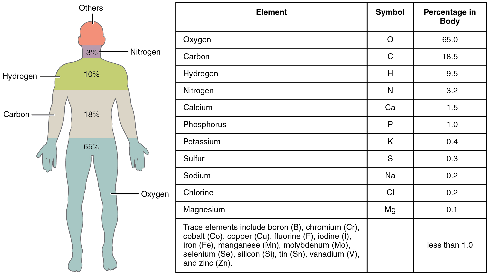
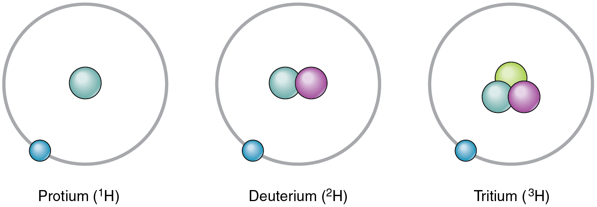

By the end of this section, you will be able to:
* Discuss the relationships between matter, mass, elements, compounds, atoms, and subatomic particles
* Distinguish between atomic number and mass number
* Identify the key distinction between isotopes of the same element
* Explain how electrons occupy electron shells and their contribution to an atom’s relative stability

The substance of the universe—from a grain of sand to a star—is called **matter**{: data-type="term"}. Scientists define matter as anything that occupies space and has mass. An object’s mass and its weight are related concepts, but not quite the same. An object’s mass is the amount of matter contained in the object, and the object’s mass is the same whether that object is on Earth or in the zero-gravity environment of outer space. An object’s weight, on the other hand, is its mass as affected by the pull of gravity. Where gravity strongly pulls on an object’s mass its weight is greater than it is where gravity is less strong. An object of a certain mass weighs less on the moon, for example, than it does on Earth because the gravity of the moon is less than that of Earth. In other words, weight is variable, and is influenced by gravity. A piece of cheese that weighs a pound on Earth weighs only a few ounces on the moon.

### Elements and Compounds

All matter in the natural world is composed of one or more of the 92 fundamental substances called elements. An **element**{: data-type="term"} is a pure substance that is distinguished from all other matter by the fact that it cannot be created or broken down by ordinary chemical means. While your body can assemble many of the chemical compounds needed for life from their constituent elements, it cannot make elements. They must come from the environment. A familiar example of an element that you must take in is calcium (Ca++). Calcium is essential to the human body; it is absorbed and used for a number of processes, including strengthening bones. When you consume dairy products your digestive system breaks down the food into components small enough to cross into the bloodstream. Among these is calcium, which, because it is an element, cannot be broken down further. The elemental calcium in cheese, therefore, is the same as the calcium that forms your bones. Some other elements you might be familiar with are oxygen, sodium, and iron. The elements in the human body are shown in [\[link\]](#fig-ch02_01_01), beginning with the most abundant: oxygen (O), carbon (C), hydrogen (H), and nitrogen (N). Each element’s name can be replaced by a one- or two-letter symbol; you will become familiar with some of these during this course. All the elements in your body are derived from the foods you eat and the air you breathe.

{: #fig-ch02_01_01 data-title="Elements of the Human Body "}

In nature, elements rarely occur alone. Instead, they combine to form compounds. A **compound**{: data-type="term"} is a substance composed of two or more elements joined by chemical bonds. For example, the compound glucose is an important body fuel. It is always composed of the same three elements: carbon, hydrogen, and oxygen. Moreover, the elements that make up any given compound always occur in the same relative amounts. In glucose, there are always six carbon and six oxygen units for every twelve hydrogen units. But what, exactly, are these “units” of elements?

### Atoms and Subatomic Particles

An **atom**{: data-type="term"} is the smallest quantity of an element that retains the unique properties of that element. In other words, an atom of hydrogen is a unit of hydrogen—the smallest amount of hydrogen that can exist. As you might guess, atoms are almost unfathomably small. The period at the end of this sentence is millions of atoms wide.

#### Atomic Structure and Energy

Atoms are made up of even smaller subatomic particles, three types of which are important: the **proton**{: data-type="term"}, **neutron**{: data-type="term"}, and **electron**{: data-type="term"}. The number of positively-charged protons and non-charged (“neutral”) neutrons, gives mass to the atom, and the number of each in the nucleus of the atom determine the element. The number of negatively-charged electrons that “spin” around the nucleus at close to the speed of light equals the number of protons. An electron has about 1/2000th the mass of a proton or neutron.

[\[link\]](#fig-ch02_01_02) shows two models that can help you imagine the structure of an atom—in this case, helium (He). In the planetary model, helium’s two electrons are shown circling the nucleus in a fixed orbit depicted as a ring. Although this model is helpful in visualizing atomic structure, in reality, electrons do not travel in fixed orbits, but whiz around the nucleus erratically in a so-called electron cloud.

  In the planetary model, the electrons of helium are shown in fixed orbits, depicted as rings, at a precise distance from the nucleus, somewhat like planets orbiting the sun. (b) In the electron cloud model, the electrons of carbon are shown in the variety of locations they would have at different distances from the nucleus over time."){: #fig-ch02_01_02 data-title="Two Models of Atomic Structure "}

An atom’s protons and electrons carry electrical charges. Protons, with their positive charge, are designated p+. Electrons, which have a negative charge, are designated e–. An atom’s neutrons have no charge: they are electrically neutral. Just as a magnet sticks to a steel refrigerator because their opposite charges attract, the positively charged protons attract the negatively charged electrons. This mutual attraction gives the atom some structural stability. The attraction by the positively charged nucleus helps keep electrons from straying far. The number of protons and electrons within a neutral atom are equal, thus, the atom’s overall charge is balanced.

#### Atomic Number and Mass Number

An atom of carbon is unique to carbon, but a proton of carbon is not. One proton is the same as another, whether it is found in an atom of carbon, sodium (Na), or iron (Fe). The same is true for neutrons and electrons. So, what gives an element its distinctive properties—what makes carbon so different from sodium or iron? The answer is the unique quantity of protons each contains. Carbon by definition is an element whose atoms contain six protons. No other element has exactly six protons in its atoms. Moreover, *all* atoms of carbon, whether found in your liver or in a lump of coal, contain six protons. Thus, the **atomic number**{: data-type="term"}, which is the number of protons in the nucleus of the atom, identifies the element. Because an atom usually has the same number of electrons as protons, the atomic number identifies the usual number of electrons as well.

In their most common form, many elements also contain the same number of neutrons as protons. The most common form of carbon, for example, has six neutrons as well as six protons, for a total of 12 subatomic particles in its nucleus. An element’s **mass number**{: data-type="term"} is the sum of the number of protons and neutrons in its nucleus. So the most common form of carbon’s mass number is 12. (Electrons have so little mass that they do not appreciably contribute to the mass of an atom.) Carbon is a relatively light element. Uranium (U), in contrast, has a mass number of 238 and is referred to as a heavy metal. Its atomic number is 92 (it has 92 protons) but it contains 146 neutrons; it has the most mass of all the naturally occurring elements.

The **periodic table of the elements**{: data-type="term"}, shown in [\[link\]](#fig-ch02_01_03), is a chart identifying the 92 elements found in nature, as well as several larger, unstable elements discovered experimentally. The elements are arranged in order of their atomic number, with hydrogen and helium at the top of the table, and the more massive elements below. The periodic table is a useful device because for each element, it identifies the chemical symbol, the atomic number, and the mass number, while organizing elements according to their propensity to react with other elements. The number of protons and electrons in an element are equal. The number of protons and neutrons may be equal for some elements, but are not equal for all.

 "){: #fig-ch02_01_03 data-title="The Periodic Table of the Elements "}

  
Visit this [website][1] to view the periodic table. In the periodic table of the elements, elements in a single column have the same number of electrons that can participate in a chemical reaction. These electrons are known as “valence electrons.” For example, the elements in the first column all have a single valence electron, an electron that can be “donated” in a chemical reaction with another atom. What is the meaning of a mass number shown in parentheses?

#### Isotopes

Although each element has a unique number of protons, it can exist as different isotopes. An **isotope**{: data-type="term"} is one of the different forms of an element, distinguished from one another by different numbers of neutrons. The standard isotope of carbon is 12C, commonly called carbon twelve. 12C has six protons and six neutrons, for a mass number of twelve. All of the isotopes of carbon have the same number of protons; therefore, 13C has seven neutrons, and 14C has eight neutrons. The different isotopes of an element can also be indicated with the mass number hyphenated (for example, C-12 instead of 12C). Hydrogen has three common isotopes, shown in [\[link\]](#fig-ch02_01_04).

 {: #fig-ch02_01_04 data-title="Isotopes of Hydrogen "}

An isotope that contains more than the usual number of neutrons is referred to as a heavy isotope. An example is 14C. Heavy isotopes tend to be unstable, and unstable isotopes are radioactive. A **radioactive isotope**{: data-type="term"} is an isotope whose nucleus readily decays, giving off subatomic particles and electromagnetic energy. Different radioactive isotopes (also called radioisotopes) differ in their half-life, the time it takes for half of any size sample of an isotope to decay. For example, the half-life of tritium—a radioisotope of hydrogen—is about 12 years, indicating it takes 12 years for half of the tritium nuclei in a sample to decay. Excessive exposure to radioactive isotopes can damage human cells and even cause cancer and birth defects, but when exposure is controlled, some radioactive isotopes can be useful in medicine. For more information, see the Career Connections.

Career Connection

Interventional Radiologist The controlled use of radioisotopes has advanced medical diagnosis and treatment of disease. Interventional radiologists are physicians who treat disease by using minimally invasive techniques involving radiation. Many conditions that could once only be treated with a lengthy and traumatic operation can now be treated non-surgically, reducing the cost, pain, length of hospital stay, and recovery time for patients. For example, in the past, the only options for a patient with one or more tumors in the liver were surgery and chemotherapy (the administration of drugs to treat cancer). Some liver tumors, however, are difficult to access surgically, and others could require the surgeon to remove too much of the liver. Moreover, chemotherapy is highly toxic to the liver, and certain tumors do not respond well to it anyway. In some such cases, an interventional radiologist can treat the tumors by disrupting their blood supply, which they need if they are to continue to grow. In this procedure, called radioembolization, the radiologist accesses the liver with a fine needle, threaded through one of the patient’s blood vessels. The radiologist then inserts tiny radioactive “seeds” into the blood vessels that supply the tumors. In the days and weeks following the procedure, the radiation emitted from the seeds destroys the vessels and directly kills the tumor cells in the vicinity of the treatment.

Radioisotopes emit subatomic particles that can be detected and tracked by imaging technologies. One of the most advanced uses of radioisotopes in medicine is the positron emission tomography (PET) scanner, which detects the activity in the body of a very small injection of radioactive glucose, the simple sugar that cells use for energy. The PET camera reveals to the medical team which of the patient’s tissues are taking up the most glucose. Thus, the most metabolically active tissues show up as bright “hot spots” on the images ([\[link\]](#fig-ch02_01_05)). PET can reveal some cancerous masses because cancer cells consume glucose at a high rate to fuel their rapid reproduction.

{: #fig-ch02_01_05 data-title="PET Scan "}

### The Behavior of Electrons

In the human body, atoms do not exist as independent entities. Rather, they are constantly reacting with other atoms to form and to break down more complex substances. To fully understand anatomy and physiology you must grasp how atoms participate in such reactions. The key is understanding the behavior of electrons.

Although electrons do not follow rigid orbits a set distance away from the atom’s nucleus, they do tend to stay within certain regions of space called electron shells. An **electron shell**{: data-type="term"} is a layer of electrons that encircle the nucleus at a distinct energy level.

The atoms of the elements found in the human body have from one to five electron shells, and all electron shells hold eight electrons except the first shell, which can only hold two. This configuration of electron shells is the same for all atoms. The precise number of shells depends on the number of electrons in the atom. Hydrogen and helium have just one and two electrons, respectively. If you take a look at the periodic table of the elements, you will notice that hydrogen and helium are placed alone on either sides of the top row; they are the only elements that have just one electron shell ([\[link\]](#fig-ch02_01_06)). A second shell is necessary to hold the electrons in all elements larger than hydrogen and helium.

Lithium (Li), whose atomic number is 3, has three electrons. Two of these fill the first electron shell, and the third spills over into a second shell. The second electron shell can accommodate as many as eight electrons. Carbon, with its six electrons, entirely fills its first shell, and half-fills its second. With ten electrons, neon (Ne) entirely fills its two electron shells. Again, a look at the periodic table reveals that all of the elements in the second row, from lithium to neon, have just two electron shells. Atoms with more than ten electrons require more than two shells. These elements occupy the third and subsequent rows of the periodic table.

  With one electron, hydrogen only half-fills its electron shell. Helium also has a single shell, but its two electrons completely fill it. (b) The electrons of carbon completely fill its first electron shell, but only half-fills its second. (c) Neon, an element that does not occur in the body, has 10 electrons, filling both of its electron shells."){: #fig-ch02_01_06 data-title="Electron Shells "}

The factor that most strongly governs the tendency of an atom to participate in chemical reactions is the number of electrons in its valence shell. A **valence shell**{: data-type="term"} is an atom’s outermost electron shell. If the valence shell is full, the atom is stable; meaning its electrons are unlikely to be pulled away from the nucleus by the electrical charge of other atoms. If the valence shell is not full, the atom is reactive; meaning it will tend to react with other atoms in ways that make the valence shell full. Consider hydrogen, with its one electron only half-filling its valence shell. This single electron is likely to be drawn into relationships with the atoms of other elements, so that hydrogen’s single valence shell can be stabilized.

All atoms (except hydrogen and helium with their single electron shells) are most stable when there are exactly eight electrons in their valence shell. This principle is referred to as the octet rule, and it states that an atom will give up, gain, or share electrons with another atom so that it ends up with eight electrons in its own valence shell. For example, oxygen, with six electrons in its valence shell, is likely to react with other atoms in a way that results in the addition of two electrons to oxygen’s valence shell, bringing the number to eight. When two hydrogen atoms each share their single electron with oxygen, covalent bonds are formed, resulting in a molecule of water, H2O.

In nature, atoms of one element tend to join with atoms of other elements in characteristic ways. For example, carbon commonly fills its valence shell by linking up with four atoms of hydrogen. In so doing, the two elements form the simplest of organic molecules, methane, which also is one of the most abundant and stable carbon-containing compounds on Earth. As stated above, another example is water; oxygen needs two electrons to fill its valence shell. It commonly interacts with two atoms of hydrogen, forming H2O. Incidentally, the name “hydrogen” reflects its contribution to water (hydro- = “water”; -gen = “maker”). Thus, hydrogen is the “water maker.”

### Chapter Review

The human body is composed of elements, the most abundant of which are oxygen (O), carbon (C), hydrogen (H) and nitrogen (N). You obtain these elements from the foods you eat and the air you breathe. The smallest unit of an element that retains all of the properties of that element is an atom. But, atoms themselves contain many subatomic particles, the three most important of which are protons, neutrons, and electrons. These particles do not vary in quality from one element to another; rather, what gives an element its distinctive identification is the quantity of its protons, called its atomic number. Protons and neutrons contribute nearly all of an atom’s mass; the number of protons and neutrons is an element’s mass number. Heavier and lighter versions of the same element can occur in nature because these versions have different numbers of neutrons. Different versions of an element are called isotopes.

The tendency of an atom to be stable or to react readily with other atoms is largely due to the behavior of the electrons within the atom’s outermost electron shell, called its valence shell. Helium, as well as larger atoms with eight electrons in their valence shell, is unlikely to participate in chemical reactions because they are stable. All other atoms tend to accept, donate, or share electrons in a process that brings the electrons in their valence shell to eight (or in the case of hydrogen, to two).

### Interactive Link Questions

Visit this [website][1] to view the periodic table. In the periodic table of the elements, elements in a single column have the same number of electrons that can participate in a chemical reaction. These electrons are known as “valence electrons.” For example, the elements in the first column all have a single valence electron—an electron that can be “donated” in a chemical reaction with another atom. What is the meaning of a mass number shown in parentheses?

The mass number is the total number of protons and neutrons in the nucleus of an atom.

### Review Questions

Together, just four elements make up more than 95 percent of the body’s mass. These include \_\_\_\_\_\_\_\_.

1.  calcium, magnesium, iron, and carbon
2.  oxygen, calcium, iron, and nitrogen
3.  sodium, chlorine, carbon, and hydrogen
4.  oxygen, carbon, hydrogen, and nitrogen
{: type="a"}

D

The smallest unit of an element that still retains the distinctive behavior of that element is an \_\_\_\_\_\_\_\_.

1.  electron
2.  atom
3.  elemental particle
4.  isotope
{: type="a"}

B

The characteristic that gives an element its distinctive properties is its number of \_\_\_\_\_\_\_\_.

1.  protons
2.  neutrons
3.  electrons
4.  atoms
{: type="a"}

A

On the periodic table of the elements, mercury (Hg) has an atomic number of 80 and a mass number of 200.59. It has seven stable isotopes. The most abundant of these probably have \_\_\_\_\_\_\_\_.

1.  about 80 neutrons each
2.  fewer than 80 neutrons each
3.  more than 80 neutrons each
4.  more electrons than neutrons
{: type="a"}

C

Nitrogen has an atomic number of seven. How many electron shells does it likely have?

1.  one
2.  two
3.  three
4.  four
{: type="a"}

B

### Critical Thinking Questions

The most abundant elements in the foods and beverages you consume are oxygen, carbon, hydrogen, and nitrogen. Why might having these elements in consumables be useful?

These four elements—oxygen, carbon, hydrogen, and nitrogen—together make up more than 95 percent of the mass of the human body, and the body cannot make elements, so it is helpful to have them in consumables.

Oxygen, whose atomic number is eight, has three stable isotopes: 16O, 17O, and 18O. Explain what this means in terms of the number of protons and neutrons.

Oxygen has eight protons. In its most abundant stable form, it has eight neutrons, too, for a mass number of 16. In contrast, 17O has nine neutrons, and 18O has 10 neutrons.

Magnesium is an important element in the human body, especially in bones. Magnesium’s atomic number is 12. Is it stable or reactive? Why? If it were to react with another atom, would it be more likely to accept or to donate one or more electrons?

Magnesium’s 12 electrons are distributed as follows: two in the first shell, eight in the second shell, and two in its valence shell. According to the octet rule, magnesium is unstable (reactive) because its valence shell has just two electrons. It is therefore likely to participate in chemical reactions in which it donates two electrons.

### Glossary
{: data-type="glossary-title"}

atom
: smallest unit of an element that retains the unique properties of that element
^

atomic number
: number of protons in the nucleus of an atom
^

compound
: substance composed of two or more different elements joined by chemical bonds
^

electron
: subatomic particle having a negative charge and nearly no mass; found orbiting the atom’s nucleus
^

electron shell
: area of space a given distance from an atom’s nucleus in which electrons are grouped
^

element
: substance that cannot be created or broken down by ordinary chemical means
^

isotope
: one of the variations of an element in which the number of neutrons differ from each other
^

mass number
: sum of the number of protons and neutrons in the nucleus of an atom
^

matter
: physical substance; that which occupies space and has mass
^

neutron
: heavy subatomic particle having no electrical charge and found in the atom’s nucleus
^

periodic table of the elements
: arrangement of the elements in a table according to their atomic number; elements having similar properties because of their electron arrangements compose columns in the table, while elements having the same number of valence shells compose rows in the table
^

proton
: heavy subatomic particle having a positive charge and found in the atom’s nucleus
^

radioactive isotope
: unstable, heavy isotope that gives off subatomic particles, or electromagnetic energy, as it decays; also called radioisotopes
^

valence shell
: outermost electron shell of an atom

[1]: http://openstax.org/l/ptable
