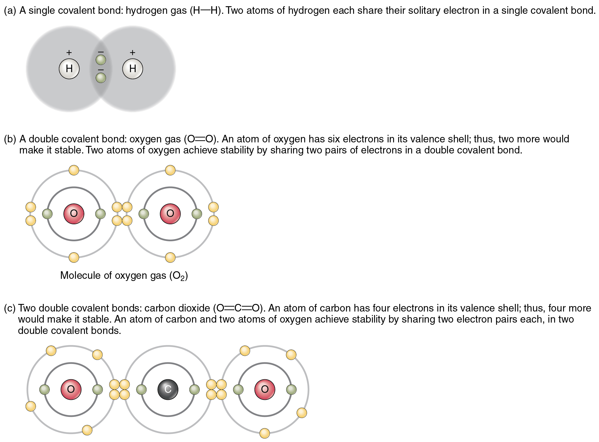

By the end of this section, you will be able to:
* Explain the relationship between molecules and compounds
* Distinguish between ions, cations, and anions
* Identify the key difference between ionic and covalent bonds
* Distinguish between nonpolar and polar covalent bonds
* Explain how water molecules link via hydrogen bonds

Atoms separated by a great distance cannot link; rather, they must come close enough for the electrons in their valence shells to interact. But do atoms ever actually touch one another? Most physicists would say no, because the negatively charged electrons in their valence shells repel one another. No force within the human body—or anywhere in the natural world—is strong enough to overcome this electrical repulsion. So when you read about atoms linking together or colliding, bear in mind that the atoms are not merging in a physical sense.

Instead, atoms link by forming a chemical bond. A **bond**{: data-type="term"} is a weak or strong electrical attraction that holds atoms in the same vicinity. The new grouping is typically more stable—less likely to react again—than its component atoms were when they were separate. A more or less stable grouping of two or more atoms held together by chemical bonds is called a **molecule**{: data-type="term"}. The bonded atoms may be of the same element, as in the case of H2, which is called molecular hydrogen or hydrogen gas. When a molecule is made up of two or more atoms of different elements, it is called a chemical **compound**{: data-type="term"}. Thus, a unit of water, or H2O, is a compound, as is a single molecule of the gas methane, or CH4.

Three types of chemical bonds are important in human physiology, because they hold together substances that are used by the body for critical aspects of homeostasis, signaling, and energy production, to name just a few important processes. These are ionic bonds, covalent bonds, and hydrogen bonds.

# Ions and Ionic Bonds

Recall that an atom typically has the same number of positively charged protons and negatively charged electrons. As long as this situation remains, the atom is electrically neutral. But when an atom participates in a chemical reaction that results in the donation or acceptance of one or more electrons, the atom will then become positively or negatively charged. This happens frequently for most atoms in order to have a full valence shell, as described previously. This can happen either by gaining electrons to fill a shell that is more than half-full, or by giving away electrons to empty a shell than is less than half-full, thereby leaving the next smaller electron shell as the new, full, valence shell. An atom that has an electrical charge—whether positive or negative—is an **ion**{: data-type="term"}.

  
Visit this [website][1] to learn about electrical energy and the attraction/repulsion of charges. What happens to the charged electroscope when a conductor is moved between its plastic sheets, and why?

Potassium (K), for instance, is an important element in all body cells. Its atomic number is 19. It has just one electron in its valence shell. This characteristic makes potassium highly likely to participate in chemical reactions in which it donates one electron. (It is easier for potassium to donate one electron than to gain seven electrons.) The loss will cause the positive charge of potassium’s protons to be more influential than the negative charge of potassium’s electrons. In other words, the resulting potassium ion will be slightly positive. A potassium ion is written K+, indicating that it has lost a single electron. A positively charged ion is known as a **cation**{: data-type="term"}.

Now consider fluorine (F), a component of bones and teeth. Its atomic number is nine, and it has seven electrons in its valence shell. Thus, it is highly likely to bond with other atoms in such a way that fluorine accepts one electron (it is easier for fluorine to gain one electron than to donate seven electrons). When it does, its electrons will outnumber its protons by one, and it will have an overall negative charge. The ionized form of fluorine is called fluoride, and is written as F–. A negatively charged ion is known as an **anion**{: data-type="term"}.

Atoms that have more than one electron to donate or accept will end up with stronger positive or negative charges. A cation that has donated two electrons has a net charge of +2. Using magnesium (Mg) as an example, this can be written Mg++ or Mg2+. An anion that has accepted two electrons has a net charge of –2. The ionic form of selenium (Se), for example, is typically written Se2–.

The opposite charges of cations and anions exert a moderately strong mutual attraction that keeps the atoms in close proximity forming an ionic bond. An **ionic bond**{: data-type="term"} is an ongoing, close association between ions of opposite charge. The table salt you sprinkle on your food owes its existence to ionic bonding. As shown in [\[link\]](#fig-ch02_02_01), sodium commonly donates an electron to chlorine, becoming the cation Na+. When chlorine accepts the electron, it becomes the chloride anion, Cl–. With their opposing charges, these two ions strongly attract each other.

 Sodium readily donates the solitary electron in its valence shell to chlorine, which needs only one electron to have a full valence shell. (b) The opposite electrical charges of the resulting sodium cation and chloride anion result in the formation of a bond of attraction called an ionic bond. (c) The attraction of many sodium and chloride ions results in the formation of large groupings called crystals."){: #fig-ch02_02_01 data-title="Ionic Bonding "}

Water is an essential component of life because it is able to break the ionic bonds in salts to free the ions. In fact, in biological fluids, most individual atoms exist as ions. These dissolved ions produce electrical charges within the body. The behavior of these ions produces the tracings of heart and brain function observed as waves on an electrocardiogram (EKG or ECG) or an electroencephalogram (EEG). The electrical activity that derives from the interactions of the charged ions is why they are also called electrolytes.

# Covalent Bonds

Unlike ionic bonds formed by the attraction between a cation’s positive charge and an anion’s negative charge, molecules formed by a **covalent bond**{: data-type="term"} share electrons in a mutually stabilizing relationship. Like next-door neighbors whose kids hang out first at one home and then at the other, the atoms do not lose or gain electrons permanently. Instead, the electrons move back and forth between the elements. Because of the close sharing of pairs of electrons (one electron from each of two atoms), covalent bonds are stronger than ionic bonds.

## Nonpolar Covalent Bonds

[\[link\]](#fig-ch02_02_02) shows several common types of covalent bonds. Notice that the two covalently bonded atoms typically share just one or two electron pairs, though larger sharings are possible. The important concept to take from this is that in covalent bonds, electrons in the outermost valence shell are shared to fill the valence shells of both atoms, ultimately stabilizing both of the atoms involved. In a single covalent bond, a single electron is shared between two atoms, while in a double covalent bond, two pairs of electrons are shared between two atoms. There even are triple covalent bonds, where three atoms are shared.

 {: #fig-ch02_02_02 data-title="Covalent Bonding "}

You can see that the covalent bonds shown in [\[link\]](#fig-ch02_02_02) are balanced. The sharing of the negative electrons is relatively equal, as is the electrical pull of the positive protons in the nucleus of the atoms involved. This is why covalently bonded molecules that are electrically balanced in this way are described as nonpolar; that is, no region of the molecule is either more positive or more negative than any other.

## Polar Covalent Bonds

Groups of legislators with completely opposite views on a particular issue are often described as “polarized” by news writers. In chemistry, a **polar molecule**{: data-type="term"} is a molecule that contains regions that have opposite electrical charges. Polar molecules occur when atoms share electrons unequally, in polar covalent bonds.

The most familiar example of a polar molecule is water ([\[link\]](#fig-ch02_02_03)). The molecule has three parts: one atom of oxygen, the nucleus of which contains eight protons, and two hydrogen atoms, whose nuclei each contain only one proton. Because every proton exerts an identical positive charge, a nucleus that contains eight protons exerts a charge eight times greater than a nucleus that contains one proton. This means that the negatively charged electrons present in the water molecule are more strongly attracted to the oxygen nucleus than to the hydrogen nuclei. Each hydrogen atom’s single negative electron therefore migrates toward the oxygen atom, making the oxygen end of their bond slightly more negative than the hydrogen end of their bond.

 {: #fig-ch02_02_03 data-title="Polar Covalent Bonds in a Water Molecule "}

What is true for the bonds is true for the water molecule as a whole; that is, the oxygen region has a slightly negative charge and the regions of the hydrogen atoms have a slightly positive charge. These charges are often referred to as “partial charges” because the strength of the charge is less than one full electron, as would occur in an ionic bond. As shown in [\[link\]](#fig-ch02_02_03), regions of weak polarity are indicated with the Greek letter delta (δ) and a plus (+) or minus (–) sign.

Even though a single water molecule is unimaginably tiny, it has mass, and the opposing electrical charges on the molecule pull that mass in such a way that it creates a shape somewhat like a triangular tent (see [\[link\]](#fig-ch02_02_03)**b**). This dipole, with the positive charges at one end formed by the hydrogen atoms at the “bottom” of the tent and the negative charge at the opposite end (the oxygen atom at the “top” of the tent) makes the charged regions highly likely to interact with charged regions of other polar molecules. For human physiology, the resulting bond is one of the most important formed by water—the hydrogen bond.

# Hydrogen Bonds

A **hydrogen bond**{: data-type="term"} is formed when a weakly positive hydrogen atom already bonded to one electronegative atom (for example, the oxygen in the water molecule) is attracted to another electronegative atom from another molecule. In other words, hydrogen bonds always include hydrogen that is already part of a polar molecule.

The most common example of hydrogen bonding in the natural world occurs between molecules of water. It happens before your eyes whenever two raindrops merge into a larger bead, or a creek spills into a river. Hydrogen bonding occurs because the weakly negative oxygen atom in one water molecule is attracted to the weakly positive hydrogen atoms of two other water molecules ([\[link\]](#fig-ch02_02_04)).

 line."){: #fig-ch02_02_04 data-title="Hydrogen Bonds between Water Molecules "}

Water molecules also strongly attract other types of charged molecules as well as ions. This explains why “table salt,” for example, actually is a molecule called a “salt” in chemistry, which consists of equal numbers of positively-charged sodium (Na+) and negatively-charged chloride (Cl–), dissolves so readily in water, in this case forming dipole-ion bonds between the water and the electrically-charged ions (electrolytes). Water molecules also repel molecules with nonpolar covalent bonds, like fats, lipids, and oils. You can demonstrate this with a simple kitchen experiment: pour a teaspoon of vegetable oil, a compound formed by nonpolar covalent bonds, into a glass of water. Instead of instantly dissolving in the water, the oil forms a distinct bead because the polar water molecules repel the nonpolar oil.

# Chapter Review

Each moment of life, atoms of oxygen, carbon, hydrogen, and the other elements of the human body are making and breaking chemical bonds. Ions are charged atoms that form when an atom donates or accepts one or more negatively charged electrons. Cations (ions with a positive charge) are attracted to anions (ions with a negative charge). This attraction is called an ionic bond. In covalent bonds, the participating atoms do not lose or gain electrons, but rather share them. Molecules with nonpolar covalent bonds are electrically balanced, and have a linear three-dimensional shape. Molecules with polar covalent bonds have “poles”—regions of weakly positive and negative charge—and have a triangular three-dimensional shape. An atom of oxygen and two atoms of hydrogen form water molecules by means of polar covalent bonds. Hydrogen bonds link hydrogen atoms already participating in polar covalent bonds to anions or electronegative regions of other polar molecules. Hydrogen bonds link water molecules, resulting in the properties of water that are important to living things.

# Interactive Link Questions

Visit this [website][1] to learn about electrical energy and the attraction/repulsion of charges. What happens to the charged electroscope when a conductor is moved between its plastic sheets, and why?

The plastic sheets jump to the nail (the conductor), because the conductor takes on electrons from the electroscope, reducing the repellant force of the two sheets.

# Review Questions

Which of the following is a molecule, but *not* a compound?

1.  H2O
2.  2H
3.  H2
4.  H+
{: data-number-style="lower-alpha"}

C

A molecule of ammonia contains one atom of nitrogen and three atoms of hydrogen. These are linked with \_\_\_\_\_\_\_\_.

1.  ionic bonds
2.  nonpolar covalent bonds
3.  polar covalent bonds
4.  hydrogen bonds
{: data-number-style="lower-alpha"}

C

When an atom donates an electron to another atom, it becomes

1.  an ion
2.  an anion
3.  nonpolar
4.  all of the above
{: data-number-style="lower-alpha"}

A

A substance formed of crystals of equal numbers of cations and anions held together by ionic bonds is called a(n) \_\_\_\_\_\_\_\_.

1.  noble gas
2.  salt
3.  electrolyte
4.  dipole
{: data-number-style="lower-alpha"}

B

Which of the following statements about chemical bonds is true?

1.  Covalent bonds are stronger than ionic bonds.
2.  Hydrogen bonds occur between two atoms of hydrogen.
3.  Bonding readily occurs between nonpolar and polar molecules.
4.  A molecule of water is unlikely to bond with an ion.
{: data-number-style="lower-alpha"}

A

# Critical Thinking Questions

Explain why CH4 is one of the most common molecules found in nature. Are the bonds between the atoms ionic or covalent?

A carbon atom has four electrons in its valence shell. According to the octet rule, it will readily participate in chemical reactions that result in its valence shell having eight electrons. Hydrogen, with one electron, will complete its valence shell with two. Electron sharing between an atom of carbon and four atoms of hydrogen meets the requirements of all atoms. The bonds are covalent because the electrons are shared: although hydrogen often participates in ionic bonds, carbon does not because it is highly unlikely to donate or accept four electrons.

In a hurry one day, you merely rinse your lunch dishes with water. As you are drying your salad bowl, you notice that it still has an oily film. Why was the water alone not effective in cleaning the bowl?

Water is a polar molecule. It has a region of weakly positive charge and a region of weakly negative charge. These regions are attracted to ions as well as to other polar molecules. Oils are nonpolar, and are repelled by water.

Could two atoms of oxygen engage in ionic bonding? Why or why not?

Identical atoms have identical electronegativity and cannot form ionic bonds. Oxygen, for example, has six electrons in its valence shell. Neither donating nor accepting the valence shell electrons of the other will result in the oxygen atoms completing their valence shells. Two atoms of the same element always form covalent bonds.

## Glossary
{: data-type="glossary-title"}

anion
: atom with a negative charge
{: .definition}

bond
: electrical force linking atoms
{: .definition}

cation
: atom with a positive charge
{: .definition}

covalent bond
: chemical bond in which two atoms share electrons, thereby completing their valence shells
{: .definition}

hydrogen bond
: dipole-dipole bond in which a hydrogen atom covalently bonded to an electronegative atom is weakly attracted to a second electronegative atom
{: .definition}

ion
: atom with an overall positive or negative charge
{: .definition}

ionic bond
: attraction between an anion and a cation
{: .definition}

molecule
: two or more atoms covalently bonded together
{: .definition}

polar molecule
: molecule with regions that have opposite charges resulting from uneven numbers of electrons in the nuclei of the atoms participating in the covalent bond
{: .definition}

[1]: http://openstaxcollege.org/l/electenergy
