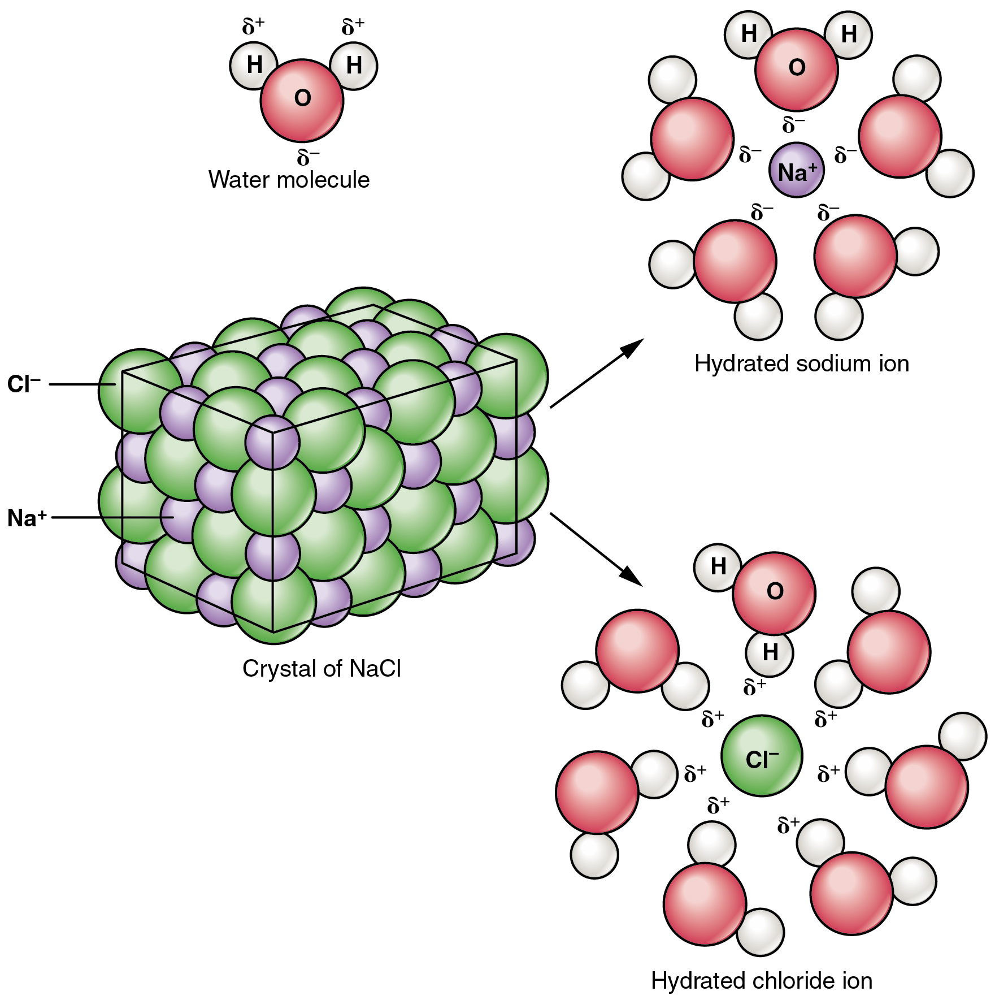

By the end of this section, you will be able to:
* Compare and contrast inorganic and organic compounds
* Identify the properties of water that make it essential to life
* Explain the role of salts in body functioning
* Distinguish between acids and bases, and explain their role in pH
* Discuss the role of buffers in helping the body maintain pH homeostasis

The concepts you have learned so far in this chapter govern all forms of matter, and would work as a foundation for geology as well as biology. This section of the chapter narrows the focus to the chemistry of human life; that is, the compounds important for the body’s structure and function. In general, these compounds are either inorganic or organic.

* An<strong data-type="term"> inorganic compound</strong> is a substance that does not contain both carbon and hydrogen. A great many inorganic compounds do contain hydrogen atoms, such as water (H2O) and the hydrochloric acid (HCl) produced by your stomach. In contrast, only a handful of inorganic compounds contain carbon atoms. Carbon dioxide (CO2) is one of the few examples.
* An<strong data-type="term"> organic compound</strong>, then, is a substance that contains both carbon and hydrogen. Organic compounds are synthesized via covalent bonds within living organisms, including the human body. Recall that carbon and hydrogen are the second and third most abundant elements in your body. You will soon discover how these two elements combine in the foods you eat, in the compounds that make up your body structure, and in the chemicals that fuel your functioning.

The following section examines the three groups of inorganic compounds essential to life: water, salts, acids, and bases. Organic compounds are covered later in the chapter.

# Water

As much as 70 percent of an adult’s body weight is water. This water is contained both within the cells and between the cells that make up tissues and organs. Its several roles make water indispensable to human functioning.

## Water as a Lubricant and Cushion

Water is a major component of many of the body’s lubricating fluids. Just as oil lubricates the hinge on a door, water in synovial fluid lubricates the actions of body joints, and water in pleural fluid helps the lungs expand and recoil with breathing. Watery fluids help keep food flowing through the digestive tract, and ensure that the movement of adjacent abdominal organs is friction free.

Water also protects cells and organs from physical trauma, cushioning the brain within the skull, for example, and protecting the delicate nerve tissue of the eyes. Water cushions a developing fetus in the mother’s womb as well.

## Water as a Heat Sink

A heat sink is a substance or object that absorbs and dissipates heat but does not experience a corresponding increase in temperature. In the body, water absorbs the heat generated by chemical reactions without greatly increasing in temperature. Moreover, when the environmental temperature soars, the water stored in the body helps keep the body cool. This cooling effect happens as warm blood from the body’s core flows to the blood vessels just under the skin and is transferred to the environment. At the same time, sweat glands release warm water in sweat. As the water evaporates into the air, it carries away heat, and then the cooler blood from the periphery circulates back to the body core.

## Water as a Component of Liquid Mixtures

A mixture is a combination of two or more substances, each of which maintains its own chemical identity. In other words, the constituent substances are not chemically bonded into a new, larger chemical compound. The concept is easy to imagine if you think of powdery substances such as flour and sugar; when you stir them together in a bowl, they obviously do not bond to form a new compound. The room air you breathe is a gaseous mixture, containing three discrete elements—nitrogen, oxygen, and argon—and one compound, carbon dioxide. There are three types of liquid mixtures, all of which contain water as a key component. These are solutions, colloids, and suspensions.

For cells in the body to survive, they must be kept moist in a water-based liquid called a solution. In chemistry, a liquid **solution**{: data-type="term"} consists of a solvent that dissolves a substance called a solute. An important characteristic of solutions is that they are homogeneous; that is, the solute molecules are distributed evenly throughout the solution. If you were to stir a teaspoon of sugar into a glass of water, the sugar would dissolve into sugar molecules separated by water molecules. The ratio of sugar to water in the left side of the glass would be the same as the ratio of sugar to water in the right side of the glass. If you were to add more sugar, the ratio of sugar to water would change, but the distribution—provided you had stirred well—would still be even.

Water is considered the “universal solvent” and it is believed that life cannot exist without water because of this. Water is certainly the most abundant solvent in the body; essentially all of the body’s chemical reactions occur among compounds dissolved in water. Because water molecules are polar, with regions of positive and negative electrical charge, water readily dissolves ionic compounds and polar covalent compounds. Such compounds are referred to as hydrophilic, or “water-loving.” As mentioned above, sugar dissolves well in water. This is because sugar molecules contain regions of hydrogen-oxygen polar bonds, making it hydrophilic. Nonpolar molecules, which do not readily dissolve in water, are called hydrophobic, or “water-fearing.”

## Concentrations of Solutes

Various mixtures of solutes and water are described in chemistry. The concentration of a given solute is the number of particles of that solute in a given space (oxygen makes up about 21 percent of atmospheric air). In the bloodstream of humans, glucose concentration is usually measured in milligram (mg) per deciliter (dL), and in a healthy adult averages about 100 mg/dL. Another method of measuring the concentration of a solute is by its molarilty—which is moles (M) of the molecules per liter (L). The mole of an element is its atomic weight, while a mole of a compound is the sum of the atomic weights of its components, called the molecular weight. An often-used example is calculating a mole of glucose, with the chemical formula C6H12O6. Using the periodic table, the atomic weight of carbon (C) is 12.011 grams (g), and there are six carbons in glucose, for a total atomic weight of 72.066 g. Doing the same calculations for hydrogen (H) and oxygen (O), the molecular weight equals 180.156g (the “gram molecular weight” of glucose). When water is added to make one liter of solution, you have one mole (1M) of glucose. This is particularly useful in chemistry because of the relationship of moles to “Avogadro’s number.” A mole of any solution has the same number of particles in it: 6.02 × 1023. Many substances in the bloodstream and other tissue of the body are measured in thousandths of a mole, or millimoles (mM).

A **colloid**{: data-type="term"} is a mixture that is somewhat like a heavy solution. The solute particles consist of tiny clumps of molecules large enough to make the liquid mixture opaque (because the particles are large enough to scatter light). Familiar examples of colloids are milk and cream. In the thyroid glands, the thyroid hormone is stored as a thick protein mixture also called a colloid.

A **suspension**{: data-type="term"} is a liquid mixture in which a heavier substance is suspended temporarily in a liquid, but over time, settles out. This separation of particles from a suspension is called sedimentation. An example of sedimentation occurs in the blood test that establishes sedimentation rate, or sed rate. The test measures how quickly red blood cells in a test tube settle out of the watery portion of blood (known as plasma) over a set period of time. Rapid sedimentation of blood cells does not normally happen in the healthy body, but aspects of certain diseases can cause blood cells to clump together, and these heavy clumps of blood cells settle to the bottom of the test tube more quickly than do normal blood cells.

## The Role of Water in Chemical Reactions

Two types of chemical reactions involve the creation or the consumption of water: dehydration synthesis and hydrolysis.

* In dehydration synthesis, one reactant gives up an atom of hydrogen and another reactant gives up a hydroxyl group (OH) in the synthesis of a new product. In the formation of their covalent bond, a molecule of water is released as a byproduct ([\[link\]](#fig-ch02_04_01)). This is also sometimes referred to as a condensation reaction.
* In hydrolysis, a molecule of water disrupts a compound, breaking its bonds. The water is itself split into H and OH. One portion of the severed compound then bonds with the hydrogen atom, and the other portion bonds with the hydroxyl group.

These reactions are reversible, and play an important role in the chemistry of organic compounds (which will be discussed shortly).

 . (a) In dehydration synthesis, two monomers are covalently bonded in a reaction in which one gives up a hydroxyl group and the other a hydrogen atom. A molecule of water is released as a byproduct during dehydration reactions. (b) In hydrolysis, the covalent bond between two monomers is split by the addition of a hydrogen atom to one and a hydroxyl group to the other, which requires the contribution of one molecule of water."){: #fig-ch02_04_01 data-title="Dehydration Synthesis and Hydrolysis "}

# Salts

Recall that salts are formed when ions form ionic bonds. In these reactions, one atom gives up one or more electrons, and thus becomes positively charged, whereas the other accepts one or more electrons and becomes negatively charged. You can now define a salt as a substance that, when dissolved in water, dissociates into ions other than H+ or OH–. This fact is important in distinguishing salts from acids and bases, discussed next.

A typical salt, NaCl, dissociates completely in water ([\[link\]](#fig-ch02_04_02)). The positive and negative regions on the water molecule (the hydrogen and oxygen ends respectively) attract the negative chloride and positive sodium ions, pulling them away from each other. Again, whereas nonpolar and polar covalently bonded compounds break apart into molecules in solution, salts dissociate into ions. These ions are electrolytes; they are capable of conducting an electrical current in solution. This property is critical to the function of ions in transmitting nerve impulses and prompting muscle contraction.

 {: #fig-ch02_04_02 data-title="Dissociation of Sodium Chloride in Water "}

Many other salts are important in the body. For example, bile salts produced by the liver help break apart dietary fats, and calcium phosphate salts form the mineral portion of teeth and bones.

# Acids and Bases

Acids and bases, like salts, dissociate in water into electrolytes. Acids and bases can very much change the properties of the solutions in which they are dissolved.

## Acids

An **acid**{: data-type="term"} is a substance that releases hydrogen ions (H+) in solution ([\[link\]](#fig-ch02_04_03)**a**). Because an atom of hydrogen has just one proton and one electron, a positively charged hydrogen ion is simply a proton. This solitary proton is highly likely to participate in chemical reactions. Strong acids are compounds that release all of their H+ in solution; that is, they ionize completely. Hydrochloric acid (HCl), which is released from cells in the lining of the stomach, is a strong acid because it releases all of its H+ in the stomach’s watery environment. This strong acid aids in digestion and kills ingested microbes. Weak acids do not ionize completely; that is, some of their hydrogen ions remain bonded within a compound in solution. An example of a weak acid is vinegar, or acetic acid; it is called acetate after it gives up a proton.

  In aqueous solution, an acid dissociates into hydrogen ions (H+) and anions. Nearly every molecule of a strong acid dissociates, producing a high concentration of H+. (b) In aqueous solution, a base dissociates into hydroxyl ions (OH&#x2013;) and cations. Nearly every molecule of a strong base dissociates, producing a high concentration of OH&#x2013;."){: #fig-ch02_04_03 data-title="Acids and Bases "}

## Bases

A **base**{: data-type="term"} is a substance that releases hydroxyl ions (OH–) in solution, or one that accepts H+ already present in solution (see [\[link\]](#fig-ch02_04_03)**b**). The hydroxyl ions (also known as hydroxide ions) or other basic substances combine with H+ present to form a water molecule, thereby removing H+ and reducing the solution’s acidity. Strong bases release most or all of their hydroxyl ions; weak bases release only some hydroxyl ions or absorb only a few H+. Food mixed with hydrochloric acid from the stomach would burn the small intestine, the next portion of the digestive tract after the stomach, if it were not for the release of bicarbonate (HCO3–), a weak base that attracts H+. Bicarbonate accepts some of the H+ protons, thereby reducing the acidity of the solution.

## The Concept of pH

The relative acidity or alkalinity of a solution can be indicated by its pH. A solution’s **pH**{: data-type="term"} is the negative, base-10 logarithm of the hydrogen ion (H+) concentration of the solution. As an example, a pH 4 solution has an H+ concentration that is ten times greater than that of a pH 5 solution. That is, a solution with a pH of 4 is ten times more acidic than a solution with a pH of 5. The concept of pH will begin to make more sense when you study the pH scale, like that shown in [\[link\]](#fig-ch02_04_04). The scale consists of a series of increments ranging from 0 to 14. A solution with a pH of 7 is considered neutral—neither acidic nor basic. Pure water has a pH of 7. The lower the number below 7, the more acidic the solution, or the greater the concentration of H+. The concentration of hydrogen ions at each pH value is 10 times different than the next pH. For instance, a pH value of 4 corresponds to a proton concentration of 10–4 M, or 0.0001M, while a pH value of 5 corresponds to a proton concentration of 10–5 M, or 0.00001M. The higher the number above 7, the more basic (alkaline) the solution, or the lower the concentration of H+. Human urine, for example, is ten times more acidic than pure water, and HCl is 10,000,000 times more acidic than water.

 {: #fig-ch02_04_04 data-title="The pH Scale "}

## Buffers

The pH of human blood normally ranges from 7.35 to 7.45, although it is typically identified as pH 7.4. At this slightly basic pH, blood can reduce the acidity resulting from the carbon dioxide (CO2) constantly being released into the bloodstream by the trillions of cells in the body. Homeostatic mechanisms (along with exhaling CO2 while breathing) normally keep the pH of blood within this narrow range. This is critical, because fluctuations—either too acidic or too alkaline—can lead to life-threatening disorders.

All cells of the body depend on homeostatic regulation of acid–base balance at a pH of approximately 7.4. The body therefore has several mechanisms for this regulation, involving breathing, the excretion of chemicals in urine, and the internal release of chemicals collectively called buffers into body fluids. A **buffer**{: data-type="term"} is a solution of a weak acid and its conjugate base. A buffer can neutralize small amounts of acids or bases in body fluids. For example, if there is even a slight decrease below 7.35 in the pH of a bodily fluid, the buffer in the fluid—in this case, acting as a weak base—will bind the excess hydrogen ions. In contrast, if pH rises above 7.45, the buffer will act as a weak acid and contribute hydrogen ions.

Homeostatic Imbalances

Acids and Bases Excessive acidity of the blood and other body fluids is known as acidosis. Common causes of acidosis are situations and disorders that reduce the effectiveness of breathing, especially the person’s ability to exhale fully, which causes a buildup of CO2 (and H+) in the bloodstream. Acidosis can also be caused by metabolic problems that reduce the level or function of buffers that act as bases, or that promote the production of acids. For instance, with severe diarrhea, too much bicarbonate can be lost from the body, allowing acids to build up in body fluids. In people with poorly managed diabetes (ineffective regulation of blood sugar), acids called ketones are produced as a form of body fuel. These can build up in the blood, causing a serious condition called diabetic ketoacidosis. Kidney failure, liver failure, heart failure, cancer, and other disorders also can prompt metabolic acidosis.

In contrast, alkalosis is a condition in which the blood and other body fluids are too alkaline (basic). As with acidosis, respiratory disorders are a major cause; however, in respiratory alkalosis, carbon dioxide levels fall too low. Lung disease, aspirin overdose, shock, and ordinary anxiety can cause respiratory alkalosis, which reduces the normal concentration of H+.

Metabolic alkalosis often results from prolonged, severe vomiting, which causes a loss of hydrogen and chloride ions (as components of HCl). Medications also can prompt alkalosis. These include diuretics that cause the body to lose potassium ions, as well as antacids when taken in excessive amounts, for instance by someone with persistent heartburn or an ulcer.

# Chapter Review

Inorganic compounds essential to human functioning include water, salts, acids, and bases. These compounds are inorganic; that is, they do not contain both hydrogen and carbon. Water is a lubricant and cushion, a heat sink, a component of liquid mixtures, a byproduct of dehydration synthesis reactions, and a reactant in hydrolysis reactions. Salts are compounds that, when dissolved in water, dissociate into ions other than H+ or OH–. In contrast, acids release H+ in solution, making it more acidic. Bases accept H+, thereby making the solution more alkaline (caustic).

The pH of any solution is its relative concentration of H+. A solution with pH 7 is neutral. Solutions with pH below 7 are acids, and solutions with pH above 7 are bases. A change in a single digit on the pH scale (e.g., from 7 to 8) represents a ten-fold increase or decrease in the concentration of H+. In a healthy adult, the pH of blood ranges from 7.35 to 7.45. Homeostatic control mechanisms important for keeping blood in a healthy pH range include chemicals called buffers, weak acids and weak bases released when the pH of blood or other body fluids fluctuates in either direction outside of this normal range.

# Review Questions

CH4 is methane. This compound is \_\_\_\_\_\_\_\_.

1.  inorganic
2.  organic
3.  reactive
4.  a crystal
{: data-number-style="lower-alpha"}

B

Which of the following is most likely to be found evenly distributed in water in a homogeneous solution?

1.  sodium ions and chloride ions
2.  NaCl molecules
3.  salt crystals
4.  red blood cells
{: data-number-style="lower-alpha"}

A

Jenny mixes up a batch of pancake batter, then stirs in some chocolate chips. As she is waiting for the first few pancakes to cook, she notices the chocolate chips sinking to the bottom of the clear glass mixing bowl. The chocolate-chip batter is an example of a \_\_\_\_\_\_\_\_.

1.  solvent
2.  solute
3.  solution
4.  suspension
{: data-number-style="lower-alpha"}

D

A substance dissociates into K+ and Cl– in solution. The substance is a(n) \_\_\_\_\_\_\_\_.

1.  acid
2.  base
3.  salt
4.  buffer
{: data-number-style="lower-alpha"}

C

Ty is three years old and as a result of a “stomach bug” has been vomiting for about 24 hours. His blood pH is 7.48. What does this mean?

1.  Ty’s blood is slightly acidic.
2.  Ty’s blood is slightly alkaline.
3.  Ty’s blood is highly acidic.
4.  Ty’s blood is within the normal range
{: data-number-style="lower-alpha"}

B

# Critical Thinking Questions

The pH of lemon juice is 2, and the pH of orange juice is 4. Which of these is more acidic, and by how much? What does this mean?

Lemon juice is one hundred times more acidic than orange juice. This means that lemon juice has a one hundred-fold greater concentration of hydrogen ions.

During a party, Eli loses a bet and is forced to drink a bottle of lemon juice. Not long thereafter, he begins complaining of having difficulty breathing, and his friends take him to the local emergency room. There, he is given an intravenous solution of bicarbonate. Why?

Lemon juice, like any acid, releases hydrogen ions in solution. As excessive H+ enters the digestive tract and is absorbed into blood, Eli’s blood pH falls below 7.35. Recall that bicarbonate is a buffer, a weak base that accepts hydrogen ions. By administering bicarbonate intravenously, the emergency department physician helps raise Eli’s blood pH back toward neutral.

## Glossary
{: data-type="glossary-title"}

acid
: compound that releases hydrogen ions (H+) in solution
{: .definition}

base
: compound that accepts hydrogen ions (H+) in solution
{: .definition}

buffer
: solution containing a weak acid or a weak base that opposes wide fluctuations in the pH of body fluids
{: .definition}

colloid
: liquid mixture in which the solute particles consist of clumps of molecules large enough to scatter light
{: .definition}

inorganic compound
: substance that does not contain both carbon and hydrogen
{: .definition}

organic compound
: substance that contains both carbon and hydrogen
{: .definition}

pH
: negative logarithm of the hydrogen ion (H+) concentration of a solution
{: .definition}

solution
: homogeneous liquid mixture in which a solute is dissolved into molecules within a solvent
{: .definition}

suspension
: liquid mixture in which particles distributed in the liquid settle out over time
{: .definition}

