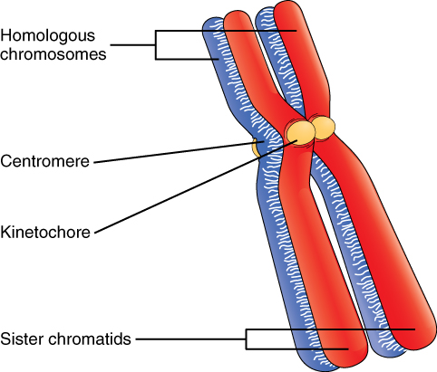
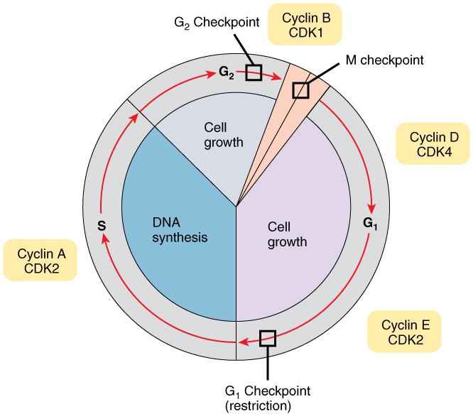

By the end of this section, you will be able to:
* Describe the stages of the cell cycle
* Discuss how the cell cycle is regulated
* Describe the implications of losing control over the cell cycle
* Describe the stages of mitosis and cytokinesis, in order

So far in this chapter, you have read numerous times of the importance and prevalence of cell division. While there are a few cells in the body that do not undergo cell division (such as gametes, red blood cells, most neurons, and some muscle cells), most somatic cells divide regularly. A **somatic cell**{: data-type="term"} is a general term for a body cell, and all human cells, except for the cells that produce eggs and sperm (which are referred to as germ cells), are somatic cells. Somatic cells contain <em>two </em>copies of each of their chromosomes (one copy received from each parent). A **homologous**{: data-type="term"} pair of chromosomes is the two copies of a single chromosome found in each somatic cell. The human is a **diploid**{: data-type="term"} organism, having 23 homologous pairs of chromosomes in each of the somatic cells. The condition of having pairs of chromosomes is known as diploidy.

Cells in the body replace themselves over the lifetime of a person. For example, the cells lining the gastrointestinal tract must be frequently replaced when constantly “worn off” by the movement of food through the gut. But what triggers a cell to divide, and how does it prepare for and complete cell division? The **cell cycle**{: data-type="term"} is the sequence of events in the life of the cell from the moment it is created at the end of a previous cycle of cell division until it then divides itself, generating two new cells.

### The Cell Cycle

One “turn” or cycle of the cell cycle consists of two general phases: interphase, followed by mitosis and cytokinesis. **Interphase**{: data-type="term"} is the period of the cell cycle during which the cell is not dividing. The majority of cells are in interphase most of the time. **Mitosis**{: data-type="term"} is the division of genetic material, during which the cell nucleus breaks down and two new, fully functional, nuclei are formed. **Cytokinesis**{: data-type="term"} divides the cytoplasm into two distinctive cells.

#### Interphase

A cell grows and carries out all normal metabolic functions and processes in a period called G1 ([\[link\]](#fig-ch03_05_01)). **G1 phase**{: data-type="term"} (gap 1 phase) is the first gap, or growth phase in the cell cycle. For cells that will divide again, G1 is followed by replication of the DNA, during the S phase. The **S phase**{: data-type="term"} (synthesis phase) is period during which a cell replicates its DNA.

 , and interphase, when the cell grows and performs all of its normal functions. Interphase is further subdivided into G1, S, and G2 phases."){: #fig-ch03_05_01 data-title="Cell Cycle"}

After the synthesis phase, the cell proceeds through the G2 phase. The **G2 phase**{: data-type="term"} is a second gap phase, during which the cell continues to grow and makes the necessary preparations for mitosis. Between G1, S, and G2 phases, cells will vary the most in their duration of the G1 phase. It is here that a cell might spend a couple of hours, or many days. The S phase typically lasts between 8-10 hours and the G2 phase approximately 5 hours. In contrast to these phases, the **G0 phase**{: data-type="term"} is a resting phase of the cell cycle. Cells that have temporarily stopped dividing and are resting (a common condition) and cells that have permanently ceased dividing (like nerve cells) are said to be in G0.

#### The Structure of Chromosomes

Billions of cells in the human body divide every day. During the synthesis phase (S, for DNA synthesis) of interphase, the amount of DNA within the cell precisely doubles. Therefore, after DNA replication but before cell division, each cell actually contains <em>two </em>copies of each chromosome. Each copy of the chromosome is referred to as a **sister chromatid**{: data-type="term"} and is physically bound to the other copy. The **centromere**{: data-type="term"} is the structure that attaches one sister chromatid to another. Because a human cell has 46 chromosomes, during this phase, there are 92 chromatids (46 × 2) in the cell. Make sure not to confuse the concept of a pair of chromatids (one chromosome and its exact copy attached during mitosis) and a homologous pair of chromosomes (two paired chromosomes which were inherited separately, one from each parent) ([\[link\]](#fig-ch03_05_02)).

 {: #fig-ch03_05_02 data-title="A Homologous Pair of Chromosomes with their Attached Sister Chromatids"}

#### Mitosis and Cytokinesis

The **mitotic phase**{: data-type="term"} of the cell typically takes between 1 and 2 hours. During this phase, a cell undergoes two major processes. First, it completes mitosis, during which the contents of the nucleus are equitably pulled apart and distributed between its two halves. Cytokinesis then occurs, dividing the cytoplasm and cell body into two new cells. Mitosis is divided into four major stages that take place after interphase ([\[link\]](#fig-ch03_05_03)) and in the following order: prophase, metaphase, anaphase, and telophase. The process is then followed by cytokinesis.

 {: #fig-ch03_05_03 data-title="Cell Division: Mitosis Followed by Cytokinesis"}

**Prophase**{: data-type="term"} is the first phase of mitosis, during which the loosely packed chromatin coils and condenses into visible chromosomes. During prophase, each chromosome becomes visible with its identical partner attached, forming the familiar X-shape of sister chromatids. The nucleolus disappears early during this phase, and the nuclear envelope also disintegrates.

A major occurrence during prophase concerns a very important structure that contains the origin site for microtubule growth. Recall the cellular structures called centrioles that serve as origin points from which microtubules extend. These tiny structures also play a very important role during mitosis. A **centrosome**{: data-type="term"} is a pair of centrioles together. The cell contains two centrosomes side-by-side, which begin to move apart during prophase. As the centrosomes migrate to two different sides of the cell, microtubules begin to extend from each like long fingers from two hands extending toward each other. The **mitotic spindle**{: data-type="term"} is the structure composed of the centrosomes and their emerging microtubules.

Near the end of prophase there is an invasion of the nuclear area by microtubules from the mitotic spindle. The nuclear membrane has disintegrated, and the microtubules attach themselves to the centromeres that adjoin pairs of sister chromatids. The **kinetochore**{: data-type="term"} is a protein structure on the centromere that is the point of attachment between the mitotic spindle and the sister chromatids. This stage is referred to as late prophase or “prometaphase” to indicate the transition between prophase and metaphase.

**Metaphase**{: data-type="term"} is the second stage of mitosis. During this stage, the sister chromatids, with their attached microtubules, line up along a linear plane in the middle of the cell. A metaphase plate forms between the centrosomes that are now located at either end of the cell. The **metaphase plate**{: data-type="term"} is the name for the plane through the center of the spindle on which the sister chromatids are positioned. The microtubules are now poised to pull apart the sister chromatids and bring one from each pair to each side of the cell.

**Anaphase**{: data-type="term"} is the third stage of mitosis. Anaphase takes place over a few minutes, when the pairs of sister chromatids are separated from one another, forming individual chromosomes once again. These chromosomes are pulled to opposite ends of the cell by their kinetochores, as the microtubules shorten. Each end of the cell receives one partner from each pair of sister chromatids, ensuring that the two new daughter cells will contain identical genetic material.

**Telophase**{: data-type="term"} is the final stage of mitosis. Telophase is characterized by the formation of two new daughter nuclei at either end of the dividing cell. These newly formed nuclei surround the genetic material, which uncoils such that the chromosomes return to loosely packed chromatin. Nucleoli also reappear within the new nuclei, and the mitotic spindle breaks apart, each new cell receiving its own complement of DNA, organelles, membranes, and centrioles. At this point, the cell is already beginning to split in half as cytokinesis begins.

The **cleavage furrow**{: data-type="term"} is a contractile band made up of microfilaments that forms around the midline of the cell during cytokinesis. (Recall that microfilaments consist of actin.) This contractile band squeezes the two cells apart until they finally separate. Two new cells are now formed. One of these cells (the “stem cell”) enters its own cell cycle; able to grow and divide again at some future time. The other cell transforms into the functional cell of the tissue, typically replacing an “old” cell there.

Imagine a cell that completed mitosis but never underwent cytokinesis. In some cases, a cell may divide its genetic material and grow in size, but fail to undergo cytokinesis. This results in larger cells with more than one nucleus. Usually this is an unwanted aberration and can be a sign of cancerous cells.

### Cell Cycle Control

A very elaborate and precise system of regulation controls direct the way cells proceed from one phase to the next in the cell cycle and begin mitosis. The control system involves molecules within the cell as well as external triggers. These internal and external control triggers provide “stop” and “advance” signals for the cell. Precise regulation of the cell cycle is critical for maintaining the health of an organism, and loss of cell cycle control can lead to cancer.

#### Mechanisms of Cell Cycle Control

As the cell proceeds through its cycle, each phase involves certain processes that must be completed before the cell should advance to the next phase. A **checkpoint**{: data-type="term"} is a point in the cell cycle at which the cycle can be signaled to move forward or stopped. At each of these checkpoints, different varieties of molecules provide the stop or go signals, depending on certain conditions within the cell. A **cyclin**{: data-type="term"} is one of the primary classes of cell cycle control molecules ([\[link\]](#fig-ch03_05_04)). A **cyclin-dependent kinase (CDK)**{: data-type="term"} is one of a group of molecules that work together with cyclins to determine progression past cell checkpoints. By interacting with many additional molecules, these triggers push the cell cycle forward unless prevented from doing so by “stop” signals, if for some reason the cell is not ready. At the G1 checkpoint, the cell must be ready for DNA synthesis to occur. At the G2 checkpoint the cell must be fully prepared for mitosis. Even during mitosis, a crucial stop and go checkpoint in metaphase ensures that the cell is fully prepared to complete cell division. The metaphase checkpoint ensures that all sister chromatids are properly attached to their respective microtubules and lined up at the metaphase plate before the signal is given to separate them during anaphase.

{: #fig-ch03_05_04 data-title="Control of the Cell Cycle"}

#### The Cell Cycle Out of Control: Implications

Most people understand that cancer or tumors are caused by abnormal cells that multiply continuously. If the abnormal cells continue to divide unstopped, they can damage the tissues around them, spread to other parts of the body, and eventually result in death. In healthy cells, the tight regulation mechanisms of the cell cycle prevent this from happening, while failures of cell cycle control can cause unwanted and excessive cell division. Failures of control may be caused by inherited genetic abnormalities that compromise the function of certain “stop” and “go” signals. Environmental insult that damages DNA can also cause dysfunction in those signals. Often, a combination of both genetic predisposition and environmental factors lead to cancer.

The process of a cell escaping its normal control system and becoming cancerous may actually happen throughout the body quite frequently. Fortunately, certain cells of the immune system are capable of recognizing cells that have become cancerous and destroying them. However, in certain cases the cancerous cells remain undetected and continue to proliferate. If the resulting tumor does not pose a threat to surrounding tissues, it is said to be benign and can usually be easily removed. If capable of damage, the tumor is considered malignant and the patient is diagnosed with cancer.

Homeostatic Imbalances

Cancer Arises from Homeostatic Imbalances Cancer is an extremely complex condition, capable of arising from a wide variety of genetic and environmental causes. Typically, mutations or aberrations in a cell’s DNA that compromise normal cell cycle control systems lead to cancerous tumors. Cell cycle control is an example of a homeostatic mechanism that maintains proper cell function and health. While progressing through the phases of the cell cycle, a large variety of intracellular molecules provide stop and go signals to regulate movement forward to the next phase. These signals are maintained in an intricate balance so that the cell only proceeds to the next phase when it is ready. This homeostatic control of the cell cycle can be thought of like a car’s cruise control. Cruise control will continually apply just the right amount of acceleration to maintain a desired speed, unless the driver hits the brakes, in which case the car will slow down. Similarly, the cell includes molecular messengers, such as cyclins, that push the cell forward in its cycle.

In addition to cyclins, a class of proteins that are encoded by genes called proto-oncogenes provide important signals that regulate the cell cycle and move it forward. Examples of proto-oncogene products include cell-surface receptors for growth factors, or cell-signaling molecules, two classes of molecules that can promote DNA replication and cell division. In contrast, a second class of genes known as tumor suppressor genes sends stop signals during a cell cycle. For example, certain protein products of tumor suppressor genes signal potential problems with the DNA and thus stop the cell from dividing, while other proteins signal the cell to die if it is damaged beyond repair. Some tumor suppressor proteins also signal a sufficient surrounding cellular density, which indicates that the cell need not presently divide. The latter function is uniquely important in preventing tumor growth: normal cells exhibit a phenomenon called “contact inhibition;” thus, extensive cellular contact with neighboring cells causes a signal that stops further cell division.

These two contrasting classes of genes, proto-oncogenes and tumor suppressor genes, are like the accelerator and brake pedal of the cell’s own “cruise control system,” respectively. Under normal conditions, these stop and go signals are maintained in a homeostatic balance. Generally speaking, there are two ways that the cell’s cruise control can lose control: a malfunctioning (overactive) accelerator, or a malfunctioning (underactive) brake. When compromised through a mutation, or otherwise altered, proto-oncogenes can be converted to oncogenes, which produce oncoproteins that push a cell forward in its cycle and stimulate cell division even when it is undesirable to do so. For example, a cell that should be programmed to self-destruct (a process called apoptosis) due to extensive DNA damage might instead be triggered to proliferate by an oncoprotein. On the other hand, a dysfunctional tumor suppressor gene may fail to provide the cell with a necessary stop signal, also resulting in unwanted cell division and proliferation.

A delicate homeostatic balance between the many proto-oncogenes and tumor suppressor genes delicately controls the cell cycle and ensures that only healthy cells replicate. Therefore, a disruption of this homeostatic balance can cause aberrant cell division and cancerous growths.

Visit this [link][1] to learn about mitosis. Mitosis results in two identical diploid cells. What structures forms during prophase?

### Chapter Review

The life of cell consists of stages that make up the cell cycle. After a cell is born, it passes through an interphase before it is ready to replicate itself and produce daughter cells. This interphase includes two gap phases (G1 and G2), as well as an S phase, during which its DNA is replicated in preparation for cell division. The cell cycle is under precise regulation by chemical messengers both inside and outside the cell that provide “stop” and “go” signals for movement from one phase to the next. Failures of these signals can result in cells that continue to divide uncontrollably, which can lead to cancer.

Once a cell has completed interphase and is ready for cell division, it proceeds through four separate stages of mitosis (prophase, metaphase, anaphase, and telophase). Telophase is followed by the division of the cytoplasm (cytokinesis), which generates two daughter cells. This process takes place in all normally dividing cells of the body except for the germ cells that produce eggs and sperm.

### Interactive Link Questions

Visit this [link][1] to learn about mitosis. Mitosis results in two identical diploid cells. What structures form during prophase?

the spindle

### Review Questions

Which of the following phases is characterized by preparation for DNA synthesis?

1.  G0
2.  G1
3.  G2
4.  S
{: data-number-style="lower-alpha"}

B

A mutation in the gene for a cyclin protein might result in which of the following?

1.  a cell with additional genetic material than normal
2.  cancer
3.  a cell with less genetic material than normal
4.  any of the above
{: data-number-style="lower-alpha"}

D

What is a primary function of tumor suppressor genes?

1.  stop all cells from dividing
2.  stop certain cells from dividing
3.  help oncogenes produce oncoproteins
4.  allow the cell to skip certain phases of the cell cycle
{: data-number-style="lower-alpha"}

B

### Critical Thinking Questions

What would happen if anaphase proceeded even though the sister chromatids were not properly attached to their respective microtubules and lined up at the metaphase plate?

One or both of the new daughter cells would accidently receive duplicate chromosomes and/or would be missing certain chromosomes.

What are cyclins and cyclin-dependent kinases, and how do they interact?

A cyclin is one of the primary classes of cell cycle control molecules, while a cyclin-dependent kinase (is one of a group of molecules that work together with cyclins to determine progression past cell checkpoints. By interacting with many additional molecules, these triggers push the cell cycle forward unless prevented from doing so by “stop” signals, if for some reason the cell is not ready.

### Glossary
{: data-type="glossary-title"}

anaphase
: third stage of mitosis (and meiosis), during which sister chromatids separate into two new nuclear regions of a dividing cell
^

cell cycle
: life cycle of a single cell, from its birth until its division into two new daughter cells
^

centromere
: region of attachment for two sister chromatids
^

centrosome
: cellular structure that organizes microtubules during cell division
^

checkpoint
: progress point in the cell cycle during which certain conditions must be met in order for the cell to proceed to a subsequence phase
^

cleavage furrow
: contractile ring that forms around a cell during cytokinesis that pinches the cell into two halves
^

cyclin
: one of a group of proteins that function in the progression of the cell cycle
^

cyclin-dependent kinase (CDK)
: one of a group of enzymes associated with cyclins that help them perform their functions
^

cytokinesis
: final stage in cell division, where the cytoplasm divides to form two separate daughter cells
^

diploid
: condition marked by the presence of a double complement of genetic material (two sets of chromosomes, one set inherited from each of two parents)
^

G0 phase
: phase of the cell cycle, usually entered from the G1 phase; characterized by long or permanent periods where the cell does not move forward into the DNA synthesis phase
^

G1 phase
: first phase of the cell cycle, after a new cell is born
^

G2 phase
: third phase of the cell cycle, after the DNA synthesis phase
^

homologous
: describes two copies of the same chromosome (not identical), one inherited from each parent
^

interphase
: entire life cycle of a cell, excluding mitosis
^

kinetochore
: region of a centromere where microtubules attach to a pair of sister chromatids
^

metaphase
: second stage of mitosis (and meiosis), characterized by the linear alignment of sister chromatids in the center of the cell
^

metaphase plate
: linear alignment of sister chromatids in the center of the cell, which takes place during metaphase
^

mitosis
: division of genetic material, during which the cell nucleus breaks down and two new, fully functional, nuclei are formed
^

mitotic phase
: phase of the cell cycle in which a cell undergoes mitosis
^

mitotic spindle
: network of microtubules, originating from centrioles, that arranges and pulls apart chromosomes during mitosis
^

prophase
: first stage of mitosis (and meiosis), characterized by breakdown of the nuclear envelope and condensing of the chromatin to form chromosomes
^

S phase
: stage of the cell cycle during which DNA replication occurs
^

sister chromatid
: one of a pair of identical chromosomes, formed during DNA replication
^

somatic cell
: all cells of the body excluding gamete cells
^

telophase
: final stage of mitosis (and meiosis), preceding cytokinesis, characterized by the formation of two new daughter nuclei

[1]: http://openstaxcollege.org/l/mitosis
