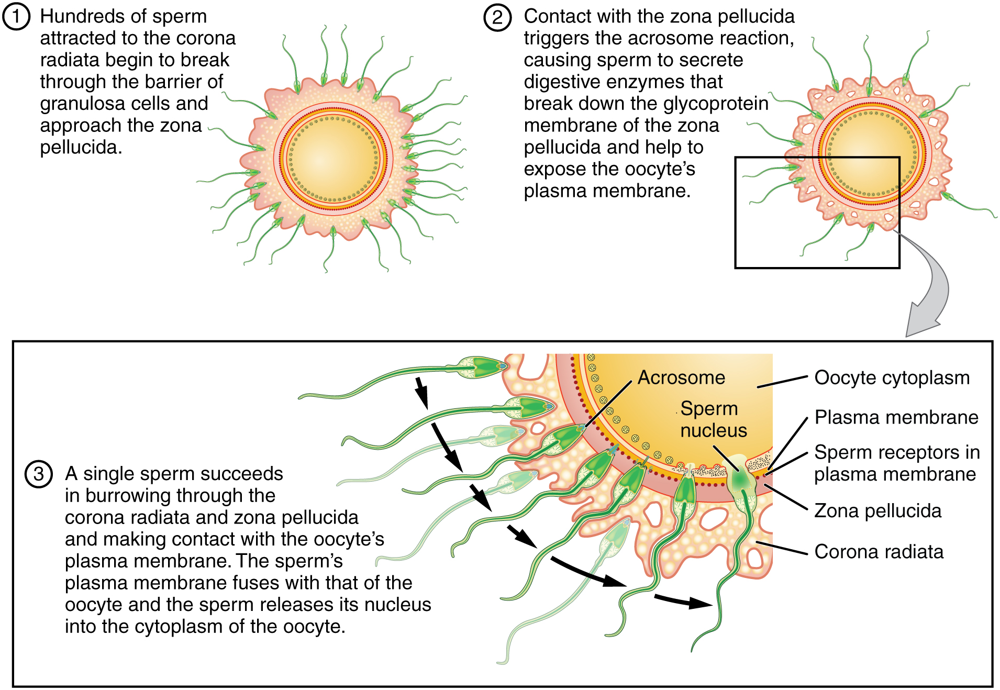

By the end of this section, you will be able to:
* Describe the obstacles that sperm must overcome to reach an oocyte
* Explain capacitation and its importance in fertilization
* Summarize the events that occur as a sperm fertilizes an oocyte

**Fertilization**{: data-type="term"} occurs when a sperm and an oocyte (egg) combine and their nuclei fuse. Because each of these reproductive cells is a haploid cell containing half of the genetic material needed to form a human being, their combination forms a diploid cell. This new single cell, called a **zygote**{: data-type="term"}, contains all of the genetic material needed to form a human—half from the mother and half from the father.

# Transit of Sperm

Fertilization is a numbers game. During ejaculation, hundreds of millions of sperm (spermatozoa) are released into the vagina. Almost immediately, millions of these sperm are overcome by the acidity of the vagina (approximately pH 3.8), and millions more may be blocked from entering the uterus by thick cervical mucus. Of those that do enter, thousands are destroyed by phagocytic uterine leukocytes. Thus, the race into the uterine tubes, which is the most typical site for sperm to encounter the oocyte, is reduced to a few thousand contenders. Their journey—thought to be facilitated by uterine contractions—usually takes from 30 minutes to 2 hours. If the sperm do not encounter an oocyte immediately, they can survive in the uterine tubes for another 3–5 days. Thus, fertilization can still occur if intercourse takes place a few days before ovulation. In comparison, an oocyte can survive independently for only approximately 24 hours following ovulation. Intercourse more than a day after ovulation will therefore usually not result in fertilization.

During the journey, fluids in the female reproductive tract prepare the sperm for fertilization through a process called **capacitation**{: data-type="term"}, or priming. The fluids improve the motility of the spermatozoa. They also deplete cholesterol molecules embedded in the membrane of the head of the sperm, thinning the membrane in such a way that will help facilitate the release of the lysosomal (digestive) enzymes needed for the sperm to penetrate the oocyte’s exterior once contact is made. Sperm must undergo the process of capacitation in order to have the “capacity” to fertilize an oocyte. If they reach the oocyte before capacitation is complete, they will be unable to penetrate the oocyte’s thick outer layer of cells.

# Contact Between Sperm and Oocyte

Upon ovulation, the oocyte released by the ovary is swept into—and along—the uterine tube. Fertilization must occur in the distal uterine tube because an unfertilized oocyte cannot survive the 72-hour journey to the uterus. As you will recall from your study of the oogenesis, this oocyte (specifically a secondary oocyte) is surrounded by two protective layers. The **corona radiata**{: data-type="term"} is an outer layer of follicular (granulosa) cells that form around a developing oocyte in the ovary and remain with it upon ovulation. The underlying **zona pellucida**{: data-type="term"} (pellucid = “transparent”) is a transparent, but thick, glycoprotein membrane that surrounds the cell’s plasma membrane.

As it is swept along the distal uterine tube, the oocyte encounters the surviving capacitated sperm, which stream toward it in response to chemical attractants released by the cells of the corona radiata. To reach the oocyte itself, the sperm must penetrate the two protective layers. The sperm first burrow through the cells of the corona radiata. Then, upon contact with the zona pellucida, the sperm bind to receptors in the zona pellucida. This initiates a process called the **acrosomal reaction**{: data-type="term"} in which the enzyme-filled “cap” of the sperm, called the **acrosome**{: data-type="term"}, releases its stored digestive enzymes. These enzymes clear a path through the zona pellucida that allows sperm to reach the oocyte. Finally, a single sperm makes contact with sperm-binding receptors on the oocyte’s plasma membrane ([\[link\]](#fig-ch29_01_01)). The plasma membrane of that sperm then fuses with the oocyte’s plasma membrane, and the head and mid-piece of the “winning” sperm enter the oocyte interior.

How do sperm penetrate the corona radiata? Some sperm undergo a spontaneous acrosomal reaction, which is an acrosomal reaction not triggered by contact with the zona pellucida. The digestive enzymes released by this reaction digest the extracellular matrix of the corona radiata. As you can see, the first sperm to reach the oocyte is never the one to fertilize it. Rather, hundreds of sperm cells must undergo the acrosomal reaction, each helping to degrade the corona radiata and zona pellucida until a path is created to allow one sperm to contact and fuse with the plasma membrane of the oocyte. If you consider the loss of millions of sperm between entry into the vagina and degradation of the zona pellucida, you can understand why a low sperm count can cause male infertility.

 {: #fig-ch29_01_01 data-title="Sperm and the Process of Fertilization "}

When the first sperm fuses with the oocyte, the oocyte deploys two mechanisms to prevent **polyspermy**{: data-type="term"}, which is penetration by more than one sperm. This is critical because if more than one sperm were to fertilize the oocyte, the resulting zygote would be a triploid organism with three sets of chromosomes. This is incompatible with life.

The first mechanism is the fast block, which involves a near instantaneous change in sodium ion permeability upon binding of the first sperm, depolarizing the oocyte plasma membrane and preventing the fusion of additional sperm cells. The fast block sets in almost immediately and lasts for about a minute, during which time an influx of calcium ions following sperm penetration triggers the second mechanism, the slow block. In this process, referred to as the **cortical reaction**{: data-type="term"}, cortical granules sitting immediately below the oocyte plasma membrane fuse with the membrane and release zonal inhibiting proteins and mucopolysaccharides into the space between the plasma membrane and the zona pellucida. Zonal inhibiting proteins cause the release of any other attached sperm and destroy the oocyte’s sperm receptors, thus preventing any more sperm from binding. The mucopolysaccharides then coat the nascent zygote in an impenetrable barrier that, together with hardened zona pellucida, is called a **fertilization membrane**{: data-type="term"}.

# The Zygote

Recall that at the point of fertilization, the oocyte has not yet completed meiosis; all secondary oocytes remain arrested in metaphase of meiosis II until fertilization. Only upon fertilization does the oocyte complete meiosis. The unneeded complement of genetic material that results is stored in a second polar body that is eventually ejected. At this moment, the oocyte has become an ovum, the female haploid gamete. The two haploid nuclei derived from the sperm and oocyte and contained within the egg are referred to as pronuclei. They decondense, expand, and replicate their DNA in preparation for mitosis. The pronuclei then migrate toward each other, their nuclear envelopes disintegrate, and the male- and female-derived genetic material intermingles. This step completes the process of fertilization and results in a single-celled diploid zygote with all the genetic instructions it needs to develop into a human.

Most of the time, a woman releases a single egg during an ovulation cycle. However, in approximately 1 percent of ovulation cycles, two eggs are released and both are fertilized. Two zygotes form, implant, and develop, resulting in the birth of dizygotic (or fraternal) twins. Because dizygotic twins develop from two eggs fertilized by two sperm, they are no more identical than siblings born at different times.

Much less commonly, a zygote can divide into two separate offspring during early development. This results in the birth of monozygotic (or identical) twins. Although the zygote can split as early as the two-cell stage, splitting occurs most commonly during the early blastocyst stage, with roughly 70–100 cells present. These two scenarios are distinct from each other, in that the twin embryos that separated at the two-cell stage will have individual placentas, whereas twin embryos that form from separation at the blastocyst stage will share a placenta and a chorionic cavity.

Everyday Connections

In Vitro Fertilization IVF, which stands for in vitro fertilization, is an assisted reproductive technology. In vitro, which in Latin translates to “in glass,” refers to a procedure that takes place outside of the body. There are many different indications for IVF. For example, a woman may produce normal eggs, but the eggs cannot reach the uterus because the uterine tubes are blocked or otherwise compromised. A man may have a low sperm count, low sperm motility, sperm with an unusually high percentage of morphological abnormalities, or sperm that are incapable of penetrating the zona pellucida of an egg.

A typical IVF procedure begins with egg collection. A normal ovulation cycle produces only one oocyte, but the number can be boosted significantly (to 10–20 oocytes) by administering a short course of gonadotropins. The course begins with follicle-stimulating hormone (FSH) analogs, which support the development of multiple follicles, and ends with a luteinizing hormone (LH) analog that triggers ovulation. Right before the ova would be released from the ovary, they are harvested using ultrasound-guided oocyte retrieval. In this procedure, ultrasound allows a physician to visualize mature follicles. The ova are aspirated (sucked out) using a syringe.

In parallel, sperm are obtained from the male partner or from a sperm bank. The sperm are prepared by washing to remove seminal fluid because seminal fluid contains a peptide, FPP (or, fertilization promoting peptide), that—in high concentrations—prevents capacitation of the sperm. The sperm sample is also concentrated, to increase the sperm count per milliliter.

Next, the eggs and sperm are mixed in a petri dish. The ideal ratio is 75,000 sperm to one egg. If there are severe problems with the sperm—for example, the count is exceedingly low, or the sperm are completely nonmotile, or incapable of binding to or penetrating the zona pellucida—a sperm can be injected into an egg. This is called intracytoplasmic sperm injection (ICSI).

The embryos are then incubated until they either reach the eight-cell stage or the blastocyst stage. In the United States, fertilized eggs are typically cultured to the blastocyst stage because this results in a higher pregnancy rate. Finally, the embryos are transferred to a woman’s uterus using a plastic catheter (tube). [\[link\]](#fig-ch29_01_02) illustrates the steps involved in IVF.

{: #fig-ch29_01_02 data-title="IVF "}

IVF is a relatively new and still evolving technology, and until recently it was necessary to transfer multiple embryos to achieve a good chance of a pregnancy. Today, however, transferred embryos are much more likely to implant successfully, so countries that regulate the IVF industry cap the number of embryos that can be transferred per cycle at two. This reduces the risk of multiple-birth pregnancies.

The rate of success for IVF is correlated with a woman’s age. More than 40 percent of women under 35 succeed in giving birth following IVF, but the rate drops to a little over 10 percent in women over 40.

  
Go to this [site][1] to view resources covering various aspects of fertilization, including movies and animations showing sperm structure and motility, ovulation, and fertilization.

# Chapter Review

Hundreds of millions of sperm deposited in the vagina travel toward the oocyte, but only a few hundred actually reach it. The number of sperm that reach the oocyte is greatly reduced because of conditions within the female reproductive tract. Many sperm are overcome by the acidity of the vagina, others are blocked by mucus in the cervix, whereas others are attacked by phagocytic leukocytes in the uterus. Those sperm that do survive undergo a change in response to those conditions. They go through the process of capacitation, which improves their motility and alters the membrane surrounding the acrosome, the cap-like structure in the head of a sperm that contains the digestive enzymes needed for it to attach to and penetrate the oocyte.

The oocyte that is released by ovulation is protected by a thick outer layer of granulosa cells known as the corona radiata and by the zona pellucida, a thick glycoprotein membrane that lies just outside the oocyte’s plasma membrane. When capacitated sperm make contact with the oocyte, they release the digestive enzymes in the acrosome (the acrosomal reaction) and are thus able to attach to the oocyte and burrow through to the oocyte’s zona pellucida. One of the sperm will then break through to the oocyte’s plasma membrane and release its haploid nucleus into the oocyte. The oocyte’s membrane structure changes in response (cortical reaction), preventing any further penetration by another sperm and forming a fertilization membrane. Fertilization is complete upon unification of the haploid nuclei of the two gametes, producing a diploid zygote.

# Review Questions

Sperm and ova are similar in terms of \_\_\_\_\_\_\_\_.

1.  size
2.  quantity produced per year
3.  chromosome number
4.  flagellar motility
{: data-number-style="lower-alpha"}

C

Although the male ejaculate contains hundreds of millions of sperm, \_\_\_\_\_\_\_\_.

1.  most do not reach the oocyte
2.  most are destroyed by the alkaline environment of the uterus
3.  it takes millions to penetrate the outer layers of the oocyte
4.  most are destroyed by capacitation
{: data-number-style="lower-alpha"}

A

As sperm first reach the oocyte, they will contact the \_\_\_\_\_\_\_\_.

1.  acrosome
2.  corona radiata
3.  sperm-binding receptors
4.  zona pellucida
{: data-number-style="lower-alpha"}

B

Fusion of pronuclei occurs during \_\_\_\_\_\_\_\_.

1.  spermatogenesis
2.  ovulation
3.  fertilization
4.  capacitation
{: data-number-style="lower-alpha"}

C

Sperm must first complete \_\_\_\_\_\_\_\_ to enable the fertilization of an oocyte.

1.  capacitation
2.  the acrosomal reaction
3.  the cortical reaction
4.  the fast block
{: data-number-style="lower-alpha"}

A

# Critical Thinking Questions

Darcy and Raul are having difficulty conceiving a child. Darcy ovulates every 28 days, and Raul’s sperm count is normal. If we could observe Raul’s sperm about an hour after ejaculation, however, we’d see that they appear to be moving only sluggishly. When Raul’s sperm eventually encounter Darcy’s oocyte, they appear to be incapable of generating an adequate acrosomal reaction. Which process has probably gone wrong?

The process of capacitation appears to be incomplete. Capacitation increases sperm motility and makes the sperm membrane more fragile. This enables it to release its digestive enzymes during the acrosomal reaction. When capacitation is inadequate, sperm cannot reach the oocyte membrane.

Sherrise is a sexually active college student. On Saturday night, she has unprotected sex with her boyfriend. On Tuesday morning, she experiences the twinge of mid-cycle pain that she typically feels when she is ovulating. This makes Sherrise extremely anxious that she might soon learn she is pregnant. Is Sherrise’s concern valid? Why or why not?

Sherrise’s concern is valid. Sperm may be viable for up to 4 days; therefore, it is entirely possible that capacitated sperm are still residing in her uterine tubes and could fertilize the oocyte she has just ovulated.

## Glossary
{: data-type="glossary-title"}

acrosome
: cap-like vesicle located at the anterior-most region of a sperm that is rich with lysosomal enzymes capable of digesting the protective layers surrounding the oocyte
{: .definition}

acrosomal reaction
: release of digestive enzymes by sperm that enables them to burrow through the corona radiata and penetrate the zona pellucida of an oocyte prior to fertilization
{: .definition}

capacitation
: process that occurs in the female reproductive tract in which sperm are prepared for fertilization; leads to increased motility and changes in their outer membrane that improve their ability to release enzymes capable of digesting an oocyte’s outer layers
{: .definition}

corona radiata
: in an oocyte, a layer of granulosa cells that surrounds the oocyte and that must be penetrated by sperm before fertilization can occur
{: .definition}

cortical reaction
: following fertilization, the release of cortical granules from the oocyte’s plasma membrane into the zona pellucida creating a fertilization membrane that prevents any further attachment or penetration of sperm; part of the slow block to polyspermy
{: .definition}

fertilization
: unification of genetic material from male and female haploid gametes
{: .definition}

fertilization membrane
: impenetrable barrier that coats a nascent zygote; part of the slow block to polyspermy
{: .definition}

polyspermy
: penetration of an oocyte by more than one sperm
{: .definition}

zona pellucida
: thick, gel-like glycoprotein membrane that coats the oocyte and must be penetrated by sperm before fertilization can occur
{: .definition}

zygote
: fertilized egg; a diploid cell resulting from the fertilization of haploid gametes from the male and female lines
{: .definition}

[1]: http://openstaxcollege.org/l/fertilization
