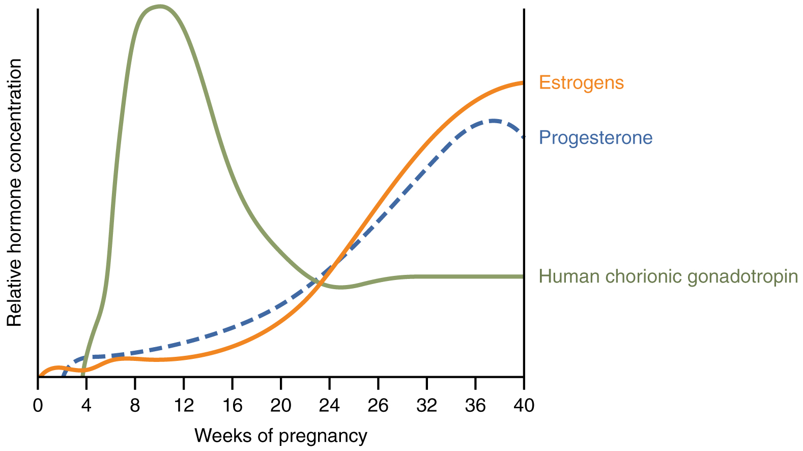

By the end of this section, you will be able to:
* Explain how estrogen, progesterone, and hCG are involved in
  maintaining pregnancy
* List the contributors to weight gain during pregnancy
* Describe the major changes to the maternal digestive, circulatory, and
  integumentary systems during pregnancy
* Summarize the events leading to labor
* Identify and describe each of the three stages of childbirth

A full-term pregnancy lasts approximately 270 days (approximately 38.5
weeks) from conception to birth. Because it is easier to remember the
first day of the last menstrual period (LMP) than to estimate the date
of conception, obstetricians set the due date as 284 days (approximately
40.5 weeks) from the LMP. This assumes that conception occurred on day
14 of the woman’s cycle, which is usually a good approximation. The 40
weeks of an average pregnancy are usually discussed in terms of three
trimesters, each approximately 13 weeks.
During the second and third trimesters, the pre-pregnancy uterus—about
the size of a fist—grows dramatically to contain the fetus, causing a
number of anatomical changes in the mother
([\[link\]](#fig-ch29_04_01){: .autogenerated-content}).

{: #fig-ch29_04_01 data-media-type="image/jpg" data-title="Size of Uterus throughout Pregnancy "}

# Effects of Hormones

Virtually all of the effects of pregnancy can be attributed in some way
to the influence of hormones—particularly estrogens, progesterone, and
hCG. During weeks 7–12 from the LMP, the pregnancy hormones are
primarily generated by the corpus luteum. Progesterone secreted by the
corpus luteum stimulates the production of decidual cells of the
endometrium that nourish the blastocyst before placentation. As the
placenta develops and the corpus luteum degenerates during weeks 12–17,
the placenta gradually takes over as the endocrine organ of pregnancy.

The placenta converts weak androgens secreted by the maternal and fetal
adrenal glands to estrogens, which are necessary for pregnancy to
progress. Estrogen levels climb throughout the pregnancy, increasing
30-fold by childbirth. Estrogens have the following actions:

* They suppress FSH and LH production, effectively preventing ovulation.
  (This function is the biological basis of hormonal birth control
  pills.)
* They induce the growth of fetal tissues and are necessary for the
  maturation of the fetal lungs and liver.
* They promote fetal viability by regulating progesterone production and
  triggering fetal synthesis of cortisol, which helps with the
  maturation of the lungs, liver, and endocrine organs such as the
  thyroid gland and adrenal gland.
* They stimulate maternal tissue growth, leading to uterine enlargement
  and mammary duct expansion and branching.

Relaxin, another hormone secreted by the corpus luteum and then by the
placenta, helps prepare the mother’s body for childbirth. It increases
the elasticity of the symphysis pubis joint and pelvic ligaments, making
room for the growing fetus and allowing expansion of the pelvic outlet
for childbirth. Relaxin also helps dilate the cervix during labor.

The placenta takes over the synthesis and secretion of progesterone
throughout pregnancy as the corpus luteum degenerates. Like estrogen,
progesterone suppresses FSH and LH. It also inhibits uterine
contractions, protecting the fetus from preterm birth. This hormone
decreases in late gestation, allowing uterine contractions to intensify
and eventually progress to true labor. The placenta also produces hCG.
In addition to promoting survival of the corpus luteum, hCG stimulates
the male fetal gonads to secrete testosterone, which is essential for
the development of the male reproductive system.

The anterior pituitary enlarges and ramps up its hormone production
during pregnancy, raising the levels of thyrotropin, prolactin, and
adrenocorticotropic hormone (ACTH). Thyrotropin, in conjunction with
placental hormones, increases the production of thyroid hormone, which
raises the maternal metabolic rate. This can markedly augment a pregnant
woman’s appetite and cause hot flashes. Prolactin stimulates enlargement
of the mammary glands in preparation for milk production. ACTH
stimulates maternal cortisol secretion, which contributes to fetal
protein synthesis. In addition to the pituitary hormones, increased
parathyroid levels mobilize calcium from maternal bones for fetal use.

# Weight Gain

The second and third trimesters of pregnancy are associated with
dramatic changes in maternal anatomy and physiology. The most obvious
anatomical sign of pregnancy is the dramatic enlargement of the
abdominal region, coupled with maternal weight gain. This weight results
from the growing fetus as well as the enlarged uterus, amniotic fluid,
and placenta. Additional breast tissue and dramatically increased blood
volume also contribute to weight gain ([\[link\]](#tbl-ch29_02){:
.autogenerated-content}). Surprisingly, fat storage accounts for only
approximately 2.3 kg (5 lbs) in a normal pregnancy and serves as a
reserve for the increased metabolic demand of breastfeeding.

During the first trimester, the mother does not need to consume
additional calories to maintain a healthy pregnancy. However, a weight
gain of approximately 0.45 kg (1 lb) per month is common. During the
second and third trimesters, the mother’s appetite increases, but it is
only necessary for her to consume an additional 300 calories per day to
support the growing fetus. Most women gain approximately 0.45 kg (1 lb)
per week.

<table id="tbl-ch29_02" summary=""><thead> <tr> <th colspan="3">Contributors to Weight Gain During Pregnancy</th> </tr> <tr> <th>Component</th> <th>Weight (kg) </th> <th>Weight (lb)</th> </tr> </thead><tbody> <tr> <td>Fetus</td> <td>3.2–3.6</td> <td>7–8 </td> </tr> <tr> <td>Placenta and fetal membranes</td> <td>0.9–1.8</td> <td>2–4</td> </tr> <tr> <td>Amniotic fluid</td> <td>0.9–1.4</td> <td>2–3</td> </tr> <tr> <td>Breast tissue</td> <td>0.9–1.4</td> <td>2–3</td> </tr> <tr> <td>Blood</td> <td>1.4</td> <td>4</td> </tr> <tr> <td>Fat</td> <td>0.9–4.1</td> <td>3–9</td> </tr> <tr><td>Uterus</td> <td>0.9–2.3</td> <td>2–5</td> </tr> <tr> <td>Total</td> <td>10–16.3</td> <td>22–36</td> </tr> </tbody></table># Changes in Organ Systems During Pregnancy

As the woman’s body adapts to pregnancy, characteristic physiologic
changes occur. These changes can sometimes prompt symptoms often
referred to collectively as the common discomforts of pregnancy.

## Digestive and Urinary System Changes

Nausea and vomiting, sometimes triggered by an increased sensitivity to
odors, are common during the first few weeks to months of pregnancy.
This phenomenon is often referred to as “morning sickness,” although the
nausea may persist all day. The source of pregnancy nausea is thought to
be the increased circulation of pregnancy-related hormones, specifically
circulating estrogen, progesterone, and hCG. Decreased intestinal
peristalsis may also contribute to nausea. By about week 12 of
pregnancy, nausea typically subsides.

A common gastrointestinal complaint during the later stages of pregnancy
is gastric reflux, or heartburn, which results from the upward,
constrictive pressure of the growing uterus on the stomach. The same
decreased peristalsis that may contribute to nausea in early pregnancy
is also thought to be responsible for pregnancy-related constipation as
pregnancy progresses.

The downward pressure of the uterus also compresses the urinary bladder,
leading to frequent urination. The problem is exacerbated by increased
urine production. In addition, the maternal urinary system processes
both maternal and fetal wastes, further increasing the total volume of
urine.

## Circulatory System Changes

Blood volume increases substantially during pregnancy, so that by
childbirth, it exceeds its preconception volume by 30 percent, or
approximately 1–2 liters. The greater blood volume helps to manage the
demands of fetal nourishment and fetal waste removal. In conjunction
with increased blood volume, the pulse and blood pressure also rise
moderately during pregnancy. As the fetus grows, the uterus compresses
underlying pelvic blood vessels, hampering venous return from the legs
and pelvic region. As a result, many pregnant women develop varicose
veins or hemorrhoids.

## Respiratory System Changes

During the second half of pregnancy, the respiratory minute volume
(volume of gas inhaled or exhaled by the lungs per minute) increases by
50 percent to compensate for the oxygen demands of the fetus and the
increased maternal metabolic rate. The growing uterus exerts upward
pressure on the diaphragm, decreasing the volume of each inspiration and
potentially causing shortness of breath, or dyspnea. During the last
several weeks of pregnancy, the pelvis becomes more elastic, and the
fetus descends lower in a process called lightening. This typically ameliorates dyspnea.

The respiratory mucosa swell in response to increased blood flow during
pregnancy, leading to nasal congestion and nose bleeds, particularly
when the weather is cold and dry. Humidifier use and increased fluid
intake are often recommended to counteract congestion.

## Integumentary System Changes

The dermis stretches extensively to accommodate the growing uterus,
breast tissue, and fat deposits on the thighs and hips. Torn connective
tissue beneath the dermis can cause striae (stretch marks) on the
abdomen, which appear as red or purple marks during pregnancy that fade
to a silvery white color in the months after childbirth.

An increase in melanocyte-stimulating hormone, in conjunction with
estrogens, darkens the areolae and creates a line of pigment from the
umbilicus to the pubis called the linea nigra
([\[link\]](#fig-ch29_04_02){: .autogenerated-content}). Melanin
production during pregnancy may also darken or discolor skin on the face
to create a chloasma, or “mask of pregnancy.”

{: #fig-ch29_04_02 data-media-type="image/jpg" data-title="Linea Nigra "}

# Physiology of Labor

Childbirth, or parturition, typically
occurs within a week of a woman’s due date, unless the woman is pregnant
with more than one fetus, which usually causes her to go into labor
early. As a pregnancy progresses into its final weeks, several
physiological changes occur in response to hormones that trigger labor.

First, recall that progesterone inhibits uterine contractions throughout
the first several months of pregnancy. As the pregnancy enters its
seventh month, progesterone levels plateau and then drop. Estrogen
levels, however, continue to rise in the maternal circulation
([\[link\]](#fig-ch29_04_03){: .autogenerated-content}). The increasing
ratio of estrogen to progesterone makes the myometrium (the uterine
smooth muscle) more sensitive to stimuli that promote contractions
(because progesterone no longer inhibits them). Moreover, in the eighth
month of pregnancy, fetal cortisol rises, which boosts estrogen
secretion by the placenta and further overpowers the uterine-calming
effects of progesterone. Some women may feel the result of the
decreasing levels of progesterone in late pregnancy as weak and
irregular peristaltic Braxton Hicks
contractions, also called false labor. These contractions can
often be relieved with rest or hydration.

{: #fig-ch29_04_03 data-media-type="image/jpg" data-title="Hormones Initiating Labor "}

A common sign that labor will be short is the so-called “bloody show.”
During pregnancy, a plug of mucus accumulates in the cervical canal,
blocking the entrance to the uterus. Approximately 1–2 days prior to the
onset of true labor, this plug loosens and is expelled, along with a
small amount of blood.

Meanwhile, the posterior pituitary has been boosting its secretion of
oxytocin, a hormone that stimulates the contractions of labor. At the
same time, the myometrium increases its sensitivity to oxytocin by
expressing more receptors for this hormone. As labor nears, oxytocin
begins to stimulate stronger, more painful uterine contractions,
which—in a positive feedback loop—stimulate the secretion of
prostaglandins from fetal membranes. Like oxytocin, prostaglandins also
enhance uterine contractile strength. The fetal pituitary also secretes
oxytocin, which increases prostaglandins even further. Given the
importance of oxytocin and prostaglandins to the initiation and
maintenance of labor, it is not surprising that, when a pregnancy is not
progressing to labor and needs to be induced, a pharmaceutical version
of these compounds (called pitocin) is administered by intravenous drip.

Finally, stretching of the myometrium and cervix by a full-term fetus in
the vertex (head-down) position is regarded as a stimulant to uterine
contractions. The sum of these changes initiates the regular
contractions known as true labor, which
become more powerful and more frequent with time. The pain of labor is
attributed to myometrial hypoxia during uterine contractions.

# Stages of Childbirth

The process of childbirth can be divided into three stages: cervical
dilation, expulsion of the newborn, and afterbirth
([\[link\]](#fig-ch29_04_04){: .autogenerated-content}).

## Cervical Dilation

For vaginal birth to occur, the cervix must dilate fully to 10 cm in
diameter—wide enough to deliver the newborn’s head. The dilation stage is the longest stage of labor and
typically takes 6–12 hours. However, it varies widely and may take
minutes, hours, or days, depending in part on whether the mother has
given birth before; in each subsequent labor, this stage tends to be
shorter.

"){: #fig-ch29_04_04 data-media-type="image/jpg" data-title="Stages of Childbirth "}

True labor progresses in a positive feedback loop in which uterine
contractions stretch the cervix, causing it to dilate and efface, or
become thinner. Cervical stretching induces reflexive uterine
contractions that dilate and efface the cervix further. In addition,
cervical dilation boosts oxytocin secretion from the pituitary, which in
turn triggers more powerful uterine contractions. When labor begins,
uterine contractions may occur only every 3–30 minutes and last only
20–40 seconds; however, by the end of this stage, contractions may occur
as frequently as every 1.5–2 minutes and last for a full minute.

Each contraction sharply reduces oxygenated blood flow to the fetus. For
this reason, it is critical that a period of relaxation occur after each
contraction. Fetal distress, measured as a sustained decrease or
increase in the fetal heart rate, can result from severe contractions
that are too powerful or lengthy for oxygenated blood to be restored to
the fetus. Such a situation can be cause for an emergency birth with
vacuum, forceps, or surgically by Caesarian section.

The amniotic membranes rupture before the onset of labor in about 12
percent of women; they typically rupture at the end of the dilation
stage in response to excessive pressure from the fetal head entering the
birth canal.

## Expulsion Stage

The expulsion stage begins when the fetal
head enters the birth canal and ends with birth of the newborn. It
typically takes up to 2 hours, but it can last longer or be completed in
minutes, depending in part on the orientation of the fetus. The vertex
presentation known as the occiput anterior vertex is the most common
presentation and is associated with the greatest ease of vaginal birth.
The fetus faces the maternal spinal cord and the smallest part of the
head (the posterior aspect called the occiput) exits the birth canal
first.

In fewer than 5 percent of births, the infant is oriented in the breech
presentation, or buttocks down. In a complete breech, both legs are
crossed and oriented downward. In a frank breech presentation, the legs
are oriented upward. Before the 1960s, it was common for breech
presentations to be delivered vaginally. Today, most breech births are
accomplished by Caesarian section.

Vaginal birth is associated with significant stretching of the vaginal
canal, the cervix, and the perineum. Until recent decades, it was
routine procedure for an obstetrician to numb the perineum and perform
an episiotomy, an incision in the
posterior vaginal wall and perineum. The perineum is now more commonly
allowed to tear on its own during birth. Both an episiotomy and a
perineal tear need to be sutured shortly after birth to ensure optimal
healing. Although suturing the jagged edges of a perineal tear may be
more difficult than suturing an episiotomy, tears heal more quickly, are
less painful, and are associated with less damage to the muscles around
the vagina and rectum.

Upon birth of the newborn’s head, an obstetrician will aspirate mucus
from the mouth and nose before the newborn’s first breath. Once the head
is birthed, the rest of the body usually follows quickly. The umbilical
cord is then double-clamped, and a cut is made between the clamps. This
completes the second stage of childbirth.

## Afterbirth

The delivery of the placenta and associated membranes, commonly referred
to as the afterbirth, marks the final
stage of childbirth. After expulsion of the newborn, the myometrium
continues to contract. This movement shears the placenta from the back
of the uterine wall. It is then easily delivered through the vagina.
Continued uterine contractions then reduce blood loss from the site of
the placenta. Delivery of the placenta marks the beginning of the
postpartum period—the period of approximately 6 weeks immediately
following childbirth during which the mother’s body gradually returns to
a non-pregnant state. If the placenta does not birth spontaneously
within approximately 30 minutes, it is considered retained, and the
obstetrician may attempt manual removal. If this is not successful,
surgery may be required.

It is important that the obstetrician examines the expelled placenta and
fetal membranes to ensure that they are intact. If fragments of the
placenta remain in the uterus, they can cause postpartum hemorrhage.
Uterine contractions continue for several hours after birth to return
the uterus to its pre-pregnancy size in a process called involution, which also allows the mother’s
abdominal organs to return to their pre-pregnancy locations.
Breastfeeding facilitates this process.

Although postpartum uterine contractions limit blood loss from the
detachment of the placenta, the mother does experience a postpartum
vaginal discharge called lochia. This is
made up of uterine lining cells, erythrocytes, leukocytes, and other
debris. Thick, dark, lochia rubra (red lochia) typically continues for
2–3 days, and is replaced by lochia serosa, a thinner, pinkish form that
continues until about the tenth postpartum day. After this period, a
scant, creamy, or watery discharge called lochia alba (white lochia) may
continue for another 1–2 weeks.

# Chapter Review

Hormones (especially estrogens, progesterone, and hCG) secreted by the
corpus luteum and later by the placenta are responsible for most of the
changes experienced during pregnancy. Estrogen maintains the pregnancy,
promotes fetal viability, and stimulates tissue growth in the mother and
developing fetus. Progesterone prevents new ovarian follicles from
developing and suppresses uterine contractility.

Pregnancy weight gain primarily occurs in the breasts and abdominal
region. Nausea, heartburn, and frequent urination are common during
pregnancy. Maternal blood volume increases by 30 percent during
pregnancy and respiratory minute volume increases by 50 percent. The
skin may develop stretch marks and melanin production may increase.

Toward the late stages of pregnancy, a drop in progesterone and
stretching forces from the fetus lead to increasing uterine irritability
and prompt labor. Contractions serve to dilate the cervix and expel the
newborn. Delivery of the placenta and associated fetal membranes
follows.

# Review Questions

Progesterone secreted by the placenta suppresses ________ to prevent
maturation of ovarian follicles.

1.  LH and estrogen
2.  hCG and FSH
3.  FSH and LH
4.  estrogen and hCG
{: data-number-style="lower-alpha"}

C

Which of the following is a possible culprit of “morning sickness”?

1.  increased minute respiration
2.  decreased intestinal peristalsis
3.  decreased aldosterone secretion
4.  increased blood volume
{: data-number-style="lower-alpha"}

B

How does the decrease in progesterone at the last weeks of pregnancy
help to bring on labor?

1.  stimulating FSH production
2.  decreasing the levels of estrogens
3.  dilating the cervix
4.  decreasing the inhibition of uterine contractility
{: data-number-style="lower-alpha"}

D

Which of these fetal presentations is the easiest for vaginal birth?

1.  complete breech
2.  vertex occiput anterior
3.  frank breech
4.  vertex occiput posterior
{: data-number-style="lower-alpha"}

B

# Critical Thinking Questions

Devin is 35 weeks pregnant with her first child when she arrives at the
birthing unit reporting that she believes she is in labor. She states
that she has been experiencing diffuse, mild contractions for the past
few hours. Examination reveals, however, that the plug of mucus blocking
her cervix is intact and her cervix has not yet begun to dilate. She is
advised to return home. Why?

Devin is very likely experiencing Braxton Hicks contractions, also known
as false labor. These are mild contractions that do not promote cervical
dilation and are not associated with impending birth. They will probably
dissipate with rest.

Janine is 41 weeks pregnant with her first child when she arrives at the
birthing unit reporting that she believes she has been in labor “for
days” but that “it’s just not going anywhere.” During the clinical exam,
she experiences a few mild contractions, each lasting about 15–20
seconds; however, her cervix is found to be only 2 cm dilated, and the
amniotic sac is intact. Janine is admitted to the birthing unit and an
IV infusion of pitocin is started. Why?

Janine is 41 weeks pregnant, and the mild contractions she has been
experiencing “for days” have dilated her cervix to 2 cm. These facts
suggest that she is in labor, but that the labor is not progressing
appropriately. Pitocin is a pharmaceutical preparation of synthetic
prostaglandins and oxytocin, which will increase the frequency and
strength of her contractions and help her labor to progress to birth.

