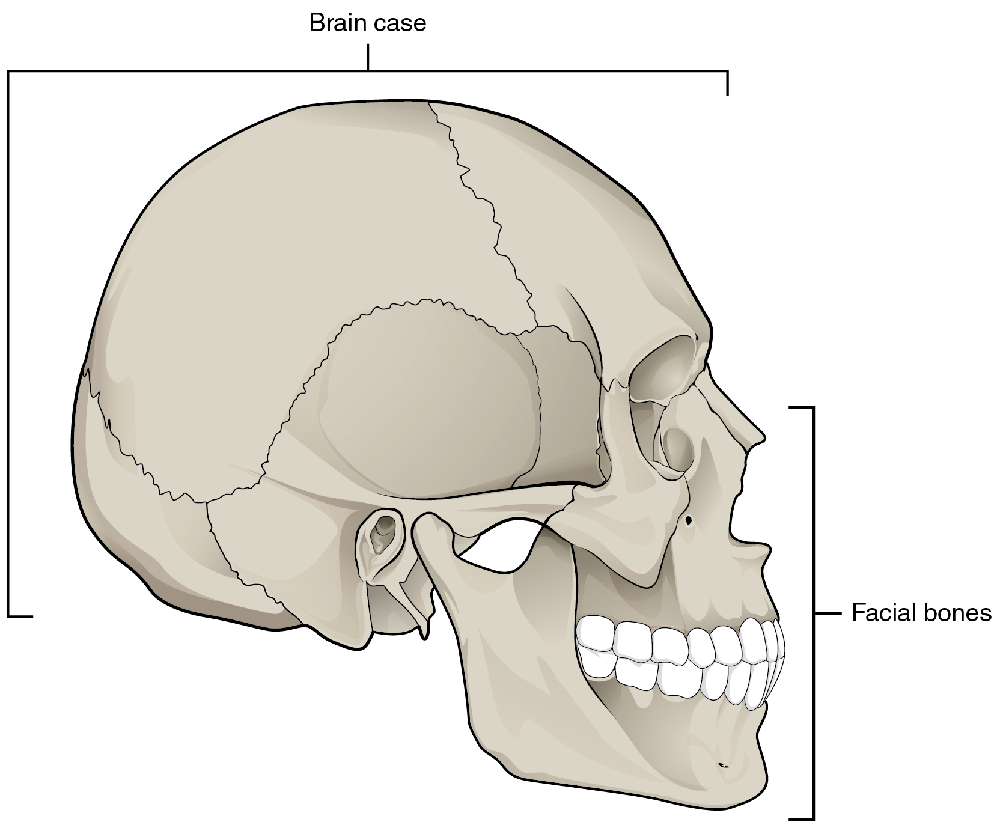
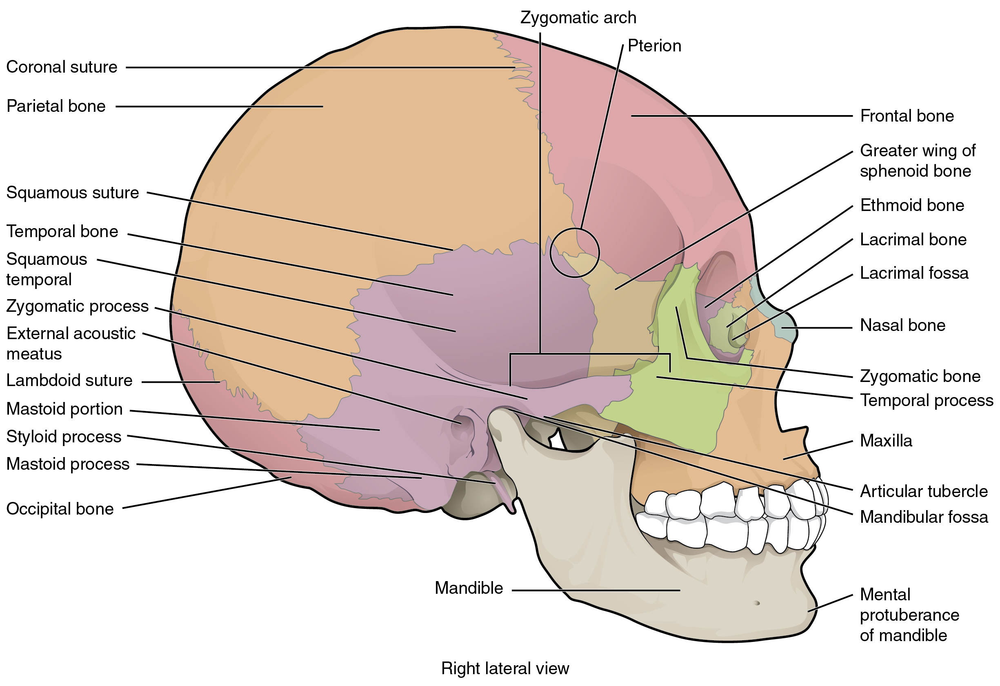
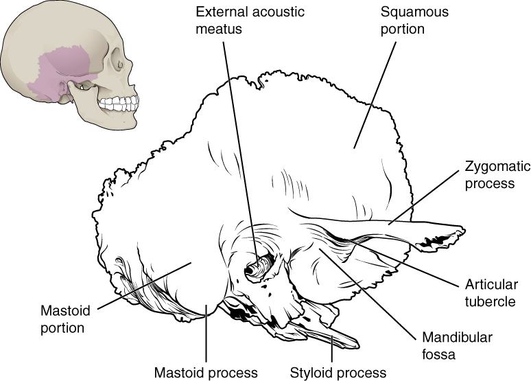
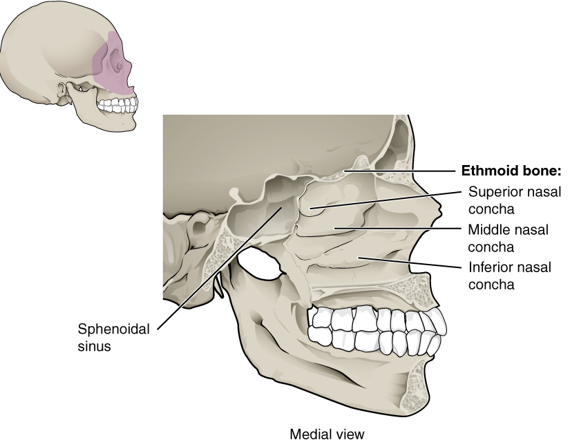
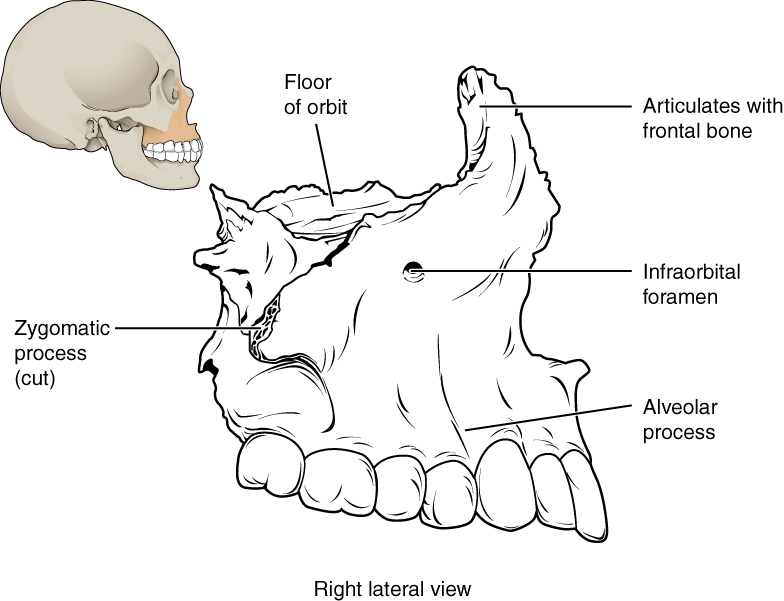
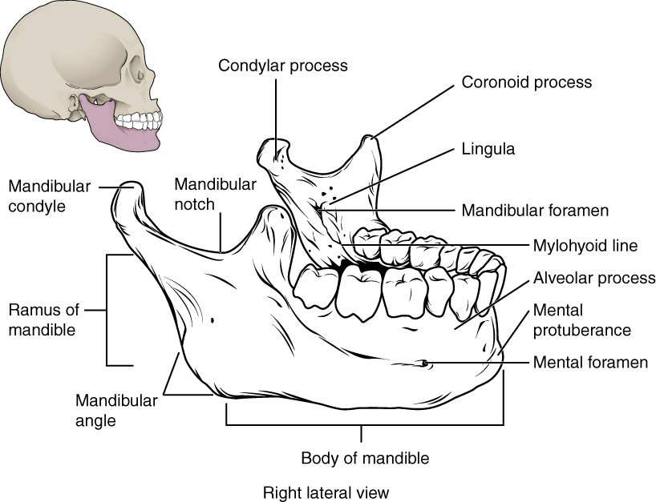

By the end of this section, you will be able to:
* List and identify the bones of the brain case and face
* Locate the major suture lines of the skull and name the bones associated with each
* Locate and define the boundaries of the anterior, middle, and posterior cranial fossae, the temporal fossa, and infratemporal fossa
* Define the paranasal sinuses and identify the location of each
* Name the bones that make up the walls of the orbit and identify the openings associated with the orbit
* Identify the bones and structures that form the nasal septum and nasal conchae, and locate the hyoid bone
* Identify the bony openings of the skull

The **cranium**{: data-type="term"} (skull) is the skeletal structure of the head that supports the face and protects the brain. It is subdivided into the **facial bones**{: data-type="term"} and the **brain case**{: data-type="term"}, or cranial vault ([\[link\]](#fig-ch07_02_01)). The facial bones underlie the facial structures, form the nasal cavity, enclose the eyeballs, and support the teeth of the upper and lower jaws. The rounded brain case surrounds and protects the brain and houses the middle and inner ear structures.

In the adult, the skull consists of 22 individual bones, 21 of which are immobile and united into a single unit. The 22nd bone is the **mandible**{: data-type="term"} (lower jaw), which is the only moveable bone of the skull.

 {: #fig-ch07_02_01 data-title="Parts of the Skull "}

  
Watch this [video][1] to view a rotating and exploded skull, with color-coded bones. Which bone (yellow) is centrally located and joins with most of the other bones of the skull?

# Anterior View of Skull

The anterior skull consists of the facial bones and provides the bony support for the eyes and structures of the face. This view of the skull is dominated by the openings of the orbits and the nasal cavity. Also seen are the upper and lower jaws, with their respective teeth ([\[link\]](#fig-ch07_02_02)).

The **orbit**{: data-type="term"} is the bony socket that houses the eyeball and muscles that move the eyeball or open the upper eyelid. The upper margin of the anterior orbit is the **supraorbital margin**{: data-type="term"}. Located near the midpoint of the supraorbital margin is a small opening called the **supraorbital foramen**{: data-type="term"}. This provides for passage of a sensory nerve to the skin of the forehead. Below the orbit is the **infraorbital foramen**{: data-type="term"}, which is the point of emergence for a sensory nerve that supplies the anterior face below the orbit.

 , nasal cavity, nasal septum, and upper and lower jaws."){: #fig-ch07_02_02 data-title="Anterior View of Skull "}

Inside the nasal area of the skull, the **nasal cavity**{: data-type="term"} is divided into halves by the **nasal septum**{: data-type="term"}. The upper portion of the nasal septum is formed by the **perpendicular plate of the ethmoid bone**{: data-type="term"} and the lower portion is the **vomer bone**{: data-type="term"}. Each side of the nasal cavity is triangular in shape, with a broad inferior space that narrows superiorly. When looking into the nasal cavity from the front of the skull, two bony plates are seen projecting from each lateral wall. The larger of these is the **inferior nasal concha**{: data-type="term"}, an independent bone of the skull. Located just above the inferior concha is the **middle nasal concha**{: data-type="term"}, which is part of the ethmoid bone. A third bony plate, also part of the ethmoid bone, is the **superior nasal concha**{: data-type="term"}. It is much smaller and out of sight, above the middle concha. The superior nasal concha is located just lateral to the perpendicular plate, in the upper nasal cavity.

# Lateral View of Skull

A view of the lateral skull is dominated by the large, rounded brain case above and the upper and lower jaws with their teeth below ([\[link\]](#fig-ch07_02_03)). Separating these areas is the bridge of bone called the zygomatic arch. The **zygomatic arch**{: data-type="term"} is the bony arch on the side of skull that spans from the area of the cheek to just above the ear canal. It is formed by the junction of two bony processes: a short anterior component, the **temporal process of the zygomatic bone**{: data-type="term"} (the cheekbone) and a longer posterior portion, the **zygomatic process of the temporal bone**{: data-type="term"}, extending forward from the temporal bone. Thus the temporal process (anteriorly) and the zygomatic process (posteriorly) join together, like the two ends of a drawbridge, to form the zygomatic arch. One of the major muscles that pulls the mandible upward during biting and chewing arises from the zygomatic arch.

On the lateral side of the brain case, above the level of the zygomatic arch, is a shallow space called the **temporal fossa**{: data-type="term"}. Below the level of the zygomatic arch and deep to the vertical portion of the mandible is another space called the **infratemporal fossa**{: data-type="term"}. Both the temporal fossa and infratemporal fossa contain muscles that act on the mandible during chewing.

 {: #fig-ch07_02_03 data-title="Lateral View of Skull "}

# Bones of the Brain Case

The brain case contains and protects the brain. The interior space that is almost completely occupied by the brain is called the **cranial cavity**{: data-type="term"}. This cavity is bounded superiorly by the rounded top of the skull, which is called the **calvaria**{: data-type="term"} (skullcap), and the lateral and posterior sides of the skull. The bones that form the top and sides of the brain case are usually referred to as the “flat” bones of the skull.

The floor of the brain case is referred to as the base of the skull. This is a complex area that varies in depth and has numerous openings for the passage of cranial nerves, blood vessels, and the spinal cord. Inside the skull, the base is subdivided into three large spaces, called the **anterior cranial fossa**{: data-type="term"}, **middle cranial fossa**{: data-type="term"}, and **posterior cranial fossa**{: data-type="term"} (fossa = “trench or ditch”) ([\[link\]](#fig-ch07_02_04)). From anterior to posterior, the fossae increase in depth. The shape and depth of each fossa corresponds to the shape and size of the brain region that each houses. The boundaries and openings of the cranial fossae (singular = fossa) will be described in a later section.

{: #fig-ch07_02_04 data-title="Cranial Fossae "}

The brain case consists of eight bones. These include the paired parietal and temporal bones, plus the unpaired frontal, occipital, sphenoid, and ethmoid bones.

## Parietal Bone

The **parietal bone**{: data-type="term"} forms most of the upper lateral side of the skull (see [\[link\]](#fig-ch07_02_03)). These are paired bones, with the right and left parietal bones joining together at the top of the skull. Each parietal bone is also bounded anteriorly by the frontal bone, inferiorly by the temporal bone, and posteriorly by the occipital bone.

## Temporal Bone

The **temporal bone**{: data-type="term"} forms the lower lateral side of the skull (see [\[link\]](#fig-ch07_02_03)). Common wisdom has it that the temporal bone (temporal = “time”) is so named because this area of the head (the temple) is where hair typically first turns gray, indicating the passage of time.

The temporal bone is subdivided into several regions ([\[link\]](#fig-ch07_02_05)). The flattened, upper portion is the squamous portion of the temporal bone. Below this area and projecting anteriorly is the zygomatic process of the temporal bone, which forms the posterior portion of the zygomatic arch. Posteriorly is the mastoid portion of the temporal bone. Projecting inferiorly from this region is a large prominence, the **mastoid process**{: data-type="term"}, which serves as a muscle attachment site. The mastoid process can easily be felt on the side of the head just behind your earlobe. On the interior of the skull, the petrous portion of each temporal bone forms the prominent, diagonally oriented **petrous ridge**{: data-type="term"} in the floor of the cranial cavity. Located inside each petrous ridge are small cavities that house the structures of the middle and inner ears.

{: #fig-ch07_02_05 data-title="Temporal Bone "}

Important landmarks of the temporal bone, as shown in [\[link\]](#fig-ch07_02_06), include the following:

* **External acoustic meatus**{: data-type="term"} (ear canal)—This is the large opening on the lateral side of the skull that is associated with the ear.
* **Internal acoustic meatus**{: data-type="term"}—This opening is located inside the cranial cavity, on the medial side of the petrous ridge. It connects to the middle and inner ear cavities of the temporal bone.
* **Mandibular fossa**{: data-type="term"}—This is the deep, oval-shaped depression located on the external base of the skull, just in front of the external acoustic meatus. The mandible (lower jaw) joins with the skull at this site as part of the temporomandibular joint, which allows for movements of the mandible during opening and closing of the mouth.
* **Articular tubercle**{: data-type="term"}—The smooth ridge located immediately anterior to the mandibular fossa. Both the articular tubercle and mandibular fossa contribute to the temporomandibular joint, the joint that provides for movements between the temporal bone of the skull and the mandible.
* **Styloid process**{: data-type="term"}—Posterior to the mandibular fossa on the external base of the skull is an elongated, downward bony projection called the styloid process, so named because of its resemblance to a stylus (a pen or writing tool). This structure serves as an attachment site for several small muscles and for a ligament that supports the hyoid bone of the neck. (See also [\[link\]](#fig-ch07_02_05).)
* **Stylomastoid foramen**{: data-type="term"}—This small opening is located between the styloid process and mastoid process. This is the point of exit for the cranial nerve that supplies the facial muscles.
* **Carotid canal**{: data-type="term"}—The carotid canal is a zig-zag shaped tunnel that provides passage through the base of the skull for one of the major arteries that supplies the brain. Its entrance is located on the outside base of the skull, anteromedial to the styloid process. The canal then runs anteromedially within the bony base of the skull, and then turns upward to its exit in the floor of the middle cranial cavity, above the foramen lacerum.

 The hard palate is formed anteriorly by the palatine processes of the maxilla bones and posteriorly by the horizontal plate of the palatine bones. (b) The complex floor of the cranial cavity is formed by the frontal, ethmoid, sphenoid, temporal, and occipital bones. The lesser wing of the sphenoid bone separates the anterior and middle cranial fossae. The petrous ridge (petrous portion of temporal bone) separates the middle and posterior cranial fossae."){: #fig-ch07_02_06 data-title="External and Internal Views of Base of Skull "}

## Frontal Bone

The **frontal bone**{: data-type="term"} is the single bone that forms the forehead. At its anterior midline, between the eyebrows, there is a slight depression called the **glabella**{: data-type="term"} (see [\[link\]](#fig-ch07_02_03)). The frontal bone also forms the supraorbital margin of the orbit. Near the middle of this margin, is the supraorbital foramen, the opening that provides passage for a sensory nerve to the forehead. The frontal bone is thickened just above each supraorbital margin, forming rounded brow ridges. These are located just behind your eyebrows and vary in size among individuals, although they are generally larger in males. Inside the cranial cavity, the frontal bone extends posteriorly. This flattened region forms both the roof of the orbit below and the floor of the anterior cranial cavity above (see [\[link\]](#fig-ch07_02_06)**b**).

## Occipital Bone

The **occipital bone**{: data-type="term"} is the single bone that forms the posterior skull and posterior base of the cranial cavity ([\[link\]](#fig-ch07_02_07); see also [\[link\]](#fig-ch07_02_06)). On its outside surface, at the posterior midline, is a small protrusion called the **external occipital protuberance**{: data-type="term"}, which serves as an attachment site for a ligament of the posterior neck. Lateral to either side of this bump is a **superior nuchal line**{: data-type="term"} (nuchal = “nape” or “posterior neck”). The nuchal lines represent the most superior point at which muscles of the neck attach to the skull, with only the scalp covering the skull above these lines. On the base of the skull, the occipital bone contains the large opening of the **foramen magnum**{: data-type="term"}, which allows for passage of the spinal cord as it exits the skull. On either side of the foramen magnum is an oval-shaped **occipital condyle**{: data-type="term"}. These condyles form joints with the first cervical vertebra and thus support the skull on top of the vertebral column.

{: #fig-ch07_02_07 data-title="Posterior View of Skull "}

## Sphenoid Bone

The **sphenoid bone**{: data-type="term"} is a single, complex bone of the central skull ([\[link\]](#fig-ch07_02_08)). It serves as a “keystone” bone, because it joins with almost every other bone of the skull. The sphenoid forms much of the base of the central skull (see [\[link\]](#fig-ch07_02_06)) and also extends laterally to contribute to the sides of the skull (see [\[link\]](#fig-ch07_02_03)). Inside the cranial cavity, the right and left **lesser wings of the sphenoid bone**{: data-type="term"}, which resemble the wings of a flying bird, form the lip of a prominent ridge that marks the boundary between the anterior and middle cranial fossae. The **sella turcica**{: data-type="term"} (“Turkish saddle”) is located at the midline of the middle cranial fossa. This bony region of the sphenoid bone is named for its resemblance to the horse saddles used by the Ottoman Turks, with a high back and a tall front. The rounded depression in the floor of the sella turcica is the **hypophyseal (pituitary) fossa**{: data-type="term"}, which houses the pea-sized pituitary (hypophyseal) gland. The **greater wings of the sphenoid bone**{: data-type="term"} extend laterally to either side away from the sella turcica, where they form the anterior floor of the middle cranial fossa. The greater wing is best seen on the outside of the lateral skull, where it forms a rectangular area immediately anterior to the squamous portion of the temporal bone.

On the inferior aspect of the skull, each half of the sphenoid bone forms two thin, vertically oriented bony plates. These are the **medial pterygoid plate**{: data-type="term"} and **lateral pterygoid plate**{: data-type="term"} (pterygoid = “wing-shaped”). The right and left medial pterygoid plates form the posterior, lateral walls of the nasal cavity. The somewhat larger lateral pterygoid plates serve as attachment sites for chewing muscles that fill the infratemporal space and act on the mandible.

  superior and (b) posterior views, the sphenoid bone is a single midline bone that forms the anterior walls and floor of the middle cranial fossa. It has a pair of lesser wings and a pair of greater wings. The sella turcica surrounds the hypophyseal fossa. Projecting downward are the medial and lateral pterygoid plates. The sphenoid has multiple openings for the passage of nerves and blood vessels, including the optic canal, superior orbital fissure, foramen rotundum, foramen ovale, and foramen spinosum."){: #fig-ch07_02_08 data-title="Sphenoid Bone "}

## Ethmoid Bone

The **ethmoid bone**{: data-type="term"} is a single, midline bone that forms the roof and lateral walls of the upper nasal cavity, the upper portion of the nasal septum, and contributes to the medial wall of the orbit ([\[link\]](#fig-ch07_02_09) and [\[link\]](#fig-ch07_02_10)). On the interior of the skull, the ethmoid also forms a portion of the floor of the anterior cranial cavity (see [\[link\]](#fig-ch07_02_06)**b**).

Within the nasal cavity, the perpendicular plate of the ethmoid bone forms the upper portion of the nasal septum. The ethmoid bone also forms the lateral walls of the upper nasal cavity. Extending from each lateral wall are the superior nasal concha and middle nasal concha, which are thin, curved projections that extend into the nasal cavity ([\[link\]](#fig-ch07_02_11)).

In the cranial cavity, the ethmoid bone forms a small area at the midline in the floor of the anterior cranial fossa. This region also forms the narrow roof of the underlying nasal cavity. This portion of the ethmoid bone consists of two parts, the crista galli and cribriform plates. The **crista galli**{: data-type="term"} (“rooster’s comb or crest”) is a small upward bony projection located at the midline. It functions as an anterior attachment point for one of the covering layers of the brain. To either side of the crista galli is the **cribriform plate**{: data-type="term"} (cribrum = “sieve”), a small, flattened area with numerous small openings termed olfactory foramina. Small nerve branches from the olfactory areas of the nasal cavity pass through these openings to enter the brain.

The lateral portions of the ethmoid bone are located between the orbit and upper nasal cavity, and thus form the lateral nasal cavity wall and a portion of the medial orbit wall. Located inside this portion of the ethmoid bone are several small, air-filled spaces that are part of the paranasal sinus system of the skull.

 {: #fig-ch07_02_09 data-title="Sagittal Section of Skull "}

{: #fig-ch07_02_10 data-title="Ethmoid Bone "}

{: #fig-ch07_02_11 data-title="Lateral Wall of Nasal Cavity "}

# Sutures of the Skull

A **suture**{: data-type="term"} is an immobile joint between adjacent bones of the skull. The narrow gap between the bones is filled with dense, fibrous connective tissue that unites the bones. The long sutures located between the bones of the brain case are not straight, but instead follow irregular, tightly twisting paths. These twisting lines serve to tightly interlock the adjacent bones, thus adding strength to the skull for brain protection.

The two suture lines seen on the top of the skull are the coronal and sagittal sutures. The **coronal suture**{: data-type="term"} runs from side to side across the skull, within the coronal plane of section (see [\[link\]](#fig-ch07_02_03)). It joins the frontal bone to the right and left parietal bones. The **sagittal suture**{: data-type="term"} extends posteriorly from the coronal suture, running along the midline at the top of the skull in the sagittal plane of section (see [\[link\]](#fig-ch07_02_07)). It unites the right and left parietal bones. On the posterior skull, the sagittal suture terminates by joining the lambdoid suture. The **lambdoid suture**{: data-type="term"} extends downward and laterally to either side away from its junction with the sagittal suture. The lambdoid suture joins the occipital bone to the right and left parietal and temporal bones. This suture is named for its upside-down \"V\" shape, which resembles the capital letter version of the Greek letter lambda (Λ). The **squamous suture**{: data-type="term"} is located on the lateral skull. It unites the squamous portion of the temporal bone with the parietal bone (see [\[link\]](#fig-ch07_02_03)). At the intersection of four bones is the **pterion**{: data-type="term"}, a small, capital-H-shaped suture line region that unites the frontal bone, parietal bone, squamous portion of the temporal bone, and greater wing of the sphenoid bone. It is the weakest part of the skull. The pterion is located approximately two finger widths above the zygomatic arch and a thumb’s width posterior to the upward portion of the zygomatic bone.

Disorders of the…

Skeletal System Head and traumatic brain injuries are major causes of immediate death and disability, with bleeding and infections as possible additional complications. According to the Centers for Disease Control and Prevention (2010), approximately 30 percent of all injury-related deaths in the United States are caused by head injuries. The majority of head injuries involve falls. They are most common among young children (ages 0–4 years), adolescents (15–19 years), and the elderly (over 65 years). Additional causes vary, but prominent among these are automobile and motorcycle accidents.

Strong blows to the brain-case portion of the skull can produce fractures. These may result in bleeding inside the skull with subsequent injury to the brain. The most common is a linear skull fracture, in which fracture lines radiate from the point of impact. Other fracture types include a comminuted fracture, in which the bone is broken into several pieces at the point of impact, or a depressed fracture, in which the fractured bone is pushed inward. In a contrecoup (counterblow) fracture, the bone at the point of impact is not broken, but instead a fracture occurs on the opposite side of the skull. Fractures of the occipital bone at the base of the skull can occur in this manner, producing a basilar fracture that can damage the artery that passes through the carotid canal.

A blow to the lateral side of the head may fracture the bones of the pterion. The pterion is an important clinical landmark because located immediately deep to it on the inside of the skull is a major branch of an artery that supplies the skull and covering layers of the brain. A strong blow to this region can fracture the bones around the pterion. If the underlying artery is damaged, bleeding can cause the formation of a hematoma (collection of blood) between the brain and interior of the skull. As blood accumulates, it will put pressure on the brain. Symptoms associated with a hematoma may not be apparent immediately following the injury, but if untreated, blood accumulation will exert increasing pressure on the brain and can result in death within a few hours.

  
View this [animation][2] to see how a blow to the head may produce a contrecoup (counterblow) fracture of the basilar portion of the occipital bone on the base of the skull. Why may a basilar fracture be life threatening?

# Facial Bones of the Skull

The facial bones of the skull form the upper and lower jaws, the nose, nasal cavity and nasal septum, and the orbit. The facial bones include 14 bones, with six paired bones and two unpaired bones. The paired bones are the maxilla, palatine, zygomatic, nasal, lacrimal, and inferior nasal conchae bones. The unpaired bones are the vomer and mandible bones. Although classified with the brain-case bones, the ethmoid bone also contributes to the nasal septum and the walls of the nasal cavity and orbit.

## Maxillary Bone

The **maxillary bone**{: data-type="term"}, often referred to simply as the maxilla (plural = maxillae), is one of a pair that together form the upper jaw, much of the hard palate, the medial floor of the orbit, and the lateral base of the nose (see [\[link\]](#fig-ch07_02_02)). The curved, inferior margin of the maxillary bone that forms the upper jaw and contains the upper teeth is the **alveolar process of the maxilla**{: data-type="term"} ([\[link\]](#fig-ch07_02_12)). Each tooth is anchored into a deep socket called an alveolus. On the anterior maxilla, just below the orbit, is the infraorbital foramen. This is the point of exit for a sensory nerve that supplies the nose, upper lip, and anterior cheek. On the inferior skull, the **palatine process**{: data-type="term"} from each maxillary bone can be seen joining together at the midline to form the anterior three-quarters of the hard palate (see [\[link\]](#fig-ch07_02_06)**a**). The **hard palate**{: data-type="term"} is the bony plate that forms the roof of the mouth and floor of the nasal cavity, separating the oral and nasal cavities.

{: #fig-ch07_02_12 data-title="Maxillary Bone "}

## Palatine Bone

The **palatine bone**{: data-type="term"} is one of a pair of irregularly shaped bones that contribute small areas to the lateral walls of the nasal cavity and the medial wall of each orbit. The largest region of each of the palatine bone is the **horizontal plate**{: data-type="term"}. The plates from the right and left palatine bones join together at the midline to form the posterior quarter of the hard palate (see [\[link\]](#fig-ch07_02_06)**a**). Thus, the palatine bones are best seen in an inferior view of the skull and hard palate.

Homeostatic Imbalances

Cleft Lip and Cleft Palate During embryonic development, the right and left maxilla bones come together at the midline to form the upper jaw. At the same time, the muscle and skin overlying these bones join together to form the upper lip. Inside the mouth, the palatine processes of the maxilla bones, along with the horizontal plates of the right and left palatine bones, join together to form the hard palate. If an error occurs in these developmental processes, a birth defect of cleft lip or cleft palate may result.

Cleft lip is a common development defect that affects approximately 1:1000 births, most of which are male. This defect involves a partial or complete failure of the right and left portions of the upper lip to fuse together, leaving a cleft (gap).

A more severe developmental defect is cleft palate, which affects the hard palate. The hard palate is the bony structure that separates the nasal cavity from the oral cavity. It is formed during embryonic development by the midline fusion of the horizontal plates from the right and left palatine bones and the palatine processes of the maxilla bones. Cleft palate affects approximately 1:2500 births and is more common in females. It results from a failure of the two halves of the hard palate to completely come together and fuse at the midline, thus leaving a gap between them. This gap allows for communication between the nasal and oral cavities. In severe cases, the bony gap continues into the anterior upper jaw where the alveolar processes of the maxilla bones also do not properly join together above the front teeth. If this occurs, a cleft lip will also be seen. Because of the communication between the oral and nasal cavities, a cleft palate makes it very difficult for an infant to generate the suckling needed for nursing, thus leaving the infant at risk for malnutrition. Surgical repair is required to correct cleft palate defects.

## Zygomatic Bone

The **zygomatic bone**{: data-type="term"} is also known as the cheekbone. Each of the paired zygomatic bones forms much of the lateral wall of the orbit and the lateral-inferior margins of the anterior orbital opening (see [\[link\]](#fig-ch07_02_02)). The short temporal process of the zygomatic bone projects posteriorly, where it forms the anterior portion of the zygomatic arch (see [\[link\]](#fig-ch07_02_03)).

## Nasal Bone

The **nasal bone**{: data-type="term"} is one of two small bones that articulate (join) with each other to form the bony base (bridge) of the nose. They also support the cartilages that form the lateral walls of the nose (see [\[link\]](#fig-ch07_02_09)). These are the bones that are damaged when the nose is broken.

## Lacrimal Bone

Each **lacrimal bone**{: data-type="term"} is a small, rectangular bone that forms the anterior, medial wall of the orbit (see [\[link\]](#fig-ch07_02_02) and [\[link\]](#fig-ch07_02_03)). The anterior portion of the lacrimal bone forms a shallow depression called the **lacrimal fossa**{: data-type="term"}, and extending inferiorly from this is the **nasolacrimal canal**{: data-type="term"}. The lacrimal fluid (tears of the eye), which serves to maintain the moist surface of the eye, drains at the medial corner of the eye into the nasolacrimal canal. This duct then extends downward to open into the nasal cavity, behind the inferior nasal concha. In the nasal cavity, the lacrimal fluid normally drains posteriorly, but with an increased flow of tears due to crying or eye irritation, some fluid will also drain anteriorly, thus causing a runny nose.

## Inferior Nasal Conchae

The right and left inferior nasal conchae form a curved bony plate that projects into the nasal cavity space from the lower lateral wall (see [\[link\]](#fig-ch07_02_11)). The inferior concha is the largest of the nasal conchae and can easily be seen when looking into the anterior opening of the nasal cavity.

## Vomer Bone

The unpaired vomer bone, often referred to simply as the vomer, is triangular-shaped and forms the posterior-inferior part of the nasal septum (see [\[link\]](#fig-ch07_02_09)). The vomer is best seen when looking from behind into the posterior openings of the nasal cavity (see [\[link\]](#fig-ch07_02_06)**a**). In this view, the vomer is seen to form the entire height of the nasal septum. A much smaller portion of the vomer can also be seen when looking into the anterior opening of the nasal cavity.

## Mandible

The **mandible**{: data-type="term"} forms the lower jaw and is the only moveable bone of the skull. At the time of birth, the mandible consists of paired right and left bones, but these fuse together during the first year to form the single U-shaped mandible of the adult skull. Each side of the mandible consists of a horizontal body and posteriorly, a vertically oriented **ramus of the mandible**{: data-type="term"} (ramus = “branch”). The outside margin of the mandible, where the body and ramus come together is called the **angle of the mandible**{: data-type="term"} ([\[link\]](#fig-ch07_02_13)).

The ramus on each side of the mandible has two upward-going bony projections. The more anterior projection is the flattened **coronoid process of the mandible**{: data-type="term"}, which provides attachment for one of the biting muscles. The posterior projection is the **condylar process of the mandible**{: data-type="term"}, which is topped by the oval-shaped **condyle**{: data-type="term"}. The condyle of the mandible articulates (joins) with the mandibular fossa and articular tubercle of the temporal bone. Together these articulations form the temporomandibular joint, which allows for opening and closing of the mouth (see [\[link\]](#fig-ch07_02_03)). The broad U-shaped curve located between the coronoid and condylar processes is the **mandibular notch**{: data-type="term"}.

Important landmarks for the mandible include the following:

* **Alveolar process of the mandible**{: data-type="term"}—This is the upper border of the mandibular body and serves to anchor the lower teeth.
* **Mental protuberance**{: data-type="term"}—The forward projection from the inferior margin of the anterior mandible that forms the chin (mental = “chin”).
* **Mental foramen**{: data-type="term"}—The opening located on each side of the anterior-lateral mandible, which is the exit site for a sensory nerve that supplies the chin.
* **Mylohyoid line**{: data-type="term"}—This bony ridge extends along the inner aspect of the mandibular body (see [\[link\]](#fig-ch07_02_09)). The muscle that forms the floor of the oral cavity attaches to the mylohyoid lines on both sides of the mandible.
* **Mandibular foramen**{: data-type="term"}—This opening is located on the medial side of the ramus of the mandible. The opening leads into a tunnel that runs down the length of the mandibular body. The sensory nerve and blood vessels that supply the lower teeth enter the mandibular foramen and then follow this tunnel. Thus, to numb the lower teeth prior to dental work, the dentist must inject anesthesia into the lateral wall of the oral cavity at a point prior to where this sensory nerve enters the mandibular foramen.
* **Lingula**{: data-type="term"}—This small flap of bone is named for its shape (lingula = “little tongue”). It is located immediately next to the mandibular foramen, on the medial side of the ramus. A ligament that anchors the mandible during opening and closing of the mouth extends down from the base of the skull and attaches to the lingula.

 {: #fig-ch07_02_13 data-title="Isolated Mandible "}

# The Orbit

The orbit is the bony socket that houses the eyeball and contains the muscles that move the eyeball or open the upper eyelid. Each orbit is cone-shaped, with a narrow posterior region that widens toward the large anterior opening. To help protect the eye, the bony margins of the anterior opening are thickened and somewhat constricted. The medial walls of the two orbits are parallel to each other but each lateral wall diverges away from the midline at a 45° angle. This divergence provides greater lateral peripheral vision.

The walls of each orbit include contributions from seven skull bones ([\[link\]](#fig-ch07_02_14)). The frontal bone forms the roof and the zygomatic bone forms the lateral wall and lateral floor. The medial floor is primarily formed by the maxilla, with a small contribution from the palatine bone. The ethmoid bone and lacrimal bone make up much of the medial wall and the sphenoid bone forms the posterior orbit.

At the posterior apex of the orbit is the opening of the **optic canal**{: data-type="term"}, which allows for passage of the optic nerve from the retina to the brain. Lateral to this is the elongated and irregularly shaped superior orbital fissure, which provides passage for the artery that supplies the eyeball, sensory nerves, and the nerves that supply the muscles involved in eye movements.

{: #fig-ch07_02_14 data-title="Bones of the Orbit "}

# The Nasal Septum and Nasal Conchae

The **nasal septum**{: data-type="term"} consists of both bone and cartilage components ([\[link\]](#fig-ch07_02_15); see also [\[link\]](#fig-ch07_02_09)). The upper portion of the septum is formed by the perpendicular plate of the ethmoid bone. The lower and posterior parts of the septum are formed by the triangular-shaped vomer bone. In an anterior view of the skull, the perpendicular plate of the ethmoid bone is easily seen inside the nasal opening as the upper nasal septum, but only a small portion of the vomer is seen as the inferior septum. A better view of the vomer bone is seen when looking into the posterior nasal cavity with an inferior view of the skull, where the vomer forms the full height of the nasal septum. The anterior nasal septum is formed by the **septal cartilage**{: data-type="term"}, a flexible plate that fills in the gap between the perpendicular plate of the ethmoid and vomer bones. This cartilage also extends outward into the nose where it separates the right and left nostrils. The septal cartilage is not found in the dry skull.

Attached to the lateral wall on each side of the nasal cavity are the superior, middle, and inferior **nasal conchae**{: data-type="term"} (singular = concha), which are named for their positions (see [\[link\]](#fig-ch07_02_11)). These are bony plates that curve downward as they project into the space of the nasal cavity. They serve to swirl the incoming air, which helps to warm and moisturize it before the air moves into the delicate air sacs of the lungs. This also allows mucus, secreted by the tissue lining the nasal cavity, to trap incoming dust, pollen, bacteria, and viruses. The largest of the conchae is the inferior nasal concha, which is an independent bone of the skull. The middle concha and the superior conchae, which is the smallest, are both formed by the ethmoid bone. When looking into the anterior nasal opening of the skull, only the inferior and middle conchae can be seen. The small superior nasal concha is well hidden above and behind the middle concha.

 {: #fig-ch07_02_15 data-title="Nasal Septum "}

# Cranial Fossae

Inside the skull, the floor of the cranial cavity is subdivided into three cranial fossae (spaces), which increase in depth from anterior to posterior (see [\[link\]](#fig-ch07_02_04), [\[link\]](#fig-ch07_02_06)**b**, and [\[link\]](#fig-ch07_02_09)). Since the brain occupies these areas, the shape of each conforms to the shape of the brain regions that it contains. Each cranial fossa has anterior and posterior boundaries and is divided at the midline into right and left areas by a significant bony structure or opening.

## Anterior Cranial Fossa

The anterior cranial fossa is the most anterior and the shallowest of the three cranial fossae. It overlies the orbits and contains the frontal lobes of the brain. Anteriorly, the anterior fossa is bounded by the frontal bone, which also forms the majority of the floor for this space. The lesser wings of the sphenoid bone form the prominent ledge that marks the boundary between the anterior and middle cranial fossae. Located in the floor of the anterior cranial fossa at the midline is a portion of the ethmoid bone, consisting of the upward projecting crista galli and to either side of this, the cribriform plates.

## Middle Cranial Fossa

The middle cranial fossa is deeper and situated posterior to the anterior fossa. It extends from the lesser wings of the sphenoid bone anteriorly, to the petrous ridges (petrous portion of the temporal bones) posteriorly. The large, diagonally positioned petrous ridges give the middle cranial fossa a butterfly shape, making it narrow at the midline and broad laterally. The temporal lobes of the brain occupy this fossa. The middle cranial fossa is divided at the midline by the upward bony prominence of the sella turcica, a part of the sphenoid bone. The middle cranial fossa has several openings for the passage of blood vessels and cranial nerves (see [\[link\]](#fig-ch07_02_06)).

Openings in the middle cranial fossa are as follows:

* **Optic canal**{: data-type="term"}—This opening is located at the anterior lateral corner of the sella turcica. It provides for passage of the optic nerve into the orbit.
* **Superior orbital fissure**{: data-type="term"}—This large, irregular opening into the posterior orbit is located on the anterior wall of the middle cranial fossa, lateral to the optic canal and under the projecting margin of the lesser wing of the sphenoid bone. Nerves to the eyeball and associated muscles, and sensory nerves to the forehead pass through this opening.
* **Foramen rotundum**{: data-type="term"}—This rounded opening (rotundum = “round”) is located in the floor of the middle cranial fossa, just inferior to the superior orbital fissure. It is the exit point for a major sensory nerve that supplies the cheek, nose, and upper teeth.
* **Foramen ovale of the middle cranial fossa**{: data-type="term"}—This large, oval-shaped opening in the floor of the middle cranial fossa provides passage for a major sensory nerve to the lateral head, cheek, chin, and lower teeth.
* **Foramen spinosum**{: data-type="term"}—This small opening, located posterior-lateral to the foramen ovale, is the entry point for an important artery that supplies the covering layers surrounding the brain. The branching pattern of this artery forms readily visible grooves on the internal surface of the skull and these grooves can be traced back to their origin at the foramen spinosum.
* **Carotid canal**{: data-type="term"}—This is the zig-zag passageway through which a major artery to the brain enters the skull. The entrance to the carotid canal is located on the inferior aspect of the skull, anteromedial to the styloid process (see [\[link\]](#fig-ch07_02_06)**a**). From here, the canal runs anteromedially within the bony base of the skull. Just above the foramen lacerum, the carotid canal opens into the middle cranial cavity, near the posterior-lateral base of the sella turcica.
* **Foramen lacerum**{: data-type="term"}—This irregular opening is located in the base of the skull, immediately inferior to the exit of the carotid canal. This opening is an artifact of the dry skull, because in life it is completely filled with cartilage. All the openings of the skull that provide for passage of nerves or blood vessels have smooth margins; the word lacerum (“ragged” or “torn”) tells us that this opening has ragged edges and thus nothing passes through it.

## Posterior Cranial Fossa

The posterior cranial fossa is the most posterior and deepest portion of the cranial cavity. It contains the cerebellum of the brain. The posterior fossa is bounded anteriorly by the petrous ridges, while the occipital bone forms the floor and posterior wall. It is divided at the midline by the large foramen magnum (“great aperture”), the opening that provides for passage of the spinal cord.

Located on the medial wall of the petrous ridge in the posterior cranial fossa is the internal acoustic meatus (see [\[link\]](#fig-ch07_02_09)). This opening provides for passage of the nerve from the hearing and equilibrium organs of the inner ear, and the nerve that supplies the muscles of the face. Located at the anterior-lateral margin of the foramen magnum is the **hypoglossal canal**{: data-type="term"}. These emerge on the inferior aspect of the skull at the base of the occipital condyle and provide passage for an important nerve to the tongue.

Immediately inferior to the internal acoustic meatus is the large, irregularly shaped **jugular foramen**{: data-type="term"} (see [\[link\]](#fig-ch07_02_06)**a**). Several cranial nerves from the brain exit the skull via this opening. It is also the exit point through the base of the skull for all the venous return blood leaving the brain. The venous structures that carry blood inside the skull form large, curved grooves on the inner walls of the posterior cranial fossa, which terminate at each jugular foramen.

# Paranasal Sinuses

The **paranasal sinuses**{: data-type="term"} are hollow, air-filled spaces located within certain bones of the skull ([\[link\]](#fig-ch07_02_16)). All of the sinuses communicate with the nasal cavity (paranasal = “next to nasal cavity”) and are lined with nasal mucosa. They serve to reduce bone mass and thus lighten the skull, and they also add resonance to the voice. This second feature is most obvious when you have a cold or sinus congestion. These produce swelling of the mucosa and excess mucus production, which can obstruct the narrow passageways between the sinuses and the nasal cavity, causing your voice to sound different to yourself and others. This blockage can also allow the sinuses to fill with fluid, with the resulting pressure producing pain and discomfort.

The paranasal sinuses are named for the skull bone that each occupies. The **frontal sinus**{: data-type="term"} is located just above the eyebrows, within the frontal bone (see [\[link\]](#fig-ch07_02_15)). This irregular space may be divided at the midline into bilateral spaces, or these may be fused into a single sinus space. The frontal sinus is the most anterior of the paranasal sinuses. The largest sinus is the **maxillary sinus**{: data-type="term"}. These are paired and located within the right and left maxillary bones, where they occupy the area just below the orbits. The maxillary sinuses are most commonly involved during sinus infections. Because their connection to the nasal cavity is located high on their medial wall, they are difficult to drain. The **sphenoid sinus**{: data-type="term"} is a single, midline sinus. It is located within the body of the sphenoid bone, just anterior and inferior to the sella turcica, thus making it the most posterior of the paranasal sinuses. The lateral aspects of the ethmoid bone contain multiple small spaces separated by very thin bony walls. Each of these spaces is called an **ethmoid air cell**{: data-type="term"}. These are located on both sides of the ethmoid bone, between the upper nasal cavity and medial orbit, just behind the superior nasal conchae.

 {: #fig-ch07_02_16 data-title="Paranasal Sinuses "}

# Hyoid Bone

The hyoid bone is an independent bone that does not contact any other bone and thus is not part of the skull ([\[link\]](#fig-ch07_02_17)). It is a small U-shaped bone located in the upper neck near the level of the inferior mandible, with the tips of the “U” pointing posteriorly. The hyoid serves as the base for the tongue above, and is attached to the larynx below and the pharynx posteriorly. The hyoid is held in position by a series of small muscles that attach to it either from above or below. These muscles act to move the hyoid up/down or forward/back. Movements of the hyoid are coordinated with movements of the tongue, larynx, and pharynx during swallowing and speaking.

 {: #fig-ch07_02_17 data-title="Hyoid Bone "}

# Chapter Review

The skull consists of the brain case and the facial bones. The brain case surrounds and protects the brain, which occupies the cranial cavity inside the skull. It consists of the rounded calvaria and a complex base. The brain case is formed by eight bones, the paired parietal and temporal bones plus the unpaired frontal, occipital, sphenoid, and ethmoid bones. The narrow gap between the bones is filled with dense, fibrous connective tissue that unites the bones. The sagittal suture joins the right and left parietal bones. The coronal suture joins the parietal bones to the frontal bone, the lamboid suture joins them to the occipital bone, and the squamous suture joins them to the temporal bone.

The facial bones support the facial structures and form the upper and lower jaws. These consist of 14 bones, with the paired maxillary, palatine, zygomatic, nasal, lacrimal, and inferior conchae bones and the unpaired vomer and mandible bones. The ethmoid bone also contributes to the formation of facial structures. The maxilla forms the upper jaw and the mandible forms the lower jaw. The maxilla also forms the larger anterior portion of the hard palate, which is completed by the smaller palatine bones that form the posterior portion of the hard palate.

The floor of the cranial cavity increases in depth from front to back and is divided into three cranial fossae. The anterior cranial fossa is located between the frontal bone and lesser wing of the sphenoid bone. A small area of the ethmoid bone, consisting of the crista galli and cribriform plates, is located at the midline of this fossa. The middle cranial fossa extends from the lesser wing of the sphenoid bone to the petrous ridge (petrous portion of temporal bone). The right and left sides are separated at the midline by the sella turcica, which surrounds the shallow hypophyseal fossa. Openings through the skull in the floor of the middle fossa include the optic canal and superior orbital fissure, which open into the posterior orbit, the foramen rotundum, foramen ovale, and foramen spinosum, and the exit of the carotid canal with its underlying foramen lacerum. The deep posterior cranial fossa extends from the petrous ridge to the occipital bone. Openings here include the large foramen magnum, plus the internal acoustic meatus, jugular foramina, and hypoglossal canals. Additional openings located on the external base of the skull include the stylomastoid foramen and the entrance to the carotid canal.

The anterior skull has the orbits that house the eyeballs and associated muscles. The walls of the orbit are formed by contributions from seven bones: the frontal, zygomatic, maxillary, palatine, ethmoid, lacrimal, and sphenoid. Located at the superior margin of the orbit is the supraorbital foramen, and below the orbit is the infraorbital foramen. The mandible has two openings, the mandibular foramen on its inner surface and the mental foramen on its external surface near the chin. The nasal conchae are bony projections from the lateral walls of the nasal cavity. The large inferior nasal concha is an independent bone, while the middle and superior conchae are parts of the ethmoid bone. The nasal septum is formed by the perpendicular plate of the ethmoid bone, the vomer bone, and the septal cartilage. The paranasal sinuses are air-filled spaces located within the frontal, maxillary, sphenoid, and ethmoid bones.

On the lateral skull, the zygomatic arch consists of two parts, the temporal process of the zygomatic bone anteriorly and the zygomatic process of the temporal bone posteriorly. The temporal fossa is the shallow space located on the lateral skull above the level of the zygomatic arch. The infratemporal fossa is located below the zygomatic arch and deep to the ramus of the mandible.

The hyoid bone is located in the upper neck and does not join with any other bone. It is held in position by muscles and serves to support the tongue above, the larynx below, and the pharynx posteriorly.

# Interactive Link Questions

Watch this [video][1] to view a rotating and exploded skull with color-coded bones. Which bone (yellow) is centrally located and joins with most of the other bones of the skull?

The sphenoid bone joins with most other bones of the skull. It is centrally located, where it forms portions of the rounded brain case and cranial base.

View this [animation][2] to see how a blow to the head may produce a contrecoup (counterblow) fracture of the basilar portion of the occipital bone on the base of the skull. Why may a basilar fracture be life threatening?

A basilar fracture may damage an artery entering the skull, causing bleeding in the brain.

# Review Questions

Which of the following is a bone of the brain case?

1.  parietal bone
2.  zygomatic bone
3.  maxillary bone
4.  lacrimal bone
{: data-number-style="lower-alpha"}

A

The lambdoid suture joins the parietal bone to the \_\_\_\_\_\_\_\_.

1.  frontal bone
2.  occipital bone
3.  other parietal bone
4.  temporal bone
{: data-number-style="lower-alpha"}

B

The middle cranial fossa \_\_\_\_\_\_\_\_.

1.  is bounded anteriorly by the petrous ridge
2.  is bounded posteriorly by the lesser wing of the sphenoid bone
3.  is divided at the midline by a small area of the ethmoid bone
4.  has the foramen rotundum, foramen ovale, and foramen spinosum
{: data-number-style="lower-alpha"}

D

The paranasal sinuses are \_\_\_\_\_\_\_\_.

1.  air-filled spaces found within the frontal, maxilla, sphenoid, and ethmoid bones only
2.  air-filled spaces found within all bones of the skull
3.  not connected to the nasal cavity
4.  divided at the midline by the nasal septum
{: data-number-style="lower-alpha"}

A

Parts of the sphenoid bone include the \_\_\_\_\_\_\_\_.

1.  sella turcica
2.  squamous portion
3.  glabella
4.  zygomatic process
{: data-number-style="lower-alpha"}

A

The bony openings of the skull include the \_\_\_\_\_\_\_\_.

1.  carotid canal, which is located in the anterior cranial fossa
2.  superior orbital fissure, which is located at the superior margin of the anterior orbit
3.  mental foramen, which is located just below the orbit
4.  hypoglossal canal, which is located in the posterior cranial fossa
{: data-number-style="lower-alpha"}

D

# Critical Thinking Questions

Define and list the bones that form the brain case or support the facial structures.

The brain case is that portion of the skull that surrounds and protects the brain. It is subdivided into the rounded top of the skull, called the calvaria, and the base of the skull. There are eight bones that form the brain case. These are the paired parietal and temporal bones, plus the unpaired frontal, occipital, sphenoid, and ethmoid bones. The facial bones support the facial structures, and form the upper and lower jaws, nasal cavity, nasal septum, and orbit. There are 14 facial bones. These are the paired maxillary, palatine, zygomatic, nasal, lacrimal, and inferior nasal conchae bones, and the unpaired vomer and mandible bones.

Identify the major sutures of the skull, their locations, and the bones united by each.

The coronal suture passes across the top of the anterior skull. It unites the frontal bone anteriorly with the right and left parietal bones. The sagittal suture runs at the midline on the top of the skull. It unites the right and left parietal bones with each other. The squamous suture is a curved suture located on the lateral side of the skull. It unites the squamous portion of the temporal bone to the parietal bone. The lambdoid suture is located on the posterior skull and has an inverted V-shape. It unites the occipital bone with the right and left parietal bones.

Describe the anterior, middle, and posterior cranial fossae and their boundaries, and give the midline structure that divides each into right and left areas.

The anterior cranial fossa is the shallowest of the three cranial fossae. It extends from the frontal bone anteriorly to the lesser wing of the sphenoid bone posteriorly. It is divided at the midline by the crista galli and cribriform plates of the ethmoid bone. The middle cranial fossa is located in the central skull, and is deeper than the anterior fossa. The middle fossa extends from the lesser wing of the sphenoid bone anteriorly to the petrous ridge posteriorly. It is divided at the midline by the sella turcica. The posterior cranial fossa is the deepest fossa. It extends from the petrous ridge anteriorly to the occipital bone posteriorly. The large foramen magnum is located at the midline of the posterior fossa.

Describe the parts of the nasal septum in both the dry and living skull.

There are two bony parts of the nasal septum in the dry skull. The perpendicular plate of the ethmoid bone forms the superior part of the septum. The vomer bone forms the inferior and posterior parts of the septum. In the living skull, the septal cartilage completes the septum by filling in the anterior area between the bony components and extending outward into the nose.

# References

Centers for Disease Control and Prevention (US). Injury prevention and control: traumatic brain injury \[Internet\]. Atlanta, GA; \[cited 2013 Mar 18\]. Available from: [http://www.cdc.gov/traumaticbraininjury/statistics.html][3].

## Glossary
{: data-type="glossary-title"}

alveolar process of the mandible
: upper border of mandibular body that contains the lower teeth
{: .definition}

alveolar process of the maxilla
: curved, inferior margin of the maxilla that supports and anchors the upper teeth
{: .definition}

angle of the mandible
: rounded corner located at outside margin of the body and ramus junction
{: .definition}

anterior cranial fossa
: shallowest and most anterior cranial fossa of the cranial base that extends from the frontal bone to the lesser wing of the sphenoid bone
{: .definition}

articular tubercle
: smooth ridge located on the inferior skull, immediately anterior to the mandibular fossa
{: .definition}

brain case
: portion of the skull that contains and protects the brain, consisting of the eight bones that form the cranial base and rounded upper skull
{: .definition}

calvaria
: (also, skullcap) rounded top of the skull
{: .definition}

carotid canal
: zig-zag tunnel providing passage through the base of the skull for the internal carotid artery to the brain; begins anteromedial to the styloid process and terminates in the middle cranial cavity, near the posterior-lateral base of the sella turcica
{: .definition}

condylar process of the mandible
: thickened upward projection from posterior margin of mandibular ramus
{: .definition}

condyle
: oval-shaped process located at the top of the condylar process of the mandible
{: .definition}

coronal suture
: joint that unites the frontal bone to the right and left parietal bones across the top of the skull
{: .definition}

coronoid process of the mandible
: flattened upward projection from the anterior margin of the mandibular ramus
{: .definition}

cranial cavity
: interior space of the skull that houses the brain
{: .definition}

cranium
: skull
{: .definition}

cribriform plate
: small, flattened areas with numerous small openings, located to either side of the midline in the floor of the anterior cranial fossa; formed by the ethmoid bone
{: .definition}

crista galli
: small upward projection located at the midline in the floor of the anterior cranial fossa; formed by the ethmoid bone
{: .definition}

ethmoid air cell
: one of several small, air-filled spaces located within the lateral sides of the ethmoid bone, between the orbit and upper nasal cavity
{: .definition}

ethmoid bone
: unpaired bone that forms the roof and upper, lateral walls of the nasal cavity, portions of the floor of the anterior cranial fossa and medial wall of orbit, and the upper portion of the nasal septum
{: .definition}

external acoustic meatus
: ear canal opening located on the lateral side of the skull
{: .definition}

external occipital protuberance
: small bump located at the midline on the posterior skull
{: .definition}

facial bones
: fourteen bones that support the facial structures and form the upper and lower jaws and the hard palate
{: .definition}

foramen lacerum
: irregular opening in the base of the skull, located inferior to the exit of carotid canal
{: .definition}

foramen magnum
: large opening in the occipital bone of the skull through which the spinal cord emerges and the vertebral arteries enter the cranium
{: .definition}

foramen ovale of the middle cranial fossa
: oval-shaped opening in the floor of the middle cranial fossa
{: .definition}

foramen rotundum
: round opening in the floor of the middle cranial fossa, located between the superior orbital fissure and foramen ovale
{: .definition}

foramen spinosum
: small opening in the floor of the middle cranial fossa, located lateral to the foramen ovale
{: .definition}

frontal bone
: unpaired bone that forms forehead, roof of orbit, and floor of anterior cranial fossa
{: .definition}

frontal sinus
: air-filled space within the frontal bone; most anterior of the paranasal sinuses
{: .definition}

glabella
: slight depression of frontal bone, located at the midline between the eyebrows
{: .definition}

greater wings of sphenoid bone
: lateral projections of the sphenoid bone that form the anterior wall of the middle cranial fossa and an area of the lateral skull
{: .definition}

hard palate
: bony structure that forms the roof of the mouth and floor of the nasal cavity, formed by the palatine process of the maxillary bones and the horizontal plate of the palatine bones
{: .definition}

horizontal plate
: medial extension from the palatine bone that forms the posterior quarter of the hard palate
{: .definition}

hypoglossal canal
: paired openings that pass anteriorly from the anterior-lateral margins of the foramen magnum deep to the occipital condyles
{: .definition}

hypophyseal (pituitary) fossa
: shallow depression on top of the sella turcica that houses the pituitary (hypophyseal) gland
{: .definition}

inferior nasal concha
: one of the paired bones that project from the lateral walls of the nasal cavity to form the largest and most inferior of the nasal conchae
{: .definition}

infraorbital foramen
: opening located on anterior skull, below the orbit
{: .definition}

infratemporal fossa
: space on lateral side of skull, below the level of the zygomatic arch and deep (medial) to the ramus of the mandible
{: .definition}

internal acoustic meatus
: opening into petrous ridge, located on the lateral wall of the posterior cranial fossa
{: .definition}

jugular foramen
: irregularly shaped opening located in the lateral floor of the posterior cranial cavity
{: .definition}

lacrimal bone
: paired bones that contribute to the anterior-medial wall of each orbit
{: .definition}

lacrimal fossa
: shallow depression in the anterior-medial wall of the orbit, formed by the lacrimal bone that gives rise to the nasolacrimal canal
{: .definition}

lambdoid suture
: inverted V-shaped joint that unites the occipital bone to the right and left parietal bones on the posterior skull
{: .definition}

lateral pterygoid plate
: paired, flattened bony projections of the sphenoid bone located on the inferior skull, lateral to the medial pterygoid plate
{: .definition}

lesser wings of the sphenoid bone
: lateral extensions of the sphenoid bone that form the bony lip separating the anterior and middle cranial fossae
{: .definition}

lingula
: small flap of bone located on the inner (medial) surface of mandibular ramus, next to the mandibular foramen
{: .definition}

mandible
: unpaired bone that forms the lower jaw bone; the only moveable bone of the skull
{: .definition}

mandibular foramen
: opening located on the inner (medial) surface of the mandibular ramus
{: .definition}

mandibular fossa
: oval depression located on the inferior surface of the skull
{: .definition}

mandibular notch
: large U-shaped notch located between the condylar process and coronoid process of the mandible
{: .definition}

mastoid process
: large bony prominence on the inferior, lateral skull, just behind the earlobe
{: .definition}

maxillary bone
: (also, maxilla) paired bones that form the upper jaw and anterior portion of the hard palate
{: .definition}

maxillary sinus
: air-filled space located with each maxillary bone; largest of the paranasal sinuses
{: .definition}

medial pterygoid plate
: paired, flattened bony projections of the sphenoid bone located on the inferior skull medial to the lateral pterygoid plate; form the posterior portion of the nasal cavity lateral wall
{: .definition}

mental foramen
: opening located on the anterior-lateral side of the mandibular body
{: .definition}

mental protuberance
: inferior margin of anterior mandible that forms the chin
{: .definition}

middle cranial fossa
: centrally located cranial fossa that extends from the lesser wings of the sphenoid bone to the petrous ridge
{: .definition}

middle nasal concha
: nasal concha formed by the ethmoid bone that is located between the superior and inferior conchae
{: .definition}

mylohyoid line
: bony ridge located along the inner (medial) surface of the mandibular body
{: .definition}

nasal bone
: paired bones that form the base of the nose
{: .definition}

nasal cavity
: opening through skull for passage of air
{: .definition}

nasal conchae
: curved bony plates that project from the lateral walls of the nasal cavity; include the superior and middle nasal conchae, which are parts of the ethmoid bone, and the independent inferior nasal conchae bone
{: .definition}

nasal septum
: flat, midline structure that divides the nasal cavity into halves, formed by the perpendicular plate of the ethmoid bone, vomer bone, and septal cartilage
{: .definition}

nasolacrimal canal
: passage for drainage of tears that extends downward from the medial-anterior orbit to the nasal cavity, terminating behind the inferior nasal conchae
{: .definition}

occipital bone
: unpaired bone that forms the posterior portions of the brain case and base of the skull
{: .definition}

occipital condyle
: paired, oval-shaped bony knobs located on the inferior skull, to either side of the foramen magnum
{: .definition}

optic canal
: opening spanning between middle cranial fossa and posterior orbit
{: .definition}

orbit
: bony socket that contains the eyeball and associated muscles
{: .definition}

palatine bone
: paired bones that form the posterior quarter of the hard palate and a small area in floor of the orbit
{: .definition}

palatine process
: medial projection from the maxilla bone that forms the anterior three quarters of the hard palate
{: .definition}

paranasal sinuses
: cavities within the skull that are connected to the conchae that serve to warm and humidify incoming air, produce mucus, and lighten the weight of the skull; consist of frontal, maxillary, sphenoidal, and ethmoidal sinuses
{: .definition}

parietal bone
: paired bones that form the upper, lateral sides of the skull
{: .definition}

perpendicular plate of the ethmoid bone
: downward, midline extension of the ethmoid bone that forms the superior portion of the nasal septum
{: .definition}

petrous ridge
: petrous portion of the temporal bone that forms a large, triangular ridge in the floor of the cranial cavity, separating the middle and posterior cranial fossae; houses the middle and inner ear structures
{: .definition}

posterior cranial fossa
: deepest and most posterior cranial fossa; extends from the petrous ridge to the occipital bone
{: .definition}

pterion
: H-shaped suture junction region that unites the frontal, parietal, temporal, and sphenoid bones on the lateral side of the skull
{: .definition}

ramus of the mandible
: vertical portion of the mandible
{: .definition}

sagittal suture
: joint that unites the right and left parietal bones at the midline along the top of the skull
{: .definition}

sella turcica
: elevated area of sphenoid bone located at midline of the middle cranial fossa
{: .definition}

septal cartilage
: flat cartilage structure that forms the anterior portion of the nasal septum
{: .definition}

sphenoid bone
: unpaired bone that forms the central base of skull
{: .definition}

sphenoid sinus
: air-filled space located within the sphenoid bone; most posterior of the paranasal sinuses
{: .definition}

squamous suture
: joint that unites the parietal bone to the squamous portion of the temporal bone on the lateral side of the skull
{: .definition}

styloid process
: downward projecting, elongated bony process located on the inferior aspect of the skull
{: .definition}

stylomastoid foramen
: opening located on inferior skull, between the styloid process and mastoid process
{: .definition}

superior nasal concha
: smallest and most superiorly located of the nasal conchae; formed by the ethmoid bone
{: .definition}

superior nuchal line
: paired bony lines on the posterior skull that extend laterally from the external occipital protuberance
{: .definition}

superior orbital fissure
: irregularly shaped opening between the middle cranial fossa and the posterior orbit
{: .definition}

supraorbital foramen
: opening located on anterior skull, at the superior margin of the orbit
{: .definition}

supraorbital margin
: superior margin of the orbit
{: .definition}

suture
: junction line at which adjacent bones of the skull are united by fibrous connective tissue
{: .definition}

temporal bone
: paired bones that form the lateral, inferior portions of the skull, with squamous, mastoid, and petrous portions
{: .definition}

temporal fossa
: shallow space on the lateral side of the skull, above the level of the zygomatic arch
{: .definition}

temporal process of the zygomatic bone
: short extension from the zygomatic bone that forms the anterior portion of the zygomatic arch
{: .definition}

vomer bone
: unpaired bone that forms the inferior and posterior portions of the nasal septum
{: .definition}

zygomatic arch
: elongated, free-standing arch on the lateral skull, formed anteriorly by the temporal process of the zygomatic bone and posteriorly by the zygomatic process of the temporal bone
{: .definition}

zygomatic bone
: cheekbone; paired bones that contribute to the lateral orbit and anterior zygomatic arch
{: .definition}

zygomatic process of the temporal bone
: extension from the temporal bone that forms the posterior portion of the zygomatic arch
{: .definition}

[1]: http://openstaxcollege.org/l/skull1
[2]: http://openstaxcollege.org/l/headblow
[3]: http://www.cdc.gov/traumaticbraininjury/statistics.html
