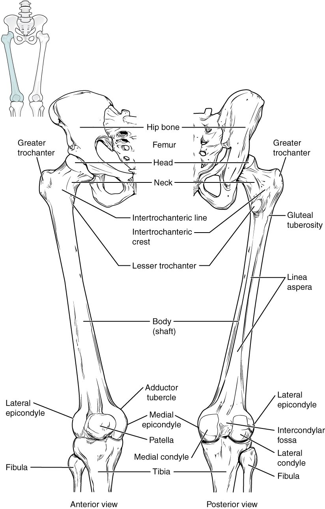
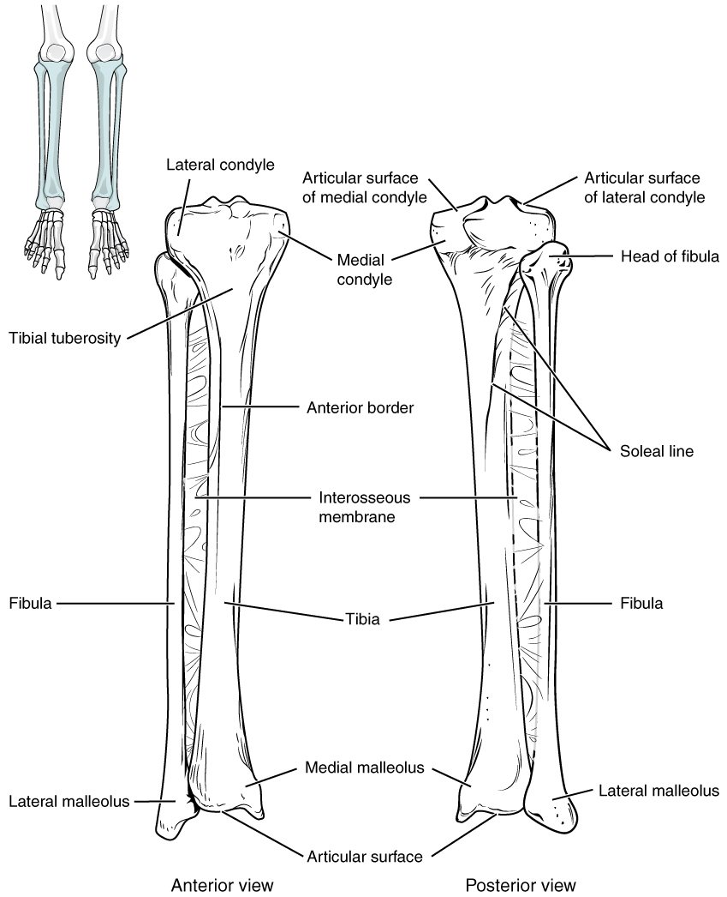

By the end of this section, you will be able to:
* Identify the divisions of the lower limb and describe the bones of
  each region
* Describe the bones and bony landmarks that articulate at each joint of
  the lower limb

Like the upper limb, the lower limb is divided into three regions. The
thigh is that portion of the lower limb
located between the hip joint and knee joint. The leg is specifically the region between the knee
joint and the ankle joint. Distal to the ankle is the foot. The lower limb contains 30 bones. These
are the femur, patella, tibia, fibula, tarsal bones, metatarsal bones,
and phalanges (see [\[link\]](/m46374#fig-ch08_01_01){:
.autogenerated-content}). The femur is the
single bone of the thigh. The patella is
the kneecap and articulates with the distal femur. The tibia is the larger, weight-bearing bone located
on the medial side of the leg, and the fibula is the thin bone of the lateral leg. The
bones of the foot are divided into three groups. The posterior portion
of the foot is formed by a group of seven bones, each of which is known
as a tarsal bone, whereas the mid-foot
contains five elongated bones, each of which is a metatarsal bone. The toes contain 14 small
bones, each of which is a phalanx bone of the
foot.

# Femur

The femur, or thigh bone, is the single bone of the thigh region
([\[link\]](#fig-ch08_04_01){: .autogenerated-content}). It is the
longest and strongest bone of the body, and accounts for approximately
one-quarter of a person’s total height. The rounded, proximal end is the
head of the femur, which articulates with
the acetabulum of the hip bone to form the hip
joint. The fovea capitis is a minor
indentation on the medial side of the femoral head that serves as the
site of attachment for the ligament of the head
of the femur. This ligament spans the femur and acetabulum, but
is weak and provides little support for the hip joint. It does, however,
carry an important artery that supplies the head of the femur.

{: #fig-ch08_04_01 data-media-type="image/jpg" data-title="Femur and Patella "}

The narrowed region below the head is the neck of
the femur. This is a common area for fractures of the femur. The
greater trochanter is the large, upward,
bony projection located above the base of the neck. Multiple muscles
that act across the hip joint attach to the greater trochanter, which,
because of its projection from the femur, gives additional leverage to
these muscles. The greater trochanter can be felt just under the skin on
the lateral side of your upper thigh. The lesser
trochanter is a small, bony prominence that lies on the medial
aspect of the femur, just below the neck. A single, powerful muscle
attaches to the lesser trochanter. Running between the greater and
lesser trochanters on the anterior side of the femur is the roughened
intertrochanteric line. The trochanters
are also connected on the posterior side of the femur by the larger
intertrochanteric crest.

The elongated shaft of the femur has a
slight anterior bowing or curvature. At its proximal end, the posterior
shaft has the gluteal tuberosity, a
roughened area extending inferiorly from the greater trochanter. More
inferiorly, the gluteal tuberosity becomes continuous with the linea aspera (“rough line”). This is the
roughened ridge that passes distally along the posterior side of the
mid-femur. Multiple muscles of the hip and thigh regions make long, thin
attachments to the femur along the linea aspera.

The distal end of the femur has medial and lateral bony expansions. On
the lateral side, the smooth portion that covers the distal and
posterior aspects of the lateral expansion is the lateral condyle of the femur. The roughened area
on the outer, lateral side of the condyle is the lateral epicondyle of the femur. Similarly, the
smooth region of the distal and posterior medial femur is the medial condyle of the femur, and the irregular
outer, medial side of this is the medial
epicondyle of the femur. The lateral and medial condyles
articulate with the tibia to form the knee joint. The epicondyles
provide attachment for muscles and supporting ligaments of the knee. The
adductor tubercle is a small bump located
at the superior margin of the medial epicondyle. Posteriorly, the medial
and lateral condyles are separated by a deep depression called the intercondylar fossa. Anteriorly, the smooth
surfaces of the condyles join together to form a wide groove called the
patellar surface, which provides for
articulation with the patella bone. The combination of the medial and
lateral condyles with the patellar surface gives the distal end of the
femur a horseshoe (U) shape.

 {:
data-media-type="image/png"} 
Watch this [video][1] to view how a fracture of the mid-femur is
surgically repaired. How are the two portions of the broken femur
stabilized during surgical repair of a fractured femur?

# Patella

The patella (kneecap) is largest sesamoid bone of the body (see
[\[link\]](#fig-ch08_04_01){: .autogenerated-content}). A sesamoid bone
is a bone that is incorporated into the tendon of a muscle where that
tendon crosses a joint. The sesamoid bone articulates with the
underlying bones to prevent damage to the muscle tendon due to rubbing
against the bones during movements of the joint. The patella is found in
the tendon of the quadriceps femoris muscle, the large muscle of the
anterior thigh that passes across the anterior knee to attach to the
tibia. The patella articulates with the patellar surface of the femur
and thus prevents rubbing of the muscle tendon against the distal femur.
The patella also lifts the tendon away from the knee joint, which
increases the leverage power of the quadriceps femoris muscle as it acts
across the knee. The patella does not articulate with the tibia.

 {:
data-media-type="image/png"} 
Visit this [site][2] to perform a virtual knee replacement surgery. The
prosthetic knee components must be properly aligned to function
properly. How is this alignment ensured?

Homeostatic Imbalances

Runner’s Knee Runner’s knee, also known
as patellofemoral syndrome, is the most common overuse injury among
runners. It is most frequent in adolescents and young adults, and is
more common in females. It often results from excessive running,
particularly downhill, but may also occur in athletes who do a lot of
knee bending, such as jumpers, skiers, cyclists, weight lifters, and
soccer players. It is felt as a dull, aching pain around the front of
the knee and deep to the patella. The pain may be felt when walking or
running, going up or down stairs, kneeling or squatting, or after
sitting with the knee bent for an extended period.

Patellofemoral syndrome may be initiated by a variety of causes,
including individual variations in the shape and movement of the
patella, a direct blow to the patella, or flat feet or improper shoes
that cause excessive turning in or out of the feet or leg. These factors
may cause in an imbalance in the muscle pull that acts on the patella,
resulting in an abnormal tracking of the patella that allows it to
deviate too far toward the lateral side of the patellar surface on the
distal femur.

Because the hips are wider than the knee region, the femur has a
diagonal orientation within the thigh, in contrast to the vertically
oriented tibia of the leg ([\[link\]](#fig-ch08_04_02){:
.autogenerated-content}). The Q-angle is a measure of how far the femur
is angled laterally away from vertical. The Q-angle is normally 10–15
degrees, with females typically having a larger Q-angle due to their
wider pelvis. During extension of the knee, the quadriceps femoris
muscle pulls the patella both superiorly and laterally, with the lateral
pull greater in women due to their large Q-angle. This makes women more
vulnerable to developing patellofemoral syndrome than men. Normally, the
large lip on the lateral side of the patellar surface of the femur
compensates for the lateral pull on the patella, and thus helps to
maintain its proper tracking.

However, if the pull produced by the medial and lateral sides of the
quadriceps femoris muscle is not properly balanced, abnormal tracking of
the patella toward the lateral side may occur. With continued use, this
produces pain and could result in damage to the articulating surfaces of
the patella and femur, and the possible future development of arthritis.
Treatment generally involves stopping the activity that produces knee
pain for a period of time, followed by a gradual resumption of activity.
Proper strengthening of the quadriceps femoris muscle to correct for
imbalances is also important to help prevent reoccurrence.

{: #fig-ch08_04_02 data-media-type="image/jpg"
data-title="The Q-Angle " data-z-for-sed=""}

# Tibia

The tibia (shin bone) is the medial bone of the leg and is larger than
the fibula, with which it is paired ([\[link\]](#fig-ch08_04_03){:
.autogenerated-content}). The tibia is the main weight-bearing bone of
the lower leg and the second longest bone of the body, after the femur.
The medial side of the tibia is located immediately under the skin,
allowing it to be easily palpated down the entire length of the medial
leg.

{: #fig-ch08_04_03 data-media-type="image/jpg" data-title="Tibia and Fibula "}

The proximal end of the tibia is greatly expanded. The two sides of this
expansion form the medial condyle of the
tibia and the lateral condyle of the
tibia. The tibia does not have epicondyles. The top surface of
each condyle is smooth and flattened. These areas articulate with the
medial and lateral condyles of the femur to form the knee joint. Between the articulating surfaces of
the tibial condyles is the intercondylar
eminence, an irregular, elevated area that serves as the inferior
attachment point for two supporting ligaments of the knee.

The tibial tuberosity is an elevated area
on the anterior side of the tibia, near its proximal end. It is the
final site of attachment for the muscle tendon associated with the
patella. More inferiorly, the shaft of the
tibia becomes triangular in shape. The anterior apex of

MH this triangle forms the anterior border of the
tibia, which begins at the tibial tuberosity and runs inferiorly
along the length of the tibia. Both the anterior border and the medial
side of the triangular shaft are located immediately under the skin and
can be easily palpated along the entire length of the tibia. A small
ridge running down the lateral side of the tibial shaft is the interosseous border of the tibia. This is for
the attachment of the interosseous membrane of
the leg, the sheet of dense connective tissue that unites the
tibia and fibula bones. Located on the posterior side of the tibia is
the soleal line, a diagonally running,
roughened ridge that begins below the base of the lateral condyle, and
runs down and medially across the proximal third of the posterior tibia.
Muscles of the posterior leg attach to this line.

The large expansion found on the medial side of the distal tibia is the
medial malleolus (“little hammer”). This
forms the large bony bump found on the medial side of the ankle region.
Both the smooth surface on the inside of the medial malleolus and the
smooth area at the distal end of the tibia articulate with the talus
bone of the foot as part of the ankle joint. On the lateral side of the
distal tibia is a wide groove called the fibular
notch. This area articulates with the distal end of the fibula,
forming the distal tibiofibular joint.

# Fibula

The fibula is the slender bone located on the lateral side of the leg
(see [\[link\]](#fig-ch08_04_03){: .autogenerated-content}). The fibula
does not bear weight. It serves primarily for muscle attachments and
thus is largely surrounded by muscles. Only the proximal and distal ends
of the fibula can be palpated.

The head of the fibula is the small,
knob-like, proximal end of the fibula. It articulates with the inferior
aspect of the lateral tibial condyle, forming the proximal tibiofibular joint. The thin shaft of the fibula has the interosseous border of the fibula, a narrow
ridge running down its medial side for the attachment of the
interosseous membrane that spans the fibula and tibia. The distal end of
the fibula forms the lateral malleolus,
which forms the easily palpated bony bump on the lateral side of the
ankle. The deep (medial) side of the lateral malleolus articulates with
the talus bone of the foot as part of the ankle joint. The distal fibula
also articulates with the fibular notch of the tibia.

# Tarsal Bones

The posterior half of the foot is formed by seven tarsal bones
([\[link\]](#fig-ch08_04_04){: .autogenerated-content}). The most
superior bone is the talus. This has a
relatively square-shaped, upper surface that articulates with the tibia
and fibula to form the ankle joint. Three
areas of articulation form the ankle joint: The superomedial surface of
the talus bone articulates with the medial malleolus of the tibia, the
top of the talus articulates with the distal end of the tibia, and the
lateral side of the talus articulates with the lateral malleolus of the
fibula. Inferiorly, the talus articulates with the calcaneus (heel bone), the largest bone of the
foot, which forms the heel. Body weight is transferred from the tibia to
the talus to the calcaneus, which rests on the ground. The medial
calcaneus has a prominent bony extension called the sustentaculum tali (“support for the talus”)
that supports the medial side of the talus bone.

{: #fig-ch08_04_04 data-media-type="image/jpg" data-title="Bones of the Foot "}

The cuboid bone articulates with the
anterior end of the calcaneus bone. The cuboid has a deep groove running
across its inferior surface, which provides passage for a muscle tendon.
The talus bone articulates anteriorly with the navicular bone, which in turn articulates
anteriorly with the three cuneiform (“wedge-shaped”) bones. These bones
are the medial cuneiform, the intermediate cuneiform, and the lateral cuneiform. Each of these bones has a
broad superior surface and a narrow inferior surface, which together
produce the transverse (medial-lateral) curvature of the foot. The
navicular and lateral cuneiform bones also articulate with the medial
side of the cuboid bone.

 {:
data-media-type="image/png"} 
Use this [tutorial][3] to review the bones of the foot. Which tarsal
bones are in the proximal, intermediate, and distal groups?

# Metatarsal Bones

The anterior half of the foot is formed by the five metatarsal bones,
which are located between the tarsal bones of the posterior foot and the
phalanges of the toes (see [\[link\]](#fig-ch08_04_04){:
.autogenerated-content}). These elongated bones are numbered 1–5,
starting with the medial side of the foot. The first metatarsal bone is
shorter and thicker than the others. The second metatarsal is the
longest. The base of the metatarsal bone
is the proximal end of each metatarsal bone. These articulate with the
cuboid or cuneiform bones. The base of the fifth metatarsal has a large,
lateral expansion that provides for muscle attachments. This expanded
base of the fifth metatarsal can be felt as a bony bump at the midpoint
along the lateral border of the foot. The expanded distal end of each
metatarsal is the head of the metatarsal
bone. Each metatarsal bone articulates with the proximal phalanx
of a toe to form a metatarsophalangeal
joint. The heads of the metatarsal bones also rest on the ground
and form the ball (anterior end) of the foot.

# Phalanges

The toes contain a total of 14 phalanx bones (phalanges), arranged in a
similar manner as the phalanges of the fingers (see
[\[link\]](#fig-ch08_04_04){: .autogenerated-content}). The toes are
numbered 1–5, starting with the big toe (hallux). The big toe has two phalanx bones, the
proximal and distal phalanges. The remaining toes all have proximal,
middle, and distal phalanges. A joint between adjacent phalanx bones is
called an interphalangeal joint.

 {:
data-media-type="image/png"} 
View this [link][4] to learn about a bunion, a localized swelling on the
medial side of the foot, next to the first metatarsophalangeal joint, at
the base of the big toe. What is a bunion and what type of shoe is most
likely to cause this to develop?

# Arches of the Foot

When the foot comes into contact with the ground during walking,
running, or jumping activities, the impact of the body weight puts a
tremendous amount of pressure and force on the foot. During running, the
force applied to each foot as it contacts the ground can be up to 2.5
times your body weight. The bones, joints, ligaments, and muscles of the
foot absorb this force, thus greatly reducing the amount of shock that
is passed superiorly into the lower limb and body. The arches of the
foot play an important role in this shock-absorbing ability. When weight
is applied to the foot, these arches will flatten somewhat, thus
absorbing energy. When the weight is removed, the arch rebounds, giving
“spring” to the step. The arches also serve to distribute body weight
side to side and to either end of the foot.

The foot has a transverse arch, a medial longitudinal arch, and a
lateral longitudinal arch (see [\[link\]](#fig-ch08_04_04){:
.autogenerated-content}). The transverse arch forms the medial-lateral
curvature of the mid-foot. It is formed by the wedge shapes of the
cuneiform bones and bases (proximal ends) of the first to fourth
metatarsal bones. This arch helps to distribute body weight from side to
side within the foot, thus allowing the foot to accommodate uneven
terrain.

The longitudinal arches run down the length of the foot. The lateral
longitudinal arch is relatively flat, whereas the medial longitudinal
arch is larger (taller). The longitudinal arches are formed by the
tarsal bones posteriorly and the metatarsal bones anteriorly. These
arches are supported at either end, where they contact the ground.
Posteriorly, this support is provided by the calcaneus bone and
anteriorly by the heads (distal ends) of the metatarsal bones. The talus
bone, which receives the weight of the body, is located at the top of
the longitudinal arches. Body weight is then conveyed from the talus to
the ground by the anterior and posterior ends of these arches. Strong
ligaments unite the adjacent foot bones to prevent disruption of the
arches during weight bearing. On the bottom of the foot, additional
ligaments tie together the anterior and posterior ends of the arches.
These ligaments have elasticity, which allows them to stretch somewhat
during weight bearing, thus allowing the longitudinal arches to spread.
The stretching of these ligaments stores energy within the foot, rather
than passing these forces into the leg. Contraction of the foot muscles
also plays an important role in this energy absorption. When the weight
is removed, the elastic ligaments recoil and pull the ends of the arches
closer together. This recovery of the arches releases the stored energy
and improves the energy efficiency of walking.

Stretching of the ligaments that support the longitudinal arches can
lead to pain. This can occur in overweight individuals, with people who
have jobs that involve standing for long periods of time (such as a
waitress), or walking or running long distances. If stretching of the
ligaments is prolonged, excessive, or repeated, it can result in a
gradual lengthening of the supporting ligaments, with subsequent
depression or collapse of the longitudinal arches, particularly on the
medial side of the foot. This condition is called pes planus (“flat
foot” or “fallen arches”).

# Chapter Review

The lower limb is divided into three regions. These are the thigh,
located between the hip and knee joints; the leg, located between the
knee and ankle joints; and distal to the ankle, the foot. There are 30
bones in each lower limb. These are the femur, patella, tibia, fibula,
seven tarsal bones, five metatarsal bones, and 14 phalanges.

The femur is the single bone of the thigh. Its rounded head articulates
with the acetabulum of the hip bone to form the hip joint. The head has
the fovea capitis for attachment of the ligament of the head of the
femur. The narrow neck joins inferiorly with the greater and lesser
trochanters. Passing between these bony expansions are the
intertrochanteric line on the anterior femur and the larger
intertrochanteric crest on the posterior femur. On the posterior shaft
of the femur is the gluteal tuberosity proximally and the linea aspera
in the mid-shaft region. The expanded distal end consists of three
articulating surfaces: the medial and lateral condyles, and the patellar
surface. The outside margins of the condyles are the medial and lateral
epicondyles. The adductor tubercle is on the superior aspect of the
medial epicondyle.

The patella is a sesamoid bone located within a muscle tendon. It
articulates with the patellar surface on the anterior side of the distal
femur, thereby protecting the muscle tendon from rubbing against the
femur.

The leg contains the large tibia on the medial side and the slender
fibula on the lateral side. The tibia bears the weight of the body,
whereas the fibula does not bear weight. The interosseous border of each
bone is the attachment site for the interosseous membrane of the leg,
the connective tissue sheet that unites the tibia and fibula.

The proximal tibia consists of the expanded medial and lateral condyles,
which articulate with the medial and lateral condyles of the femur to
form the knee joint. Between the tibial condyles is the intercondylar
eminence. On the anterior side of the proximal tibia is the tibial
tuberosity, which is continuous inferiorly with the anterior border of
the tibia. On the posterior side, the proximal tibia has the curved
soleal line. The bony expansion on the medial side of the distal tibia
is the medial malleolus. The groove on the lateral side of the distal
tibia is the fibular notch.

The head of the fibula forms the proximal end and articulates with the
underside of the lateral condyle of the tibia. The distal fibula
articulates with the fibular notch of the tibia. The expanded distal end
of the fibula is the lateral malleolus.

The posterior foot is formed by the seven tarsal bones. The talus
articulates superiorly with the distal tibia, the medial malleolus of
the tibia, and the lateral malleolus of the fibula to form the ankle
joint. The talus articulates inferiorly with the calcaneus bone. The
sustentaculum tali of the calcaneus helps to support the talus. Anterior
to the talus is the navicular bone, and anterior to this are the medial,
intermediate, and lateral cuneiform bones. The cuboid bone is anterior
to the calcaneus.

The five metatarsal bones form the anterior foot. The base of these
bones articulate with the cuboid or cuneiform bones. The metatarsal
heads, at their distal ends, articulate with the proximal phalanges of
the toes. The big toe (toe number 1) has proximal and distal phalanx
bones. The remaining toes have proximal, middle, and distal phalanges.

# Interactive Link Questions

Watch this [video][1] to view how a fracture of the mid-femur is
surgically repaired. How are the two portions of the broken femur
stabilized during surgical repair of a fractured femur?

A hole is drilled into the greater trochanter, the bone marrow
(medullary) space inside the femur is enlarged, and finally an
intramedullary rod is inserted into the femur. This rod is then anchored
to the bone with screws.

Visit this [site][2] to perform a virtual knee replacement surgery. The
prosthetic knee components must be properly aligned to function
properly. How is this alignment ensured?

Metal cutting jigs are attached to the bones to ensure that the bones
are cut properly prior to the attachment of prosthetic components.

Use this [tutorial][3] to review the bones of the foot. Which tarsal
bones are in the proximal, intermediate, and distal groups?

The proximal group of tarsal bones includes the calcaneus and talus
bones, the navicular bone is intermediate, and the distal group consists
of the cuboid bone plus the medial, intermediate, and lateral cuneiform
bones.

View this [link][4] to learn about a bunion, a localized swelling on the
medial side of the foot, next to the first metatarsophalangeal joint, at
the base of the big toe. What is a bunion and what type of shoe is most
likely to cause this to develop?

A bunion results from the deviation of the big toe toward the second
toe, which causes the distal end of the first metatarsal bone to stick
out. A bunion may also be caused by prolonged pressure on the foot from
pointed shoes with a narrow toe box that compresses the big toe and
pushes it toward the second toe.

# Review Questions

Which bony landmark of the femur serves as a site for muscle
attachments?

1.  fovea capitis
2.  lesser trochanter
3.  head
4.  medial condyle
{: data-number-style="lower-alpha"}

B

What structure contributes to the knee joint?

1.  lateral malleolus of the fibula
2.  tibial tuberosity
3.  medial condyle of the tibia
4.  lateral epicondyle of the femur
{: data-number-style="lower-alpha"}

C

Which tarsal bone articulates with the tibia and fibula?

1.  calcaneus
2.  cuboid
3.  navicular
4.  talus
{: data-number-style="lower-alpha"}

D

What is the total number of bones found in the foot and toes?

1.  7
2.  14
3.  26
4.  30
{: data-number-style="lower-alpha"}

C

The tibia ________.

1.  has an expanded distal end called the lateral malleolus
2.  is not a weight-bearing bone
3.  is firmly anchored to the fibula by an interosseous membrane
4.  can be palpated (felt) under the skin only at its proximal and
    distal ends
{: data-number-style="lower-alpha"}

C

# Critical Thinking Questions

Define the regions of the lower limb, name the bones found in each
region, and describe the bony landmarks that articulate together to form
the hip, knee, and ankle joints.

The lower limb is divided into three regions. The thigh is the region
located between the hip and knee joints. It contains the femur and the
patella. The hip joint is formed by the articulation between the
acetabulum of the hip bone and the head of the femur. The leg is the
region between the knee and ankle joints, and contains the tibia
(medially) and the fibula (laterally). The knee joint is formed by the
articulations between the medial and lateral condyles of the femur, and
the medial and lateral condyles of the tibia. Also associated with the
knee is the patella, which articulates with the patellar surface of the
distal femur. The foot is found distal to the ankle and contains 26
bones. The ankle joint is formed by the articulations between the talus
bone of the foot and the distal end of the tibia, the medial malleolus
of the tibia, and the lateral malleolus of the fibula. The posterior
foot contains the seven tarsal bones, which are the talus, calcaneus,
navicular, cuboid, and the medial, intermediate, and lateral cuneiform
bones. The anterior foot consists of the five metatarsal bones, which
are numbered 1–5 starting on the medial side of the foot. The toes
contain 14 phalanx bones, with the big toe (toe number 1) having a
proximal and a distal phalanx, and the other toes having proximal,
middle, and distal phalanges.

The talus bone of the foot receives the weight of the body from the
tibia. The talus bone then distributes this weight toward the ground in
two directions: one-half of the body weight is passed in a posterior
direction and one-half of the weight is passed in an anterior direction.
Describe the arrangement of the tarsal and metatarsal bones that are
involved in both the posterior and anterior distribution of body weight.

The talus bone articulates superiorly with the tibia and fibula at the
ankle joint, with body weight passed from the tibia to the talus. Body
weight from the talus is transmitted to the ground by both ends of the
medial and lateral longitudinal foot arches. Weight is passed
posteriorly through both arches to the calcaneus bone, which forms the
heel of the foot and is in contact with the ground. On the medial side
of the foot, body weight is passed anteriorly from the talus bone to the
navicular bone, and then to the medial, intermediate, and lateral
cuneiform bones. The cuneiform bones pass the weight anteriorly to the
first, second, and third metatarsal bones, whose heads (distal ends) are
in contact with the ground. On the lateral side, body weight is passed
anteriorly from the talus through the calcaneus, cuboid, and fourth and
fifth metatarsal bones. The talus bone thus transmits body weight
posteriorly to the calcaneus and anteriorly through the navicular,
cuneiform, and cuboid bones, and metatarsals one through five.

[1]: http://openstaxcollege.org/l/midfemur
[2]: http://openstaxcollege.org/l/kneesurgery
[3]: http://openstaxcollege.org/l/footbones
[4]: http://openstaxcollege.org/l/bunion
