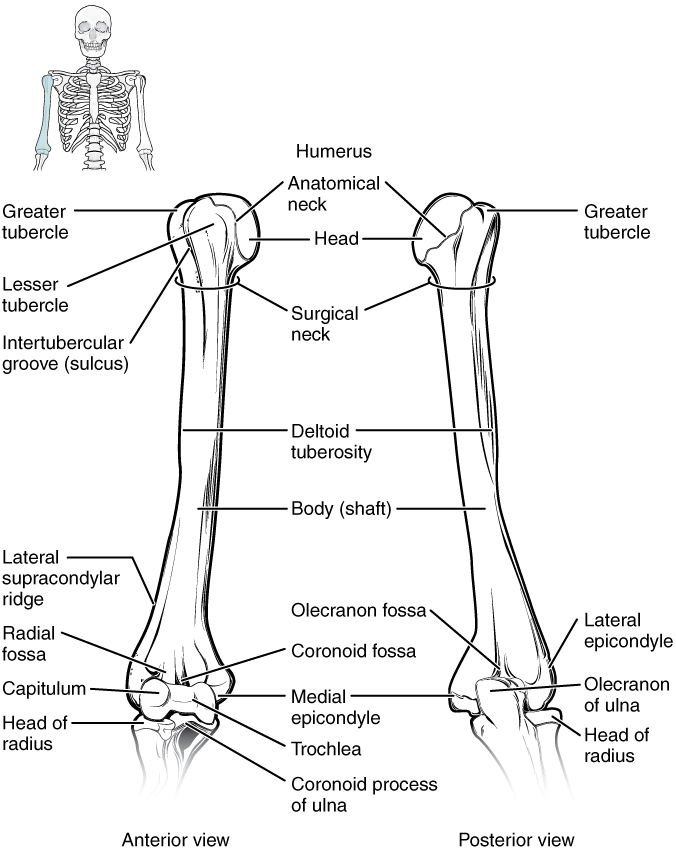
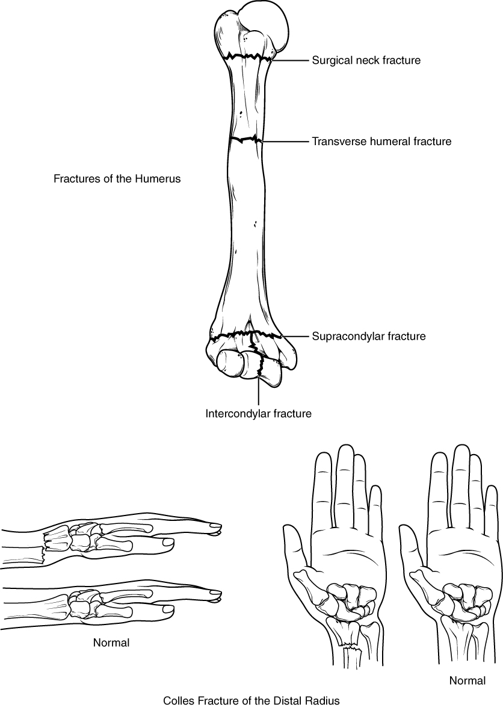

By the end of this section, you will be able to:
* Identify the divisions of the upper limb and describe the bones in each region
* List the bones and bony landmarks that articulate at each joint of the upper limb

The upper limb is divided into three regions. These consist of the **arm**{: data-type="term"}, located between the shoulder and elbow joints; the **forearm**{: data-type="term"}, which is between the elbow and wrist joints; and the **hand**{: data-type="term"}, which is located distal to the wrist. There are 30 bones in each upper limb (see [\[link\]](/m46374#fig-ch08_01_01)). The **humerus**{: data-type="term"} is the single bone of the upper arm, and the **ulna**{: data-type="term"} (medially) and the **radius**{: data-type="term"} (laterally) are the paired bones of the forearm. The base of the hand contains eight bones, each called a **carpal bone**{: data-type="term"}, and the palm of the hand is formed by five bones, each called a **metacarpal bone**{: data-type="term"}. The fingers and thumb contain a total of 14 bones, each of which is a **phalanx bone of the hand**{: data-type="term"}.

# Humerus

The humerus is the single bone of the upper arm region ([\[link\]](#fig-ch08_02_01)). At its proximal end is the **head of the humerus**{: data-type="term"}. This is the large, round, smooth region that faces medially. The head articulates with the glenoid cavity of the scapula to form the glenohumeral (shoulder) joint. The margin of the smooth area of the head is the **anatomical neck**{: data-type="term"} of the humerus. Located on the lateral side of the proximal humerus is an expanded bony area called the **greater tubercle**{: data-type="term"}. The smaller **lesser tubercle**{: data-type="term"} of the humerus is found on the anterior aspect of the humerus. Both the greater and lesser tubercles serve as attachment sites for muscles that act across the shoulder joint. Passing between the greater and lesser tubercles is the narrow **intertubercular groove (sulcus)**{: data-type="term"}, which is also known as the **bicipital groove**{: data-type="term"} because it provides passage for a tendon of the biceps brachii muscle. The **surgical neck**{: data-type="term"} is located at the base of the expanded, proximal end of the humerus, where it joins the narrow **shaft of the humerus**{: data-type="term"}. The surgical neck is a common site of arm fractures. The **deltoid tuberosity**{: data-type="term"} is a roughened, V-shaped region located on the lateral side in the middle of the humerus shaft. As its name indicates, it is the site of attachment for the deltoid muscle.

 {: #fig-ch08_02_01 data-media-type="image/jpg" data-title="Humerus and Elbow Joint "}

Distally, the humerus becomes flattened. The prominent bony projection on the medial side is the **medial epicondyle of the humerus**{: data-type="term"}. The much smaller **lateral epicondyle of the humerus**{: data-type="term"} is found on the lateral side of the distal humerus. The roughened ridge of bone above the lateral epicondyle is the **lateral supracondylar ridge**{: data-type="term"}. All of these areas are attachment points for muscles that act on the forearm, wrist, and hand. The powerful grasping muscles of the anterior forearm arise from the medial epicondyle, which is thus larger and more robust than the lateral epicondyle that gives rise to the weaker posterior forearm muscles.

The distal end of the humerus has two articulation areas, which join the ulna and radius bones of the forearm to form the **elbow joint**{: data-type="term"}. The more medial of these areas is the **trochlea**{: data-type="term"}, a spindle- or pulley-shaped region (trochlea = “pulley”), which articulates with the ulna bone. Immediately lateral to the trochlea is the **capitulum**{: data-type="term"} (“small head”), a knob-like structure located on the anterior surface of the distal humerus. The capitulum articulates with the radius bone of the forearm. Just above these bony areas are two small depressions. These spaces accommodate the forearm bones when the elbow is fully bent (flexed). Superior to the trochlea is the **coronoid fossa**{: data-type="term"}, which receives the coronoid process of the ulna, and above the capitulum is the **radial fossa**{: data-type="term"}, which receives the head of the radius when the elbow is flexed. Similarly, the posterior humerus has the **olecranon fossa**{: data-type="term"}, a larger depression that receives the olecranon process of the ulna when the forearm is fully extended.

# Ulna

The ulna is the medial bone of the forearm. It runs parallel to the radius, which is the lateral bone of the forearm ([\[link\]](#fig-ch08_02_02)). The proximal end of the ulna resembles a crescent wrench with its large, C-shaped **trochlear notch**{: data-type="term"}. This region articulates with the trochlea of the humerus as part of the elbow joint. The inferior margin of the trochlear notch is formed by a prominent lip of bone called the **coronoid process of the ulna**{: data-type="term"}. Just below this on the anterior ulna is a roughened area called the **ulnar tuberosity**{: data-type="term"}. To the lateral side and slightly inferior to the trochlear notch is a small, smooth area called the **radial notch of the ulna**{: data-type="term"}. This area is the site of articulation between the proximal radius and the ulna, forming the **proximal radioulnar joint**{: data-type="term"}. The posterior and superior portions of the proximal ulna make up the **olecranon process**{: data-type="term"}, which forms the bony tip of the elbow.

 {: #fig-ch08_02_02 data-media-type="image/jpg" data-title="Ulna and Radius "}

More distal is the **shaft of the ulna**{: data-type="term"}. The lateral side of the shaft forms a ridge called the **interosseous border of the ulna**{: data-type="term"}. This is the line of attachment for the **interosseous membrane of the forearm**{: data-type="term"}, a sheet of dense connective tissue that unites the ulna and radius bones. The small, rounded area that forms the distal end is the **head of the ulna**{: data-type="term"}. Projecting from the posterior side of the ulnar head is the **styloid process of the ulna**{: data-type="term"}, a short bony projection. This serves as an attachment point for a connective tissue structure that unites the distal ends of the ulna and radius.

In the anatomical position, with the elbow fully extended and the palms facing forward, the arm and forearm do not form a straight line. Instead, the forearm deviates laterally by 5–15 degrees from the line of the arm. This deviation is called the carrying angle. It allows the forearm and hand to swing freely or to carry an object without hitting the hip. The carrying angle is larger in females to accommodate their wider pelvis.

# Radius

The radius runs parallel to the ulna, on the lateral (thumb) side of the forearm (see [\[link\]](#fig-ch08_02_02)). The **head of the radius**{: data-type="term"} is a disc-shaped structure that forms the proximal end. The small depression on the surface of the head articulates with the capitulum of the humerus as part of the elbow joint, whereas the smooth, outer margin of the head articulates with the radial notch of the ulna at the proximal radioulnar joint. The **neck of the radius**{: data-type="term"} is the narrowed region immediately below the expanded head. Inferior to this point on the medial side is the **radial tuberosity**{: data-type="term"}, an oval-shaped, bony protuberance that serves as a muscle attachment point. The **shaft of the radius**{: data-type="term"} is slightly curved and has a small ridge along its medial side. This ridge forms the **interosseous border of the radius**{: data-type="term"}, which, like the similar border of the ulna, is the line of attachment for the interosseous membrane that unites the two forearm bones. The distal end of the radius has a smooth surface for articulation with two carpal bones to form the **radiocarpal joint**{: data-type="term"} or wrist joint ([\[link\]](#fig-ch08_02_03) and [\[link\]](#fig-ch08_02_04)). On the medial side of the distal radius is the **ulnar notch of the radius**{: data-type="term"}. This shallow depression articulates with the head of the ulna, which together form the **distal radioulnar joint**{: data-type="term"}. The lateral end of the radius has a pointed projection called the **styloid process of the radius**{: data-type="term"}. This provides attachment for ligaments that support the lateral side of the wrist joint. Compared to the styloid process of the ulna, the styloid process of the radius projects more distally, thereby limiting the range of movement for lateral deviations of the hand at the wrist joint.

 {: data-media-type="image/png"} 
Watch this [video][1] to see how fractures of the distal radius bone can affect the wrist joint. Explain the problems that may occur if a fracture of the distal radius involves the joint surface of the radiocarpal joint of the wrist.

# Carpal Bones

The wrist and base of the hand are formed by a series of eight small carpal bones (see [\[link\]](#fig-ch08_02_03)). The carpal bones are arranged in two rows, forming a proximal row of four carpal bones and a distal row of four carpal bones. The bones in the proximal row, running from the lateral (thumb) side to the medial side, are the **scaphoid**{: data-type="term"} (“boat-shaped”), **lunate**{: data-type="term"} (“moon-shaped”), **triquetrum**{: data-type="term"} (“three-cornered”), and **pisiform**{: data-type="term"} (“pea-shaped”) bones. The small, rounded pisiform bone articulates with the anterior surface of the triquetrum bone. The pisiform thus projects anteriorly, where it forms the bony bump that can be felt at the medial base of your hand. The distal bones (lateral to medial) are the **trapezium**{: data-type="term"} (“table”), **trapezoid**{: data-type="term"} (“resembles a table”), **capitate**{: data-type="term"} (“head-shaped”), and **hamate**{: data-type="term"} (“hooked bone”) bones. The hamate bone is characterized by a prominent bony extension on its anterior side called the **hook of the hamate bone**{: data-type="term"}.

A helpful mnemonic for remembering the arrangement of the carpal bones is “So Long To Pinky, Here Comes The Thumb.” This mnemonic starts on the lateral side and names the proximal bones from lateral to medial (scaphoid, lunate, triquetrum, pisiform), then makes a U-turn to name the distal bones from medial to lateral (hamate, capitate, trapezoid, trapezium). Thus, it starts and finishes on the lateral side.

 {: #fig-ch08_02_03 data-media-type="image/jpg" data-title="Bones of the Wrist and Hand "}

The carpal bones form the base of the hand. This can be seen in the radiograph (X-ray image) of the hand that shows the relationships of the hand bones to the skin creases of the hand (see [\[link\]](#fig-ch08_02_04)). Within the carpal bones, the four proximal bones are united to each other by ligaments to form a unit. Only three of these bones, the scaphoid, lunate, and triquetrum, contribute to the radiocarpal joint. The scaphoid and lunate bones articulate directly with the distal end of the radius, whereas the triquetrum bone articulates with a fibrocartilaginous pad that spans the radius and styloid process of the ulna. The distal end of the ulna thus does not directly articulate with any of the carpal bones.

The four distal carpal bones are also held together as a group by ligaments. The proximal and distal rows of carpal bones articulate with each other to form the **midcarpal joint**{: data-type="term"} (see [\[link\]](#fig-ch08_02_04)). Together, the radiocarpal and midcarpal joints are responsible for all movements of the hand at the wrist. The distal carpal bones also articulate with the metacarpal bones of the hand.

 "){: #fig-ch08_02_04 data-media-type="image/jpg" data-title="Bones of the Hand "}

In the articulated hand, the carpal bones form a U-shaped grouping. A strong ligament called the **flexor retinaculum**{: data-type="term"} spans the top of this U-shaped area to maintain this grouping of the carpal bones. The flexor retinaculum is attached laterally to the trapezium and scaphoid bones, and medially to the hamate and pisiform bones. Together, the carpal bones and the flexor retinaculum form a passageway called the **carpal tunnel**{: data-type="term"}, with the carpal bones forming the walls and floor, and the flexor retinaculum forming the roof of this space ([\[link\]](#fig-ch08_02_05)). The tendons of nine muscles of the anterior forearm and an important nerve pass through this narrow tunnel to enter the hand. Overuse of the muscle tendons or wrist injury can produce inflammation and swelling within this space. This produces compression of the nerve, resulting in carpal tunnel syndrome, which is characterized by pain or numbness, and muscle weakness in those areas of the hand supplied by this nerve.

 {: #fig-ch08_02_05 data-media-type="image/jpg" data-title="Carpal Tunnel "}

# Metacarpal Bones

The palm of the hand contains five elongated metacarpal bones. These bones lie between the carpal bones of the wrist and the bones of the fingers and thumb (see [\[link\]](#fig-ch08_02_03)). The proximal end of each metacarpal bone articulates with one of the distal carpal bones. Each of these articulations is a **carpometacarpal joint**{: data-type="term"} (see [\[link\]](#fig-ch08_02_04)). The expanded distal end of each metacarpal bone articulates at the **metacarpophalangeal joint**{: data-type="term"} with the proximal phalanx bone of the thumb or one of the fingers. The distal end also forms the knuckles of the hand, at the base of the fingers. The metacarpal bones are numbered 1–5, beginning at the thumb.

The first metacarpal bone, at the base of the thumb, is separated from the other metacarpal bones. This allows it a freedom of motion that is independent of the other metacarpal bones, which is very important for thumb mobility. The remaining metacarpal bones are united together to form the palm of the hand. The second and third metacarpal bones are firmly anchored in place and are immobile. However, the fourth and fifth metacarpal bones have limited anterior-posterior mobility, a motion that is greater for the fifth bone. This mobility is important during power gripping with the hand ([\[link\]](#fig-ch08_02_06)). The anterior movement of these bones, particularly the fifth metacarpal bone, increases the strength of contact for the medial hand during gripping actions.

  to (a)&#x2014;the fourth and, particularly, the fifth metatarsal bones are pulled anteriorly. This increases the contact between the object and the medial side of the hand, thus improving the firmness of the grip."){: #fig-ch08_02_06 data-media-type="image/jpg" data-title="Hand During Gripping "}

# Phalanx Bones

The fingers and thumb contain 14 bones, each of which is called a phalanx bone (plural = phalanges), named after the ancient Greek phalanx (a rectangular block of soldiers). The thumb (**pollex**{: data-type="term"}) is digit number 1 and has two phalanges, a proximal phalanx, and a distal phalanx bone (see [\[link\]](#fig-ch08_02_03)). Digits 2 (index finger) through 5 (little finger) have three phalanges each, called the proximal, middle, and distal phalanx bones. An **interphalangeal joint**{: data-type="term"} is one of the articulations between adjacent phalanges of the digits (see [\[link\]](#fig-ch08_02_04)).

 {: data-media-type="image/png"} 
Visit this [site][2] to explore the bones and joints of the hand. What are the three arches of the hand, and what is the importance of these during the gripping of an object?

Disorders of the…

Appendicular System: Fractures of Upper Limb Bones Due to our constant use of the hands and the rest of our upper limbs, an injury to any of these areas will cause a significant loss of functional ability. Many fractures result from a hard fall onto an outstretched hand. The resulting transmission of force up the limb may result in a fracture of the humerus, radius, or scaphoid bones. These injuries are especially common in elderly people whose bones are weakened due to osteoporosis.

Falls onto the hand or elbow, or direct blows to the arm, can result in fractures of the humerus ([\[link\]](#fig-ch08_02_07)). Following a fall, fractures at the surgical neck, the region at which the expanded proximal end of the humerus joins with the shaft, can result in an impacted fracture, in which the distal portion of the humerus is driven into the proximal portion. Falls or blows to the arm can also produce transverse or spiral fractures of the humeral shaft.

In children, a fall onto the tip of the elbow frequently results in a distal humerus fracture. In these, the olecranon of the ulna is driven upward, resulting in a fracture across the distal humerus, above both epicondyles (supracondylar fracture), or a fracture between the epicondyles, thus separating one or both of the epicondyles from the body of the humerus (intercondylar fracture). With these injuries, the immediate concern is possible compression of the artery to the forearm due to swelling of the surrounding tissues. If compression occurs, the resulting ischemia (lack of oxygen) due to reduced blood flow can quickly produce irreparable damage to the forearm muscles. In addition, four major nerves for shoulder and upper limb muscles are closely associated with different regions of the humerus, and thus, humeral fractures may also damage these nerves.

Another frequent injury following a fall onto an outstretched hand is a Colles fracture (“col-lees”) of the distal radius (see [\[link\]](#fig-ch08_02_07)). This involves a complete transverse fracture across the distal radius that drives the separated distal fragment of the radius posteriorly and superiorly. This injury results in a characteristic “dinner fork” bend of the forearm just above the wrist due to the posterior displacement of the hand. This is the most frequent forearm fracture and is a common injury in persons over the age of 50, particularly in older women with osteoporosis. It also commonly occurs following a high-speed fall onto the hand during activities such as snowboarding or skating.

The most commonly fractured carpal bone is the scaphoid, often resulting from a fall onto the hand. Deep pain at the lateral wrist may yield an initial diagnosis of a wrist sprain, but a radiograph taken several weeks after the injury, after tissue swelling has subsided, will reveal the fracture. Due to the poor blood supply to the scaphoid bone, healing will be slow and there is the danger of bone necrosis and subsequent degenerative joint disease of the wrist.

{: #fig-ch08_02_07 data-media-type="image/jpeg" data-title="Fractures of the Humerus and Radius "}

 {: data-media-type="image/png"} 
Watch this [video][3] to learn about a Colles fracture, a break of the distal radius, usually caused by falling onto an outstretched hand. When would surgery be required and how would the fracture be repaired in this case?

# Chapter Review

Each upper limb is divided into three regions and contains a total of 30 bones. The upper arm is the region located between the shoulder and elbow joints. This area contains the humerus. The proximal humerus consists of the head, which articulates with the scapula at the glenohumeral joint, the greater and lesser tubercles separated by the intertubercular (bicipital) groove, and the anatomical and surgical necks. The humeral shaft has the roughened area of the deltoid tuberosity on its lateral side. The distal humerus is flattened, forming a lateral supracondylar ridge that terminates at the small lateral epicondyle. The medial side of the distal humerus has the large, medial epicondyle. The articulating surfaces of the distal humerus consist of the trochlea medially and the capitulum laterally. Depressions on the humerus that accommodate the forearm bones during bending (flexing) and straightening (extending) of the elbow include the coronoid fossa, the radial fossa, and the olecranon fossa.

The forearm is the region of the upper limb located between the elbow and wrist joints. This region contains two bones, the ulna medially and the radius on the lateral (thumb) side. The elbow joint is formed by the articulation between the trochlea of the humerus and the trochlear notch of the ulna, plus the articulation between the capitulum of the humerus and the head of the radius. The proximal radioulnar joint is the articulation between the head of the radius and the radial notch of the ulna. The proximal ulna also has the olecranon process, forming an expanded posterior region, and the coronoid process and ulnar tuberosity on its anterior aspect. On the proximal radius, the narrowed region below the head is the neck; distal to this is the radial tuberosity. The shaft portions of both the ulna and radius have an interosseous border, whereas the distal ends of each bone have a pointed styloid process. The distal radioulnar joint is found between the head of the ulna and the ulnar notch of the radius. The distal end of the radius articulates with the proximal carpal bones, but the ulna does not.

The base of the hand is formed by eight carpal bones. The carpal bones are united into two rows of bones. The proximal row contains (from lateral to medial) the scaphoid, lunate, triquetrum, and pisiform bones. The scaphoid, lunate, and triquetrum bones contribute to the formation of the radiocarpal joint. The distal row of carpal bones contains (from medial to lateral) the hamate, capitate, trapezoid, and trapezium bones (“So Long To Pinky, Here Comes The Thumb”). The anterior hamate has a prominent bony hook. The proximal and distal carpal rows articulate with each other at the midcarpal joint. The carpal bones, together with the flexor retinaculum, also form the carpal tunnel of the wrist.

The five metacarpal bones form the palm of the hand. The metacarpal bones are numbered 1–5, starting with the thumb side. The first metacarpal bone is freely mobile, but the other bones are united as a group. The digits are also numbered 1–5, with the thumb being number 1. The fingers and thumb contain a total of 14 phalanges (phalanx bones). The thumb contains a proximal and a distal phalanx, whereas the remaining digits each contain proximal, middle, and distal phalanges.

# Interactive Link Questions

Watch this [video][1] to see how fractures of the distal radius bone can affect the wrist joint. Explain the problems that may occur if a fracture of the distal radius involves the joint surface of the radiocarpal joint of the wrist.

A fracture through the joint surface of the distal radius may make the articulating surface of the radius rough or jagged. This can then cause painful movements involving this joint and the early development of arthritis. Surgery can return the joint surface to its original smoothness, thus allowing for the return of normal function.

Visit this [site][2] to explore the bones and joints of the hand. What are the three arches of the hand, and what is the importance of these during the gripping of an object?

The hand has a proximal transverse arch, a distal transverse arch, and a longitudinal arch. These allow the hand to conform to objects being held. These arches maximize the amount of surface contact between the hand and object, which enhances stability and increases sensory input.

Watch this [video][3] to learn about a Colles fracture, a break of the distal radius, usually caused by falling onto an outstretched hand. When would surgery be required and how would the fracture be repaired in this case?

Surgery may be required if the fracture is unstable, meaning that the broken ends of the radius won’t stay in place to allow for proper healing. In this case, metal plates and screws can be used to stabilize the fractured bone.

# Review Questions

How many bones are there in the upper limbs combined?

1.  20
2.  30
3.  40
4.  60
{: data-number-style="lower-alpha"}

D

Which bony landmark is located on the lateral side of the proximal humerus?

1.  greater tubercle
2.  trochlea
3.  lateral epicondyle
4.  lesser tubercle
{: data-number-style="lower-alpha"}

A

Which region of the humerus articulates with the radius as part of the elbow joint?

1.  trochlea
2.  styloid process
3.  capitulum
4.  olecranon process
{: data-number-style="lower-alpha"}

C

Which is the lateral-most carpal bone of the proximal row?

1.  trapezium
2.  hamate
3.  pisiform
4.  scaphoid
{: data-number-style="lower-alpha"}

D

The radius bone \_\_\_\_\_\_\_\_.

1.  is found on the medial side of the forearm
2.  has a head that articulates with the radial notch of the ulna
3.  does not articulate with any of the carpal bones
4.  has the radial tuberosity located near its distal end
{: data-number-style="lower-alpha"}

B

# Critical Thinking Questions

Your friend runs out of gas and you have to help push his car. Discuss the sequence of bones and joints that convey the forces passing from your hand, through your upper limb and your pectoral girdle, and to your axial skeleton.

As you push against the car, forces will pass from the metacarpal bones of your hand into the carpal bones at the base of your hand. Forces will then pass through the midcarpal and radiocarpal joints into the radius and ulna bones of the forearm. These will pass the force through the elbow joint into the humerus of the arm, and then through the glenohumeral joint into the scapula. The force will travel through the acromioclavicular joint into the clavicle, and then through the sternoclavicular joint into the sternum, which is part of the axial skeleton.

Name the bones in the wrist and hand, and describe or sketch out their locations and articulations.

The base of the hand is formed by the eight carpal bones arranged in two rows (distal and proximal) of four bones each. The proximal row contains (from lateral to medial) the scaphoid, lunate, triquetrum, and pisiform bones. The distal row contains (from medial to lateral) the hamate, capitate, trapezoid, and trapezium bones. (Use the mnemonic “So Long To Pinky, Here Comes The Thumb” to remember this sequence). The rows of the proximal and distal carpal bones articulate with each other at the midcarpal joint. The palm of the hand contains the five metacarpal bones, which are numbered 1–5 starting on the thumb side. The proximal ends of the metacarpal bones articulate with the distal row of the carpal bones. The distal ends of the metacarpal bones articulate with the proximal phalanx bones of the thumb and fingers. The thumb (digit 1) has both a proximal and distal phalanx bone. The fingers (digits 2–5) all contain proximal, middle, and distal phalanges.

[1]: http://openstaxcollege.org/l/fractures
[2]: http://openstaxcollege.org/l/handbone
[3]: http://openstaxcollege.org/l/colles
