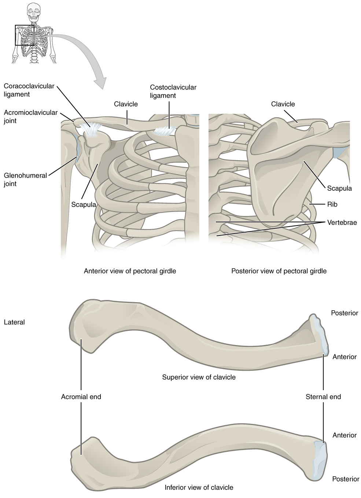

By the end of this section, you will be able to:
* Describe the bones that form the pectoral girdle
* List the functions of the pectoral girdle

The appendicular skeleton includes all of the limb bones, plus the bones
that unite each limb with the axial skeleton
([\[link\]](#fig-ch08_01_01){: .autogenerated-content}). The bones that
attach each upper limb to the axial skeleton form the pectoral girdle
(shoulder girdle). This consists of two bones, the scapula and clavicle
([\[link\]](#fig-ch08_01_02){: .autogenerated-content}). The clavicle
(collarbone) is an S-shaped bone located on the anterior side of the
shoulder. It is attached on its medial end to the sternum of the
thoracic cage, which is part of the axial skeleton. The lateral end of
the clavicle articulates (joins) with the scapula just above the
shoulder joint. You can easily palpate, or feel with your fingers, the
entire length of your clavicle.

{: #fig-ch08_01_01 data-media-type="image/jpg" data-title="Axial and Appendicular Skeletons "}

{: #fig-ch08_01_02 data-media-type="image/jpg" data-title="Pectoral Girdle "}

The scapula (shoulder blade) lies on the
posterior aspect of the shoulder. It is supported by the clavicle, which also articulates with the
humerus (arm bone) to form the shoulder joint. The scapula is a flat,
triangular-shaped bone with a prominent ridge running across its
posterior surface. This ridge extends out laterally, where it forms the
bony tip of the shoulder and joins with the lateral end of the clavicle.
By following along the clavicle, you can palpate out to the bony tip of
the shoulder, and from there, you can move back across your posterior
shoulder to follow the ridge of the scapula. Move your shoulder around
and feel how the clavicle and scapula move together as a unit. Both of
these bones serve as important attachment sites for muscles that aid
with movements of the shoulder and arm.

The right and left pectoral girdles are not joined to each other,
allowing each to operate independently. In addition, the clavicle of
each pectoral girdle is anchored to the
axial skeleton by a single, highly mobile joint. This allows for the
extensive mobility of the entire pectoral girdle, which in turn enhances
movements of the shoulder and upper limb.

# Clavicle

The clavicle is the only long bone that lies in a horizontal position in
the body (see [\[link\]](#fig-ch08_01_02){: .autogenerated-content}).
The clavicle has several important functions. First, anchored by muscles
from above, it serves as a strut that extends laterally to support the
scapula. This in turn holds the shoulder joint superiorly and laterally
from the body trunk, allowing for maximal freedom of motion for the
upper limb. The clavicle also transmits forces acting on the upper limb
to the sternum and axial skeleton. Finally, it serves to protect the
underlying nerves and blood vessels as they pass between the trunk of
the body and the upper limb.

The clavicle has three regions: the medial end, the lateral end, and the
shaft. The medial end, known as the sternal end
of the clavicle, has a triangular shape and articulates with the
manubrium portion of the sternum. This forms the sternoclavicular joint, which is the only bony
articulation between the pectoral girdle of the upper limb and the axial
skeleton. This joint allows considerable mobility, enabling the clavicle
and scapula to move in upward/downward and anterior/posterior directions
during shoulder movements. The sternoclavicular joint is indirectly
supported by the costoclavicular ligament
(costo- = “rib”), which spans the sternal end of the clavicle and the
underlying first rib. The lateral or acromial end
of the clavicle articulates with the acromion of the scapula, the
portion of the scapula that forms the bony tip of the shoulder. There
are some sex differences in the morphology of the clavicle. In women,
the clavicle tends to be shorter, thinner, and less curved. In men, the
clavicle is heavier and longer, and has a greater curvature and rougher
surfaces where muscles attach, features that are more pronounced in
manual workers.

The clavicle is the most commonly fractured bone in the body. Such
breaks often occur because of the force exerted on the clavicle when a
person falls onto his or her outstretched arms, or when the lateral
shoulder receives a strong blow. Because the sternoclavicular joint is
strong and rarely dislocated, excessive force results in the breaking of
the clavicle, usually between the middle and lateral portions of the
bone. If the fracture is complete, the shoulder and lateral clavicle
fragment will drop due to the weight of the upper limb, causing the
person to support the sagging limb with their other hand. Muscles acting
across the shoulder will also pull the shoulder and lateral clavicle
anteriorly and medially, causing the clavicle fragments to override. The
clavicle overlies many important blood vessels and nerves for the upper
limb, but fortunately, due to the anterior displacement of a broken
clavicle, these structures are rarely affected when the clavicle is
fractured.

# Scapula

The scapula is also part of the pectoral girdle and thus plays an
important role in anchoring the upper limb to the body. The scapula is
located on the posterior side of the shoulder. It is surrounded by
muscles on both its anterior (deep) and posterior (superficial) sides,
and thus does not articulate with the ribs of the thoracic cage.

The scapula has several important landmarks
([\[link\]](#fig-ch08_01_03){: .autogenerated-content}). The three
margins or borders of the scapula, named for their positions within the
body, are the superior border of the
scapula, the medial border of the
scapula, and the lateral border of the
scapula. The suprascapular notch is
located lateral to the midpoint of the superior border. The corners of
the triangular scapula, at either end of the medial border, are the
superior angle of the scapula, located
between the medial and superior borders, and the inferior angle of the scapula, located between
the medial and lateral borders. The inferior angle is the most inferior
portion of the scapula, and is particularly important because it serves
as the attachment point for several powerful muscles involved in
shoulder and upper limb movements. The remaining corner of the scapula,
between the superior and lateral borders, is the location of the glenoid cavity (glenoid fossa). This shallow
depression articulates with the humerus bone of the arm to form the
glenohumeral joint (shoulder joint). The
small bony bumps located immediately above and below the glenoid cavity
are the supraglenoid tubercle and the
infraglenoid tubercle, respectively. These
provide attachments for muscles of the arm.

 side and its posterior (superficial) side."){: #fig-ch08_01_03 data-media-type="image/jpg" data-title="Scapula "}

The scapula also has two prominent projections. Toward the lateral end
of the superior border, between the suprascapular notch and glenoid
cavity, is the hook-like coracoid process
(coracoid = “shaped like a crow’s beak”). This process projects
anteriorly and curves laterally. At the shoulder, the coracoid process
is located inferior to the lateral end of the clavicle. It is anchored
to the clavicle by a strong ligament, and serves as the attachment site
for muscles of the anterior chest and arm. On the posterior aspect, the
spine of the scapula is a long and
prominent ridge that runs across its upper portion. Extending laterally
from the spine is a flattened and expanded region called the acromion or acromial
process. The acromion forms the bony tip of the superior shoulder
region and articulates with the lateral end of the clavicle, forming the
acromioclavicular joint (see
[\[link\]](#fig-ch08_01_02){: .autogenerated-content}). Together, the
clavicle, acromion, and spine of the scapula form a V-shaped bony line
that provides for the attachment of neck and back muscles that act on
the shoulder, as well as muscles that pass across the shoulder joint to
act on the arm.

The scapula has three depressions, each of which is called a fossa (plural = fossae). Two of these are found
on the posterior scapula, above and below the scapular spine. Superior
to the spine is the narrow supraspinous
fossa, and inferior to the spine is the broad infraspinous fossa. The anterior (deep) surface
of the scapula forms the broad subscapular
fossa. All of these fossae provide large surface areas for the
attachment of muscles that cross the shoulder joint to act on the
humerus.

The acromioclavicular joint transmits forces from the upper limb to the
clavicle. The ligaments around this joint are relatively weak. A hard
fall onto the elbow or outstretched hand can stretch or tear the
acromioclavicular ligaments, resulting in a moderate injury to the
joint. However, the primary support for the acromioclavicular joint
comes from a very strong ligament called the coracoclavicular ligament (see
[\[link\]](#fig-ch08_01_02){: .autogenerated-content}). This connective
tissue band anchors the coracoid process of the scapula to the inferior
surface of the acromial end of the clavicle and thus provides important
indirect support for the acromioclavicular joint. Following a strong
blow to the lateral shoulder, such as when a hockey player is driven
into the boards, a complete dislocation of the acromioclavicular joint
can result. In this case, the acromion is thrust under the acromial end
of the clavicle, resulting in ruptures of both the acromioclavicular and
coracoclavicular ligaments. The scapula then separates from the
clavicle, with the weight of the upper limb pulling the shoulder
downward. This dislocation injury of the acromioclavicular joint is
known as a “shoulder separation” and is common in contact sports such as
hockey, football, or martial arts.

# Chapter Review

The pectoral girdle, consisting of the clavicle and the scapula,
attaches each upper limb to the axial skeleton. The clavicle is an
anterior bone whose sternal end articulates with the manubrium of the
sternum at the sternoclavicular joint. The sternal end is also anchored
to the first rib by the costoclavicular ligament. The acromial end of
the clavicle articulates with the acromion of the scapula at the
acromioclavicular joint. This end is also anchored to the coracoid
process of the scapula by the coracoclavicular ligament, which provides
indirect support for the acromioclavicular joint. The clavicle supports
the scapula, transmits the weight and forces from the upper limb to the
body trunk, and protects the underlying nerves and blood vessels.

The scapula lies on the posterior aspect of the pectoral girdle. It
mediates the attachment of the upper limb to the clavicle, and
contributes to the formation of the glenohumeral (shoulder) joint. This
triangular bone has three sides called the medial, lateral, and superior
borders. The suprascapular notch is located on the superior border. The
scapula also has three corners, two of which are the superior and
inferior angles. The third corner is occupied by the glenoid cavity.
Posteriorly, the spine separates the supraspinous and infraspinous
fossae, and then extends laterally as the acromion. The subscapular
fossa is located on the anterior surface of the scapula. The coracoid
process projects anteriorly, passing inferior to the lateral end of the
clavicle.

# Review Questions

Which part of the clavicle articulates with the manubrium?

1.  shaft
2.  sternal end
3.  acromial end
4.  coracoid process
{: data-number-style="lower-alpha"}

B

A shoulder separation results from injury to the ________.

1.  glenohumeral joint
2.  costoclavicular joint
3.  acromioclavicular joint
4.  sternoclavicular joint
{: data-number-style="lower-alpha"}

C

Which feature lies between the spine and superior border of the scapula?

1.  suprascapular notch
2.  glenoid cavity
3.  superior angle
4.  supraspinous fossa
{: data-number-style="lower-alpha"}

D

What structure is an extension of the spine of the scapula?

1.  acromion
2.  coracoid process
3.  supraglenoid tubercle
4.  glenoid cavity
{: data-number-style="lower-alpha"}

A

Name the short, hook-like bony process of the scapula that projects
anteriorly.

1.  acromial process
2.  clavicle
3.  coracoid process
4.  glenoid fossa
{: data-number-style="lower-alpha"}

C

# Critical Thinking Questions

Describe the shape and palpable line formed by the clavicle and scapula.

The clavicle extends laterally across the anterior shoulder and can be
palpated along its entire length. At its lateral end, the clavicle
articulates with the acromion of the scapula, which forms the bony tip
of the shoulder. The acromion is continuous with the spine of the
scapula, which can be palpated medially and posteriorly along its
length. Together, the clavicle, acromion, and spine of the scapula form
a V-shaped line that serves as an important area for muscle attachment.

Discuss two possible injuries of the pectoral girdle that may occur
following a strong blow to the shoulder or a hard fall onto an
outstretched hand.

A blow to the shoulder or falling onto an outstretched hand passes
strong forces through the scapula to the clavicle and sternum. A hard
fall may thus cause a fracture of the clavicle (broken collarbone) or
may injure the ligaments of the acromioclavicular joint. In a severe
case, the coracoclavicular ligament may also rupture, resulting in
complete dislocation of the acromioclavicular joint (a “shoulder
separation”).

