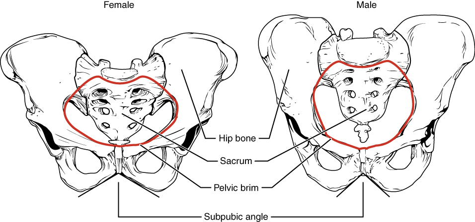

By the end of this section, you will be able to:
* Define the pelvic girdle and describe the bones and ligaments of the pelvis
* Explain the three regions of the hip bone and identify their bony landmarks
* Describe the openings of the pelvis and the boundaries of the greater and lesser pelvis

The **pelvic girdle**{: data-type="term"} (hip girdle) is formed by a single bone, the **hip bone**{: data-type="term"} or **coxal bone**{: data-type="term"} (coxal = “hip”), which serves as the attachment point for each lower limb. Each hip bone, in turn, is firmly joined to the axial skeleton via its attachment to the sacrum of the vertebral column. The right and left hip bones also converge anteriorly to attach to each other. The bony **pelvis**{: data-type="term"} is the entire structure formed by the two hip bones, the sacrum, and, attached inferiorly to the sacrum, the coccyx ([\[link\]](#fig-ch08_03_01)).

Unlike the bones of the pectoral girdle, which are highly mobile to enhance the range of upper limb movements, the bones of the pelvis are strongly united to each other to form a largely immobile, weight-bearing structure. This is important for stability because it enables the weight of the body to be easily transferred laterally from the vertebral column, through the pelvic girdle and hip joints, and into either lower limb whenever the other limb is not bearing weight. Thus, the immobility of the pelvis provides a strong foundation for the upper body as it rests on top of the mobile lower limbs.

 {: #fig-ch08_03_01 data-title="Pelvis "}

### Hip Bone

The hip bone, or coxal bone, forms the pelvic girdle portion of the pelvis. The paired hip bones are the large, curved bones that form the lateral and anterior aspects of the pelvis. Each adult hip bone is formed by three separate bones that fuse together during the late teenage years. These bony components are the ilium, ischium, and pubis ([\[link\]](#fig-ch08_03_02)). These names are retained and used to define the three regions of the adult hip bone.

 {: #fig-ch08_03_02 data-title="The Hip Bone "}

The **ilium**{: data-type="term"} is the fan-like, superior region that forms the largest part of the hip bone. It is firmly united to the sacrum at the largely immobile **sacroiliac joint**{: data-type="term"} (see [\[link\]](#fig-ch08_03_01)). The **ischium**{: data-type="term"} forms the posteroinferior region of each hip bone. It supports the body when sitting. The **pubis**{: data-type="term"} forms the anterior portion of the hip bone. The pubis curves medially, where it joins to the pubis of the opposite hip bone at a specialized joint called the **pubic symphysis**{: data-type="term"}.

#### Ilium

When you place your hands on your waist, you can feel the arching, superior margin of the ilium along your waistline (see [\[link\]](#fig-ch08_03_02)). This curved, superior margin of the ilium is the **iliac crest**{: data-type="term"}. The rounded, anterior termination of the iliac crest is the **anterior superior iliac spine**{: data-type="term"}. This important bony landmark can be felt at your anterolateral hip. Inferior to the anterior superior iliac spine is a rounded protuberance called the **anterior inferior iliac spine**{: data-type="term"}. Both of these iliac spines serve as attachment points for muscles of the thigh. Posteriorly, the iliac crest curves downward to terminate as the **posterior superior iliac spine**{: data-type="term"}. Muscles and ligaments surround but do not cover this bony landmark, thus sometimes producing a depression seen as a “dimple” located on the lower back. More inferiorly is the **posterior inferior iliac spine**{: data-type="term"}. This is located at the inferior end of a large, roughened area called the **auricular surface of the ilium**{: data-type="term"}. The auricular surface articulates with the auricular surface of the sacrum to form the sacroiliac joint. Both the posterior superior and posterior inferior iliac spines serve as attachment points for the muscles and very strong ligaments that support the sacroiliac joint.

The shallow depression located on the anteromedial (internal) surface of the upper ilium is called the **iliac fossa**{: data-type="term"}. The inferior margin of this space is formed by the **arcuate line of the ilium**{: data-type="term"}, the ridge formed by the pronounced change in curvature between the upper and lower portions of the ilium. The large, inverted U-shaped indentation located on the posterior margin of the lower ilium is called the **greater sciatic notch**{: data-type="term"}.

#### Ischium

The ischium forms the posterolateral portion of the hip bone (see [\[link\]](#fig-ch08_03_02)). The large, roughened area of the inferior ischium is the **ischial tuberosity**{: data-type="term"}. This serves as the attachment for the posterior thigh muscles and also carries the weight of the body when sitting. You can feel the ischial tuberosity if you wiggle your pelvis against the seat of a chair. Projecting superiorly and anteriorly from the ischial tuberosity is a narrow segment of bone called the **ischial ramus**{: data-type="term"}. The slightly curved posterior margin of the ischium above the ischial tuberosity is the **lesser sciatic notch**{: data-type="term"}. The bony projection separating the lesser sciatic notch and greater sciatic notch is the **ischial spine**{: data-type="term"}.

#### Pubis

The pubis forms the anterior portion of the hip bone (see [\[link\]](#fig-ch08_03_02)). The enlarged medial portion of the pubis is the **pubic body**{: data-type="term"}. Located superiorly on the pubic body is a small bump called the **pubic tubercle**{: data-type="term"}. The **superior pubic ramus**{: data-type="term"} is the segment of bone that passes laterally from the pubic body to join the ilium. The narrow ridge running along the superior margin of the superior pubic ramus is the **pectineal line**{: data-type="term"} of the pubis.

The pubic body is joined to the pubic body of the opposite hip bone by the pubic symphysis. Extending downward and laterally from the body is the **inferior pubic ramus**{: data-type="term"}. The **pubic arch**{: data-type="term"} is the bony structure formed by the pubic symphysis, and the bodies and inferior pubic rami of the adjacent pubic bones. The inferior pubic ramus extends downward to join the ischial ramus. Together, these form the single **ischiopubic ramus**{: data-type="term"}, which extends from the pubic body to the ischial tuberosity. The inverted V-shape formed as the ischiopubic rami from both sides come together at the pubic symphysis is called the **subpubic angle**{: data-type="term"}.

### Pelvis

The pelvis consists of four bones: the right and left hip bones, the sacrum, and the coccyx (see [\[link\]](#fig-ch08_03_01)). The pelvis has several important functions. Its primary role is to support the weight of the upper body when sitting and to transfer this weight to the lower limbs when standing. It serves as an attachment point for trunk and lower limb muscles, and also protects the internal pelvic organs. When standing in the anatomical position, the pelvis is tilted anteriorly. In this position, the anterior superior iliac spines and the pubic tubercles lie in the same vertical plane, and the anterior (internal) surface of the sacrum faces forward and downward.

The three areas of each hip bone, the ilium, pubis, and ischium, converge centrally to form a deep, cup-shaped cavity called the **acetabulum**{: data-type="term"}. This is located on the lateral side of the hip bone and is part of the hip joint. The large opening in the anteroinferior hip bone between the ischium and pubis is the **obturator foramen**{: data-type="term"}. This space is largely filled in by a layer of connective tissue and serves for the attachment of muscles on both its internal and external surfaces.

Several ligaments unite the bones of the pelvis ([\[link\]](#fig-ch08_03_03)). The largely immobile sacroiliac joint is supported by a pair of strong ligaments that are attached between the sacrum and ilium portions of the hip bone. These are the **anterior sacroiliac ligament**{: data-type="term"} on the anterior side of the joint and the **posterior sacroiliac ligament**{: data-type="term"} on the posterior side. Also spanning the sacrum and hip bone are two additional ligaments. The **sacrospinous ligament**{: data-type="term"} runs from the sacrum to the ischial spine, and the **sacrotuberous ligament**{: data-type="term"} runs from the sacrum to the ischial tuberosity. These ligaments help to support and immobilize the sacrum as it carries the weight of the body.

 {: #fig-ch08_03_03 data-title="Ligaments of the Pelvis "}

Watch this [video][1] for a 3-D view of the pelvis and its associated ligaments. What is the large opening in the bony pelvis, located between the ischium and pubic regions, and what two parts of the pubis contribute to the formation of this opening?

The sacrospinous and sacrotuberous ligaments also help to define two openings on the posterolateral sides of the pelvis through which muscles, nerves, and blood vessels for the lower limb exit. The superior opening is the **greater sciatic foramen**{: data-type="term"}. This large opening is formed by the greater sciatic notch of the hip bone, the sacrum, and the sacrospinous ligament. The smaller, more inferior **lesser sciatic foramen**{: data-type="term"} is formed by the lesser sciatic notch of the hip bone, together with the sacrospinous and sacrotuberous ligaments.

The space enclosed by the bony pelvis is divided into two regions ([\[link\]](#fig-ch08_03_04)). The broad, superior region, defined laterally by the large, fan-like portion of the upper hip bone, is called the **greater pelvis**{: data-type="term"} (greater pelvic cavity; false pelvis). This broad area is occupied by portions of the small and large intestines, and because it is more closely associated with the abdominal cavity, it is sometimes referred to as the false pelvis. More inferiorly, the narrow, rounded space of the **lesser pelvis**{: data-type="term"} (lesser pelvic cavity; true pelvis) contains the bladder and other pelvic organs, and thus is also known as the true pelvis. The **pelvic brim**{: data-type="term"} (also known as the **pelvic inlet**{: data-type="term"}) forms the superior margin of the lesser pelvis, separating it from the greater pelvis. The pelvic brim is defined by a line formed by the upper margin of the pubic symphysis anteriorly, and the pectineal line of the pubis, the arcuate line of the ilium, and the sacral promontory (the anterior margin of the superior sacrum) posteriorly. The inferior limit of the lesser pelvic cavity is called the **pelvic outlet**{: data-type="term"}. This large opening is defined by the inferior margin of the pubic symphysis anteriorly, and the ischiopubic ramus, the ischial tuberosity, the sacrotuberous ligament, and the inferior tip of the coccyx posteriorly. Because of the anterior tilt of the pelvis, the lesser pelvis is also angled, giving it an anterosuperior (pelvic inlet) to posteroinferior (pelvic outlet) orientation.

{: #fig-ch08_03_04 data-title="Male and Female Pelvis"}

#### Comparison of the Female and Male Pelvis

The differences between the adult female and male pelvis relate to function and body size. In general, the bones of the male pelvis are thicker and heavier, adapted for support of the male’s heavier physical build and stronger muscles. The greater sciatic notch of the male hip bone is narrower and deeper than the broader notch of females. Because the female pelvis is adapted for childbirth, it is wider than the male pelvis, as evidenced by the distance between the anterior superior iliac spines (see [\[link\]](#fig-ch08_03_04)). The ischial tuberosities of females are also farther apart, which increases the size of the pelvic outlet. Because of this increased pelvic width, the subpubic angle is larger in females (greater than 80 degrees) than it is in males (less than 70 degrees). The female sacrum is wider, shorter, and less curved, and the sacral promontory projects less into the pelvic cavity, thus giving the female pelvic inlet (pelvic brim) a more rounded or oval shape compared to males. The lesser pelvic cavity of females is also wider and more shallow than the narrower, deeper, and tapering lesser pelvis of males. Because of the obvious differences between female and male hip bones, this is the one bone of the body that allows for the most accurate sex determination. [\[link\]](#tbl-ch08_01) provides an overview of the general differences between the female and male pelvis.

<table id="tbl-ch08_01" summary=""><thead>
<tr>
<th colspan="3">Overview of Differences between the Female and Male Pelvis</th>
</tr>
<tr>
<th />
<th>Female pelvis</th>
<th>Male pelvis</th>
</tr>
</thead><tbody>
<tr>
<td><strong>Pelvic weight</strong></td>
<td>Bones of the pelvis are lighter and thinner</td>
<td>Bones of the pelvis are thicker and heavier</td>
</tr>
<tr>
<td><strong>Pelvic inlet shape</strong></td>
<td>Pelvic inlet has a round or oval shape</td>
<td>Pelvic inlet is heart-shaped</td>
</tr>
<tr>
<td><strong>Lesser pelvic cavity shape</strong></td>
<td>Lesser pelvic cavity is shorter and wider</td>
<td>Lesser pelvic cavity is longer and narrower</td>
</tr>
<tr>
<td><strong>Subpubic angle</strong></td>
<td>Subpubic angle is greater than 80 degrees</td>
<td>Subpubic angle is less than 70 degrees</td>
</tr>
<tr>
<td><strong>Pelvic outlet shape</strong></td>
<td>Pelvic outlet is rounded and larger</td>
<td>Pelvic outlet is smaller</td>
</tr>
</tbody></table>

Career Connection

Forensic Pathology and Forensic Anthropology A forensic pathologist (also known as a medical examiner) is a medically trained physician who has been specifically trained in pathology to examine the bodies of the deceased to determine the cause of death. A forensic pathologist applies his or her understanding of disease as well as toxins, blood and DNA analysis, firearms and ballistics, and other factors to assess the cause and manner of death. At times, a forensic pathologist will be called to testify under oath in situations that involve a possible crime. Forensic pathology is a field that has received much media attention on television shows or following a high-profile death.

While forensic pathologists are responsible for determining whether the cause of someone’s death was natural, a suicide, accidental, or a homicide, there are times when uncovering the cause of death is more complex, and other skills are needed. Forensic anthropology brings the tools and knowledge of physical anthropology and human osteology (the study of the skeleton) to the task of investigating a death. A forensic anthropologist assists medical and legal professionals in identifying human remains. The science behind forensic anthropology involves the study of archaeological excavation; the examination of hair; an understanding of plants, insects, and footprints; the ability to determine how much time has elapsed since the person died; the analysis of past medical history and toxicology; the ability to determine whether there are any postmortem injuries or alterations of the skeleton; and the identification of the decedent (deceased person) using skeletal and dental evidence.

Due to the extensive knowledge and understanding of excavation techniques, a forensic anthropologist is an integral and invaluable team member to have on-site when investigating a crime scene, especially when the recovery of human skeletal remains is involved. When remains are bought to a forensic anthropologist for examination, he or she must first determine whether the remains are in fact human. Once the remains have been identified as belonging to a person and not to an animal, the next step is to approximate the individual’s age, sex, race, and height. The forensic anthropologist does not determine the cause of death, but rather provides information to the forensic pathologist, who will use all of the data collected to make a final determination regarding the cause of death.

### Chapter Review

The pelvic girdle, consisting of a hip bone, serves to attach a lower limb to the axial skeleton. The hip bone articulates posteriorly at the sacroiliac joint with the sacrum, which is part of the axial skeleton. The right and left hip bones converge anteriorly and articulate with each other at the pubic symphysis. The combination of the hip bone, the sacrum, and the coccyx forms the pelvis. The pelvis has a pronounced anterior tilt. The primary function of the pelvis is to support the upper body and transfer body weight to the lower limbs. It also serves as the site of attachment for multiple muscles.

The hip bone consists of three regions: the ilium, ischium, and pubis. The ilium forms the large, fan-like region of the hip bone. The superior margin of this area is the iliac crest. Located at either end of the iliac crest are the anterior superior and posterior superior iliac spines. Inferior to these are the anterior inferior and posterior inferior iliac spines. The auricular surface of the ilium articulates with the sacrum to form the sacroiliac joint. The medial surface of the upper ilium forms the iliac fossa, with the arcuate line marking the inferior limit of this area. The posterior margin of the ilium has the large greater sciatic notch.

The posterolateral portion of the hip bone is the ischium. It has the expanded ischial tuberosity, which supports body weight when sitting. The ischial ramus projects anteriorly and superiorly. The posterior margin of the ischium has the shallow lesser sciatic notch and the ischial spine, which separates the greater and lesser sciatic notches.

The pubis forms the anterior portion of the hip bone. The body of the pubis articulates with the pubis of the opposite hip bone at the pubic symphysis. The superior margin of the pubic body has the pubic tubercle. The pubis is joined to the ilium by the superior pubic ramus, the superior surface of which forms the pectineal line. The inferior pubic ramus projects inferiorly and laterally. The pubic arch is formed by the pubic symphysis, the bodies of the adjacent pubic bones, and the two inferior pubic rami. The inferior pubic ramus joins the ischial ramus to form the ischiopubic ramus. The subpubic angle is formed by the medial convergence of the right and left ischiopubic rami.

The lateral side of the hip bone has the cup-like acetabulum, which is part of the hip joint. The large anterior opening is the obturator foramen. The sacroiliac joint is supported by the anterior and posterior sacroiliac ligaments. The sacrum is also joined to the hip bone by the sacrospinous ligament, which attaches to the ischial spine, and the sacrotuberous ligament, which attaches to the ischial tuberosity. The sacrospinous and sacrotuberous ligaments contribute to the formation of the greater and lesser sciatic foramina.

The broad space of the upper pelvis is the greater pelvis, and the narrow, inferior space is the lesser pelvis. These areas are separated by the pelvic brim (pelvic inlet). The inferior opening of the pelvis is the pelvic outlet. Compared to the male, the female pelvis is wider to accommodate childbirth, has a larger subpubic angle, and a broader greater sciatic notch.

### Interactive Link Questions

Watch this [video][1] for a 3-D view of the pelvis and its associated ligaments. What is the large opening in the bony pelvis, located between the ischium and pubic regions, and what two parts of the pubis contribute to the formation of this opening?

The obturator foramen is located between the ischium and the pubis. The superior and inferior pubic rami contribute to the boundaries of the obturator foramen.

### Review Questions

How many bones fuse in adulthood to form the hip bone?

1.  2
2.  3
3.  4
4.  5
{: data-number-style="lower-alpha"}

B

Which component forms the superior part of the hip bone?

1.  ilium
2.  pubis
3.  ischium
4.  sacrum
{: data-number-style="lower-alpha"}

A

Which of the following supports body weight when sitting?

1.  iliac crest
2.  ischial tuberosity
3.  ischiopubic ramus
4.  pubic body
{: data-number-style="lower-alpha"}

B

The ischial spine is found between which of the following structures?

1.  inferior pubic ramus and ischial ramus
2.  pectineal line and arcuate line
3.  lesser sciatic notch and greater sciatic notch
4.  anterior superior iliac spine and posterior superior iliac spine
{: data-number-style="lower-alpha"}

C

The pelvis \_\_\_\_\_\_\_\_.

1.  has a subpubic angle that is larger in females
2.  consists of the two hip bones, but does not include the sacrum or coccyx
3.  has an obturator foramen, an opening that is defined in part by the sacrospinous and sacrotuberous ligaments
4.  has a space located inferior to the pelvic brim called the greater pelvis
{: data-number-style="lower-alpha"}

A

### Critical Thinking Questions

Describe the articulations and ligaments that unite the four bones of the pelvis to each other.

The pelvis is formed by the combination of the right and left hip bones, the sacrum, and the coccyx. The auricular surfaces of each hip bone articulate with the auricular surface of the sacrum to form the sacroiliac joint. This joint is supported on either side by the strong anterior and posterior sacroiliac ligaments. The right and left hip bones converge anteriorly, where the pubic bodies articulate with each other to form the pubic symphysis joint. The sacrum is also attached to the hip bone by the sacrospinous ligament, which spans the sacrum to the ischial spine, and the sacrotuberous ligament, which runs from the sacrum to the ischial tuberosity. The coccyx is attached to the inferior end of the sacrum.

Discuss the ways in which the female pelvis is adapted for childbirth.

Compared to the male, the female pelvis is wider to accommodate childbirth. Thus, the female pelvis has greater distances between the anterior superior iliac spines and between the ischial tuberosities. The greater width of the female pelvis results in a larger subpubic angle. This angle, formed by the anterior convergence of the right and left ischiopubic rami, is larger in females (greater than 80 degrees) than in males (less than 70 degrees). The female sacral promontory does not project anteriorly as far as it does in males, which gives the pelvic brim (pelvic inlet) of the female a rounded or oval shape. The lesser pelvic cavity is wider and more shallow in females, and the pelvic outlet is larger than in males. Thus, the greater width of the female pelvis, with its larger pelvic inlet, lesser pelvis, and pelvic outlet, are important for childbirth because the baby must pass through the pelvis during delivery.

### Glossary
{: data-type="glossary-title"}

acetabulum
: large, cup-shaped cavity located on the lateral side of the hip bone; formed by the junction of the ilium, pubis, and ischium portions of the hip bone
^

anterior inferior iliac spine
: small, bony projection located on the anterior margin of the ilium, below the anterior superior iliac spine
^

anterior sacroiliac ligament
: strong ligament between the sacrum and the ilium portions of the hip bone that supports the anterior side of the sacroiliac joint
^

anterior superior iliac spine
: rounded, anterior end of the iliac crest
^

arcuate line of the ilium
: smooth ridge located at the inferior margin of the iliac fossa; forms the lateral portion of the pelvic brim
^

auricular surface of the ilium
: roughened area located on the posterior, medial side of the ilium of the hip bone; articulates with the auricular surface of the sacrum to form the sacroiliac joint
^

coxal bone
: hip bone
^

greater pelvis
: (also, greater pelvic cavity or false pelvis) broad space above the pelvic brim defined laterally by the fan-like portion of the upper ilium
^

greater sciatic foramen
: pelvic opening formed by the greater sciatic notch of the hip bone, the sacrum, and the sacrospinous ligament
^

greater sciatic notch
: large, U-shaped indentation located on the posterior margin of the ilium, superior to the ischial spine
^

hip bone
: coxal bone; single bone that forms the pelvic girdle; consists of three areas, the ilium, ischium, and pubis
^

iliac crest
: curved, superior margin of the ilium
^

iliac fossa
: shallow depression found on the anterior and medial surfaces of the upper ilium
^

ilium
: superior portion of the hip bone
^

inferior pubic ramus
: narrow segment of bone that passes inferiorly and laterally from the pubic body; joins with the ischial ramus to form the ischiopubic ramus
^

ischial ramus
: bony extension projecting anteriorly and superiorly from the ischial tuberosity; joins with the inferior pubic ramus to form the ischiopubic ramus
^

ischial spine
: pointed, bony projection from the posterior margin of the ischium that separates the greater sciatic notch and lesser sciatic notch
^

ischial tuberosity
: large, roughened protuberance that forms the posteroinferior portion of the hip bone; weight-bearing region of the pelvis when sitting
^

ischiopubic ramus
: narrow extension of bone that connects the ischial tuberosity to the pubic body; formed by the junction of the ischial ramus and inferior pubic ramus
^

ischium
: posteroinferior portion of the hip bone
^

lesser pelvis
: (also, lesser pelvic cavity or true pelvis) narrow space located within the pelvis, defined superiorly by the pelvic brim (pelvic inlet) and inferiorly by the pelvic outlet
^

lesser sciatic foramen
: pelvic opening formed by the lesser sciatic notch of the hip bone, the sacrospinous ligament, and the sacrotuberous ligament
^

lesser sciatic notch
: shallow indentation along the posterior margin of the ischium, inferior to the ischial spine
^

obturator foramen
: large opening located in the anterior hip bone, between the pubis and ischium regions
^

pectineal line
: narrow ridge located on the superior surface of the superior pubic ramus
^

pelvic brim
: pelvic inlet; the dividing line between the greater and lesser pelvic regions; formed by the superior margin of the pubic symphysis, the pectineal lines of each pubis, the arcuate lines of each ilium, and the sacral promontory
^

pelvic girdle
: hip girdle; consists of a single hip bone, which attaches a lower limb to the sacrum of the axial skeleton
^

pelvic inlet
: pelvic brim
^

pelvic outlet
: inferior opening of the lesser pelvis; formed by the inferior margin of the pubic symphysis, right and left ischiopubic rami and sacrotuberous ligaments, and the tip of the coccyx
^

pelvis
: ring of bone consisting of the right and left hip bones, the sacrum, and the coccyx
^

posterior inferior iliac spine
: small, bony projection located at the inferior margin of the auricular surface on the posterior ilium
^

posterior sacroiliac ligament
: strong ligament spanning the sacrum and ilium of the hip bone that supports the posterior side of the sacroiliac joint
^

posterior superior iliac spine
: rounded, posterior end of the iliac crest
^

pubic arch
: bony structure formed by the pubic symphysis, and the bodies and inferior pubic rami of the right and left pubic bones
^

pubic body
: enlarged, medial portion of the pubis region of the hip bone
^

pubic symphysis
: joint formed by the articulation between the pubic bodies of the right and left hip bones
^

pubic tubercle
: small bump located on the superior aspect of the pubic body
^

pubis
: anterior portion of the hip bone
^

sacroiliac joint
: joint formed by the articulation between the auricular surfaces of the sacrum and ilium
^

sacrospinous ligament
: ligament that spans the sacrum to the ischial spine of the hip bone
^

sacrotuberous ligament
: ligament that spans the sacrum to the ischial tuberosity of the hip bone
^

subpubic angle
: inverted V-shape formed by the convergence of the right and left ischiopubic rami; this angle is greater than 80 degrees in females and less than 70 degrees in males
^

superior pubic ramus
: narrow segment of bone that passes laterally from the pubic body to join the ilium

[1]: http://openstaxcollege.org/l/3Dpelvis
