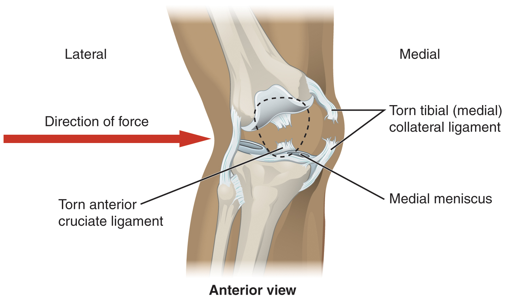

By the end of this section, you will be able to:
* Describe the bones that articulate together to form selected synovial joints
* Discuss the movements available at each joint
* Describe the structures that support and prevent excess movements at each joint

Each synovial joint of the body is specialized to perform certain movements. The movements that are allowed are determined by the structural classification for each joint. For example, a multiaxial ball-and-socket joint has much more mobility than a uniaxial hinge joint. However, the ligaments and muscles that support a joint may place restrictions on the total range of motion available. Thus, the ball-and-socket joint of the shoulder has little in the way of ligament support, which gives the shoulder a very large range of motion. In contrast, movements at the hip joint are restricted by strong ligaments, which reduce its range of motion but confer stability during standing and weight bearing.

This section will examine the anatomy of selected synovial joints of the body. Anatomical names for most joints are derived from the names of the bones that articulate at that joint, although some joints, such as the elbow, hip, and knee joints are exceptions to this general naming scheme.

### Articulations of the Vertebral Column

In addition to being held together by the intervertebral discs, adjacent vertebrae also articulate with each other at synovial joints formed between the superior and inferior articular processes called **zygapophysial joints**{: data-type="term"} (facet joints) (see [\[link\]](/m46383#fig-ch09_01_02)). These are plane joints that provide for only limited motions between the vertebrae. The orientation of the articular processes at these joints varies in different regions of the vertebral column and serves to determine the types of motions available in each vertebral region. The cervical and lumbar regions have the greatest ranges of motions.

In the neck, the articular processes of cervical vertebrae are flattened and generally face upward or downward. This orientation provides the cervical vertebral column with extensive ranges of motion for flexion, extension, lateral flexion, and rotation. In the thoracic region, the downward projecting and overlapping spinous processes, along with the attached thoracic cage, greatly limit flexion, extension, and lateral flexion. However, the flattened and vertically positioned thoracic articular processes allow for the greatest range of rotation within the vertebral column. The lumbar region allows for considerable extension, flexion, and lateral flexion, but the orientation of the articular processes largely prohibits rotation.

The articulations formed between the skull, the atlas (C1 vertebra), and the axis (C2 vertebra) differ from the articulations in other vertebral areas and play important roles in movement of the head. The **atlanto-occipital joint**{: data-type="term"} is formed by the articulations between the superior articular processes of the atlas and the occipital condyles on the base of the skull. This articulation has a pronounced U-shaped curvature, oriented along the anterior-posterior axis. This allows the skull to rock forward and backward, producing flexion and extension of the head. This moves the head up and down, as when shaking your head “yes.”

The **atlantoaxial joint**{: data-type="term"}, between the atlas and axis, consists of three articulations. The paired superior articular processes of the axis articulate with the inferior articular processes of the atlas. These articulating surfaces are relatively flat and oriented horizontally. The third articulation is the pivot joint formed between the dens, which projects upward from the body of the axis, and the inner aspect of the anterior arch of the atlas ([\[link\]](#fig-ch09_06_01)). A strong ligament passes posterior to the dens to hold it in position against the anterior arch. These articulations allow the atlas to rotate on top of the axis, moving the head toward the right or left, as when shaking your head “no.”

 and the anterior arch of the atlas (C1 vertebra), with the dens held in place by a ligament."){: #fig-ch09_06_01 data-title="Atlantoaxial Joint "}

### Temporomandibular Joint

The **temporomandibular joint (TMJ)**{: data-type="term"} is the joint that allows for opening (mandibular depression) and closing (mandibular elevation) of the mouth, as well as side-to-side and protraction/retraction motions of the lower jaw. This joint involves the articulation between the mandibular fossa and articular tubercle of the temporal bone, with the condyle (head) of the mandible. Located between these bony structures, filling the gap between the skull and mandible, is a flexible articular disc ([\[link\]](#fig-ch09_06_02)). This disc serves to smooth the movements between the temporal bone and mandibular condyle.

Movement at the TMJ during opening and closing of the mouth involves both gliding and hinge motions of the mandible. With the mouth closed, the mandibular condyle and articular disc are located within the mandibular fossa of the temporal bone. During opening of the mouth, the mandible hinges downward and at the same time is pulled anteriorly, causing both the condyle and the articular disc to glide forward from the mandibular fossa onto the downward projecting articular tubercle. The net result is a forward and downward motion of the condyle and mandibular depression. The temporomandibular joint is supported by an extrinsic ligament that anchors the mandible to the skull. This ligament spans the distance between the base of the skull and the lingula on the medial side of the mandibular ramus.

Dislocation of the TMJ may occur when opening the mouth too wide (such as when taking a large bite) or following a blow to the jaw, resulting in the mandibular condyle moving beyond (anterior to) the articular tubercle. In this case, the individual would not be able to close his or her mouth. Temporomandibular joint disorder is a painful condition that may arise due to arthritis, wearing of the articular cartilage covering the bony surfaces of the joint, muscle fatigue from overuse or grinding of the teeth, damage to the articular disc within the joint, or jaw injury. Temporomandibular joint disorders can also cause headache, difficulty chewing, or even the inability to move the jaw (lock jaw). Pharmacologic agents for pain or other therapies, including bite guards, are used as treatments.

 , the mandibular condyle moves both forward and hinges downward as it travels from the mandibular fossa onto the articular tubercle."){: #fig-ch09_06_02 data-title="Temporomandibular Joint "}

  
Watch this [video][1] to learn about TMJ. Opening of the mouth requires the combination of two motions at the temporomandibular joint, an anterior gliding motion of the articular disc and mandible and the downward hinging of the mandible. What is the initial movement of the mandible during opening and how much mouth opening does this produce?

### Shoulder Joint

The shoulder joint is called the **glenohumeral joint**{: data-type="term"}. This is a ball-and-socket joint formed by the articulation between the head of the humerus and the glenoid cavity of the scapula ([\[link\]](#fig-ch09_06_03)). This joint has the largest range of motion of any joint in the body. However, this freedom of movement is due to the lack of structural support and thus the enhanced mobility is offset by a loss of stability.

  joint is a ball-and-socket joint that provides the widest range of motions. It has a loose articular capsule and is supported by ligaments and the rotator cuff muscles."){: #fig-ch09_06_03 data-title="Glenohumeral Joint "}

The large range of motions at the shoulder joint is provided by the articulation of the large, rounded humeral head with the small and shallow glenoid cavity, which is only about one third of the size of the humeral head. The socket formed by the glenoid cavity is deepened slightly by a small lip of fibrocartilage called the **glenoid labrum**{: data-type="term"}, which extends around the outer margin of the cavity. The articular capsule that surrounds the glenohumeral joint is relatively thin and loose to allow for large motions of the upper limb. Some structural support for the joint is provided by thickenings of the articular capsule wall that form weak intrinsic ligaments. These include the **coracohumeral ligament**{: data-type="term"}, running from the coracoid process of the scapula to the anterior humerus, and three ligaments, each called a **glenohumeral ligament**{: data-type="term"}, located on the anterior side of the articular capsule. These ligaments help to strengthen the superior and anterior capsule walls.

However, the primary support for the shoulder joint is provided by muscles crossing the joint, particularly the four rotator cuff muscles. These muscles (supraspinatus, infraspinatus, teres minor, and subscapularis) arise from the scapula and attach to the greater or lesser tubercles of the humerus. As these muscles cross the shoulder joint, their tendons encircle the head of the humerus and become fused to the anterior, superior, and posterior walls of the articular capsule. The thickening of the capsule formed by the fusion of these four muscle tendons is called the **rotator cuff**{: data-type="term"}. Two bursae, the **subacromial bursa**{: data-type="term"} and the **subscapular bursa**{: data-type="term"}, help to prevent friction between the rotator cuff muscle tendons and the scapula as these tendons cross the glenohumeral joint. In addition to their individual actions of moving the upper limb, the rotator cuff muscles also serve to hold the head of the humerus in position within the glenoid cavity. By constantly adjusting their strength of contraction to resist forces acting on the shoulder, these muscles serve as “dynamic ligaments” and thus provide the primary structural support for the glenohumeral joint.

Injuries to the shoulder joint are common. Repetitive use of the upper limb, particularly in abduction such as during throwing, swimming, or racquet sports, may lead to acute or chronic inflammation of the bursa or muscle tendons, a tear of the glenoid labrum, or degeneration or tears of the rotator cuff. Because the humeral head is strongly supported by muscles and ligaments around its anterior, superior, and posterior aspects, most dislocations of the humerus occur in an inferior direction. This can occur when force is applied to the humerus when the upper limb is fully abducted, as when diving to catch a baseball and landing on your hand or elbow. Inflammatory responses to any shoulder injury can lead to the formation of scar tissue between the articular capsule and surrounding structures, thus reducing shoulder mobility, a condition called adhesive capsulitis (“frozen shoulder”).

  
Watch this [video][2] for a tutorial on the anatomy of the shoulder joint. What movements are available at the shoulder joint?

  
Watch this [video][3] to learn more about the anatomy of the shoulder joint, including bones, joints, muscles, nerves, and blood vessels. What is the shape of the glenoid labrum in cross-section, and what is the importance of this shape?

### Elbow Joint

The **elbow joint**{: data-type="term"} is a uniaxial hinge joint formed by the **humeroulnar joint**{: data-type="term"}, the articulation between the trochlea of the humerus and the trochlear notch of the ulna. Also associated with the elbow are the **humeroradial joint**{: data-type="term"} and the proximal radioulnar joint. All three of these joints are enclosed within a single articular capsule ([\[link\]](#fig-ch09_06_04)).

The articular capsule of the elbow is thin on its anterior and posterior aspects, but is thickened along its outside margins by strong intrinsic ligaments. These ligaments prevent side-to-side movements and hyperextension. On the medial side is the triangular **ulnar collateral ligament**{: data-type="term"}. This arises from the medial epicondyle of the humerus and attaches to the medial side of the proximal ulna. The strongest part of this ligament is the anterior portion, which resists hyperextension of the elbow. The ulnar collateral ligament may be injured by frequent, forceful extensions of the forearm, as is seen in baseball pitchers. Reconstructive surgical repair of this ligament is referred to as Tommy John surgery, named for the former major league pitcher who was the first person to have this treatment.

The lateral side of the elbow is supported by the **radial collateral ligament**{: data-type="term"}. This arises from the lateral epicondyle of the humerus and then blends into the lateral side of the annular ligament. The **annular ligament**{: data-type="term"} encircles the head of the radius. This ligament supports the head of the radius as it articulates with the radial notch of the ulna at the proximal radioulnar joint. This is a pivot joint that allows for rotation of the radius during supination and pronation of the forearm.

  The elbow is a hinge joint that allows only for flexion and extension of the forearm. (b) It is supported by the ulnar and radial collateral ligaments. (c) The annular ligament supports the head of the radius at the proximal radioulnar joint, the pivot joint that allows for rotation of the radius."){: #fig-ch09_06_04 data-title="Elbow Joint "}

  
Watch this [animation][4] to learn more about the anatomy of the elbow joint. Which structures provide the main stability for the elbow?

  
Watch this [video][5] to learn more about the anatomy of the elbow joint, including bones, joints, muscles, nerves, and blood vessels. What are the functions of the articular cartilage?

### Hip Joint

The hip joint is a multiaxial ball-and-socket joint between the head of the femur and the acetabulum of the hip bone ([\[link\]](#fig-ch09_06_05)). The hip carries the weight of the body and thus requires strength and stability during standing and walking. For these reasons, its range of motion is more limited than at the shoulder joint.

The acetabulum is the socket portion of the hip joint. This space is deep and has a large articulation area for the femoral head, thus giving stability and weight bearing ability to the joint. The acetabulum is further deepened by the **acetabular labrum**{: data-type="term"}, a fibrocartilage lip attached to the outer margin of the acetabulum. The surrounding articular capsule is strong, with several thickened areas forming intrinsic ligaments. These ligaments arise from the hip bone, at the margins of the acetabulum, and attach to the femur at the base of the neck. The ligaments are the **iliofemoral ligament**{: data-type="term"}, **pubofemoral ligament**{: data-type="term"}, and **ischiofemoral ligament**{: data-type="term"}, all of which spiral around the head and neck of the femur. The ligaments are tightened by extension at the hip, thus pulling the head of the femur tightly into the acetabulum when in the upright, standing position. Very little additional extension of the thigh is permitted beyond this vertical position. These ligaments thus stabilize the hip joint and allow you to maintain an upright standing position with only minimal muscle contraction. Inside of the articular capsule, the **ligament of the head of the femur**{: data-type="term"} (ligamentum teres) spans between the acetabulum and femoral head. This intracapsular ligament is normally slack and does not provide any significant joint support, but it does provide a pathway for an important artery that supplies the head of the femur.

The hip is prone to osteoarthritis, and thus was the first joint for which a replacement prosthesis was developed. A common injury in elderly individuals, particularly those with weakened bones due to osteoporosis, is a “broken hip,” which is actually a fracture of the femoral neck. This may result from a fall, or it may cause the fall. This can happen as one lower limb is taking a step and all of the body weight is placed on the other limb, causing the femoral neck to break and producing a fall. Any accompanying disruption of the blood supply to the femoral neck or head can lead to necrosis of these areas, resulting in bone and cartilage death. Femoral fractures usually require surgical treatment, after which the patient will need mobility assistance for a prolonged period, either from family members or in a long-term care facility. Consequentially, the associated health care costs of “broken hips” are substantial. In addition, hip fractures are associated with increased rates of morbidity (incidences of disease) and mortality (death). Surgery for a hip fracture followed by prolonged bed rest may lead to life-threatening complications, including pneumonia, infection of pressure ulcers (bedsores), and thrombophlebitis (deep vein thrombosis; blood clot formation) that can result in a pulmonary embolism (blood clot within the lung).

  The ball-and-socket joint of the hip is a multiaxial joint that provides both stability and a wide range of motion. (b&#x2013;c) When standing, the supporting ligaments are tight, pulling the head of the femur into the acetabulum."){: #fig-ch09_06_05 data-title="Hip Joint "}

  
Watch this [video][6] for a tutorial on the anatomy of the hip joint. What is a possible consequence following a fracture of the femoral neck within the capsule of the hip joint?

  
Watch this [video][7] to learn more about the anatomy of the hip joint, including bones, joints, muscles, nerves, and blood vessels. Where is the articular cartilage thickest within the hip joint?

### Knee Joint

The knee joint is the largest joint of the body ([\[link\]](#fig-ch09_06_06)). It actually consists of three articulations. The **femoropatellar joint**{: data-type="term"} is found between the patella and the distal femur. The **medial tibiofemoral joint**{: data-type="term"} and **lateral tibiofemoral joint**{: data-type="term"} are located between the medial and lateral condyles of the femur and the medial and lateral condyles of the tibia. All of these articulations are enclosed within a single articular capsule. The knee functions as a hinge joint, allowing flexion and extension of the leg. This action is generated by both rolling and gliding motions of the femur on the tibia. In addition, some rotation of the leg is available when the knee is flexed, but not when extended. The knee is well constructed for weight bearing in its extended position, but is vulnerable to injuries associated with hyperextension, twisting, or blows to the medial or lateral side of the joint, particularly while weight bearing.

At the femoropatellar joint, the patella slides vertically within a groove on the distal femur. The patella is a sesamoid bone incorporated into the tendon of the quadriceps femoris muscle, the large muscle of the anterior thigh. The patella serves to protect the quadriceps tendon from friction against the distal femur. Continuing from the patella to the anterior tibia just below the knee is the **patellar ligament**{: data-type="term"}. Acting via the patella and patellar ligament, the quadriceps femoris is a powerful muscle that acts to extend the leg at the knee. It also serves as a “dynamic ligament” to provide very important support and stabilization for the knee joint.

The medial and lateral tibiofemoral joints are the articulations between the rounded condyles of the femur and the relatively flat condyles of the tibia. During flexion and extension motions, the condyles of the femur both roll and glide over the surfaces of the tibia. The rolling action produces flexion or extension, while the gliding action serves to maintain the femoral condyles centered over the tibial condyles, thus ensuring maximal bony, weight-bearing support for the femur in all knee positions. As the knee comes into full extension, the femur undergoes a slight medial rotation in relation to tibia. The rotation results because the lateral condyle of the femur is slightly smaller than the medial condyle. Thus, the lateral condyle finishes its rolling motion first, followed by the medial condyle. The resulting small medial rotation of the femur serves to “lock” the knee into its fully extended and most stable position. Flexion of the knee is initiated by a slight lateral rotation of the femur on the tibia, which “unlocks” the knee. This lateral rotation motion is produced by the popliteus muscle of the posterior leg.

Located between the articulating surfaces of the femur and tibia are two articular discs, the **medial meniscus**{: data-type="term"} and **lateral meniscus**{: data-type="term"} (see [\[link\]](#fig-ch09_06_06)**b**). Each is a C-shaped fibrocartilage structure that is thin along its inside margin and thick along the outer margin. They are attached to their tibial condyles, but do not attach to the femur. While both menisci are free to move during knee motions, the medial meniscus shows less movement because it is anchored at its outer margin to the articular capsule and tibial collateral ligament. The menisci provide padding between the bones and help to fill the gap between the round femoral condyles and flattened tibial condyles. Some areas of each meniscus lack an arterial blood supply and thus these areas heal poorly if damaged.

The knee joint has multiple ligaments that provide support, particularly in the extended position (see [\[link\]](#fig-ch09_06_06)**c**). Outside of the articular capsule, located at the sides of the knee, are two extrinsic ligaments. The **fibular collateral ligament**{: data-type="term"} (lateral collateral ligament) is on the lateral side and spans from the lateral epicondyle of the femur to the head of the fibula. The **tibial collateral ligament**{: data-type="term"} (medial collateral ligament) of the medial knee runs from the medial epicondyle of the femur to the medial tibia. As it crosses the knee, the tibial collateral ligament is firmly attached on its deep side to the articular capsule and to the medial meniscus, an important factor when considering knee injuries. In the fully extended knee position, both collateral ligaments are taut (tight), thus serving to stabilize and support the extended knee and preventing side-to-side or rotational motions between the femur and tibia.

The articular capsule of the posterior knee is thickened by intrinsic ligaments that help to resist knee hyperextension. Inside the knee are two intracapsular ligaments, the **anterior cruciate ligament**{: data-type="term"} and **posterior cruciate ligament**{: data-type="term"}. These ligaments are anchored inferiorly to the tibia at the intercondylar eminence, the roughened area between the tibial condyles. The cruciate ligaments are named for whether they are attached anteriorly or posteriorly to this tibial region. Each ligament runs diagonally upward to attach to the inner aspect of a femoral condyle. The cruciate ligaments are named for the X-shape formed as they pass each other (cruciate means “cross”). The posterior cruciate ligament is the stronger ligament. It serves to support the knee when it is flexed and weight bearing, as when walking downhill. In this position, the posterior cruciate ligament prevents the femur from sliding anteriorly off the top of the tibia. The anterior cruciate ligament becomes tight when the knee is extended, and thus resists hyperextension.

 The knee joint is the largest joint of the body. (b)&#x2013;(c) It is supported by the tibial and fibular collateral ligaments located on the sides of the knee outside of the articular capsule, and the anterior and posterior cruciate ligaments found inside the capsule. The medial and lateral menisci provide padding and support between the femoral condyles and tibial condyles."){: #fig-ch09_06_06 data-title="Knee Joint "}

  
Watch this [video][8] to learn more about the flexion and extension of the knee, as the femur both rolls and glides on the tibia to maintain stable contact between the bones in all knee positions. The patella glides along a groove on the anterior side of the distal femur. The collateral ligaments on the sides of the knee become tight in the fully extended position to help stabilize the knee. The posterior cruciate ligament supports the knee when flexed and the anterior cruciate ligament becomes tight when the knee comes into full extension to resist hyperextension. What are the ligaments that support the knee joint?

  
Watch this [video][9] to learn more about the anatomy of the knee joint, including bones, joints, muscles, nerves, and blood vessels. Which ligament of the knee keeps the tibia from sliding too far forward in relation to the femur and which ligament keeps the tibia from sliding too far backward?

Disorders of the...

Joints Injuries to the knee are common. Since this joint is primarily supported by muscles and ligaments, injuries to any of these structures will result in pain or knee instability. Injury to the posterior cruciate ligament occurs when the knee is flexed and the tibia is driven posteriorly, such as falling and landing on the tibial tuberosity or hitting the tibia on the dashboard when not wearing a seatbelt during an automobile accident. More commonly, injuries occur when forces are applied to the extended knee, particularly when the foot is planted and unable to move. Anterior cruciate ligament injuries can result with a forceful blow to the anterior knee, producing hyperextension, or when a runner makes a quick change of direction that produces both twisting and hyperextension of the knee.

A worse combination of injuries can occur with a hit to the lateral side of the extended knee ([\[link\]](#fig-ch09_06_07)). A moderate blow to the lateral knee will cause the medial side of the joint to open, resulting in stretching or damage to the tibial collateral ligament. Because the medial meniscus is attached to the tibial collateral ligament, a stronger blow can tear the ligament and also damage the medial meniscus. This is one reason that the medial meniscus is 20 times more likely to be injured than the lateral meniscus. A powerful blow to the lateral knee produces a “terrible triad” injury, in which there is a sequential injury to the tibial collateral ligament, medial meniscus, and anterior cruciate ligament.

Arthroscopic surgery has greatly improved the surgical treatment of knee injuries and reduced subsequent recovery times. This procedure involves a small incision and the insertion into the joint of an arthroscope, a pencil-thin instrument that allows for visualization of the joint interior. Small surgical instruments are also inserted via additional incisions. These tools allow a surgeon to remove or repair a torn meniscus or to reconstruct a ruptured cruciate ligament. The current method for anterior cruciate ligament replacement involves using a portion of the patellar ligament. Holes are drilled into the cruciate ligament attachment points on the tibia and femur, and the patellar ligament graft, with small areas of attached bone still intact at each end, is inserted into these holes. The bone-to-bone sites at each end of the graft heal rapidly and strongly, thus enabling a rapid recovery.

{: #fig-ch09_06_07 data-title="Knee Injury "}

  
Watch this [video][10] to learn more about different knee injuries and diagnostic testing of the knee. What are the most common causes of anterior cruciate ligament injury?

### Ankle and Foot Joints

The ankle is formed by the **talocrural joint**{: data-type="term"} ([\[link\]](#fig-ch09_06_08)). It consists of the articulations between the talus bone of the foot and the distal ends of the tibia and fibula of the leg (crural = “leg”). The superior aspect of the talus bone is square-shaped and has three areas of articulation. The top of the talus articulates with the inferior tibia. This is the portion of the ankle joint that carries the body weight between the leg and foot. The sides of the talus are firmly held in position by the articulations with the medial malleolus of the tibia and the lateral malleolus of the fibula, which prevent any side-to-side motion of the talus. The ankle is thus a uniaxial hinge joint that allows only for dorsiflexion and plantar flexion of the foot.

Additional joints between the tarsal bones of the posterior foot allow for the movements of foot inversion and eversion. Most important for these movements is the **subtalar joint**{: data-type="term"}, located between the talus and calcaneus bones. The joints between the talus and navicular bones and the calcaneus and cuboid bones are also important contributors to these movements. All of the joints between tarsal bones are plane joints. Together, the small motions that take place at these joints all contribute to the production of inversion and eversion foot motions.

Like the hinge joints of the elbow and knee, the talocrural joint of the ankle is supported by several strong ligaments located on the sides of the joint. These ligaments extend from the medial malleolus of the tibia or lateral malleolus of the fibula and anchor to the talus and calcaneus bones. Since they are located on the sides of the ankle joint, they allow for dorsiflexion and plantar flexion of the foot. They also prevent abnormal side-to-side and twisting movements of the talus and calcaneus bones during eversion and inversion of the foot. On the medial side is the broad **deltoid ligament**{: data-type="term"}. The deltoid ligament supports the ankle joint and also resists excessive eversion of the foot. The lateral side of the ankle has several smaller ligaments. These include the **anterior talofibular ligament**{: data-type="term"} and the **posterior talofibular ligament**{: data-type="term"}, both of which span between the talus bone and the lateral malleolus of the fibula, and the **calcaneofibular ligament**{: data-type="term"}, located between the calcaneus bone and fibula. These ligaments support the ankle and also resist excess inversion of the foot.

 joint is a uniaxial hinge joint that only allows for dorsiflexion or plantar flexion of the foot. Movements at the subtalar joint, between the talus and calcaneus bones, combined with motions at other intertarsal joints, enables eversion/inversion movements of the foot. Ligaments that unite the medial or lateral malleolus with the talus and calcaneus bones serve to support the talocrural joint and to resist excess eversion or inversion of the foot."){: #fig-ch09_06_08 data-title="Ankle Joint "}

  
Watch this [video][11] for a tutorial on the anatomy of the ankle joint. What are the three ligaments found on the lateral side of the ankle joint?

  
Watch this [video][12] to learn more about the anatomy of the ankle joint, including bones, joints, muscles, nerves, and blood vessels. Which type of joint used in woodworking does the ankle joint resemble?

Disorders of the…

Joints The ankle is the most frequently injured joint in the body, with the most common injury being an inversion ankle sprain. A sprain is the stretching or tearing of the supporting ligaments. Excess inversion causes the talus bone to tilt laterally, thus damaging the ligaments on the lateral side of the ankle. The anterior talofibular ligament is most commonly injured, followed by the calcaneofibular ligament. In severe inversion injuries, the forceful lateral movement of the talus not only ruptures the lateral ankle ligaments, but also fractures the distal fibula.

Less common are eversion sprains of the ankle, which involve stretching of the deltoid ligament on the medial side of the ankle. Forcible eversion of the foot, for example, with an awkward landing from a jump or when a football player has a foot planted and is hit on the lateral ankle, can result in a Pott’s fracture and dislocation of the ankle joint. In this injury, the very strong deltoid ligament does not tear, but instead shears off the medial malleolus of the tibia. This frees the talus, which moves laterally and fractures the distal fibula. In extreme cases, the posterior margin of the tibia may also be sheared off.

Above the ankle, the distal ends of the tibia and fibula are united by a strong syndesmosis formed by the interosseous membrane and ligaments at the distal tibiofibular joint. These connections prevent separation between the distal ends of the tibia and fibula and maintain the talus locked into position between the medial malleolus and lateral malleolus. Injuries that produce a lateral twisting of the leg on top of the planted foot can result in stretching or tearing of the tibiofibular ligaments, producing a syndesmotic ankle sprain or “high ankle sprain.”

Most ankle sprains can be treated using the RICE technique: Rest, Ice, Compression, and Elevation. Reducing joint mobility using a brace or cast may be required for a period of time. More severe injuries involving ligament tears or bone fractures may require surgery.

  
Watch this [video][13] to learn more about the ligaments of the ankle joint, ankle sprains, and treatment. During an inversion ankle sprain injury, all three ligaments that resist excessive inversion of the foot may be injured. What is the sequence in which these three ligaments are injured?

### Chapter Review

Although synovial joints share many common features, each joint of the body is specialized for certain movements and activities. The joints of the upper limb provide for large ranges of motion, which give the upper limb great mobility, thus enabling actions such as the throwing of a ball or typing on a keyboard. The joints of the lower limb are more robust, giving them greater strength and the stability needed to support the body weight during running, jumping, or kicking activities.

The joints of the vertebral column include the symphysis joints formed by each intervertebral disc and the plane synovial joints between the superior and inferior articular processes of adjacent vertebrae. Each of these joints provide for limited motions, but these sum together to produce flexion, extension, lateral flexion, and rotation of the neck and body. The range of motions available in each region of the vertebral column varies, with all of these motions available in the cervical region. Only rotation is allowed in the thoracic region, while the lumbar region has considerable extension, flexion, and lateral flexion, but rotation is prevented. The atlanto-occipital joint allows for flexion and extension of the head, while the atlantoaxial joint is a pivot joint that provides for rotation of the head.

The temporomandibular joint is the articulation between the condyle of the mandible and the mandibular fossa and articular tubercle of the skull temporal bone. An articular disc is located between the bony components of this joint. A combination of gliding and hinge motions of the mandibular condyle allows for elevation/depression, protraction/retraction, and side-to-side motions of the lower jaw.

The glenohumeral (shoulder) joint is a multiaxial ball-and-socket joint that provides flexion/extension, abduction/adduction, circumduction, and medial/lateral rotation of the humerus. The head of the humerus articulates with the glenoid cavity of the scapula. The glenoid labrum extends around the margin of the glenoid cavity. Intrinsic ligaments, including the coracohumeral ligament and glenohumeral ligaments, provide some support for the shoulder joint. However, the primary support comes from muscles crossing the joint whose tendons form the rotator cuff. These muscle tendons are protected from friction against the scapula by the subacromial bursa and subscapular bursa.

The elbow is a uniaxial hinge joint that allows for flexion/extension of the forearm. It includes the humeroulnar joint and the humeroradial joint. The medial elbow is supported by the ulnar collateral ligament and the radial collateral ligament supports the lateral side. These ligaments prevent side-to-side movements and resist hyperextension of the elbow. The proximal radioulnar joint is a pivot joint that allows for rotation of the radius during pronation/supination of the forearm. The annular ligament surrounds the head of the radius to hold it in place at this joint.

The hip joint is a ball-and-socket joint whose motions are more restricted than at the shoulder to provide greater stability during weight bearing. The hip joint is the articulation between the head of the femur and the acetabulum of the hip bone. The acetabulum is deepened by the acetabular labrum. The iliofemoral, pubofemoral, and ischiofemoral ligaments strongly support the hip joint in the upright, standing position. The ligament of the head of the femur provides little support but carries an important artery that supplies the femur.

The knee includes three articulations. The femoropatellar joint is between the patella and distal femur. The patella, a sesamoid bone incorporated into the tendon of the quadriceps femoris muscle of the anterior thigh, serves to protect this tendon from rubbing against the distal femur during knee movements. The medial and lateral tibiofemoral joints, between the condyles of the femur and condyles of the tibia, are modified hinge joints that allow for knee extension and flexion. During these movements, the condyles of the femur both roll and glide over the surface of the tibia. As the knee comes into full extension, a slight medial rotation of the femur serves to “lock” the knee into its most stable, weight-bearing position. The reverse motion, a small lateral rotation of the femur, is required to initiate knee flexion. When the knee is flexed, some rotation of the leg is available.

Two extrinsic ligaments, the tibial collateral ligament on the medial side and the fibular collateral ligament on the lateral side, serve to resist hyperextension or rotation of the extended knee joint. Two intracapsular ligaments, the anterior cruciate ligament and posterior cruciate ligament, span between the tibia and the inner aspects of the femoral condyles. The anterior cruciate ligament resists hyperextension of the knee, while the posterior cruciate ligament prevents anterior sliding of the femur, thus supporting the knee when it is flexed and weight bearing. The medial and lateral menisci, located between the femoral and tibial condyles, are articular discs that provide padding and improve the fit between the bones.

The talocrural joint forms the ankle. It consists of the articulation between the talus bone and the medial malleolus of the tibia, the distal end of the tibia, and the lateral malleolus of the fibula. This is a uniaxial hinge joint that allows only dorsiflexion and plantar flexion of the foot. Gliding motions at the subtalar and intertarsal joints of the foot allow for inversion/eversion of the foot. The ankle joint is supported on the medial side by the deltoid ligament, which prevents side-to-side motions of the talus at the talocrural joint and resists excessive eversion of the foot. The lateral ankle is supported by the anterior and posterior talofibular ligaments and the calcaneofibular ligament. These support the ankle joint and also resist excess inversion of the foot. An inversion ankle sprain, a common injury, will result in injury to one or more of these lateral ankle ligaments.

### Interactive Link Questions

Watch this [video][1] to learn about TMJ. Opening of the mouth requires the combination of two motions at the temporomandibular joint, an anterior gliding motion of the articular disc and mandible and the downward hinging of the mandible. What is the initial movement of the mandible during opening and how much mouth opening does this produce?

The first motion is rotation (hinging) of the mandible, but this only produces about 20 mm (0.78 in) of mouth opening.

Watch this [video][2] for a tutorial on the anatomy of the shoulder joint. What movements are available at the shoulder joint?

The shoulder joint is a ball-and-socket joint that allows for flexion-extension, abduction-adduction, medial rotation, lateral rotation, and circumduction of the humerus.

Watch this [video][3] to learn about the anatomy of the shoulder joint, including bones, joints, muscles, nerves, and blood vessels. What is the shape of the glenoid labrum in cross-section, and what is the importance of this shape?

The glenoid labrum is wedge-shaped in cross-section. This is important because it creates an elevated rim around the glenoid cavity, which creates a deeper socket for the head of the humerus to fit into.

Watch this [animation][4] to learn more about the anatomy of the elbow joint. What structures provide the main stability for the elbow?

The structures that stabilize the elbow include the coronoid process, the radial (lateral) collateral ligament, and the anterior portion of the ulnar (medial) collateral ligament.

Watch this [video][5] to learn more about the anatomy of the elbow joint, including bones, joints, muscles, nerves, and blood vessels. What are the functions of the articular cartilage?

The articular cartilage functions to absorb shock and to provide an extremely smooth surface that makes movement between bones easy, without damaging the bones.

Watch this [video][6] for a tutorial on the anatomy of the hip joint. What is a possible consequence following a fracture of the femoral neck within the capsule of the hip joint?

An intracapsular fracture of the neck of the femur can result in disruption of the arterial blood supply to the head of the femur, which may lead to avascular necrosis of the femoral head.

Watch this [video][7] to learn more about the anatomy of the hip joint, including bones, joints, muscles, nerves, and blood vessels. Where is the articular cartilage thickest within the hip joint?

The articular cartilage is thickest in the upper and back part of the acetabulum, the socket portion of the hip joint. These regions receive most of the force from the head of the femur during walking and running.

Watch this [video][8] to learn more about the flexion and extension of the knee, as the femur both rolls and glides on the tibia to maintain stable contact between the bones in all knee positions. The patella glides along a groove on the anterior side of the distal femur. The collateral ligaments on the sides of the knee become tight in the fully extended position to help stabilize the knee. The posterior cruciate ligament supports the knee when flexed and the anterior cruciate ligament becomes tight when the knee comes into full extension to resist hyperextension. What are the ligaments that support the knee joint?

There are five ligaments associated with the knee joint. The tibial collateral ligament is located on the medial side of the knee and the fibular collateral ligament is located on the lateral side. The anterior and posterior cruciate ligaments are located inside the knee joint.

Watch this [video][9] to learn more about the anatomy of the knee joint, including bones, joints, muscles, nerves, and blood vessels. Which ligament of the knee keeps the tibia from sliding too far forward in relation to the femur and which ligament keeps the tibia from sliding too far backward?

The anterior cruciate ligament prevents the tibia from sliding too far forward in relation to the femur and the posterior cruciate ligament keeps the tibia from sliding too far backward.

Watch this [video][10] to learn more about different knee injuries and diagnostic testing of the knee. What are the most causes of anterior cruciate ligament injury?

The anterior cruciate ligament (ACL) is most commonly injured when traumatic force is applied to the knee during a twisting motion or when side standing or landing from a jump.

Watch this [video][11] for a tutorial on the anatomy of the ankle joint. What are the three ligaments found on the lateral side of the ankle joint?

The ligaments of the lateral ankle are the anterior and posterior talofibular ligaments and the calcaneofibular ligament. These ligaments support the ankle joint and resist excess inversion of the foot.

Watch this [video][12] to learn more about the anatomy of the ankle joint, including bones, joints, muscles, nerves, and blood vessels. The ankle joint resembles what type of joint used in woodworking?

Because of the square shape of the ankle joint, it has been compared to a mortise-and-tendon type of joint.

Watch this [video][13] to learn about the ligaments of the ankle joint, ankle sprains, and treatment. During an inversion ankle sprain injury, all three ligaments that resist excessive inversion of the foot may be injured. What is the sequence in which these three ligaments are injured?

An inversion ankle sprain may injure all three ligaments located on the lateral side of the ankle. The sequence of injury would be the anterior talofibular ligament first, followed by the calcaneofibular ligament second, and finally, the posterior talofibular ligament third.

### Review Questions

The primary support for the glenohumeral joint is provided by the \_\_\_\_\_\_\_\_.

1.  coracohumeral ligament
2.  glenoid labrum
3.  rotator cuff muscles
4.  subacromial bursa
{: type="a"}

C

The proximal radioulnar joint \_\_\_\_\_\_\_\_.

1.  is supported by the annular ligament
2.  contains an articular disc that strongly unites the bones
3.  is supported by the ulnar collateral ligament
4.  is a hinge joint that allows for flexion/extension of the forearm
{: type="a"}

A

Which statement is true concerning the knee joint?

1.  The lateral meniscus is an intrinsic ligament located on the lateral side of the knee joint.
2.  Hyperextension is resisted by the posterior cruciate ligament.
3.  The anterior cruciate ligament supports the knee when it is flexed and weight bearing.
4.  The medial meniscus is attached to the tibial collateral ligament.
{: type="a"}

D

The ankle joint \_\_\_\_\_\_\_\_.

1.  is also called the subtalar joint
2.  allows for gliding movements that produce inversion/eversion of the foot
3.  is a uniaxial hinge joint
4.  is supported by the tibial collateral ligament on the lateral side
{: type="a"}

C

Which region of the vertebral column has the <em>greatest </em>range of motion for rotation?

1.  cervical
2.  thoracic
3.  lumbar
4.  sacral
{: type="a"}

B

### Critical Thinking Questions

Discuss the structures that contribute to support of the shoulder joint.

The shoulder joint allows for a large range of motion. The primary support for the shoulder joint is provided by the four rotator cuff muscles. These muscles serve as “dynamic ligaments” and thus can modulate their strengths of contraction as needed to hold the head of the humerus in position at the glenoid fossa. Additional but weaker support comes from the coracohumeral ligament, an intrinsic ligament that supports the superior aspect of the shoulder joint, and the glenohumeral ligaments, which are intrinsic ligaments that support the anterior side of the joint.

Describe the sequence of injuries that may occur if the extended, weight-bearing knee receives a very strong blow to the lateral side of the knee.

A strong blow to the lateral side of the extended knee will cause the medial side of the knee joint to open, resulting in a sequence of three injuries. First will be damage to the tibial collateral ligament. Since the medial meniscus is attached to the tibial collateral ligament, the meniscus is also injured. The third structure injured would be the anterior cruciate ligament.

### Glossary
{: data-type="glossary-title"}

acetabular labrum
: lip of fibrocartilage that surrounds outer margin of the acetabulum on the hip bone
^

annular ligament
: intrinsic ligament of the elbow articular capsule that surrounds and supports the head of the radius at the proximal radioulnar joint
^

anterior cruciate ligament
: intracapsular ligament of the knee; extends from anterior, superior surface of the tibia to the inner aspect of the lateral condyle of the femur; resists hyperextension of knee
^

anterior talofibular ligament
: intrinsic ligament located on the lateral side of the ankle joint, between talus bone and lateral malleolus of fibula; supports talus at the talocrural joint and resists excess inversion of the foot
^

atlantoaxial joint
: series of three articulations between the atlas (C1) vertebra and the axis (C2) vertebra, consisting of the joints between the inferior articular processes of C1 and the superior articular processes of C2, and the articulation between the dens of C2 and the anterior arch of C1
^

atlanto-occipital joint
: articulation between the occipital condyles of the skull and the superior articular processes of the atlas (C1 vertebra)
^

calcaneofibular ligament
: intrinsic ligament located on the lateral side of the ankle joint, between the calcaneus bone and lateral malleolus of the fibula; supports the talus bone at the ankle joint and resists excess inversion of the foot
^

coracohumeral ligament
: intrinsic ligament of the shoulder joint; runs from the coracoid process of the scapula to the anterior humerus
^

deltoid ligament
: broad intrinsic ligament located on the medial side of the ankle joint; supports the talus at the talocrural joint and resists excess eversion of the foot
^

elbow joint
: humeroulnar joint
^

femoropatellar joint
: portion of the knee joint consisting of the articulation between the distal femur and the patella
^

fibular collateral ligament
: extrinsic ligament of the knee joint that spans from the lateral epicondyle of the femur to the head of the fibula; resists hyperextension and rotation of the extended knee
^

glenohumeral joint
: shoulder joint; articulation between the glenoid cavity of the scapula and head of the humerus; multiaxial ball-and-socket joint that allows for flexion/extension, abduction/adduction, circumduction, and medial/lateral rotation of the humerus
^

glenohumeral ligament
: one of the three intrinsic ligaments of the shoulder joint that strengthen the anterior articular capsule
^

glenoid labrum
: lip of fibrocartilage located around the outside margin of the glenoid cavity of the scapula
^

humeroradial joint
: articulation between the capitulum of the humerus and head of the radius
^

humeroulnar joint
: articulation between the trochlea of humerus and the trochlear notch of the ulna; uniaxial hinge joint that allows for flexion/extension of the forearm
^

iliofemoral ligament
: intrinsic ligament spanning from the ilium of the hip bone to the femur, on the superior-anterior aspect of the hip joint
^

ischiofemoral ligament
: intrinsic ligament spanning from the ischium of the hip bone to the femur, on the posterior aspect of the hip joint
^

lateral meniscus
: C-shaped fibrocartilage articular disc located at the knee, between the lateral condyle of the femur and the lateral condyle of the tibia
^

lateral tibiofemoral joint
: portion of the knee consisting of the articulation between the lateral condyle of the tibia and the lateral condyle of the femur; allows for flexion/extension at the knee
^

ligament of the head of the femur
: intracapsular ligament that runs from the acetabulum of the hip bone to the head of the femur
^

medial meniscus
: C-shaped fibrocartilage articular disc located at the knee, between the medial condyle of the femur and medial condyle of the tibia
^

medial tibiofemoral joint
: portion of the knee consisting of the articulation between the medial condyle of the tibia and the medial condyle of the femur; allows for flexion/extension at the knee
^

patellar ligament
: ligament spanning from the patella to the anterior tibia; serves as the final attachment for the quadriceps femoris muscle
^

posterior cruciate ligament
: intracapsular ligament of the knee; extends from the posterior, superior surface of the tibia to the inner aspect of the medial condyle of the femur; prevents anterior displacement of the femur when the knee is flexed and weight bearing
^

posterior talofibular ligament
: intrinsic ligament located on the lateral side of the ankle joint, between the talus bone and lateral malleolus of the fibula; supports the talus at the talocrural joint and resists excess inversion of the foot
^

pubofemoral ligament
: intrinsic ligament spanning from the pubis of the hip bone to the femur, on the anterior-inferior aspect of the hip joint
^

radial collateral ligament
: intrinsic ligament on the lateral side of the elbow joint; runs from the lateral epicondyle of humerus to merge with the annular ligament
^

rotator cuff
: strong connective tissue structure formed by the fusion of four rotator cuff muscle tendons to the articular capsule of the shoulder joint; surrounds and supports superior, anterior, lateral, and posterior sides of the humeral head
^

subacromial bursa
: bursa that protects the supraspinatus muscle tendon and superior end of the humerus from rubbing against the acromion of the scapula
^

subscapular bursa
: bursa that prevents rubbing of the subscapularis muscle tendon against the scapula
^

subtalar joint
: articulation between the talus and calcaneus bones of the foot; allows motions that contribute to inversion/eversion of the foot
^

talocrural joint
: ankle joint; articulation between the talus bone of the foot and medial malleolus of the tibia, distal tibia, and lateral malleolus of the fibula; a uniaxial hinge joint that allows only for dorsiflexion and plantar flexion of the foot
^

temporomandibular joint (TMJ)
: articulation between the condyle of the mandible and the mandibular fossa and articular tubercle of the temporal bone of the skull; allows for depression/elevation (opening/closing of mouth), protraction/retraction, and side-to-side motions of the mandible
^

tibial collateral ligament
: extrinsic ligament of knee joint that spans from the medial epicondyle of the femur to the medial tibia; resists hyperextension and rotation of extended knee
^

ulnar collateral ligament
: intrinsic ligament on the medial side of the elbow joint; spans from the medial epicondyle of the humerus to the medial ulna
^

zygapophysial joints
: facet joints; plane joints between the superior and inferior articular processes of adjacent vertebrae that provide for only limited motions between the vertebrae

[1]: http://openstax.org/l/TMJ
[2]: http://openstax.org/l/shoulderjoint1
[3]: http://openstax.org/l/shoulderjoint2
[4]: http://openstax.org/l/elbowjoint1
[5]: http://openstax.org/l/elbowjoint2
[6]: http://openstax.org/l/hipjoint1
[7]: http://openstax.org/l/hipjoint2
[8]: http://openstax.org/l/flexext
[9]: http://openstax.org/l/kneejoint1
[10]: http://openstax.org/l/kneeinjury
[11]: http://openstax.org/l/anklejoint1
[12]: http://openstax.org/l/anklejoint2
[13]: http://openstax.org/l/anklejoint3
