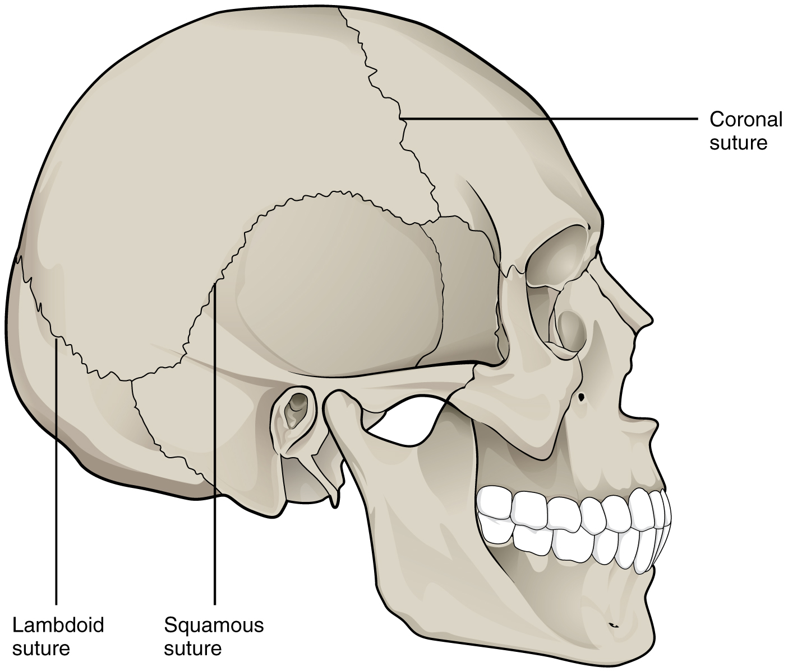
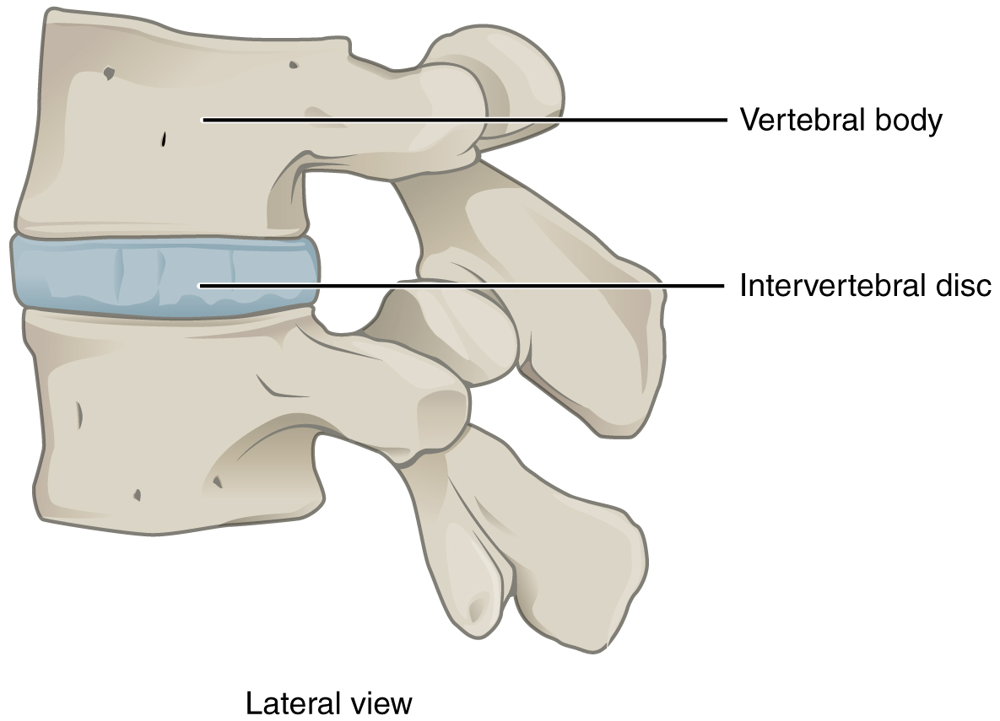

By the end of this section, you will be able to:
* Distinguish between the functional and structural classifications for joints
* Describe the three functional types of joints and give an example of each
* List the three types of diarthrodial joints

A **joint**{: data-type="term"}, also called an **articulation**{: data-type="term"}, is any place where adjacent bones or bone and cartilage come together (articulate with each other) to form a connection. Joints are classified both structurally and functionally. Structural classifications of joints take into account whether the adjacent bones are strongly anchored to each other by fibrous connective tissue or cartilage, or whether the adjacent bones articulate with each other within a fluid-filled space called a **joint cavity**{: data-type="term"}. Functional classifications describe the degree of movement available between the bones, ranging from immobile, to slightly mobile, to freely moveable joints. The amount of movement available at a particular joint of the body is related to the functional requirements for that joint. Thus immobile or slightly moveable joints serve to protect internal organs, give stability to the body, and allow for limited body movement. In contrast, freely moveable joints allow for much more extensive movements of the body and limbs.

### Structural Classification of Joints

The structural classification of joints is based on whether the articulating surfaces of the adjacent bones are directly connected by fibrous connective tissue or cartilage, or whether the articulating surfaces contact each other within a fluid-filled joint cavity. These differences serve to divide the joints of the body into three structural classifications. A **fibrous joint**{: data-type="term"} is where the adjacent bones are united by fibrous connective tissue. At a **cartilaginous joint**{: data-type="term"}, the bones are joined by hyaline cartilage or fibrocartilage. At a **synovial joint**{: data-type="term"}, the articulating surfaces of the bones are not directly connected, but instead come into contact with each other within a joint cavity that is filled with a lubricating fluid. Synovial joints allow for free movement between the bones and are the most common joints of the body.

### Functional Classification of Joints

The functional classification of joints is determined by the amount of mobility found between the adjacent bones. Joints are thus functionally classified as a synarthrosis or immobile joint, an amphiarthrosis or slightly moveable joint, or as a diarthrosis, which is a freely moveable joint (arthroun = “to fasten by a joint”). Depending on their location, fibrous joints may be functionally classified as a synarthrosis (immobile joint) or an amphiarthrosis (slightly mobile joint). Cartilaginous joints are also functionally classified as either a synarthrosis or an amphiarthrosis joint. All synovial joints are functionally classified as a diarthrosis joint.

#### Synarthrosis

An immobile or nearly immobile joint is called a **synarthrosis**{: data-type="term"}. The immobile nature of these joints provide for a strong union between the articulating bones. This is important at locations where the bones provide protection for internal organs. Examples include sutures, the fibrous joints between the bones of the skull that surround and protect the brain ([\[link\]](#fig-ch09_01_01)), and the manubriosternal joint, the cartilaginous joint that unites the manubrium and body of the sternum for protection of the heart.

 {: #fig-ch09_01_01 data-title="Suture Joints of Skull "}

#### Amphiarthrosis

An **amphiarthrosis**{: data-type="term"} is a joint that has limited mobility. An example of this type of joint is the cartilaginous joint that unites the bodies of adjacent vertebrae. Filling the gap between the vertebrae is a thick pad of fibrocartilage called an intervertebral disc ([\[link\]](#fig-ch09_01_02)). Each intervertebral disc strongly unites the vertebrae but still allows for a limited amount of movement between them. However, the small movements available between adjacent vertebrae can sum together along the length of the vertebral column to provide for large ranges of body movements.

Another example of an amphiarthrosis is the pubic symphysis of the pelvis. This is a cartilaginous joint in which the pubic regions of the right and left hip bones are strongly anchored to each other by fibrocartilage. This joint normally has very little mobility. The strength of the pubic symphysis is important in conferring weight-bearing stability to the pelvis.

 {: #fig-ch09_01_02 data-title="Intervertebral Disc "}

#### Diarthrosis

A freely mobile joint is classified as a **diarthrosis**{: data-type="term"}. These types of joints include all synovial joints of the body, which provide the majority of body movements. Most diarthrotic joints are found in the appendicular skeleton and thus give the limbs a wide range of motion. These joints are divided into three categories, based on the number of axes of motion provided by each. An axis in anatomy is described as the movements in reference to the three anatomical planes: transverse, frontal, and sagittal. Thus, diarthroses are classified as uniaxial (for movement in one plane), biaxial (for movement in two planes), or multiaxial joints (for movement in all three anatomical planes).

A **uniaxial joint**{: data-type="term"} only allows for a motion in a single plane (around a single axis). The elbow joint, which only allows for bending or straightening, is an example of a uniaxial joint. A **biaxial joint**{: data-type="term"} allows for motions within two planes. An example of a biaxial joint is a metacarpophalangeal joint (knuckle joint) of the hand. The joint allows for movement along one axis to produce bending or straightening of the finger, and movement along a second axis, which allows for spreading of the fingers away from each other and bringing them together. A joint that allows for the several directions of movement is called a **multiaxial joint**{: data-type="term"} (polyaxial or triaxial joint). This type of diarthrotic joint allows for movement along three axes ([\[link\]](#fig-ch09_01_03)). The shoulder and hip joints are multiaxial joints. They allow the upper or lower limb to move in an anterior-posterior direction and a medial-lateral direction. In addition, the limb can also be rotated around its long axis. This third movement results in rotation of the limb so that its anterior surface is moved either toward or away from the midline of the body.

{: #fig-ch09_01_03 data-title="Multiaxial Joint "}

### Chapter Review

Structural classifications of the body joints are based on how the bones are held together and articulate with each other. At fibrous joints, the adjacent bones are directly united to each other by fibrous connective tissue. Similarly, at a cartilaginous joint, the adjacent bones are united by cartilage. In contrast, at a synovial joint, the articulating bone surfaces are not directly united to each other, but come together within a fluid-filled joint cavity.

The functional classification of body joints is based on the degree of movement found at each joint. A synarthrosis is a joint that is essentially immobile. This type of joint provides for a strong connection between the adjacent bones, which serves to protect internal structures such as the brain or heart. Examples include the fibrous joints of the skull sutures and the cartilaginous manubriosternal joint. A joint that allows for limited movement is an amphiarthrosis. An example is the pubic symphysis of the pelvis, the cartilaginous joint that strongly unites the right and left hip bones of the pelvis. The cartilaginous joints in which vertebrae are united by intervertebral discs provide for small movements between the adjacent vertebrae and are also an amphiarthrosis type of joint. Thus, based on their movement ability, both fibrous and cartilaginous joints are functionally classified as a synarthrosis or amphiarthrosis.

The most common type of joint is the diarthrosis, which is a freely moveable joint. All synovial joints are functionally classified as diarthroses. A uniaxial diarthrosis, such as the elbow, is a joint that only allows for movement within a single anatomical plane. Joints that allow for movements in two planes are biaxial joints, such as the metacarpophalangeal joints of the fingers. A multiaxial joint, such as the shoulder or hip joint, allows for three planes of motions.

### Review Questions

The joint between adjacent vertebrae that includes an invertebral disc is classified as which type of joint?

1.  diarthrosis
2.  multiaxial
3.  amphiarthrosis
4.  synarthrosis
{: type="a"}

C

Which of these joints is classified as a synarthrosis?

1.  the pubic symphysis
2.  the manubriosternal joint
3.  an invertebral disc
4.  the shoulder joint
{: type="a"}

B

Which of these joints is classified as a biaxial diarthrosis?

1.  the metacarpophalangeal joint
2.  the hip joint
3.  the elbow joint
4.  the pubic symphysis
{: type="a"}

A

Synovial joints \_\_\_\_\_\_\_\_.

1.  may be functionally classified as a synarthrosis
2.  are joints where the bones are connected to each other by hyaline cartilage
3.  may be functionally classified as a amphiarthrosis
4.  are joints where the bones articulate with each other within a fluid-filled joint cavity
{: type="a"}

D

### Critical Thinking Questions

Define how joints are classified based on function. Describe and give an example for each functional type of joint.

Functional classification of joints is based on the degree of mobility exhibited by the joint. A synarthrosis is an immobile or nearly immobile joint. An example is the manubriosternal joint or the joints between the skull bones surrounding the brain. An amphiarthrosis is a slightly moveable joint, such as the pubic symphysis or an intervertebral cartilaginous joint. A diarthrosis is a freely moveable joint. These are subdivided into three categories. A uniaxial diarthrosis allows movement within a single anatomical plane or axis of motion. The elbow joint is an example. A biaxial diarthrosis, such as the metacarpophalangeal joint, allows for movement along two planes or axes. The hip and shoulder joints are examples of a multiaxial diarthrosis. These allow movements along three planes or axes.

Explain the reasons for why joints differ in their degree of mobility.

The functional needs of joints vary and thus joints differ in their degree of mobility. A synarthrosis, which is an immobile joint, serves to strongly connect bones thus protecting internal organs such as the heart or brain. A slightly moveable amphiarthrosis provides for small movements, which in the vertebral column can add together to yield a much larger overall movement. The freedom of movement provided by a diarthrosis can allow for large movements, such as is seen with most joints of the limbs.

### Glossary
{: data-type="glossary-title"}

amphiarthrosis
: slightly mobile joint
^

articulation
: joint of the body
^

biaxial joint
: type of diarthrosis; a joint that allows for movements within two planes (two axes)
^

cartilaginous joint
: joint at which the bones are united by hyaline cartilage (synchondrosis) or fibrocartilage (symphysis)
^

diarthrosis
: freely mobile joint
^

fibrous joint
: joint where the articulating areas of the adjacent bones are connected by fibrous connective tissue
^

joint
: site at which two or more bones or bone and cartilage come together (articulate)
^

joint cavity
: space enclosed by the articular capsule of a synovial joint that is filled with synovial fluid and contains the articulating surfaces of the adjacent bones
^

multiaxial joint
: type of diarthrosis; a joint that allows for movements within three planes (three axes)
^

synarthrosis
: immobile or nearly immobile joint
^

synovial joint
: joint at which the articulating surfaces of the bones are located within a joint cavity formed by an articular capsule
^

uniaxial joint
: type of diarthrosis; joint that allows for motion within only one plane (one axis)

