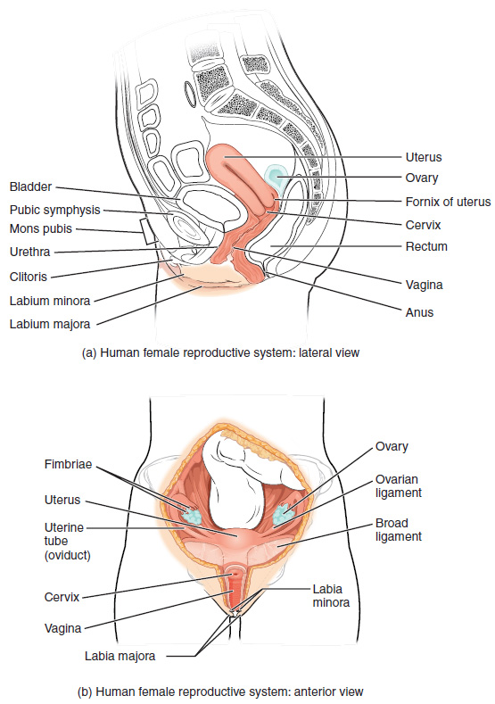
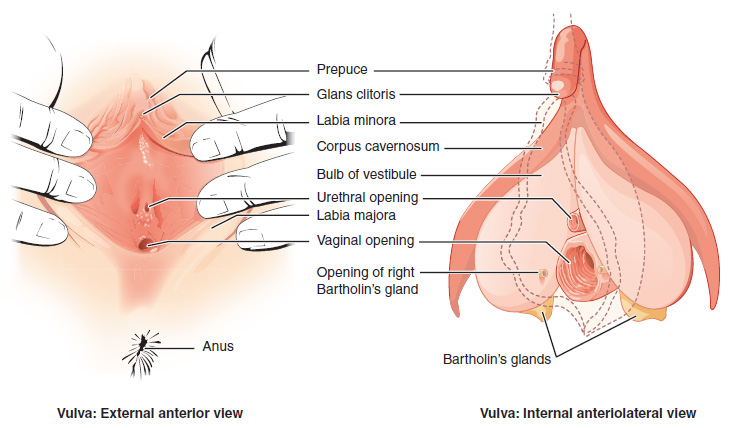
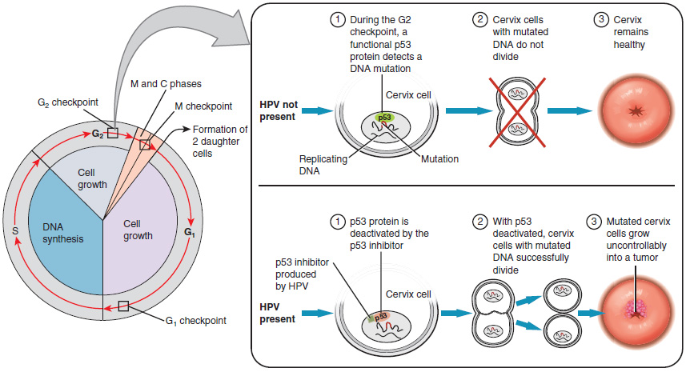

By the end of this section, you will be able to:
* Describe the structure and function of the organs of the female reproductive system
* List the steps of oogenesis
* Describe the hormonal changes that occur during the ovarian and menstrual cycles
* Trace the path of an oocyte from ovary to fertilization

The female reproductive system functions to produce gametes and reproductive hormones, just like the male reproductive system; however, it also has the additional task of supporting the developing fetus and delivering it to the outside world. Unlike its male counterpart, the female reproductive system is located primarily inside the pelvic cavity ([\[link\]](#fig-ch28_02_01)). Recall that the ovaries are the female gonads. The gamete they produce is called an **oocyte**{: data-type="term"}. We’ll discuss the production of oocytes in detail shortly. First, let’s look at some of the structures of the female reproductive system.

 {: #fig-ch28_02_01 height="550" data-title="Female Reproductive System "}

### External Female Genitals

The external female reproductive structures are referred to collectively as the **vulva**{: data-type="term"} ([\[link\]](#fig-ch28_02_02)). The **mons pubis**{: data-type="term"} is a pad of fat that is located at the anterior, over the pubic bone. After puberty, it becomes covered in pubic hair. The **labia majora**{: data-type="term"} (labia = “lips”; majora = “larger”) are folds of hair-covered skin that begin just posterior to the mons pubis. The thinner and more pigmented **labia minora**{: data-type="term"} (labia = “lips”; minora = “smaller”) extend medial to the labia majora. Although they naturally vary in shape and size from woman to woman, the labia minora serve to protect the female urethra and the entrance to the female reproductive tract.

The superior, anterior portions of the labia minora come together to encircle the **clitoris**{: data-type="term"} (or glans clitoris), an organ that originates from the same cells as the glans penis and has abundant nerves that make it important in sexual sensation and orgasm. The **hymen**{: data-type="term"} is a thin membrane that sometimes partially covers the entrance to the vagina. An intact hymen cannot be used as an indication of “virginity”; even at birth, this is only a partial membrane, as menstrual fluid and other secretions must be able to exit the body, regardless of penile–vaginal intercourse. The vaginal opening is located between the opening of the urethra and the anus. It is flanked by outlets to the **Bartholin’s glands**{: data-type="term"} (or greater vestibular glands).

 {: #fig-ch28_02_02 data-title="The Vulva "}

### Vagina

The **vagina**{: data-type="term"}, shown at the bottom of [\[link\]](#fig-ch28_02_01) and [\[link\]](#fig-ch28_02_01), is a muscular canal (approximately 10 cm long) that serves as the entrance to the reproductive tract. It also serves as the exit from the uterus during menses and childbirth. The outer walls of the anterior and posterior vagina are formed into longitudinal columns, or ridges, and the superior portion of the vagina—called the fornix—meets the protruding uterine cervix. The walls of the vagina are lined with an outer, fibrous adventitia; a middle layer of smooth muscle; and an inner mucous membrane with transverse folds called **rugae**{: data-type="term"}. Together, the middle and inner layers allow the expansion of the vagina to accommodate intercourse and childbirth. The thin, perforated hymen can partially surround the opening to the vaginal orifice. The hymen can be ruptured with strenuous physical exercise, penile–vaginal intercourse, and childbirth. The Bartholin’s glands and the lesser vestibular glands (located near the clitoris) secrete mucus, which keeps the vestibular area moist.

The vagina is home to a normal population of microorganisms that help to protect against infection by pathogenic bacteria, yeast, or other organisms that can enter the vagina. In a healthy woman, the most predominant type of vaginal bacteria is from the genus *Lactobacillus*. This family of beneficial bacterial flora secretes lactic acid, and thus protects the vagina by maintaining an acidic pH (below 4.5). Potential pathogens are less likely to survive in these acidic conditions. Lactic acid, in combination with other vaginal secretions, makes the vagina a self-cleansing organ. However, douching—or washing out the vagina with fluid—can disrupt the normal balance of healthy microorganisms, and actually increase a woman’s risk for infections and irritation. Indeed, the American College of Obstetricians and Gynecologists recommend that women do not douche, and that they allow the vagina to maintain its normal healthy population of protective microbial flora.

### Ovaries

The **ovaries**{: data-type="term"} are the female gonads (see [\[link\]](#fig-ch28_02_01)). Paired ovals, they are each about 2 to 3 cm in length, about the size of an almond. The ovaries are located within the pelvic cavity, and are supported by the mesovarium, an extension of the peritoneum that connects the ovaries to the **broad ligament**{: data-type="term"}. Extending from the mesovarium itself is the suspensory ligament that contains the ovarian blood and lymph vessels. Finally, the ovary itself is attached to the uterus via the ovarian ligament.

The ovary comprises an outer covering of cuboidal epithelium called the ovarian surface epithelium that is superficial to a dense connective tissue covering called the tunica albuginea. Beneath the tunica albuginea is the cortex, or outer portion, of the organ. The cortex is composed of a tissue framework called the ovarian stroma that forms the bulk of the adult ovary. Oocytes develop within the outer layer of this stroma, each surrounded by supporting cells. This grouping of an oocyte and its supporting cells is called a **follicle**{: data-type="term"}. The growth and development of ovarian follicles will be described shortly. Beneath the cortex lies the inner ovarian medulla, the site of blood vessels, lymph vessels, and the nerves of the ovary. You will learn more about the overall anatomy of the female reproductive system at the end of this section.

### The Ovarian Cycle

The **ovarian cycle**{: data-type="term"} is a set of predictable changes in a female’s oocytes and ovarian follicles. During a woman’s reproductive years, it is a roughly 28-day cycle that can be correlated with, but is not the same as, the menstrual cycle (discussed shortly). The cycle includes two interrelated processes: oogenesis (the production of female gametes) and folliculogenesis (the growth and development of ovarian follicles).

#### Oogenesis

Gametogenesis in females is called **oogenesis**{: data-type="term"}. The process begins with the ovarian stem cells, or **oogonia**{: data-type="term"} ([\[link\]](#fig-ch28_02_03)). Oogonia are formed during fetal development, and divide via mitosis, much like spermatogonia in the testis. Unlike spermatogonia, however, oogonia form primary oocytes in the fetal ovary prior to birth. These primary oocytes are then arrested in this stage of meiosis I, only to resume it years later, beginning at puberty and continuing until the woman is near menopause (the cessation of a woman’s reproductive functions). The number of primary oocytes present in the ovaries declines from one to two million in an infant, to approximately 400,000 at puberty, to zero by the end of menopause.

The initiation of **ovulation**{: data-type="term"}—the release of an oocyte from the ovary—marks the transition from puberty into reproductive maturity for women. From then on, throughout a woman’s reproductive years, ovulation occurs approximately once every 28 days. Just prior to ovulation, a surge of luteinizing hormone triggers the resumption of meiosis in a primary oocyte. This initiates the transition from primary to secondary oocyte. However, as you can see in [\[link\]](#fig-ch28_02_03), this cell division does not result in two identical cells. Instead, the cytoplasm is divided unequally, and one daughter cell is much larger than the other. This larger cell, the secondary oocyte, eventually leaves the ovary during ovulation. The smaller cell, called the first **polar body**{: data-type="term"}, may or may not complete meiosis and produce second polar bodies; in either case, it eventually disintegrates. Therefore, even though oogenesis produces up to four cells, only one survives.

 {: #fig-ch28_02_03 data-title="Oogenesis "}

How does the diploid secondary oocyte become an **ovum**{: data-type="term"}—the haploid female gamete? Meiosis of a secondary oocyte is completed only if a sperm succeeds in penetrating its barriers. Meiosis II then resumes, producing one haploid ovum that, at the instant of fertilization by a (haploid) sperm, becomes the first diploid cell of the new offspring (a zygote). Thus, the ovum can be thought of as a brief, transitional, haploid stage between the diploid oocyte and diploid zygote.

The larger amount of cytoplasm contained in the female gamete is used to supply the developing zygote with nutrients during the period between fertilization and implantation into the uterus. Interestingly, sperm contribute only DNA at fertilization —not cytoplasm. Therefore, the cytoplasm and all of the cytoplasmic organelles in the developing embryo are of maternal origin. This includes mitochondria, which contain their own DNA. Scientific research in the 1980s determined that mitochondrial DNA was maternally inherited, meaning that you can trace your mitochondrial DNA directly to your mother, her mother, and so on back through your female ancestors.

Everyday Connections Feature

Mapping Human History with Mitochondrial DNAWhen we talk about human DNA, we’re usually referring to nuclear DNA; that is, the DNA coiled into chromosomal bundles in the nucleus of our cells. We inherit half of our nuclear DNA from our father, and half from our mother. However, mitochondrial DNA (mtDNA) comes only from the mitochondria in the cytoplasm of the fat ovum we inherit from our mother. She received her mtDNA from her mother, who got it from her mother, and so on. Each of our cells contains approximately 1700 mitochondria, with each mitochondrion packed with mtDNA containing approximately 37 genes.

Mutations (changes) in mtDNA occur spontaneously in a somewhat organized pattern at regular intervals in human history. By analyzing these mutational relationships, researchers have been able to determine that we can all trace our ancestry back to one woman who lived in Africa about 200,000 years ago. Scientists have given this woman the biblical name Eve, although she is not, of course, the first *Homo sapiens* female. More precisely, she is our most recent common ancestor through matrilineal descent.

This doesn’t mean that everyone’s mtDNA today looks exactly like that of our ancestral Eve. Because of the spontaneous mutations in mtDNA that have occurred over the centuries, researchers can map different “branches” off of the “main trunk” of our mtDNA family tree. Your mtDNA might have a pattern of mutations that aligns more closely with one branch, and your neighbor’s may align with another branch. Still, all branches eventually lead back to Eve.

But what happened to the mtDNA of all of the other *Homo sapiens* females who were living at the time of Eve? Researchers explain that, over the centuries, their female descendants died childless or with only male children, and thus, their maternal line—and its mtDNA—ended.

#### Folliculogenesis

Again, ovarian follicles are oocytes and their supporting cells. They grow and develop in a process called **folliculogenesis**{: data-type="term"}, which typically leads to ovulation of one follicle approximately every 28 days, along with death to multiple other follicles. The death of ovarian follicles is called atresia, and can occur at any point during follicular development. Recall that, a female infant at birth will have one to two million oocytes within her ovarian follicles, and that this number declines throughout life until menopause, when no follicles remain. As you’ll see next, follicles progress from primordial, to primary, to secondary and tertiary stages prior to ovulation—with the oocyte inside the follicle remaining as a primary oocyte until right before ovulation.

Folliculogenesis begins with follicles in a resting state. These small **primordial follicles**{: data-type="term"} are present in newborn females and are the prevailing follicle type in the adult ovary ([\[link\]](#fig-ch28_02_04)). Primordial follicles have only a single flat layer of support cells, called **granulosa cells**{: data-type="term"}, that surround the oocyte, and they can stay in this resting state for years—some until right before menopause.

After puberty, a few primordial follicles will respond to a recruitment signal each day, and will join a pool of immature growing follicles called **primary follicles**{: data-type="term"}. Primary follicles start with a single layer of granulosa cells, but the granulosa cells then become active and transition from a flat or squamous shape to a rounded, cuboidal shape as they increase in size and proliferate. As the granulosa cells divide, the follicles—now called **secondary follicles**{: data-type="term"} (see [\[link\]](#fig-ch28_02_04))—increase in diameter, adding a new outer layer of connective tissue, blood vessels, and **theca cells**{: data-type="term"}—cells that work with the granulosa cells to produce estrogens.

Within the growing secondary follicle, the primary oocyte now secretes a thin acellular membrane called the zona pellucida that will play a critical role in fertilization. A thick fluid, called follicular fluid, that has formed between the granulosa cells also begins to collect into one large pool, or **antrum**{: data-type="term"}. Follicles in which the antrum has become large and fully formed are considered **tertiary follicles**{: data-type="term"} (or antral follicles). Several follicles reach the tertiary stage at the same time, and most of these will undergo atresia. The one that does not die will continue to grow and develop until ovulation, when it will expel its secondary oocyte surrounded by several layers of granulosa cells from the ovary. Keep in mind that most follicles don’t make it to this point. In fact, roughly 99 percent of the follicles in the ovary will undergo atresia, which can occur at any stage of folliculogenesis.

  The maturation of a follicle is shown in a clockwise direction proceeding from the primordial follicles. FSH stimulates the growth of a tertiary follicle, and LH stimulates the production of estrogen by granulosa and theca cells. Once the follicle is mature, it ruptures and releases the oocyte. Cells remaining in the follicle then develop into the corpus luteum. (b) In this electron micrograph of a secondary follicle, the oocyte, theca cells (thecae folliculi), and developing antrum are clearly visible. EM &#xD7; 1100. (Micrograph provided by the Regents of University of Michigan Medical School &#xA9; 2012)&#10;"){: #fig-ch28_02_04 data-title="Folliculogenesis "}

#### Hormonal Control of the Ovarian Cycle

The process of development that we have just described, from primordial follicle to early tertiary follicle, takes approximately two months in humans. The final stages of development of a small cohort of tertiary follicles, ending with ovulation of a secondary oocyte, occur over a course of approximately 28 days. These changes are regulated by many of the same hormones that regulate the male reproductive system, including GnRH, LH, and FSH.

As in men, the hypothalamus produces GnRH, a hormone that signals the anterior pituitary gland to produce the gonadotropins FSH and LH ([\[link\]](#fig-ch28_02_05)). These gonadotropins leave the pituitary and travel through the bloodstream to the ovaries, where they bind to receptors on the granulosa and theca cells of the follicles. FSH stimulates the follicles to grow (hence its name of follicle-stimulating hormone), and the five or six tertiary follicles expand in diameter. The release of LH also stimulates the granulosa and theca cells of the follicles to produce the sex steroid hormone estradiol, a type of estrogen. This phase of the ovarian cycle, when the tertiary follicles are growing and secreting estrogen, is known as the follicular phase.

The more granulosa and theca cells a follicle has (that is, the larger and more developed it is), the more estrogen it will produce in response to LH stimulation. As a result of these large follicles producing large amounts of estrogen, systemic plasma estrogen concentrations increase. Following a classic negative feedback loop, the high concentrations of estrogen will stimulate the hypothalamus and pituitary to reduce the production of GnRH, LH, and FSH. Because the large tertiary follicles require FSH to grow and survive at this point, this decline in FSH caused by negative feedback leads most of them to die (atresia). Typically only one follicle, now called the dominant follicle, will survive this reduction in FSH, and this follicle will be the one that releases an oocyte. Scientists have studied many factors that lead to a particular follicle becoming dominant: size, the number of granulosa cells, and the number of FSH receptors on those granulosa cells all contribute to a follicle becoming the one surviving dominant follicle.

 {: #fig-ch28_02_05 data-title="Hormonal Regulation of Ovulation "}

When only the one dominant follicle remains in the ovary, it again begins to secrete estrogen. It produces more estrogen than all of the developing follicles did together before the negative feedback occurred. It produces so much estrogen that the normal negative feedback doesn’t occur. Instead, these extremely high concentrations of systemic plasma estrogen trigger a regulatory switch in the anterior pituitary that responds by secreting large amounts of LH and FSH into the bloodstream (see [\[link\]](#fig-ch28_02_05)). The positive feedback loop by which more estrogen triggers release of more LH and FSH only occurs at this point in the cycle.

It is this large burst of LH (called the LH surge) that leads to ovulation of the dominant follicle. The LH surge induces many changes in the dominant follicle, including stimulating the resumption of meiosis of the primary oocyte to a secondary oocyte. As noted earlier, the polar body that results from unequal cell division simply degrades. The LH surge also triggers proteases (enzymes that cleave proteins) to break down structural proteins in the ovary wall on the surface of the bulging dominant follicle. This degradation of the wall, combined with pressure from the large, fluid-filled antrum, results in the expulsion of the oocyte surrounded by granulosa cells into the peritoneal cavity. This release is ovulation.

In the next section, you will follow the ovulated oocyte as it travels toward the uterus, but there is one more important event that occurs in the ovarian cycle. The surge of LH also stimulates a change in the granulosa and theca cells that remain in the follicle after the oocyte has been ovulated. This change is called luteinization (recall that the full name of LH is luteinizing hormone), and it transforms the collapsed follicle into a new endocrine structure called the **corpus luteum**{: data-type="term"}, a term meaning “yellowish body” (see [\[link\]](#fig-ch28_02_04)). Instead of estrogen, the luteinized granulosa and theca cells of the corpus luteum begin to produce large amounts of the sex steroid hormone progesterone, a hormone that is critical for the establishment and maintenance of pregnancy. Progesterone triggers negative feedback at the hypothalamus and pituitary, which keeps GnRH, LH, and FSH secretions low, so no new dominant follicles develop at this time.

The post-ovulatory phase of progesterone secretion is known as the luteal phase of the ovarian cycle. If pregnancy does not occur within 10 to 12 days, the corpus luteum will stop secreting progesterone and degrade into the **corpus albicans**{: data-type="term"}, a nonfunctional “whitish body” that will disintegrate in the ovary over a period of several months. During this time of reduced progesterone secretion, FSH and LH are once again stimulated, and the follicular phase begins again with a new cohort of early tertiary follicles beginning to grow and secrete estrogen.

### The Uterine Tubes

The **uterine tubes**{: data-type="term"} (also called fallopian tubes or oviducts) serve as the conduit of the oocyte from the ovary to the uterus ([\[link\]](#fig-ch28_02_06)). Each of the two uterine tubes is close to, but not directly connected to, the ovary and divided into sections. The **isthmus**{: data-type="term"} is the narrow medial end of each uterine tube that is connected to the uterus. The wide distal **infundibulum**{: data-type="term"} flares out with slender, finger-like projections called **fimbriae**{: data-type="term"}. The middle region of the tube, called the **ampulla**{: data-type="term"}, is where fertilization often occurs. The uterine tubes also have three layers: an outer serosa, a middle smooth muscle layer, and an inner mucosal layer. In addition to its mucus-secreting cells, the inner mucosa contains ciliated cells that beat in the direction of the uterus, producing a current that will be critical to move the oocyte.

Following ovulation, the secondary oocyte surrounded by a few granulosa cells is released into the peritoneal cavity. The nearby uterine tube, either left or right, receives the oocyte. Unlike sperm, oocytes lack flagella, and therefore cannot move on their own. So how do they travel into the uterine tube and toward the uterus? High concentrations of estrogen that occur around the time of ovulation induce contractions of the smooth muscle along the length of the uterine tube. These contractions occur every 4 to 8 seconds, and the result is a coordinated movement that sweeps the surface of the ovary and the pelvic cavity. Current flowing toward the uterus is generated by coordinated beating of the cilia that line the outside and lumen of the length of the uterine tube. These cilia beat more strongly in response to the high estrogen concentrations that occur around the time of ovulation. As a result of these mechanisms, the oocyte–granulosa cell complex is pulled into the interior of the tube. Once inside, the muscular contractions and beating cilia move the oocyte slowly toward the uterus. When fertilization does occur, sperm typically meet the egg while it is still moving through the ampulla.

Interactive Link

  
Watch this [ <u data-effect="underline"> video</u>][1] to observe ovulation and its initiation in response to the release of FSH and LH from the pituitary gland. What specialized structures help guide the oocyte from the ovary into the uterine tube?

If the oocyte is successfully fertilized, the resulting zygote will begin to divide into two cells, then four, and so on, as it makes its way through the uterine tube and into the uterus. There, it will implant and continue to grow. If the egg is not fertilized, it will simply degrade—either in the uterine tube or in the uterus, where it may be shed with the next menstrual period.

 , and uterus. Sperm enter through the vagina, and fertilization of an ovulated oocyte usually occurs in the distal uterine tube. From left to right, LM &#xD7; 400, LM &#xD7; 20. (Micrographs provided by the Regents of University of Michigan Medical School &#xA9; 2012)&#10;"){: #fig-ch28_02_06 data-title="Ovaries, Uterine Tubes, and Uterus "}

The open-ended structure of the uterine tubes can have significant health consequences if bacteria or other contagions enter through the vagina and move through the uterus, into the tubes, and then into the pelvic cavity. If this is left unchecked, a bacterial infection (sepsis) could quickly become life-threatening. The spread of an infection in this manner is of special concern when unskilled practitioners perform abortions in non-sterile conditions. Sepsis is also associated with sexually transmitted bacterial infections, especially gonorrhea and chlamydia. These increase a woman’s risk for pelvic inflammatory disease (PID), infection of the uterine tubes or other reproductive organs. Even when resolved, PID can leave scar tissue in the tubes, leading to infertility.

Interactive Link

  
Watch this series of [<u data-effect="underline"> videos</u>][2] to look at the movement of the oocyte through the ovary. The cilia in the uterine tube promote movement of the oocyte. What would likely occur if the cilia were paralyzed at the time of ovulation?

### The Uterus and Cervix

The **uterus**{: data-type="term"} is the muscular organ that nourishes and supports the growing embryo (see [\[link\]](#fig-ch28_02_06)). Its average size is approximately 5 cm wide by 7 cm long (approximately 2 in by 3 in) when a female is not pregnant. It has three sections. The portion of the uterus superior to the opening of the uterine tubes is called the **fundus**{: data-type="term"}. The middle section of the uterus is called the **body of uterus**{: data-type="term"} (or corpus). The **cervix**{: data-type="term"} is the narrow inferior portion of the uterus that projects into the vagina. The cervix produces mucus secretions that become thin and stringy under the influence of high systemic plasma estrogen concentrations, and these secretions can facilitate sperm movement through the reproductive tract.

Several ligaments maintain the position of the uterus within the abdominopelvic cavity. The broad ligament is a fold of peritoneum that serves as a primary support for the uterus, extending laterally from both sides of the uterus and attaching it to the pelvic wall. The round ligament attaches to the uterus near the uterine tubes, and extends to the labia majora. Finally, the uterosacral ligament stabilizes the uterus posteriorly by its connection from the cervix to the pelvic wall.

The wall of the uterus is made up of three layers. The most superficial layer is the serous membrane, or **perimetrium**{: data-type="term"}, which consists of epithelial tissue that covers the exterior portion of the uterus. The middle layer, or **myometrium**{: data-type="term"}, is a thick layer of smooth muscle responsible for uterine contractions. Most of the uterus is myometrial tissue, and the muscle fibers run horizontally, vertically, and diagonally, allowing the powerful contractions that occur during labor and the less powerful contractions (or cramps) that help to expel menstrual blood during a woman’s period. Anteriorly directed myometrial contractions also occur near the time of ovulation, and are thought to possibly facilitate the transport of sperm through the female reproductive tract.

The innermost layer of the uterus is called the **endometrium**{: data-type="term"}. The endometrium contains a connective tissue lining, the lamina propria, which is covered by epithelial tissue that lines the lumen. Structurally, the endometrium consists of two layers: the stratum basalis and the stratum functionalis (the basal and functional layers). The stratum basalis layer is part of the lamina propria and is adjacent to the myometrium; this layer does not shed during menses. In contrast, the thicker stratum functionalis layer contains the glandular portion of the lamina propria and the endothelial tissue that lines the uterine lumen. It is the stratum functionalis that grows and thickens in response to increased levels of estrogen and progesterone. In the luteal phase of the menstrual cycle, special branches off of the uterine artery called spiral arteries supply the thickened stratum functionalis. This inner functional layer provides the proper site of implantation for the fertilized egg, and—should fertilization not occur—it is only the stratum functionalis layer of the endometrium that sheds during menstruation.

Recall that during the follicular phase of the ovarian cycle, the tertiary follicles are growing and secreting estrogen. At the same time, the stratum functionalis of the endometrium is thickening to prepare for a potential implantation. The post-ovulatory increase in progesterone, which characterizes the luteal phase, is key for maintaining a thick stratum functionalis. As long as a functional corpus luteum is present in the ovary, the endometrial lining is prepared for implantation. Indeed, if an embryo implants, signals are sent to the corpus luteum to continue secreting progesterone to maintain the endometrium, and thus maintain the pregnancy. If an embryo does not implant, no signal is sent to the corpus luteum and it degrades, ceasing progesterone production and ending the luteal phase. Without progesterone, the endometrium thins and, under the influence of prostaglandins, the spiral arteries of the endometrium constrict and rupture, preventing oxygenated blood from reaching the endometrial tissue. As a result, endometrial tissue dies and blood, pieces of the endometrial tissue, and white blood cells are shed through the vagina during menstruation, or the **menses**{: data-type="term"}. The first menses after puberty, called **menarche**{: data-type="term"}, can occur either before or after the first ovulation.

### The Menstrual Cycle

Now that we have discussed the maturation of the cohort of tertiary follicles in the ovary, the build-up and then shedding of the endometrial lining in the uterus, and the function of the uterine tubes and vagina, we can put everything together to talk about the three phases of the **menstrual cycle**{: data-type="term"}—the series of changes in which the uterine lining is shed, rebuilds, and prepares for implantation.

The timing of the menstrual cycle starts with the first day of menses, referred to as day one of a woman’s period. Cycle length is determined by counting the days between the onset of bleeding in two subsequent cycles. Because the average length of a woman’s menstrual cycle is 28 days, this is the time period used to identify the timing of events in the cycle. However, the length of the menstrual cycle varies among women, and even in the same woman from one cycle to the next, typically from 21 to 32 days.

Just as the hormones produced by the granulosa and theca cells of the ovary “drive” the follicular and luteal phases of the ovarian cycle, they also control the three distinct phases of the menstrual cycle. These are the menses phase, the proliferative phase, and the secretory phase.

#### Menses Phase

The **menses phase**{: data-type="term"} of the menstrual cycle is the phase during which the lining is shed; that is, the days that the woman menstruates. Although it averages approximately five days, the menses phase can last from 2 to 7 days, or longer. As shown in [\[link\]](#fig-ch28_02_07), the menses phase occurs during the early days of the follicular phase of the ovarian cycle, when progesterone, FSH, and LH levels are low. Recall that progesterone concentrations decline as a result of the degradation of the corpus luteum, marking the end of the luteal phase. This decline in progesterone triggers the shedding of the stratum functionalis of the endometrium.

 {: #fig-ch28_02_07 data-title="Hormone Levels in Ovarian and Menstrual Cycles "}

#### Proliferative Phase

Once menstrual flow ceases, the endometrium begins to proliferate again, marking the beginning of the **proliferative phase**{: data-type="term"} of the menstrual cycle (see [\[link\]](#fig-ch28_02_07)). It occurs when the granulosa and theca cells of the tertiary follicles begin to produce increased amounts of estrogen. These rising estrogen concentrations stimulate the endometrial lining to rebuild.

Recall that the high estrogen concentrations will eventually lead to a decrease in FSH as a result of negative feedback, resulting in atresia of all but one of the developing tertiary follicles. The switch to positive feedback—which occurs with the elevated estrogen production from the dominant follicle—then stimulates the LH surge that will trigger ovulation. In a typical 28-day menstrual cycle, ovulation occurs on day 14. Ovulation marks the end of the proliferative phase as well as the end of the follicular phase.

#### Secretory Phase

In addition to prompting the LH surge, high estrogen levels increase the uterine tube contractions that facilitate the pick-up and transfer of the ovulated oocyte. High estrogen levels also slightly decrease the acidity of the vagina, making it more hospitable to sperm. In the ovary, the luteinization of the granulosa cells of the collapsed follicle forms the progesterone-producing corpus luteum, marking the beginning of the luteal phase of the ovarian cycle. In the uterus, progesterone from the corpus luteum begins the **secretory phase**{: data-type="term"} of the menstrual cycle, in which the endometrial lining prepares for implantation (see [\[link\]](#fig-ch28_02_07)). Over the next 10 to 12 days, the endometrial glands secrete a fluid rich in glycogen. If fertilization has occurred, this fluid will nourish the ball of cells now developing from the zygote. At the same time, the spiral arteries develop to provide blood to the thickened stratum functionalis.

If no pregnancy occurs within approximately 10 to 12 days, the corpus luteum will degrade into the corpus albicans. Levels of both estrogen and progesterone will fall, and the endometrium will grow thinner. Prostaglandins will be secreted that cause constriction of the spiral arteries, reducing oxygen supply. The endometrial tissue will die, resulting in menses—or the first day of the next cycle.

Disorders of the… Feature

Female Reproductive System Research over many years has confirmed that cervical cancer is most often caused by a sexually transmitted infection with human papillomavirus (HPV). There are over 100 related viruses in the HPV family, and the characteristics of each strain determine the outcome of the infection. In all cases, the virus enters body cells and uses its own genetic material to take over the host cell’s metabolic machinery and produce more virus particles.

HPV infections are common in both men and women. Indeed, a recent study determined that 42.5 percent of females had HPV at the time of testing. These women ranged in age from 14 to 59 years and differed in race, ethnicity, and number of sexual partners. Of note, the prevalence of HPV infection was 53.8 percent among women aged 20 to 24 years, the age group with the highest infection rate.

HPV strains are classified as high or low risk according to their potential to cause cancer. Though most HPV infections do not cause disease, the disruption of normal cellular functions in the low-risk forms of HPV can cause the male or female human host to develop genital warts. Often, the body is able to clear an HPV infection by normal immune responses within 2 years. However, the more serious, high-risk infection by certain types of HPV can result in cancer of the cervix ([\[link\]](#fig-ch28_02_08)). Infection with either of the cancer-causing variants HPV 16 or HPV 18 has been linked to more than 70 percent of all cervical cancer diagnoses. Although even these high-risk HPV strains can be cleared from the body over time, infections persist in some individuals. If this happens, the HPV infection can influence the cells of the cervix to develop precancerous changes.

Risk factors for cervical cancer include having unprotected sex; having multiple sexual partners; a first sexual experience at a younger age, when the cells of the cervix are not fully mature; failure to receive the HPV vaccine; a compromised immune system; and smoking. The risk of developing cervical cancer is doubled with cigarette smoking.

{: #fig-ch28_02_08 data-title="Development of Cervical Cancer "}

When the high-risk types of HPV enter a cell, two viral proteins are used to neutralize proteins that the host cells use as checkpoints in the cell cycle. The best studied of these proteins is p53. In a normal cell, p53 detects DNA damage in the cell’s genome and either halts the progression of the cell cycle—allowing time for DNA repair to occur—or initiates apoptosis. Both of these processes prevent the accumulation of mutations in a cell’s genome. High-risk HPV can neutralize p53, keeping the cell in a state in which fast growth is possible and impairing apoptosis, allowing mutations to accumulate in the cellular DNA.

The prevalence of cervical cancer in the United States is very low because of regular screening exams called pap smears. Pap smears sample cells of the cervix, allowing the detection of abnormal cells. If pre-cancerous cells are detected, there are several highly effective techniques that are currently in use to remove them before they pose a danger. However, women in developing countries often do not have access to regular pap smears. As a result, these women account for as many as 80 percent of the cases of cervical cancer worldwide.

In 2006, the first vaccine against the high-risk types of HPV was approved. There are now two HPV vaccines available: Gardasil® and Cervarix®. Whereas these vaccines were initially only targeted for women, because HPV is sexually transmitted, both men and women require vaccination for this approach to achieve its maximum efficacy. A recent study suggests that the HPV vaccine has cut the rates of HPV infection by the four targeted strains at least in half. Unfortunately, the high cost of manufacturing the vaccine is currently limiting access to many women worldwide.

### The Breasts

Whereas the breasts are located far from the other female reproductive organs, they are considered accessory organs of the female reproductive system. The function of the breasts is to supply milk to an infant in a process called lactation. The external features of the breast include a nipple surrounded by a pigmented **areola**{: data-type="term"} ([\[link\]](#fig-ch28_02_09)), whose coloration may deepen during pregnancy. The areola is typically circular and can vary in size from 25 to 100 mm in diameter. The areolar region is characterized by small, raised areolar glands that secrete lubricating fluid during lactation to protect the nipple from chafing. When a baby nurses, or draws milk from the breast, the entire areolar region is taken into the mouth.

Breast milk is produced by the **mammary glands**{: data-type="term"}, which are modified sweat glands. The milk itself exits the breast through the nipple via 15 to 20 **lactiferous ducts**{: data-type="term"} that open on the surface of the nipple. These lactiferous ducts each extend to a **lactiferous sinus**{: data-type="term"} that connects to a glandular lobe within the breast itself that contains groups of milk-secreting cells in clusters called **alveoli**{: data-type="term"} (see [\[link\]](#fig-ch28_02_09)). The clusters can change in size depending on the amount of milk in the alveolar lumen. Once milk is made in the alveoli, stimulated myoepithelial cells that surround the alveoli contract to push the milk to the lactiferous sinuses. From here, the baby can draw milk through the lactiferous ducts by suckling. The lobes themselves are surrounded by fat tissue, which determines the size of the breast; breast size differs between individuals and does not affect the amount of milk produced. Supporting the breasts are multiple bands of connective tissue called **suspensory ligaments**{: data-type="term"} that connect the breast tissue to the dermis of the overlying skin.

{: #fig-ch28_02_09 data-title="Anatomy of the Breast "}

During the normal hormonal fluctuations in the menstrual cycle, breast tissue responds to changing levels of estrogen and progesterone, which can lead to swelling and breast tenderness in some individuals, especially during the secretory phase. If pregnancy occurs, the increase in hormones leads to further development of the mammary tissue and enlargement of the breasts.

### Hormonal Birth Control

Birth control pills take advantage of the negative feedback system that regulates the ovarian and menstrual cycles to stop ovulation and prevent pregnancy. Typically they work by providing a constant level of both estrogen and progesterone, which negatively feeds back onto the hypothalamus and pituitary, thus preventing the release of FSH and LH. Without FSH, the follicles do not mature, and without the LH surge, ovulation does not occur. Although the estrogen in birth control pills does stimulate some thickening of the endometrial wall, it is reduced compared with a normal cycle and is less likely to support implantation.

Some birth control pills contain 21 active pills containing hormones, and 7 inactive pills (placebos). The decline in hormones during the week that the woman takes the placebo pills triggers menses, although it is typically lighter than a normal menstrual flow because of the reduced endometrial thickening. Newer types of birth control pills have been developed that deliver low-dose estrogens and progesterone for the entire cycle (these are meant to be taken 365 days a year), and menses never occurs. While some women prefer to have the proof of a lack of pregnancy that a monthly period provides, menstruation every 28 days is not required for health reasons, and there are no reported adverse effects of not having a menstrual period in an otherwise healthy individual.

Because birth control pills function by providing constant estrogen and progesterone levels and disrupting negative feedback, skipping even just one or two pills at certain points of the cycle (or even being several hours late taking the pill) can lead to an increase in FSH and LH and result in ovulation. It is important, therefore, that the woman follow the directions on the birth control pill package to successfully prevent pregnancy.

Aging and the… Feature

Female Reproductive System Female fertility (the ability to conceive) peaks when women are in their twenties, and is slowly reduced until a women reaches 35 years of age. After that time, fertility declines more rapidly, until it ends completely at the end of menopause. Menopause is the cessation of the menstrual cycle that occurs as a result of the loss of ovarian follicles and the hormones that they produce. A woman is considered to have completed menopause if she has not menstruated in a full year. After that point, she is considered postmenopausal. The average age for this change is consistent worldwide at between 50 and 52 years of age, but it can normally occur in a woman’s forties, or later in her fifties. Poor health, including smoking, can lead to earlier loss of fertility and earlier menopause.

As a woman reaches the age of menopause, depletion of the number of viable follicles in the ovaries due to atresia affects the hormonal regulation of the menstrual cycle. During the years leading up to menopause, there is a decrease in the levels of the hormone inhibin, which normally participates in a negative feedback loop to the pituitary to control the production of FSH. The menopausal decrease in inhibin leads to an increase in FSH. The presence of FSH stimulates more follicles to grow and secrete estrogen. Because small, secondary follicles also respond to increases in FSH levels, larger numbers of follicles are stimulated to grow; however, most undergo atresia and die. Eventually, this process leads to the depletion of all follicles in the ovaries, and the production of estrogen falls off dramatically. It is primarily the lack of estrogens that leads to the symptoms of menopause.

The earliest changes occur during the menopausal transition, often referred to as peri-menopause, when a women’s cycle becomes irregular but does not stop entirely. Although the levels of estrogen are still nearly the same as before the transition, the level of progesterone produced by the corpus luteum is reduced. This decline in progesterone can lead to abnormal growth, or hyperplasia, of the endometrium. This condition is a concern because it increases the risk of developing endometrial cancer. Two harmless conditions that can develop during the transition are uterine fibroids, which are benign masses of cells, and irregular bleeding. As estrogen levels change, other symptoms that occur are hot flashes and night sweats, trouble sleeping, vaginal dryness, mood swings, difficulty focusing, and thinning of hair on the head along with the growth of more hair on the face. Depending on the individual, these symptoms can be entirely absent, moderate, or severe.

After menopause, lower amounts of estrogens can lead to other changes. Cardiovascular disease becomes as prevalent in women as in men, possibly because estrogens reduce the amount of cholesterol in the blood vessels. When estrogen is lacking, many women find that they suddenly have problems with high cholesterol and the cardiovascular issues that accompany it. Osteoporosis is another problem because bone density decreases rapidly in the first years after menopause. The reduction in bone density leads to a higher incidence of fractures.

Hormone therapy (HT), which employs medication (synthetic estrogens and progestins) to increase estrogen and progestin levels, can alleviate some of the symptoms of menopause. In 2002, the Women’s Health Initiative began a study to observe women for the long-term outcomes of hormone replacement therapy over 8.5 years. However, the study was prematurely terminated after 5.2 years because of evidence of a higher than normal risk of breast cancer in patients taking estrogen-only HT. The potential positive effects on cardiovascular disease were also not realized in the estrogen-only patients. The results of other hormone replacement studies over the last 50 years, including a 2012 study that followed over 1,000 menopausal women for 10 years, have shown cardiovascular benefits from estrogen and no increased risk for cancer. Some researchers believe that the age group tested in the 2002 trial may have been too old to benefit from the therapy, thus skewing the results. In the meantime, intense debate and study of the benefits and risks of replacement therapy is ongoing. Current guidelines approve HT for the reduction of hot flashes or flushes, but this treatment is generally only considered when women first start showing signs of menopausal changes, is used in the lowest dose possible for the shortest time possible (5 years or less), and it is suggested that women on HT have regular pelvic and breast exams.

### Chapter Review

The external female genitalia are collectively called the vulva. The vagina is the pathway into and out of the uterus. The man’s penis is inserted into the vagina to deliver sperm, and the baby exits the uterus through the vagina during childbirth.

The ovaries produce oocytes, the female gametes, in a process called oogenesis. As with spermatogenesis, meiosis produces the haploid gamete (in this case, an ovum); however, it is completed only in an oocyte that has been penetrated by a sperm. In the ovary, an oocyte surrounded by supporting cells is called a follicle. In folliculogenesis, primordial follicles develop into primary, secondary, and tertiary follicles. Early tertiary follicles with their fluid-filled antrum will be stimulated by an increase in FSH, a gonadotropin produced by the anterior pituitary, to grow in the 28-day ovarian cycle. Supporting granulosa and theca cells in the growing follicles produce estrogens, until the level of estrogen in the bloodstream is high enough that it triggers negative feedback at the hypothalamus and pituitary. This results in a reduction of FSH and LH, and most tertiary follicles in the ovary undergo atresia (they die). One follicle, usually the one with the most FSH receptors, survives this period and is now called the dominant follicle. The dominant follicle produces more estrogen, triggering positive feedback and the LH surge that will induce ovulation. Following ovulation, the granulosa cells of the empty follicle luteinize and transform into the progesterone-producing corpus luteum. The ovulated oocyte with its surrounding granulosa cells is picked up by the infundibulum of the uterine tube, and beating cilia help to transport it through the tube toward the uterus. Fertilization occurs within the uterine tube, and the final stage of meiosis is completed.

The uterus has three regions: the fundus, the body, and the cervix. It has three layers: the outer perimetrium, the muscular myometrium, and the inner endometrium. The endometrium responds to estrogen released by the follicles during the menstrual cycle and grows thicker with an increase in blood vessels in preparation for pregnancy. If the egg is not fertilized, no signal is sent to extend the life of the corpus luteum, and it degrades, stopping progesterone production. This decline in progesterone results in the sloughing of the inner portion of the endometrium in a process called menses, or menstruation.

The breasts are accessory sexual organs that are utilized after the birth of a child to produce milk in a process called lactation. Birth control pills provide constant levels of estrogen and progesterone to negatively feed back on the hypothalamus and pituitary, and suppress the release of FSH and LH, which inhibits ovulation and prevents pregnancy.

### Interactive Link Questions

Watch this [ <u data-effect="underline">video</u>][1] to observe ovulation and its initiation in response to the release of FSH and LH from the pituitary gland. What specialized structures help guide the oocyte from the ovary into the uterine tube?

The fimbriae sweep the oocyte into the uterine tube.

Watch this series of [ <u data-effect="underline">videos</u>][2] to look at the movement of the oocyte through the ovary. The cilia in the uterine tube promote movement of the oocyte. What would likely occur if the cilia were paralyzed at the time of ovulation?

The oocyte may not enter the tube and may enter the pelvic cavity.

### Review Questions

What are the female gonads called?

1.  oocytes
2.  ova
3.  oviducts
4.  ovaries
{: type="a"}

d

When do the oogonia undergo mitosis?

1.  before birth
2.  at puberty
3.  at the beginning of each menstrual cycle
4.  during fertilization
{: type="a"}

a

From what structure does the corpus luteum originate?

1.  uterine corpus
2.  dominant follicle
3.  fallopian tube
4.  corpus albicans
{: type="a"}

b

Where does fertilization of the egg by the sperm typically occur?

1.  vagina
2.  uterus
3.  uterine tube
4.  ovary
{: type="a"}

c

Why do estrogen levels fall after menopause?

1.  The ovaries degrade.
2.  There are no follicles left to produce estrogen.
3.  The pituitary secretes a menopause-specific hormone.
4.  The cells of the endometrium degenerate.
{: type="a"}

b

The vulva includes the \_\_\_\_\_\_\_\_.

1.  lactiferous duct, rugae, and hymen
2.  lactiferous duct, endometrium, and bulbourethral glands
3.  mons pubis, endometrium, and hymen
4.  mons pubis, labia majora, and Bartholin’s glands
{: type="a"}

d

### Critical Thinking Questions

Follow the path of ejaculated sperm from the vagina to the oocyte. Include all structures of the female reproductive tract that the sperm must swim through to reach the egg.

The sperm must swim upward in the vagina, through the cervix, and then through the body of the uterus to one or the other of the two uterine tubes. Fertilization generally occurs in the uterine tube.

Identify some differences between meiosis in men and women.

Meiosis in the man results in four viable haploid sperm, whereas meiosis in the woman results in a secondary oocyte and, upon completion following fertilization by a sperm, one viable haploid ovum with abundant cytoplasm and up to three polar bodies with little cytoplasm that are destined to die.

Explain the hormonal regulation of the phases of the menstrual cycle.

As a result of the degradation of the corpus luteum, a decline in progesterone concentrations triggers the shedding of the endometrial lining, marking the menses phase of the menstrual cycle. Low progesterone levels also reduce the negative feedback that had been occurring at the hypothalamus and pituitary, and result in the release of GnRH and, subsequently, FSH and LH. FSH stimulates tertiary follicles to grow and granulosa and theca cells begin to produce increased amounts of estrogen. High estrogen concentrations stimulate the endometrial lining to rebuild, marking the proliferative phase of the menstrual cycle. The high estrogen concentrations will eventually lead to a decrease in FSH because of negative feedback, resulting in atresia of all but one of the developing tertiary follicles. The switch to positive feedback that occurs with elevated estrogen production from the dominant follicle stimulates the LH surge that will trigger ovulation. The luteinization of the granulosa cells of the collapsed follicle forms the progesterone-producing corpus luteum. Progesterone from the corpus luteum causes the endometrium to prepare for implantation, in part by secreting nutrient-rich fluid. This marks the secretory phase of the menstrual cycle. Finally, in a non-fertile cycle, the corpus luteum will degrade and menses will occur.

Endometriosis is a disorder in which endometrial cells implant and proliferate outside of the uterus—in the uterine tubes, on the ovaries, or even in the pelvic cavity. Offer a theory as to why endometriosis increases a woman’s risk of infertility.

Endometrial tissue proliferating outside of the endometrium—for example, in the uterine tubes, on the ovaries, or within the pelvic cavity—could block the passage of sperm, ovulated oocytes, or a zygote, thus reducing fertility.

### Glossary
{: data-type="glossary-title"}

alveoli
: (of the breast) milk-secreting cells in the mammary gland
^

ampulla
: (of the uterine tube) middle portion of the uterine tube in which fertilization often occurs
^

antrum
: fluid-filled chamber that characterizes a mature tertiary (antral) follicle
^

areola
: highly pigmented, circular area surrounding the raised nipple and containing areolar glands that secrete fluid important for lubrication during suckling
^

Bartholin’s glands
: (also, greater vestibular glands) glands that produce a thick mucus that maintains moisture in the vulva area; also referred to as the greater vestibular glands
^

body of uterus
: middle section of the uterus
^

broad ligament
: wide ligament that supports the uterus by attaching laterally to both sides of the uterus and pelvic wall
^

cervix
: elongate inferior end of the uterus where it connects to the vagina
^

clitoris
: (also, glans clitoris) nerve-rich area of the vulva that contributes to sexual sensation during intercourse
^

corpus albicans
: nonfunctional structure remaining in the ovarian stroma following structural and functional regression of the corpus luteum
^

corpus luteum
: transformed follicle after ovulation that secretes progesterone
^

endometrium
: inner lining of the uterus, part of which builds up during the secretory phase of the menstrual cycle and then sheds with menses
^

fimbriae
: fingerlike projections on the distal uterine tubes
^

follicle
: ovarian structure of one oocyte and surrounding granulosa (and later theca) cells
^

folliculogenesis
: development of ovarian follicles from primordial to tertiary under the stimulation of gonadotropins
^

fundus
: (of the uterus) domed portion of the uterus that is superior to the uterine tubes
^

granulosa cells
: supportive cells in the ovarian follicle that produce estrogen
^

hymen
: membrane that covers part of the opening of the vagina
^

infundibulum
: (of the uterine tube) wide, distal portion of the uterine tube terminating in fimbriae
^

isthmus
: narrow, medial portion of the uterine tube that joins the uterus
^

labia majora
: hair-covered folds of skin located behind the mons pubis
^

labia minora
: thin, pigmented, hairless flaps of skin located medial and deep to the labia majora
^

lactiferous ducts
: ducts that connect the mammary glands to the nipple and allow for the transport of milk
^

lactiferous sinus
: area of milk collection between alveoli and lactiferous duct
^

mammary glands
: glands inside the breast that secrete milk
^

menarche
: first menstruation in a pubertal female
^

menses
: shedding of the inner portion of the endometrium out though the vagina; also referred to as menstruation
^

menses phase
: phase of the menstrual cycle in which the endometrial lining is shed
^

menstrual cycle
: approximately 28-day cycle of changes in the uterus consisting of a menses phase, a proliferative phase, and a secretory phase
^

mons pubis
: mound of fatty tissue located at the front of the vulva
^

myometrium
: smooth muscle layer of uterus that allows for uterine contractions during labor and expulsion of menstrual blood
^

oocyte
: cell that results from the division of the oogonium and undergoes meiosis I at the LH surge and meiosis II at fertilization to become a haploid ovum
^

oogenesis
: process by which oogonia divide by mitosis to primary oocytes, which undergo meiosis to produce the secondary oocyte and, upon fertilization, the ovum
^

oogonia
: ovarian stem cells that undergo mitosis during female fetal development to form primary oocytes
^

ovarian cycle
: approximately 28-day cycle of changes in the ovary consisting of a follicular phase and a luteal phase
^

ovaries
: female gonads that produce oocytes and sex steroid hormones (notably estrogen and progesterone)
^

ovulation
: release of a secondary oocyte and associated granulosa cells from an ovary
^

ovum
: haploid female gamete resulting from completion of meiosis II at fertilization
^

perimetrium
: outer epithelial layer of uterine wall
^

polar body
: smaller cell produced during the process of meiosis in oogenesis
^

primary follicles
: ovarian follicles with a primary oocyte and one layer of cuboidal granulosa cells
^

primordial follicles
: least developed ovarian follicles that consist of a single oocyte and a single layer of flat (squamous) granulosa cells
^

proliferative phase
: phase of the menstrual cycle in which the endometrium proliferates
^

rugae
: (of the vagina) folds of skin in the vagina that allow it to stretch during intercourse and childbirth
^

secondary follicles
: ovarian follicles with a primary oocyte and multiple layers of granulosa cells
^

secretory phase
: phase of the menstrual cycle in which the endometrium secretes a nutrient-rich fluid in preparation for implantation of an embryo
^

suspensory ligaments
: bands of connective tissue that suspend the breast onto the chest wall by attachment to the overlying dermis
^

tertiary follicles
: (also, antral follicles) ovarian follicles with a primary or secondary oocyte, multiple layers of granulosa cells, and a fully formed antrum
^

theca cells
: estrogen-producing cells in a maturing ovarian follicle
^

uterine tubes
: (also, fallopian tubes or oviducts) ducts that facilitate transport of an ovulated oocyte to the uterus
^

uterus
: muscular hollow organ in which a fertilized egg develops into a fetus
^

vagina
: tunnel-like organ that provides access to the uterus for the insertion of semen and from the uterus for the birth of a baby
^

vulva
: external female genitalia

[1]: http://openstaxcollege.org/l/ovulation
[2]: http://openstaxcollege.org/l/oocyte
