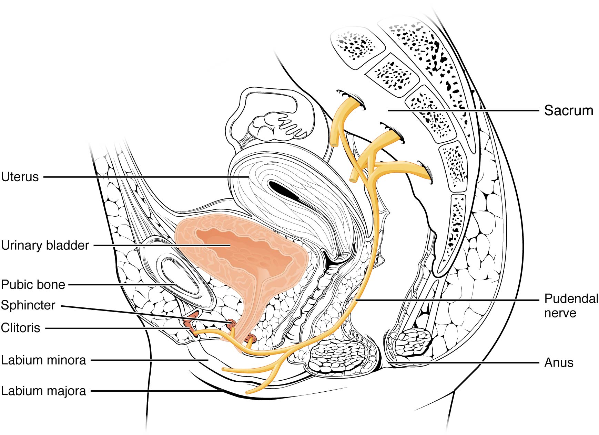

By the end of this section, you will be able to:
* Identify the ureters, urinary bladder, and urethra, as well as their
  location, structure, histology, and function
* Compare and contrast male and female urethras
* Describe the micturition reflex
* Describe voluntary and involuntary neural control of micturition

Rather than start with urine formation, this section will start with
urine excretion. Urine is a fluid of variable composition that requires
specialized structures to remove it from the body safely and
efficiently. Blood is filtered, and the filtrate is transformed into
urine at a relatively constant rate throughout the day. This processed
liquid is stored until a convenient time for excretion. All structures
involved in the transport and storage of the urine are large enough to
be visible to the naked eye. This transport and storage system not only
stores the waste, but it protects the tissues from damage due to the
wide range of pH and osmolarity of the urine, prevents infection by
foreign organisms, and for the male, provides reproductive functions.

# Urethra

The urethra transports urine from the
bladder to the outside of the body for disposal. The urethra is the only
urologic organ that shows any significant anatomic difference between
males and females; all other urine transport structures are identical
([\[link\]](#fig-ch26_02_01){: .autogenerated-content}).

 a female urethra and (b) a male urethra."){: #fig-ch26_02_01 data-media-type="image/jpg" data-title="Female and Male Urethras "}

The urethra in both males and females begins inferior and central to the
two ureteral openings forming the three points of a triangular-shaped
area at the base of the bladder called the trigone (Greek tri- = “triangle” and the root of
the word “trigonometry”). The urethra tracks posterior and inferior to
the pubic symphysis (see [\[link\]](#fig-ch26_02_01){:
.autogenerated-content}**a**). In both males and females, the proximal
urethra is lined by transitional epithelium, whereas the terminal
portion is a nonkeratinized, stratified squamous epithelium. In the
male, pseudostratified columnar epithelium lines the urethra between
these two cell types. Voiding is regulated by an involuntary autonomic
nervous system-controlled internal urinary
sphincter, consisting of smooth muscle and voluntary skeletal
muscle that forms the external urinary
sphincter below it.

## Female Urethra

The external urethral orifice is embedded in the anterior vaginal wall
inferior to the clitoris, superior to the vaginal opening (introitus),
and medial to the labia minora. Its short length, about 4 cm, is less of
a barrier to fecal bacteria than the longer male urethra and the best
explanation for the greater incidence of UTI in women. Voluntary control
of the external urethral sphincter is a function of the pudendal nerve.
It arises in the sacral region of the spinal cord, traveling via the
S2–S4 nerves of the sacral plexus.

## Male Urethra

The male urethra passes through the prostate gland immediately inferior
to the bladder before passing below the pubic symphysis (see
[\[link\]](#fig-ch26_02_01){: .autogenerated-content}**b**). The length
of the male urethra varies between men but averages 20 cm in length. It
is divided into four regions: the preprostatic urethra, the prostatic
urethra, the membranous urethra, and the spongy or penile urethra. The
preprostatic urethra is very short and incorporated into the bladder
wall. The prostatic urethra passes through the prostate gland. During
sexual intercourse, it receives sperm via the ejaculatory ducts and
secretions from the seminal vesicles. Paired Cowper’s glands
(bulbourethral glands) produce and secrete mucus into the urethra to
buffer urethral pH during sexual stimulation. The mucus neutralizes the
usually acidic environment and lubricates the urethra, decreasing the
resistance to ejaculation. The membranous urethra passes through the
deep muscles of the perineum, where it is invested by the overlying
urethral sphincters. The spongy urethra exits at the tip (external
urethral orifice) of the penis after passing through the corpus
spongiosum. Mucous glands are found along much of the length of the
urethra and protect the urethra from extremes of urine pH. Innervation
is the same in both males and females.

# Bladder

The urinary bladder collects urine from both ureters
([\[link\]](#fig-ch26_02_02){: .autogenerated-content}). The bladder
lies anterior to the uterus in females, posterior to the pubic bone and
anterior to the rectum. During late pregnancy, its capacity is reduced
due to compression by the enlarging uterus, resulting in increased
frequency of urination. In males, the anatomy is similar, minus the
uterus, and with the addition of the prostate inferior to the bladder.
The bladder is partially retroperitoneal
(outside the peritoneal cavity) with its peritoneal-covered “dome”
projecting into the abdomen when the bladder is distended with urine.

 Anterior cross section of the bladder. (b) The detrusor muscle of the bladder (source: monkey tissue) LM &#xD7; 448. (Micrograph provided by the Regents of the University of Michigan Medical School &#xA9; 2012)"){: #fig-ch26_02_02 data-media-type="image/jpg" data-title="Bladder "}

 {:
data-media-type="image/png"} 
View the University of Michigan WebScope at [
http://141.214.65.171/Histology/Urinary%20System/212N\_HISTO\_40X.svs/view.apml][1]
to explore the tissue sample in greater detail.

The bladder is a highly distensible organ comprised of irregular
crisscrossing bands of smooth muscle collectively called the detrusor muscle. The interior surface is made of
transitional cellular epithelium that is structurally suited for the
large volume fluctuations of the bladder. When empty, it resembles
columnar epithelia, but when stretched, it “transitions” (hence the
name) to a squamous appearance (see [\[link\]](#fig-ch26_02_02){:
.autogenerated-content}). Volumes in adults can range from nearly zero
to 500–600 mL.

The detrusor muscle contracts with significant force in the young. The
bladder’s strength diminishes with age, but voluntary contractions of
abdominal skeletal muscles can increase intra-abdominal pressure to
promote more forceful bladder emptying. Such voluntary contraction is
also used in forceful defecation and childbirth.

## Micturition Reflex

Micturition is a less-often used, but
proper term for urination or voiding. It results from an interplay of
involuntary and voluntary actions by the internal and external urethral
sphincters. When bladder volume reaches about 150 mL, an urge to void is
sensed but is easily overridden. Voluntary control of urination relies
on consciously preventing relaxation of the external urethral sphincter
to maintain urinary continence. As the bladder fills, subsequent urges
become harder to ignore. Ultimately, voluntary constraint fails with
resulting incontinence, which will occur
as bladder volume approaches 300 to 400 mL.

Normal micturition is a result of stretch receptors in the bladder wall
that transmit nerve impulses to the sacral region of the spinal cord to
generate a spinal reflex. The resulting parasympathetic neural outflow
causes contraction of the detrusor muscle and relaxation of the
involuntary internal urethral sphincter. At the same time, the spinal
cord inhibits somatic motor neurons, resulting in the relaxation of the
skeletal muscle of the external urethral sphincter. The micturition
reflex is active in infants but with maturity, children learn to
override the reflex by asserting external sphincter control, thereby
delaying voiding (potty training). This reflex may be preserved even in
the face of spinal cord injury that results in paraplegia or
quadriplegia. However, relaxation of the external sphincter may not be
possible in all cases, and therefore, periodic catheterization may be
necessary for bladder emptying.

Nerves involved in the control of urination include the hypogastric,
pelvic, and pudendal ([\[link\]](#fig-ch26_02_03){:
.autogenerated-content}). Voluntary micturition requires an intact
spinal cord and functional pudendal nerve arising from the sacral micturition center. Since the external
urinary sphincter is voluntary skeletal muscle, actions by cholinergic
neurons maintain contraction (and thereby continence) during filling of
the bladder. At the same time, sympathetic nervous activity via the
hypogastric nerves suppresses contraction of the detrusor muscle. With
further bladder stretch, afferent signals traveling over sacral pelvic
nerves activate parasympathetic neurons. This activates efferent neurons
to release acetylcholine at the neuromuscular junctions, producing
detrusor contraction and bladder emptying.

{: #fig-ch26_02_03 data-media-type="image/jpg" data-title="Nerves Innervating the Urinary System "}

# Ureters

The kidneys and ureters are completely retroperitoneal, and the bladder
has a peritoneal covering only over the dome. As urine is formed, it
drains into the calyces of the kidney, which merge to form the
funnel-shaped renal pelvis in the hilum of each kidney. The hilum
narrows to become the ureter of each kidney. As urine passes through the
ureter, it does not passively drain into the bladder but rather is
propelled by waves of peristalsis. As the ureters enter the pelvis, they
sweep laterally, hugging the pelvic walls. As they approach the bladder,
they turn medially and pierce the bladder wall obliquely. This is
important because it creates an one-way valve (a physiological sphincter rather than an anatomical sphincter) that allows urine into the
bladder but prevents reflux of urine from the bladder back into the
ureter. Children born lacking this oblique course of the ureter through
the bladder wall are susceptible to “vesicoureteral reflux,” which
dramatically increases their risk of serious UTI. Pregnancy also
increases the likelihood of reflux and UTI.

The ureters are approximately 30 cm long. The inner mucosa is lined with
transitional epithelium ([\[link\]](#fig-ch26_02_04){:
.autogenerated-content}) and scattered goblet cells that secrete
protective mucus. The muscular layer of the ureter consists of
longitudinal and circular smooth muscles that create the peristaltic
contractions to move the urine into the bladder without the aid of
gravity. Finally, a loose adventitial layer composed of collagen and fat
anchors the ureters between the parietal peritoneum and the posterior
abdominal wall.

"){: #fig-ch26_02_04 data-media-type="image/jpg" data-title="Ureter "}

# Chapter Review

The urethra is the only urinary structure that differs significantly
between males and females. This is due to the dual role of the male
urethra in transporting both urine and semen. The urethra arises from
the trigone area at the base of the bladder. Urination is controlled by
an involuntary internal sphincter of smooth muscle and a voluntary
external sphincter of skeletal muscle. The shorter female urethra
contributes to the higher incidence of bladder infections in females.
The male urethra receives secretions from the prostate gland, Cowper’s
gland, and seminal vesicles as well as sperm. The bladder is largely
retroperitoneal and can hold up to 500–600 mL urine. Micturition is the
process of voiding the urine and involves both involuntary and voluntary
actions. Voluntary control of micturition requires a mature and intact
sacral micturition center. It also requires an intact spinal cord. Loss
of control of micturition is called incontinence and results in voiding
when the bladder contains about 250 mL urine. The ureters are
retroperitoneal and lead from the renal pelvis of the kidney to the
trigone area at the base of the bladder. A thick muscular wall
consisting of longitudinal and circular smooth muscle helps move urine
toward the bladder by way of peristaltic contractions.

# Review Questions

Peristaltic contractions occur in the ________.

1.  urethra
2.  bladder
3.  ureters
4.  urethra, bladder, and ureters
{: data-number-style="lower-alpha"}

C

Somatic motor neurons must be ________ to relax the external urethral
sphincter to allow urination.

1.  stimulated
2.  inhibited
{: data-number-style="lower-alpha"}

B

Which part of the urinary system is<em> not</em> completely
retroperitoneal?

1.  kidneys
2.  ureters
3.  bladder
4.  nephrons
{: data-number-style="lower-alpha"}

C

# Critical Thinking Questions

Why are females more likely to contract bladder infections than males?

The longer urethra of males means bacteria must travel farther to the
bladder to cause an infection.

Describe how forceful urination is accomplished.

Forceful urination is accomplished by contraction of abdominal muscles.

[1]: http://openstaxcollege.org/l/bladderMG
