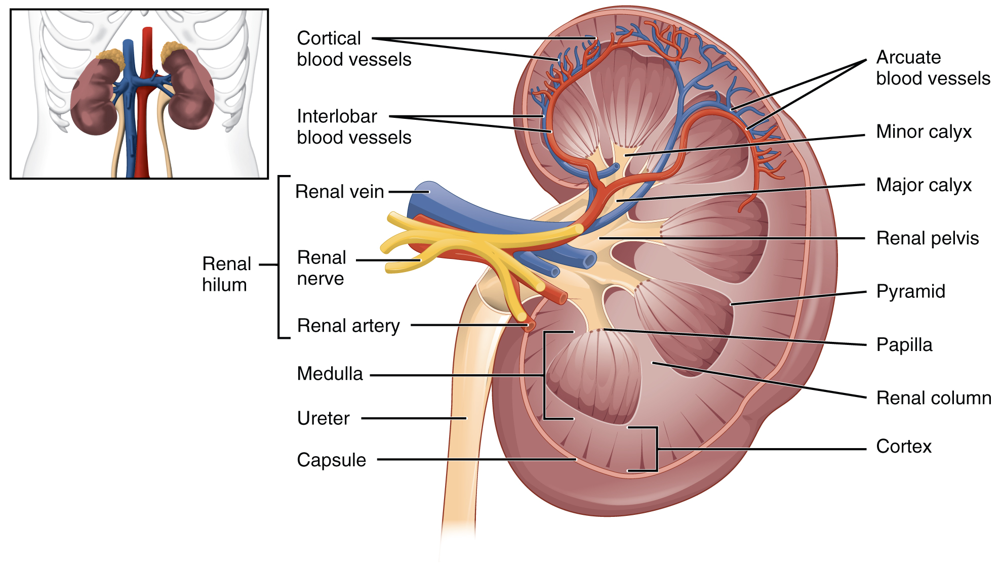
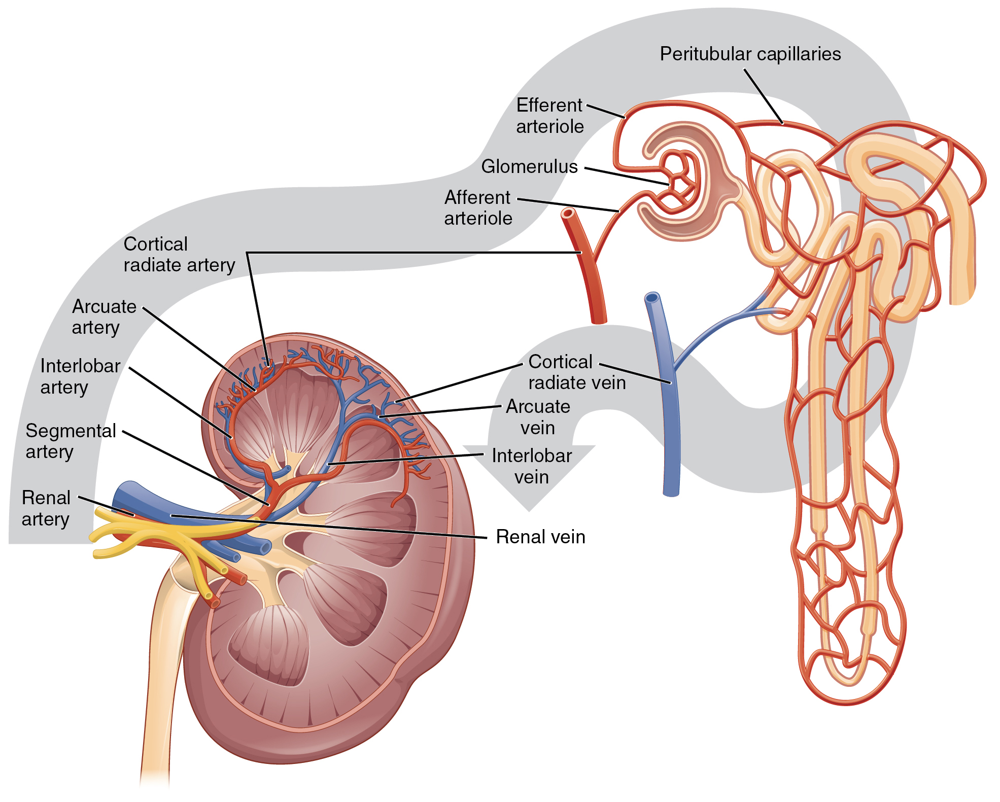

By the end of this section, you will be able to:
* Describe the external structure of the kidney, including its location,
  support structures, and covering
* Identify the major internal divisions and structures of the kidney
* Identify the major blood vessels associated with the kidney and trace
  the path of blood through the kidney
* Compare and contrast the cortical and juxtamedullary nephrons
* Name structures found in the cortex and medulla
* Describe the physiological characteristics of the cortex and medulla

The kidneys lie on either side of the spine in the retroperitoneal space
between the parietal peritoneum and the posterior abdominal wall, well
protected by muscle, fat, and ribs. They are roughly the size of your
fist, and the male kidney is typically a bit larger than the female
kidney. The kidneys are well vascularized, receiving about 25 percent of
the cardiac output at rest.

 {: data-media-type="image/png"}

There have never been sufficient kidney donations to provide a kidney to
each person needing one. Watch this [video][1] to learn about the TED
(Technology, Entertainment, Design) Conference held in March 2011. In
this video, Dr. Anthony Atala discusses a cutting-edge technique in
which a new kidney is “printed.” The successful utilization of this
technology is still several years in the future, but imagine a time when
you can print a replacement organ or tissue on demand.

# External Anatomy

The left kidney is located at about the T12 to L3 vertebrae, whereas the
right is lower due to slight displacement by the liver. Upper portions
of the kidneys are somewhat protected by the eleventh and twelfth ribs
([\[link\]](#fig-ch26_03_01){: .autogenerated-content}). Each kidney
weighs about 125–175 g in males and 115–155 g in females. They are about
11–14 cm in length, 6 cm wide, and 4 cm thick, and are directly covered
by a fibrous capsule composed of dense, irregular connective tissue that
helps to hold their shape and protect them. This capsule is covered by a
shock-absorbing layer of adipose tissue called the renal fat pad, which in turn is encompassed by a
tough renal fascia. The fascia and, to a lesser extent, the overlying
peritoneum serve to firmly anchor the kidneys to the posterior abdominal
wall in a retroperitoneal position.

."){: #fig-ch26_03_01 data-media-type="image/jpg" data-title="Kidneys "}

On the superior aspect of each kidney is the adrenal gland. The adrenal
cortex directly influences renal function through the production of the
hormone aldosterone to stimulate sodium reabsorption.

# Internal Anatomy

A frontal section through the kidney reveals an outer region called the
renal cortex and an inner region called
the medulla ([\[link\]](#fig-ch26_03_02){:
.autogenerated-content}). The renal
columns are connective tissue extensions that radiate downward
from the cortex through the medulla to separate the most characteristic
features of the medulla, the renal
pyramids and renal papillae. The
papillae are bundles of collecting ducts that transport urine made by
nephrons to the calyces of the kidney for
excretion. The renal columns also serve to divide the kidney into 6–8
lobes and provide a supportive framework for vessels that enter and exit
the cortex. The pyramids and renal columns taken together constitute the
kidney lobes.

{: #fig-ch26_03_02 data-media-type="image/jpg" data-title="Left Kidney "}

# Renal Hilum

The renal hilum is the entry and exit site
for structures servicing the kidneys: vessels, nerves, lymphatics, and
ureters. The medial-facing hila are tucked into the sweeping convex
outline of the cortex. Emerging from the hilum is the renal pelvis,
which is formed from the major and minor calyxes in the kidney. The
smooth muscle in the renal pelvis funnels urine via peristalsis into the
ureter. The renal arteries form directly from the descending aorta,
whereas the renal veins return cleansed blood directly to the inferior
vena cava. The artery, vein, and renal pelvis are arranged in an
anterior-to-posterior order.

## Nephrons and Vessels

The renal artery first divides into segmental arteries, followed by
further branching to form interlobar arteries that pass through the
renal columns to reach the cortex ([\[link\]](#fig-ch26_03_03){:
.autogenerated-content}). The interlobar arteries, in turn, branch into
arcuate arteries, cortical radiate arteries, and then into afferent
arterioles. The afferent arterioles service about 1.3 million nephrons
in each kidney.

{: #fig-ch26_03_03 data-media-type="image/jpg" data-title="Blood Flow in the Kidney "}

Nephrons are the “functional units” of the
kidney; they cleanse the blood and balance the constituents of the
circulation. The afferent arterioles form a tuft of high-pressure
capillaries about 200 µm in diameter, the glomerulus. The rest of the nephron consists of
a continuous sophisticated tubule whose proximal end surrounds the
glomerulus in an intimate embrace—this is Bowman’s capsule. The glomerulus and Bowman’s
capsule together form the renal corpuscle.
As mentioned earlier, these glomerular capillaries filter the blood
based on particle size. After passing through the renal corpuscle, the
capillaries form a second arteriole, the efferent
arteriole ([\[link\]](#fig-ch26_03_04){:
.autogenerated-content}). These will next form a capillary network
around the more distal portions of the nephron tubule, the peritubular capillaries and vasa recta, before returning to the venous
system. As the glomerular filtrate progresses through the nephron, these
capillary networks recover most of the solutes and water, and return
them to the circulation. Since a capillary bed (the glomerulus) drains
into a vessel that in turn forms a second capillary bed, the definition
of a portal system is met. This is the only portal system in which an
arteriole is found between the first and second capillary beds. (Portal
systems also link the hypothalamus to the anterior pituitary, and the
blood vessels of the digestive viscera to the liver.)

{: #fig-ch26_03_04 data-media-type="image/jpeg" data-title="Blood Flow in the Nephron "}

 {:
data-media-type="image/png"} 
Visit this [link][2] to view an interactive tutorial of the flow of
blood through the kidney.

## Cortex

In a dissected kidney, it is easy to identify the cortex; it appears
lighter in color compared to the rest of the kidney. All of the renal
corpuscles as well as both the proximal
convoluted tubules (PCTs) and distal
convoluted tubules are found here. Some nephrons have a short
loop of Henle that does not dip beyond the
cortex. These nephrons are called cortical
nephrons. About 15 percent of nephrons have long loops of Henle
that extend deep into the medulla and are called juxtamedullary nephrons.

# Chapter Review

As noted previously, the structure of the kidney is divided into two
principle regions—the peripheral rim of cortex and the central medulla.
The two kidneys receive about 25 percent of cardiac output. They are
protected in the retroperitoneal space by the renal fat pad and
overlying ribs and muscle. Ureters, blood vessels, lymph vessels, and
nerves enter and leave at the renal hilum. The renal arteries arise
directly from the aorta, and the renal veins drain directly into the
inferior vena cava. Kidney function is derived from the actions of about
1.3 million nephrons per kidney; these are the “functional units.” A
capillary bed, the glomerulus, filters blood and the filtrate is
captured by Bowman’s capsule. A portal system is formed when the blood
flows through a second capillary bed surrounding the proximal and distal
convoluted tubules and the loop of Henle. Most water and solutes are
recovered by this second capillary bed. This filtrate is processed and
finally gathered by collecting ducts that drain into the minor calyces,
which merge to form major calyces; the filtrate then proceeds to the
renal pelvis and finally the ureters.

# Review Questions

The renal pyramids are separated from each other by extensions of the
renal cortex called ________.

1.  renal medulla
2.  minor calyces
3.  medullary cortices
4.  renal columns
{: data-number-style="lower-alpha"}

D

The primary structure found within the medulla is the ________.

1.  loop of Henle
2.  minor calyces
3.  portal system
4.  ureter
{: data-number-style="lower-alpha"}

A

The right kidney is slightly lower because ________.

1.  it is displaced by the liver
2.  it is displace by the heart
3.  it is slightly smaller
4.  it needs protection of the lower ribs
{: data-number-style="lower-alpha"}

A

# Critical Thinking Questions

What anatomical structures provide protection to the kidney?

Retroperitoneal anchoring, renal fat pads, and ribs provide protection
to the kidney.

How does the renal portal system differ from the hypothalamo–hypophyseal
and digestive portal systems?

The renal portal system has an artery between the first and second
capillary bed. The others have a vein.

Name the structures found in the renal hilum.

The structures found in the renal hilum are arteries, veins, ureters,
lymphatics, and nerves.

[1]: http://openstaxcollege.org/l/TED
[2]: http://openstaxcollege.org/l/bloodflow5
