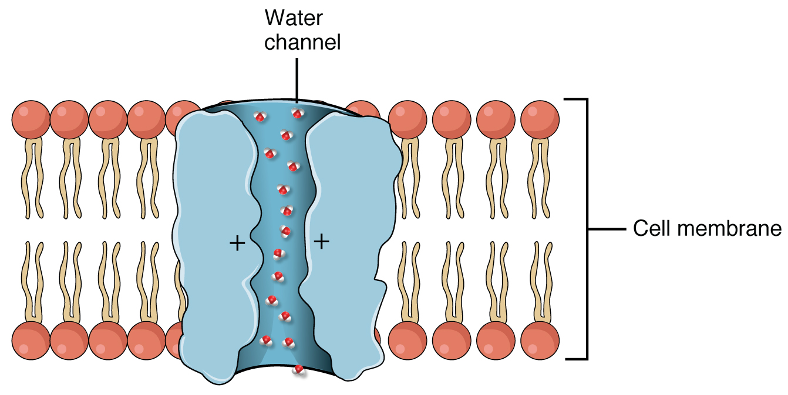

By the end of this section, you will be able to:
* Distinguish the histological differences between the renal cortex and medulla
* Describe the structure of the filtration membrane
* Identify the major structures and subdivisions of the renal corpuscles, renal tubules, and renal capillaries
* Discuss the function of the peritubular capillaries and vasa recta
* Identify the location of the juxtaglomerular apparatus and describe the cells that line it
* Describe the histology of the proximal convoluted tubule, loop of Henle, distal convoluted tubule, and collecting ducts

The renal structures that conduct the essential work of the kidney cannot be seen by the naked eye. Only a light or electron microscope can reveal these structures. Even then, serial sections and computer reconstruction are necessary to give us a comprehensive view of the functional anatomy of the nephron and its associated blood vessels.

# Nephrons: The Functional Unit

Nephrons take a simple filtrate of the blood and modify it into urine. Many changes take place in the different parts of the nephron before urine is created for disposal. The term **forming urine**{: data-type="term"} will be used hereafter to describe the filtrate as it is modified into true urine. The principle task of the nephron population is to balance the plasma to homeostatic set points and excrete potential toxins in the urine. They do this by accomplishing three principle functions—filtration, reabsorption, and secretion. They also have additional secondary functions that exert control in three areas: blood pressure (via production of **renin**{: data-type="term"}), red blood cell production (via the hormone EPO), and calcium absorption (via conversion of calcidiol into calcitriol, the active form of vitamin D).

## Renal Corpuscle

As discussed earlier, the renal corpuscle consists of a tuft of capillaries called the glomerulus that is largely surrounded by Bowman’s (glomerular) capsule. The glomerulus is a high-pressure capillary bed between afferent and efferent arterioles. Bowman’s capsule surrounds the glomerulus to form a lumen, and captures and directs this filtrate to the PCT. The outermost part of Bowman’s capsule, the parietal layer, is a simple squamous epithelium. It transitions onto the glomerular capillaries in an intimate embrace to form the visceral layer of the capsule. Here, the cells are not squamous, but uniquely shaped cells (**podocytes**{: data-type="term"}) extending finger-like arms (**pedicels**{: data-type="term"}) to cover the glomerular capillaries ([\[link\]](#fig-ch26_04_01)). These projections interdigitate to form **filtration slits**{: data-type="term"}, leaving small gaps between the digits to form a sieve. As blood passes through the glomerulus, 10 to 20 percent of the plasma filters between these sieve-like fingers to be captured by Bowman’s capsule and funneled to the PCT. Where the fenestrae (windows) in the glomerular capillaries match the spaces between the podocyte “fingers,” the only thing separating the capillary lumen and the lumen of Bowman’s capsule is their shared basement membrane ([\[link\]](#fig-ch26_04_02)). These three features comprise what is known as the filtration membrane. This membrane permits very rapid movement of filtrate from capillary to capsule though pores that are only 70 nm in diameter.

 , the large cell body can be seen at the top right corner, with branches extending from the cell body. The smallest finger-like extensions are the pedicels. Pedicels on one podocyte always interdigitate with the pedicels of another podocyte. (b) This capillary has three podocytes wrapped around it."){: #fig-ch26_04_01 data-title="Podocytes "}

{: #fig-ch26_04_02 data-title="Fenestrated Capillary "}

The **fenestrations**{: data-type="term"} prevent filtration of blood cells or large proteins, but allow most other constituents through. These substances cross readily if they are less than 4 nm in size and most pass freely up to 8 nm in size. An additional factor affecting the ability of substances to cross this barrier is their electric charge. The proteins associated with these pores are negatively charged, so they tend to repel negatively charged substances and allow positively charged substances to pass more readily. The basement membrane prevents filtration of medium-to-large proteins such as globulins. There are also **mesangial**{: data-type="term"} cells in the filtration membrane that can contract to help regulate the rate of filtration of the glomerulus. Overall, filtration is regulated by fenestrations in capillary endothelial cells, podocytes with filtration slits, membrane charge, and the basement membrane between capillary cells. The result is the creation of a filtrate that does not contain cells or large proteins, and has a slight predominance of positively charged substances.

Lying just outside Bowman’s capsule and the glomerulus is the **juxtaglomerular apparatus (JGA)**{: data-type="term"} ([\[link\]](#fig-ch26_04_03)). At the juncture where the afferent and efferent arterioles enter and leave Bowman’s capsule, the initial part of the distal convoluted tubule (DCT) comes into direct contact with the arterioles. The wall of the DCT at that point forms a part of the JGA known as the **macula densa**{: data-type="term"}. This cluster of cuboidal epithelial cells monitors the fluid composition of fluid flowing through the DCT. In response to the concentration of Na+ in the fluid flowing past them, these cells release paracrine signals. They also have a single, nonmotile cilium that responds to the rate of fluid movement in the tubule. The paracrine signals released in response to changes in flow rate and Na+ concentration are adenosine triphosphate (ATP) and adenosine.

  The JGA allows specialized cells to monitor the composition of the fluid in the DCT and adjust the glomerular filtration rate. (b) This micrograph shows the glomerulus and surrounding structures. LM &#xD7; 1540. (Micrograph provided by the Regents of University of Michigan Medical School &#xA9; 2012)"){: #fig-ch26_04_03 data-title="Juxtaglomerular Apparatus and Glomerulus "}

A second cell type in this apparatus is the **juxtaglomerular cell**{: data-type="term"}. This is a modified, smooth muscle cell lining the afferent arteriole that can contract or relax in response to ATP or adenosine released by the macula densa. Such contraction and relaxation regulate blood flow to the glomerulus. If the osmolarity of the filtrate is too high (hyperosmotic), the juxtaglomerular cells will contract, decreasing the glomerular filtration rate (GFR) so less plasma is filtered, leading to less urine formation and greater retention of fluid. This will ultimately decrease blood osmolarity toward the physiologic norm. If the osmolarity of the filtrate is too low, the juxtaglomerular cells will relax, increasing the GFR and enhancing the loss of water to the urine, causing blood osmolarity to rise. In other words, when osmolarity goes up, filtration and urine formation decrease and water is retained. When osmolarity goes down, filtration and urine formation increase and water is lost by way of the urine. The net result of these opposing actions is to keep the rate of filtration relatively constant. A second function of the macula densa cells is to regulate renin release from the juxtaglomerular cells of the afferent arteriole ([\[link\]](#fig-ch26_04_04)). Active renin is a protein comprised of 304 amino acids that cleaves several amino acids from **angiotensinogen**{: data-type="term"} to produce **angiotensin I**{: data-type="term"}. Angiotensin I is not biologically active until converted to angiotensin II by **angiotensin-converting enzyme (ACE)**{: data-type="term"} from the lungs. **Angiotensin II**{: data-type="term"} is a systemic vasoconstrictor that helps to regulate blood pressure by increasing it. Angiotensin II also stimulates the release of the steroid hormone aldosterone from the adrenal cortex. Aldosterone stimulates Na+ reabsorption by the kidney, which also results in water retention and increased blood pressure.

{: #fig-ch26_04_04 data-title="Conversion of Angiotensin I to Angiotensin II "}

## Proximal Convoluted Tubule (PCT)

Filtered fluid collected by Bowman’s capsule enters into the PCT. It is called convoluted due to its tortuous path. Simple cuboidal cells form this tubule with prominent microvilli on the luminal surface, forming a **brush border**{: data-type="term"}. These microvilli create a large surface area to maximize the absorption and secretion of solutes (Na+, Cl–, glucose, etc.), the most essential function of this portion of the nephron. These cells actively transport ions across their membranes, so they possess a high concentration of mitochondria in order to produce sufficient ATP.

## Loop of Henle

The descending and ascending portions of the loop of Henle (sometimes referred to as the nephron loop) are, of course, just continuations of the same tubule. They run adjacent and parallel to each other after having made a hairpin turn at the deepest point of their descent. The descending loop of Henle consists of an initial short, thick portion and long, thin portion, whereas the ascending loop consists of an initial short, thin portion followed by a long, thick portion. The descending thick portion consists of simple cuboidal epithelium similar to that of the PCT. The descending and ascending thin portions consists of simple squamous epithelium. As you will see later, these are important differences, since different portions of the loop have different permeabilities for solutes and water. The ascending thick portion consists of simple cuboidal epithelium similar to the DCT.

## Distal Convoluted Tubule (DCT)

The DCT, like the PCT, is very tortuous and formed by simple cuboidal epithelium, but it is shorter than the PCT. These cells are not as active as those in the PCT; thus, there are fewer microvilli on the apical surface. However, these cells must also pump ions against their concentration gradient, so you will find of large numbers of mitochondria, although fewer than in the PCT.

## Collecting Ducts

The collecting ducts are continuous with the nephron but not technically part of it. In fact, each duct collects filtrate from several nephrons for final modification. Collecting ducts merge as they descend deeper in the medulla to form about 30 terminal ducts, which empty at a papilla. They are lined with simple squamous epithelium with receptors for ADH. When stimulated by ADH, these cells will insert **aquaporin**{: data-type="term"} channel proteins into their membranes, which as their name suggests, allow water to pass from the duct lumen through the cells and into the interstitial spaces to be recovered by the vasa recta. This process allows for the recovery of large amounts of water from the filtrate back into the blood. In the absence of ADH, these channels are not inserted, resulting in the excretion of water in the form of dilute urine. Most, if not all, cells of the body contain aquaporin molecules, whose channels are so small that only water can pass. At least 10 types of aquaporins are known in humans, and six of those are found in the kidney. The function of all aquaporins is to allow the movement of water across the lipid-rich, hydrophobic cell membrane ([\[link\]](#fig-ch26_04_05)).

 {: #fig-ch26_04_05 data-title="Aquaporin Water Channel "}

# Chapter Review

The functional unit of the kidney, the nephron, consists of the renal corpuscle, PCT, loop of Henle, and DCT. Cortical nephrons have short loops of Henle, whereas juxtamedullary nephrons have long loops of Henle extending into the medulla. About 15 percent of nephrons are juxtamedullary. The glomerulus is a capillary bed that filters blood principally based on particle size. The filtrate is captured by Bowman’s capsule and directed to the PCT. A filtration membrane is formed by the fused basement membranes of the podocytes and the capillary endothelial cells that they embrace. Contractile mesangial cells further perform a role in regulating the rate at which the blood is filtered. Specialized cells in the JGA produce paracrine signals to regulate blood flow and filtration rates of the glomerulus. Other JGA cells produce the enzyme renin, which plays a central role in blood pressure regulation. The filtrate enters the PCT where absorption and secretion of several substances occur. The descending and ascending limbs of the loop of Henle consist of thick and thin segments. Absorption and secretion continue in the DCT but to a lesser extent than in the PCT. Each collecting duct collects forming urine from several nephrons and responds to the posterior pituitary hormone ADH by inserting aquaporin water channels into the cell membrane to fine tune water recovery.

# Review Questions

Blood filtrate is captured in the lumen of the \_\_\_\_\_\_\_\_.

1.  glomerulus
2.  Bowman’s capsule
3.  calyces
4.  renal papillae
{: data-number-style="lower-alpha"}

B

What are the names of the capillaries following the efferent arteriole?

1.  arcuate and medullary
2.  interlobar and interlobular
3.  peritubular and vasa recta
4.  peritubular and medullary
{: data-number-style="lower-alpha"}

C

The functional unit of the kidney is called \_\_\_\_\_\_\_\_.

1.  the renal hilus
2.  the renal corpuscle
3.  the nephron
4.  Bowman’s capsule
{: data-number-style="lower-alpha"}

C

# Critical Thinking Questions

Which structures make up the renal corpuscle?

The structures that make up the renal corpuscle are the glomerulus, Bowman’s capsule, and PCT.

What are the major structures comprising the filtration membrane?

The major structures comprising the filtration membrane are fenestrations and podocyte fenestra, fused basement membrane, and filtration slits.

