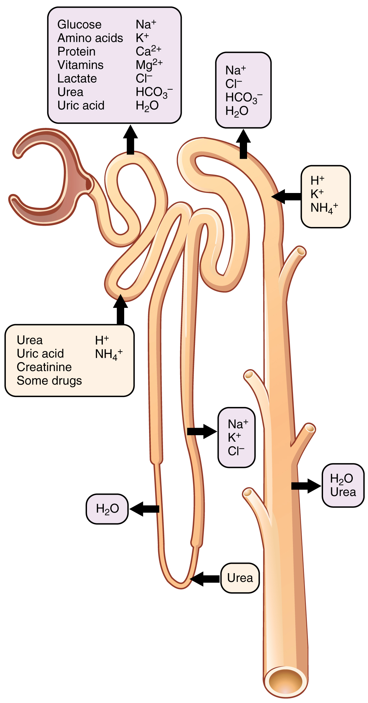
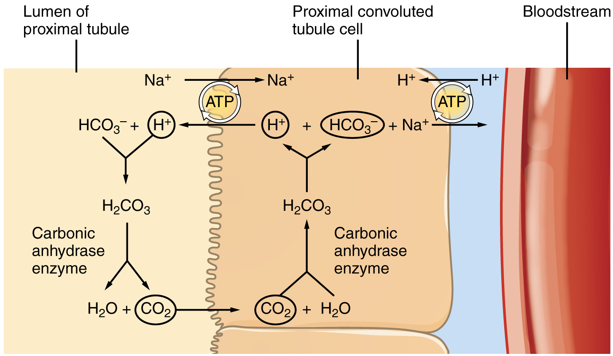
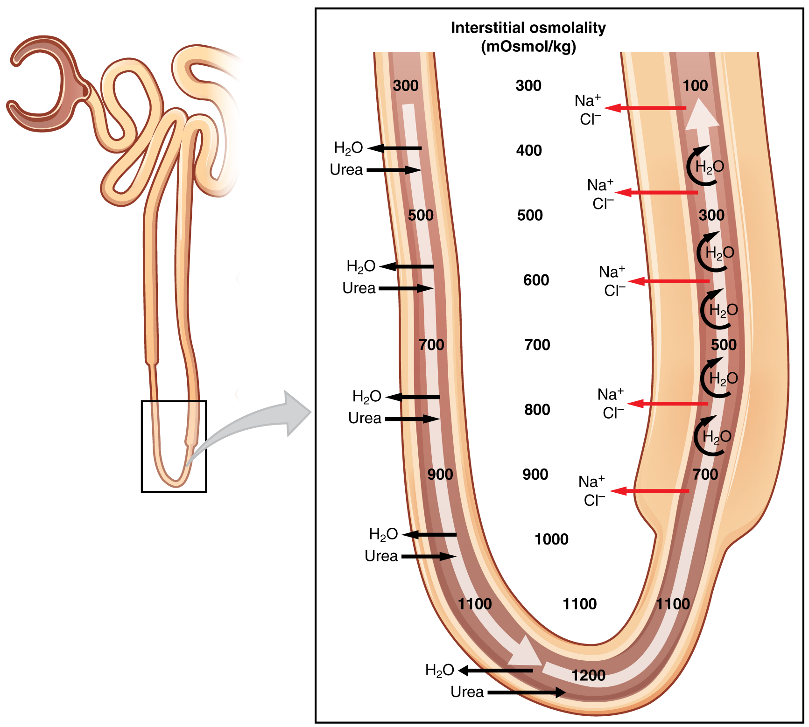

By the end of this section, you will be able to:
* List specific transport mechanisms occurring in different parts of the nephron, including active transport, osmosis, facilitated diffusion, and passive electrochemical gradients
* List the different membrane proteins of the nephron, including channels, transporters, and ATPase pumps
* Compare and contrast passive and active tubular reabsorption
* Explain why the differential permeability or impermeability of specific sections of the nephron tubules is necessary for urine formation
* Describe how and where water, organic compounds, and ions are reabsorbed in the nephron
* Explain the role of the loop of Henle, the vasa recta, and the countercurrent multiplication mechanisms in the concentration of urine
* List the locations in the nephron where tubular secretion occurs

With up to 180 liters per day passing through the nephrons of the kidney, it is quite obvious that most of that fluid and its contents must be reabsorbed. That recovery occurs in the PCT, loop of Henle, DCT, and the collecting ducts ([\[link\]](#tbl-ch26_05) and [\[link\]](#fig-ch26_06_01)). Various portions of the nephron differ in their capacity to reabsorb water and specific solutes. While much of the reabsorption and secretion occur passively based on concentration gradients, the amount of water that is reabsorbed or lost is tightly regulated. This control is exerted directly by ADH and aldosterone, and indirectly by renin. Most water is recovered in the PCT, loop of Henle, and DCT. About 10 percent (about 18 L) reaches the collecting ducts. The collecting ducts, under the influence of ADH, can recover almost all of the water passing through them, in cases of dehydration, or almost none of the water, in cases of over-hydration.

 {: #fig-ch26_06_01 data-title="Locations of Secretion and Reabsorption in the Nephron "}

<table id="tbl-ch26_05" summary=""><thead>
<tr>
<th colspan="5">Substances Secreted or Reabsorbed in the Nephron and Their Locations</th>
</tr>
<tr>
<th>Substance</th>
<th>PCT</th>
<th>Loop of Henle</th>
<th>DCT</th>
<th>Collecting ducts</th>
</tr>
</thead><tbody>
<tr>
<td>Glucose</td>
<td>Almost 100 percent reabsorbed; secondary active transport with Na+</td>
<td />
<td />
<td />
</tr>
<tr>
<td>Oligopeptides, proteins, amino acids</td>
<td>Almost 100 percent reabsorbed; symport with Na+</td>
<td />
<td />
<td />
</tr>
<tr>
<td>Vitamins</td>
<td>Reabsorbed</td>
<td />
<td />
<td />
</tr>
<tr>
<td>Lactate</td>
<td>Reabsorbed</td>
<td />
<td />
<td />
</tr>
<tr>
<td>Creatinine</td>
<td>Secreted </td>
<td />
<td />
<td />
</tr>
<tr>
<td>Urea</td>
<td>50 percent reabsorbed by diffusion; also secreted</td>
<td>Secretion, diffusion in descending limb</td>
<td />
<td>Reabsorption in medullary collecting ducts; diffusion</td>
</tr>
<tr>
<td>Sodium</td>
<td>65 percent actively reabsorbed</td>
<td>25 percent reabsorbed in thick ascending limb; active transport</td>
<td>5 percent reabsorbed; active</td>
<td>5 percent reabsorbed, stimulated by aldosterone; active</td>
</tr>
<tr>
<td>Chloride</td>
<td>Reabsorbed, symport with Na+, diffusion</td>
<td>Reabsorbed in thin and thick ascending limb; diffusion in ascending limb</td>
<td>Reabsorbed; diffusion</td>
<td>Reabsorbed; symport</td>
</tr>
<tr>
<td>Water</td>
<td>67 percent reabsorbed osmotically with solutes</td>
<td>15 percent reabsorbed in descending limb; osmosis</td>
<td>8 percent reabsorbed if ADH; osmosis</td>
<td>Variable amounts reabsorbed, controlled by ADH, osmosis</td>
</tr>
<tr>
<td>Bicarbonate</td>
<td>80–90 percent symport reabsorption with Na+</td>
<td>Reabsorbed, symport with Na+ and antiport with Cl–; in ascending limb</td>
<td />
<td>Reabsorbed antiport with Cl–</td>
</tr>
<tr>
<td>H+</td>
<td>Secreted; diffusion</td>
<td />
<td>Secreted; active</td>
<td>Secreted; active</td>
</tr>
<tr>
<td>NH4+</td>
<td>Secreted; diffusion</td>
<td />
<td>Secreted; diffusion</td>
<td>Secreted; diffusion</td>
</tr>
<tr>
<td>HCO3–</td>
<td>Reabsorbed; diffusion</td>
<td>Reabsorbed; diffusion in ascending limb</td>
<td>Reabsorbed; diffusion</td>
<td>Reabsorbed; antiport with Na+</td>
</tr>
<tr>
<td>Some drugs</td>
<td>Secreted </td>
<td />
<td>Secreted; active</td>
<td>Secreted; active</td>
</tr>
<tr>
<td>Potassium</td>
<td>65 percent reabsorbed; diffusion</td>
<td>20 percent reabsorbed in thick ascending limb; symport</td>
<td>Secreted; active</td>
<td>Secretion controlled by aldosterone; active</td>
</tr>
<tr>
<td>Calcium</td>
<td>Reabsorbed; diffusion</td>
<td>Reabsorbed in thick ascending limb; diffusion</td>
<td />
<td>Reabsorbed if parathyroid hormone present; active</td>
</tr>
<tr>
<td>Magnesium</td>
<td>Reabsorbed; diffusion</td>
<td>Reabsorbed in thick ascending limb; diffusion</td>
<td>Reabsorbed</td>
<td />
</tr>
<tr>
<td>Phosphate</td>
<td>85 percent reabsorbed, inhibited by parathyroid hormone, diffusion</td>
<td />
<td>Reabsorbed; diffusion</td>
<td />
</tr>
</tbody></table>

# Mechanisms of Recovery

Mechanisms by which substances move across membranes for reabsorption or secretion include active transport, diffusion, facilitated diffusion, secondary active transport, and osmosis. These were discussed in an earlier chapter, and you may wish to review them.

Active transport utilizes energy, usually the energy found in a phosphate bond of ATP, to move a substance across a membrane from a low to a high concentration. It is very specific and must have an appropriately shaped receptor for the substance to be transported. An example would be the active transport of Na+ out of a cell and K+ into a cell by the Na+/K+ pump. Both ions are moved in opposite directions from a lower to a higher concentration.

Simple diffusion moves a substance from a higher to a lower concentration down its concentration gradient. It requires no energy and only needs to be soluble.

Facilitated diffusion is similar to diffusion in that it moves a substance down its concentration gradient. The difference is that it requires specific membrane receptors or channel proteins for movement. The movement of glucose and, in certain situations, Na+ ions, is an example of facilitated diffusion. In some cases of mediated transport, two different substances share the same channel protein port; these mechanisms are described by the terms symport and antiport.

Symport mechanisms move two or more substances in the same direction at the same time, whereas antiport mechanisms move two or more substances in opposite directions across the cell membrane. Both mechanisms may utilize concentration gradients maintained by ATP pumps. As described previously, when active transport powers the transport of another substance in this way, it is called “secondary active transport.” Glucose reabsorption in the kidneys is by secondary active transport. Na+/K+ ATPases on the basal membrane of a tubular cell constantly pump Na+ out of the cell, maintaining a strong electrochemical gradient for Na+ to move into the cell from the tubular lumen. On the luminal (apical) surface, a Na+/glucose symport protein assists both Na+ and glucose movement into the cell. The cotransporter moves glucose into the cell against its concentration gradient as Na+ moves down the electrochemical gradient created by the basal membranes Na+/K+ ATPases. The glucose molecule then diffuses across the basal membrane by facilitated diffusion into the interstitial space and from there into peritubular capillaries.

Most of the Ca++, Na+, glucose, and amino acids must be reabsorbed by the nephron to maintain homeostatic plasma concentrations. Other substances, such as urea, K+, ammonia (NH3), creatinine, and some drugs are secreted into the filtrate as waste products. Acid–base balance is maintained through actions of the lungs and kidneys: The lungs rid the body of H+, whereas the kidneys secrete or reabsorb H+ and HCO3– ([\[link\]](#tbl-ch26_06)). In the case of urea, about 50 percent is passively reabsorbed by the PCT. More is recovered by in the collecting ducts as needed. ADH induces the insertion of urea transporters and aquaporin channel proteins.

<table id="tbl-ch26_06" summary=""><thead>
<tr>
<th colspan="4">Substances Filtered and Reabsorbed by the Kidney per 24 Hours</th>
</tr>
<tr>
<th>Substance</th>
<th>Amount filtered (grams)</th>
<th>Amount reabsorbed (grams)</th>
<th>Amount in urine (grams)</th>
</tr>
</thead><tbody>
<tr>
<td>Water</td>
<td>180 L</td>
<td>179 L</td>
<td>1 L</td>
</tr>
<tr>
<td>Proteins</td>
<td>10–20</td>
<td>10–20</td>
<td>0</td>
</tr>
<tr>
<td>Chlorine</td>
<td>630</td>
<td>625</td>
<td>5</td>
</tr>
<tr>
<td>Sodium</td>
<td>540</td>
<td>537</td>
<td>3</td>
</tr>
<tr>
<td>Bicarbonate</td>
<td>300</td>
<td>299.7</td>
<td>0.3</td>
</tr>
<tr>
<td>Glucose</td>
<td>180</td>
<td>180</td>
<td>0</td>
</tr>
<tr>
<td>Urea</td>
<td>53</td>
<td>28</td>
<td>25</td>
</tr>
<tr>
<td>Potassium</td>
<td>28</td>
<td>24</td>
<td>4</td>
</tr>
<tr>
<td>Uric acid</td>
<td>8.5</td>
<td>7.7</td>
<td>0.8</td>
</tr>
<tr>
<td>Creatinine</td>
<td>1.4</td>
<td>0</td>
<td>1.4</td>
</tr>
</tbody></table>

# Reabsorption and Secretion in the PCT

The renal corpuscle filters the blood to create a filtrate that differs from blood mainly in the absence of cells and large proteins. From this point to the ends of the collecting ducts, the filtrate or forming urine is undergoing modification through secretion and reabsorption before true urine is produced. The first point at which the forming urine is modified is in the PCT. Here, some substances are reabsorbed, whereas others are secreted. Note the use of the term “reabsorbed.” All of these substances were “absorbed” in the digestive tract—99 percent of the water and most of the solutes filtered by the nephron must be reabsorbed. Water and substances that are reabsorbed are returned to the circulation by the peritubular and vasa recta capillaries. It is important to understand the difference between the glomerulus and the peritubular and vasa recta capillaries. The glomerulus has a relatively high pressure inside its capillaries and can sustain this by dilating the afferent arteriole while constricting the efferent arteriole. This assures adequate filtration pressure even as the systemic blood pressure varies. Movement of water into the peritubular capillaries and vasa recta will be influenced primarily by osmolarity and concentration gradients. Sodium is actively pumped out of the PCT into the interstitial spaces between cells and diffuses down its concentration gradient into the peritubular capillary. As it does so, water will follow passively to maintain an isotonic fluid environment inside the capillary. This is called obligatory water reabsorption, because water is “obliged” to follow the Na+ ([\[link\]](#fig-ch26_06_02)).

 {: #fig-ch26_06_02 data-title="Substances Reabsorbed and Secreted by the PCT "}

More substances move across the membranes of the PCT than any other portion of the nephron. Many of these substances (amino acids and glucose) use symport mechanisms for transport along with Na+. Antiport, active transport, diffusion, and facilitated diffusion are additional mechanisms by which substances are moved from one side of a membrane to the other. Recall that cells have two surfaces: apical and basal. The apical surface is the one facing the lumen or open space of a cavity or tube, in this case, the inside of the PCT. The basal surface of the cell faces the connective tissue base to which the cell attaches (basement membrane) or the cell membrane closer to the basement membrane if there is a stratified layer of cells. In the PCT, there is a single layer of simple cuboidal endothelial cells against the basement membrane. The numbers and particular types of pumps and channels vary between the apical and basilar surfaces. A few of the substances that are transported with Na+ (symport mechanism) on the apical membrane include Cl–, Ca++, amino acids, glucose, and <math xmlns="http://www.w3.org/1998/Math/MathML" display="left"> <semantics> <mrow> <msubsup> <mrow> <mtext>PO</mtext> </mrow> <mn>4</mn> <mrow> <mn>3</mn><mo>−</mo> </mrow> </msubsup> </mrow> <annotation encoding="MathType-MTEF">MathType@MTEF@5@5@+=feaagyart1ev2aaatCvAUfeBSjuyZL2yd9gzLbvyNv2CaerbuLwBLnhiov2DGi1BTfMBaeXatLxBI9gBaerbd9wDYLwzYbItLDharqqtubsr4rNCHbGeaGqiVu0Je9sqqrpepC0xbbL8F4rqqrFfpeea0xe9Lq=Jc9vqaqpepm0xbba9pwe9Q8fs0=yqaqpepae9pg0FirpepeKkFr0xfr=xfr=xb9adbaqaaeGaciGaaiaabeqaamaabaabaaGcbaGaaeiuaiaab+eadaqhaaWcbaGaaGinaaqaaiaaiodacqGHsislaaaaaa@3A2D@</annotation> </semantics> </math>

. Sodium is actively exchanged for K+ using ATP on the basal membrane. Most of the substances transported by a symport mechanism on the apical membrane are transported by facilitated diffusion on the basal membrane. At least three ions, K+, Ca++, and Mg++, diffuse laterally between adjacent cell membranes (transcellular).

About 67 percent of the water, Na+, and K+ entering the nephron is reabsorbed in the PCT and returned to the circulation. Almost 100 percent of glucose, amino acids, and other organic substances such as vitamins are normally recovered here. Some glucose may appear in the urine if circulating glucose levels are high enough that all the glucose transporters in the PCT are saturated, so that their capacity to move glucose is exceeded (transport maximum, or Tm). In men, the maximum amount of glucose that can be recovered is about 375 mg/min, whereas in women, it is about 300 mg/min. This recovery rate translates to an arterial concentration of about 200 mg/dL. Though an exceptionally high sugar intake might cause sugar to appear briefly in the urine, the appearance of **glycosuria**{: data-type="term"} usually points to type I or II diabetes mellitus. The transport of glucose from the lumen of the PCT to the interstitial space is similar to the way it is absorbed by the small intestine. Both glucose and Na+ bind simultaneously to the same symport proteins on the apical surface of the cell to be transported in the same direction, toward the interstitial space. Sodium moves down its electrochemical and concentration gradient into the cell and takes glucose with it. Na+ is then actively pumped out of the cell at the basal surface of the cell into the interstitial space. Glucose leaves the cell to enter the interstitial space by facilitated diffusion. The energy to move glucose comes from the Na+/K+ ATPase that pumps Na+ out of the cell on the basal surface. Fifty percent of Cl– and variable quantities of Ca++, Mg++, and <math xmlns="http://www.w3.org/1998/Math/MathML" display="left"> <semantics> <mrow> <msubsup> <mrow> <mtext>HPO</mtext> </mrow> <mn>4</mn> <mrow> <mn>2</mn><mo>−</mo> </mrow> </msubsup> </mrow> <annotation encoding="MathType-MTEF">MathType@MTEF@5@5@+=feaagyart1ev2aaatCvAUfeBSjuyZL2yd9gzLbvyNv2CaerbuLwBLnhiov2DGi1BTfMBaeXatLxBI9gBaerbd9wDYLwzYbItLDharqqtubsr4rNCHbGeaGqiVu0Je9sqqrpepC0xbbL8F4rqqrFfpeea0xe9Lq=Jc9vqaqpepm0xbba9pwe9Q8fs0=yqaqpepae9pg0FirpepeKkFr0xfr=xfr=xb9adbaqaaeGaciGaaiaabeqaamaabaabaaGcbaGaaeisaiaabcfacaqGpbWaa0baaSqaaiaaisdaaeaacaaIYaGaeyOeI0caaaaa@3AF7@</annotation> </semantics> </math>

 are also recovered in the PCT.

Recovery of bicarbonate (HCO3–) is vital to the maintenance of acid–base balance, since it is a very powerful and fast-acting buffer. An important enzyme is used to catalyze this mechanism: carbonic anhydrase (CA). This same enzyme and reaction is used in red blood cells in the transportation of CO2, in the stomach to produce hydrochloric acid, and in the pancreas to produce HCO3– to buffer acidic chyme from the stomach. In the kidney, most of the CA is located within the cell, but a small amount is bound to the brush border of the membrane on the apical surface of the cell. In the lumen of the PCT, HCO3– combines with hydrogen ions to form carbonic acid (H2CO3). This is enzymatically catalyzed into CO2 and water, which diffuse across the apical membrane into the cell. Water can move osmotically across the lipid bilayer membrane due to the presence of aquaporin water channels. Inside the cell, the reverse reaction occurs to produce bicarbonate ions (HCO3–). These bicarbonate ions are cotransported with Na+ across the basal membrane to the interstitial space around the PCT ([\[link\]](#fig-ch26_06_03)). At the same time this is occurring, a Na+/H+ antiporter excretes H+ into the lumen, while it recovers Na+. Note how the hydrogen ion is recycled so that bicarbonate can be recovered. Also, note that a Na+ gradient is created by the Na+/K+ pump.

<math xmlns="http://www.w3.org/1998/Math/MathML" display="block"> <semantics> <mrow> <msub> <mrow> <mtext>HCO</mtext> </mrow> <mrow> <mn>3</mn><mo>−</mo> </mrow> </msub> <msup> <mrow> <mtext>+ H</mtext> </mrow> <mtext>+</mtext> </msup> <mo stretchy="false">↔</mo><msub> <mtext>H</mtext> <mtext>2</mtext> </msub> <msub> <mrow> <mtext>CO</mtext> </mrow> <mtext>3</mtext> </msub> <mo stretchy="false">↔</mo><msub> <mrow> <mtext>CO</mtext> </mrow> <mtext>2</mtext> </msub> <msub> <mrow> <mtext> + H</mtext> </mrow> <mtext>2</mtext> </msub> <mtext>O</mtext> </mrow> <annotation encoding="MathType-MTEF">MathType@MTEF@5@5@+=feaagyart1ev2aaatCvAUfeBSjuyZL2yd9gzLbvyNv2CaerbuLwBLnhiov2DGi1BTfMBaeXatLxBI9gBaerbd9wDYLwzYbItLDharqqtubsr4rNCHbGeaGqiVu0Je9sqqrpepC0xbbL8F4rqqrFfpeea0xe9Lq=Jc9vqaqpepm0xbba9pwe9Q8fs0=yqaqpepae9pg0FirpepeKkFr0xfr=xfr=xb9adbaqaaeGaciGaaiaabeqaamaabaabaaGcbaGaaeisaiaaboeacaqGpbWaaSbaaSqaaiaaiodacqGHsislaeqaaOGaae4kaiaabccacaqGibWaaWbaaSqabeaacaqGRaaaaOGaeyiLHSQaaeisamaaBaaaleaacaqGYaaabeaakiaaboeacaqGpbWaaSbaaSqaaiaabodaaeqaaOGaeyiLHSQaae4qaiaab+eadaWgaaWcbaGaaeOmaaqabaGccaqGGaGaae4kaiaabccacaqGibWaaSbaaSqaaiaabkdaaeqaaOGaae4taaaa@4C48@</annotation> </semantics> </math>

The significant recovery of solutes from the PCT lumen to the interstitial space creates an osmotic gradient that promotes water recovery. As noted before, water moves through channels created by the aquaporin proteins. These proteins are found in all cells in varying amounts and help regulate water movement across membranes and through cells by creating a passageway across the hydrophobic lipid bilayer membrane. Changing the number of aquaporin proteins in membranes of the collecting ducts also helps to regulate the osmolarity of the blood. The movement of many positively charged ions also creates an electrochemical gradient. This charge promotes the movement of negative ions toward the interstitial spaces and the movement of positive ions toward the lumen.

 {: #fig-ch26_06_03 data-title="Reabsorption of Bicarbonate from the PCT "}

# Reabsorption and Secretion in the Loop of Henle

The loop of Henle consists of two sections: thick and thin descending and thin and thick ascending sections. The loops of cortical nephrons do not extend into the renal medulla very far, if at all. Juxtamedullary nephrons have loops that extend variable distances, some very deep into the medulla. The descending and ascending portions of the loop are highly specialized to enable recovery of much of the Na+ and water that were filtered by the glomerulus. As the forming urine moves through the loop, the osmolarity will change from isosmotic with blood (about 278–300 mOsmol/kg) to both a very hypertonic solution of about 1200 mOsmol/kg and a very hypotonic solution of about 100 mOsmol/kg. These changes are accomplished by osmosis in the descending limb and active transport in the ascending limb. Solutes and water recovered from these loops are returned to the circulation by way of the vasa recta.

## Descending Loop

The majority of the descending loop is comprised of simple squamous epithelial cells; to simplify the function of the loop, this discussion focuses on these cells. These membranes have permanent aquaporin channel proteins that allow unrestricted movement of water from the descending loop into the surrounding interstitium as osmolarity increases from about 300 mOsmol/kg to about 1200 mOsmol/kg. This increase results in reabsorption of up to 15 percent of the water entering the nephron. Modest amounts of urea, Na+, and other ions are also recovered here.

Most of the solutes that were filtered in the glomerulus have now been recovered along with a majority of water, about 82 percent. As the forming urine enters the ascending loop, major adjustments will be made to the concentration of solutes to create what you perceive as urine.

## Ascending Loop

The ascending loop is made of very short thin and longer thick portions. Once again, to simplify the function, this section only considers the thick portion. The thick portion is lined with simple cuboidal epithelium without a brush border. It is completely impermeable to water due to the absence of aquaporin proteins, but ions, mainly Na+ and CL–, are actively reabsorbed by a cotransport system. This has two significant effects: Removal of NaCl while retaining water leads to a hypoosomotic filtrate by the time it reaches the DCT; pumping NaCl into the interstitial space contributes to the hyperosmotic environment in the kidney medulla.

The Na+/K+ ATPase pumps in the basal membrane create an electrochemical gradient, allowing reabsorption of Cl– by Na+/Cl– symporters in the apical membrane. At the same time that Na+ is actively pumped from the basal side of the cell into the interstitial fluid, Cl– follows the Na+ from the lumen into the interstitial fluid by a paracellular route between cells through **leaky tight junctions**{: data-type="term"}. These are found between cells of the ascending loop, where they allow certain solutes to move according to their concentration gradient. Most of the K+ that enters the cell via symporters returns to the lumen (down its concentration gradient) through leaky channels in the apical membrane. Note the environment now created in the interstitial space: With the “back door exiting” K+, there is one Na+ and two Cl– ions left in the interstitium surrounding the ascending loop. Therefore, in comparison to the lumen of the loop, the interstitial space is now a negatively charged environment. This negative charge attracts cations (Na+, K+, Ca++, and Mg++) from the lumen via a paracellular route to the interstitial space and vasa recta.

## Countercurrent Multiplier System

The structure of the loop of Henle and associated vasa recta create a **countercurrent multiplier system**{: data-type="term"} ([\[link\]](#fig-ch26_06_04)). The countercurrent term comes from the fact that the descending and ascending loops are next to each other and their fluid flows in opposite directions (countercurrent). The multiplier term is due to the action of solute pumps that increase (multiply) the concentrations of urea and Na+ deep in the medulla.

 {: #fig-ch26_06_04 data-title="Countercurrent Multiplier System "}

As discussed above, the ascending loop actively reabsorbs NaCl out of the forming urine into the interstitial spaces. In addition, collecting ducts have urea pumps that actively pump urea into the interstitial spaces. This results in the recovery of NaCl to the circulation via the vasa recta and creates a high osmolar environment in the depths of the medulla.

Ammonia (NH3) is a toxic byproduct of protein metabolism. It is formed as amino acids are deaminated by liver hepatocytes. That means that the amine group, NH2, is removed from amino acids as they are broken down. Most of the resulting ammonia is converted into urea by liver hepatocytes. Urea is not only less toxic but is utilized to aid in the recovery of water by the loop of Henle and collecting ducts. At the same time that water is freely diffusing out of the descending loop through aquaporin channels into the interstitial spaces of the medulla, urea freely diffuses into the lumen of the descending loop as it descends deeper into the medulla, much of it to be reabsorbed from the forming urine when it reaches the collecting duct. Thus, the movement of Na+ and urea into the interstitial spaces by these mechanisms creates the hyperosmotic environment of the medulla. The net result of this countercurrent multiplier system is to recover both water and Na+ in the circulation.

The amino acid glutamine can be deaminated by the kidney. As NH2 from the amino acid is converted into NH3 and pumped into the lumen of the PCT, Na+ and HCO3– are excreted into the interstitial fluid of the renal pyramid via a symport mechanism. When this process occurs in the cells of the PCT, the added benefit is a net loss of a hydrogen ion (complexed to ammonia to form the weak acid NH4+) in the urine and a gain of a bicarbonate ion (HCO3–) in the blood. Ammonia and bicarbonate are exchanged in a one-to-one ratio. This exchange is yet another means by which the body can buffer and excrete acid. The presence of aquaporin channels in the descending loop allows prodigious quantities of water to leave the loop and enter the hyperosmolar interstitium of the pyramid, where it is returned to the circulation by the vasa recta. As the loop turns to become the ascending loop, there is an absence of aquaporin channels, so water cannot leave the loop. However, in the basal membrane of cells of the thick ascending loop, ATPase pumps actively remove Na+ from the cell. A Na+/K+/2Cl– symporter in the apical membrane passively allows these ions to enter the cell cytoplasm from the lumen of the loop down a concentration gradient created by the pump. This mechanism works to dilute the fluid of the ascending loop ultimately to approximately 50–100 mOsmol/L.

At the transition from the DCT to the collecting duct, about 20 percent of the original water is still present and about 10 percent of the sodium. If no other mechanism for water reabsorption existed, about 20–25 liters of urine would be produced. Now consider what is happening in the adjacent capillaries, the vasa recta. They are recovering both solutes and water at a rate that preserves the countercurrent multiplier system. In general, blood flows slowly in capillaries to allow time for exchange of nutrients and wastes. In the vasa recta particularly, this rate of flow is important for two additional reasons. The flow must be slow to allow blood cells to lose and regain water without either crenating or bursting. Second, a rapid flow would remove too much Na+ and urea, destroying the osmolar gradient that is necessary for the recovery of solutes and water. Thus, by flowing slowly to preserve the countercurrent mechanism, as the vasa recta descend, Na+ and urea are freely able to enter the capillary, while water freely leaves; as they ascend, Na+ and urea are secreted into the surrounding medulla, while water reenters and is removed.

  
Watch this [video][1] to learn about the countercurrent multiplier system.

# Reabsorption and Secretion in the Distal Convoluted Tubule

Approximately 80 percent of filtered water has been recovered by the time the dilute forming urine enters the DCT. The DCT will recover another 10–15 percent before the forming urine enters the collecting ducts. Aldosterone increases the amount of Na+/K+ ATPase in the basal membrane of the DCT and collecting duct. The movement of Na+ out of the lumen of the collecting duct creates a negative charge that promotes the movement of Cl– out of the lumen into the interstitial space by a paracellular route across tight junctions. Peritubular capillaries receive the solutes and water, returning them to the circulation.

Cells of the DCT also recover Ca++ from the filtrate. Receptors for parathyroid hormone (PTH) are found in DCT cells and when bound to PTH, induce the insertion of calcium channels on their luminal surface. The channels enhance Ca++ recovery from the forming urine. In addition, as Na+ is pumped out of the cell, the resulting electrochemical gradient attracts Ca++ into the cell. Finally, calcitriol (1,25 dihydroxyvitamin D, the active form of vitamin D) is very important for calcium recovery. It induces the production of calcium-binding proteins that transport Ca++ into the cell. These binding proteins are also important for the movement of calcium inside the cell and aid in exocytosis of calcium across the basolateral membrane. Any Ca++ not reabsorbed at this point is lost in the urine.

# Collecting Ducts and Recovery of Water

Solutes move across the membranes of the collecting ducts, which contain two distinct cell types, principal cells and intercalated cells. A **principal cell**{: data-type="term"} possesses channels for the recovery or loss of sodium and potassium. An **intercalated cell**{: data-type="term"} secretes or absorbs acid or bicarbonate. As in other portions of the nephron, there is an array of micromachines (pumps and channels) on display in the membranes of these cells.

Regulation of urine volume and osmolarity are major functions of the collecting ducts. By varying the amount of water that is recovered, the collecting ducts play a major role in maintaining the body’s normal osmolarity. If the blood becomes hyperosmotic, the collecting ducts recover more water to dilute the blood; if the blood becomes hyposmotic, the collecting ducts recover less of the water, leading to concentration of the blood. Another way of saying this is: If plasma osmolarity rises, more water is recovered and urine volume decreases; if plasma osmolarity decreases, less water is recovered and urine volume increases. This function is regulated by the posterior pituitary hormone ADH (vasopressin). With mild dehydration, plasma osmolarity rises slightly. This increase is detected by osmoreceptors in the hypothalamus, which stimulates the release of ADH from the posterior pituitary. If plasma osmolarity decreases slightly, the opposite occurs.

When stimulated by ADH, aquaporin channels are inserted into the apical membrane of principal cells, which line the collecting ducts. As the ducts descend through the medulla, the osmolarity surrounding them increases (due to the countercurrent mechanisms described above). If aquaporin water channels are present, water will be osmotically pulled from the collecting duct into the surrounding interstitial space and into the peritubular capillaries. Therefore, the final urine will be more concentrated. If less ADH is secreted, fewer aquaporin channels are inserted and less water is recovered, resulting in dilute urine. By altering the number of aquaporin channels, the volume of water recovered or lost is altered. This, in turn, regulates the blood osmolarity, blood pressure, and osmolarity of the urine.

As Na+ is pumped from the forming urine, water is passively recaptured for the circulation; this preservation of vascular volume is critically important for the maintenance of a normal blood pressure. Aldosterone is secreted by the adrenal cortex in response to angiotensin II stimulation. As an extremely potent vasoconstrictor, angiotensin II functions immediately to increase blood pressure. By also stimulating aldosterone production, it provides a longer-lasting mechanism to support blood pressure by maintaining vascular volume (water recovery).

In addition to receptors for ADH, principal cells have receptors for the steroid hormone aldosterone. While ADH is primarily involved in the regulation of water recovery, aldosterone regulates Na+ recovery. Aldosterone stimulates principal cells to manufacture luminal Na+ and K+ channels as well as Na+/K+ ATPase pumps on the basal membrane of the cells. When aldosterone output increases, more Na+ is recovered from the forming urine and water follows the Na+ passively. As the pump recovers Na+ for the body, it is also pumping K+ into the forming urine, since the pump moves K+ in the opposite direction. When aldosterone decreases, more Na+ remains in the forming urine and more K+ is recovered in the circulation. Symport channels move Na+ and Cl– together. Still other channels in the principal cells secrete K+ into the collecting duct in direct proportion to the recovery of Na+.

Intercalated cells play significant roles in regulating blood pH. Intercalated cells reabsorb K+ and HCO3– while secreting H+. This function lowers the acidity of the plasma while increasing the acidity of the urine.

# Chapter Review

The kidney regulates water recovery and blood pressure by producing the enzyme renin. It is renin that starts a series of reactions, leading to the production of the vasoconstrictor angiotensin II and the salt-retaining steroid aldosterone. Water recovery is also powerfully and directly influenced by the hormone ADH. Even so, it only influences the last 10 percent of water available for recovery after filtration at the glomerulus, because 90 percent of water is recovered before reaching the collecting ducts. Depending on the body’s fluid status at any given time, the collecting ducts can recover none or almost all of the water reaching them.

Mechanisms of solute recovery include active transport, simple diffusion, and facilitated diffusion. Most filtered substances are reabsorbed. Urea, NH3, creatinine, and some drugs are filtered or secreted as wastes. H+ and HCO3– are secreted or reabsorbed as needed to maintain acid–base balance. Movement of water from the glomerulus is primarily due to pressure, whereas that of peritubular capillaries and vasa recta is due to osmolarity and concentration gradients. The PCT is the most metabolically active part of the nephron and uses a wide array of protein micromachines to maintain homeostasis—symporters, antiporters, and ATPase active transporters—in conjunction with diffusion, both simple and facilitated. Almost 100 percent of glucose, amino acids, and vitamins are recovered in the PCT. Bicarbonate (HCO3–) is recovered using the same enzyme, carbonic anhydrase (CA), found in erythrocytes. The recovery of solutes creates an osmotic gradient to promote the recovery of water. The descending loop of the juxtaglomerular nephrons reaches an osmolarity of up to 1200 mOsmol/kg, promoting the recovery of water. The ascending loop is impervious to water but actively recovers Na+, reducing filtrate osmolarity to 50–100 mOsmol/kg. The descending and ascending loop and vasa recta form a countercurrent multiplier system to increase Na+ concentration in the kidney medulla. The collecting ducts actively pump urea into the medulla, further contributing to the high osmotic environment. The vasa recta recover the solute and water in the medulla, returning them to the circulation. Nearly 90 percent of water is recovered before the forming urine reaches the DCT, which will recover another 10 percent. Calcium recovery in the DCT is influenced by PTH and active vitamin D. In the collecting ducts, ADH stimulates aquaporin channel insertion to increase water recovery and thereby regulate osmolarity of the blood. Aldosterone stimulates Na+ recovery by the collecting duct.

# Review Questions

Aquaporin channels are only found in the collecting duct.

1.  true
2.  false
{: data-number-style="lower-alpha"}

B

Most absorption and secretion occurs in this part of the nephron.

1.  proximal convoluted tubule
2.  descending loop of Henle
3.  ascending loop of Henle
4.  distal convoluted tubule
5.  collecting ducts
{: data-number-style="lower-alpha"}

A

The fine tuning of water recovery or disposal occurs in \_\_\_\_\_\_\_\_.

1.  the proximal convoluted tubule
2.  the collecting ducts
3.  the ascending loop of Henle
4.  the distal convoluted tubule
{: data-number-style="lower-alpha"}

B

# Critical Thinking Questions

Which vessels and what part of the nephron are involved in countercurrent multiplication?

The vasa recta and loop of Henle are involved in countercurrent multiplication.

Give the approximate osmolarity of fluid in the proximal convoluted tubule, deepest part of the loop of Henle, distal convoluted tubule, and the collecting ducts.

The approximate osmolarities are: CT = 300; deepest loop = 1200; DCT = 100; and collecting ducts = 100–1200.

## Glossary
{: data-type="glossary-title"}

countercurrent multiplier system
: involves the descending and ascending loops of Henle directing forming urine in opposing directions to create a concentration gradient when combined with variable permeability and sodium pumping
{: .definition}

glycosuria
: presence of glucose in the urine; caused by high blood glucose levels that exceed the ability of the kidneys to reabsorb the glucose; usually the result of untreated or poorly controlled diabetes mellitus
{: .definition}

intercalated cell
: specialized cell of the collecting ducts that secrete or absorb acid or bicarbonate; important in acid–base balance
{: .definition}

leaky tight junctions
: tight junctions in which the sealing strands of proteins between the membranes of adjacent cells are fewer in number and incomplete; allows limited intercellular movement of solvent and solutes
{: .definition}

principal cell
: found in collecting ducts and possess channels for the recovery or loss of sodium and potassium; under the control of aldosterone; also have aquaporin channels under ADH control to regulate recovery of water
{: .definition}

[1]: http://openstaxcollege.org/l/multiplier
