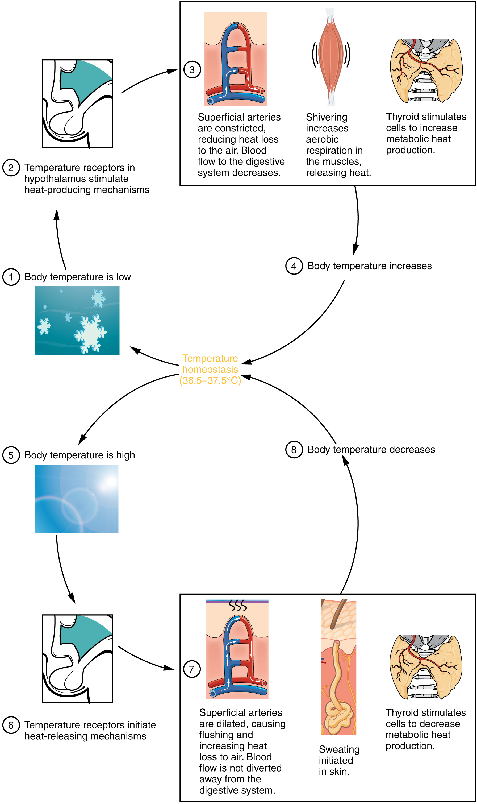

By the end of this section, you will be able to:
* Describe how the body regulates temperature
* Explain the significance of the metabolic rate

The body tightly regulates the body temperature through a process called **thermoregulation**{: data-type="term"}, in which the body can maintain its temperature within certain boundaries, even when the surrounding temperature is very different. The core temperature of the body remains steady at around 36.5–37.5 °C (or 97.7–99.5 °F). In the process of ATP production by cells throughout the body, approximately 60 percent of the energy produced is in the form of heat used to maintain body temperature. Thermoregulation is an example of negative feedback.

The hypothalamus in the brain is the master switch that works as a thermostat to regulate the body’s core temperature ([\[link\]](#fig-ch25_06_01)). If the temperature is too high, the hypothalamus can initiate several processes to lower it. These include increasing the circulation of the blood to the surface of the body to allow for the dissipation of heat through the skin and initiation of sweating to allow evaporation of water on the skin to cool its surface. Conversely, if the temperature falls below the set core temperature, the hypothalamus can initiate shivering to generate heat. The body uses more energy and generates more heat. In addition, thyroid hormone will stimulate more energy use and heat production by cells throughout the body. An environment is said to be **thermoneutral**{: data-type="term"} when the body does not expend or release energy to maintain its core temperature. For a naked human, this is an ambient air temperature of around 84 °F. If the temperature is higher, for example, when wearing clothes, the body compensates with cooling mechanisms. The body loses heat through the mechanisms of heat exchange.

 {: #fig-ch25_06_01 data-title="Hypothalamus Controls Thermoregulation "}

### Mechanisms of Heat Exchange

When the environment is not thermoneutral, the body uses four mechanisms of heat exchange to maintain homeostasis: conduction, convection, radiation, and evaporation. Each of these mechanisms relies on the property of heat to flow from a higher concentration to a lower concentration; therefore, each of the mechanisms of heat exchange varies in rate according to the temperature and conditions of the environment.

**Conduction**{: data-type="term"} is the transfer of heat by two objects that are in direct contact with one another. It occurs when the skin comes in contact with a cold or warm object. For example, when holding a glass of ice water, the heat from your skin will warm the glass and in turn melt the ice. Alternatively, on a cold day, you might warm up by wrapping your cold hands around a hot mug of coffee. Only about 3 percent of the body’s heat is lost through conduction.

**Convection**{: data-type="term"} is the transfer of heat to the air surrounding the skin. The warmed air rises away from the body and is replaced by cooler air that is subsequently heated. Convection can also occur in water. When the water temperature is lower than the body’s temperature, the body loses heat by warming the water closest to the skin, which moves away to be replaced by cooler water. The convection currents created by the temperature changes continue to draw heat away from the body more quickly than the body can replace it, resulting in hyperthermia. About 15 percent of the body’s heat is lost through convection.

**Radiation**{: data-type="term"} is the transfer of heat via infrared waves. This occurs between any two objects when their temperatures differ. A radiator can warm a room via radiant heat. On a sunny day, the radiation from the sun warms the skin. The same principle works from the body to the environment. About 60 percent of the heat lost by the body is lost through radiation.

**Evaporation**{: data-type="term"} is the transfer of heat by the evaporation of water. Because it takes a great deal of energy for a water molecule to change from a liquid to a gas, evaporating water (in the form of sweat) takes with it a great deal of energy from the skin. However, the rate at which evaporation occurs depends on relative humidity—more sweat evaporates in lower humidity environments. Sweating is the primary means of cooling the body during exercise, whereas at rest, about 20 percent of the heat lost by the body occurs through evaporation.

### Metabolic Rate

The **metabolic rate**{: data-type="term"} is the amount of energy consumed minus the amount of energy expended by the body. The **basal metabolic rate (BMR)**{: data-type="term"} describes the amount of daily energy expended by humans at rest, in a neutrally temperate environment, while in the postabsorptive state. It measures how much energy the body needs for normal, basic, daily activity. About 70 percent of all daily energy expenditure comes from the basic functions of the organs in the body. Another 20 percent comes from physical activity, and the remaining 10 percent is necessary for body thermoregulation or temperature control. This rate will be higher if a person is more active or has more lean body mass. As you age, the BMR generally decreases as the percentage of less lean muscle mass decreases.

### Chapter Review

Some of the energy from the food that is ingested is used to maintain the core temperature of the body. Most of the energy derived from the food is released as heat. The core temperature is kept around 36.5–37.5 °C (97.7–99.5 °F). This is tightly regulated by the hypothalamus in the brain, which senses changes in the core temperature and operates like a thermostat to increase sweating or shivering, or inducing other mechanisms to return the temperature to its normal range. The body can also gain or lose heat through mechanisms of heat exchange. Conduction transfers heat from one object to another through physical contact. Convection transfers heat to air or water. Radiation transfers heat via infrared radiation. Evaporation transfers heat as water changes state from a liquid to a gas.

### Review Questions

The body’s temperature is controlled by the \_\_\_\_\_\_\_\_. This temperature is always kept between \_\_\_\_\_\_\_\_.

1.  pituitary; 36.5–37.5 °C
2.  hypothalamus; 97.7–99.5 °F
3.  hypothalamus; 36.5–37.5 °F
4.  pituitary; 97.7–99.5 °F
{: data-number-style="lower-alpha"}

B

Fever increases the body temperature and can induce chills to help cool the temperature back down. What other mechanisms are in place to regulate the body temperature?

1.  shivering
2.  sweating
3.  erection of the hairs on the arms and legs
4.  all of the above
{: data-number-style="lower-alpha"}

D

The heat you feel on your chair when you stand up was transferred from your skin via \_\_\_\_\_\_\_\_.

1.  conduction
2.  convection
3.  radiation
4.  evaporation
{: data-number-style="lower-alpha"}

A

A crowded room warms up through the mechanism of \_\_\_\_\_\_\_\_.

1.  conduction
2.  convection
3.  radiation
4.  evaporation
{: data-number-style="lower-alpha"}

C

### Critical Thinking Questions

How does vasoconstriction help increase the core temperature of the body?

When blood flows to the outer layers of the skin or to the extremities, heat is lost to the environment by the mechanisms of conduction, convection, or radiation. This will cool the blood and the body. Vasoconstriction helps increase the core body temperature by preventing the flow of blood to the outer layer of the skin and outer parts of the extremities.

How can the ingestion of food increase the body temperature?

The ingestion of food stimulates digestion and processing of the carbohydrates, proteins, and fats. This breakdown of food triggers glycolysis, the Krebs cycle, the electron transport chain, fatty acid oxidation, lipogenesis, and amino acid oxidation to produce energy. Heat is a byproduct of those reactions.

### Glossary
{: data-type="glossary-title"}

basal metabolic rate (BMR)
: amount of energy expended by the body at rest
^

conduction
: transfer of heat through physical contact
^

convection
: transfer of heat between the skin and air or water
^

evaporation
: transfer of heat that occurs when water changes from a liquid to a gas
^

metabolic rate
: amount of energy consumed minus the amount of energy expended by the body
^

radiation
: transfer of heat via infrared waves
^

thermoneutral
: external temperature at which the body does not expend any energy for thermoregulation, about 84 °F
^

thermoregulation
: process of regulating the temperature of the body

