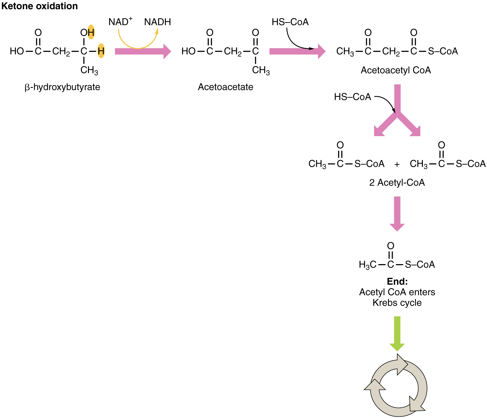
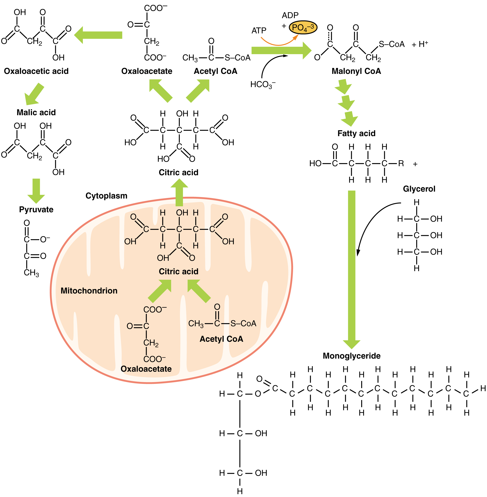

By the end of this section, you will be able to:
* Explain how energy can be derived from fat
* Explain the purpose and process of ketogenesis
* Describe the process of ketone body oxidation
* Explain the purpose and the process of lipogenesis

Fats (or triglycerides) within the body are ingested as food or synthesized by adipocytes or hepatocytes from carbohydrate precursors ([\[link\]](#fig-ch25_03_01)). Lipid metabolism entails the oxidation of fatty acids to either generate energy or synthesize new lipids from smaller constituent molecules. Lipid metabolism is associated with carbohydrate metabolism, as products of glucose (such as acetyl CoA) can be converted into lipids.

 _Is_Broken_Down_Into_Monoglycerides_(b).jpg> "A triglyceride molecule (a) breaks down into a monoglyceride (b)."){: #fig-ch25_03_01 data-title="Triglyceride Broken Down into a Monoglyceride "}

Lipid metabolism begins in the intestine where ingested **triglycerides**{: data-type="term"} are broken down into smaller chain fatty acids and subsequently into **monoglyceride molecules**{: data-type="term"} (see [\[link\]](#fig-ch25_03_01)**b**) by **pancreatic lipases**{: data-type="term"}, enzymes that break down fats after they are emulsified by **bile salts**{: data-type="term"}. When food reaches the small intestine in the form of chyme, a digestive hormone called **cholecystokinin (CCK)**{: data-type="term"} is released by intestinal cells in the intestinal mucosa. CCK stimulates the release of pancreatic lipase from the pancreas and stimulates the contraction of the gallbladder to release stored bile salts into the intestine. CCK also travels to the brain, where it can act as a hunger suppressant.

Together, the pancreatic lipases and bile salts break down triglycerides into free fatty acids. These fatty acids can be transported across the intestinal membrane. However, once they cross the membrane, they are recombined to again form triglyceride molecules. Within the intestinal cells, these triglycerides are packaged along with cholesterol molecules in phospholipid vesicles called **chylomicrons**{: data-type="term"} ([\[link\]](#fig-ch25_03_02)). The chylomicrons enable fats and cholesterol to move within the aqueous environment of your lymphatic and circulatory systems. Chylomicrons leave the enterocytes by exocytosis and enter the lymphatic system via lacteals in the villi of the intestine. From the lymphatic system, the chylomicrons are transported to the circulatory system. Once in the circulation, they can either go to the liver or be stored in fat cells (adipocytes) that comprise adipose (fat) tissue found throughout the body.

 . They function to carry these water-insoluble molecules from the intestine, through the lymphatic system, and into the bloodstream, which carries the lipids to adipose tissue for storage."){: #fig-ch25_03_02 data-title="Chylomicrons "}

### Lipolysis

To obtain energy from fat, triglycerides must first be broken down by hydrolysis into their two principal components, fatty acids and glycerol. This process, called **lipolysis**{: data-type="term"}, takes place in the cytoplasm. The resulting fatty acids are oxidized by β-oxidation into acetyl CoA, which is used by the Krebs cycle. The glycerol that is released from triglycerides after lipolysis directly enters the glycolysis pathway as DHAP. Because one triglyceride molecule yields three fatty acid molecules with as much as 16 or more carbons in each one, fat molecules yield more energy than carbohydrates and are an important source of energy for the human body. Triglycerides yield more than twice the energy per unit mass when compared to carbohydrates and proteins. Therefore, when glucose levels are low, triglycerides can be converted into acetyl CoA molecules and used to generate ATP through aerobic respiration.

The breakdown of fatty acids, called **fatty acid oxidation**{: data-type="term"} or **beta (β)-oxidation**{: data-type="term"}, begins in the cytoplasm, where fatty acids are converted into fatty acyl CoA molecules. This fatty acyl CoA combines with carnitine to create a fatty acyl carnitine molecule, which helps to transport the fatty acid across the mitochondrial membrane. Once inside the mitochondrial matrix, the fatty acyl carnitine molecule is converted back into fatty acyl CoA and then into acetyl CoA ([\[link\]](#fig-ch25_03_03)). The newly formed acetyl CoA enters the Krebs cycle and is used to produce ATP in the same way as acetyl CoA derived from pyruvate.

{: #fig-ch25_03_03 data-title="Breakdown of Fatty Acids "}

### Ketogenesis

If excessive acetyl CoA is created from the oxidation of fatty acids and the Krebs cycle is overloaded and cannot handle it, the acetyl CoA is diverted to create **ketone bodies**{: data-type="term"}. These ketone bodies can serve as a fuel source if glucose levels are too low in the body. Ketones serve as fuel in times of prolonged starvation or when patients suffer from uncontrolled diabetes and cannot utilize most of the circulating glucose. In both cases, fat stores are liberated to generate energy through the Krebs cycle and will generate ketone bodies when too much acetyl CoA accumulates.

In this ketone synthesis reaction, excess acetyl CoA is converted into **hydroxymethylglutaryl CoA (HMG CoA)**{: data-type="term"}. HMG CoA is a precursor of cholesterol and is an intermediate that is subsequently converted into β-hydroxybutyrate, the primary ketone body in the blood ([\[link\]](#fig-ch25_03_04)).

{: #fig-ch25_03_04 data-title="Ketogenesis "}

### Ketone Body Oxidation

Organs that have classically been thought to be dependent solely on glucose, such as the brain, can actually use ketones as an alternative energy source. This keeps the brain functioning when glucose is limited. When ketones are produced faster than they can be used, they can be broken down into CO2 and acetone. The acetone is removed by exhalation. One symptom of ketogenesis is that the patient’s breath smells sweet like alcohol. This effect provides one way of telling if a diabetic is properly controlling the disease. The carbon dioxide produced can acidify the blood, leading to diabetic ketoacidosis, a dangerous condition in diabetics.

Ketones oxidize to produce energy for the brain. **beta (β)-hydroxybutyrate**{: data-type="term"} is oxidized to acetoacetate and NADH is released. An HS-CoA molecule is added to acetoacetate, forming acetoacetyl CoA. The carbon within the acetoacetyl CoA that is not bonded to the CoA then detaches, splitting the molecule in two. This carbon then attaches to another free HS-CoA, resulting in two acetyl CoA molecules. These two acetyl CoA molecules are then processed through the Krebs cycle to generate energy ([\[link\]](#fig-ch25_03_05)).

{: #fig-ch25_03_05 data-title="Ketone Oxidation "}

### Lipogenesis

When glucose levels are plentiful, the excess acetyl CoA generated by glycolysis can be converted into fatty acids, triglycerides, cholesterol, steroids, and bile salts. This process, called **lipogenesis**{: data-type="term"}, creates lipids (fat) from the acetyl CoA and takes place in the cytoplasm of adipocytes (fat cells) and hepatocytes (liver cells). When you eat more glucose or carbohydrates than your body needs, your system uses acetyl CoA to turn the excess into fat. Although there are several metabolic sources of acetyl CoA, it is most commonly derived from glycolysis. Acetyl CoA availability is significant, because it initiates lipogenesis. Lipogenesis begins with acetyl CoA and advances by the subsequent addition of two carbon atoms from another acetyl CoA; this process is repeated until fatty acids are the appropriate length. Because this is a bond-creating anabolic process, ATP is consumed. However, the creation of triglycerides and lipids is an efficient way of storing the energy available in carbohydrates. Triglycerides and lipids, high-energy molecules, are stored in adipose tissue until they are needed.

Although lipogenesis occurs in the cytoplasm, the necessary acetyl CoA is created in the mitochondria and cannot be transported across the mitochondrial membrane. To solve this problem, pyruvate is converted into both oxaloacetate and acetyl CoA. Two different enzymes are required for these conversions. Oxaloacetate forms via the action of pyruvate carboxylase, whereas the action of pyruvate dehydrogenase creates acetyl CoA. Oxaloacetate and acetyl CoA combine to form citrate, which can cross the mitochondrial membrane and enter the cytoplasm. In the cytoplasm, citrate is converted back into oxaloacetate and acetyl CoA. Oxaloacetate is converted into malate and then into pyruvate. Pyruvate crosses back across the mitochondrial membrane to wait for the next cycle of lipogenesis. The acetyl CoA is converted into malonyl CoA that is used to synthesize fatty acids. [\[link\]](#fig-ch25_03_06) summarizes the pathways of lipid metabolism.

 {: #fig-ch25_03_06 data-title="Lipid Metabolism "}

### Chapter Review

Lipids are available to the body from three sources. They can be ingested in the diet, stored in the adipose tissue of the body, or synthesized in the liver. Fats ingested in the diet are digested in the small intestine. The triglycerides are broken down into monoglycerides and free fatty acids, then imported across the intestinal mucosa. Once across, the triglycerides are resynthesized and transported to the liver or adipose tissue. Fatty acids are oxidized through fatty acid or β-oxidation into two-carbon acetyl CoA molecules, which can then enter the Krebs cycle to generate ATP. If excess acetyl CoA is created and overloads the capacity of the Krebs cycle, the acetyl CoA can be used to synthesize ketone bodies. When glucose is limited, ketone bodies can be oxidized and used for fuel. Excess acetyl CoA generated from excess glucose or carbohydrate ingestion can be used for fatty acid synthesis or lipogenesis. Acetyl CoA is used to create lipids, triglycerides, steroid hormones, cholesterol, and bile salts. Lipolysis is the breakdown of triglycerides into glycerol and fatty acids, making them easier for the body to process.

### Review Questions

Lipids in the diet can be \_\_\_\_\_\_\_\_.

1.  broken down into energy for the body
2.  stored as triglycerides for later use
3.  converted into acetyl CoA
4.  all of the above
{: type="a"}

D

The gallbladder provides \_\_\_\_\_\_\_\_ that aid(s) in transport of lipids across the intestinal membrane.

1.  lipases
2.  cholesterol
3.  proteins
4.  bile salts
{: type="a"}

D

Triglycerides are transported by chylomicrons because \_\_\_\_\_\_\_\_.

1.  they cannot move easily in the blood stream because they are fat based, while the blood is water based
2.  they are too small to move by themselves
3.  the chylomicrons contain enzymes they need for anabolism
4.  they cannot fit across the intestinal membrane
{: type="a"}

A

Which molecule produces the most ATP?

1.  carbohydrates
2.  FADH2
3.  triglycerides
4.  NADH
{: type="a"}

C

Which molecules can enter the Krebs cycle?

1.  chylomicrons
2.  acetyl CoA
3.  monoglycerides
4.  ketone bodies
{: type="a"}

B

Acetyl CoA can be converted to all of the following except \_\_\_\_\_\_\_\_.

1.  ketone bodies
2.  fatty acids
3.  polysaccharides
4.  triglycerides
{: type="a"}

C

### Critical Thinking Questions

Discuss how carbohydrates can be stored as fat.

Carbohydrates are converted into pyruvate during glycolysis. This pyruvate is converted into acetyl CoA and proceeds through the Krebs cycle. When excess acetyl CoA is produced that cannot be processed through the Krebs cycle, the acetyl CoA is converted into triglycerides and fatty acids to be stored in the liver and adipose tissue.

If a diabetic’s breath smells like alcohol, what could this mean?

If diabetes is uncontrolled, the glucose in the blood is not being taken up and processed by the cells. Although blood glucose levels are high, there is no glucose available to the cells to be converted into energy. Because glucose is lacking, the body turns to other energy sources, including ketones. A side effect of using ketones as fuel is a sweet alcohol smell on the breath.

### Glossary
{: data-type="glossary-title"}

beta (β)-hydroxybutyrate
: primary ketone body produced in the body
^

beta (β)-oxidation
: fatty acid oxidation
^

bile salts
: salts that are released from the liver in response to lipid ingestion and surround the insoluble triglycerides to aid in their conversion to monoglycerides and free fatty acids
^

cholecystokinin (CCK)
: hormone that stimulates the release of pancreatic lipase and the contraction of the gallbladder to release bile salts
^

chylomicrons
: vesicles containing cholesterol and triglycerides that transport lipids out of the intestinal cells and into the lymphatic and circulatory systems
^

fatty acid oxidation
: breakdown of fatty acids into smaller chain fatty acids and acetyl CoA
^

hydroxymethylglutaryl CoA (HMG CoA)
: molecule created in the first step of the creation of ketone bodies from acetyl CoA
^

ketone bodies
: alternative source of energy when glucose is limited, created when too much acetyl CoA is created during fatty acid oxidation
^

lipogenesis
: synthesis of lipids that occurs in the liver or adipose tissues
^

lipolysis
: breakdown of triglycerides into glycerol and fatty acids
^

monoglyceride molecules
: lipid consisting of a single fatty acid chain attached to a glycerol backbone
^

pancreatic lipases
: enzymes released from the pancreas that digest lipids in the diet
^

triglycerides
: lipids, or fats, consisting of three fatty acid chains attached to a glycerol backbone

