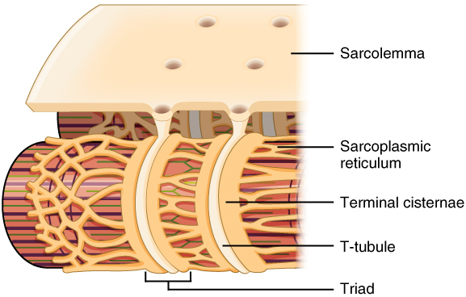

By the end of this section, you will be able to:

* Describe the layers of connective tissues packaging skeletal muscle
* Explain how muscles work with tendons to move the body
* Identify areas of the skeletal muscle fibers
* Describe excitation-contraction coupling

The best-known feature of skeletal muscle is its ability to contract and
cause movement. Skeletal muscles act not only to produce movement but
also to stop movement, such as resisting gravity to maintain posture.
Small, constant adjustments of the skeletal muscles are needed to hold a
body upright or balanced in any position. Muscles also prevent excess
movement of the bones and joints, maintaining skeletal stability and
preventing skeletal structure damage or deformation. Joints can become
misaligned or dislocated entirely by pulling on the associated bones;
muscles work to keep joints stable. Skeletal muscles are located
throughout the body at the openings of internal tracts to control the
movement of various substances. These muscles allow functions, such as
swallowing, urination, and defecation, to be under voluntary control.
Skeletal muscles also protect internal organs (particularly abdominal
and pelvic organs) by acting as an external barrier or shield to
external trauma and by supporting the weight of the organs.
{: #fs-id2019483}

Skeletal muscles contribute to the maintenance of homeostasis in the
body by generating heat. Muscle contraction requires energy, and when
ATP is broken down, heat is produced. This heat is very noticeable
during exercise, when sustained muscle movement causes body temperature
to rise, and in cases of extreme cold, when shivering produces random
skeletal muscle contractions to generate heat.
{: #fs-id1723952}

Each skeletal muscle is an organ that consists of various integrated
tissues. These tissues include the skeletal muscle fibers, blood
vessels, nerve fibers, and connective tissue. Each skeletal muscle has
three layers of connective tissue (called “mysia”) that enclose it and
provide structure to the muscle as a whole, and also compartmentalize
the muscle fibers within the muscle ([\[link\]](#fig-ch10_02_01){:
.autogenerated-content}). Each muscle is wrapped in a sheath of dense,
irregular connective tissue called the epimysium, which allows a muscle to contract and
move powerfully while maintaining its structural integrity. The
epimysium also separates muscle from other tissues and organs in the
area, allowing the muscle to move independently.
{: #fs-id1989759}

<figure id="fig-ch10_02_01">

The Three Connective Tissue Layers

<figcaption>
Bundles of muscle fibers, called fascicles, are covered by the
perimysium. Muscle fibers are covered by the endomysium.
</figcaption>
 .jpg>){:
data-media-type="image/jpg" width="420"} 
</figure>
Inside each skeletal muscle, muscle fibers are organized into individual
bundles, each called a fascicle, by a
middle layer of connective tissue called the perimysium. This fascicular organization is
common in muscles of the limbs; it allows the nervous system to trigger
a specific movement of a muscle by activating a subset of muscle fibers
within a bundle, or fascicle of the muscle. Inside each fascicle, each
muscle fiber is encased in a thin connective tissue layer of collagen
and reticular fibers called the endomysium. The endomysium contains the
extracellular fluid and nutrients to support the muscle fiber. These
nutrients are supplied via blood to the muscle tissue.
{: #fs-id2278076}

In skeletal muscles that work with tendons to pull on bones, the
collagen in the three tissue layers (the mysia) intertwines with the
collagen of a tendon. At the other end of the tendon, it fuses with the
periosteum coating the bone. The tension created by contraction of the
muscle fibers is then transferred though the mysia, to the tendon, and
then to the periosteum to pull on the bone for movement of the skeleton.
In other places, the mysia may fuse with a broad, tendon-like sheet
called an aponeurosis, or to fascia, the
connective tissue between skin and bones. The broad sheet of connective
tissue in the lower back that the latissimus dorsi muscles (the “lats”)
fuse into is an example of an aponeurosis.
{: #fs-id2052461}

Every skeletal muscle is also richly supplied by blood vessels for
nourishment, oxygen delivery, and waste removal. In addition, every
muscle fiber in a skeletal muscle is supplied by the axon branch of a
somatic motor neuron, which signals the fiber to contract. Unlike
cardiac and smooth muscle, the only way to functionally contract a
skeletal muscle is through signaling from the nervous system.
{: #fs-id1841712}

<section data-depth="1" id="fs-id1374544" markdown="1">
# Skeletal Muscle Fibers
{: data-type="title"}

Because skeletal muscle cells are long and cylindrical, they are
commonly referred to as muscle fibers. Skeletal muscle fibers can be
quite large for human cells, with diameters up to 100 *μ*{:
data-effect="italics"}m and lengths up to 30 cm (11.8 in) in the
Sartorius of the upper leg. During early development, embryonic
myoblasts, each with its own nucleus, fuse with up to hundreds of other
myoblasts to form the multinucleated skeletal muscle fibers. Multiple
nuclei mean multiple copies of genes, permitting the production of the
large amounts of proteins and enzymes needed for muscle contraction.
{: #fs-id2122814}

Some other terminology associated with muscle fibers is rooted in the
Greek *sarco*{: data-effect="italics"}, which means “flesh.” The plasma
membrane of muscle fibers is called the sarcolemma, the cytoplasm is referred to as
sarcoplasm, and the specialized smooth
endoplasmic reticulum, which stores, releases, and retrieves calcium
ions (Ca++) is called the sarcoplasmic
reticulum (SR) ([\[link\]](#fig-ch10_02_02){:
.autogenerated-content}). As will soon be described, the functional unit
of a skeletal muscle fiber is the sarcomere, a highly organized
arrangement of the contractile myofilaments actin (thin filament) and myosin (thick filament), along with other
support proteins.
{: #fs-id2125518}

<figure id="fig-ch10_02_02">

Muscle Fiber

<figcaption>
A skeletal muscle fiber is surrounded by a plasma membrane called the
sarcolemma, which contains sarcoplasm, the cytoplasm of muscle cells. A
muscle fiber is composed of many fibrils, which give the cell its
striated appearance.
</figcaption>

.jpg>){:
data-media-type="image/jpg" width="420"} 
</figure>
</section>
<section data-depth="1" id="fs-id1040329" markdown="1">
# The Sarcomere
{: data-type="title"}

The striated appearance of skeletal muscle fibers is due to the
arrangement of the myofilaments of actin and myosin in sequential order
from one end of the muscle fiber to the other. Each packet of these
microfilaments and their regulatory proteins, troponin and tropomyosin (along with other proteins) is
called a sarcomere.
{: #fs-id2141504}

 {:
data-media-type="image/png" width="120"} 
Watch this [video][1] to learn more about macro- and microstructures of
skeletal muscles. (a) What are the names of the “junction points”
between sarcomeres? (b) What are the names of the “subunits” within the
myofibrils that run the length of skeletal muscle fibers? (c) What is
the “double strand of pearls” described in the video? (d) What gives a
skeletal muscle fiber its striated appearance?
{: #fs-id2155405}

The sarcomere is the functional unit of the muscle fiber. The sarcomere
itself is bundled within the myofibril that runs the entire length of
the muscle fiber and attaches to the sarcolemma at its end. As
myofibrils contract, the entire muscle cell contracts. Because
myofibrils are only approximately 1.2 *μ*{: data-effect="italics"}m in
diameter, hundreds to thousands (each with thousands of sarcomeres) can
be found inside one muscle fiber. Each sarcomere is approximately 2
*μ*{: data-effect="italics"}m in length with a three-dimensional
cylinder-like arrangement and is bordered by structures called Z-discs
(also called Z-lines, because pictures are two-dimensional), to which
the actin myofilaments are anchored ([\[link\]](#fig-ch10_02_03){:
.autogenerated-content}). Because the actin and its troponin-tropomyosin
complex (projecting from the Z-discs toward the center of the sarcomere)
form strands that are thinner than the myosin, it is called the thin filament of the sarcomere. Likewise,
because the myosin strands and their multiple heads (projecting from the
center of the sarcomere, toward but not all to way to, the Z-discs) have
more mass and are thicker, they are called the thick filament of the sarcomere.
{: #fs-id2044502}

<figure id="fig-ch10_02_03">

The Sarcomere

<figcaption>
The sarcomere, the region from one Z-line to the next Z-line, is the
functional unit of a skeletal muscle fiber.
</figcaption>
 {:
data-media-type="image/jpg" width="390"} 
</figure>
</section>
<section data-depth="1" id="fs-id1990056" markdown="1">
# The Neuromuscular Junction
{: data-type="title"}

Another specialization of the skeletal muscle is the site where a motor
neuron’s terminal meets the muscle fiber—called the neuromuscular junction (NMJ). This is where the
muscle fiber first responds to signaling by the motor neuron. Every
skeletal muscle fiber in every skeletal muscle is innervated by a motor
neuron at the NMJ. Excitation signals from the neuron are the only way
to functionally activate the fiber to contract.
{: #fs-id1854958}

 {:
data-media-type="image/png" width="120"} 
Every skeletal muscle fiber is supplied by a motor neuron at the NMJ.
Watch this [video][2] to learn more about what happens at the NMJ. (a)
What is the definition of a motor unit? (b) What is the structural and
functional difference between a large motor unit and a small motor unit?
(c) Can you give an example of each? (d) Why is the neurotransmitter
acetylcholine degraded after binding to its receptor?
{: #fs-id1899987}

</section>
<section data-depth="1" id="fs-id1909043" markdown="1">
# Excitation-Contraction Coupling
{: data-type="title"}

All living cells have membrane potentials, or electrical gradients
across their membranes. The inside of the membrane is usually around -60
to -90 mV, relative to the outside. This is referred to as a cell’s
membrane potential. Neurons and muscle cells can use their membrane
potentials to generate electrical signals. They do this by controlling
the movement of charged particles, called ions, across their membranes
to create electrical currents. This is achieved by opening and closing
specialized proteins in the membrane called ion channels. Although the
currents generated by ions moving through these channel proteins are
very small, they form the basis of both neural signaling and muscle
contraction.
{: #fs-id2252260}

Both neurons and skeletal muscle cells are electrically excitable,
meaning that they are able to generate action potentials. An action
potential is a special type of electrical signal that can travel along a
cell membrane as a wave. This allows a signal to be transmitted quickly
and faithfully over long distances.
{: #fs-id1421868}

Although the term excitation-contraction
coupling confuses or scares some students, it comes down to this:
for a skeletal muscle fiber to contract, its membrane must first be
“excited”—in other words, it must be stimulated to fire an action
potential. The muscle fiber action potential, which sweeps along the
sarcolemma as a wave, is “coupled” to the actual contraction through the
release of calcium ions (Ca++) from the SR. Once released,
the Ca++ interacts with the shielding proteins, forcing them
to move aside so that the actin-binding sites are available for
attachment by myosin heads. The myosin then pulls the actin filaments
toward the center, shortening the muscle fiber.
{: #eip-362}

In skeletal muscle, this sequence begins with signals from the somatic
motor division of the nervous system. In other words, the “excitation”
step in skeletal muscles is always triggered by signaling from the
nervous system ([\[link\]](#fig-ch10_02_04){: .autogenerated-content}).
{: #eip-12}

<figure id="fig-ch10_02_04">

Motor End-Plate and Innervation

<figcaption>
At the NMJ, the axon terminal releases ACh. The motor end-plate is the
location of the ACh-receptors in the muscle fiber sarcolemma. When ACh
molecules are released, they diffuse across a minute space called the
synaptic cleft and bind to the receptors.
</figcaption>

{:
data-media-type="image/jpg" width="380"} 
</figure>
The motor neurons that tell the skeletal muscle fibers to contract
originate in the spinal cord, with a smaller number located in the
brainstem for activation of skeletal muscles of the face, head, and
neck. These neurons have long processes, called axons, which are
specialized to transmit action potentials long distances— in this case,
all the way from the spinal cord to the muscle itself (which may be up
to three feet away). The axons of multiple neurons bundle together to
form nerves, like wires bundled together in a cable.
{: #fs-id2019473}

Signaling begins when a neuronal action
potential travels along the axon of a motor neuron, and then
along the individual branches to terminate at the NMJ. At the NMJ, the
axon terminal releases a chemical messenger, or neurotransmitter, called acetylcholine (ACh). The ACh molecules diffuse
across a minute space called the synaptic
cleft and bind to ACh receptors located within the motor end-plate of the sarcolemma on the other
side of the synapse. Once ACh binds, a channel in the ACh receptor opens
and positively charged ions can pass through into the muscle fiber,
causing it to depolarize, meaning that the
membrane potential of the muscle fiber becomes less negative (closer to
zero.)
{: #fs-id2023666}

As the membrane depolarizes, another set of ion channels called voltage-gated sodium channels are triggered to
open. Sodium ions enter the muscle fiber, and an action potential
rapidly spreads (or “fires”) along the entire membrane to initiate
excitation-contraction coupling.
{: #eip-536}

Things happen very quickly in the world of excitable membranes (just
think about how quickly you can snap your fingers as soon as you decide
to do it). Immediately following depolarization of the membrane, it
repolarizes, re-establishing the negative membrane potential. Meanwhile,
the ACh in the synaptic cleft is degraded by the enzyme
acetylcholinesterase (AChE) so that the ACh cannot rebind to a receptor
and reopen its channel, which would cause unwanted extended muscle
excitation and contraction.
{: #fs-id1374666}

Propagation of an action potential along the sarcolemma is the
excitation portion of excitation-contraction coupling. Recall that this
excitation actually triggers the release of calcium ions
(Ca++) from its storage in the cell’s SR. For the action
potential to reach the membrane of the SR, there are periodic
invaginations in the sarcolemma, called T-tubules (“T” stands for “transverse”). You
will recall that the diameter of a muscle fiber can be up to 100 *μ*{:
data-effect="italics"}m, so these T-tubules ensure that the membrane can
get close to the SR in the sarcoplasm. The arrangement of a T-tubule
with the membranes of SR on either side is called a triad ([\[link\]](#fig-ch10_02_05){:
.autogenerated-content}). The triad surrounds the cylindrical structure
called a myofibril, which contains actin
and myosin.
{: #fs-id1698692}

<figure id="fig-ch10_02_05">

The T-tubule

<figcaption>
Narrow T-tubules permit the conduction of electrical impulses. The SR
functions to regulate intracellular levels of calcium. Two terminal
cisternae (where enlarged SR connects to the T-tubule) and one T-tubule
comprise a triad—a “threesome” of membranes, with those of SR on two
sides and the T-tubule sandwiched between them.
</figcaption>

{:
data-media-type="image/jpg" width="350"} 
</figure>
The T-tubules carry the action potential into the interior of the cell,
which triggers the opening of calcium channels in the membrane of the
adjacent SR, causing Ca++ to diffuse out of the SR and into
the sarcoplasm. It is the arrival of Ca++ in the sarcoplasm
that initiates contraction of the muscle fiber by its contractile units,
or sarcomeres.
{: #fs-id1361245}

</section>
<section data-depth="1" id="fs-id1976291" class="summary" markdown="1">
# Chapter Review
{: data-type="title"}

Skeletal muscles contain connective tissue, blood vessels, and nerves.
There are three layers of connective tissue: epimysium, perimysium, and
endomysium. Skeletal muscle fibers are organized into groups called
fascicles. Blood vessels and nerves enter the connective tissue and
branch in the cell. Muscles attach to bones directly or through tendons
or aponeuroses. Skeletal muscles maintain posture, stabilize bones and
joints, control internal movement, and generate heat.
{: #fs-id2019720}

Skeletal muscle fibers are long, multinucleated cells. The membrane of
the cell is the sarcolemma; the cytoplasm of the cell is the sarcoplasm.
The sarcoplasmic reticulum (SR) is a form of endoplasmic reticulum.
Muscle fibers are composed of myofibrils. The striations are created by
the organization of actin and myosin resulting in the banding pattern of
myofibrils.
{: #fs-id1485386}

</section>
<section data-depth="1" id="fs-id1421675" class="interactive-exercise" markdown="1">
# Interactive Link Questions
{: data-type="title"}

Watch this [video][1] to learn more about macro- and microstructures of
skeletal muscles. (a) What are the names of the “junction points”
between sarcomeres? (b) What are the names of the “subunits” within the
myofibrils that run the length of skeletal muscle fibers? (c) What is
the “double strand of pearls” described in the video? (d) What gives a
skeletal muscle fiber its striated appearance?
{: #fs-id1761464}

(a) Z-lines. (b) Sarcomeres. (c) This is the arrangement of the actin
and myosin filaments in a sarcomere. (d) The alternating strands of
actin and myosin filaments.
{: #fs-id2305509}

Every skeletal muscle fiber is supplied by a motor neuron at the NMJ.
Watch this [video][2] to learn more about what happens at the
neuromuscular junction. (a) What is the definition of a motor unit? (b)
What is the structural and functional difference between a large motor
unit and a small motor unit? Can you give an example of each? (c) Why is
the neurotransmitter acetylcholine degraded after binding to its
receptor?
{: #fs-id2018304}

(a) It is the number of skeletal muscle fibers supplied by a single
motor neuron. (b) A large motor unit has one neuron supplying many
skeletal muscle fibers for gross movements, like the Temporalis muscle,
where 1000 fibers are supplied by one neuron. A small motor has one
neuron supplying few skeletal muscle fibers for very fine movements,
like the extraocular eye muscles, where six fibers are supplied by one
neuron. (c) To avoid prolongation of muscle contraction.
{: #fs-id1699664}

</section>
<section data-depth="1" id="fs-id1405016" class="multiple-choice" markdown="1">
# Review Questions
{: data-type="title"}

The correct order for the smallest to the largest unit of organization
in muscle tissue is ________.
{: #fs-id1216217}

1.  fascicle, filament, muscle fiber, myofibril
2.  filament, myofibril, muscle fiber, fascicle
3.  muscle fiber, fascicle, filament, myofibril
4.  myofibril, muscle fiber, filament, fascicle
{: #fs-id1354803 data-number-style="lower-alpha"}

B
{: #fs-id1322719}

Depolarization of the sarcolemma means ________.
{: #fs-id1383243}

1.  the inside of the membrane has become less negative as sodium ions
    accumulate
2.  the outside of the membrane has become less negative as sodium ions
    accumulate
3.  the inside of the membrane has become more negative as sodium ions
    accumulate
4.  the sarcolemma has completely lost any electrical charge
{: #fs-id1405502 data-number-style="lower-alpha"}

A
{: #fs-id2095935}

</section>
<section data-depth="1" id="fs-id1352482" class="free-response" markdown="1">
# Critical Thinking Questions
{: data-type="title"}

What would happen to skeletal muscle if the epimysium were destroyed?
{: #fs-id1373733}

Muscles would lose their integrity during powerful movements, resulting
in muscle damage.
{: #fs-id1918216}

Describe how tendons facilitate body movement.
{: #fs-id1978107}

When a muscle contracts, the force of movement is transmitted through
the tendon, which pulls on the bone to produce skeletal movement.
{: #fs-id2170541}

What are the five primary functions of skeletal muscle?
{: #fs-id1881662}

Produce movement of the skeleton, maintain posture and body position,
support soft tissues, encircle openings of the digestive, urinary, and
other tracts, and maintain body temperature.
{: #fs-id1374360}

What are the opposite roles of voltage-gated sodium channels and
voltage-gated potassium channels?
{: #fs-id2175947}

The opening of voltage-gated sodium channels, followed by the influx of
Na+, transmits an Action Potential after the membrane has
sufficiently depolarized. The delayed opening of potassium channels
allows K+ to exit the cell, to repolarize the membrane.
{: #fs-id1477115}

</section>

[1]: http://openstaxcollege.org/l/micromacro
[2]: http://openstaxcollege.org/l/skelmuscfiber

