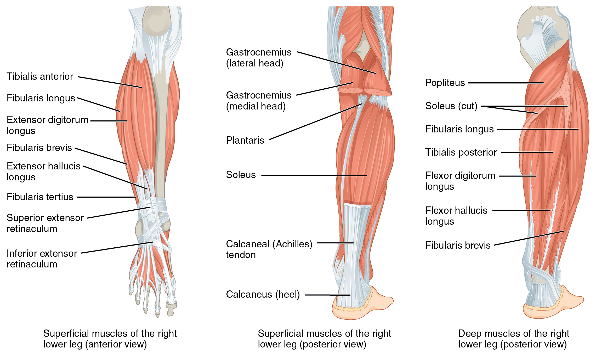

By the end of this section, you will be able to:
* Identify the appendicular muscles of the pelvic girdle and lower limb
* Identify the movement and function of the pelvic girdle and lower limb

The appendicular muscles of the lower body position and stabilize the
pelvic girdle, which serves as a
foundation for the lower limbs. Comparatively, there is much more
movement at the pectoral girdle than at the pelvic girdle. There is very
little movement of the pelvic girdle because of its connection with the
sacrum at the base of the axial skeleton. The pelvic girdle is less
range of motion because it was designed to stabilize and support the
body.

# Muscles of the Thigh

What would happen if the pelvic girdle, which attaches the lower limbs
to the torso, were capable of the same range of motion as the pectoral
girdle? For one thing, walking would expend more energy if the heads of
the femurs were not secured in the acetabula of the pelvis. The body’s
center of gravity is in the area of the pelvis. If the center of gravity
were not to remain fixed, standing up would be difficult as well.
Therefore, what the leg muscles lack in range of motion and versatility,
they make up for in size and power, facilitating the body’s
stabilization, posture, and movement.

## Gluteal Region Muscles That Move the Femur

Most muscles that insert on the femur (the thigh bone) and move it,
originate on the pelvic girdle. The psoas
major and iliacus make up the iliopsoas group. Some of the largest and most
powerful muscles in the body are the gluteal muscles or gluteal group. The gluteus maximus is the largest; deep to the
gluteus maximus is the gluteus medius, and
deep to the gluteus medius is the gluteus
minimus, the smallest of the trio ([\[link\]](#fig-ch11_06_01){:
.autogenerated-content} and [\[link\]](#fig-ch11_06_02){:
.autogenerated-content}).

{: #fig-ch11_06_01 data-media-type="image/jpg" data-title="Hip and Thigh Muscles "}

![This table describes gluteal region muscles that move the femur. These muscles make up the iliopsoas group. The psoas major raises the knee at the hip, as if performing a knee attack; it also assists the lateral rotators in twisting the thigh (and lower leg) outward, and assists with bending over and maintaining posture. It originates in the lumbar vertebrae (L1 through L5) and thoracic vertebra (T12). The iliacus raises the knee at the hip, as if performing a knee attack; it also assists the lateral rotators in twisting the thigh (and lower leg) outward, and assists with bending over and maintaining posture. It originates in the iliac fossa, iliac crest, and lateral sacrum. These muscles make up the gluteal group. The gluteous maximus lowers the knee and moves the thigh back, as when getting ready to kick a ball. It originates in the dorsal ilium, sacrum, and coccyx. The gluteus medius opens the thigh, as when doing a split. It originates in the lateral surface of the ilium. The gluteus minimus brings the thighs back together. It originates in the external surface of the ilium. The tensor fascia lata assists with raising the knee at the hip and opening the thighs; it also maintains posture by stabilizing the iliotibial track, which connects to the knee. It originates in the anterior aspect of the iliac crest and the anterior superior iliac spine. These muscles make up the lateral rotators. The piriformis twists the thigh (and lower leg) outward; it also maintains posture by stabilizing the hip joint. It originates in the anterolateral surface of the sacrum. The obturator internus twists the thigh (and lower leg) outward; it also maintains posture by stabilizing the hip joint. It originates in the inner surface of the obturator membrane, the greater sciatic notch, and the margins of the obturator foramen. The superior gemellus twists the thigh (and lower leg) outward; it also maintains posture by stabilizing the hip joint. It originates in the ischial spine. The inferior gemellus twists the thigh (and lower leg) outward; it also maintains posture by stabilizing the hip joint. It originates in the ischial tuberosity. The quatratus femoris twists the thigh (and lower leg) outward; it also maints posture by stabilizing the hip joint. It originates in the ischial tuberosity. These muscles are adductors. The adductor longus brings the thighs back together; it also assists with raising the knee. It originates in the pubis near the pubic symphysis. The adductor brevis brings the thighs back together; it also assists with raising the knee. It originates in teh body of the pubis and in the inferior ramus of the pubis. The adductor magnus brings the thighs back together; it also assists with raising the knee and moving the thigh back. It originates in the ischial rami, the pubic rami, and the ischial tuberosity. The pectineus opens the thigh; it also assists with raising the knee and turning the thigh (and lower leg) inward. It originates in the pectineal line of the pubis.](../resources/1132_Gluteal_Region_Muscles_that_Move_the_Femur.jpg){: #fig-ch11_06_02 data-media-type="image/jpg" data-title="Gluteal Region Muscles That Move the Femur "}

The tensor fascia lata is a thick,
squarish muscle in the superior aspect of the lateral thigh. It acts as
a synergist of the gluteus medius and iliopsoas in flexing and abducting
the thigh. It also helps stabilize the lateral aspect of the knee by
pulling on the iliotibial tract (band),
making it taut. Deep to the gluteus maximus, the piriformis, obturator
internus, obturator externus, superior gemellus, inferior gemellus, and quadratus femoris laterally rotate the femur at
the hip.

The adductor longus, adductor brevis, and adductor magnus can both medially and laterally
rotate the thigh depending on the placement of the foot. The adductor
longus flexes the thigh, whereas the adductor magnus extends it. The
pectineus adducts and flexes the femur at
the hip as well. The pectineus is located in the femoral triangle, which is formed at the
junction between the hip and the leg and also includes the femoral
nerve, the femoral artery, the femoral vein, and the deep inguinal lymph
nodes.

## Thigh Muscles That Move the Femur, Tibia, and Fibula

Deep fascia in the thigh separates it into medial, anterior, and
posterior compartments (see [\[link\]](#fig-ch11_06_01){:
.autogenerated-content} and [\[link\]](#fig-ch11_06_03){:
.autogenerated-content}). The muscles in the medial compartment of the thigh are responsible
for adducting the femur at the hip. Along with the adductor longus,
adductor brevis, adductor magnus, and pectineus, the strap-like gracilis adducts the thigh in addition to
flexing the leg at the knee.

![This table describes the thigh muscles that move the femur, tibia, and fibula. The medial compartment of the thigh consists of the gracilis, which moves the back of the lower legs up toward the buttocks, as when kneeling; it also assists in opening the thighs. It originates in the inferior ramus, the body of the pubis, and the ischial ramus. These muscles, the quadriceps femoris group, make up the anterior compartment of the thigh. The rectus femoris moves the lower leg out in front of the body, as when kicking; it also assists in raising the knee. It originates in the anterior inferior iliac spine and in the superior margin of the acetabulum. The vastus lateralis moves the lower leg out in front of the body, as when kicking. It originates in the greater trochanter, the intertrochanteric line, and the linea aspera. The vastus medialis moves the lower leg out in front of the body, as when kicking. It originates in the linea aspera and the intertrochanteric line. The vastus intermedius moves the lower leg out in front of the body, as when kicking. It originates in the proximal femur shaft. The sartorius moves the back of the lower legs up and back toward the buttocks, as when kneeling; it also assists in moving the thigh diagonally upward and outward as when mounting a bike. It originates in the anterior superior iliac spine. These muscles, the hamstring group, make up the posterior compartment of the thigh. The biceps femoris moves the back of the lower leg up and back toward the buttocks, as when kneeling; it also moves the thigh down and back and twists the thigh (and lower leg) outward. It originates in the ischial tuberosity, linea aspera, and distal femur. The semitendinosus moves the back of the lower legs up toward the buttocks, as when kneeling; it also moves the thigh down and back and twists the thigh (and lower leg) inward. It originates in the ischial tuberosity. The semi-membranosus moves the back of the lower legs up and back toward the buttocks, as when kneeling; it also moves the thigh down and back and twists the thigh (and lower leg) inward. It originates in the ischial tuberosity.](../resources/1133_Thigh_Muscles_that_Moves_the_Femur_Tibia_and_Fibula.jpg){: #fig-ch11_06_03 data-media-type="image/jpg" data-title="Thigh Muscles That Move the Femur, Tibia, and Fibula "}

The muscles of the anterior compartment of the
thigh flex the thigh and extend the leg. This compartment
contains the quadriceps femoris group,
which actually comprises four muscles that extend and stabilize the
knee. The rectus femoris is on the
anterior aspect of the thigh, the vastus
lateralis is on the lateral aspect of the thigh, the vastus medialis is on the medial aspect of the
thigh, and the vastus intermedius is
between the vastus lateralis and vastus medialis and deep to the rectus
femoris. The tendon common to all four is the quadriceps tendon (patellar tendon), which
inserts into the patella and continues below it as the patellar ligament. The patellar ligament
attaches to the tibial tuberosity. In addition to the quadriceps
femoris, the sartorius is a band-like
muscle that extends from the anterior superior iliac spine to the medial
side of the proximal tibia. This versatile muscle flexes the leg at the
knee and flexes, abducts, and laterally rotates the leg at the hip. This
muscle allows us to sit cross-legged.

The posterior compartment of the thigh
includes muscles that flex the leg and extend the thigh. The three long
muscles on the back of the knee are the hamstring
group, which flexes the knee. These are the biceps femoris, semitendinosus, and semimembranosus. The tendons of these muscles
form the popliteal fossa, the
diamond-shaped space at the back of the knee.

# Muscles That Move the Feet and Toes

Similar to the thigh muscles, the muscles of the leg are divided by deep
fascia into compartments, although the leg has three: anterior, lateral,
and posterior ([\[link\]](#fig-ch11_06_04){: .autogenerated-content} and
[\[link\]](#fig-ch11_06_05){: .autogenerated-content}).

{: #fig-ch11_06_04 data-media-type="image/jpg" data-title="Muscles of the Lower Leg "}

![This tables describes the muscles that move the feet and toes. These muscles make up the anterior compartment of the leg. The tibialis anterior raises the sole of the foot off the ground, as when preparing to foot-tap; it also bends the inside of the foot upwards, as when catching your balance while falling laterally toward the opposite side as the balancing foot. It originates in the lateral condyle and upper tibial shaft and in the interosseous membrane. The extensor hallucis longus raises the sole of the foot off the ground, as when preparing to foot-tap; it also extends the big toe. It originates in the anteromedial fibula shaft and interosseous membrane. The extensor digitorum longus raises the sole of the foot off the ground, as when preparing to foot-tap; it also extends the toes. It originates in the lateral condyle of the tibia, the proximal portion of the fibula, and the interosseous membrane. These muscles make up the lateral compartment of the leg. The fibularis longus lowers the sole of the foot to the ground, as when foot-tapping or jumping; it also bends the inside of the foot downwards, as when catching your balance while falling laterally toward the same side as the balancing foot. It originates in the upper portion of the lateral fibula. The fibularis (peroneus) brevis lowers the side of the foot to the ground, as when foot-tapping or jumping; it also bends the inside of the foot downward, as when catching your balance while falling laterally toward the same side as the balancing foot. It originates in the distal fibula shaft. These superficial muscles make up the posterior compartment of the leg. The gastrocnemius lowers the sole of the foot to the ground, as when foot-tapping or jumping; it also assists in moving the back of the lower legs up and back toward the buttocks. It originates in the medial and lateral condyles of the femur. The soleus lowers the sole of the foot the ground, as when foot-tapping or jumping; it also maintains posture while walking. It originates in the superior tibia, fibula, and interosseous membrane. The plantaris lowers the sole of the foot to the ground, as when foot-tapping or jumping; it also assists in moving the back of the lower legs up and back toward the buttocks. It originates in the posterior femur above the lateral condyle. The tibialis posterior lowers the sole of the foot to the ground, as when foot-tapping or jumping. It originates in the superior tibia and fibula and in the interosseous membrane. These deep muscles also make up the posterior compartment of the leg. The popliteus moves the back of the lower legs up and back toward the buttocks; it also assists in rotation of the leg at the knee and thigh. It originates in the lateral condyle of the femur and the lateral meniscus. The flexor digitorum longus lowers the sole of the foot to the ground, as when foot-tapping or jumping; it also bends the inside of the foot upward and flexes the toes. It originates in the posterior tibia. The flexor hallicis longus flexes the big toe. It originates in the midshaft of the fibula and in the interosseous membrane.](../resources/1134_Muscles_that_Moves_the_Feet_and_Toes.jpg){: #fig-ch11_06_05 data-media-type="image/jpg" data-title="Muscles That Move the Feet and Toes "}

The muscles in the anterior compartment of the
leg\: the tibialis anterior, a long
and thick muscle on the lateral surface of the tibia, the extensor hallucis longus, deep under it, and the
extensor digitorum longus, lateral to it,
all contribute to raising the front of the foot when they contract. The
fibularis tertius, a small muscle that
originates on the anterior surface of the fibula, is associated with the
extensor digitorum longus and sometimes fused to it, but is not present
in all people. Thick bands of connective tissue called the superior extensor retinaculum (transverse
ligament of the ankle) and the inferior extensor
retinaculum, hold the tendons of these muscles in place during
dorsiflexion.

The lateral compartment of the leg
includes two muscles: the fibularis longus
(peroneus longus) and the fibularis brevis
(peroneus brevis). The superficial muscles in the posterior compartment of the leg all insert onto
the calcaneal tendon (Achilles tendon), a
strong tendon that inserts into the calcaneal bone of the ankle. The
muscles in this compartment are large and strong and keep humans
upright. The most superficial and visible muscle of the calf is the
gastrocnemius. Deep to the gastrocnemius
is the wide, flat soleus. The plantaris runs obliquely between the two; some
people may have two of these muscles, whereas no plantaris is observed
in about seven percent of other cadaver dissections. The plantaris
tendon is a desirable substitute for the fascia lata in hernia repair,
tendon transplants, and repair of ligaments. There are four deep muscles
in the posterior compartment of the leg as well: the popliteus, flexor
digitorum longus, flexor hallucis
longus, and tibialis posterior.

The foot also has intrinsic muscles, which originate and insert within
it (similar to the intrinsic muscles of the hand). These muscles
primarily provide support for the foot and its arch, and contribute to
movements of the toes ([\[link\]](#fig-ch11_06_06){:
.autogenerated-content} and [\[link\]](#fig-ch11_06_07){:
.autogenerated-content}). The principal support for the longitudinal
arch of the foot is a deep fascia called plantar
aponeurosis, which runs from the calcaneus bone to the toes
(inflammation of this tissue is the cause of “plantar fasciitis,” which
can affect runners. The intrinsic muscles of the foot consist of two
groups. The dorsal group includes only one
muscle, the extensor digitorum brevis. The
second group is the plantar group, which
consists of four layers, starting with the most superficial.

 generally extend the toes while the muscles of the plantar side of the foot (b, c, d) generally flex the toes. The plantar muscles exist in three layers, providing the foot the strength to counterbalance the weight of the body. In this diagram, these three layers are shown from a plantar view beginning with the bottom-most layer just under the plantar skin of the foot (b) and ending with the top-most layer (d) located just inferior to the foot and toe bones."){: #fig-ch11_06_06 data-media-type="image/jpg" data-title="Intrinsic Muscles of the Foot "}

![This table describes intrinsic muscles in the foot. The dorsal group consists of the extensor digitorum brevis, which extends toes 2 through 5. It originates in the calcaneus and the extensor retinaculum. These muscles make up layer 1 of the plantar group. The abductor hallucis abducts and flexes the big toe. It originates in the calcaneal tuberosity and flexor retinaculum. The flexor digitorum brevis flexes toes 2 through 4. It originates in the calcaneal tuberosity. The abductor digiti minimi abducts and flexes the small toe. It originates in the calcaneal tuberosity. These muscles make up layer 2 of the plantar group. The quadratus plantae assists in flexing toes 2 through 5. It originates in the medial and lateral sides of the calcaneus. The lumbricals extend toes 2 through 5 at the interphalangeal joints; they also flex the small toes at the metatarsophalangeal joints. They originate in the tendons of the flexor digitorum longus. These muscles make up layer 3 of the plantar group. The flexor hallucis brevis flexes the big toe. It originates in the lateral cuneiform and in the cuboid bones. The adductor hallucis adducts and flexes the big toe. It originates in the bases of metatarsals 2 through 4, in the fibularis longus tendon sheath, and in the ligament across the metatarsophalangeal joints. The flexor digiti minimi brevis flexes the small toe. It originates in the base of metatarsal 5 and in the tendon sheath of the fibularis longus. These muscles make up layer 4 of the plantar group. The dorsal interossei abducts and flexes the middle toes at the metatarsophalangeal joints; it also extends the middle toes at the interphalangeal joints. It originates in the sides of the metatarsals. The plantar interossei abducts toes 3 through 5; it also flexes the proximal phalanges and extends the distal phalanges. It originates in the side of each metatarsal that faces metatarsal 2 (absent from metatarsal 2).](../resources/1135_Intrinsic_Muscles_in_the_Foot.jpg){: #fig-ch11_06_07 data-media-type="image/jpg" data-title="Intrinsic Muscles in the Foot "}

# Chapter Review

The pelvic girdle attaches the legs to the axial skeleton. The hip joint
is where the pelvic girdle and the leg come together. The hip is joined
to the pelvic girdle by many muscles. In the gluteal region, the psoas
major and iliacus form the iliopsoas. The large and strong gluteus
maximus, gluteus medius, and gluteus minimus extend and abduct the
femur. Along with the gluteus maximus, the tensor fascia lata muscle
forms the iliotibial tract. The lateral rotators of the femur at the hip
are the piriformis, obturator internus, obturator externus, superior
gemellus, inferior gemellus, and quadratus femoris. On the medial part
of the thigh, the adductor longus, adductor brevis, and adductor magnus
adduct the thigh and medially rotate it. The pectineus muscle adducts
and flexes the femur at the hip.

The thigh muscles that move the femur, tibia, and fibula are divided
into medial, anterior, and posterior compartments. The medial
compartment includes the adductors, pectineus, and the gracilis. The
anterior compartment comprises the quadriceps femoris, quadriceps
tendon, patellar ligament, and the sartorius. The quadriceps femoris is
made of four muscles: the rectus femoris, the vastus lateralis, the
vastus medius, and the vastus intermedius, which together extend the
knee. The posterior compartment of the thigh includes the hamstrings:
the biceps femoris, semitendinosus, and the semimembranosus, which all
flex the knee.

The muscles of the leg that move the foot and toes are divided into
anterior, lateral, superficial- and deep-posterior compartments. The
anterior compartment includes the tibialis anterior, the extensor
hallucis longus, the extensor digitorum longus, and the fibularis
(peroneus) tertius. The lateral compartment houses the fibularis
(peroneus) longus and the fibularis (peroneus) brevis. The superficial
posterior compartment has the gastrocnemius, soleus, and plantaris; and
the deep posterior compartment has the popliteus, tibialis posterior,
flexor digitorum longus, and flexor hallucis longus.

# Review Questions

The large muscle group that attaches the leg to the pelvic girdle and
produces extension of the hip joint is the ________ group.

1.  gluteal
2.  obturator
3.  adductor
4.  abductor
{: data-number-style="lower-alpha"}

A

Which muscle produces movement that allows you to cross your legs?

1.  the gluteus maximus
2.  the piriformis
3.  the gracilis
4.  the sartorius
{: data-number-style="lower-alpha"}

D

What is the largest muscle in the lower leg?

1.  soleus
2.  gastrocnemius
3.  tibialis anterior
4.  tibialis posterior
{: data-number-style="lower-alpha"}

B

The vastus intermedius muscle is deep to which of the following muscles?

1.  biceps femoris
2.  rectus femoris
3.  vastus medialis
4.  vastus lateralis
{: data-number-style="lower-alpha"}

B

# Critical Thinking Questions

Which muscles form the hamstrings? How do they function together?

The biceps femoris, semimembranosus, and semitendinosus form the
hamstrings. The hamstrings flex the leg at the knee joint.

Which muscles form the quadriceps? How do they function together?

The rectus femoris, vastus medialis, vastus lateralis, and vastus
intermedius form the quadriceps. The quadriceps muscles extend the leg
at the knee joint.

