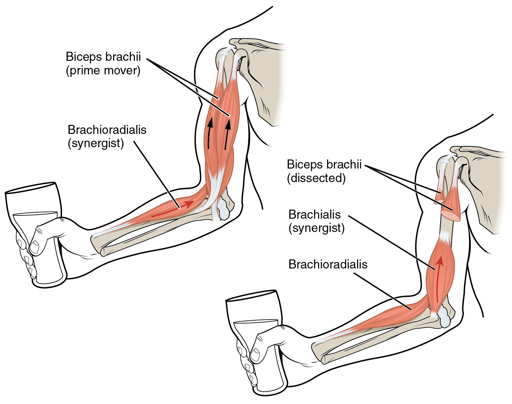
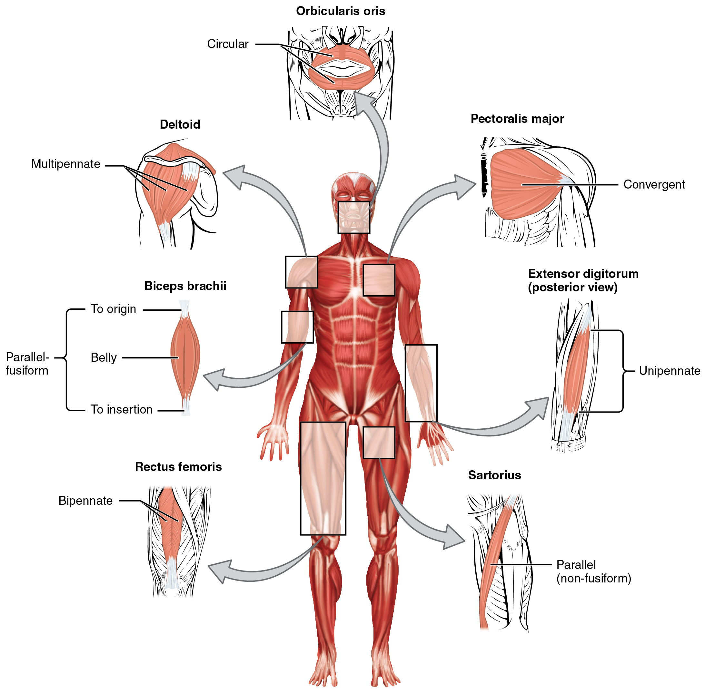

By the end of this section, you will be able to:
* Compare and contrast agonist and antagonist muscles
* Describe how fascicles are arranged within a skeletal muscle
* Explain the major events of a skeletal muscle contraction within a muscle in generating force

To move the skeleton, the tension created by the contraction of the fibers in most skeletal muscles is transferred to the tendons. The tendons are strong bands of dense, regular connective tissue that connect muscles to bones. The bone connection is why this muscle tissue is called skeletal muscle.

# Interactions of Skeletal Muscles in the Body

To pull on a bone, that is, to change the angle at its synovial joint, which essentially moves the skeleton, a skeletal muscle must also be attached to a fixed part of the skeleton. The moveable end of the muscle that attaches to the bone being pulled is called the muscle’s **insertion**{: data-type="term"}, and the end of the muscle attached to a fixed (stabilized) bone is called the **origin**{: data-type="term"}. During forearm **flexion**{: data-type="term"}—bending the elbow—the brachioradialis assists the brachialis.

Although a number of muscles may be involved in an action, the principal muscle involved is called the **prime mover**{: data-type="term"}, or **agonist**{: data-type="term"}. To lift a cup, a muscle called the biceps brachii is actually the prime mover; however, because it can be assisted by the brachialis, the brachialis is called a **synergist**{: data-type="term"} in this action ([\[link\]](#fig-ch11_01_01)). A synergist can also be a **fixator**{: data-type="term"} that stabilizes the bone that is the attachment for the prime mover’s origin.

 {: #fig-ch11_01_01 data-title="Prime Movers and Synergists "}

A muscle with the opposite action of the prime mover is called an **antagonist**{: data-type="term"}. Antagonists play two important roles in muscle function: (1) they maintain body or limb position, such as holding the arm out or standing erect; and (2) they control rapid movement, as in shadow boxing without landing a punch or the ability to check the motion of a limb.

For example, to extend the knee, a group of four muscles called the quadriceps femoris in the anterior compartment of the thigh are activated (and would be called the agonists of knee extension). However, to flex the knee joint, an opposite or antagonistic set of muscles called the hamstrings is activated.

As you can see, these terms would also be reversed for the opposing action. If you consider the first action as the knee bending, the hamstrings would be called the agonists and the quadriceps femoris would then be called the antagonists. See [\[link\]](#tbl-ch11_01) for a list of some agonists and antagonists.

<table id="tbl-ch11_01" summary=""><thead>
<tr>
<th colspan="3">Agonist and Antagonist Skeletal Muscle Pairs</th>
</tr>
<tr>
<th>Agonist</th>
<th>Antagonist</th>
<th>Movement</th>
</tr>
</thead><tbody>
<tr>
<td>Biceps brachii: in the anterior compartment of the arm</td> 
<td>Triceps brachii: in the posterior compartment of the arm</td>
<td>The biceps brachii flexes the forearm, whereas the triceps brachii extends it.</td>
</tr> 
<tr>
<td>Hamstrings: group of three muscles in the posterior compartment of the thigh</td>
<td>Quadriceps femoris: group of four muscles in the anterior compartment of the thigh</td> 
<td>The hamstrings flex the leg, whereas the quadriceps femoris extend it.</td> 
</tr>
<tr>
<td>Flexor digitorum superficialis and flexor digitorum profundus: in the anterior compartment of the forearm</td> 
<td>Extensor digitorum: in the posterior compartment of the forearm</td>
<td>The flexor digitorum superficialis and flexor digitorum profundus flex the fingers and the hand at the wrist, whereas the extensor digitorum extends the fingers and the hand at the wrist.</td>
</tr>
</tbody></table>

There are also skeletal muscles that do not pull against the skeleton for movements. For example, there are the muscles that produce facial expressions. The insertions and origins of facial muscles are in the skin, so that certain individual muscles contract to form a smile or frown, form sounds or words, and raise the eyebrows. There also are skeletal muscles in the tongue, and the external urinary and anal sphincters that allow for voluntary regulation of urination and defecation, respectively. In addition, the diaphragm contracts and relaxes to change the volume of the pleural cavities but it does not move the skeleton to do this.

Everyday Connections

Exercise and Stretching When exercising, it is important to first warm up the muscles. Stretching pulls on the muscle fibers and it also results in an increased blood flow to the muscles being worked. Without a proper warm-up, it is possible that you may either damage some of the muscle fibers or pull a tendon. A pulled tendon, regardless of location, results in pain, swelling, and diminished function; if it is moderate to severe, the injury could immobilize you for an extended period.

Recall the discussion about muscles crossing joints to create movement. Most of the joints you use during exercise are synovial joints, which have synovial fluid in the joint space between two bones. Exercise and stretching may also have a beneficial effect on synovial joints. Synovial fluid is a thin, but viscous film with the consistency of egg whites. When you first get up and start moving, your joints feel stiff for a number of reasons. After proper stretching and warm-up, the synovial fluid may become less viscous, allowing for better joint function.

# Patterns of Fascicle Organization

Skeletal muscle is enclosed in connective tissue scaffolding at three levels. Each muscle fiber (cell) is covered by endomysium and the entire muscle is covered by epimysium. When a group of muscle fibers is “bundled” as a unit within the whole muscle by an additional covering of a connective tissue called perimysium, that bundled group of muscle fibers is called a **fascicle**{: data-type="term"}. Fascicle arrangement by perimysia is correlated to the force generated by a muscle; it also affects the range of motion of the muscle. Based on the patterns of fascicle arrangement, skeletal muscles can be classified in several ways. What follows are the most common fascicle arrangements.

**Parallel**{: data-type="term"} muscles have fascicles that are arranged in the same direction as the long axis of the muscle ([\[link\]](#fig-ch11_01_02)). The majority of skeletal muscles in the body have this type of organization. Some parallel muscles are flat sheets that expand at the ends to make broad attachments. Other parallel muscles are rotund with tendons at one or both ends. Muscles that seem to be plump have a large mass of tissue located in the middle of the muscle, between the insertion and the origin, which is known as the central body. A more common name for this muscle is **belly**{: data-type="term"}. When a muscle contracts, the contractile fibers shorten it to an even larger bulge. For example, extend and then flex your biceps brachii muscle; the large, middle section is the belly ([\[link\]](#fig-ch11_01_03)). When a parallel muscle has a central, large belly that is spindle-shaped, meaning it tapers as it extends to its origin and insertion, it sometimes is called **fusiform**{: data-type="term"}.

 {: #fig-ch11_01_02 data-title="Muscle Shapes and Fiber Alignment "}

"){: #fig-ch11_01_03 data-title="Biceps Brachii Muscle Contraction "}

**Circular**{: data-type="term"} muscles are also called sphincters (see [\[link\]](#fig-ch11_01_02)). When they relax, the sphincters’ concentrically arranged bundles of muscle fibers increase the size of the opening, and when they contract, the size of the opening shrinks to the point of closure. The orbicularis oris muscle is a circular muscle that goes around the mouth. When it contracts, the oral opening becomes smaller, as when puckering the lips for whistling. Another example is the orbicularis oculi, one of which surrounds each eye. Consider, for example, the names of the two orbicularis muscles (orbicularis oris and oribicularis oculi), where part of the first name of both muscles is the same. The first part of orbicularis, orb (orb = “circular”), is a reference to a round or circular structure; it may also make one think of orbit, such as the moon’s path around the earth. The word oris (oris = “oral”) refers to the oral cavity, or the mouth. The word oculi (ocular = “eye”) refers to the eye.

There are other muscles throughout the body named by their shape or location. The deltoid is a large, triangular-shaped muscle that covers the shoulder. It is so-named because the Greek letter delta looks like a triangle. The rectus abdomis (rector = “straight”) is the straight muscle in the anterior wall of the abdomen, while the rectus femoris is the straight muscle in the anterior compartment of the thigh.

When a muscle has a widespread expansion over a sizable area, but then the fascicles come to a single, common attachment point, the muscle is called **convergent**{: data-type="term"}. The attachment point for a convergent muscle could be a tendon, an aponeurosis (a flat, broad tendon), or a raphe (a very slender tendon). The large muscle on the chest, the pectoralis major, is an example of a convergent muscle because it converges on the greater tubercle of the humerus via a tendon. The temporalis muscle of the cranium is another.

**Pennate**{: data-type="term"} muscles (penna = “feathers”) blend into a tendon that runs through the central region of the muscle for its whole length, somewhat like the quill of a feather with the muscle arranged similar to the feathers. Due to this design, the muscle fibers in a pennate muscle can only pull at an angle, and as a result, contracting pennate muscles do not move their tendons very far. However, because a pennate muscle generally can hold more muscle fibers within it, it can produce relatively more tension for its size. There are three subtypes of pennate muscles.

In a **unipennate**{: data-type="term"} muscle, the fascicles are located on one side of the tendon. The extensor digitorum of the forearm is an example of a unipennate muscle. A **bipennate**{: data-type="term"} muscle has fascicles on both sides of the tendon. In some pennate muscles, the muscle fibers wrap around the tendon, sometimes forming individual fascicles in the process. This arrangement is referred to as **multipennate**{: data-type="term"}. A common example is the deltoid muscle of the shoulder, which covers the shoulder but has a single tendon that inserts on the deltoid tuberosity of the humerus.

Because of fascicles, a portion of a multipennate muscle like the deltoid can be stimulated by the nervous system to change the direction of the pull. For example, when the deltoid muscle contracts, the arm abducts (moves away from midline in the sagittal plane), but when only the anterior fascicle is stimulated, the arm will **abduct**{: data-type="term"} and flex (move anteriorly at the shoulder joint).

# The Lever System of Muscle and Bone Interactions

Skeletal muscles do not work by themselves. Muscles are arranged in pairs based on their functions. For muscles attached to the bones of the skeleton, the connection determines the force, speed, and range of movement. These characteristics depend on each other and can explain the general organization of the muscular and skeletal systems.

The skeleton and muscles act together to move the body. Have you ever used the back of a hammer to remove a nail from wood? The handle acts as a lever and the head of the hammer acts as a fulcrum, the fixed point that the force is applied to when you pull back or push down on the handle. The effort applied to this system is the pulling or pushing on the handle to remove the nail, which is the load, or “resistance” to the movement of the handle in the system. Our musculoskeletal system works in a similar manner, with bones being stiff levers and the articular endings of the bones—encased in synovial joints—acting as fulcrums. The load would be an object being lifted or any resistance to a movement (your head is a load when you are lifting it), and the effort, or applied force, comes from contracting skeletal muscle.

# Chapter Review

Skeletal muscles each have an origin and an insertion. The end of the muscle that attaches to the bone being pulled is called the muscle’s insertion and the end of the muscle attached to a fixed, or stabilized, bone is called the origin. The muscle primarily responsible for a movement is called the prime mover, and muscles that assist in this action are called synergists. A synergist that makes the insertion site more stable is called a fixator. Meanwhile, a muscle with the opposite action of the prime mover is called an antagonist. Several factors contribute to the force generated by a skeletal muscle. One is the arrangement of the fascicles in the skeletal muscle. Fascicles can be parallel, circular, convergent, pennate, fusiform, or triangular. Each arrangement has its own range of motion and ability to do work.

# Review Questions

Which of the following is unique to the muscles of facial expression?

1.  They all originate from the scalp musculature.
2.  They insert onto the cartilage found around the face.
3.  They only insert onto the facial bones.
4.  They insert into the skin.
{: data-number-style="lower-alpha"}

D

Which of the following helps an agonist work?

1.  a synergist
2.  a fixator
3.  an insertion
4.  an antagonist
{: data-number-style="lower-alpha"}

A

Which of the following statements is correct about what happens during flexion?

1.  The angle between bones is increased.
2.  The angle between bones is decreased.
3.  The bone moves away from the body.
4.  The bone moves toward the center of the body.
{: data-number-style="lower-alpha"}

B

Which is moved the <em>least </em>during muscle contraction?

1.  the origin
2.  the insertion
3.  the ligaments
4.  the joints
{: data-number-style="lower-alpha"}

A

Which muscle has a convergent pattern of fascicles?

1.  biceps brachii
2.  gluteus maximus
3.  pectoralis major
4.  rectus femoris
{: data-number-style="lower-alpha"}

C

A muscle that has a pattern of fascicles running along the long axis of the muscle has which of the following fascicle arrangements?

1.  circular
2.  pennate
3.  parallel
4.  rectus
{: data-number-style="lower-alpha"}

C

Which arrangement<em> best</em> describes a bipennate muscle?

1.  The muscle fibers feed in on an angle to a long tendon from both sides.
2.  The muscle fibers feed in on an angle to a long tendon from all directions.
3.  The muscle fibers feed in on an angle to a long tendon from one side.
4.  The muscle fibers on one side of a tendon feed into it at a certain angle and muscle fibers on the other side of the tendon feed into it at the opposite angle.
{: data-number-style="lower-alpha"}

A

# Critical Thinking Questions

What effect does fascicle arrangement have on a muscle’s action?

Fascicle arrangements determine what type of movement a muscle can make. For instance, circular muscles act as sphincters, closing orifices.

Movements of the body occur at joints. Describe how muscles are arranged around the joints of the body.

Muscles work in pairs to facilitate movement of the bones around the joints. Agonists are the prime movers while antagonists oppose or resist the movements of the agonists. Synergists assist the agonists, and fixators stabilize a muscle’s origin.

Explain how a synergist assists an agonist by being a fixator.

Agonists are the prime movers while antagonists oppose or resist the movements of the agonists. Synergists assist the agonists, and fixators stabilize a muscle’s origin.

