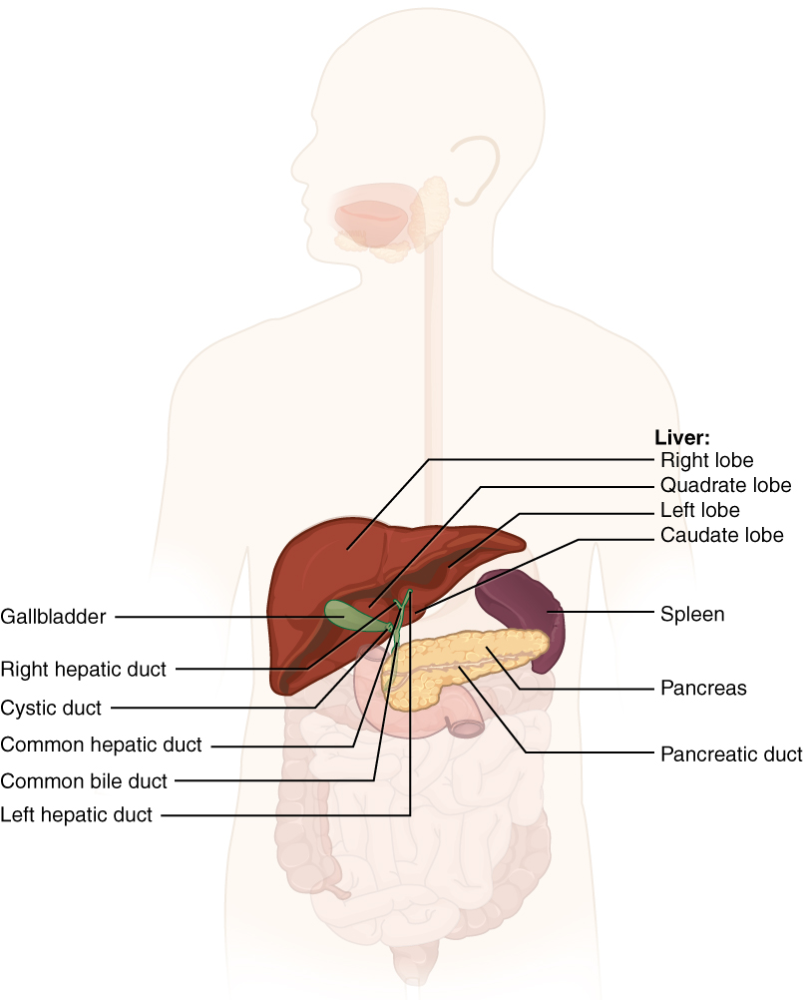
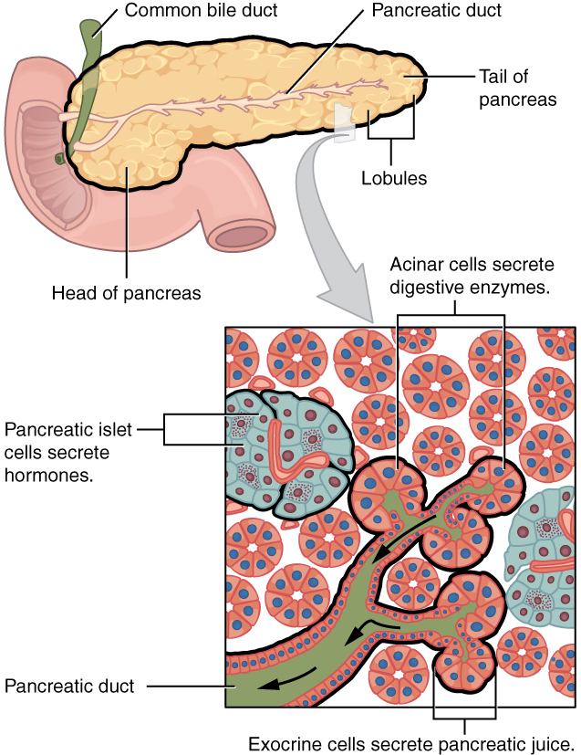
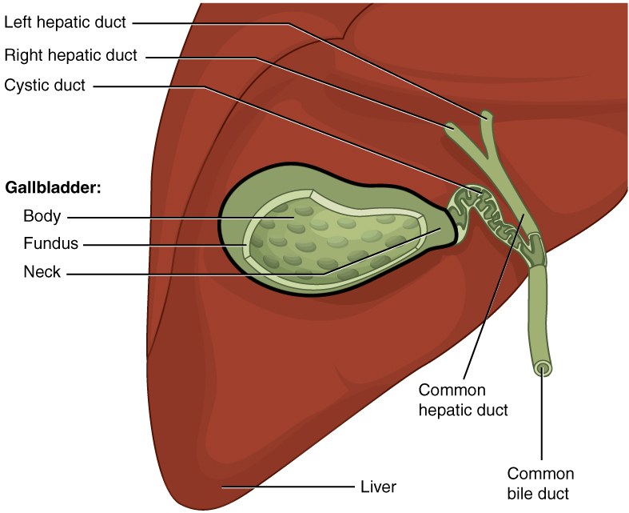

By the end of this section, you will be able to:
* State the main digestive roles of the liver, pancreas, and gallbladder
* Identify three main features of liver histology that are critical to its function
* Discuss the composition and function of bile
* Identify the major types of enzymes and buffers present in pancreatic juice

Chemical digestion in the small intestine relies on the activities of three accessory digestive organs: the liver, pancreas, and gallbladder ([\[link\]](#fig-ch24_06_01)). The digestive role of the liver is to produce bile and export it to the duodenum. The gallbladder primarily stores, concentrates, and releases bile. The pancreas produces pancreatic juice, which contains digestive enzymes and bicarbonate ions, and delivers it to the duodenum.

 {: #fig-ch24_06_01 data-title="Accessory Organs "}

### The Liver

The **liver**{: data-type="term"} is the largest gland in the body, weighing about three pounds in an adult. It is also one of the most important organs. In addition to being an accessory digestive organ, it plays a number of roles in metabolism and regulation. The liver lies inferior to the diaphragm in the right upper quadrant of the abdominal cavity and receives protection from the surrounding ribs.

The liver is divided into two primary lobes: a large right lobe and a much smaller left lobe. In the right lobe, some anatomists also identify an inferior quadrate lobe and a posterior caudate lobe, which are defined by internal features. The liver is connected to the abdominal wall and diaphragm by five peritoneal folds referred to as ligaments. These are the falciform ligament, the coronary ligament, two lateral ligaments, and the ligamentum teres hepatis. The falciform ligament and ligamentum teres hepatis are actually remnants of the umbilical vein, and separate the right and left lobes anteriorly. The lesser omentum tethers the liver to the lesser curvature of the stomach.

The **porta hepatis**{: data-type="term"} (“gate to the liver”) is where the **hepatic artery**{: data-type="term"} and **hepatic portal vein**{: data-type="term"} enter the liver. These two vessels, along with the common hepatic duct, run behind the lateral border of the lesser omentum on the way to their destinations. As shown in [\[link\]](#fig-ch24_06_02), the hepatic artery delivers oxygenated blood from the heart to the liver. The hepatic portal vein delivers partially deoxygenated blood containing nutrients absorbed from the small intestine and actually supplies more oxygen to the liver than do the much smaller hepatic arteries. In addition to nutrients, drugs and toxins are also absorbed. After processing the bloodborne nutrients and toxins, the liver releases nutrients needed by other cells back into the blood, which drains into the central vein and then through the hepatic vein to the inferior vena cava. With this hepatic portal circulation, all blood from the alimentary canal passes through the liver. This largely explains why the liver is the most common site for the metastasis of cancers that originate in the alimentary canal.

 {: #fig-ch24_06_02 data-title="Microscopic Anatomy of the Liver "}

#### Histology

The liver has three main components: hepatocytes, bile canaliculi, and hepatic sinusoids. A **hepatocyte**{: data-type="term"} is the liver’s main cell type, accounting for around 80 percent of the liver\'s volume. These cells play a role in a wide variety of secretory, metabolic, and endocrine functions. Plates of hepatocytes called hepatic laminae radiate outward from the portal vein in each **hepatic lobule**{: data-type="term"}.

Between adjacent hepatocytes, grooves in the cell membranes provide room for each **bile canaliculus**{: data-type="term"} (plural = canaliculi). These small ducts accumulate the bile produced by hepatocytes. From here, bile flows first into bile ductules and then into bile ducts. The bile ducts unite to form the larger right and left hepatic ducts, which themselves merge and exit the liver as the **common hepatic duct**{: data-type="term"}. This duct then joins with the cystic duct from the gallbladder, forming the **common bile duct**{: data-type="term"} through which bile flows into the small intestine.

A **hepatic sinusoid**{: data-type="term"} is an open, porous blood space formed by fenestrated capillaries from nutrient-rich hepatic portal veins and oxygen-rich hepatic arteries. Hepatocytes are tightly packed around the fenestrated endothelium of these spaces, giving them easy access to the blood. From their central position, hepatocytes process the nutrients, toxins, and waste materials carried by the blood. Materials such as bilirubin are processed and excreted into the bile canaliculi. Other materials including proteins, lipids, and carbohydrates are processed and secreted into the sinusoids or just stored in the cells until called upon. The hepatic sinusoids combine and send blood to a **central vein**{: data-type="term"}. Blood then flows through a **hepatic vein**{: data-type="term"} into the inferior vena cava. This means that blood and bile flow in opposite directions. The hepatic sinusoids also contain star-shaped **reticuloendothelial cells**{: data-type="term"} (Kupffer cells), phagocytes that remove dead red and white blood cells, bacteria, and other foreign material that enter the sinusoids. The **portal triad**{: data-type="term"} is a distinctive arrangement around the perimeter of hepatic lobules, consisting of three basic structures: a bile duct, a hepatic artery branch, and a hepatic portal vein branch.

#### Bile

Recall that lipids are hydrophobic, that is, they do not dissolve in water. Thus, before they can be digested in the watery environment of the small intestine, large lipid globules must be broken down into smaller lipid globules, a process called emulsification. **Bile**{: data-type="term"} is a mixture secreted by the liver to accomplish the emulsification of lipids in the small intestine.

Hepatocytes secrete about one liter of bile each day. A yellow-brown or yellow-green alkaline solution (pH 7.6 to 8.6), bile is a mixture of water, bile salts, bile pigments, phospholipids (such as lecithin), electrolytes, cholesterol, and triglycerides. The components most critical to emulsification are bile salts and phospholipids, which have a nonpolar (hydrophobic) region as well as a polar (hydrophilic) region. The hydrophobic region interacts with the large lipid molecules, whereas the hydrophilic region interacts with the watery chyme in the intestine. This results in the large lipid globules being pulled apart into many tiny lipid fragments of about 1 *µ*m in diameter. This change dramatically increases the surface area available for lipid-digesting enzyme activity. This is the same way dish soap works on fats mixed with water.

Bile salts act as emulsifying agents, so they are also important for the absorption of digested lipids. While most constituents of bile are eliminated in feces, bile salts are reclaimed by the **enterohepatic circulation**{: data-type="term"}. Once bile salts reach the ileum, they are absorbed and returned to the liver in the hepatic portal blood. The hepatocytes then excrete the bile salts into newly formed bile. Thus, this precious resource is recycled.

**Bilirubin**{: data-type="term"}, the main bile pigment, is a waste product produced when the spleen removes old or damaged red blood cells from the circulation. These breakdown products, including proteins, iron, and toxic bilirubin, are transported to the liver via the splenic vein of the hepatic portal system. In the liver, proteins and iron are recycled, whereas bilirubin is excreted in the bile. It accounts for the green color of bile. Bilirubin is eventually transformed by intestinal bacteria into stercobilin, a brown pigment that gives your stool its characteristic color! In some disease states, bile does not enter the intestine, resulting in white (‘acholic’) stool with a high fat content, since virtually no fats are broken down or absorbed.

Hepatocytes work non-stop, but bile production increases when fatty chyme enters the duodenum and stimulates the secretion of the gut hormone secretin. Between meals, bile is produced but conserved. The valve-like hepatopancreatic ampulla closes, allowing bile to divert to the gallbladder, where it is concentrated and stored until the next meal.

  
Watch this [video][1] to see the structure of the liver and how this structure supports the functions of the liver, including the processing of nutrients, toxins, and wastes. At rest, about 1500 mL of blood per minute flow through the liver. What percentage of this blood flow comes from the hepatic portal system?

### The Pancreas

The soft, oblong, glandular **pancreas**{: data-type="term"} lies transversely in the retroperitoneum behind the stomach. Its head is nestled into the “c-shaped” curvature of the duodenum with the body extending to the left about 15.2 cm (6 in) and ending as a tapering tail in the hilum of the spleen. It is a curious mix of exocrine (secreting digestive enzymes) and endocrine (releasing hormones into the blood) functions ([\[link\]](#fig-ch24_06_03)).

 {: #fig-ch24_06_03 data-title="Exocrine and Endocrine Pancreas "}

The exocrine part of the pancreas arises as little grape-like cell clusters, each called an **acinus**{: data-type="term"} (plural = acini), located at the terminal ends of pancreatic ducts. These acinar cells secrete enzyme-rich **pancreatic juice**{: data-type="term"} into tiny merging ducts that form two dominant ducts. The larger duct fuses with the common bile duct (carrying bile from the liver and gallbladder) just before entering the duodenum via a common opening (the hepatopancreatic ampulla). The smooth muscle sphincter of the hepatopancreatic ampulla controls the release of pancreatic juice and bile into the small intestine. The second and smaller pancreatic duct, the **accessory duct**{: data-type="term"} (duct of Santorini), runs from the pancreas directly into the duodenum, approximately 1 inch above the hepatopancreatic ampulla. When present, it is a persistent remnant of pancreatic development.

Scattered through the sea of exocrine acini are small islands of endocrine cells, the islets of Langerhans. These vital cells produce the hormones pancreatic polypeptide, insulin, glucagon, and somatostatin.

#### Pancreatic Juice

The pancreas produces over a liter of pancreatic juice each day. Unlike bile, it is clear and composed mostly of water along with some salts, sodium bicarbonate, and several digestive enzymes. Sodium bicarbonate is responsible for the slight alkalinity of pancreatic juice (pH 7.1 to 8.2), which serves to buffer the acidic gastric juice in chyme, inactivate pepsin from the stomach, and create an optimal environment for the activity of pH-sensitive digestive enzymes in the small intestine. Pancreatic enzymes are active in the digestion of sugars, proteins, and fats.

The pancreas produces protein-digesting enzymes in their inactive forms. These enzymes are activated in the duodenum. If produced in an active form, they would digest the pancreas (which is exactly what occurs in the disease, pancreatitis). The intestinal brush border enzyme **enteropeptidase**{: data-type="term"} stimulates the activation of trypsin from trypsinogen of the pancreas, which in turn changes the pancreatic enzymes procarboxypeptidase and chymotrypsinogen into their active forms, carboxypeptidase and chymotrypsin.

The enzymes that digest starch (amylase), fat (lipase), and nucleic acids (nuclease) are secreted in their active forms, since they do not attack the pancreas as do the protein-digesting enzymes.

#### Pancreatic Secretion

Regulation of pancreatic secretion is the job of hormones and the parasympathetic nervous system. The entry of acidic chyme into the duodenum stimulates the release of secretin, which in turn causes the duct cells to release bicarbonate-rich pancreatic juice. The presence of proteins and fats in the duodenum stimulates the secretion of CCK, which then stimulates the acini to secrete enzyme-rich pancreatic juice and enhances the activity of secretin. Parasympathetic regulation occurs mainly during the cephalic and gastric phases of gastric secretion, when vagal stimulation prompts the secretion of pancreatic juice.

Usually, the pancreas secretes just enough bicarbonate to counterbalance the amount of HCl produced in the stomach. Hydrogen ions enter the blood when bicarbonate is secreted by the pancreas. Thus, the acidic blood draining from the pancreas neutralizes the alkaline blood draining from the stomach, maintaining the pH of the venous blood that flows to the liver.

### The Gallbladder

The **gallbladder**{: data-type="term"} is 8–10 cm (~3–4 in) long and is nested in a shallow area on the posterior aspect of the right lobe of the liver. This muscular sac stores, concentrates, and, when stimulated, propels the bile into the duodenum via the common bile duct. It is divided into three regions. The fundus is the widest portion and tapers medially into the body, which in turn narrows to become the neck. The neck angles slightly superiorly as it approaches the hepatic duct. The cystic duct is 1–2 cm (less than 1 in) long and turns inferiorly as it bridges the neck and hepatic duct.

The simple columnar epithelium of the gallbladder mucosa is organized in rugae, similar to those of the stomach. There is no submucosa in the gallbladder wall. The wall’s middle, muscular coat is made of smooth muscle fibers. When these fibers contract, the gallbladder’s contents are ejected through the **cystic duct**{: data-type="term"} and into the bile duct ([\[link\]](#fig-ch24_06_04)). Visceral peritoneum reflected from the liver capsule holds the gallbladder against the liver and forms the outer coat of the gallbladder. The gallbladder\'s mucosa absorbs water and ions from bile, concentrating it by up to 10-fold.

 {: #fig-ch24_06_04 data-title="Gallbladder "}

### Chapter Review

Chemical digestion in the small intestine cannot occur without the help of the liver and pancreas. The liver produces bile and delivers it to the common hepatic duct. Bile contains bile salts and phospholipids, which emulsify large lipid globules into tiny lipid droplets, a necessary step in lipid digestion and absorption. The gallbladder stores and concentrates bile, releasing it when it is needed by the small intestine.

The pancreas produces the enzyme- and bicarbonate-rich pancreatic juice and delivers it to the small intestine through ducts. Pancreatic juice buffers the acidic gastric juice in chyme, inactivates pepsin from the stomach, and enables the optimal functioning of digestive enzymes in the small intestine.

### Interactive Link Questions

Watch this [video][1] to see the structure of the liver and how this structure supports the functions of the liver, including the processing of nutrients, toxins, and wastes. At rest, about 1500 mL of blood per minute flow through the liver. What percentage of this blood flow comes from the hepatic portal system?

Answers may vary.

### Review Questions

Which of these statements about bile is true?

1.  About 500 mL is secreted daily.
2.  Its main function is the denaturation of proteins.
3.  It is synthesized in the gallbladder.
4.  Bile salts are recycled.
{: type="a"}

D

Pancreatic juice \_\_\_\_\_\_\_\_.

1.  deactivates bile.
2.  is secreted by pancreatic islet cells.
3.  buffers chyme.
4.  is released into the cystic duct.
{: type="a"}

C

### Critical Thinking Questions

Why does the pancreas secrete some enzymes in their inactive forms, and where are these enzymes activated?

The pancreas secretes protein-digesting enzymes in their inactive forms. If secreted in their active forms, they would self-digest the pancreas. These enzymes are activated in the duodenum.

Describe the location of hepatocytes in the liver and how this arrangement enhances their function.

The hepatocytes are the main cell type of the liver. They process, store, and release nutrients into the blood. Radiating out from the central vein, they are tightly packed around the hepatic sinusoids, allowing the hepatocytes easy access to the blood flowing through the sinusoids.

### Glossary
{: data-type="glossary-title"}

accessory duct
: (also, duct of Santorini) duct that runs from the pancreas into the duodenum
^

acinus
: cluster of glandular epithelial cells in the pancreas that secretes pancreatic juice in the pancreas
^

bile
: alkaline solution produced by the liver and important for the emulsification of lipids
^

bile canaliculus
: small duct between hepatocytes that collects bile
^

bilirubin
: main bile pigment, which is responsible for the brown color of feces
^

central vein
: vein that receives blood from hepatic sinusoids
^

common bile duct
: structure formed by the union of the common hepatic duct and the gallbladder’s cystic duct
^

common hepatic duct
: duct formed by the merger of the two hepatic ducts
^

cystic duct
: duct through which bile drains and enters the gallbladder
^

enterohepatic circulation
: recycling mechanism that conserves bile salts
^

enteropeptidase
: intestinal brush-border enzyme that activates trypsinogen to trypsin
^

gallbladder
: accessory digestive organ that stores and concentrates bile
^

hepatic artery
: artery that supplies oxygenated blood to the liver
^

hepatic lobule
: hexagonal-shaped structure composed of hepatocytes that radiate outward from a central vein
^

hepatic portal vein
: vein that supplies deoxygenated nutrient-rich blood to the liver
^

hepatic sinusoid
: blood capillaries between rows of hepatocytes that receive blood from the hepatic portal vein and the branches of the hepatic artery
^

hepatic vein
: vein that drains into the inferior vena cava
^

hepatocytes
: major functional cells of the liver
^

liver
: largest gland in the body whose main digestive function is the production of bile
^

pancreas
: accessory digestive organ that secretes pancreatic juice
^

pancreatic juice
: secretion of the pancreas containing digestive enzymes and bicarbonate
^

porta hepatis
: “gateway to the liver” where the hepatic artery and hepatic portal vein enter the liver
^

portal triad
: bile duct, hepatic artery branch, and hepatic portal vein branch
^

reticuloendothelial cell
: (also, Kupffer cell) phagocyte in hepatic sinusoids that filters out material from venous blood from the alimentary canal

[1]: http://openstaxcollege.org/l/liver
