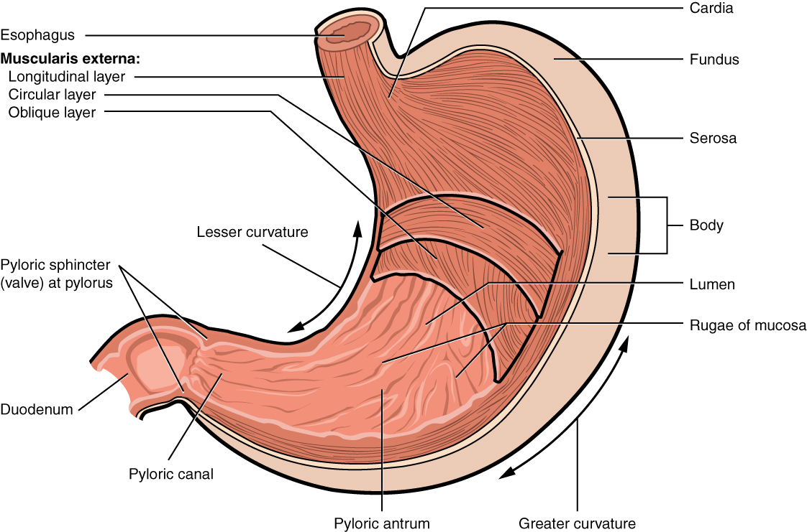
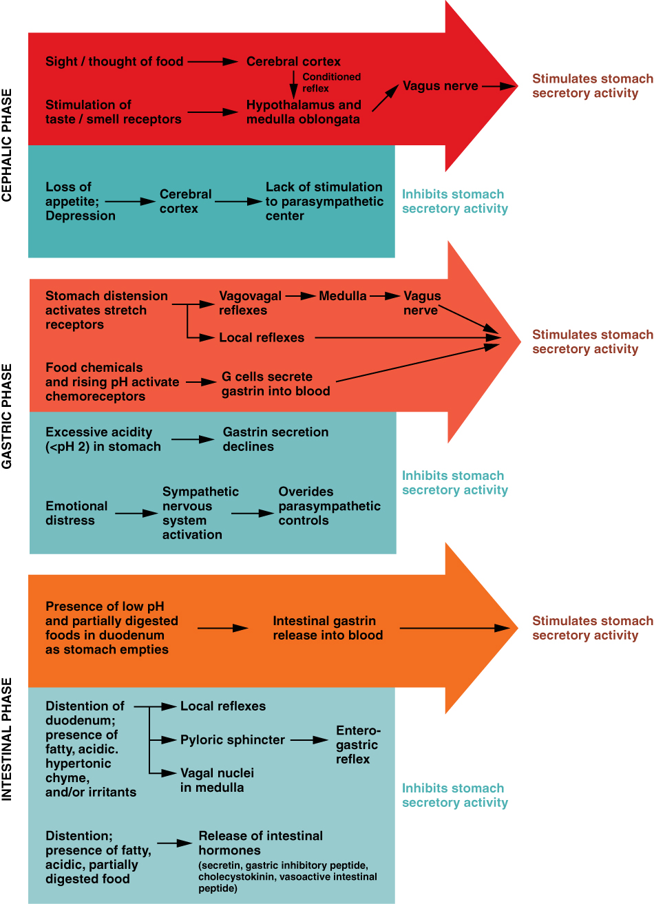

By the end of this section, you will be able to:
* Label on a diagram the four main regions of the stomach, its curvatures, and its sphincter
* Identify the four main types of secreting cells in gastric glands, and their important products
* Explain why the stomach does not digest itself
* Describe the mechanical and chemical digestion of food entering the stomach

Although a minimal amount of carbohydrate digestion occurs in the mouth, chemical digestion really gets underway in the stomach. An expansion of the alimentary canal that lies immediately inferior to the esophagus, the stomach links the esophagus to the first part of the small intestine (the duodenum) and is relatively fixed in place at its esophageal and duodenal ends. In between, however, it can be a highly active structure, contracting and continually changing position and size. These contractions provide mechanical assistance to digestion. The empty stomach is only about the size of your fist, but can stretch to hold as much as 4 liters of food and fluid, or more than 75 times its empty volume, and then return to its resting size when empty. Although you might think that the size of a person’s stomach is related to how much food that individual consumes, body weight does not correlate with stomach size. Rather, when you eat greater quantities of food—such as at holiday dinner—you stretch the stomach more than when you eat less.

Popular culture tends to refer to the stomach as the location where all digestion takes place. Of course, this is not true. An important function of the stomach is to serve as a temporary holding chamber. You can ingest a meal far more quickly than it can be digested and absorbed by the small intestine. Thus, the stomach holds food and parses only small amounts into the small intestine at a time. Foods are not processed in the order they are eaten; rather, they are mixed together with digestive juices in the stomach until they are converted into chyme, which is released into the small intestine.

As you will see in the sections that follow, the stomach plays several important roles in chemical digestion, including the continued digestion of carbohydrates and the initial digestion of proteins and triglycerides. Little if any nutrient absorption occurs in the stomach, with the exception of the negligible amount of nutrients in alcohol.

# Structure

There are four main regions in the **stomach**{: data-type="term"}\: the cardia, fundus, body, and pylorus ([\[link\]](#fig-ch24_04_01)). The **cardia**{: data-type="term"} (or cardiac region) is the point where the esophagus connects to the stomach and through which food passes into the stomach. Located inferior to the diaphragm, above and to the left of the cardia, is the dome-shaped **fundus**{: data-type="term"}. Below the fundus is the **body**{: data-type="term"}, the main part of the stomach. The funnel-shaped **pylorus**{: data-type="term"} connects the stomach to the duodenum. The wider end of the funnel, the **pyloric antrum**{: data-type="term"}, connects to the body of the stomach. The narrower end is called the **pyloric canal**{: data-type="term"}, which connects to the duodenum. The smooth muscle **pyloric sphincter**{: data-type="term"} is located at this latter point of connection and controls stomach emptying. In the absence of food, the stomach deflates inward, and its mucosa and submucosa fall into a large fold called a **ruga**{: data-type="term"}.

{: #fig-ch24_04_01 data-title="Stomach "}

The convex lateral surface of the stomach is called the greater curvature; the concave medial border is the lesser curvature. The stomach is held in place by the lesser omentum, which extends from the liver to the lesser curvature, and the greater omentum, which runs from the greater curvature to the posterior abdominal wall.

# Histology

The wall of the stomach is made of the same four layers as most of the rest of the alimentary canal, but with adaptations to the mucosa and muscularis for the unique functions of this organ. In addition to the typical circular and longitudinal smooth muscle layers, the muscularis has an inner oblique smooth muscle layer ([\[link\]](#fig-ch24_04_02)). As a result, in addition to moving food through the canal, the stomach can vigorously churn food, mechanically breaking it down into smaller particles.

  contain different types of cells that secrete a variety of enzymes, including hydrochloride acid, which activates the protein-digesting enzyme pepsin."){: #fig-ch24_04_02 data-title="Histology of the Stomach "}

The stomach mucosa’s epithelial lining consists only of surface mucus cells, which secrete a protective coat of alkaline mucus. A vast number of **gastric pits**{: data-type="term"} dot the surface of the epithelium, giving it the appearance of a well-used pincushion, and mark the entry to each **gastric gland**{: data-type="term"}, which secretes a complex digestive fluid referred to as gastric juice.

Although the walls of the gastric pits are made up primarily of mucus cells, the gastric glands are made up of different types of cells. The glands of the cardia and pylorus are composed primarily of mucus-secreting cells. Cells that make up the pyloric antrum secrete mucus and a number of hormones, including the majority of the stimulatory hormone, **gastrin**{: data-type="term"}. The much larger glands of the fundus and body of the stomach, the site of most chemical digestion, produce most of the gastric secretions. These glands are made up of a variety of secretory cells. These include parietal cells, chief cells, mucous neck cells, and enteroendocrine cells.

*Parietal cells*—Located primarily in the middle region of the gastric glands are **parietal cells**{: data-type="term"}, which are among the most highly differentiated of the body’s epithelial cells. These relatively large cells produce both **hydrochloric acid (HCl)**{: data-type="term"} and **intrinsic factor**{: data-type="term"}. HCl is responsible for the high acidity (pH 1.5 to 3.5) of the stomach contents and is needed to activate the protein-digesting enzyme, pepsin. The acidity also kills much of the bacteria you ingest with food and helps to denature proteins, making them more available for enzymatic digestion. Intrinsic factor is a glycoprotein necessary for the absorption of vitamin B12 in the small intestine.

*Chief cells*—Located primarily in the basal regions of gastric glands are **chief cells**{: data-type="term"}, which secrete **pepsinogen**{: data-type="term"}, the inactive proenzyme form of pepsin. HCl is necessary for the conversion of pepsinogen to pepsin.

*Mucous neck cells*—Gastric glands in the upper part of the stomach contain **mucous neck cells**{: data-type="term"} that secrete thin, acidic mucus that is much different from the mucus secreted by the goblet cells of the surface epithelium. The role of this mucus is not currently known.

*Enteroendocrine cells*—Finally, **enteroendocrine cells**{: data-type="term"} found in the gastric glands secrete various hormones into the interstitial fluid of the lamina propria. These include gastrin, which is released mainly by enteroendocrine **G cells**{: data-type="term"}.

[\[link\]](#tbl-ch24_06) describes the digestive functions of important hormones secreted by the stomach.

  
Watch this [animation][1] that depicts the structure of the stomach and how this structure functions in the initiation of protein digestion. This view of the stomach shows the characteristic rugae. What is the function of these rugae?

<table id="tbl-ch24_06" summary=""><thead>
<tr>
<th colspan="5">Hormones Secreted by the Stomach</th>
</tr>
<tr>
<th>Hormone</th>
<th>Production site</th>
<th>Production stimulus</th>
<th>Target organ</th>
<th>Action</th>
</tr>
</thead><tbody>
<tr><td>Gastrin</td>
<td>Stomach mucosa, mainly G cells of the pyloric antrum</td>
<td>Presence of peptides and amino acids in stomach</td> 
<td>Stomach</td>
<td>
Increases secretion by gastric glands; promotes gastric emptying
</td>
</tr>
<tr>
<td>Gastrin</td>
<td>Stomach mucosa, mainly G cells of the pyloric antrum</td>
<td>Presence of peptides and amino acids in stomach</td>
<td>Small intestine</td>
<td>Promotes intestinal muscle contraction</td>
</tr>
<tr>
<td>Gastrin</td>
<td>Stomach mucosa, mainly G cells of the pyloric antrum</td>
<td>Presence of peptides and amino acids in stomach</td>
<td>Ileocecal valve</td>
<td>Relaxes valve</td>
</tr>
<tr>
<td>Gastrin</td>
<td>Stomach mucosa, mainly G cells of the pyloric antrum</td>
<td>Presence of peptides and amino acids in stomach</td>
<td>Large intestine</td>
<td>Triggers mass movements</td>
</tr>
<tr>
<td>Ghrelin</td>
<td>Stomach mucosa, mainly fundus</td>
<td>Fasting state (levels increase just prior to meals)</td>
<td>Hypothalamus</td>
<td>Regulates food intake, primarily by stimulating hunger and satiety</td>
</tr>
<tr>
<td>Histamine</td>
<td>Stomach mucosa</td>
<td>Presence of food in the stomach</td>
<td>Stomach</td>
<td>Stimulates parietal cells to release HCl</td>
</tr>
<tr>
<td>Serotonin</td>
<td>Stomach mucosa</td>
<td>Presence of food in the stomach</td>
<td>Stomach</td>
<td>Contracts stomach muscle</td>
</tr>
<tr>
<td>Somatostatin</td>
<td>Mucosa of stomach, especially pyloric antrum; also duodenum</td>
<td>Presence of food in the stomach; sympathetic axon stimulation</td>
<td>Stomach</td>
<td>Restricts all gastric secretions, gastric motility, and emptying</td>
</tr>
<tr>
<td>Somatostatin</td>
<td>Mucosa of stomach, especially pyloric antrum; also duodenum</td>
<td>Presence of food in the stomach; sympathetic axon stimulation</td>
<td>Pancreas</td>
<td>Restricts pancreatic secretions</td>
</tr>
<tr>
<td>Somatostatin</td>
<td>Mucosa of stomach, especially pyloric antrum; also duodenum</td>
<td>Presence of food in the stomach; sympathetic axon stimulation</td>
<td>Small intestine</td>
<td>Reduces intestinal absorption by reducing blood flow</td>
</tr>
</tbody></table>

# Gastric Secretion

The secretion of gastric juice is controlled by both nerves and hormones. Stimuli in the brain, stomach, and small intestine activate or inhibit gastric juice production. This is why the three phases of gastric secretion are called the cephalic, gastric, and intestinal phases ([\[link\]](#fig-ch24_04_03)). However, once gastric secretion begins, all three phases can occur simultaneously.

{: #fig-ch24_04_03 data-title="The Three Phases of Gastric Secretion "}

The **cephalic phase**{: data-type="term"} (reflex phase) of gastric secretion, which is relatively brief, takes place before food enters the stomach. The smell, taste, sight, or thought of food triggers this phase. For example, when you bring a piece of sushi to your lips, impulses from receptors in your taste buds or the nose are relayed to your brain, which returns signals that increase gastric secretion to prepare your stomach for digestion. This enhanced secretion is a conditioned reflex, meaning it occurs only if you like or want a particular food. Depression and loss of appetite can suppress the cephalic reflex.

The **gastric phase**{: data-type="term"} of secretion lasts 3 to 4 hours, and is set in motion by local neural and hormonal mechanisms triggered by the entry of food into the stomach. For example, when your sushi reaches the stomach, it creates distention that activates the stretch receptors. This stimulates parasympathetic neurons to release acetylcholine, which then provokes increased secretion of gastric juice. Partially digested proteins, caffeine, and rising pH stimulate the release of gastrin from enteroendocrine G cells, which in turn induces parietal cells to increase their production of HCl, which is needed to create an acidic environment for the conversion of pepsinogen to pepsin, and protein digestion. Additionally, the release of gastrin activates vigorous smooth muscle contractions. However, it should be noted that the stomach does have a natural means of avoiding excessive acid secretion and potential heartburn. Whenever pH levels drop too low, cells in the stomach react by suspending HCl secretion and increasing mucous secretions.

The **intestinal phase**{: data-type="term"} of gastric secretion has both excitatory and inhibitory elements. The duodenum has a major role in regulating the stomach and its emptying. When partially digested food fills the duodenum, intestinal mucosal cells release a hormone called intestinal (enteric) gastrin, which further excites gastric juice secretion. This stimulatory activity is brief, however, because when the intestine distends with chyme, the enterogastric reflex inhibits secretion. One of the effects of this reflex is to close the pyloric sphincter, which blocks additional chyme from entering the duodenum.

# The Mucosal Barrier

The mucosa of the stomach is exposed to the highly corrosive acidity of gastric juice. Gastric enzymes that can digest protein can also digest the stomach itself. The stomach is protected from self-digestion by the **mucosal barrier**{: data-type="term"}. This barrier has several components. First, the stomach wall is covered by a thick coating of bicarbonate-rich mucus. This mucus forms a physical barrier, and its bicarbonate ions neutralize acid. Second, the epithelial cells of the stomach\'s mucosa meet at tight junctions, which block gastric juice from penetrating the underlying tissue layers. Finally, stem cells located where gastric glands join the gastric pits quickly replace damaged epithelial mucosal cells, when the epithelial cells are shed. In fact, the surface epithelium of the stomach is completely replaced every 3 to 6 days.

Homeostatic Imbalances

Ulcers: When the Mucosal Barrier Breaks Down As effective as the mucosal barrier is, it is not a “fail-safe” mechanism. Sometimes, gastric juice eats away at the superficial lining of the stomach mucosa, creating erosions, which mostly heal on their own. Deeper and larger erosions are called ulcers.

Why does the mucosal barrier break down? A number of factors can interfere with its ability to protect the stomach lining. The majority of all ulcers are caused by either excessive intake of non-steroidal anti-inflammatory drugs (NSAIDs), including aspirin, or *Helicobacter pylori* infection.

Antacids help relieve symptoms of ulcers such as “burning” pain and indigestion. When ulcers are caused by NSAID use, switching to other classes of pain relievers allows healing. When caused by *H. pylori* infection, antibiotics are effective.

A potential complication of ulcers is perforation: Perforated ulcers create a hole in the stomach wall, resulting in peritonitis (inflammation of the peritoneum). These ulcers must be repaired surgically.

# Digestive Functions of the Stomach

The stomach participates in virtually all the digestive activities with the exception of ingestion and defecation. Although almost all absorption takes place in the small intestine, the stomach does absorb some nonpolar substances, such as alcohol and aspirin.

## Mechanical Digestion

Within a few moments after food after enters your stomach, mixing waves begin to occur at intervals of approximately 20 seconds. A **mixing wave**{: data-type="term"} is a unique type of peristalsis that mixes and softens the food with gastric juices to create chyme. The initial mixing waves are relatively gentle, but these are followed by more intense waves, starting at the body of the stomach and increasing in force as they reach the pylorus. It is fair to say that long before your sushi exits through the pyloric sphincter, it bears little resemblance to the sushi you ate.

The pylorus, which holds around 30 mL (1 fluid ounce) of chyme, acts as a filter, permitting only liquids and small food particles to pass through the mostly, but not fully, closed pyloric sphincter. In a process called **gastric emptying**{: data-type="term"}, rhythmic mixing waves force about 3 mL of chyme at a time through the pyloric sphincter and into the duodenum. Release of a greater amount of chyme at one time would overwhelm the capacity of the small intestine to handle it. The rest of the chyme is pushed back into the body of the stomach, where it continues mixing. This process is repeated when the next mixing waves force more chyme into the duodenum.

Gastric emptying is regulated by both the stomach and the duodenum. The presence of chyme in the duodenum activates receptors that inhibit gastric secretion. This prevents additional chyme from being released by the stomach before the duodenum is ready to process it.

## Chemical Digestion

The fundus plays an important role, because it stores both undigested food and gases that are released during the process of chemical digestion. Food may sit in the fundus of the stomach for a while before being mixed with the chyme. While the food is in the fundus, the digestive activities of salivary amylase continue until the food begins mixing with the acidic chyme. Ultimately, mixing waves incorporate this food with the chyme, the acidity of which inactivates salivary amylase and activates lingual lipase. Lingual lipase then begins breaking down triglycerides into free fatty acids, and mono- and diglycerides.

The breakdown of protein begins in the stomach through the actions of HCl and the enzyme pepsin. During infancy, gastric glands also produce rennin, an enzyme that helps digest milk protein.

Its numerous digestive functions notwithstanding, there is only one stomach function necessary to life: the production of intrinsic factor. The intestinal absorption of vitamin B12, which is necessary for both the production of mature red blood cells and normal neurological functioning, cannot occur without intrinsic factor. People who undergo total gastrectomy (stomach removal)—for life-threatening stomach cancer, for example—can survive with minimal digestive dysfunction if they receive vitamin B12 injections.

The contents of the stomach are completely emptied into the duodenum within 2 to 4 hours after you eat a meal. Different types of food take different amounts of time to process. Foods heavy in carbohydrates empty fastest, followed by high-protein foods. Meals with a high triglyceride content remain in the stomach the longest. Since enzymes in the small intestine digest fats slowly, food can stay in the stomach for 6 hours or longer when the duodenum is processing fatty chyme. However, note that this is still a fraction of the 24 to 72 hours that full digestion typically takes from start to finish.

# Chapter Review

The stomach participates in all digestive activities except ingestion and defecation. It vigorously churns food. It secretes gastric juices that break down food and absorbs certain drugs, including aspirin and some alcohol. The stomach begins the digestion of protein and continues the digestion of carbohydrates and fats. It stores food as an acidic liquid called chyme, and releases it gradually into the small intestine through the pyloric sphincter.

# Interactive Link Questions

Watch this [animation][1] that depicts the structure of the stomach and how this structure functions in the initiation of protein digestion. This view of the stomach shows the characteristic rugae. What is the function of these rugae?

Answers may vary.

# Review Questions

Which of these cells secrete hormones?

1.  parietal cells
2.  mucous neck cells
3.  enteroendocrine cells
4.  chief cells
{: data-number-style="lower-alpha"}

C

Where does the majority of chemical digestion in the stomach occur?

1.  fundus and body
2.  cardia and fundus
3.  body and pylorus
4.  body
{: data-number-style="lower-alpha"}

A

During gastric emptying, chyme is released into the duodenum through the \_\_\_\_\_\_\_\_.

1.  esophageal hiatus
2.  pyloric antrum
3.  pyloric canal
4.  pyloric sphincter
{: data-number-style="lower-alpha"}

D

Parietal cells secrete \_\_\_\_\_\_\_\_.

1.  gastrin
2.  hydrochloric acid
3.  pepsin
4.  pepsinogen
{: data-number-style="lower-alpha"}

B

# Critical Thinking Questions

Explain how the stomach is protected from self-digestion and why this is necessary.

The mucosal barrier protects the stomach from self-digestion. It includes a thick coating of bicarbonate-rich mucus; the mucus is physically protective, and bicarbonate neutralizes gastric acid. Epithelial cells meet at tight junctions, which block gastric juice from penetrating the underlying tissue layers, and stem cells quickly replace sloughed off epithelial mucosal cells.

Describe unique anatomical features that enable the stomach to perform digestive functions.

The stomach has an additional inner oblique smooth muscle layer that helps the muscularis churn and mix food. The epithelium includes gastric glands that secrete gastric fluid. The gastric fluid consists mainly of mucous, HCl, and the enzyme pepsin released as pepsinogen.

[1]: http://openstaxcollege.org/l/stomach1
