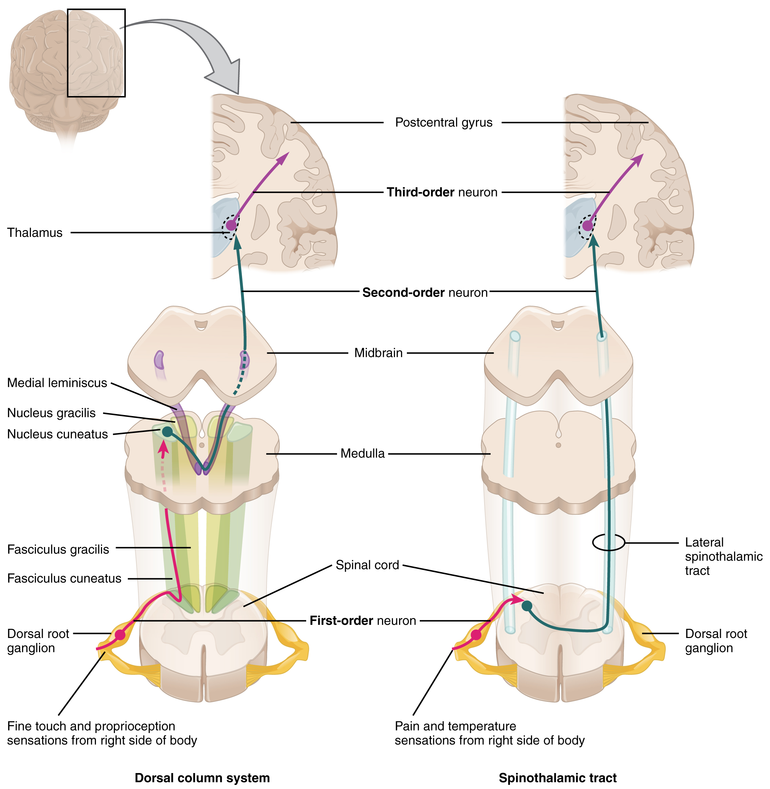
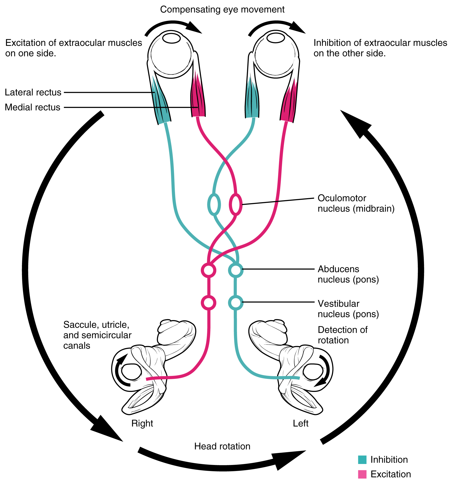
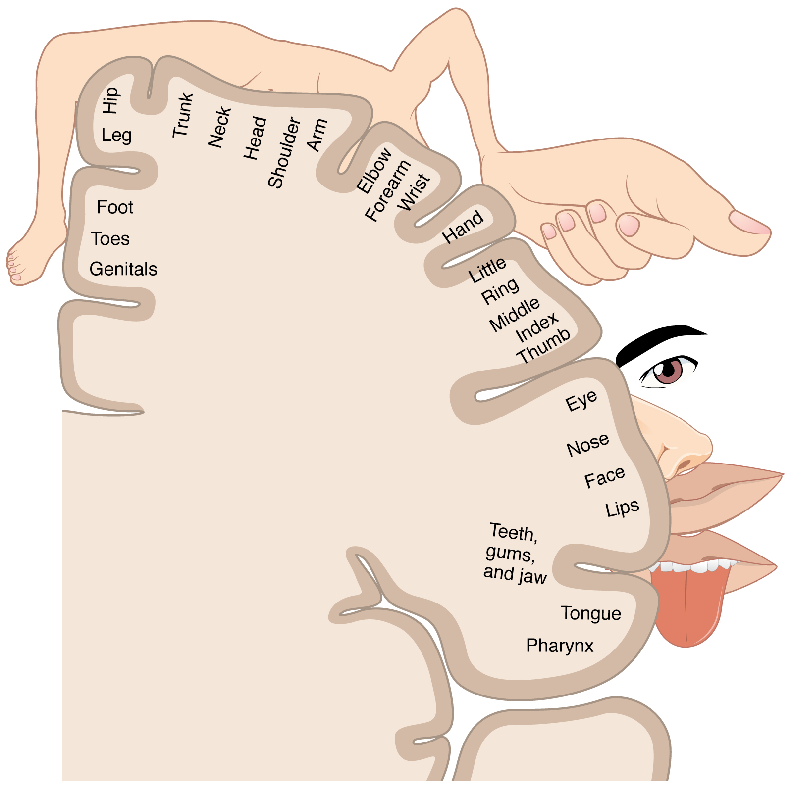
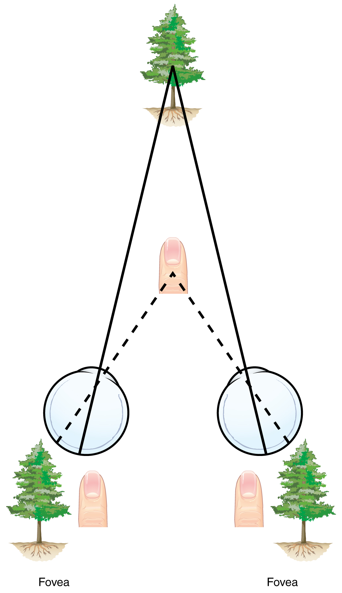
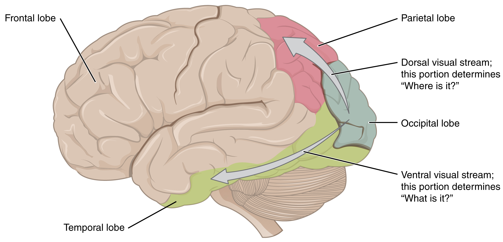

By the end of this section, you will be able to:
* Describe the pathways that sensory systems follow into the central nervous system
* Differentiate between the two major ascending pathways in the spinal cord
* Describe the pathway of somatosensory input from the face and compare it to the ascending pathways in the spinal cord
* Explain topographical representations of sensory information in at least two systems
* Describe two pathways of visual processing and the functions associated with each

# Sensory Pathways

Specific regions of the CNS coordinate different somatic processes using sensory inputs and motor outputs of peripheral nerves. A simple case is a reflex caused by a synapse between a dorsal sensory neuron axon and a motor neuron in the ventral horn. More complex arrangements are possible to integrate peripheral sensory information with higher processes. The important regions of the CNS that play a role in somatic processes can be separated into the spinal cord brain stem, diencephalon, cerebral cortex, and subcortical structures.

## Spinal Cord and Brain Stem

A sensory pathway that carries peripheral sensations to the brain is referred to as an **ascending pathway**{: data-type="term"}, or ascending tract. The various sensory modalities each follow specific pathways through the CNS. Tactile and other somatosensory stimuli activate receptors in the skin, muscles, tendons, and joints throughout the entire body. However, the somatosensory pathways are divided into two separate systems on the basis of the location of the receptor neurons. Somatosensory stimuli from below the neck pass along the sensory pathways of the spinal cord, whereas somatosensory stimuli from the head and neck travel through the cranial nerves—specifically, the trigeminal system.

The **dorsal column system**{: data-type="term"} (sometimes referred to as the dorsal column–medial lemniscus) and the **spinothalamic tract**{: data-type="term"} are two major pathways that bring sensory information to the brain ([\[link\]](#fig-ch14_02_01)). The sensory pathways in each of these systems are composed of three successive neurons.

The dorsal column system begins with the axon of a dorsal root ganglion neuron entering the dorsal root and joining the dorsal column white matter in the spinal cord. As axons of this pathway enter the dorsal column, they take on a positional arrangement so that axons from lower levels of the body position themselves medially, whereas axons from upper levels of the body position themselves laterally. The dorsal column is separated into two component tracts, the **fasciculus gracilis**{: data-type="term"} that contains axons from the legs and lower body, and the **fasciculus cuneatus**{: data-type="term"} that contains axons from the upper body and arms.

The axons in the dorsal column terminate in the nuclei of the medulla, where each synapses with the second neuron in their respective pathway. The **nucleus gracilis**{: data-type="term"} is the target of fibers in the fasciculus gracilis, whereas the **nucleus cuneatus**{: data-type="term"} is the target of fibers in the fasciculus cuneatus. The second neuron in the system projects from one of the two nuclei and then **decussates**{: data-type="term"}, or crosses the midline of the medulla. These axons then continue to ascend the brain stem as a bundle called the **medial lemniscus**{: data-type="term"}. These axons terminate in the thalamus, where each synapses with the third neuron in their respective pathway. The third neuron in the system projects its axons to the postcentral gyrus of the cerebral cortex, where somatosensory stimuli are initially processed and the conscious perception of the stimulus occurs.

The spinothalamic tract also begins with neurons in a dorsal root ganglion. These neurons extend their axons to the dorsal horn, where they synapse with the second neuron in their respective pathway. The name “spinothalamic” comes from this second neuron, which has its cell body in the spinal cord gray matter and connects to the thalamus. Axons from these second neurons then decussate within the spinal cord and ascend to the brain and enter the thalamus, where each synapses with the third neuron in its respective pathway. The neurons in the thalamus then project their axons to the spinothalamic tract, which synapses in the postcentral gyrus of the cerebral cortex.

These two systems are similar in that they both begin with dorsal root ganglion cells, as with most general sensory information. The dorsal column system is primarily responsible for touch sensations and proprioception, whereas the spinothalamic tract pathway is primarily responsible for pain and temperature sensations. Another similarity is that the second neurons in both of these pathways are contralateral, because they project across the midline to the other side of the brain or spinal cord. In the dorsal column system, this decussation takes place in the brain stem; in the spinothalamic pathway, it takes place in the spinal cord at the same spinal cord level at which the information entered. The third neurons in the two pathways are essentially the same. In both, the second neuron synapses in the thalamus, and the thalamic neuron projects to the somatosensory cortex.

 {: #fig-ch14_02_01 data-title="Ascending Sensory Pathways of the Spinal Cord "}

The trigeminal pathway carries somatosensory information from the face, head, mouth, and nasal cavity. As with the previously discussed nerve tracts, the sensory pathways of the trigeminal pathway each involve three successive neurons. First, axons from the trigeminal ganglion enter the brain stem at the level of the pons. These axons project to one of three locations. The **spinal trigeminal nucleus**{: data-type="term"} of the medulla receives information similar to that carried by spinothalamic tract, such as pain and temperature sensations. Other axons go to either the **chief sensory nucleus**{: data-type="term"} in the pons or the **mesencephalic nuclei**{: data-type="term"} in the midbrain. These nuclei receive information like that carried by the dorsal column system, such as touch, pressure, vibration, and proprioception. Axons from the second neuron decussate and ascend to the thalamus along the trigeminothalamic tract. In the thalamus, each axon synapses with the third neuron in its respective pathway. Axons from the third neuron then project from the thalamus to the primary somatosensory cortex of the cerebrum.

The sensory pathway for gustation travels along the facial and glossopharyngeal cranial nerves, which synapse with neurons of the **solitary nucleus**{: data-type="term"} in the brain stem. Axons from the solitary nucleus then project to the **ventral posterior nucleus**{: data-type="term"} of the thalamus. Finally, axons from the ventral posterior nucleus project to the gustatory cortex of the cerebral cortex, where taste is processed and consciously perceived.

The sensory pathway for audition travels along the vestibulocochlear nerve, which synapses with neurons in the cochlear nuclei of the superior medulla. Within the brain stem, input from either ear is combined to extract location information from the auditory stimuli. Whereas the initial auditory stimuli received at the cochlea strictly represent the frequency—or pitch—of the stimuli, the locations of sounds can be determined by comparing information arriving at both ears.

Sound localization is a feature of central processing in the auditory nuclei of the brain stem. Sound localization is achieved by the brain calculating the **interaural time difference**{: data-type="term"} and the **interaural intensity difference**{: data-type="term"}. A sound originating from a specific location will arrive at each ear at different times, unless the sound is directly in front of the listener. If the sound source is slightly to the left of the listener, the sound will arrive at the left ear microseconds before it arrives at the right ear ([\[link\]](#fig-ch14_02_02)). This time difference is an example of an interaural time difference. Also, the sound will be slightly louder in the left ear than in the right ear because some of the sound waves reaching the opposite ear are blocked by the head. This is an example of an interaural intensity difference.

 {: #fig-ch14_02_02 data-title="Auditory Brain Stem Mechanisms of Sound Localization "}

Auditory processing continues on to a nucleus in the midbrain called the **inferior colliculus**{: data-type="term"}. Axons from the inferior colliculus project to two locations, the thalamus and the **superior colliculus**{: data-type="term"}. The **medial geniculate nucleus**{: data-type="term"} of the thalamus receives the auditory information and then projects that information to the auditory cortex in the temporal lobe of the cerebral cortex. The superior colliculus receives input from the visual and somatosensory systems, as well as the ears, to initiate stimulation of the muscles that turn the head and neck toward the auditory stimulus.

Balance is coordinated through the vestibular system, the nerves of which are composed of axons from the vestibular ganglion that carries information from the utricle, saccule, and semicircular canals. The system contributes to controlling head and neck movements in response to vestibular signals. An important function of the vestibular system is coordinating eye and head movements to maintain visual attention. Most of the axons terminate in the **vestibular nuclei**{: data-type="term"} of the medulla. Some axons project from the vestibular ganglion directly to the cerebellum, with no intervening synapse in the vestibular nuclei. The cerebellum is primarily responsible for initiating movements on the basis of equilibrium information.

Neurons in the vestibular nuclei project their axons to targets in the brain stem. One target is the reticular formation, which influences respiratory and cardiovascular functions in relation to body movements. A second target of the axons of neurons in the vestibular nuclei is the spinal cord, which initiates the spinal reflexes involved with posture and balance. To assist the visual system, fibers of the vestibular nuclei project to the oculomotor, trochlear, and abducens nuclei to influence signals sent along the cranial nerves. These connections constitute the pathway of the **vestibulo-ocular reflex (VOR)**{: data-type="term"}, which compensates for head and body movement by stabilizing images on the retina ([\[link\]](#fig-ch14_02_03)). Finally, the vestibular nuclei project to the thalamus to join the proprioceptive pathway of the dorsal column system, allowing conscious perception of equilibrium.

 {: #fig-ch14_02_03 data-title="Vestibulo-ocular Reflex "}

The connections of the optic nerve are more complicated than those of other cranial nerves. Instead of the connections being between each eye and the brain, visual information is segregated between the left and right sides of the visual field. In addition, some of the information from one side of the visual field projects to the opposite side of the brain. Within each eye, the axons projecting from the medial side of the retina decussate at the **optic chiasm**{: data-type="term"}. For example, the axons from the medial retina of the left eye cross over to the right side of the brain at the optic chiasm. However, within each eye, the axons projecting from the lateral side of the retina do not decussate. For example, the axons from the lateral retina of the right eye project back to the right side of the brain. Therefore the left field of view of each eye is processed on the right side of the brain, whereas the right field of view of each eye is processed on the left side of the brain ([\[link\]](#fig-ch14_02_04)).

 "){: #fig-ch14_02_04 data-title="Segregation of Visual Field Information at the Optic Chiasm "}

A unique clinical presentation that relates to this anatomic arrangement is the loss of lateral peripheral vision, known as bilateral hemianopia. This is different from “tunnel vision” because the superior and inferior peripheral fields are not lost. Visual field deficits can be disturbing for a patient, but in this case, the cause is not within the visual system itself. A growth of the pituitary gland presses against the optic chiasm and interferes with signal transmission. However, the axons projecting to the same side of the brain are unaffected. Therefore, the patient loses the outermost areas of their field of vision and cannot see objects to their right and left.

Extending from the optic chiasm, the axons of the visual system are referred to as the **optic tract**{: data-type="term"} instead of the optic nerve. The optic tract has three major targets, two in the diencephalon and one in the midbrain. The connection between the eyes and diencephalon is demonstrated during development, in which the neural tissue of the retina differentiates from that of the diencephalon by the growth of the secondary vesicles. The connections of the retina into the CNS are a holdover from this developmental association. The majority of the connections of the optic tract are to the thalamus—specifically, the **lateral geniculate nucleus**{: data-type="term"}. Axons from this nucleus then project to the visual cortex of the cerebrum, located in the occipital lobe. Another target of the optic tract is the superior colliculus.

In addition, a very small number of RGC axons project from the optic chiasm to the **suprachiasmatic nucleus**{: data-type="term"} of the hypothalamus. These RGCs are photosensitive, in that they respond to the presence or absence of light. Unlike the photoreceptors, however, these photosensitive RGCs cannot be used to perceive images. By simply responding to the absence or presence of light, these RGCs can send information about day length. The perceived proportion of sunlight to darkness establishes the **circadian rhythm**{: data-type="term"} of our bodies, allowing certain physiological events to occur at approximately the same time every day.

## Diencephalon

The diencephalon is beneath the cerebrum and includes the thalamus and hypothalamus. In the somatic nervous system, the thalamus is an important relay for communication between the cerebrum and the rest of the nervous system. The hypothalamus has both somatic and autonomic functions. In addition, the hypothalamus communicates with the limbic system, which controls emotions and memory functions.

Sensory input to the thalamus comes from most of the special senses and ascending somatosensory tracts. Each sensory system is relayed through a particular nucleus in the thalamus. The thalamus is a required transfer point for most sensory tracts that reach the cerebral cortex, where conscious sensory perception begins. The one exception to this rule is the olfactory system. The olfactory tract axons from the olfactory bulb project directly to the cerebral cortex, along with the limbic system and hypothalamus.

The thalamus is a collection of several nuclei that can be categorized into three anatomical groups. White matter running through the thalamus defines the three major regions of the thalamus, which are an anterior nucleus, a medial nucleus, and a lateral group of nuclei. The anterior nucleus serves as a relay between the hypothalamus and the emotion and memory-producing limbic system. The medial nuclei serve as a relay for information from the limbic system and basal ganglia to the cerebral cortex. This allows memory creation during learning, but also determines alertness. The special and somatic senses connect to the lateral nuclei, where their information is relayed to the appropriate sensory cortex of the cerebrum.

# Cortical Processing

As described earlier, many of the sensory axons are positioned in the same way as their corresponding receptor cells in the body. This allows identification of the position of a stimulus on the basis of which receptor cells are sending information. The cerebral cortex also maintains this sensory topography in the particular areas of the cortex that correspond to the position of the receptor cells. The somatosensory cortex provides an example in which, in essence, the locations of the somatosensory receptors in the body are mapped onto the somatosensory cortex. This mapping is often depicted using a **sensory homunculus**{: data-type="term"} ([\[link\]](#fig-ch14_02_05)).

The term homunculus comes from the Latin word for “little man” and refers to a map of the human body that is laid across a portion of the cerebral cortex. In the somatosensory cortex, the external genitals, feet, and lower legs are represented on the medial face of the gyrus within the longitudinal fissure. As the gyrus curves out of the fissure and along the surface of the parietal lobe, the body map continues through the thighs, hips, trunk, shoulders, arms, and hands. The head and face are just lateral to the fingers as the gyrus approaches the lateral sulcus. The representation of the body in this topographical map is medial to lateral from the lower to upper body. It is a continuation of the topographical arrangement seen in the dorsal column system, where axons from the lower body are carried in the fasciculus gracilis, whereas axons from the upper body are carried in the fasciculus cuneatus. As the dorsal column system continues into the medial lemniscus, these relationships are maintained. Also, the head and neck axons running from the trigeminal nuclei to the thalamus run adjacent to the upper body fibers. The connections through the thalamus maintain topography such that the anatomic information is preserved. Note that this correspondence does not result in a perfectly miniature scale version of the body, but rather exaggerates the more sensitive areas of the body, such as the fingers and lower face. Less sensitive areas of the body, such as the shoulders and back, are mapped to smaller areas on the cortex.

 {: #fig-ch14_02_05 data-title="The Sensory Homunculus "}

Likewise, the topographic relationship between the retina and the visual cortex is maintained throughout the visual pathway. The visual field is projected onto the two retinae, as described above, with sorting at the optic chiasm. The right peripheral visual field falls on the medial portion of the right retina and the lateral portion of the left retina. The right medial retina then projects across the midline through the optic chiasm. This results in the right visual field being processed in the left visual cortex. Likewise, the left visual field is processed in the right visual cortex (see [\[link\]](#fig-ch14_02_04)). Though the chiasm is helping to sort right and left visual information, superior and inferior visual information is maintained topographically in the visual pathway. Light from the superior visual field falls on the inferior retina, and light from the inferior visual field falls on the superior retina. This topography is maintained such that the superior region of the visual cortex processes the inferior visual field and vice versa. Therefore, the visual field information is inverted and reversed as it enters the visual cortex—up is down, and left is right. However, the cortex processes the visual information such that the final conscious perception of the visual field is correct. The topographic relationship is evident in that information from the foveal region of the retina is processed in the center of the primary visual cortex. Information from the peripheral regions of the retina are correspondingly processed toward the edges of the visual cortex. Similar to the exaggerations in the sensory homunculus of the somatosensory cortex, the foveal-processing area of the visual cortex is disproportionately larger than the areas processing peripheral vision.

In an experiment performed in the 1960s, subjects wore prism glasses so that the visual field was inverted before reaching the eye. On the first day of the experiment, subjects would duck when walking up to a table, thinking it was suspended from the ceiling. However, after a few days of acclimation, the subjects behaved as if everything were represented correctly. Therefore, the visual cortex is somewhat flexible in adapting to the information it receives from our eyes ([\[link\]](#fig-ch14_02_06)).

 {: #fig-ch14_02_06 data-title="Topographic Mapping of the Retina onto the Visual Cortex "}

The cortex has been described as having specific regions that are responsible for processing specific information; there is the visual cortex, somatosensory cortex, gustatory cortex, etc. However, our experience of these senses is not divided. Instead, we experience what can be referred to as a seamless percept. Our perceptions of the various sensory modalities—though distinct in their content—are integrated by the brain so that we experience the world as a continuous whole.

In the cerebral cortex, sensory processing begins at the **primary sensory cortex**{: data-type="term"}, then proceeds to an **association area**{: data-type="term"}, and finally, into a **multimodal integration area**{: data-type="term"}. For example, the visual pathway projects from the retinae through the thalamus to the primary visual cortex in the occipital lobe. This area is primarily in the medial wall within the longitudinal fissure. Here, visual stimuli begin to be recognized as basic shapes. Edges of objects are recognized and built into more complex shapes. Also, inputs from both eyes are compared to extract depth information. Because of the overlapping field of view between the two eyes, the brain can begin to estimate the distance of stimuli based on **binocular depth cues**{: data-type="term"}.

  
Watch this [video][1] to learn more about how the brain perceives 3-D motion. Similar to how retinal disparity offers 3-D moviegoers a way to extract 3-D information from the two-dimensional visual field projected onto the retina, the brain can extract information about movement in space by comparing what the two eyes see. If movement of a visual stimulus is leftward in one eye and rightward in the opposite eye, the brain interprets this as movement toward (or away) from the face along the midline. If both eyes see an object moving in the same direction, but at different rates, what would that mean for spatial movement?

Everyday Connections

Depth Perception, 3-D Movies, and Optical Illusions The visual field is projected onto the retinal surface, where photoreceptors transduce light energy into neural signals for the brain to interpret. The retina is a two-dimensional surface, so it does not encode three-dimensional information. However, we can perceive depth. How is that accomplished?

Two ways in which we can extract depth information from the two-dimensional retinal signal are based on monocular cues and binocular cues, respectively. Monocular depth cues are those that are the result of information within the two-dimensional visual field. One object that overlaps another object has to be in front. Relative size differences are also a cue. For example, if a basketball appears larger than the basket, then the basket must be further away. On the basis of experience, we can estimate how far away the basket is. Binocular depth cues compare information represented in the two retinae because they do not see the visual field exactly the same.

The centers of the two eyes are separated by a small distance, which is approximately 6 to 6.5 cm in most people. Because of this offset, visual stimuli do not fall on exactly the same spot on both retinae unless we are fixated directly on them and they fall on the fovea of each retina. All other objects in the visual field, either closer or farther away than the fixated object, will fall on different spots on the retina. When vision is fixed on an object in space, closer objects will fall on the lateral retina of each eye, and more distant objects will fall on the medial retina of either eye ([\[link\]](#fig-ch14_02_07)). This is easily observed by holding a finger up in front of your face as you look at a more distant object. You will see two images of your finger that represent the two disparate images that are falling on either retina.

These depth cues, both monocular and binocular, can be exploited to make the brain think there are three dimensions in two-dimensional information. This is the basis of 3-D movies. The projected image on the screen is two dimensional, but it has disparate information embedded in it. The 3-D glasses that are available at the theater filter the information so that only one eye sees one version of what is on the screen, and the other eye sees the other version. If you take the glasses off, the image on the screen will have varying amounts of blur because both eyes are seeing both layers of information, and the third dimension will not be evident. Some optical illusions can take advantage of depth cues as well, though those are more often using monocular cues to fool the brain into seeing different parts of the scene as being at different depths.

{: #fig-ch14_02_07 data-title="Retinal Disparity "}

There are two main regions that surround the primary cortex that are usually referred to as areas V2 and V3 (the primary visual cortex is area V1). These surrounding areas are the visual association cortex. The visual association regions develop more complex visual perceptions by adding color and motion information. The information processed in these areas is then sent to regions of the temporal and parietal lobes. Visual processing has two separate streams of processing: one into the temporal lobe and one into the parietal lobe. These are the ventral and dorsal streams, respectively ([\[link\]](#fig-ch14_02_08)). The **ventral stream**{: data-type="term"} identifies visual stimuli and their significance. Because the ventral stream uses temporal lobe structures, it begins to interact with the non-visual cortex and may be important in visual stimuli becoming part of memories. The **dorsal stream**{: data-type="term"} locates objects in space and helps in guiding movements of the body in response to visual inputs. The dorsal stream enters the parietal lobe, where it interacts with somatosensory cortical areas that are important for our perception of the body and its movements. The dorsal stream can then influence frontal lobe activity where motor functions originate.

 {: #fig-ch14_02_08 data-title="Ventral and Dorsal Visual Streams "}

Disorders of the…

Brain: Prosopagnosia The failures of sensory perception can be unusual and debilitating. A particular sensory deficit that inhibits an important social function of humans is prosopagnosia, or face blindness. The word comes from the Greek words prosopa, that means “faces,” and agnosia, that means “not knowing.” Some people may feel that they cannot recognize people easily by their faces. However, a person with prosopagnosia cannot recognize the most recognizable people in their respective cultures. They would not recognize the face of a celebrity, an important historical figure, or even a family member like their mother. They may not even recognize their own face.

Prosopagnosia can be caused by trauma to the brain, or it can be present from birth. The exact cause of proposagnosia and the reason that it happens to some people is unclear. A study of the brains of people born with the deficit found that a specific region of the brain, the anterior fusiform gyrus of the temporal lobe, is often underdeveloped. This region of the brain is concerned with the recognition of visual stimuli and its possible association with memories. Though the evidence is not yet definitive, this region is likely to be where facial recognition occurs.

Though this can be a devastating condition, people who suffer from it can get by—often by using other cues to recognize the people they see. Often, the sound of a person’s voice, or the presence of unique cues such as distinct facial features (a mole, for example) or hair color can help the sufferer recognize a familiar person. In the video on prosopagnosia provided in this section, a woman is shown having trouble recognizing celebrities, family members, and herself. In some situations, she can use other cues to help her recognize faces.

  
The inability to recognize people by their faces is a troublesome problem. It can be caused by trauma, or it may be inborn. Watch this [video][2] to learn more about a person who lost the ability to recognize faces as the result of an injury. She cannot recognize the faces of close family members or herself. What other information can a person suffering from prosopagnosia use to figure out whom they are seeing?

# Chapter Review

Sensory input to the brain enters through pathways that travel through either the spinal cord (for somatosensory input from the body) or the brain stem (for everything else, except the visual and olfactory systems) to reach the diencephalon. In the diencephalon, sensory pathways reach the thalamus. This is necessary for all sensory systems to reach the cerebral cortex, except for the olfactory system that is directly connected to the frontal and temporal lobes.

The two major tracts in the spinal cord, originating from sensory neurons in the dorsal root ganglia, are the dorsal column system and the spinothalamic tract. The major differences between the two are in the type of information that is relayed to the brain and where the tracts decussate. The dorsal column system primarily carries information about touch and proprioception and crosses the midline in the medulla. The spinothalamic tract is primarily responsible for pain and temperature sensation and crosses the midline in the spinal cord at the level at which it enters. The trigeminal nerve adds similar sensation information from the head to these pathways.

The auditory pathway passes through multiple nuclei in the brain stem in which additional information is extracted from the basic frequency stimuli processed by the cochlea. Sound localization is made possible through the activity of these brain stem structures. The vestibular system enters the brain stem and influences activity in the cerebellum, spinal cord, and cerebral cortex.

The visual pathway segregates information from the two eyes so that one half of the visual field projects to the other side of the brain. Within visual cortical areas, the perception of the stimuli and their location is passed along two streams, one ventral and one dorsal. The ventral visual stream connects to structures in the temporal lobe that are important for long-term memory formation. The dorsal visual stream interacts with the somatosensory cortex in the parietal lobe, and together they can influence the activity in the frontal lobe to generate movements of the body in relation to visual information.

# Interactive Link Questions

Watch this [video][1] to learn more about how the brain perceives 3-D motion. Similar to how retinal disparity offers 3-D moviegoers a way to extract 3-D information from the two-dimensional visual field projected onto the retina, the brain can extract information about movement in space by comparing what the two eyes see. If movement of a visual stimulus is leftward in one eye and rightward in the opposite eye, the brain interprets this as movement toward (or away) from the face along the midline. If both eyes see an object moving in the same direction, but at different rates, what would that mean for spatial movement?

Whereas the video shows opposite movement information in each eye for an object moving toward the face on the midline, movement past one side of the head will result in movement in the same direction on both retinae, but it will be slower in the eye on the side nearer to the object.

The inability to recognize people by their faces is a troublesome problem. It can be caused by trauma, or it may be inborn. Watch this [video][2] to learn more about a person who lost the ability to recognize faces as the result of an injury. She cannot recognize the faces of close family members or herself. What other information can a person suffering from prosopagnosia use to figure out whom they are seeing?

Even if a person cannot recognize a person’s face, other cues such as clothing, hairstyle, or a particular feature such as a prominent nose or facial hair, can help make an identification.

# Review Questions

Which of these sensory modalities does *not* pass through the ventral posterior thalamus?

1.  gustatory
2.  proprioception
3.  audition
4.  nociception
{: data-number-style="lower-alpha"}

C

Which nucleus in the medulla is connected to the inferior colliculus?

1.  solitary nucleus
2.  vestibular nucleus
3.  chief sensory nucleus
4.  cochlear nucleus
{: data-number-style="lower-alpha"}

D

Visual stimuli in the upper-left visual field will be processed in what region of the primary visual cortex?

1.  inferior right
2.  inferior left
3.  superior right
4.  superior left
{: data-number-style="lower-alpha"}

A

Which location on the body has the largest region of somatosensory cortex representing it, according to the sensory homunculus?

1.  lips
2.  thigh
3.  elbow
4.  neck
{: data-number-style="lower-alpha"}

A

Which of the following is a direct target of the vestibular ganglion?

1.  superior colliculus
2.  cerebellum
3.  thalamus
4.  optic chiasm
{: data-number-style="lower-alpha"}

B

# Critical Thinking Questions

Following a motorcycle accident, the victim loses the ability to move the right leg but has normal control over the left one, suggesting a hemisection somewhere in the thoracic region of the spinal cord. What sensory deficits would be expected in terms of touch versus pain? Explain your answer.

The right leg would feel painful stimuli, but not touch, because the spinothalamic tract decussates at the level of entry, which would be below the injury, whereas the dorsal column system does not decussate until reaching the brain stem, which would be above the injury and thus those fibers would be damaged.

A pituitary tumor can cause perceptual losses in the lateral visual field. The pituitary gland is located directly inferior to the hypothalamus. Why would this happen?

As the tumor enlarges, it would press against the optic chiasm, and fibers from the medial retina would be disrupted. These fibers carry information about the lateral visual field because the visual scene is reversed as the light passes through the pupil and lens.

## Glossary
{: data-type="glossary-title"}

ascending pathway
: fiber structure that relays sensory information from the periphery through the spinal cord and brain stem to other structures of the brain
{: .definition}

association area
: region of cortex connected to a primary sensory cortical area that further processes the information to generate more complex sensory perceptions
{: .definition}

binocular depth cues
: indications of the distance of visual stimuli on the basis of slight differences in the images projected onto either retina
{: .definition}

chief sensory nucleus
: component of the trigeminal nuclei that is found in the pons
{: .definition}

circadian rhythm
: internal perception of the daily cycle of light and dark based on retinal activity related to sunlight
{: .definition}

decussate
: to cross the midline, as in fibers that project from one side of the body to the other
{: .definition}

dorsal column system
: ascending tract of the spinal cord associated with fine touch and proprioceptive sensations
{: .definition}

dorsal stream
: connections between cortical areas from the occipital to parietal lobes that are responsible for the perception of visual motion and guiding movement of the body in relation to that motion
{: .definition}

fasciculus cuneatus
: lateral division of the dorsal column system composed of fibers from sensory neurons in the upper body
{: .definition}

fasciculus gracilis
: medial division of the dorsal column system composed of fibers from sensory neurons in the lower body
{: .definition}

inferior colliculus
: last structure in the auditory brainstem pathway that projects to the thalamus and superior colliculus
{: .definition}

interaural intensity difference
: cue used to aid sound localization in the horizontal plane that compares the relative loudness of sounds at the two ears, because the ear closer to the sound source will hear a slightly more intense sound
{: .definition}

interaural time difference
: cue used to help with sound localization in the horizontal plane that compares the relative time of arrival of sounds at the two ears, because the ear closer to the sound source will receive the stimulus microseconds before the other ear
{: .definition}

lateral geniculate nucleus
: thalamic target of the RGCs that projects to the visual cortex
{: .definition}

medial geniculate nucleus
: thalamic target of the auditory brain stem that projects to the auditory cortex
{: .definition}

medial lemniscus
: fiber tract of the dorsal column system that extends from the nuclei gracilis and cuneatus to the thalamus, and decussates
{: .definition}

mesencephalic nucleus
: component of the trigeminal nuclei that is found in the midbrain
{: .definition}

multimodal integration area
: region of the cerebral cortex in which information from more than one sensory modality is processed to arrive at higher level cortical functions such as memory, learning, or cognition
{: .definition}

nucleus cuneatus
: medullary nucleus at which first-order neurons of the dorsal column system synapse specifically from the upper body and arms
{: .definition}

nucleus gracilis
: medullary nucleus at which first-order neurons of the dorsal column system synapse specifically from the lower body and legs
{: .definition}

optic chiasm
: decussation point in the visual system at which medial retina fibers cross to the other side of the brain
{: .definition}

optic tract
: name for the fiber structure containing axons from the retina posterior to the optic chiasm representing their CNS location
{: .definition}

primary sensory cortex
: region of the cerebral cortex that initially receives sensory input from an ascending pathway from the thalamus and begins the processing that will result in conscious perception of that modality
{: .definition}

sensory homunculus
: topographic representation of the body within the somatosensory cortex demonstrating the correspondence between neurons processing stimuli and sensitivity
{: .definition}

solitary nucleus
: medullar nucleus that receives taste information from the facial and glossopharyngeal nerves
{: .definition}

spinal trigeminal nucleus
: component of the trigeminal nuclei that is found in the medulla
{: .definition}

spinothalamic tract
: ascending tract of the spinal cord associated with pain and temperature sensations
{: .definition}

superior colliculus
: structure in the midbrain that combines visual, auditory, and somatosensory input to coordinate spatial and topographic representations of the three sensory systems
{: .definition}

suprachiasmatic nucleus
: hypothalamic target of the retina that helps to establish the circadian rhythm of the body on the basis of the presence or absence of daylight
{: .definition}

ventral posterior nucleus
: nucleus in the thalamus that is the target of gustatory sensations and projects to the cerebral cortex
{: .definition}

ventral stream
: connections between cortical areas from the occipital lobe to the temporal lobe that are responsible for identification of visual stimuli
{: .definition}

vestibular nuclei
: targets of the vestibular component of the eighth cranial nerve
{: .definition}

vestibulo-ocular reflex (VOR)
: reflex based on connections between the vestibular system and the cranial nerves of eye movements that ensures images are stabilized on the retina as the head and body move
{: .definition}

[1]: http://openstaxcollege.org/l/l_3-D1
[2]: http://openstaxcollege.org/l/faces
