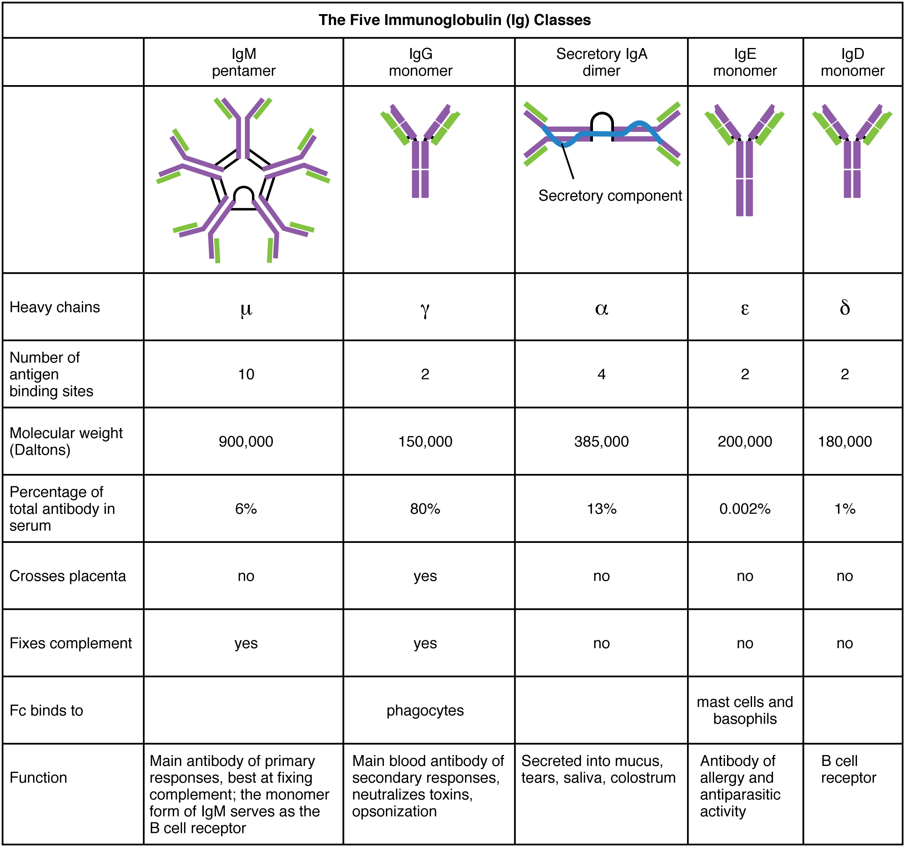
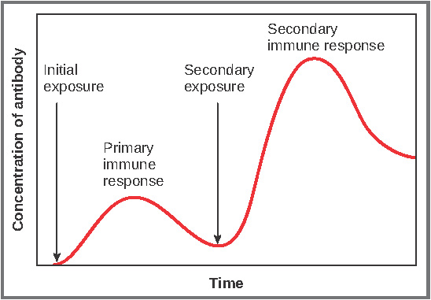

By the end of this section, you will be able to:
* Explain how B cells mature and how B cell tolerance develops
* Discuss how B cells are activated and differentiate into plasma cells
* Describe the structure of the antibody classes and their functions

Antibodies were the first component of the adaptive immune response to be characterized by scientists working on the immune system. It was already known that individuals who survived a bacterial infection were immune to re-infection with the same pathogen. Early microbiologists took serum from an immune patient and mixed it with a fresh culture of the same type of bacteria, then observed the bacteria under a microscope. The bacteria became clumped in a process called agglutination. When a different bacterial species was used, the agglutination did not happen. Thus, there was something in the serum of immune individuals that could specifically bind to and agglutinate bacteria.

Scientists now know the cause of the agglutination is an antibody molecule, also called an **immunoglobulin**{: data-type="term"}. What is an antibody? An antibody protein is essentially a secreted form of a B cell receptor. (In fact, surface immunoglobulin is another name for the B cell receptor.) Not surprisingly, the same genes encode both the secreted antibodies and the surface immunoglobulins. One minor difference in the way these proteins are synthesized distinguishes a naïve B cell with antibody on its surface from an antibody-secreting plasma cell with no antibodies on its surface. The antibodies of the plasma cell have the exact same antigen-binding site and specificity as their B cell precursors.

There are five different classes of antibody found in humans: IgM, IgD, IgG, IgA, and IgE. Each of these has specific functions in the immune response, so by learning about them, researchers can learn about the great variety of antibody functions critical to many adaptive immune responses.

B cells do not recognize antigen in the complex fashion of T cells. B cells can recognize native, unprocessed antigen and do not require the participation of MHC molecules and antigen-presenting cells.

# B Cell Differentiation and Activation

B cells differentiate in the bone marrow. During the process of maturation, up to 100 trillion different clones of B cells are generated, which is similar to the diversity of antigen receptors seen in T cells.

B cell differentiation and the development of tolerance are not quite as well understood as it is in T cells. **Central tolerance**{: data-type="term"} is the destruction or inactivation of B cells that recognize self-antigens in the bone marrow, and its role is critical and well established. In the process of **clonal deletion**{: data-type="term"}, immature B cells that bind strongly to self-antigens expressed on tissues are signaled to commit suicide by apoptosis, removing them from the population. In the process of **clonal anergy**{: data-type="term"}, however, B cells exposed to soluble antigen in the bone marrow are not physically deleted, but become unable to function.

Another mechanism called peripheral tolerance is a direct result of T cell tolerance. In **peripheral tolerance**{: data-type="term"}, functional, mature B cells leave the bone marrow but have yet to be exposed to self-antigen. Most protein antigens require signals from helper T cells (Th2) to proceed to make antibody. When a B cell binds to a self-antigen but receives no signals from a nearby Th2 cell to produce antibody, the cell is signaled to undergo apoptosis and is destroyed. This is yet another example of the control that T cells have over the adaptive immune response.

After B cells are activated by their binding to antigen, they differentiate into plasma cells. Plasma cells often leave the secondary lymphoid organs, where the response is generated, and migrate back to the bone marrow, where the whole differentiation process started. After secreting antibodies for a specific period, they die, as most of their energy is devoted to making antibodies and not to maintaining themselves. Thus, plasma cells are said to be terminally differentiated.

The final B cell of interest is the memory B cell, which results from the clonal expansion of an activated B cell. Memory B cells function in a way similar to memory T cells. They lead to a stronger and faster secondary response when compared to the primary response, as illustrated below.

# Antibody Structure

Antibodies are glycoproteins consisting of two types of polypeptide chains with attached carbohydrates. The **heavy chain**{: data-type="term"} and the **light chain**{: data-type="term"} are the two polypeptides that form the antibody. The main differences between the classes of antibodies are in the differences between their heavy chains, but as you shall see, the light chains have an important role, forming part of the antigen-binding site on the antibody molecules.

## Four-chain Models of Antibody Structures

All antibody molecules have two identical heavy chains and two identical light chains. (Some antibodies contain multiple units of this four-chain structure.) The **Fc region**{: data-type="term"} of the antibody is formed by the two heavy chains coming together, usually linked by disulfide bonds ([\[link\]](#fig-ch22_04_01)). The Fc portion of the antibody is important in that many effector cells of the immune system have Fc receptors. Cells having these receptors can then bind to antibody-coated pathogens, greatly increasing the specificity of the effector cells. At the other end of the molecule are two identical antigen-binding sites.

  and the corresponding three-dimensional structure of the antibody IgG2 (b). (credit b: modification of work by Tim Vickers)"){: #fig-ch22_04_01 data-media-type="image/jpg" data-title="Antibody and IgG2 Structures "}

## Five Classes of Antibodies and their Functions

In general, antibodies have two basic functions. They can act as the B cell antigen receptor or they can be secreted, circulate, and bind to a pathogen, often labeling it for identification by other forms of the immune response. Of the five antibody classes, notice that only two can function as the antigen receptor for naïve B cells: IgM and **IgD**{: data-type="term"} ([\[link\]](#fig-ch22_04_02)). Mature B cells that leave the bone marrow express both IgM and IgD, but both antibodies have the same antigen specificity. Only IgM is secreted, however, and no other nonreceptor function for IgD has been discovered.

 {: #fig-ch22_04_02 data-media-type="image/jpg" data-title="Five Classes of Antibodies "}

**IgM**{: data-type="term"} consists of five four-chain structures (20 total chains with 10 identical antigen-binding sites) and is thus the largest of the antibody molecules. IgM is usually the first antibody made during a primary response. Its 10 antigen-binding sites and large shape allow it to bind well to many bacterial surfaces. It is excellent at binding complement proteins and activating the complement cascade, consistent with its role in promoting chemotaxis, opsonization, and cell lysis. Thus, it is a very effective antibody against bacteria at early stages of a primary antibody response. As the primary response proceeds, the antibody produced in a B cell can change to IgG, IgA, or IgE by the process known as class switching. **Class switching**{: data-type="term"} is the change of one antibody class to another. While the class of antibody changes, the specificity and the antigen-binding sites do not. Thus, the antibodies made are still specific to the pathogen that stimulated the initial IgM response.

**IgG**{: data-type="term"} is a major antibody of late primary responses and the main antibody of secondary responses in the blood. This is because class switching occurs during primary responses. IgG is a monomeric antibody that clears pathogens from the blood and can activate complement proteins (although not as well as IgM), taking advantage of its antibacterial activities. Furthermore, this class of antibody is the one that crosses the placenta to protect the developing fetus from disease exits the blood to the interstitial fluid to fight extracellular pathogens.

**IgA**{: data-type="term"} exists in two forms, a four-chain monomer in the blood and an eight-chain structure, or dimer, in exocrine gland secretions of the mucous membranes, including mucus, saliva, and tears. Thus, dimeric IgA is the only antibody to leave the interior of the body to protect body surfaces. IgA is also of importance to newborns, because this antibody is present in mother’s breast milk (colostrum), which serves to protect the infant from disease.

**IgE**{: data-type="term"} is usually associated with allergies and anaphylaxis. It is present in the lowest concentration in the blood, because its Fc region binds strongly to an IgE-specific Fc receptor on the surfaces of mast cells. IgE makes mast cell degranulation very specific, such that if a person is allergic to peanuts, there will be peanut-specific IgE bound to his or her mast cells. In this person, eating peanuts will cause the mast cells to degranulate, sometimes causing severe allergic reactions, including anaphylaxis, a severe, systemic allergic response that can cause death.

## Clonal Selection of B Cells

Clonal selection and expansion work much the same way in B cells as in T cells. Only B cells with appropriate antigen specificity are selected for and expanded ([\[link\]](#fig-ch22_04_03)). Eventually, the plasma cells secrete antibodies with antigenic specificity identical to those that were on the surfaces of the selected B cells. Notice in the figure that both plasma cells and memory B cells are generated simultaneously.

 {: #fig-ch22_04_03 data-media-type="image/jpg" data-title="Clonal Selection of B Cells "}

## Primary versus Secondary B Cell Responses

Primary and secondary responses as they relate to T cells were discussed earlier. This section will look at these responses with B cells and antibody production. Because antibodies are easily obtained from blood samples, they are easy to follow and graph ([\[link\]](#fig-ch22_04_04)). As you will see from the figure, the primary response to an antigen (representing a pathogen) is delayed by several days. This is the time it takes for the B cell clones to expand and differentiate into plasma cells. The level of antibody produced is low, but it is sufficient for immune protection. The second time a person encounters the same antigen, there is no time delay, and the amount of antibody made is much higher. Thus, the secondary antibody response overwhelms the pathogens quickly and, in most situations, no symptoms are felt. When a different antigen is used, another primary response is made with its low antibody levels and time delay.

 {: #fig-ch22_04_04 data-media-type="image/jpg" data-title="Primary and Secondary Antibody Responses"}

# Active versus Passive Immunity

Immunity to pathogens, and the ability to control pathogen growth so that damage to the tissues of the body is limited, can be acquired by (1) the active development of an immune response in the infected individual or (2) the passive transfer of immune components from an immune individual to a nonimmune one. Both active and passive immunity have examples in the natural world and as part of medicine.

**Active immunity**{: data-type="term"} is the resistance to pathogens acquired during an adaptive immune response within an individual ([\[link\]](#tbl-ch22_06)). Naturally acquired active immunity, the response to a pathogen, is the focus of this chapter. Artificially acquired active immunity involves the use of vaccines. A vaccine is a killed or weakened pathogen or its components that, when administered to a healthy individual, leads to the development of immunological memory (a weakened primary immune response) without causing much in the way of symptoms. Thus, with the use of vaccines, one can avoid the damage from disease that results from the first exposure to the pathogen, yet reap the benefits of protection from immunological memory. The advent of vaccines was one of the major medical advances of the twentieth century and led to the eradication of smallpox and the control of many infectious diseases, including polio, measles, and whooping cough.

<table id="tbl-ch22_06" summary=""><thead>
<tr>
<th colspan="3">Active versus Passive Immunity</th>
</tr>
<tr>
<th />
<th>Natural</th>
<th>Artificial</th>
</tr>
</thead><tbody>
<tr>
<td><strong>Active</strong></td>
<td>Adaptive immune response</td>
<td>Vaccine response</td>
</tr>
<tr>
<td><strong>Passive</strong></td>
<td>Trans-placental antibodies/breastfeeding</td>
<td>Immune globulin injections</td>
</tr>
</tbody></table>

**Passive immunity**{: data-type="term"} arises from the transfer of antibodies to an individual without requiring them to mount their own active immune response. Naturally acquired passive immunity is seen during fetal development. IgG is transferred from the maternal circulation to the fetus via the placenta, protecting the fetus from infection and protecting the newborn for the first few months of its life. As already stated, a newborn benefits from the IgA antibodies it obtains from milk during breastfeeding. The fetus and newborn thus benefit from the immunological memory of the mother to the pathogens to which she has been exposed. In medicine, artificially acquired passive immunity usually involves injections of immunoglobulins, taken from animals previously exposed to a specific pathogen. This treatment is a fast-acting method of temporarily protecting an individual who was possibly exposed to a pathogen. The downside to both types of passive immunity is the lack of the development of immunological memory. Once the antibodies are transferred, they are effective for only a limited time before they degrade.

 {: data-media-type="image/png"} 
Immunity can be acquired in an active or passive way, and it can be natural or artificial. Watch this [video][1] to see an animated discussion of passive and active immunity. What is an example of natural immunity acquired passively?

# T cell-dependent versus T cell-independent Antigens

As discussed previously, Th2 cells secrete cytokines that drive the production of antibodies in a B cell, responding to complex antigens such as those made by proteins. On the other hand, some antigens are T cell independent. A **T cell-independent antigen**{: data-type="term"} usually is in the form of repeated carbohydrate moieties found on the cell walls of bacteria. Each antibody on the B cell surface has two binding sites, and the repeated nature of T cell-independent antigen leads to crosslinking of the surface antibodies on the B cell. The crosslinking is enough to activate it in the absence of T cell cytokines.

A **T cell-dependent antigen**{: data-type="term"}, on the other hand, usually is not repeated to the same degree on the pathogen and thus does not crosslink surface antibody with the same efficiency. To elicit a response to such antigens, the B and T cells must come close together ([\[link\]](#fig-ch22_04_05)). The B cell must receive two signals to become activated. Its surface immunoglobulin must recognize native antigen. Some of this antigen is internalized, processed, and presented to the Th2 cells on a class II MHC molecule. The T cell then binds using its antigen receptor and is activated to secrete cytokines that diffuse to the B cell, finally activating it completely. Thus, the B cell receives signals from both its surface antibody and the T cell via its cytokines, and acts as a professional antigen-presenting cell in the process.

 {: #fig-ch22_04_05 data-media-type="image/jpg" data-title="T and B Cell Binding "}

# Chapter Review

B cells, which develop within the bone marrow, are responsible for making five different classes of antibodies, each with its own functions. B cells have their own mechanisms for tolerance, but in peripheral tolerance, the B cells that leave the bone marrow remain inactive due to T cell tolerance. Some B cells do not need T cell cytokines to make antibody, and they bypass this need by the crosslinking of their surface immunoglobulin by repeated carbohydrate residues found in the cell walls of many bacterial species. Others require T cells to become activated.

# Interactive Link Questions

Immunity can be acquired in an active or passive way, and it can be natural or artificial. Watch this [video][1] to see an animated discussion of passive and active immunity. What is an example of natural immunity acquired passively?

Breastfeeding is an example of natural immunity acquired passively.

# Review Chapter

Removing functionality from a B cell without killing it is called \_\_\_\_\_\_\_\_.

1.  clonal selection
2.  clonal expansion
3.  clonal deletion
4.  clonal anergy
{: data-number-style="lower-alpha"}

D

Which class of antibody crosses the placenta in pregnant women?

1.  IgM
2.  IgA
3.  IgE
4.  IgG
{: data-number-style="lower-alpha"}

D

Which class of antibody has no known function other than as an antigen receptor?

1.  IgM
2.  IgA
3.  IgE
4.  IgD
{: data-number-style="lower-alpha"}

D

When does class switching occur?

1.  primary response
2.  secondary response
3.  tolerance
4.  memory response
{: data-number-style="lower-alpha"}

A

Which class of antibody is found in mucus?

1.  IgM
2.  IgA
3.  IgE
4.  IgD
{: data-number-style="lower-alpha"}

B

# Critical Thinking Questions

Describe how secondary B cell responses are developed.

B cells activated during a primary response differentiate either into terminally differentiated plasma cells or into memory B cells. These memory B cells are what respond during a secondary or memory antibody response.

Describe the role of IgM in immunity.

IgM is an antigen receptor on naïve B cells. Upon activation, naïve B cells make IgM first. IgM is good at binding complement and thus has good antibacterial effects. IgM is replaced with other classes of antibodies later on in the primary response due to class switching.

[1]: http://openstaxcollege.org/l/immunity
