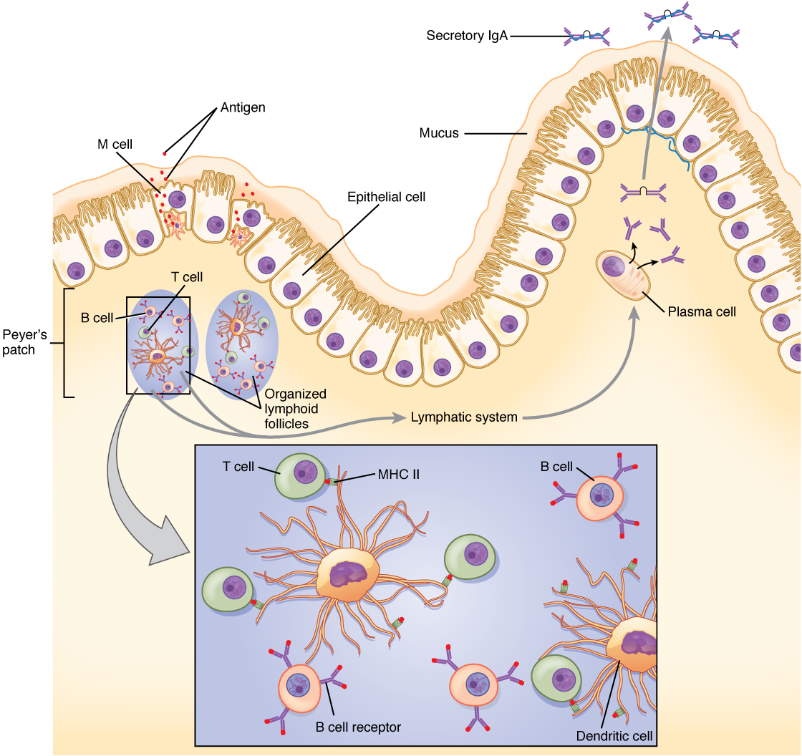

By the end of this section, you will be able to:
* Explain the development of immunological competence
* Describe the mucosal immune response
* Discuss immune responses against bacterial, viral, fungal, and animal pathogens
* Describe different ways pathogens evade immune responses

Now that you understand the development of mature, naïve B cells and T cells, and some of their major functions, how do all of these various cells, proteins, and cytokines come together to actually resolve an infection? Ideally, the immune response will rid the body of a pathogen entirely. The adaptive immune response, with its rapid clonal expansion, is well suited to this purpose. Think of a primary infection as a race between the pathogen and the immune system. The pathogen bypasses barrier defenses and starts multiplying in the host’s body. During the first 4 to 5 days, the innate immune response will partially control, but not stop, pathogen growth. As the adaptive immune response gears up, however, it will begin to clear the pathogen from the body, while at the same time becoming stronger and stronger. When following antibody responses in patients with a particular disease such as a virus, this clearance is referred to as seroconversion (sero- = “serum”). **Seroconversion**{: data-type="term"} is the reciprocal relationship between virus levels in the blood and antibody levels. As the antibody levels rise, the virus levels decline, and this is a sign that the immune response is being at least partially effective (partially, because in many diseases, seroconversion does not necessarily mean a patient is getting well).

An excellent example of this is seroconversion during HIV disease ([\[link\]](#fig-ch22_05_01)). Notice that antibodies are made early in this disease, and the increase in anti-HIV antibodies correlates with a decrease in detectable virus in the blood. Although these antibodies are an important marker for diagnosing the disease, they are not sufficient to completely clear the virus. Several years later, the vast majority of these individuals, if untreated, will lose their entire adaptive immune response, including the ability to make antibodies, during the final stages of AIDS.

 {: #fig-ch22_05_01 data-title="HIV Disease Progression "}

Everyday Connection

Disinfectants: Fighting the Good Fight? “Wash your hands!” Parents have been telling their children this for generations. Dirty hands can spread disease. But is it possible to get rid of enough pathogens that children will never get sick? Are children who avoid exposure to pathogens better off? The answers to both these questions appears to be no.

Antibacterial wipes, soaps, gels, and even toys with antibacterial substances embedded in their plastic are ubiquitous in our society. Still, these products do not rid the skin and gastrointestinal tract of bacteria, and it would be harmful to our health if they did. We need these nonpathogenic bacteria on and within our bodies to keep the pathogenic ones from growing. The urge to keep children perfectly clean is thus probably misguided. Children will get sick anyway, and the later benefits of immunological memory far outweigh the minor discomforts of most childhood diseases. In fact, getting diseases such as chickenpox or measles later in life is much harder on the adult and are associated with symptoms significantly worse than those seen in the childhood illnesses. Of course, vaccinations help children avoid some illnesses, but there are so many pathogens, we will never be immune to them all.

Could over-cleanliness be the reason that allergies are increasing in more developed countries? Some scientists think so. Allergies are based on an IgE antibody response. Many scientists think the system evolved to help the body rid itself of worm parasites. The hygiene theory is the idea that the immune system is geared to respond to antigens, and if pathogens are not present, it will respond instead to inappropriate antigens such as allergens and self-antigens. This is one explanation for the rising incidence of allergies in developed countries, where the response to nonpathogens like pollen, shrimp, and cat dander cause allergic responses while not serving any protective function.

# The Mucosal Immune Response

Mucosal tissues are major barriers to the entry of pathogens into the body. The IgA (and sometimes IgM) antibodies in mucus and other secretions can bind to the pathogen, and in the cases of many viruses and bacteria, neutralize them. **Neutralization**{: data-type="term"} is the process of coating a pathogen with antibodies, making it physically impossible for the pathogen to bind to receptors. Neutralization, which occurs in the blood, lymph, and other body fluids and secretions, protects the body constantly. Neutralizing antibodies are the basis for the disease protection offered by vaccines. Vaccinations for diseases that commonly enter the body via mucous membranes, such as influenza, are usually formulated to enhance IgA production.

Immune responses in some mucosal tissues such as the Peyer’s patches (see [\[link\]](/m46563#fig-ch22_01_10)) in the small intestine take up particulate antigens by specialized cells known as microfold or M cells ([\[link\]](#fig-ch22_05_02)). These cells allow the body to sample potential pathogens from the intestinal lumen. Dendritic cells then take the antigen to the regional lymph nodes, where an immune response is mounted.

{: #fig-ch22_05_02 data-title="IgA Immunity "}

# Defenses against Bacteria and Fungi

The body fights bacterial pathogens with a wide variety of immunological mechanisms, essentially trying to find one that is effective. Bacteria such as *Mycobacterium leprae*, the cause of leprosy, are resistant to lysosomal enzymes and can persist in macrophage organelles or escape into the cytosol. In such situations, infected macrophages receiving cytokine signals from Th1 cells turn on special metabolic pathways. **Macrophage oxidative metabolism**{: data-type="term"} is hostile to intracellular bacteria, often relying on the production of nitric oxide to kill the bacteria inside the macrophage.

Fungal infections, such as those from *Aspergillus*, *Candida*, and *Pneumocystis*, are largely opportunistic infections that take advantage of suppressed immune responses. Most of the same immune mechanisms effective against bacteria have similar effects on fungi, both of which have characteristic cell wall structures that protect their cells.

# Defenses against Parasites

Worm parasites such as helminths are seen as the primary reason why the mucosal immune response, IgE-mediated allergy and asthma, and eosinophils evolved. These parasites were at one time very common in human society. When infecting a human, often via contaminated food, some worms take up residence in the gastrointestinal tract. Eosinophils are attracted to the site by T cell cytokines, which release their granule contents upon their arrival. Mast cell degranulation also occurs, and the fluid leakage caused by the increase in local vascular permeability is thought to have a flushing action on the parasite, expelling its larvae from the body. Furthermore, if IgE labels the parasite, the eosinophils can bind to it by its Fc receptor.

# Defenses against Viruses

The primary mechanisms against viruses are NK cells, interferons, and cytotoxic T cells. Antibodies are effective against viruses mostly during protection, where an immune individual can neutralize them based on a previous exposure. Antibodies have no effect on viruses or other intracellular pathogens once they enter the cell, since antibodies are not able to penetrate the plasma membrane of the cell. Many cells respond to viral infections by downregulating their expression of MHC class I molecules. This is to the advantage of the virus, because without class I expression, cytotoxic T cells have no activity. NK cells, however, can recognize virally infected class I-negative cells and destroy them. Thus, NK and cytotoxic T cells have complementary activities against virally infected cells.

Interferons have activity in slowing viral replication and are used in the treatment of certain viral diseases, such as hepatitis B and C, but their ability to eliminate the virus completely is limited. The cytotoxic T cell response, though, is key, as it eventually overwhelms the virus and kills infected cells before the virus can complete its replicative cycle. Clonal expansion and the ability of cytotoxic T cells to kill more than one target cell make these cells especially effective against viruses. In fact, without cytotoxic T cells, it is likely that humans would all die at some point from a viral infection (if no vaccine were available).

# Evasion of the Immune System by Pathogens

It is important to keep in mind that although the immune system has evolved to be able to control many pathogens, pathogens themselves have evolved ways to evade the immune response. An example already mentioned is in *Mycobactrium tuberculosis*, which has evolved a complex cell wall that is resistant to the digestive enzymes of the macrophages that ingest them, and thus persists in the host, causing the chronic disease tuberculosis. This section briefly summarizes other ways in which pathogens can “outwit” immune responses. But keep in mind, although it seems as if pathogens have a will of their own, they do not. All of these evasive “strategies” arose strictly by evolution, driven by selection.

Bacteria sometimes evade immune responses because they exist in multiple strains, such as different groups of *Staphylococcus aureus*. *S. aureus* is commonly found in minor skin infections, such as boils, and some healthy people harbor it in their nose. One small group of strains of this bacterium, however, called methicillin-resistant *Staphylococcus aureus*, has become resistant to multiple antibiotics and is essentially untreatable. Different bacterial strains differ in the antigens on their surfaces. The immune response against one strain (antigen) does not affect the other; thus, the species survives.

Another method of immune evasion is mutation. Because viruses’ surface molecules mutate continuously, viruses like influenza change enough each year that the flu vaccine for one year may not protect against the flu common to the next. New vaccine formulations must be derived for each flu season.

Genetic recombination—the combining of gene segments from two different pathogens—is an efficient form of immune evasion. For example, the influenza virus contains gene segments that can recombine when two different viruses infect the same cell. Recombination between human and pig influenza viruses led to the 2010 H1N1 swine flu outbreak.

Pathogens can produce immunosuppressive molecules that impair immune function, and there are several different types. Viruses are especially good at evading the immune response in this way, and many types of viruses have been shown to suppress the host immune response in ways much more subtle than the wholesale destruction caused by HIV.

# Chapter Review

Early childhood is a time when the body develops much of its immunological memory that protects it from diseases in adulthood. The components of the immune response that have the maximum effectiveness against a pathogen are often associated with the class of pathogen involved. Bacteria and fungi are especially susceptible to damage by complement proteins, whereas viruses are taken care of by interferons and cytotoxic T cells. Worms are attacked by eosinophils. Pathogens have shown the ability, however, to evade the body’s immune responses, some leading to chronic infections or even death. The immune system and pathogens are in a slow, evolutionary race to see who stays on top. Modern medicine, hopefully, will keep the results skewed in humans’ favor.

# Review Questions

Which enzymes in macrophages are important for clearing intracellular bacteria?

1.  metabolic
2.  mitochondrial
3.  nuclear
4.  lysosomal
{: data-number-style="lower-alpha"}

D

What type of chronic lung disease is caused by a *Mycobacterium*?

1.  asthma
2.  emphysema
3.  tuberculosis
4.  leprosy
{: data-number-style="lower-alpha"}

C

Which type of immune response is most *directly* effective against bacteria?

1.  natural killer cells
2.  complement
3.  cytotoxic T cells
4.  helper T cells
{: data-number-style="lower-alpha"}

B

What is the reason that you have to be immunized with a new influenza vaccine each year?

1.  the vaccine is only protective for a year
2.  mutation
3.  macrophage oxidative metabolism
4.  memory response
{: data-number-style="lower-alpha"}

B

Which type of immune response works in concert with cytotoxic T cells against virally infected cells?

1.  natural killer cells
2.  complement
3.  antibodies
4.  memory
{: data-number-style="lower-alpha"}

A

# Critical Thinking Questions

Describe how seroconversion works in HIV disease.

Seroconversion is the clearance of virus in the serum due to the increase in specific serum antibody levels. Seroconversion happens in the early stages of HIV disease. Unfortunately, the antibody cannot completely clear the virus from the body and thus it most often progresses to AIDS.

Describe tuberculosis and the innocent bystander effect.

Tuberculosis is caused by bacteria resistant to lysosomal enzymes in alveolar macrophages, resulting in chronic infection. The immune response to these bacteria actually causes most of the lung damage that is characteristic of this life-threatening disease.

## Glossary
{: data-type="glossary-title"}

macrophage oxidative metabolism
: metabolism turned on in macrophages by T cell signals that help destroy intracellular bacteria
{: .definition}

neutralization
: inactivation of a virus by the binding of specific antibody
{: .definition}

seroconversion
: clearance of pathogen in the serum and the simultaneous rise of serum antibody
{: .definition}

