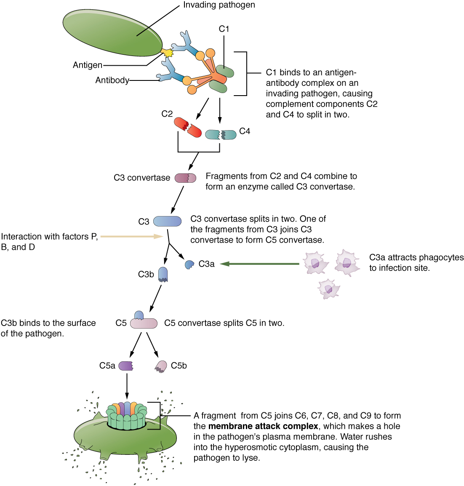

By the end of this section, you will be able to:
* Describe the barrier defenses of the body
* Show how the innate immune response is important and how it helps guide and prepare the body for adaptive immune responses
* Describe various soluble factors that are part of the innate immune response
* Explain the steps of inflammation and how they lead to destruction of a pathogen
* Discuss early induced immune responses and their level of effectiveness

The immune system can be divided into two overlapping mechanisms to destroy pathogens: the innate immune response, which is relatively rapid but nonspecific and thus not always effective, and the adaptive immune response, which is slower in its development during an initial infection with a pathogen, but is highly specific and effective at attacking a wide variety of pathogens ([\[link\]](#fig-ch22_02_01)).

 {: #fig-ch22_02_01 data-title="Cooperation between Innate and Adaptive Immune Responses "}

Any discussion of the innate immune response usually begins with the physical barriers that prevent pathogens from entering the body, destroy them after they enter, or flush them out before they can establish themselves in the hospitable environment of the body’s soft tissues. Barrier defenses are part of the body’s most basic defense mechanisms. The barrier defenses are not a response to infections, but they are continuously working to protect against a broad range of pathogens.

The different modes of barrier defenses are associated with the external surfaces of the body, where pathogens may try to enter ([\[link\]](#tbl-ch22_02)). The primary barrier to the entrance of microorganisms into the body is the skin. Not only is the skin covered with a layer of dead, keratinized epithelium that is too dry for bacteria in which to grow, but as these cells are continuously sloughed off from the skin, they carry bacteria and other pathogens with them. Additionally, sweat and other skin secretions may lower pH, contain toxic lipids, and physically wash microbes away.

<table id="tbl-ch22_02" summary=""><thead>
<tr>
<th colspan="3">Barrier Defenses</th>
</tr>
<tr>
<th>Site</th>
<th>Specific defense</th>
<th>Protective aspect</th>
</tr>
</thead><tbody>
<tr><td>Skin</td>
<td>Epidermal surface</td>
<td>Keratinized cells of surface, Langerhans cells</td>
</tr>
<tr>
<td>Skin (sweat/secretions)</td>
<td>Sweat glands, sebaceous glands</td>
<td>Low pH, washing action</td>
</tr>
<tr>
<td>Oral cavity</td>
<td>Salivary glands</td>
<td>Lysozyme</td>
</tr>
<tr>
<td>Stomach</td>
<td>Gastrointestinal tract</td>
<td>Low pH</td>
</tr>
<tr>
<td>Mucosal surfaces</td>
<td>Mucosal epithelium</td>
<td>Nonkeratinized epithelial cells</td>
</tr>
<tr>
<td>Normal flora (nonpathogenic bacteria)</td>
<td>Mucosal tissues</td>
<td>Prevent pathogens from growing on mucosal surfaces</td>
</tr>
</tbody></table>

Another barrier is the saliva in the mouth, which is rich in lysozyme—an enzyme that destroys bacteria by digesting their cell walls. The acidic environment of the stomach, which is fatal to many pathogens, is also a barrier. Additionally, the mucus layer of the gastrointestinal tract, respiratory tract, reproductive tract, eyes, ears, and nose traps both microbes and debris, and facilitates their removal. In the case of the upper respiratory tract, ciliated epithelial cells move potentially contaminated mucus upwards to the mouth, where it is then swallowed into the digestive tract, ending up in the harsh acidic environment of the stomach. Considering how often you breathe compared to how often you eat or perform other activities that expose you to pathogens, it is not surprising that multiple barrier mechanisms have evolved to work in concert to protect this vital area.

# Cells of the Innate Immune Response

A phagocyte is a cell that is able to surround and engulf a particle or cell, a process called **phagocytosis**{: data-type="term"}. The phagocytes of the immune system engulf other particles or cells, either to clean an area of debris, old cells, or to kill pathogenic organisms such as bacteria. The phagocytes are the body’s fast acting, first line of immunological defense against organisms that have breached barrier defenses and have entered the vulnerable tissues of the body.

## Phagocytes: Macrophages and Neutrophils

Many of the cells of the immune system have a phagocytic ability, at least at some point during their life cycles. Phagocytosis is an important and effective mechanism of destroying pathogens during innate immune responses. The phagocyte takes the organism inside itself as a phagosome, which subsequently fuses with a lysosome and its digestive enzymes, effectively killing many pathogens. On the other hand, some bacteria including *Mycobacteria tuberculosis*, the cause of tuberculosis, may be resistant to these enzymes and are therefore much more difficult to clear from the body. Macrophages, neutrophils, and dendritic cells are the major phagocytes of the immune system.

A **macrophage**{: data-type="term"} is an irregularly shaped phagocyte that is amoeboid in nature and is the most versatile of the phagocytes in the body. Macrophages move through tissues and squeeze through capillary walls using pseudopodia. They not only participate in innate immune responses but have also evolved to cooperate with lymphocytes as part of the adaptive immune response. Macrophages exist in many tissues of the body, either freely roaming through connective tissues or fixed to reticular fibers within specific tissues such as lymph nodes. When pathogens breach the body’s barrier defenses, macrophages are the first line of defense ([\[link\]](#tbl-ch22_03)). They are called different names, depending on the tissue: Kupffer cells in the liver, histiocytes in connective tissue, and alveolar macrophages in the lungs.

A **neutrophil**{: data-type="term"} is a phagocytic cell that is attracted via chemotaxis from the bloodstream to infected tissues. These spherical cells are granulocytes. A granulocyte contains cytoplasmic granules, which in turn contain a variety of vasoactive mediators such as histamine. In contrast, macrophages are agranulocytes. An agranulocyte has few or no cytoplasmic granules. Whereas macrophages act like sentries, always on guard against infection, neutrophils can be thought of as military reinforcements that are called into a battle to hasten the destruction of the enemy. Although, usually thought of as the primary pathogen-killing cell of the inflammatory process of the innate immune response, new research has suggested that neutrophils play a role in the adaptive immune response as well, just as macrophages do.

A **monocyte**{: data-type="term"} is a circulating precursor cell that differentiates into either a macrophage or dendritic cell, which can be rapidly attracted to areas of infection by signal molecules of inflammation.

<table id="tbl-ch22_03" summary=""><thead>
<tr>
<th colspan="4">Phagocytic Cells of the Innate Immune System</th>
</tr>
<tr>
<th>Cell</th>
<th>Cell type</th>
<th>Primary location</th>
<th>Function in the innate immune response</th>
</tr>
</thead><tbody>
<tr>
<td>Macrophage</td>
<td>Agranulocyte</td>
<td>Body cavities/organs</td>
<td>Phagocytosis</td>
</tr>
<tr>
<td>Neutrophil</td>
<td>Granulocyte</td>
<td>Blood</td>
<td>Phagocytosis</td>
</tr>
<tr>
<td>Monocyte</td>
<td>Agranulocyte</td>
<td>Blood</td>
<td>Precursor of macrophage/dendritic cell</td>
</tr>
</tbody></table>

## Natural Killer Cells

NK cells are a type of lymphocyte that have the ability to induce apoptosis, that is, programmed cell death, in cells infected with intracellular pathogens such as obligate intracellular bacteria and viruses. NK cells recognize these cells by mechanisms that are still not well understood, but that presumably involve their surface receptors. NK cells can induce apoptosis, in which a cascade of events inside the cell causes its own death by either of two mechanisms:

1) NK cells are able to respond to chemical signals and express the fas ligand. The **fas ligand**{: data-type="term"} is a surface molecule that binds to the fas molecule on the surface of the infected cell, sending it apoptotic signals, thus killing the cell and the pathogen within it; or

2) The granules of the NK cells release perforins and granzymes. A **perforin**{: data-type="term"} is a protein that forms pores in the membranes of infected cells. A **granzyme**{: data-type="term"} is a protein-digesting enzyme that enters the cell via the perforin pores and triggers apoptosis intracellularly.

Both mechanisms are especially effective against virally infected cells. If apoptosis is induced before the virus has the ability to synthesize and assemble all its components, no infectious virus will be released from the cell, thus preventing further infection.

# Recognition of Pathogens

Cells of the innate immune response, the phagocytic cells, and the cytotoxic NK cells recognize patterns of pathogen-specific molecules, such as bacterial cell wall components or bacterial flagellar proteins, using pattern recognition receptors. A **pattern recognition receptor (PRR)**{: data-type="term"} is a membrane-bound receptor that recognizes characteristic features of a pathogen and molecules released by stressed or damaged cells.

These receptors, which are thought to have evolved prior to the adaptive immune response, are present on the cell surface whether they are needed or not. Their variety, however, is limited by two factors. First, the fact that each receptor type must be encoded by a specific gene requires the cell to allocate most or all of its DNA to make receptors able to recognize all pathogens. Secondly, the variety of receptors is limited by the finite surface area of the cell membrane. Thus, the innate immune system must “get by” using only a limited number of receptors that are active against as wide a variety of pathogens as possible. This strategy is in stark contrast to the approach used by the adaptive immune system, which uses large numbers of different receptors, each highly specific to a particular pathogen.

Should the cells of the innate immune system come into contact with a species of pathogen they recognize, the cell will bind to the pathogen and initiate phagocytosis (or cellular apoptosis in the case of an intracellular pathogen) in an effort to destroy the offending microbe. Receptors vary somewhat according to cell type, but they usually include receptors for bacterial components and for complement, discussed below.

# Soluble Mediators of the Innate Immune Response

The previous discussions have alluded to chemical signals that can induce cells to change various physiological characteristics, such as the expression of a particular receptor. These soluble factors are secreted during innate or early induced responses, and later during adaptive immune responses.

## Cytokines and Chemokines

A **cytokine**{: data-type="term"} is signaling molecule that allows cells to communicate with each other over short distances. Cytokines are secreted into the intercellular space, and the action of the cytokine induces the receiving cell to change its physiology. A **chemokine**{: data-type="term"} is a soluble chemical mediator similar to cytokines except that its function is to attract cells (chemotaxis) from longer distances.

  
Visit this [website][1] to learn about phagocyte chemotaxis. Phagocyte chemotaxis is the movement of phagocytes according to the secretion of chemical messengers in the form of interleukins and other chemokines. By what means does a phagocyte destroy a bacterium that it has ingested?

## Early induced Proteins

Early induced proteins are those that are not constitutively present in the body, but are made as they are needed early during the innate immune response. **Interferons**{: data-type="term"} are an example of early induced proteins. Cells infected with viruses secrete interferons that travel to adjacent cells and induce them to make antiviral proteins. Thus, even though the initial cell is sacrificed, the surrounding cells are protected. Other early induced proteins specific for bacterial cell wall components are mannose-binding protein and C-reactive protein, made in the liver, which bind specifically to polysaccharide components of the bacterial cell wall. Phagocytes such as macrophages have receptors for these proteins, and they are thus able to recognize them as they are bound to the bacteria. This brings the phagocyte and bacterium into close proximity and enhances the phagocytosis of the bacterium by the process known as opsonization. **Opsonization**{: data-type="term"} is the tagging of a pathogen for phagocytosis by the binding of an antibody or an antimicrobial protein.

## Complement System

The **complement**{: data-type="term"} system is a series of proteins constitutively found in the blood plasma. As such, these proteins are not considered part of the **early induced immune response**{: data-type="term"}, even though they share features with some of the antibacterial proteins of this class. Made in the liver, they have a variety of functions in the innate immune response, using what is known as the “alternate pathway” of complement activation. Additionally, complement functions in the adaptive immune response as well, in what is called the classical pathway. The complement system consists of several proteins that enzymatically alter and fragment later proteins in a series, which is why it is termed cascade. Once activated, the series of reactions is irreversible, and releases fragments that have the following actions:

* Bind to the cell membrane of the pathogen that activates it, labeling it for phagocytosis (opsonization)
* Diffuse away from the pathogen and act as chemotactic agents to attract phagocytic cells to the site of inflammation
* Form damaging pores in the plasma membrane of the pathogen

[\[link\]](#fig-ch22_02_02) shows the classical pathway, which requires antibodies of the adaptive immune response. The alternate pathway does not require an antibody to become activated.

{: #fig-ch22_02_02 data-title="Complement Cascade and Function"}

The splitting of the C3 protein is the common step to both pathways. In the alternate pathway, C3 is activated spontaneously and, after reacting with the molecules factor P, factor B, and factor D, splits apart. The larger fragment, C3b, binds to the surface of the pathogen and C3a, the smaller fragment, diffuses outward from the site of activation and attracts phagocytes to the site of infection. Surface-bound C3b then activates the rest of the cascade, with the last five proteins, C5–C9, forming the membrane-attack complex (MAC). The MAC can kill certain pathogens by disrupting their osmotic balance. The MAC is especially effective against a broad range of bacteria. The classical pathway is similar, except the early stages of activation require the presence of antibody bound to antigen, and thus is dependent on the adaptive immune response. The earlier fragments of the cascade also have important functions. Phagocytic cells such as macrophages and neutrophils are attracted to an infection site by chemotactic attraction to smaller complement fragments. Additionally, once they arrive, their receptors for surface-bound C3b opsonize the pathogen for phagocytosis and destruction.

# Inflammatory Response

The hallmark of the innate immune response is **inflammation**{: data-type="term"}. Inflammation is something everyone has experienced. Stub a toe, cut a finger, or do any activity that causes tissue damage and inflammation will result, with its four characteristics: heat, redness, pain, and swelling (“loss of function” is sometimes mentioned as a fifth characteristic). It is important to note that inflammation does not have to be initiated by an infection, but can also be caused by tissue injuries. The release of damaged cellular contents into the site of injury is enough to stimulate the response, even in the absence of breaks in physical barriers that would allow pathogens to enter (by hitting your thumb with a hammer, for example). The inflammatory reaction brings in phagocytic cells to the damaged area to clear cellular debris and to set the stage for wound repair ([\[link\]](#fig-ch22_02_03)).

 {: #fig-ch22_02_03}

This reaction also brings in the cells of the innate immune system, allowing them to get rid of the sources of a possible infection. Inflammation is part of a very basic form of immune response. The process not only brings fluid and cells into the site to destroy the pathogen and remove it and debris from the site, but also helps to isolate the site, limiting the spread of the pathogen. **Acute inflammation**{: data-type="term"} is a short-term inflammatory response to an insult to the body. If the cause of the inflammation is not resolved, however, it can lead to chronic inflammation, which is associated with major tissue destruction and fibrosis. **Chronic inflammation**{: data-type="term"} is ongoing inflammation. It can be caused by foreign bodies, persistent pathogens, and autoimmune diseases such as rheumatoid arthritis.

There are four important parts to the inflammatory response:

* *Tissue Injury.* The released contents of injured cells stimulate the release of **mast cell**{: data-type="term"} granules and their potent inflammatory mediators such as histamine, leukotrienes, and prostaglandins. **Histamine**{: data-type="term"} increases the diameter of local blood vessels (vasodilation), causing an increase in blood flow. Histamine also increases the permeability of local capillaries, causing plasma to leak out and form interstitial fluid. This causes the swelling associated with inflammation.
  * * *
  {: data-type="newline" data-count="1"}
  
  Additionally, injured cells, phagocytes, and basophils are sources of inflammatory mediators, including prostaglandins and leukotrienes. Leukotrienes attract neutrophils from the blood by chemotaxis and increase vascular permeability. Prostaglandins cause vasodilation by relaxing vascular smooth muscle and are a major cause of the pain associated with inflammation. Nonsteroidal anti-inflammatory drugs such as aspirin and ibuprofen relieve pain by inhibiting prostaglandin production.
* *Vasodilation.* Many inflammatory mediators such as histamine are vasodilators that increase the diameters of local capillaries. This causes increased blood flow and is responsible for the heat and redness of inflamed tissue. It allows greater access of the blood to the site of inflammation.
* *Increased Vascular Permeability.* At the same time, inflammatory mediators increase the permeability of the local vasculature, causing leakage of fluid into the interstitial space, resulting in the swelling, or edema, associated with inflammation.
* *Recruitment of Phagocytes.* Leukotrienes are particularly good at attracting neutrophils from the blood to the site of infection by chemotaxis. Following an early neutrophil infiltrate stimulated by macrophage cytokines, more macrophages are recruited to clean up the debris left over at the site. When local infections are severe, neutrophils are attracted to the sites of infections in large numbers, and as they phagocytose the pathogens and subsequently die, their accumulated cellular remains are visible as pus at the infection site.

Overall, inflammation is valuable for many reasons. Not only are the pathogens killed and debris removed, but the increase in vascular permeability encourages the entry of clotting factors, the first step towards wound repair. Inflammation also facilitates the transport of antigen to lymph nodes by dendritic cells for the development of the adaptive immune response.

# Chapter Review

Innate immune responses are critical to the early control of infections. Whereas barrier defenses are the body’s first line of physical defense against pathogens, innate immune responses are the first line of physiological defense. Innate responses occur rapidly, but with less specificity and effectiveness than the adaptive immune response. Innate responses can be caused by a variety of cells, mediators, and antibacterial proteins such as complement. Within the first few days of an infection, another series of antibacterial proteins are induced, each with activities against certain bacteria, including opsonization of certain species. Additionally, interferons are induced that protect cells from viruses in their vicinity. Finally, the innate immune response does not stop when the adaptive immune response is developed. In fact, both can cooperate and one can influence the other in their responses against pathogens.

# Interactive Link Questions

Visit this [website][1] to learn about phagocyte chemotaxis. Phagocyte chemotaxis is the movement of phagocytes according to the secretion of chemical messengers in the form of interleukins and other chemokines. By what means does a phagocyte destroy a bacterium that it has ingested?

The bacterium is digested by the phagocyte’s digestive enzymes (contained in its lysosomes).

# Review Questions

Which of the following signs is *not* characteristic of inflammation?

1.  redness
2.  pain
3.  cold
4.  swelling
{: data-number-style="lower-alpha"}

C

Which of the following is *not* important in the antiviral innate immune response?

1.  interferons
2.  natural killer cells
3.  complement
4.  microphages
{: data-number-style="lower-alpha"}

D

Enhanced phagocytosis of a cell by the binding of a specific protein is called \_\_\_\_\_\_\_\_.

1.  endocytosis
2.  opsonization
3.  anaphylaxis
4.  complement activation
{: data-number-style="lower-alpha"}

B

Which of the following leads to the redness of inflammation?

1.  increased vascular permeability
2.  anaphylactic shock
3.  increased blood flow
4.  complement activation
{: data-number-style="lower-alpha"}

C

# Critical Thinking Questions

Describe the process of inflammation in an area that has been traumatized, but not infected.

The cell debris and damaged cells induce macrophages to begin to clean them up. Macrophages release cytokines that attract neutrophils, followed by more macrophages. Other mediators released by mast cells increase blood flow to the area and also vascular permeability, allowing the recruited cells to get from the blood to the site of infection, where they can phagocytose the dead cells and debris, preparing the site for wound repair.

Describe two early induced responses and what pathogens they affect.

Interferons are produced in virally infected cells and cause them to secrete signals for surrounding cells to make antiviral proteins. C-reactive protein is induced to be made by the liver and will opsonize certain species of bacteria.

[1]: http://openstaxcollege.org/l/chemotaxis
