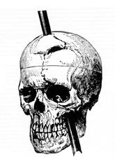
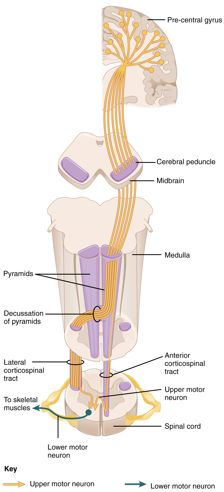

By the end of this section, you will be able to:
* List the components of the basic processing stream for the motor system
* Describe the pathway of descending motor commands from the cortex to the skeletal muscles
* Compare different descending pathways, both by structure and function
* Explain the initiation of movement from the neurological connections
* Describe several reflex arcs and their functional roles

The defining characteristic of the somatic nervous system is that it controls skeletal muscles. Somatic senses inform the nervous system about the external environment, but the response to that is through voluntary muscle movement. The term “voluntary” suggests that there is a conscious decision to make a movement. However, some aspects of the somatic system use voluntary muscles without conscious control. One example is the ability of our breathing to switch to unconscious control while we are focused on another task. However, the muscles that are responsible for the basic process of breathing are also utilized for speech, which is entirely voluntary.

# Cortical Responses

Let’s start with sensory stimuli that have been registered through receptor cells and the information relayed to the CNS along ascending pathways. In the cerebral cortex, the initial processing of sensory perception progresses to associative processing and then integration in multimodal areas of cortex. These levels of processing can lead to the incorporation of sensory perceptions into memory, but more importantly, they lead to a response. The completion of cortical processing through the primary, associative, and integrative sensory areas initiates a similar progression of motor processing, usually in different cortical areas.

Whereas the sensory cortical areas are located in the occipital, temporal, and parietal lobes, motor functions are largely controlled by the frontal lobe. The most anterior regions of the frontal lobe—the prefrontal areas—are important for **executive functions**{: data-type="term"}, which are those cognitive functions that lead to goal-directed behaviors. These higher cognitive processes include **working memory**{: data-type="term"}, which has been called a “mental scratch pad,” that can help organize and represent information that is not in the immediate environment. The prefrontal lobe is responsible for aspects of attention, such as inhibiting distracting thoughts and actions so that a person can focus on a goal and direct behavior toward achieving that goal.

The functions of the prefrontal cortex are integral to the personality of an individual, because it is largely responsible for what a person intends to do and how they accomplish those plans. A famous case of damage to the prefrontal cortex is that of Phineas Gage, dating back to 1848. He was a railroad worker who had a metal spike impale his prefrontal cortex ([\[link\]](#fig-ch14_03_01)). He survived the accident, but according to second-hand accounts, his personality changed drastically. Friends described him as no longer acting like himself. Whereas he was a hardworking, amiable man before the accident, he turned into an irritable, temperamental, and lazy man after the accident. Many of the accounts of his change may have been inflated in the retelling, and some behavior was likely attributable to alcohol used as a pain medication. However, the accounts suggest that some aspects of his personality did change. Also, there is new evidence that though his life changed dramatically, he was able to become a functioning stagecoach driver, suggesting that the brain has the ability to recover even from major trauma such as this.

<figure markdown="1" id="fig-ch14_03_01">

Phineas Gage

<figcaption>
The victim of an accident while working on a railroad in 1848, Phineas Gage had a large iron rod impaled through the prefrontal cortex of his frontal lobe. After the accident, his personality appeared to change, but he eventually learned to cope with the trauma and lived as a coach driver even after such a traumatic event. (credit b: John M. Harlow, MD)
</figcaption>
{: #phineasgage01}

{: #phineasgage02}

</figure>

## Secondary Motor Cortices

In generating motor responses, the executive functions of the prefrontal cortex will need to initiate actual movements. One way to define the prefrontal area is any region of the frontal lobe that does not elicit movement when electrically stimulated. These are primarily in the anterior part of the frontal lobe. The regions of the frontal lobe that remain are the regions of the cortex that produce movement. The prefrontal areas project into the secondary motor cortices, which include the **premotor cortex**{: data-type="term"} and the **supplemental motor area**{: data-type="term"}.

Two important regions that assist in planning and coordinating movements are located adjacent to the primary motor cortex. The premotor cortex is more lateral, whereas the supplemental motor area is more medial and superior. The premotor area aids in controlling movements of the core muscles to maintain posture during movement, whereas the supplemental motor area is hypothesized to be responsible for planning and coordinating movement. The supplemental motor area also manages sequential movements that are based on prior experience (that is, learned movements). Neurons in these areas are most active leading up to the initiation of movement. For example, these areas might prepare the body for the movements necessary to drive a car in anticipation of a traffic light changing.

Adjacent to these two regions are two specialized motor planning centers. The **frontal eye fields**{: data-type="term"} are responsible for moving the eyes in response to visual stimuli. There are direct connections between the frontal eye fields and the superior colliculus. Also, anterior to the premotor cortex and primary motor cortex is **Broca’s area**{: data-type="term"}. This area is responsible for controlling movements of the structures of speech production. The area is named after a French surgeon and anatomist who studied patients who could not produce speech. They did not have impairments to understanding speech, only to producing speech sounds, suggesting a damaged or underdeveloped Broca’s area.

## Primary Motor Cortex

The primary motor cortex is located in the precentral gyrus of the frontal lobe. A neurosurgeon, Walter Penfield, described much of the basic understanding of the primary motor cortex by electrically stimulating the surface of the cerebrum. Penfield would probe the surface of the cortex while the patient was only under local anesthesia so that he could observe responses to the stimulation. This led to the belief that the precentral gyrus directly stimulated muscle movement. We now know that the primary motor cortex receives input from several areas that aid in planning movement, and its principle output stimulates spinal cord neurons to stimulate skeletal muscle contraction.

The primary motor cortex is arranged in a similar fashion to the primary somatosensory cortex, in that it has a topographical map of the body, creating a motor homunculus (see [\[link\]](/m46557#fig-ch14_02_05)). The neurons responsible for musculature in the feet and lower legs are in the medial wall of the precentral gyrus, with the thighs, trunk, and shoulder at the crest of the longitudinal fissure. The hand and face are in the lateral face of the gyrus. Also, the relative space allotted for the different regions is exaggerated in muscles that have greater enervation. The greatest amount of cortical space is given to muscles that perform fine, agile movements, such as the muscles of the fingers and the lower face. The “power muscles” that perform coarser movements, such as the buttock and back muscles, occupy much less space on the motor cortex.

# Descending Pathways

The motor output from the cortex descends into the brain stem and to the spinal cord to control the musculature through motor neurons. Neurons located in the primary motor cortex, named **Betz cells**{: data-type="term"}, are large cortical neurons that synapse with lower motor neurons in the spinal cord or the brain stem. The two descending pathways travelled by the axons of Betz cells are the **corticospinal tract**{: data-type="term"} and the **corticobulbar tract**{: data-type="term"}. Both tracts are named for their origin in the cortex and their targets—either the spinal cord or the brain stem (the term “bulbar” refers to the brain stem as the bulb, or enlargement, at the top of the spinal cord).

These two descending pathways are responsible for the conscious or voluntary movements of skeletal muscles. Any motor command from the primary motor cortex is sent down the axons of the Betz cells to activate upper motor neurons in either the cranial motor nuclei or in the ventral horn of the spinal cord. The axons of the corticobulbar tract are ipsilateral, meaning they project from the cortex to the motor nucleus on the same side of the nervous system. Conversely, the axons of the corticospinal tract are largely contralateral, meaning that they cross the midline of the brain stem or spinal cord and synapse on the opposite side of the body. Therefore, the right motor cortex of the cerebrum controls muscles on the left side of the body, and vice versa.

The corticospinal tract descends from the cortex through the deep white matter of the cerebrum. It then passes between the caudate nucleus and putamen of the basal nuclei as a bundle called the **internal capsule**{: data-type="term"}. The tract then passes through the midbrain as the **cerebral peduncles**{: data-type="term"}, after which it burrows through the pons. Upon entering the medulla, the tracts make up the large white matter tract referred to as the **pyramids**{: data-type="term"} ([\[link\]](#fig-ch14_03_02)). The defining landmark of the medullary-spinal border is the **pyramidal decussation**{: data-type="term"}, which is where most of the fibers in the corticospinal tract cross over to the opposite side of the brain. At this point, the tract separates into two parts, which have control over different domains of the musculature.

 {: #fig-ch14_03_02 data-title="Corticospinal Tract "}

## Appendicular Control

The **lateral corticospinal tract**{: data-type="term"} is composed of the fibers that cross the midline at the pyramidal decussation (see [\[link\]](#fig-ch14_03_02)). The axons cross over from the anterior position of the pyramids in the medulla to the lateral column of the spinal cord. These axons are responsible for controlling appendicular muscles.

This influence over the appendicular muscles means that the lateral corticospinal tract is responsible for moving the muscles of the arms and legs. The ventral horn in both the lower cervical spinal cord and the lumbar spinal cord both have wider ventral horns, representing the greater number of muscles controlled by these motor neurons. The **cervical enlargement**{: data-type="term"} is particularly large because there is greater control over the fine musculature of the upper limbs, particularly of the fingers. The **lumbar enlargement**{: data-type="term"} is not as significant in appearance because there is less fine motor control of the lower limbs.

## Axial Control

The **anterior corticospinal tract**{: data-type="term"} is responsible for controlling the muscles of the body trunk (see [\[link\]](#fig-ch14_03_02)). These axons do not decussate in the medulla. Instead, they remain in an anterior position as they descend the brain stem and enter the spinal cord. These axons then travel to the spinal cord level at which they synapse with a lower motor neuron. Upon reaching the appropriate level, the axons decussate, entering the ventral horn on the opposite side of the spinal cord from which they entered. In the ventral horn, these axons synapse with their corresponding lower motor neurons. The lower motor neurons are located in the medial regions of the ventral horn, because they control the axial muscles of the trunk.

Because movements of the body trunk involve both sides of the body, the anterior corticospinal tract is not entirely contralateral. Some collateral branches of the tract will project into the ipsilateral ventral horn to control synergistic muscles on that side of the body, or to inhibit antagonistic muscles through interneurons within the ventral horn. Through the influence of both sides of the body, the anterior corticospinal tract can coordinate postural muscles in broad movements of the body. These coordinating axons in the anterior corticospinal tract are often considered bilateral, as they are both ipsilateral and contralateral.

  
Watch this [video][1] to learn more about the descending motor pathway for the somatic nervous system. The autonomic connections are mentioned, which are covered in another chapter. From this brief video, only some of the descending motor pathway of the somatic nervous system is described. Which division of the pathway is described and which division is left out?

# Extrapyramidal Controls

Other descending connections between the brain and the spinal cord are called the **extrapyramidal system**{: data-type="term"}. The name comes from the fact that this system is outside the corticospinal pathway, which includes the pyramids in the medulla. A few pathways originating from the brain stem contribute to this system.

The **tectospinal tract**{: data-type="term"} projects from the midbrain to the spinal cord and is important for postural movements that are driven by the superior colliculus. The name of the tract comes from an alternate name for the superior colliculus, which is the tectum. The **reticulospinal tract**{: data-type="term"} connects the reticular system, a diffuse region of gray matter in the brain stem, with the spinal cord. This tract influences trunk and proximal limb muscles related to posture and locomotion. The reticulospinal tract also contributes to muscle tone and influences autonomic functions. The **vestibulospinal tract**{: data-type="term"} connects the brain stem nuclei of the vestibular system with the spinal cord. This allows posture, movement, and balance to be modulated on the basis of equilibrium information provided by the vestibular system.

The pathways of the extrapyramidal system are influenced by subcortical structures. For example, connections between the secondary motor cortices and the extrapyramidal system modulate spine and cranium movements. The basal nuclei, which are important for regulating movement initiated by the CNS, influence the extrapyramidal system as well as its thalamic feedback to the motor cortex.

The conscious movement of our muscles is more complicated than simply sending a single command from the precentral gyrus down to the proper motor neurons. During the movement of any body part, our muscles relay information back to the brain, and the brain is constantly sending “revised” instructions back to the muscles. The cerebellum is important in contributing to the motor system because it compares cerebral motor commands with proprioceptive feedback. The corticospinal fibers that project to the ventral horn of the spinal cord have branches that also synapse in the pons, which project to the cerebellum. Also, the proprioceptive sensations of the dorsal column system have a collateral projection to the medulla that projects to the cerebellum. These two streams of information are compared in the cerebellar cortex. Conflicts between the motor commands sent by the cerebrum and body position information provided by the proprioceptors cause the cerebellum to stimulate the **red nucleus**{: data-type="term"} of the midbrain. The red nucleus then sends corrective commands to the spinal cord along the **rubrospinal tract**{: data-type="term"}. The name of this tract comes from the word for red that is seen in the English word “ruby.”

A good example of how the cerebellum corrects cerebral motor commands can be illustrated by walking in water. An original motor command from the cerebrum to walk will result in a highly coordinated set of learned movements. However, in water, the body cannot actually perform a typical walking movement as instructed. The cerebellum can alter the motor command, stimulating the leg muscles to take larger steps to overcome the water resistance. The cerebellum can make the necessary changes through the rubrospinal tract. Modulating the basic command to walk also relies on spinal reflexes, but the cerebellum is responsible for calculating the appropriate response. When the cerebellum does not work properly, coordination and balance are severely affected. The most dramatic example of this is during the overconsumption of alcohol. Alcohol inhibits the ability of the cerebellum to interpret proprioceptive feedback, making it more difficult to coordinate body movements, such as walking a straight line, or guide the movement of the hand to touch the tip of the nose.

  
Visit this [site][2] to read about an elderly woman who starts to lose the ability to control fine movements, such as speech and the movement of limbs. Many of the usual causes were ruled out. It was not a stroke, Parkinson’s disease, diabetes, or thyroid dysfunction. The next most obvious cause was medication, so her pharmacist had to be consulted. The side effect of a drug meant to help her sleep had resulted in changes in motor control. What regions of the nervous system are likely to be the focus of haloperidol side effects?

# Ventral Horn Output

The somatic nervous system provides output strictly to skeletal muscles. The lower motor neurons, which are responsible for the contraction of these muscles, are found in the ventral horn of the spinal cord. These large, multipolar neurons have a corona of dendrites surrounding the cell body and an axon that extends out of the ventral horn. This axon travels through the ventral nerve root to join the emerging spinal nerve. The axon is relatively long because it needs to reach muscles in the periphery of the body. The diameters of cell bodies may be on the order of hundreds of micrometers to support the long axon; some axons are a meter in length, such as the lumbar motor neurons that innervate muscles in the first digits of the feet.

The axons will also branch to innervate multiple muscle fibers. Together, the motor neuron and all the muscle fibers that it controls make up a motor unit. Motor units vary in size. Some may contain up to 1000 muscle fibers, such as in the quadriceps, or they may only have 10 fibers, such as in an extraocular muscle. The number of muscle fibers that are part of a motor unit corresponds to the precision of control of that muscle. Also, muscles that have finer motor control have more motor units connecting to them, and this requires a larger topographical field in the primary motor cortex.

Motor neuron axons connect to muscle fibers at a neuromuscular junction. This is a specialized synaptic structure at which multiple axon terminals synapse with the muscle fiber sarcolemma. The synaptic end bulbs of the motor neurons secrete acetylcholine, which binds to receptors on the sarcolemma. The binding of acetylcholine opens ligand-gated ion channels, increasing the movement of cations across the sarcolemma. This depolarizes the sarcolemma, initiating muscle contraction. Whereas other synapses result in graded potentials that must reach a threshold in the postsynaptic target, activity at the neuromuscular junction reliably leads to muscle fiber contraction with every nerve impulse received from a motor neuron. However, the strength of contraction and the number of fibers that contract can be affected by the frequency of the motor neuron impulses.

# Reflexes

This chapter began by introducing reflexes as an example of the basic elements of the somatic nervous system. Simple somatic reflexes do not include the higher centers discussed for conscious or voluntary aspects of movement. Reflexes can be spinal or cranial, depending on the nerves and central components that are involved. The example described at the beginning of the chapter involved heat and pain sensations from a hot stove causing withdrawal of the arm through a connection in the spinal cord that leads to contraction of the biceps brachii. The description of this withdrawal reflex was simplified, for the sake of the introduction, to emphasize the parts of the somatic nervous system. But to consider reflexes fully, more attention needs to be given to this example.

As you withdraw your hand from the stove, you do not want to slow that reflex down. As the biceps brachii contracts, the antagonistic triceps brachii needs to relax. Because the neuromuscular junction is strictly excitatory, the biceps will contract when the motor nerve is active. Skeletal muscles do not actively relax. Instead the motor neuron needs to “quiet down,” or be inhibited. In the hot-stove withdrawal reflex, this occurs through an interneuron in the spinal cord. The interneuron’s cell body is located in the dorsal horn of the spinal cord. The interneuron receives a synapse from the axon of the sensory neuron that detects that the hand is being burned. In response to this stimulation from the sensory neuron, the interneuron then inhibits the motor neuron that controls the triceps brachii. This is done by releasing a neurotransmitter or other signal that hyperpolarizes the motor neuron connected to the triceps brachii, making it less likely to initiate an action potential. With this motor neuron being inhibited, the triceps brachii relaxes. Without the antagonistic contraction, withdrawal from the hot stove is faster and keeps further tissue damage from occurring.

Another example of a withdrawal reflex occurs when you step on a painful stimulus, like a tack or a sharp rock. The nociceptors that are activated by the painful stimulus activate the motor neurons responsible for contraction of the tibialis anterior muscle. This causes dorsiflexion of the foot. An inhibitory interneuron, activated by a collateral branch of the nociceptor fiber, will inhibit the motor neurons of the gastrocnemius and soleus muscles to cancel plantar flexion. An important difference in this reflex is that plantar flexion is most likely in progress as the foot is pressing down onto the tack. Contraction of the tibialis anterior is not the most important aspect of the reflex, as continuation of plantar flexion will result in further damage from stepping onto the tack.

Another type of reflex is a **stretch reflex**{: data-type="term"}. In this reflex, when a skeletal muscle is stretched, a muscle spindle receptor is activated. The axon from this receptor structure will cause direct contraction of the muscle. A collateral of the muscle spindle fiber will also inhibit the motor neuron of the antagonist muscles. The reflex helps to maintain muscles at a constant length. A common example of this reflex is the knee jerk that is elicited by a rubber hammer struck against the patellar ligament in a physical exam.

A specialized reflex to protect the surface of the eye is the **corneal reflex**{: data-type="term"}, or the eye blink reflex. When the cornea is stimulated by a tactile stimulus, or even by bright light in a related reflex, blinking is initiated. The sensory component travels through the trigeminal nerve, which carries somatosensory information from the face, or through the optic nerve, if the stimulus is bright light. The motor response travels through the facial nerve and innervates the orbicularis oculi on the same side. This reflex is commonly tested during a physical exam using an air puff or a gentle touch of a cotton-tipped applicator.

  
Watch this [video][3] to learn more about the reflex arc of the corneal reflex. When the right cornea senses a tactile stimulus, what happens to the left eye? Explain your answer.

  
Watch this [video][4] to learn more about newborn reflexes. Newborns have a set of reflexes that are expected to have been crucial to survival before the modern age. These reflexes disappear as the baby grows, as some of them may be unnecessary as they age. The video demonstrates a reflex called the Babinski reflex, in which the foot flexes dorsally and the toes splay out when the sole of the foot is lightly scratched. This is normal for newborns, but it is a sign of reduced myelination of the spinal tract in adults. Why would this reflex be a problem for an adult?

# Chapter Review

The motor components of the somatic nervous system begin with the frontal lobe of the brain, where the prefrontal cortex is responsible for higher functions such as working memory. The integrative and associate functions of the prefrontal lobe feed into the secondary motor areas, which help plan movements. The premotor cortex and supplemental motor area then feed into the primary motor cortex that initiates movements. Large Betz cells project through the corticobulbar and corticospinal tracts to synapse on lower motor neurons in the brain stem and ventral horn of the spinal cord, respectively. These connections are responsible for generating movements of skeletal muscles.

The extrapyramidal system includes projections from the brain stem and higher centers that influence movement, mostly to maintain balance and posture, as well as to maintain muscle tone. The superior colliculus and red nucleus in the midbrain, the vestibular nuclei in the medulla, and the reticular formation throughout the brain stem each have tracts projecting to the spinal cord in this system. Descending input from the secondary motor cortices, basal nuclei, and cerebellum connect to the origins of these tracts in the brain stem.

All of these motor pathways project to the spinal cord to synapse with motor neurons in the ventral horn of the spinal cord. These lower motor neurons are the cells that connect to skeletal muscle and cause contractions. These neurons project through the spinal nerves to connect to the muscles at neuromuscular junctions. One motor neuron connects to multiple muscle fibers within a target muscle. The number of fibers that are innervated by a single motor neuron varies on the basis of the precision necessary for that muscle and the amount of force necessary for that motor unit. The quadriceps, for example, have many fibers controlled by single motor neurons for powerful contractions that do not need to be precise. The extraocular muscles have only a small number of fibers controlled by each motor neuron because moving the eyes does not require much force, but needs to be very precise.

Reflexes are the simplest circuits within the somatic nervous system. A withdrawal reflex from a painful stimulus only requires the sensory fiber that enters the spinal cord and the motor neuron that projects to a muscle. Antagonist and postural muscles can be coordinated with the withdrawal, making the connections more complex. The simple, single neuronal connection is the basis of somatic reflexes. The corneal reflex is contraction of the orbicularis oculi muscle to blink the eyelid when something touches the surface of the eye. Stretch reflexes maintain a constant length of muscles by causing a contraction of a muscle to compensate for a stretch that can be sensed by a specialized receptor called a muscle spindle.

# Interactive Link Questions

Watch this [video][1] to learn more about the descending motor pathway for the somatic nervous system. The autonomic connections are mentioned, which are covered in another chapter. From this brief video, only some of the descending motor pathway of the somatic nervous system is described. Which division of the pathway is described and which division is left out?

The video only describes the lateral division of the corticospinal tract. The anterior division is omitted.

Visit this [site][2] to read about an elderly woman who starts to lose the ability to control fine movements, such as speech and the movement of limbs. Many of the usual causes were ruled out. It was not a stroke, Parkinson’s disease, diabetes, or thyroid dysfunction. The next most obvious cause was medication, so her pharmacist had to be consulted. The side effect of a drug meant to help her sleep had resulted in changes in motor control. What regions of the nervous system are likely to be the focus of haloperidol side effects?

The movement disorders were similar to those seen in movement disorders of the extrapyramidal system, which would mean the basal nuclei are the most likely source of haloperidol side effects. In fact, haloperidol affects dopamine activity, which is a prominent part of the chemistry of the basal nuclei.

Watch this [video][3] to learn more about the reflex arc of the corneal reflex. When the right cornea senses a tactile stimulus, what happens to the left eye? Explain your answer.

The left eye also blinks. The sensory input from one eye activates the motor response of both eyes so that they both blink.

Watch this [video][4] to learn more about newborn reflexes. Newborns have a set of reflexes that are expected to have been crucial to survival before the modern age. These reflexes disappear as the baby grows, as some of them may be unnecessary as they age. The video demonstrates a reflex called the Babinski reflex, in which the foot flexes dorsally and the toes splay out when the sole of the foot is lightly scratched. This is normal for newborns, but it is a sign of reduced myelination of the spinal tract in adults. Why would this reflex be a problem for an adult?

While walking, the sole of the foot may be scraped or scratched by many things. If the foot still reacted as in the Babinski reflex, an adult might lose their balance while walking.

# Chapter Review

Which region of the frontal lobe is responsible for initiating movement by directly connecting to cranial and spinal motor neurons?

1.  prefrontal cortex
2.  supplemental motor area
3.  premotor cortex
4.  primary motor cortex
{: data-number-style="lower-alpha"}

D

Which extrapyramidal tract incorporates equilibrium sensations with motor commands to aid in posture and movement?

1.  tectospinal tract
2.  vestibulospinal tract
3.  reticulospinal tract
4.  corticospinal tract
{: data-number-style="lower-alpha"}

B

Which region of gray matter in the spinal cord contains motor neurons that innervate skeletal muscles?

1.  ventral horn
2.  dorsal horn
3.  lateral horn
4.  lateral column
{: data-number-style="lower-alpha"}

A

What type of reflex can protect the foot when a painful stimulus is sensed?

1.  stretch reflex
2.  gag reflex
3.  withdrawal reflex
4.  corneal reflex
{: data-number-style="lower-alpha"}

C

What is the name for the topographical representation of the sensory input to the somatosensory cortex?

1.  homunculus
2.  homo sapiens
3.  postcentral gyrus
4.  primary cortex
{: data-number-style="lower-alpha"}

A

# Critical Thinking Questions

The prefrontal lobotomy is a drastic—and largely out-of-practice—procedure used to disconnect that portion of the cerebral cortex from the rest of the frontal lobe and the diencephalon as a psychiatric therapy. Why would this have been thought necessary for someone with a potentially uncontrollable behavior?

The prefrontal cortex is involved in decision-making functions that lead to motor responses through connections to the more posterior motor regions. These early aspects of behavior are often associated with a person’s personality, so disrupting those connections will lead to severe changes in behavior.

If a reflex is a limited circuit within the somatic system, why do physical and neurological exams include them to test the health of an individual?

Though reflexes are simple circuits within the nervous system, they are representative of the more involved circuits of the somatic nervous system and can be used to quickly assess the state of neurological function for a person.

## Glossary
{: data-type="glossary-title"}

anterior corticospinal tract
: division of the corticospinal pathway that travels through the ventral (anterior) column of the spinal cord and controls axial musculature through the medial motor neurons in the ventral (anterior) horn
{: .definition}

Betz cells
: output cells of the primary motor cortex that cause musculature to move through synapses on cranial and spinal motor neurons
{: .definition}

Broca’s area
: region of the frontal lobe associated with the motor commands necessary for speech production
{: .definition}

cerebral peduncles
: segments of the descending motor pathway that make up the white matter of the ventral midbrain
{: .definition}

cervical enlargement
: region of the ventral (anterior) horn of the spinal cord that has a larger population of motor neurons for the greater number of and finer control of muscles of the upper limb
{: .definition}

corneal reflex
: protective response to stimulation of the cornea causing contraction of the orbicularis oculi muscle resulting in blinking of the eye
{: .definition}

corticobulbar tract
: connection between the cortex and the brain stem responsible for generating movement
{: .definition}

corticospinal tract
: connection between the cortex and the spinal cord responsible for generating movement
{: .definition}

executive functions
: cognitive processes of the prefrontal cortex that lead to directing goal-directed behavior, which is a precursor to executing motor commands
{: .definition}

extrapyramidal system
: pathways between the brain and spinal cord that are separate from the corticospinal tract and are responsible for modulating the movements generated through that primary pathway
{: .definition}

frontal eye fields
: area of the prefrontal cortex responsible for moving the eyes to attend to visual stimuli
{: .definition}

internal capsule
: segment of the descending motor pathway that passes between the caudate nucleus and the putamen
{: .definition}

lateral corticospinal tract
: division of the corticospinal pathway that travels through the lateral column of the spinal cord and controls appendicular musculature through the lateral motor neurons in the ventral (anterior) horn
{: .definition}

lumbar enlargement
: region of the ventral (anterior) horn of the spinal cord that has a larger population of motor neurons for the greater number of muscles of the lower limb
{: .definition}

premotor cortex
: cortical area anterior to the primary motor cortex that is responsible for planning movements
{: .definition}

pyramidal decussation
: location at which corticospinal tract fibers cross the midline and segregate into the anterior and lateral divisions of the pathway
{: .definition}

pyramids
: segment of the descending motor pathway that travels in the anterior position of the medulla
{: .definition}

red nucleus
: midbrain nucleus that sends corrective commands to the spinal cord along the rubrospinal tract, based on disparity between an original command and the sensory feedback from movement
{: .definition}

reticulospinal tract
: extrapyramidal connections between the brain stem and spinal cord that modulate movement, contribute to posture, and regulate muscle tone
{: .definition}

rubrospinal tract
: descending motor control pathway, originating in the red nucleus, that mediates control of the limbs on the basis of cerebellar processing
{: .definition}

stretch reflex
: response to activation of the muscle spindle stretch receptor that causes contraction of the muscle to maintain a constant length
{: .definition}

supplemental motor area
: cortical area anterior to the primary motor cortex that is responsible for planning movements
{: .definition}

tectospinal tract
: extrapyramidal connections between the superior colliculus and spinal cord
{: .definition}

vestibulospinal tract
: extrapyramidal connections between the vestibular nuclei in the brain stem and spinal cord that modulate movement and contribute to balance on the basis of the sense of equilibrium
{: .definition}

working memory
: function of the prefrontal cortex to maintain a representation of information that is not in the immediate environment
{: .definition}

[1]: http://openstaxcollege.org/l/motorpathway
[2]: http://openstaxcollege.org/l/NYTmotor
[3]: http://openstaxcollege.org/l/reflexarc
[4]: http://openstaxcollege.org/l/newreflex
