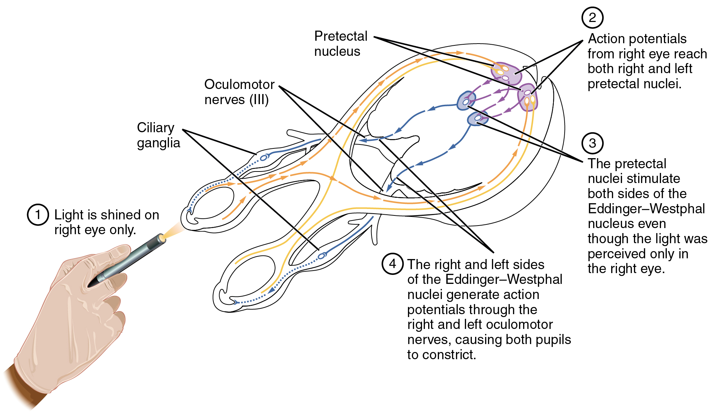
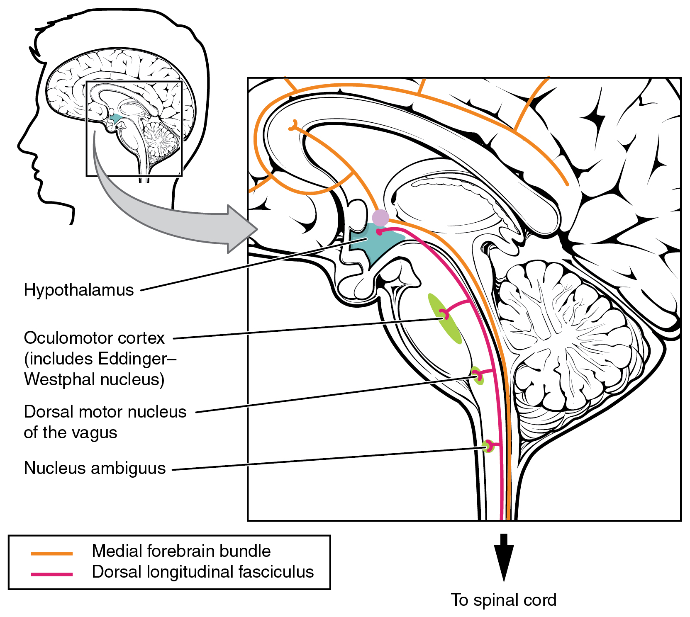
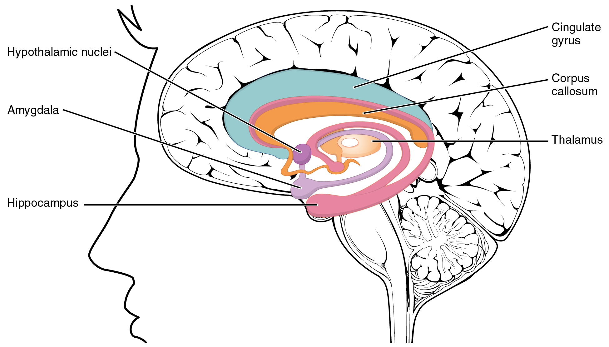

By the end of this section, you will be able to:
* Describe the role of higher centers of the brain in autonomic regulation
* Explain the connection of the hypothalamus to homeostasis
* Describe the regions of the CNS that link the autonomic system with emotion
* Describe the pathways important to descending control of the autonomic system

The pupillary light reflex ([\[link\]](#fig-ch15_03_01)) begins when light hits the retina and causes a signal to travel along the optic nerve. This is visual sensation, because the afferent branch of this reflex is simply sharing the special sense pathway. Bright light hitting the retina leads to the parasympathetic response, through the oculomotor nerve, followed by the postganglionic fiber from the ciliary ganglion, which stimulates the circular fibers of the iris to contract and constrict the pupil. When light hits the retina in one eye, both pupils contract. When that light is removed, both pupils dilate again back to the resting position. When the stimulus is unilateral (presented to only one eye), the response is bilateral (both eyes). The same is not true for somatic reflexes. If you touch a hot radiator, you only pull that arm back, not both. Central control of autonomic reflexes is different than for somatic reflexes. The hypothalamus, along with other CNS locations, controls the autonomic system.

 {: #fig-ch15_03_01 data-media-type="image/jpg" data-title="Pupillary Reflex Pathways "}

# Forebrain Structures

Autonomic control is based on the visceral reflexes, composed of the afferent and efferent branches. These homeostatic mechanisms are based on the balance between the two divisions of the autonomic system, which results in tone for various organs that is based on the predominant input from the sympathetic or parasympathetic systems. Coordinating that balance requires integration that begins with forebrain structures like the hypothalamus and continues into the brain stem and spinal cord.

## The Hypothalamus

The hypothalamus is the control center for many homeostatic mechanisms. It regulates both autonomic function and endocrine function. The roles it plays in the pupillary reflexes demonstrates the importance of this control center. The optic nerve projects primarily to the thalamus, which is the necessary relay to the occipital cortex for conscious visual perception. Another projection of the optic nerve, however, goes to the hypothalamus.

The hypothalamus then uses this visual system input to drive the pupillary reflexes. If the retina is activated by high levels of light, the hypothalamus stimulates the parasympathetic response. If the optic nerve message shows that low levels of light are falling on the retina, the hypothalamus activates the sympathetic response. Output from the hypothalamus follows two main tracts, the **dorsal longitudinal fasciculus**{: data-type="term"} and the **medial forebrain bundle**{: data-type="term"} ([\[link\]](#fig-ch15_03_02)). Along these two tracts, the hypothalamus can influence the Eddinger–Westphal nucleus of the oculomotor complex or the lateral horns of the thoracic spinal cord.

 {: #fig-ch15_03_02 data-media-type="image/jpg" data-title="Fiber Tracts of the Central Autonomic System "}

These two tracts connect the hypothalamus with the major parasympathetic nuclei in the brain stem and the preganglionic (central) neurons of the thoracolumbar spinal cord. The hypothalamus also receives input from other areas of the forebrain through the medial forebrain bundle. The olfactory cortex, the septal nuclei of the basal forebrain, and the amygdala project into the hypothalamus through the medial forebrain bundle. These forebrain structures inform the hypothalamus about the state of the nervous system and can influence the regulatory processes of homeostasis. A good example of this is found in the amygdala, which is found beneath the cerebral cortex of the temporal lobe and plays a role in our ability to remember and feel emotions.

## The Amygdala

The amygdala is a group of nuclei in the medial region of the temporal lobe that is part of the **limbic lobe**{: data-type="term"} ([\[link\]](#fig-ch15_03_03)). The limbic lobe includes structures that are involved in emotional responses, as well as structures that contribute to memory function. The limbic lobe has strong connections with the hypothalamus and influences the state of its activity on the basis of emotional state. For example, when you are anxious or scared, the amygdala will send signals to the hypothalamus along the medial forebrain bundle that will stimulate the sympathetic fight-or-flight response. The hypothalamus will also stimulate the release of stress hormones through its control of the endocrine system in response to amygdala input.

 {: #fig-ch15_03_03 data-media-type="image/jpg" data-title="The Limbic Lobe "}

# The Medulla

The medulla contains nuclei referred to as the **cardiovascular center**{: data-type="term"}, which controls the smooth and cardiac muscle of the cardiovascular system through autonomic connections. When the homeostasis of the cardiovascular system shifts, such as when blood pressure changes, the coordination of the autonomic system can be accomplished within this region. Furthermore, when descending inputs from the hypothalamus stimulate this area, the sympathetic system can increase activity in the cardiovascular system, such as in response to anxiety or stress. The preganglionic sympathetic fibers that are responsible for increasing heart rate are referred to as the **cardiac accelerator nerves**{: data-type="term"}, whereas the preganglionic sympathetic fibers responsible for constricting blood vessels compose the **vasomotor nerves**{: data-type="term"}.

Several brain stem nuclei are important for the visceral control of major organ systems. One brain stem nucleus involved in cardiovascular function is the solitary nucleus. It receives sensory input about blood pressure and cardiac function from the glossopharyngeal and vagus nerves, and its output will activate sympathetic stimulation of the heart or blood vessels through the upper thoracic lateral horn. Another brain stem nucleus important for visceral control is the dorsal motor nucleus of the vagus nerve, which is the motor nucleus for the parasympathetic functions ascribed to the vagus nerve, including decreasing the heart rate, relaxing bronchial tubes in the lungs, and activating digestive function through the enteric nervous system. The nucleus ambiguus, which is named for its ambiguous histology, also contributes to the parasympathetic output of the vagus nerve and targets muscles in the pharynx and larynx for swallowing and speech, as well as contributing to the parasympathetic tone of the heart along with the dorsal motor nucleus of the vagus.

Everyday Connections

Exercise and the Autonomic System In addition to its association with the fight-or-flight response and rest-and-digest functions, the autonomic system is responsible for certain everyday functions. For example, it comes into play when homeostatic mechanisms dynamically change, such as the physiological changes that accompany exercise. Getting on the treadmill and putting in a good workout will cause the heart rate to increase, breathing to be stronger and deeper, sweat glands to activate, and the digestive system to suspend activity. These are the same physiological changes associated with the fight-or-flight response, but there is nothing chasing you on that treadmill.

This is not a simple homeostatic mechanism at work because “maintaining the internal environment” would mean getting all those changes back to their set points. Instead, the sympathetic system has become active during exercise so that your body can cope with what is happening. A homeostatic mechanism is dealing with the conscious decision to push the body away from a resting state. The heart, actually, is moving away from its homeostatic set point. Without any input from the autonomic system, the heart would beat at approximately 100 bpm, and the parasympathetic system slows that down to the resting rate of approximately 70 bpm. But in the middle of a good workout, you should see your heart rate at 120–140 bpm. You could say that the body is stressed because of what you are doing to it. Homeostatic mechanisms are trying to keep blood pH in the normal range, or to keep body temperature under control, but those are in response to the choice to exercise.

 {: data-media-type="image/png"} 
Watch this [video][1] to learn about physical responses to emotion. The autonomic system, which is important for regulating the homeostasis of the organ systems, is also responsible for our physiological responses to emotions such as fear. The video summarizes the extent of the body’s reactions and describes several effects of the autonomic system in response to fear. On the basis of what you have already studied about autonomic function, which effect would you expect to be associated with parasympathetic, rather than sympathetic, activity?

# Chapter Review

The autonomic system integrates sensory information and higher cognitive processes to generate output, which balances homeostatic mechanisms. The central autonomic structure is the hypothalamus, which coordinates sympathetic and parasympathetic efferent pathways to regulate activities of the organ systems of the body. The majority of hypothalamic output travels through the medial forebrain bundle and the dorsal longitudinal fasciculus to influence brain stem and spinal components of the autonomic nervous system. The medial forebrain bundle also connects the hypothalamus with higher centers of the limbic system where emotion can influence visceral responses. The amygdala is a structure within the limbic system that influences the hypothalamus in the regulation of the autonomic system, as well as the endocrine system.

These higher centers have descending control of the autonomic system through brain stem centers, primarily in the medulla, such as the cardiovascular center. This collection of medullary nuclei regulates cardiac function, as well as blood pressure. Sensory input from the heart, aorta, and carotid sinuses project to these regions of the medulla. The solitary nucleus increases sympathetic tone of the cardiovascular system through the cardiac accelerator and vasomotor nerves. The nucleus ambiguus and the dorsal motor nucleus both contribute fibers to the vagus nerve, which exerts parasympathetic control of the heart by decreasing heart rate.

# Interactive Link Questions

Watch this [video][1] to learn about physical responses to emotion. The autonomic system, which is important for regulating the homeostasis of the organ systems, is also responsible for our physiological responses to emotions such as fear. The video summarizes the extent of the body’s reactions and describes several effects of the autonomic system in response to fear. On the basis of what you have already studied about autonomic function, which effect would you expect to be associated with parasympathetic, rather than sympathetic, activity?

The release of urine in extreme fear. The sympathetic system normally constricts sphincters such as that of the urethra.

# Review Questions

Which of these locations in the forebrain is the master control center for homeostasis through the autonomic and endocrine systems?

1.  hypothalamus
2.  thalamus
3.  amygdala
4.  cerebral cortex
{: data-number-style="lower-alpha"}

A

Which nerve projects to the hypothalamus to indicate the level of light stimuli in the retina?

1.  glossopharyngeal
2.  oculomotor
3.  optic
4.  vagus
{: data-number-style="lower-alpha"}

C

What region of the limbic lobe is responsible for generating stress responses via the hypothalamus?

1.  hippocampus
2.  amygdala
3.  mammillary bodies
4.  prefrontal cortex
{: data-number-style="lower-alpha"}

B

What is another name for the preganglionic sympathetic fibers that project to the heart?

1.  solitary tract
2.  vasomotor nerve
3.  vagus nerve
4.  cardiac accelerator nerve
{: data-number-style="lower-alpha"}

D

What central fiber tract connects forebrain and brain stem structures with the hypothalamus?

1.  cardiac accelerator nerve
2.  medial forebrain bundle
3.  dorsal longitudinal fasciculus
4.  corticospinal tract
{: data-number-style="lower-alpha"}

B

# Critical Thinking Questions

Horner’s syndrome is a condition that presents with changes in one eye, such as pupillary constriction and dropping of eyelids, as well as decreased sweating in the face. Why could a tumor in the thoracic cavity have an effect on these autonomic functions?

Pupillary dilation and sweating, two functions lost in Horner’s syndrome, are caused by the sympathetic system. A tumor in the thoracic cavity may interrupt the output of the thoracic ganglia that project to the head and face.

The cardiovascular center is responsible for regulating the heart and blood vessels through homeostatic mechanisms. What tone does each component of the cardiovascular system have? What connections does the cardiovascular center invoke to keep these two systems in their resting tone?

The heart—based on the resting heart rate—is under parasympathetic tone, and the blood vessels—based on the lack of parasympathetic input—are under sympathetic tone. The vagus nerve contributes to the lowered resting heart rate, whereas the vasomotor nerves maintain the slight constriction of systemic blood vessels.

[1]: http://openstaxcollege.org/l/emotions
