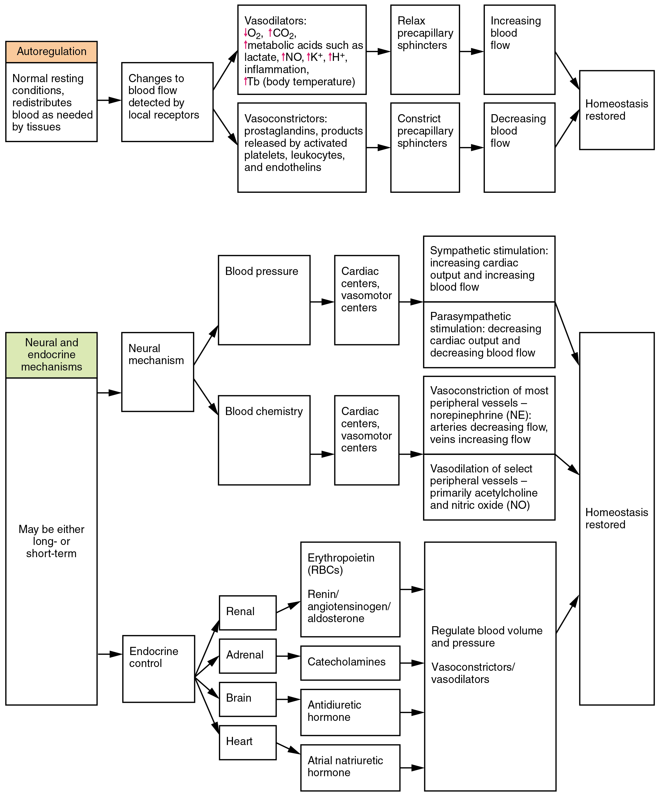
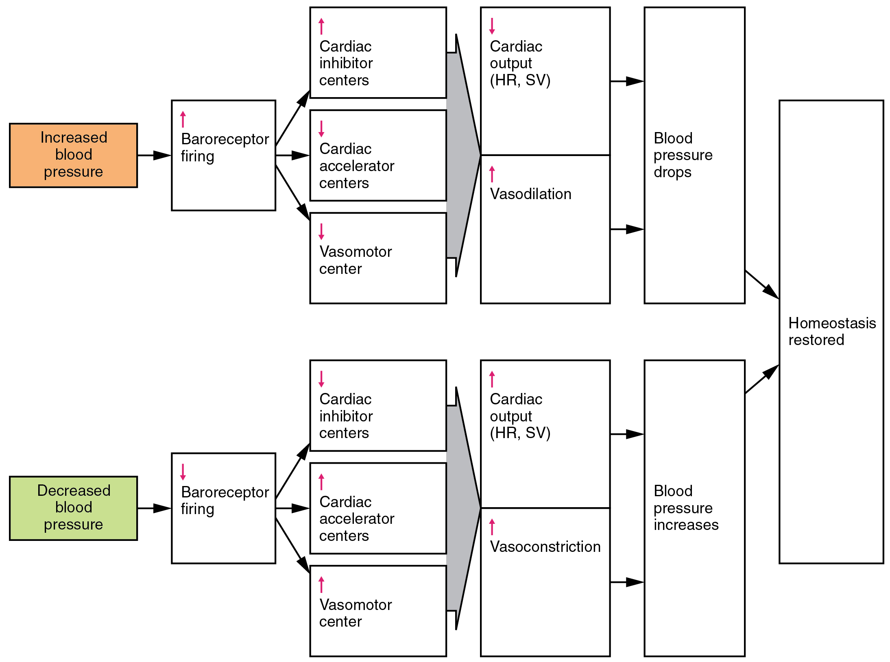

By the end of this section, you will be able to:
* Discuss the mechanisms involved in the neural regulation of vascular homeostasis
* Describe the contribution of a variety of hormones to the renal regulation of blood pressure
* Identify the effects of exercise on vascular homeostasis
* Discuss how hypertension, hemorrhage, and circulatory shock affect vascular health

In order to maintain homeostasis in the cardiovascular system and provide adequate blood to the tissues, blood flow must be redirected continually to the tissues as they become more active. In a very real sense, the cardiovascular system engages in resource allocation, because there is not enough blood flow to distribute blood equally to all tissues simultaneously. For example, when an individual is exercising, more blood will be directed to skeletal muscles, the heart, and the lungs. Following a meal, more blood is directed to the digestive system. Only the brain receives a more or less constant supply of blood whether you are active, resting, thinking, or engaged in any other activity.

[\[link\]](#tbl-ch21_03) provides the distribution of systemic blood at rest and during exercise. Although most of the data appears logical, the values for the distribution of blood to the integument may seem surprising. During exercise, the body distributes more blood to the body surface where it can dissipate the excess heat generated by increased activity into the environment.

<table id="tbl-ch21_03" summary=""><thead>
<tr>
<th colspan="4">Systemic Blood Flow During Rest, Mild Exercise, and Maximal Exercise in a Healthy Young Individual</th>
</tr>
<tr>
<th>Organ</th>
<th>Resting 
(mL/min)</th>
<th>Mild exercise 
(mL/min)</th>
<th>Maximal exercise 
(mL/min)</th>
</tr>
</thead><tbody>
<tr>
<td>Skeletal muscle</td>
<td>1200</td>
<td>4500</td>
<td>12,500</td>
</tr>
<tr>
<td>Heart</td>
<td>250</td>
<td>350</td>
<td>750</td>
</tr>
<tr>
<td>Brain</td>
<td>750</td>
<td>750</td>
<td>750</td>
</tr>
<tr>
<td>Integument</td>
<td>500</td>
<td>1500</td>
<td>1900</td>
</tr>
<tr>
<td>Kidney</td>
<td>1100</td>
<td>900</td>
<td>600</td>
</tr>
<tr>
<td>Gastrointestinal</td>
<td>1400</td>
<td>1100</td>
<td>600</td>
</tr>
<tr>
<td>Others 
(i.e., liver, spleen)</td>
<td>600</td>
<td>400</td>
<td>400</td>
</tr>
<tr>
<td>Total</td>
<td>5800</td>
<td>9500</td>
<td>17,500</td>
</tr>
</tbody></table>

Three homeostatic mechanisms ensure adequate blood flow, blood pressure, distribution, and ultimately perfusion: neural, endocrine, and autoregulatory mechanisms. They are summarized in [\[link\]](#fig-ch21_04_01).

 {: #fig-ch21_04_01 data-title="Summary of Factors Maintaining Vascular Homeostasis "}

# Neural Regulation

The nervous system plays a critical role in the regulation of vascular homeostasis. The primary regulatory sites include the cardiovascular centers in the brain that control both cardiac and vascular functions. In addition, more generalized neural responses from the limbic system and the autonomic nervous system are factors.

## The Cardiovascular Centers in the Brain

Neurological regulation of blood pressure and flow depends on the cardiovascular centers located in the medulla oblongata. This cluster of neurons responds to changes in blood pressure as well as blood concentrations of oxygen, carbon dioxide, and hydrogen ions. The cardiovascular center contains three distinct paired components:

* The cardioaccelerator centers stimulate cardiac function by regulating heart rate and stroke volume via sympathetic stimulation from the cardiac accelerator nerve.
* The cardioinhibitor centers slow cardiac function by decreasing heart rate and stroke volume via parasympathetic stimulation from the vagus nerve.
* The vasomotor centers control vessel tone or contraction of the smooth muscle in the tunica media. Changes in diameter affect peripheral resistance, pressure, and flow, which affect cardiac output. The majority of these neurons act via the release of the neurotransmitter norepinephrine from sympathetic neurons.

Although each center functions independently, they are not anatomically distinct.

There is also a small population of neurons that control vasodilation in the vessels of the brain and skeletal muscles by relaxing the smooth muscle fibers in the vessel tunics. Many of these are cholinergic neurons, that is, they release acetylcholine, which in turn stimulates the vessels’ endothelial cells to release nitric oxide (NO), which causes vasodilation. Others release norepinephrine that binds to β2 receptors. A few neurons release NO directly as a neurotransmitter.

Recall that mild stimulation of the skeletal muscles maintains muscle tone. A similar phenomenon occurs with vascular tone in vessels. As noted earlier, arterioles are normally partially constricted: With maximal stimulation, their radius may be reduced to one-half of the resting state. Full dilation of most arterioles requires that this sympathetic stimulation be suppressed. When it is, an arteriole can expand by as much as 150 percent. Such a significant increase can dramatically affect resistance, pressure, and flow.

## Baroreceptor Reflexes

Baroreceptors are specialized stretch receptors located within thin areas of blood vessels and heart chambers that respond to the degree of stretch caused by the presence of blood. They send impulses to the cardiovascular center to regulate blood pressure. Vascular baroreceptors are found primarily in sinuses (small cavities) within the aorta and carotid arteries: The **aortic sinuses**{: data-type="term"} are found in the walls of the ascending aorta just superior to the aortic valve, whereas the **carotid sinuses**{: data-type="term"} are in the base of the internal carotid arteries. There are also low-pressure baroreceptors located in the walls of the venae cavae and right atrium.

When blood pressure increases, the baroreceptors are stretched more tightly and initiate action potentials at a higher rate. At lower blood pressures, the degree of stretch is lower and the rate of firing is slower. When the cardiovascular center in the medulla oblongata receives this input, it triggers a reflex that maintains homeostasis ([\[link\]](#fig-ch21_04_02)):

* When blood pressure rises too high, the baroreceptors fire at a higher rate and trigger parasympathetic stimulation of the heart. As a result, cardiac output falls. Sympathetic stimulation of the peripheral arterioles will also decrease, resulting in vasodilation. Combined, these activities cause blood pressure to fall.
* When blood pressure drops too low, the rate of baroreceptor firing decreases. This will trigger an increase in sympathetic stimulation of the heart, causing cardiac output to increase. It will also trigger sympathetic stimulation of the peripheral vessels, resulting in vasoconstriction. Combined, these activities cause blood pressure to rise.

 {: #fig-ch21_04_02 data-title="Baroreceptor Reflexes for Maintaining Vascular Homeostasis "}

The baroreceptors in the venae cavae and right atrium monitor blood pressure as the blood returns to the heart from the systemic circulation. Normally, blood flow into the aorta is the same as blood flow back into the right atrium. If blood is returning to the right atrium more rapidly than it is being ejected from the left ventricle, the atrial receptors will stimulate the cardiovascular centers to increase sympathetic firing and increase cardiac output until homeostasis is achieved. The opposite is also true. This mechanism is referred to as the **atrial reflex**{: data-type="term"}.

## Chemoreceptor Reflexes

In addition to the baroreceptors are chemoreceptors that monitor levels of oxygen, carbon dioxide, and hydrogen ions (pH), and thereby contribute to vascular homeostasis. Chemoreceptors monitoring the blood are located in close proximity to the baroreceptors in the aortic and carotid sinuses. They signal the cardiovascular center as well as the respiratory centers in the medulla oblongata.

Since tissues consume oxygen and produce carbon dioxide and acids as waste products, when the body is more active, oxygen levels fall and carbon dioxide levels rise as cells undergo cellular respiration to meet the energy needs of activities. This causes more hydrogen ions to be produced, causing the blood pH to drop. When the body is resting, oxygen levels are higher, carbon dioxide levels are lower, more hydrogen is bound, and pH rises. (Seek additional content for more detail about pH.)

The chemoreceptors respond to increasing carbon dioxide and hydrogen ion levels (falling pH) by stimulating the cardioaccelerator and vasomotor centers, increasing cardiac output and constricting peripheral vessels. The cardioinhibitor centers are suppressed. With falling carbon dioxide and hydrogen ion levels (increasing pH), the cardioinhibitor centers are stimulated, and the cardioaccelerator and vasomotor centers are suppressed, decreasing cardiac output and causing peripheral vasodilation. In order to maintain adequate supplies of oxygen to the cells and remove waste products such as carbon dioxide, it is essential that the respiratory system respond to changing metabolic demands. In turn, the cardiovascular system will transport these gases to the lungs for exchange, again in accordance with metabolic demands. This interrelationship of cardiovascular and respiratory control cannot be overemphasized.

Other neural mechanisms can also have a significant impact on cardiovascular function. These include the limbic system that links physiological responses to psychological stimuli, as well as generalized sympathetic and parasympathetic stimulation.

# Endocrine Regulation

Endocrine control over the cardiovascular system involves the catecholamines, epinephrine and norepinephrine, as well as several hormones that interact with the kidneys in the regulation of blood volume.

## Epinephrine and Norepinephrine

The catecholamines epinephrine and norepinephrine are released by the adrenal medulla, and enhance and extend the body’s sympathetic or “fight-or-flight” response (see [\[link\]](#fig-ch21_04_01)). They increase heart rate and force of contraction, while temporarily constricting blood vessels to organs not essential for flight-or-fight responses and redirecting blood flow to the liver, muscles, and heart.

## Antidiuretic Hormone

Antidiuretic hormone (ADH), also known as vasopressin, is secreted by the cells in the hypothalamus and transported via the hypothalamic-hypophyseal tracts to the posterior pituitary where it is stored until released upon nervous stimulation. The primary trigger prompting the hypothalamus to release ADH is increasing osmolarity of tissue fluid, usually in response to significant loss of blood volume. ADH signals its target cells in the kidneys to reabsorb more water, thus preventing the loss of additional fluid in the urine. This will increase overall fluid levels and help restore blood volume and pressure. In addition, ADH constricts peripheral vessels.

## Renin-Angiotensin-Aldosterone Mechanism

The renin-angiotensin-aldosterone mechanism has a major effect upon the cardiovascular system ([\[link\]](#fig-ch21_04_03)). Renin is an enzyme, although because of its importance in the renin-angiotensin-aldosterone pathway, some sources identify it as a hormone. Specialized cells in the kidneys found in the juxtaglomerular apparatus respond to decreased blood flow by secreting renin into the blood. Renin converts the plasma protein angiotensinogen, which is produced by the liver, into its active form—angiotensin I. Angiotensin I circulates in the blood and is then converted into angiotensin II in the lungs. This reaction is catalyzed by the enzyme angiotensin-converting enzyme (ACE).

Angiotensin II is a powerful vasoconstrictor, greatly increasing blood pressure. It also stimulates the release of ADH and aldosterone, a hormone produced by the adrenal cortex. Aldosterone increases the reabsorption of sodium into the blood by the kidneys. Since water follows sodium, this increases the reabsorption of water. This in turn increases blood volume, raising blood pressure. Angiotensin II also stimulates the thirst center in the hypothalamus, so an individual will likely consume more fluids, again increasing blood volume and pressure.

 {: #fig-ch21_04_03 data-title="Hormones Involved in Renal Control of Blood Pressure "}

## Erythropoietin

Erythropoietin (EPO) is released by the kidneys when blood flow and/or oxygen levels decrease. EPO stimulates the production of erythrocytes within the bone marrow. Erythrocytes are the major formed element of the blood and may contribute 40 percent or more to blood volume, a significant factor of viscosity, resistance, pressure, and flow. In addition, EPO is a vasoconstrictor. Overproduction of EPO or excessive intake of synthetic EPO, often to enhance athletic performance, will increase viscosity, resistance, and pressure, and decrease flow in addition to its contribution as a vasoconstrictor.

## Atrial Natriuretic Hormone

Secreted by cells in the atria of the heart, atrial natriuretic hormone (ANH) (also known as atrial natriuretic peptide) is secreted when blood volume is high enough to cause extreme stretching of the cardiac cells. Cells in the ventricle produce a hormone with similar effects, called B-type natriuretic hormone. Natriuretic hormones are antagonists to angiotensin II. They promote loss of sodium and water from the kidneys, and suppress renin, aldosterone, and ADH production and release. All of these actions promote loss of fluid from the body, so blood volume and blood pressure drop.

# Autoregulation of Perfusion

As the name would suggest, autoregulation mechanisms require neither specialized nervous stimulation nor endocrine control. Rather, these are local, self-regulatory mechanisms that allow each region of tissue to adjust its blood flow—and thus its perfusion. These local mechanisms include chemical signals and myogenic controls.

## Chemical Signals Involved in Autoregulation

Chemical signals work at the level of the precapillary sphincters to trigger either constriction or relaxation. As you know, opening a precapillary sphincter allows blood to flow into that particular capillary, whereas constricting a precapillary sphincter temporarily shuts off blood flow to that region. The factors involved in regulating the precapillary sphincters include the following:

* Opening of the sphincter is triggered in response to decreased oxygen concentrations; increased carbon dioxide concentrations; increasing levels of lactic acid or other byproducts of cellular metabolism; increasing concentrations of potassium ions or hydrogen ions (falling pH); inflammatory chemicals such as histamines; and increased body temperature. These conditions in turn stimulate the release of NO, a powerful vasodilator, from endothelial cells (see [\[link\]](#fig-ch21_04_01)).
* Contraction of the precapillary sphincter is triggered by the opposite levels of the regulators, which prompt the release of endothelins, powerful vasoconstricting peptides secreted by endothelial cells. Platelet secretions and certain prostaglandins may also trigger constriction.

Again, these factors alter tissue perfusion via their effects on the precapillary sphincter mechanism, which regulates blood flow to capillaries. Since the amount of blood is limited, not all capillaries can fill at once, so blood flow is allocated based upon the needs and metabolic state of the tissues as reflected in these parameters. Bear in mind, however, that dilation and constriction of the arterioles feeding the capillary beds is the primary control mechanism.

## The Myogenic Response

The **myogenic response**{: data-type="term"} is a reaction to the stretching of the smooth muscle in the walls of arterioles as changes in blood flow occur through the vessel. This may be viewed as a largely protective function against dramatic fluctuations in blood pressure and blood flow to maintain homeostasis. If perfusion of an organ is too low (ischemia), the tissue will experience low levels of oxygen (hypoxia). In contrast, excessive perfusion could damage the organ’s smaller and more fragile vessels. The myogenic response is a localized process that serves to stabilize blood flow in the capillary network that follows that arteriole.

When blood flow is low, the vessel’s smooth muscle will be only minimally stretched. In response, it relaxes, allowing the vessel to dilate and thereby increase the movement of blood into the tissue. When blood flow is too high, the smooth muscle will contract in response to the increased stretch, prompting vasoconstriction that reduces blood flow.

[\[link\]](#fig-ch21_04_04) summarizes the effects of nervous, endocrine, and local controls on arterioles.

 ![This table summarizes mechanisms that regulate arteriole smooth muscle and veins. Neural controls are regulated by sympathetic stimulation and parasympathetic. Endocrine controls are regulated by epinephrine, norepinephrine, angiotensin II, ANH (peptide), and ADH. Other factors include decreasing levels of oxygen, decreasing pH, increasing levels of carbon dioxide, increasing levels of potassium ion, increasing levels of prostaglandins, increasing levels of andenosine, increasing levels of NO, increasing levels of lactic acid and other metabolites, increasing levels of endothelins, increasing levels of platelet secretions, increasing hyperhtermia, stretching of vascular wall (myogenic), and increasing levels of histamines from basophils and mast cells.](../resources/2143_Mechanism_Regulating_Arteries_and_Veins.jpg){: #fig-ch21_04_04 data-title="Summary of Mechanisms Regulating Arteriole Smooth Muscle and Veins "}

# Effect of Exercise on Vascular Homeostasis

The heart is a muscle and, like any muscle, it responds dramatically to exercise. For a healthy young adult, cardiac output (heart rate × stroke volume) increases in the nonathlete from approximately 5.0 liters (5.25 quarts) per minute to a maximum of about 20 liters (21 quarts) per minute. Accompanying this will be an increase in blood pressure from about 120/80 to 185/75. However, well-trained aerobic athletes can increase these values substantially. For these individuals, cardiac output soars from approximately 5.3 liters (5.57 quarts) per minute resting to more than 30 liters (31.5 quarts) per minute during maximal exercise. Along with this increase in cardiac output, blood pressure increases from 120/80 at rest to 200/90 at maximum values.

In addition to improved cardiac function, exercise increases the size and mass of the heart. The average weight of the heart for the nonathlete is about 300 g, whereas in an athlete it will increase to 500 g. This increase in size generally makes the heart stronger and more efficient at pumping blood, increasing both stroke volume and cardiac output.

Tissue perfusion also increases as the body transitions from a resting state to light exercise and eventually to heavy exercise (see [\[link\]](#fig-ch21_04_04)). These changes result in selective vasodilation in the skeletal muscles, heart, lungs, liver, and integument. Simultaneously, vasoconstriction occurs in the vessels leading to the kidneys and most of the digestive and reproductive organs. The flow of blood to the brain remains largely unchanged whether at rest or exercising, since the vessels in the brain largely do not respond to regulatory stimuli, in most cases, because they lack the appropriate receptors.

As vasodilation occurs in selected vessels, resistance drops and more blood rushes into the organs they supply. This blood eventually returns to the venous system. Venous return is further enhanced by both the skeletal muscle and respiratory pumps. As blood returns to the heart more quickly, preload rises and the Frank-Starling principle tells us that contraction of the cardiac muscle in the atria and ventricles will be more forceful. Eventually, even the best-trained athletes will fatigue and must undergo a period of rest following exercise. Cardiac output and distribution of blood then return to normal.

Regular exercise promotes cardiovascular health in a variety of ways. Because an athlete’s heart is larger than a nonathlete’s, stroke volume increases, so the athletic heart can deliver the same amount of blood as the nonathletic heart but with a lower heart rate. This increased efficiency allows the athlete to exercise for longer periods of time before muscles fatigue and places less stress on the heart. Exercise also lowers overall cholesterol levels by removing from the circulation a complex form of cholesterol, triglycerides, and proteins known as low-density lipoproteins (LDLs), which are widely associated with increased risk of cardiovascular disease. Although there is no way to remove deposits of plaque from the walls of arteries other than specialized surgery, exercise does promote the health of vessels by decreasing the rate of plaque formation and reducing blood pressure, so the heart does not have to generate as much force to overcome resistance.

Generally as little as 30 minutes of noncontinuous exercise over the course of each day has beneficial effects and has been shown to lower the rate of heart attack by nearly 50 percent. While it is always advisable to follow a healthy diet, stop smoking, and lose weight, studies have clearly shown that fit, overweight people may actually be healthier overall than sedentary slender people. Thus, the benefits of moderate exercise are undeniable.

# Clinical Considerations in Vascular Homeostasis

Any disorder that affects blood volume, vascular tone, or any other aspect of vascular functioning is likely to affect vascular homeostasis as well. That includes hypertension, hemorrhage, and shock.

## Hypertension and Hypotension

Chronically elevated blood pressure is known clinically as **hypertension**{: data-type="term"}. It is defined as chronic and persistent blood pressure measurements of 140/90 mm Hg or above. Pressures between 120/80 and 140/90 mm Hg are defined as prehypertension. About 68 million Americans currently suffer from hypertension. Unfortunately, hypertension is typically a silent disorder; therefore, hypertensive patients may fail to recognize the seriousness of their condition and fail to follow their treatment plan. The result is often a heart attack or stroke. Hypertension may also lead to an aneurism (ballooning of a blood vessel caused by a weakening of the wall), peripheral arterial disease (obstruction of vessels in peripheral regions of the body), chronic kidney disease, or heart failure.

  
Listen to this CDC [podcast][1] to learn about hypertension, often described as a “silent killer.” What steps can you take to reduce your risk of a heart attack or stroke?

## Hemorrhage

Minor blood loss is managed by hemostasis and repair. Hemorrhage is a loss of blood that cannot be controlled by hemostatic mechanisms. Initially, the body responds to hemorrhage by initiating mechanisms aimed at increasing blood pressure and maintaining blood flow. Ultimately, however, blood volume will need to be restored, either through physiological processes or through medical intervention.

In response to blood loss, stimuli from the baroreceptors trigger the cardiovascular centers to stimulate sympathetic responses to increase cardiac output and vasoconstriction. This typically prompts the heart rate to increase to about 180–200 contractions per minute, restoring cardiac output to normal levels. Vasoconstriction of the arterioles increases vascular resistance, whereas constriction of the veins increases venous return to the heart. Both of these steps will help increase blood pressure. Sympathetic stimulation also triggers the release of epinephrine and norepinephrine, which enhance both cardiac output and vasoconstriction. If blood loss were less than 20 percent of total blood volume, these responses together would usually return blood pressure to normal and redirect the remaining blood to the tissues.

Additional endocrine involvement is necessary, however, to restore the lost blood volume. The angiotensin-renin-aldosterone mechanism stimulates the thirst center in the hypothalamus, which increases fluid consumption to help restore the lost blood. More importantly, it increases renal reabsorption of sodium and water, reducing water loss in urine output. The kidneys also increase the production of EPO, stimulating the formation of erythrocytes that not only deliver oxygen to the tissues but also increase overall blood volume. [\[link\]](#fig-ch21_04_05) summarizes the responses to loss of blood volume.

 {: #fig-ch21_04_05 data-title="Homeostatic Responses to Loss of Blood Volume "}

## Circulatory Shock

The loss of too much blood may lead to **circulatory shock**{: data-type="term"}, a life-threatening condition in which the circulatory system is unable to maintain blood flow to adequately supply sufficient oxygen and other nutrients to the tissues to maintain cellular metabolism. It should not be confused with emotional or psychological shock. Typically, the patient in circulatory shock will demonstrate an increased heart rate but decreased blood pressure, but there are cases in which blood pressure will remain normal. Urine output will fall dramatically, and the patient may appear confused or lose consciousness. Urine output less than 1 mL/kg body weight/hour is cause for concern. Unfortunately, shock is an example of a positive-feedback loop that, if uncorrected, may lead to the death of the patient.

There are several recognized forms of shock:

* **Hypovolemic shock**{: data-type="term"} in adults is typically caused by hemorrhage, although in children it may be caused by fluid losses related to severe vomiting or diarrhea. Other causes for hypovolemic shock include extensive burns, exposure to some toxins, and excessive urine loss related to diabetes insipidus or ketoacidosis. Typically, patients present with a rapid, almost tachycardic heart rate; a weak pulse often described as “thread;” cool, clammy skin, particularly in the extremities, due to restricted peripheral blood flow; rapid, shallow breathing; hypothermia; thirst; and dry mouth. Treatments generally involve providing intravenous fluids to restore the patient to normal function and various drugs such as dopamine, epinephrine, and norepinephrine to raise blood pressure.
* **Cardiogenic shock**{: data-type="term"} results from the inability of the heart to maintain cardiac output. Most often, it results from a myocardial infarction (heart attack), but it may also be caused by arrhythmias, valve disorders, cardiomyopathies, cardiac failure, or simply insufficient flow of blood through the cardiac vessels. Treatment involves repairing the damage to the heart or its vessels to resolve the underlying cause, rather than treating cardiogenic shock directly.
* **Vascular shock**{: data-type="term"} occurs when arterioles lose their normal muscular tone and dilate dramatically. It may arise from a variety of causes, and treatments almost always involve fluid replacement and medications, called inotropic or pressor agents, which restore tone to the muscles of the vessels. In addition, eliminating or at least alleviating the underlying cause of the condition is required. This might include antibiotics and antihistamines, or select steroids, which may aid in the repair of nerve damage. A common cause is **sepsis**{: data-type="term"} (or septicemia), also called “blood poisoning,” which is a widespread bacterial infection that results in an organismal-level inflammatory response known as **septic shock**{: data-type="term"}. **Neurogenic shock**{: data-type="term"} is a form of vascular shock that occurs with cranial or spinal injuries that damage the cardiovascular centers in the medulla oblongata or the nervous fibers originating from this region. **Anaphylactic shock**{: data-type="term"} is a severe allergic response that causes the widespread release of histamines, triggering vasodilation throughout the body.
* **Obstructive shock**{: data-type="term"}, as the name would suggest, occurs when a significant portion of the vascular system is blocked. It is not always recognized as a distinct condition and may be grouped with cardiogenic shock, including pulmonary embolism and cardiac tamponade. Treatments depend upon the underlying cause and, in addition to administering fluids intravenously, often include the administration of anticoagulants, removal of fluid from the pericardial cavity, or air from the thoracic cavity, and surgery as required. The most common cause is a pulmonary embolism, a clot that lodges in the pulmonary vessels and interrupts blood flow. Other causes include stenosis of the aortic valve; cardiac tamponade, in which excess fluid in the pericardial cavity interferes with the ability of the heart to fully relax and fill with blood (resulting in decreased preload); and a pneumothorax, in which an excessive amount of air is present in the thoracic cavity, outside of the lungs, which interferes with venous return, pulmonary function, and delivery of oxygen to the tissues.

# Chapter Review

Neural, endocrine, and autoregulatory mechanisms affect blood flow, blood pressure, and eventually perfusion of blood to body tissues. Neural mechanisms include the cardiovascular centers in the medulla oblongata, baroreceptors in the aorta and carotid arteries and right atrium, and associated chemoreceptors that monitor blood levels of oxygen, carbon dioxide, and hydrogen ions. Endocrine controls include epinephrine and norepinephrine, as well as ADH, the renin-angiotensin-aldosterone mechanism, ANH, and EPO. Autoregulation is the local control of vasodilation and constriction by chemical signals and the myogenic response. Exercise greatly improves cardiovascular function and reduces the risk of cardiovascular diseases, including hypertension, a leading cause of heart attacks and strokes. Significant hemorrhage can lead to a form of circulatory shock known as hypovolemic shock. Sepsis, obstruction, and widespread inflammation can also cause circulatory shock.

# Interactive Link Questions

Listen to this CDC [podcast][1] to learn about hypertension, often described as a “silent killer.” What steps can you take to reduce your risk of a heart attack or stroke?

Take medications as prescribed, eat a healthy diet, exercise, and don’t smoke.

# Review Questions

Clusters of neurons in the medulla oblongata that regulate blood pressure are known collectively as \_\_\_\_\_\_\_\_.

1.  baroreceptors
2.  angioreceptors
3.  the cardiomotor mechanism
4.  the cardiovascular center
{: data-number-style="lower-alpha"}

D

In the renin-angiotensin-aldosterone mechanism, \_\_\_\_\_\_\_\_.

1.  decreased blood pressure prompts the release of renin from the liver
2.  aldosterone prompts increased urine output
3.  aldosterone prompts the kidneys to reabsorb sodium
4.  all of the above
{: data-number-style="lower-alpha"}

C

In the myogenic response, \_\_\_\_\_\_\_\_.

1.  muscle contraction promotes venous return to the heart
2.  ventricular contraction strength is decreased
3.  vascular smooth muscle responds to stretch
4.  endothelins dilate muscular arteries
{: data-number-style="lower-alpha"}

C

A form of circulatory shock common in young children with severe diarrhea or vomiting is \_\_\_\_\_\_\_\_.

1.  hypovolemic shock
2.  anaphylactic shock
3.  obstructive shock
4.  hemorrhagic shock
{: data-number-style="lower-alpha"}

A

# Critical Thinking Questions

A patient arrives in the emergency department with a blood pressure of 70/45 confused and complaining of thirst. Why?

This blood pressure is insufficient to circulate blood throughout the patient’s body and maintain adequate perfusion of the patient’s tissues. Ischemia would prompt hypoxia, including to the brain, prompting confusion. The low blood pressure would also trigger the renin-angiotensin-aldosterone mechanism, and release of aldosterone would stimulate the thirst mechanism in the hypothalamus.

Nitric oxide is broken down very quickly after its release. Why?

Nitric oxide is a very powerful local vasodilator that is important in the autoregulation of tissue perfusion. If it were not broken down very quickly after its release, blood flow to the region could exceed metabolic needs.

# References

Centers for Disease Control and Prevention (US). Getting blood pressure under control: high blood pressure is out of control for too many Americans \[Internet\]. Atlanta (GA); \[cited 2013 Apr 26\]. Available from: [http://www.cdc.gov/features/vitalsigns/hypertension/][2]

[1]: http://openstaxcollege.org/l/CDCpodcast
[2]: http://www.cdc.gov/features/vitalsigns/hypertension/
