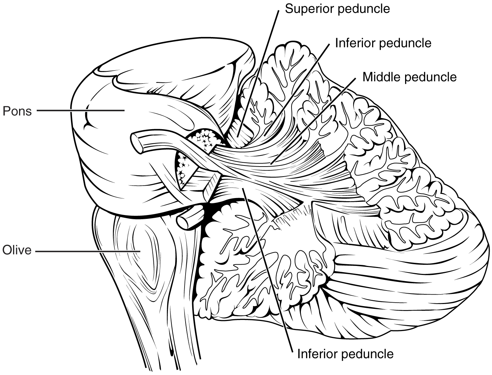

By the end of this section, you will be able to:
* Explain the relationship between the location of the cerebellum and its function in movement
* Chart the major divisions of the cerebellum
* List the major connections of the cerebellum
* Describe the relationship of the cerebellum to axial and appendicular musculature
* Explain the prevalent causes of cerebellar ataxia

The role of the cerebellum is a subject of debate. There is an obvious connection to motor function based on the clinical implications of cerebellar damage. There is also strong evidence of the cerebellar role in procedural memory. The two are not incompatible; in fact, procedural memory is motor memory, such as learning to ride a bicycle. Significant work has been performed to describe the connections within the cerebellum that result in learning. A model for this learning is classical conditioning, as shown by the famous dogs from the physiologist Ivan Pavlov’s work. This classical conditioning, which can be related to motor learning, fits with the neural connections of the cerebellum. The cerebellum is 10 percent of the mass of the brain and has varied functions that all point to a role in the motor system.

### Location and Connections of the Cerebellum

The cerebellum is located in apposition to the dorsal surface of the brain stem, centered on the pons. The name of the pons is derived from its connection to the cerebellum. The word means “bridge” and refers to the thick bundle of myelinated axons that form a bulge on its ventral surface. Those fibers are axons that project from the gray matter of the pons into the contralateral cerebellar cortex. These fibers make up the **middle cerebellar peduncle (MCP)**{: data-type="term"} and are the major physical connection of the cerebellum to the brain stem ([\[link\]](#fig-ch16_05_01)). Two other white matter bundles connect the cerebellum to the other regions of the brain stem. The **superior cerebellar peduncle (SCP)**{: data-type="term"} is the connection of the cerebellum to the midbrain and forebrain. The **inferior cerebellar peduncle (ICP)**{: data-type="term"} is the connection to the medulla.

 {: #fig-ch16_05_01 data-title="Cerebellar Penduncles"}

These connections can also be broadly described by their functions. The ICP conveys sensory input to the cerebellum, partially from the spinocerebellar tract, but also through fibers of the **inferior olive**{: data-type="term"}. The MCP is part of the **cortico-ponto-cerebellar pathway**{: data-type="term"} that connects the cerebral cortex with the cerebellum and preferentially targets the lateral regions of the cerebellum. It includes a copy of the motor commands sent from the precentral gyrus through the corticospinal tract, arising from collateral branches that synapse in the gray matter of the pons, along with input from other regions such as the visual cortex. The SCP is the major output of the cerebellum, divided between the **red nucleus**{: data-type="term"} in the midbrain and the thalamus, which will return cerebellar processing to the motor cortex. These connections describe a circuit that compares motor commands and sensory feedback to generate a new output. These comparisons make it possible to coordinate movements. If the cerebral cortex sends a motor command to initiate walking, that command is copied by the pons and sent into the cerebellum through the MCP. Sensory feedback in the form of proprioception from the spinal cord, as well as vestibular sensations from the inner ear, enters through the ICP. If you take a step and begin to slip on the floor because it is wet, the output from the cerebellum—through the SCP—can correct for that and keep you balanced and moving. The red nucleus sends new motor commands to the spinal cord through the **rubrospinal tract**{: data-type="term"}.

The cerebellum is divided into regions that are based on the particular functions and connections involved. The midline regions of the cerebellum, the **vermis**{: data-type="term"} and **flocculonodular lobe**{: data-type="term"}, are involved in comparing visual information, equilibrium, and proprioceptive feedback to maintain balance and coordinate movements such as walking, or **gait**{: data-type="term"}, through the descending output of the red nucleus ([\[link\]](#fig-ch16_05_02)). The lateral hemispheres are primarily concerned with planning motor functions through frontal lobe inputs that are returned through the thalamic projections back to the premotor and motor cortices. Processing in the midline regions targets movements of the axial musculature, whereas the lateral regions target movements of the appendicular musculature. The vermis is referred to as the **spinocerebellum**{: data-type="term"} because it primarily receives input from the dorsal columns and spinocerebellar pathways. The flocculonodular lobe is referred to as the **vestibulocerebellum**{: data-type="term"} because of the vestibular projection into that region. Finally, the lateral cerebellum is referred to as the **cerebrocerebellum**{: data-type="term"}, reflecting the significant input from the cerebral cortex through the cortico-ponto-cerebellar pathway.

 {: #fig-ch16_05_02 data-title="Major Regions of the Cerebellum"}

### Coordination and Alternating Movement

Testing for cerebellar function is the basis of the coordination exam. The subtests target appendicular musculature, controlling the limbs, and axial musculature for posture and gait. The assessment of cerebellar function will depend on the normal functioning of other systems addressed in previous sections of the neurological exam. Motor control from the cerebrum, as well as sensory input from somatic, visual, and vestibular senses, are important to cerebellar function.

The subtests that address appendicular musculature, and therefore the lateral regions of the cerebellum, begin with a check for tremor. The patient extends their arms in front of them and holds the position. The examiner watches for the presence of tremors that would not be present if the muscles are relaxed. By pushing down on the arms in this position, the examiner can check for the rebound response, which is when the arms are automatically brought back to the extended position. The extension of the arms is an ongoing motor process, and the tap or push on the arms presents a change in the proprioceptive feedback. The cerebellum compares the cerebral motor command with the proprioceptive feedback and adjusts the descending input to correct. The red nucleus would send an additional signal to the LMN for the arm to increase contraction momentarily to overcome the change and regain the original position.

The **check reflex**{: data-type="term"} depends on cerebellar input to keep increased contraction from continuing after the removal of resistance. The patient flexes the elbow against resistance from the examiner to extend the elbow. When the examiner releases the arm, the patient should be able to stop the increased contraction and keep the arm from moving. A similar response would be seen if you try to pick up a coffee mug that you believe to be full but turns out to be empty. Without checking the contraction, the mug would be thrown from the overexertion of the muscles expecting to lift a heavier object.

Several subtests of the cerebellum assess the ability to alternate movements, or switch between muscle groups that may be antagonistic to each other. In the finger-to-nose test, the patient touches their finger to the examiner’s finger and then to their nose, and then back to the examiner’s finger, and back to the nose. The examiner moves the target finger to assess a range of movements. A similar test for the lower extremities has the patient touch their toe to a moving target, such as the examiner’s finger. Both of these tests involve flexion and extension around a joint—the elbow or the knee and the shoulder or hip—as well as movements of the wrist and ankle. The patient must switch between the opposing muscles, like the biceps and triceps brachii, to move their finger from the target to their nose. Coordinating these movements involves the motor cortex communicating with the cerebellum through the pons and feedback through the thalamus to plan the movements. Visual cortex information is also part of the processing that occurs in the cerebrocerebellum while it is involved in guiding movements of the finger or toe.

Rapid, alternating movements are tested for the upper and lower extremities. The patient is asked to touch each finger to their thumb, or to pat the palm of one hand on the back of the other, and then flip that hand over and alternate back-and-forth. To test similar function in the lower extremities, the patient touches their heel to their shin near the knee and slides it down toward the ankle, and then back again, repetitively. Rapid, alternating movements are part of speech as well. A patient is asked to repeat the nonsense consonants “lah-kah-pah” to alternate movements of the tongue, lips, and palate. All of these rapid alternations require planning from the cerebrocerebellum to coordinate movement commands that control the coordination.

### Posture and Gait

Gait can either be considered a separate part of the neurological exam or a subtest of the coordination exam that addresses walking and balance. Testing posture and gait addresses functions of the spinocerebellum and the vestibulocerebellum because both are part of these activities. A subtest called station begins with the patient standing in a normal position to check for the placement of the feet and balance. The patient is asked to hop on one foot to assess the ability to maintain balance and posture during movement. Though the station subtest appears to be similar to the Romberg test, the difference is that the patient’s eyes are open during station. The Romberg test has the patient stand still with the eyes closed. Any changes in posture would be the result of proprioceptive deficits, and the patient is able to recover when they open their eyes.

Subtests of walking begin with having the patient walk normally for a distance away from the examiner, and then turn and return to the starting position. The examiner watches for abnormal placement of the feet and the movement of the arms relative to the movement. The patient is then asked to walk with a few different variations. Tandem gait is when the patient places the heel of one foot against the toe of the other foot and walks in a straight line in that manner. Walking only on the heels or only on the toes will test additional aspects of balance.

### Ataxia

A movement disorder of the cerebellum is referred to as **ataxia**{: data-type="term"}. It presents as a loss of coordination in voluntary movements. Ataxia can also refer to sensory deficits that cause balance problems, primarily in proprioception and equilibrium. When the problem is observed in movement, it is ascribed to cerebellar damage. Sensory and vestibular ataxia would likely also present with problems in gait and station.

Ataxia is often the result of exposure to exogenous substances, focal lesions, or a genetic disorder. Focal lesions include strokes affecting the cerebellar arteries, tumors that may impinge on the cerebellum, trauma to the back of the head and neck, or MS. Alcohol intoxication or drugs such as ketamine cause ataxia, but it is often reversible. Mercury in fish can cause ataxia as well. Hereditary conditions can lead to degeneration of the cerebellum or spinal cord, as well as malformation of the brain, or the abnormal accumulation of copper seen in Wilson’s disease.

  
Watch this short [video][1] to see a test for station. Station refers to the position a person adopts when they are standing still. The examiner would look for issues with balance, which coordinates proprioceptive, vestibular, and visual information in the cerebellum. To test the ability of a subject to maintain balance, asking them to stand or hop on one foot can be more demanding. The examiner may also push the subject to see if they can maintain balance. An abnormal finding in the test of station is if the feet are placed far apart. Why would a wide stance suggest problems with cerebellar function?

Everyday Connections

The Field Sobriety Test The neurological exam has been described as a clinical tool throughout this chapter. It is also useful in other ways. A variation of the coordination exam is the Field Sobriety Test (FST) used to assess whether drivers are under the influence of alcohol. The cerebellum is crucial for coordinated movements such as keeping balance while walking, or moving appendicular musculature on the basis of proprioceptive feedback. The cerebellum is also very sensitive to ethanol, the particular type of alcohol found in beer, wine, and liquor.

Walking in a straight line involves comparing the motor command from the primary motor cortex to the proprioceptive and vestibular sensory feedback, as well as following the visual guide of the white line on the side of the road. When the cerebellum is compromised by alcohol, the cerebellum cannot coordinate these movements effectively, and maintaining balance becomes difficult.

Another common aspect of the FST is to have the driver extend their arms out wide and touch their fingertip to their nose, usually with their eyes closed. The point of this is to remove the visual feedback for the movement and force the driver to rely just on proprioceptive information about the movement and position of their fingertip relative to their nose. With eyes open, the corrections to the movement of the arm might be so small as to be hard to see, but proprioceptive feedback is not as immediate and broader movements of the arm will probably be needed, particularly if the cerebellum is affected by alcohol.

Reciting the alphabet backwards is not always a component of the FST, but its relationship to neurological function is interesting. There is a cognitive aspect to remembering how the alphabet goes and how to recite it backwards. That is actually a variation of the mental status subtest of repeating the months backwards. However, the cerebellum is important because speech production is a coordinated activity. The speech rapid alternating movement subtest is specifically using the consonant changes of “lah-kah-pah” to assess coordinated movements of the lips, tongue, pharynx, and palate. But the entire alphabet, especially in the nonrehearsed backwards order, pushes this type of coordinated movement quite far. It is related to the reason that speech becomes slurred when a person is intoxicated.

### Chapter Review

The cerebellum is an important part of motor function in the nervous system. It apparently plays a role in procedural learning, which would include motor skills such as riding a bike or throwing a football. The basis for these roles is likely to be tied into the role the cerebellum plays as a comparator for voluntary movement.

The motor commands from the cerebral hemispheres travel along the corticospinal pathway, which passes through the pons. Collateral branches of these fibers synapse on neurons in the pons, which then project into the cerebellar cortex through the middle cerebellar peduncles. Ascending sensory feedback, entering through the inferior cerebellar peduncles, provides information about motor performance. The cerebellar cortex compares the command to the actual performance and can adjust the descending input to compensate for any mismatch. The output from deep cerebellar nuclei projects through the superior cerebellar peduncles to initiate descending signals from the red nucleus to the spinal cord.

The primary role of the cerebellum in relation to the spinal cord is through the spinocerebellum; it controls posture and gait with significant input from the vestibular system. Deficits in cerebellar function result in ataxias, or a specific kind of movement disorder. The root cause of the ataxia may be the sensory input—either the proprioceptive input from the spinal cord or the equilibrium input from the vestibular system, or direct damage to the cerebellum by stroke, trauma, hereditary factors, or toxins.

### Interactive Link Questions

Watch this short [video][1] to see a test for station. Station refers to the position a person adopts when they are standing still. The examiner would look for issues with balance, which coordinates proprioceptive, vestibular, and visual information in the cerebellum. To test the ability of a subject to maintain balance, asking them to stand or hop on one foot can be more demanding. The examiner may also push the subject to see if they can maintain balance. An abnormal finding in the test of station is if the feet are placed far apart. Why would a wide stance suggest problems with cerebellar function?

A wide stance would suggest the person needs to maintain balance by broadening their base. Instead of continuous correction to posture, this can keep the body stable when the cerebellum cannot.

### Review Questions

Which white matter structure carries information from the cerebral cortex to the cerebellum?

1.  cerebral peduncle
2.  superior cerebellar peduncle
3.  middle cerebellar peduncle
4.  inferior cerebellar peduncle
{: type="a"}

C

Which region of the cerebellum receives proprioceptive input from the spinal cord?

1.  vermis
2.  left hemisphere
3.  flocculonodular lobe
4.  right hemisphere
{: type="a"}

A

Which of the following tests cerebellar function related to gait?

1.  toe-to-finger
2.  station
3.  lah-kah-pah
4.  finger-to-nose
{: type="a"}

B

Which of the following is *not* a cause of cerebellar ataxia?

1.  mercury from fish
2.  drinking alcohol
3.  antibiotics
4.  hereditary degeneration of the cerebellum
{: type="a"}

C

Which of the following functions *cannot* be attributed to the cerebellum?

1.  comparing motor commands and sensory feedback
2.  associating sensory stimuli with learned behavior
3.  coordinating complex movements
4.  processing visual information
{: type="a"}

D

### Critical Thinking Questions

Learning to ride a bike is a motor function dependent on the cerebellum. Why are the different regions of the cerebellum involved in this complex motor learning?

The spinocerebellum is related to controlling the axial muscles and keeps the body balanced on the bike. The cerebrocerebellum is related to controlling the appendicular muscles and keeps the legs moving to pedal the bike. The vestibulocerebellum receives input about equilibrium to help keep everything balanced as the bike is moving forward.

Alcohol intoxication can produce slurred speech. How is this related to cerebellar function?

Rapid alternating movements in speech relate to how the lips, tongue, and palate move to produce speech sounds. The cerebrocerebellum is required for the proper implementation of these movements.

### Glossary
{: data-type="glossary-title"}

ataxia
: movement disorder related to damage of the cerebellum characterized by loss of coordination in voluntary movements
^

cerebrocerebellum
: lateral regions of the cerebellum; named for the significant input from the cerebral cortex
^

check reflex
: response to a release in resistance so that the contractions stop, or check, movement
^

cortico-ponto-cerebellar pathway
: projection from the cerebral cortex to the cerebellum by way of the gray matter of the pons
^

flocculonodular lobe
: lobe of the cerebellum that receives input from the vestibular system to help with balance and posture
^

gait
: rhythmic pattern of alternating movements of the lower limbs during locomotion
^

inferior cerebellar peduncle (ICP)
: input to the cerebellum, largely from the inferior olive, that represents sensory feedback from the periphery
^

inferior olive
: large nucleus in the medulla that receives input from sensory systems and projects into the cerebellar cortex
^

middle cerebellar peduncle (MCP)
: large, white-matter bridge from the pons that constitutes the major input to the cerebellar cortex
^

red nucleus
: nucleus in the midbrain that receives output from the cerebellum and projects onto the spinal cord in the rubrospinal tract
^

rubrospinal tract
: descending tract from the red nucleus of the midbrain that results in modification of ongoing motor programs
^

spinocerebellum
: midline region of the cerebellum known as the vermis that receives proprioceptive input from the spinal cord
^

superior cerebellar peduncle (SCP)
: white-matter tract representing output of the cerebellum to the red nucleus of the midbrain
^

vermis
: prominent ridge along the midline of the cerebellum that is referred to as the spinocerebellum
^

vestibulocerebellum
: flocculonodular lobe of the cerebellum named for the vestibular input from the eighth cranial nerve

[1]: http://openstaxcollege.org/l/stationtest
