

By the end of this section, you will be able to:
* Identify the vessels through which blood travels within the pulmonary circuit, beginning from the right ventricle of the heart and ending at the left atrium
* Create a flow chart showing the major systemic arteries through which blood travels from the aorta and its major branches, to the most significant arteries feeding into the right and left upper and lower limbs
* Create a flow chart showing the major systemic veins through which blood travels from the feet to the right atrium of the heart

Virtually every cell, tissue, organ, and system in the body is impacted by the circulatory system. This includes the generalized and more specialized functions of transport of materials, capillary exchange, maintaining health by transporting white blood cells and various immunoglobulins (antibodies), hemostasis, regulation of body temperature, and helping to maintain acid-base balance. In addition to these shared functions, many systems enjoy a unique relationship with the circulatory system. [\[link\]](#fig-ch21_05_01) summarizes these relationships.

 {: #fig-ch21_05_01 data-title="Interaction of the Circulatory System with Other Body Systems "}

As you learn about the vessels of the systemic and pulmonary circuits, notice that many arteries and veins share the same names, parallel one another throughout the body, and are very similar on the right and left sides of the body. These pairs of vessels will be traced through only one side of the body. Where differences occur in branching patterns or when vessels are singular, this will be indicated. For example, you will find a pair of femoral arteries and a pair of femoral veins, with one vessel on each side of the body. In contrast, some vessels closer to the midline of the body, such as the aorta, are unique. Moreover, some superficial veins, such as the great saphenous vein in the femoral region, have no arterial counterpart. Another phenomenon that can make the study of vessels challenging is that names of vessels can change with location. Like a street that changes name as it passes through an intersection, an artery or vein can change names as it passes an anatomical landmark. For example, the left subclavian artery becomes the axillary artery as it passes through the body wall and into the axillary region, and then becomes the brachial artery as it flows from the axillary region into the upper arm (or brachium). You will also find examples of anastomoses where two blood vessels that previously branched reconnect. Anastomoses are especially common in veins, where they help maintain blood flow even when one vessel is blocked or narrowed, although there are some important ones in the arteries supplying the brain.

As you read about circular pathways, notice that there is an occasional, very large artery referred to as a **trunk**{: data-type="term"}, a term indicating that the vessel gives rise to several smaller arteries. For example, the celiac trunk gives rise to the left gastric, common hepatic, and splenic arteries.

As you study this section, imagine you are on a “Voyage of Discovery” similar to Lewis and Clark’s expedition in 1804–1806, which followed rivers and streams through unfamiliar territory, seeking a water route from the Atlantic to the Pacific Ocean. You might envision being inside a miniature boat, exploring the various branches of the circulatory system. This simple approach has proven effective for many students in mastering these major circulatory patterns. Another approach that works well for many students is to create simple line drawings similar to the ones provided, labeling each of the major vessels. It is beyond the scope of this text to name every vessel in the body. However, we will attempt to discuss the major pathways for blood and acquaint you with the major named arteries and veins in the body. Also, please keep in mind that individual variations in circulation patterns are not uncommon.

Visit this [site][1] for a brief summary of the arteries.

### Pulmonary Circulation

Recall that blood returning from the systemic circuit enters the right atrium ([\[link\]](#fig-ch21_05_02)) via the superior and inferior venae cavae and the coronary sinus, which drains the blood supply of the heart muscle. These vessels will be described more fully later in this section. This blood is relatively low in oxygen and relatively high in carbon dioxide, since much of the oxygen has been extracted for use by the tissues and the waste gas carbon dioxide was picked up to be transported to the lungs for elimination. From the right atrium, blood moves into the right ventricle, which pumps it to the lungs for gas exchange. This system of vessels is referred to as the **pulmonary circuit**{: data-type="term"}.

The single vessel exiting the right ventricle is the **pulmonary trunk**{: data-type="term"}. At the base of the pulmonary trunk is the pulmonary semilunar valve, which prevents backflow of blood into the right ventricle during ventricular diastole. As the pulmonary trunk reaches the superior surface of the heart, it curves posteriorly and rapidly bifurcates (divides) into two branches, a left and a right **pulmonary artery**{: data-type="term"}. To prevent confusion between these vessels, it is important to refer to the vessel exiting the heart as the pulmonary trunk, rather than also calling it a pulmonary artery. The pulmonary arteries in turn branch many times within the lung, forming a series of smaller arteries and arterioles that eventually lead to the pulmonary capillaries. The pulmonary capillaries surround lung structures known as alveoli that are the sites of oxygen and carbon dioxide exchange.

Once gas exchange is completed, oxygenated blood flows from the pulmonary capillaries into a series of pulmonary venules that eventually lead to a series of larger **pulmonary veins**{: data-type="term"}. Four pulmonary veins, two on the left and two on the right, return blood to the left atrium. At this point, the pulmonary circuit is complete. [\[link\]](#tbl-ch21_04) defines the major arteries and veins of the pulmonary circuit discussed in the text.

 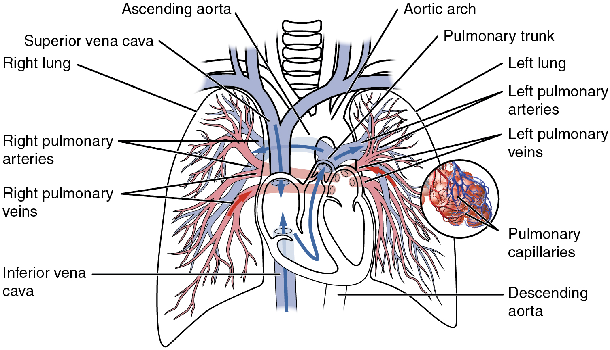{: #fig-ch21_05_02 data-title="Pulmonary Circuit "}

<table id="tbl-ch21_04" summary=""><thead>
<tr>
<th colspan="2">Pulmonary Arteries and Veins</th>
</tr>
<tr>
<th>Vessel</th>
<th>Description</th>
</tr>
</thead><tbody>
<tr>
<td>Pulmonary trunk</td>
<td>Single large vessel exiting the right ventricle that divides to form the right and left pulmonary arteries</td>
</tr>
<tr>
<td>Pulmonary arteries</td>
<td>Left and right vessels that form from the pulmonary trunk and lead to smaller arterioles and eventually to the pulmonary capillaries</td>
</tr>
<tr>
<td>Pulmonary veins</td>
<td>Two sets of paired vessels—one pair on each side—that are formed from the small venules, leading away from the pulmonary capillaries to flow into the left atrium</td>
</tr>
</tbody></table>

### Overview of Systemic Arteries

Blood relatively high in oxygen concentration is returned from the pulmonary circuit to the left atrium via the four pulmonary veins. From the left atrium, blood moves into the left ventricle, which pumps blood into the aorta. The aorta and its branches—the systemic arteries—send blood to virtually every organ of the body ([\[link\]](#fig-ch21_05_03)).

 {: #fig-ch21_05_03 data-title="Systemic Arteries "}

### The Aorta

The **aorta**{: data-type="term"} is the largest artery in the body ([\[link\]](#fig-ch21_05_04)). It arises from the left ventricle and eventually descends to the abdominal region, where it bifurcates at the level of the fourth lumbar vertebra into the two common iliac arteries. The aorta consists of the ascending aorta, the aortic arch, and the descending aorta, which passes through the diaphragm and a landmark that divides into the superior thoracic and inferior abdominal components. Arteries originating from the aorta ultimately distribute blood to virtually all tissues of the body. At the base of the aorta is the aortic semilunar valve that prevents backflow of blood into the left ventricle while the heart is relaxing. After exiting the heart, the **ascending aorta**{: data-type="term"} moves in a superior direction for approximately 5 cm and ends at the sternal angle. Following this ascent, it reverses direction, forming a graceful arc to the left, called the **aortic arch**{: data-type="term"}. The aortic arch descends toward the inferior portions of the body and ends at the level of the intervertebral disk between the fourth and fifth thoracic vertebrae. Beyond this point, the **descending aorta**{: data-type="term"} continues close to the bodies of the vertebrae and passes through an opening in the diaphragm known as the **aortic hiatus**{: data-type="term"}. Superior to the diaphragm, the aorta is called the **thoracic aorta**{: data-type="term"}, and inferior to the diaphragm, it is called the **abdominal aorta**{: data-type="term"}. The abdominal aorta terminates when it bifurcates into the two common iliac arteries at the level of the fourth lumbar vertebra. See [\[link\]](#fig-ch21_05_04) for an illustration of the ascending aorta, the aortic arch, and the initial segment of the descending aorta plus major branches; [\[link\]](#tbl-ch21_05) summarizes the structures of the aorta.

 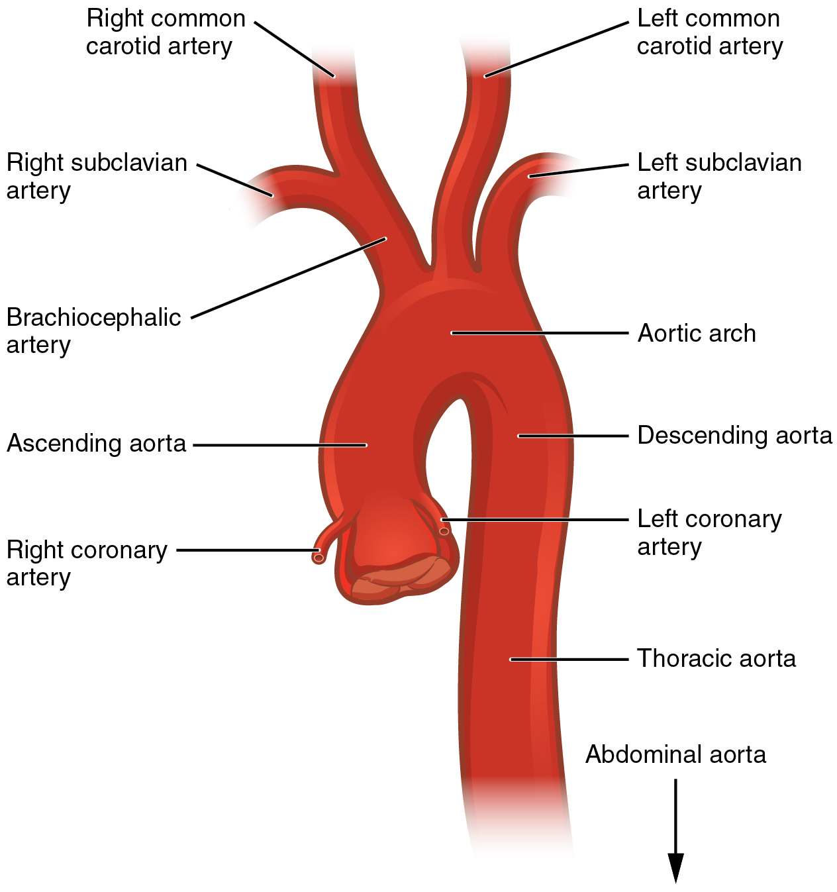{: #fig-ch21_05_04 data-title="Aorta "}

<table id="tbl-ch21_05" summary=""><colgroup><col width="100" /><col /></colgroup><thead>
<tr>
<th colspan="2">Components of the Aorta</th>
</tr>
<tr>
<th>Vessel</th>
<th>Description</th>
</tr>
</thead><tbody>
<tr>
<td>Aorta</td>
<td>Largest artery in the body, originating from the left ventricle and descending to the abdominal region, where it bifurcates into the common iliac arteries at the level of the fourth lumbar vertebra; arteries originating from the aorta distribute blood to virtually all tissues of the body</td>
</tr>
<tr>
<td>Ascending aorta</td>
<td>Initial portion of the aorta, rising superiorly from the left ventricle for a distance of approximately 5 cm</td>
</tr>
<tr>
<td>Aortic arch</td>
<td>Graceful arc to the left that connects the ascending aorta to the descending aorta; ends at the intervertebral disk between the fourth and fifth thoracic vertebrae</td>
</tr>
<tr>
<td>Descending aorta</td>
<td>Portion of the aorta that continues inferiorly past the end of the aortic arch; subdivided into the thoracic aorta and the abdominal aorta</td>
</tr>
<tr>
<td>Thoracic aorta</td>
<td>Portion of the descending aorta superior to the aortic hiatus</td>
</tr>
<tr>
<td>Abdominal aorta</td>
<td>Portion of the aorta inferior to the aortic hiatus and superior to the common iliac arteries</td>
</tr>
</tbody></table>

#### Coronary Circulation

The first vessels that branch from the ascending aorta are the paired coronary arteries (see [\[link\]](#fig-ch21_05_04)), which arise from two of the three sinuses in the ascending aorta just superior to the aortic semilunar valve. These sinuses contain the aortic baroreceptors and chemoreceptors critical to maintain cardiac function. The left coronary artery arises from the left posterior aortic sinus. The right coronary artery arises from the anterior aortic sinus. Normally, the right posterior aortic sinus does not give rise to a vessel.

The coronary arteries encircle the heart, forming a ring-like structure that divides into the next level of branches that supplies blood to the heart tissues. (Seek additional content for more detail on cardiac circulation.)

#### Aortic Arch Branches

There are three major branches of the aortic arch: the brachiocephalic artery, the left common carotid artery, and the left subclavian (literally “under the clavicle”) artery. As you would expect based upon proximity to the heart, each of these vessels is classified as an elastic artery.

The brachiocephalic artery is located only on the right side of the body; there is no corresponding artery on the left. The brachiocephalic artery branches into the right subclavian artery and the right common carotid artery. The left subclavian and left common carotid arteries arise independently from the aortic arch but otherwise follow a similar pattern and distribution to the corresponding arteries on the right side (see [\[link\]](#fig-ch21_05_02)).

Each **subclavian artery**{: data-type="term"} supplies blood to the arms, chest, shoulders, back, and central nervous system. It then gives rise to three major branches: the internal thoracic artery, the vertebral artery, and the thyrocervical artery. The **internal thoracic artery**{: data-type="term"}, or mammary artery, supplies blood to the thymus, the pericardium of the heart, and the anterior chest wall. The **vertebral artery**{: data-type="term"} passes through the vertebral foramen in the cervical vertebrae and then through the foramen magnum into the cranial cavity to supply blood to the brain and spinal cord. The paired vertebral arteries join together to form the large basilar artery at the base of the medulla oblongata. This is an example of an anastomosis. The subclavian artery also gives rise to the **thyrocervical artery**{: data-type="term"} that provides blood to the thyroid, the cervical region of the neck, and the upper back and shoulder.

The **common carotid artery**{: data-type="term"} divides into internal and external carotid arteries. The right common carotid artery arises from the brachiocephalic artery and the left common carotid artery arises directly from the aortic arch. The **external carotid artery**{: data-type="term"} supplies blood to numerous structures within the face, lower jaw, neck, esophagus, and larynx. These branches include the lingual, facial, occipital, maxillary, and superficial temporal arteries. The **internal carotid artery**{: data-type="term"} initially forms an expansion known as the carotid sinus, containing the carotid baroreceptors and chemoreceptors. Like their counterparts in the aortic sinuses, the information provided by these receptors is critical to maintaining cardiovascular homeostasis (see [\[link\]](#fig-ch21_05_02)).

The internal carotid arteries along with the vertebral arteries are the two primary suppliers of blood to the human brain. Given the central role and vital importance of the brain to life, it is critical that blood supply to this organ remains uninterrupted. Recall that blood flow to the brain is remarkably constant, with approximately 20 percent of blood flow directed to this organ at any given time. When blood flow is interrupted, even for just a few seconds, a **transient ischemic attack (TIA)**{: data-type="term"}, or mini-stroke, may occur, resulting in loss of consciousness or temporary loss of neurological function. In some cases, the damage may be permanent. Loss of blood flow for longer periods, typically between 3 and 4 minutes, will likely produce irreversible brain damage or a stroke, also called a **cerebrovascular accident (CVA)**{: data-type="term"}. The locations of the arteries in the brain not only provide blood flow to the brain tissue but also prevent interruption in the flow of blood. Both the carotid and vertebral arteries branch once they enter the cranial cavity, and some of these branches form a structure known as the **arterial circle**{: data-type="term"} (or **circle of Willis**{: data-type="term"}), an anastomosis that is remarkably like a traffic circle that sends off branches (in this case, arterial branches to the brain). As a rule, branches to the anterior portion of the cerebrum are normally fed by the internal carotid arteries; the remainder of the brain receives blood flow from branches associated with the vertebral arteries.

The internal carotid artery continues through the carotid canal of the temporal bone and enters the base of the brain through the carotid foramen where it gives rise to several branches ([\[link\]](#fig-ch21_05_05) and [\[link\]](#fig-ch21_05_06)). One of these branches is the **anterior cerebral artery**{: data-type="term"} that supplies blood to the frontal lobe of the cerebrum. Another branch, the **middle cerebral artery**{: data-type="term"}, supplies blood to the temporal and parietal lobes, which are the most common sites of CVAs. The **ophthalmic artery**{: data-type="term"}, the third major branch, provides blood to the eyes.

The right and left anterior cerebral arteries join together to form an anastomosis called the **anterior communicating artery**{: data-type="term"}. The initial segments of the anterior cerebral arteries and the anterior communicating artery form the anterior portion of the arterial circle. The posterior portion of the arterial circle is formed by a left and a right **posterior communicating artery**{: data-type="term"} that branches from the **posterior cerebral artery**{: data-type="term"}, which arises from the basilar artery. It provides blood to the posterior portion of the cerebrum and brain stem. The **basilar artery**{: data-type="term"} is an anastomosis that begins at the junction of the two vertebral arteries and sends branches to the cerebellum and brain stem. It flows into the posterior cerebral arteries. [\[link\]](#tbl-ch21_06) summarizes the aortic arch branches, including the major branches supplying the brain.

 {: #fig-ch21_05_05 data-title="Arteries Supplying the Head and Neck "}

{: #fig-ch21_05_06 data-title="Arteries Serving the Brain "}

<table id="tbl-ch21_06" summary=""><colgroup><col width="100" /><col /></colgroup><thead>
<tr>
<th colspan="2">Aortic Arch Branches and Brain Circulation</th>
</tr>
<tr>
<th>Vessel</th>
<th>Description</th>
</tr>
</thead><tbody>
<tr>
<td>Brachiocephalic artery</td>
<td>Single vessel located on the right side of the body; the first vessel branching from the aortic arch; gives rise to the right subclavian artery and the right common carotid artery; supplies blood to the head, neck, upper limb, and wall of the thoracic region</td>
</tr>
<tr>
<td>Subclavian artery</td>
<td>The right subclavian artery arises from the brachiocephalic artery while the left subclavian artery arises from the aortic arch; gives rise to the internal thoracic, vertebral, and thyrocervical arteries; supplies blood to the arms, chest, shoulders, back, and central nervous system</td>
</tr>
<tr>
<td>Internal thoracic artery</td>
<td>Also called the mammary artery; arises from the subclavian artery; supplies blood to the thymus, pericardium of the heart, and anterior chest wall</td>
</tr>
<tr>
<td>Vertebral artery</td>
<td>Arises from the subclavian artery and passes through the vertebral foramen through the foramen magnum to the brain; joins with the internal carotid artery to form the arterial circle; supplies blood to the brain and spinal cord</td>
</tr>
<tr>
<td>Thyrocervical artery</td>
<td>Arises from the subclavian artery; supplies blood to the thyroid, the cervical region, the upper back, and shoulder</td>
</tr>
<tr>
<td>Common carotid artery</td>
<td>The right common carotid artery arises from the brachiocephalic artery and the left common carotid artery arises from the aortic arch; each gives rise to the external and internal carotid arteries; supplies the respective sides of the head and neck</td>
</tr>
<tr>
<td>External carotid artery</td>
<td>Arises from the common carotid artery; supplies blood to numerous structures within the face, lower jaw, neck, esophagus, and larynx</td>
</tr>
<tr>
<td>Internal carotid artery</td>
<td>Arises from the common carotid artery and begins with the carotid sinus; goes through the carotid canal of the temporal bone to the base of the brain; combines with the branches of the vertebral artery, forming the arterial circle; supplies blood to the brain</td></tr>
<tr>
<td>Arterial circle or circle of Willis</td>
<td>An anastomosis located at the base of the brain that ensures continual blood supply; formed from the branches of the internal carotid and vertebral arteries; supplies blood to the brain</td>
</tr>
<tr>
<td>Anterior cerebral artery</td>
<td>Arises from the internal carotid artery; supplies blood to the frontal lobe of the cerebrum</td>
</tr>
<tr>
<td>Middle cerebral artery</td>
<td>Another branch of the internal carotid artery; supplies blood to the temporal and parietal lobes of the cerebrum</td>
</tr>
<tr>
<td>Ophthalmic artery</td>
<td>Branch of the internal carotid artery; supplies blood to the eyes</td></tr>
<tr>
<td>Anterior communicating artery</td>
<td>An anastomosis of the right and left internal carotid arteries; supplies blood to the brain</td></tr>
<tr>
<td>Posterior communicating artery</td>
<td>Branches of the posterior cerebral artery that form part of the posterior portion of the arterial circle; supplies blood to the brain</td></tr>
<tr>
<td>Posterior cerebral artery</td>
<td>Branch of the basilar artery that forms a portion of the posterior segment of the arterial circle of Willis; supplies blood to the posterior portion of the cerebrum and brain stem</td></tr>
<tr>
<td>Basilar artery</td>
<td>Formed from the fusion of the two vertebral arteries; sends branches to the cerebellum, brain stem, and the posterior cerebral arteries; the main blood supply to the brain stem</td></tr>
</tbody></table>

#### Thoracic Aorta and Major Branches

The thoracic aorta begins at the level of vertebra T5 and continues through to the diaphragm at the level of T12, initially traveling within the mediastinum to the left of the vertebral column. As it passes through the thoracic region, the thoracic aorta gives rise to several branches, which are collectively referred to as visceral branches and parietal branches ([\[link\]](#fig-ch21_05_07)). Those branches that supply blood primarily to visceral organs are known as the **visceral branches**{: data-type="term"} and include the bronchial arteries, pericardial arteries, esophageal arteries, and the mediastinal arteries, each named after the tissues it supplies. Each **bronchial artery**{: data-type="term"} (typically two on the left and one on the right) supplies systemic blood to the lungs and visceral pleura, in addition to the blood pumped to the lungs for oxygenation via the pulmonary circuit. The bronchial arteries follow the same path as the respiratory branches, beginning with the bronchi and ending with the bronchioles. There is considerable, but not total, intermingling of the systemic and pulmonary blood at anastomoses in the smaller branches of the lungs. This may sound incongruous—that is, the mixing of systemic arterial blood high in oxygen with the pulmonary arterial blood lower in oxygen—but the systemic vessels also deliver nutrients to the lung tissue just as they do elsewhere in the body. The mixed blood drains into typical pulmonary veins, whereas the bronchial artery branches remain separate and drain into bronchial veins described later. Each **pericardial artery**{: data-type="term"} supplies blood to the pericardium, the **esophageal artery**{: data-type="term"} provides blood to the esophagus, and the **mediastinal artery**{: data-type="term"} provides blood to the mediastinum. The remaining thoracic aorta branches are collectively referred to as **parietal branches**{: data-type="term"} or somatic branches, and include the intercostal and superior phrenic arteries. Each **intercostal artery**{: data-type="term"} provides blood to the muscles of the thoracic cavity and vertebral column. The **superior phrenic artery**{: data-type="term"} provides blood to the superior surface of the diaphragm. [\[link\]](#tbl-ch21_07) lists the arteries of the thoracic region.

 {: #fig-ch21_05_07 data-title="Arteries of the Thoracic and Abdominal Regions "}

<table id="tbl-ch21_07" summary=""><colgroup><col width="90" /><col /></colgroup><thead>
<tr>
<th colspan="2">Arteries of the Thoracic Region</th>
</tr>
<tr>
<th>Vessel</th>
<th>Description</th>
</tr>
</thead><tbody>
<tr>
<td>Visceral branches</td>
<td>A group of arterial branches of the thoracic aorta; supplies blood to the viscera (i.e., organs) of the thorax</td>
</tr>
<tr>
<td>Bronchial artery</td>
<td>Systemic branch from the aorta that provides oxygenated blood to the lungs; this blood supply is in addition to the pulmonary circuit that brings blood for oxygenation</td>
</tr>
<tr>
<td>Pericardial artery</td>
<td>Branch of the thoracic aorta; supplies blood to the pericardium</td>
</tr>
<tr>
<td>Esophageal artery</td>
<td>Branch of the thoracic aorta; supplies blood to the esophagus</td>
</tr>
<tr>
<td>Mediastinal artery</td>
<td>Branch of the thoracic aorta; supplies blood to the mediastinum</td>
</tr>
<tr>
<td>Parietal branches</td>
<td>Also called somatic branches, a group of arterial branches of the thoracic aorta; include those that supply blood to the thoracic wall, vertebral column, and the superior surface of the diaphragm</td>
</tr>
<tr>
<td>Intercostal artery</td>
<td>Branch of the thoracic aorta; supplies blood to the muscles of the thoracic cavity and vertebral column</td>
</tr>
<tr>
<td>Superior phrenic artery</td>
<td>Branch of the thoracic aorta; supplies blood to the superior surface of the diaphragm</td>
</tr>
</tbody></table>

#### Abdominal Aorta and Major Branches

After crossing through the diaphragm at the aortic hiatus, the thoracic aorta is called the abdominal aorta (see [\[link\]](#fig-ch21_05_07)). This vessel remains to the left of the vertebral column and is embedded in adipose tissue behind the peritoneal cavity. It formally ends at approximately the level of vertebra L4, where it bifurcates to form the common iliac arteries. Before this division, the abdominal aorta gives rise to several important branches. A single **celiac trunk**{: data-type="term"} (artery) emerges and divides into the **left gastric artery**{: data-type="term"} to supply blood to the stomach and esophagus, the **splenic artery**{: data-type="term"} to supply blood to the spleen, and the **common hepatic artery**{: data-type="term"}, which in turn gives rise to the **hepatic artery proper**{: data-type="term"} to supply blood to the liver, the **right gastric artery**{: data-type="term"} to supply blood to the stomach, the **cystic artery**{: data-type="term"} to supply blood to the gall bladder, and several branches, one to supply blood to the duodenum and another to supply blood to the pancreas. Two additional single vessels arise from the abdominal aorta. These are the superior and inferior mesenteric arteries. The **superior mesenteric artery**{: data-type="term"} arises approximately 2.5 cm after the celiac trunk and branches into several major vessels that supply blood to the small intestine (duodenum, jejunum, and ileum), the pancreas, and a majority of the large intestine. The **inferior mesenteric artery**{: data-type="term"} supplies blood to the distal segment of the large intestine, including the rectum. It arises approximately 5 cm superior to the common iliac arteries.

In addition to these single branches, the abdominal aorta gives rise to several significant paired arteries along the way. These include the inferior phrenic arteries, the adrenal arteries, the renal arteries, the gonadal arteries, and the lumbar arteries. Each **inferior phrenic artery**{: data-type="term"} is a counterpart of a superior phrenic artery and supplies blood to the inferior surface of the diaphragm. The **adrenal artery**{: data-type="term"} supplies blood to the adrenal (suprarenal) glands and arises near the superior mesenteric artery. Each **renal artery**{: data-type="term"} branches approximately 2.5 cm inferior to the superior mesenteric arteries and supplies a kidney. The right renal artery is longer than the left since the aorta lies to the left of the vertebral column and the vessel must travel a greater distance to reach its target. Renal arteries branch repeatedly to supply blood to the kidneys. Each **gonadal artery**{: data-type="term"} supplies blood to the gonads, or reproductive organs, and is also described as either an ovarian artery or a testicular artery (internal spermatic), depending upon the sex of the individual. An **ovarian artery**{: data-type="term"} supplies blood to an ovary, uterine (Fallopian) tube, and the uterus, and is located within the suspensory ligament of the uterus. It is considerably shorter than a **testicular artery**{: data-type="term"}, which ultimately travels outside the body cavity to the testes, forming one component of the spermatic cord. The gonadal arteries arise inferior to the renal arteries and are generally retroperitoneal. The ovarian artery continues to the uterus where it forms an anastomosis with the uterine artery that supplies blood to the uterus. Both the uterine arteries and vaginal arteries, which distribute blood to the vagina, are branches of the internal iliac artery. The four paired **lumbar arteries**{: data-type="term"} are the counterparts of the intercostal arteries and supply blood to the lumbar region, the abdominal wall, and the spinal cord. In some instances, a fifth pair of lumbar arteries emerges from the median sacral artery.

The aorta divides at approximately the level of vertebra L4 into a left and a right **common iliac artery**{: data-type="term"} but continues as a small vessel, the **median sacral artery**{: data-type="term"}, into the sacrum. The common iliac arteries provide blood to the pelvic region and ultimately to the lower limbs. They split into external and internal iliac arteries approximately at the level of the lumbar-sacral articulation. Each **internal iliac artery**{: data-type="term"} sends branches to the urinary bladder, the walls of the pelvis, the external genitalia, and the medial portion of the femoral region. In females, they also provide blood to the uterus and vagina. The much larger **external iliac artery**{: data-type="term"} supplies blood to each of the lower limbs. [\[link\]](#fig-ch21_05_08) shows the distribution of the major branches of the aorta into the thoracic and abdominal regions. [\[link\]](#fig-ch21_05_09) shows the distribution of the major branches of the common iliac arteries. [\[link\]](#tbl-ch21_08) summarizes the major branches of the abdominal aorta.

 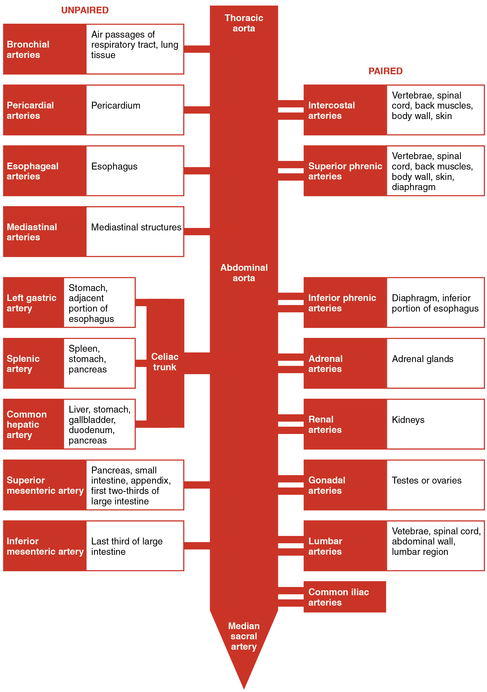{: #fig-ch21_05_08 data-title="Major Branches of the Aorta "}

{: #fig-ch21_05_09 data-title="Major Branches of the Iliac Arteries "}

<table id="tbl-ch21_08" summary=""><colgroup><col width="100" /><col /></colgroup><thead>
<tr>
<th colspan="2">Vessels of the Abdominal Aorta</th>
</tr>
<tr>
<th>Vessel</th>
<th>Description</th>
</tr>
</thead><tbody>
<tr>
<td>Celiac trunk</td>
<td>Also called the celiac artery; a major branch of the abdominal aorta; gives rise to the left gastric artery, the splenic artery, and the common hepatic artery that forms the hepatic artery to the liver, the right gastric artery to the stomach, and the cystic artery to the gall bladder</td>
</tr>
<tr>
<td>Left gastric artery</td>
<td>Branch of the celiac trunk; supplies blood to the stomach</td>
</tr>
<tr>
<td>Splenic artery</td>
<td>Branch of the celiac trunk; supplies blood to the spleen</td>
</tr>
<tr>
<td>Common hepatic artery</td>
<td>Branch of the celiac trunk that forms the hepatic artery, the right gastric artery, and the cystic artery</td>
</tr>
<tr>
<td>Hepatic artery proper</td>
<td>Branch of the common hepatic artery; supplies systemic blood to the liver</td>
</tr>
<tr>
<td>Right gastric artery</td>
<td>Branch of the common hepatic artery; supplies blood to the stomach</td>
</tr>
<tr>
<td>Cystic artery</td>
<td>Branch of the common hepatic artery; supplies blood to the gall bladder</td>
</tr>
<tr>
<td>Superior mesenteric artery</td>
<td>Branch of the abdominal aorta; supplies blood to the small intestine (duodenum, jejunum, and ileum), the pancreas, and a majority of the large intestine</td>
</tr>
<tr>
<td>Inferior mesenteric artery</td>
<td>Branch of the abdominal aorta; supplies blood to the distal segment of the large intestine and rectum</td>
</tr>
<tr>
<td>Inferior phrenic arteries</td>
<td>Branches of the abdominal aorta; supply blood to the inferior surface of the diaphragm</td>
</tr>
<tr>
<td>Adrenal artery</td>
<td>Branch of the abdominal aorta; supplies blood to the adrenal (suprarenal) glands</td>
</tr>
<tr>
<td>Renal artery</td>
<td>Branch of the abdominal aorta; supplies each kidney</td>
</tr>
<tr>
<td>Gonadal artery</td>
<td>Branch of the abdominal aorta; supplies blood to the gonads or reproductive organs; also described as ovarian arteries or testicular arteries, depending upon the sex of the individual</td>
</tr>
<tr>
<td>Ovarian artery</td>
<td>Branch of the abdominal aorta; supplies blood to ovary, uterine (Fallopian) tube, and uterus</td>
</tr>
<tr>
<td>Testicular artery</td>
<td>Branch of the abdominal aorta; ultimately travels outside the body cavity to the testes and forms one component of the spermatic cord</td>
</tr>
<tr>
<td>Lumbar arteries</td>
<td>Branches of the abdominal aorta; supply blood to the lumbar region, the abdominal wall, and spinal cord</td>
</tr>
<tr>
<td>Common iliac artery</td>
<td>Branch of the aorta that leads to the internal and external iliac arteries</td>
</tr>
<tr>
<td>Median sacral artery</td>
<td>Continuation of the aorta into the sacrum</td>
</tr>
<tr>
<td>Internal iliac artery</td>
<td>Branch from the common iliac arteries; supplies blood to the urinary bladder, walls of the pelvis, external genitalia, and the medial portion of the femoral region; in females, also provides blood to the uterus and vagina</td>
</tr>
<tr>
<td>External iliac artery</td>
<td>Branch of the common iliac artery that leaves the body cavity and becomes a femoral artery; supplies blood to the lower limbs</td>
</tr>
</tbody></table>

### Arteries Serving the Upper Limbs 

As the subclavian artery exits the thorax into the axillary region, it is renamed the **axillary artery**{: data-type="term"}. Although it does branch and supply blood to the region near the head of the humerus (via the humeral circumflex arteries), the majority of the vessel continues into the upper arm, or brachium, and becomes the brachial artery ([\[link\]](#fig-ch21_05_10)). The **brachial artery**{: data-type="term"} supplies blood to much of the brachial region and divides at the elbow into several smaller branches, including the deep brachial arteries, which provide blood to the posterior surface of the arm, and the ulnar collateral arteries, which supply blood to the region of the elbow. As the brachial artery approaches the coronoid fossa, it bifurcates into the radial and ulnar arteries, which continue into the forearm, or antebrachium. The **radial artery**{: data-type="term"} and **ulnar artery**{: data-type="term"} parallel their namesake bones, giving off smaller branches until they reach the wrist, or carpal region. At this level, they fuse to form the superficial and deep **palmar arches**{: data-type="term"} that supply blood to the hand, as well as the **digital arteries**{: data-type="term"} that supply blood to the digits. [\[link\]](#fig-ch21_05_11) shows the distribution of systemic arteries from the heart into the upper limb. [\[link\]](#tbl-ch21_09) summarizes the arteries serving the upper limbs.

 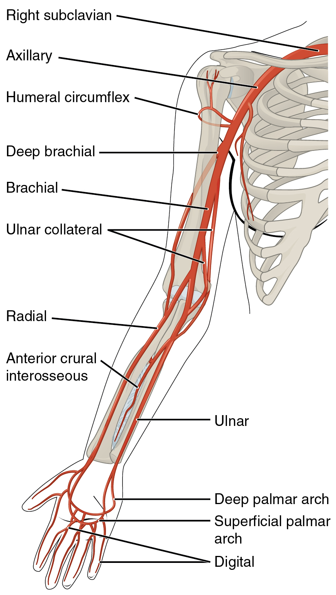{: #fig-ch21_05_10 data-title="Major Arteries Serving the Thorax and Upper Limb "}

{: #fig-ch21_05_11 data-title="Major Arteries of the Upper Limb "}

<table id="tbl-ch21_09" summary=""><colgroup><col width="100" /><col /></colgroup><thead>
<tr>
<th colspan="2">Arteries Serving the Upper Limbs</th>
</tr>
<tr>
<th>Vessel</th>
<th>Description</th>
</tr>
</thead><tbody>
<tr>
<td>Axillary artery</td>
<td>Continuation of the subclavian artery as it penetrates the body wall and enters the axillary region; supplies blood to the region near the head of the humerus (humeral circumflex arteries); the majority of the vessel continues into the brachium and becomes the brachial artery</td>
</tr>
<tr>
<td>Brachial artery</td>
<td>Continuation of the axillary artery in the brachium; supplies blood to much of the brachial region; gives off several smaller branches that provide blood to the posterior surface of the arm in the region of the elbow; bifurcates into the radial and ulnar arteries at the coronoid fossa</td>
</tr>
<tr>
<td>Radial artery</td>
<td>Formed at the bifurcation of the brachial artery; parallels the radius; gives off smaller branches until it reaches the carpal region where it fuses with the ulnar artery to form the superficial and deep palmar arches; supplies blood to the lower arm and carpal region</td>
</tr>
<tr>
<td>Ulnar artery</td>
<td>Formed at the bifurcation of the brachial artery; parallels the ulna; gives off smaller branches until it reaches the carpal region where it fuses with the radial artery to form the superficial and deep palmar arches; supplies blood to the lower arm and carpal region</td>
</tr>
<tr>
<td>Palmar arches (superficial and deep)</td>
<td>Formed from anastomosis of the radial and ulnar arteries; supply blood to the hand and digital arteries</td>
</tr>
<tr>
<td>Digital arteries</td>
<td>Formed from the superficial and deep palmar arches; supply blood to the digits</td>
</tr>
</tbody></table>

### Arteries Serving the Lower Limbs

The external iliac artery exits the body cavity and enters the femoral region of the lower leg ([\[link\]](#fig-ch21_05_12)). As it passes through the body wall, it is renamed the **femoral artery**{: data-type="term"}. It gives off several smaller branches as well as the lateral **deep femoral artery**{: data-type="term"} that in turn gives rise to a **lateral circumflex artery**{: data-type="term"}. These arteries supply blood to the deep muscles of the thigh as well as ventral and lateral regions of the integument. The femoral artery also gives rise to the **genicular artery**{: data-type="term"}, which provides blood to the region of the knee. As the femoral artery passes posterior to the knee near the popliteal fossa, it is called the popliteal artery. The **popliteal artery**{: data-type="term"} branches into the anterior and posterior tibial arteries.

The **anterior tibial artery**{: data-type="term"} is located between the tibia and fibula, and supplies blood to the muscles and integument of the anterior tibial region. Upon reaching the tarsal region, it becomes the **dorsalis pedis artery**{: data-type="term"}, which branches repeatedly and provides blood to the tarsal and dorsal regions of the foot. The **posterior tibial artery**{: data-type="term"} provides blood to the muscles and integument on the posterior surface of the tibial region. The fibular or peroneal artery branches from the posterior tibial artery. It bifurcates and becomes the **medial plantar artery**{: data-type="term"} and **lateral plantar artery**{: data-type="term"}, providing blood to the plantar surfaces. There is an anastomosis with the dorsalis pedis artery, and the medial and lateral plantar arteries form two arches called the **dorsal arch**{: data-type="term"} (also called the arcuate arch) and the **plantar arch**{: data-type="term"}, which provide blood to the remainder of the foot and toes. [\[link\]](#fig-ch21_05_13) shows the distribution of the major systemic arteries in the lower limb. [\[link\]](#tbl-ch21_10) summarizes the major systemic arteries discussed in the text.

 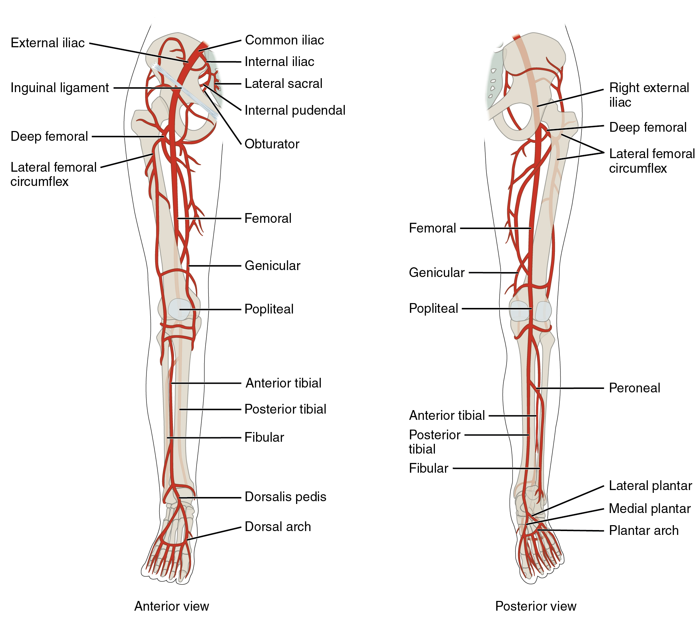{: #fig-ch21_05_12 data-title="Major Arteries Serving the Lower Limb "}

{: #fig-ch21_05_13 data-title="Systemic Arteries of the Lower Limb "}

<table id="tbl-ch21_10" summary=""><colgroup><col width="100" /><col /></colgroup><thead>
<tr>
<th colspan="2">Arteries Serving the Lower Limbs</th>
</tr>
<tr>
<th>Vessel</th>
<th>Description</th>
</tr>
</thead><tbody>
<tr>
<td>Femoral artery</td>
<td>Continuation of the external iliac artery after it passes through the body cavity; divides into several smaller branches, the lateral deep femoral artery, and the genicular artery; becomes the popliteal artery as it passes posterior to the knee</td>
</tr>
<tr>
<td>Deep femoral artery</td>
<td>Branch of the femoral artery; gives rise to the lateral circumflex arteries</td>
</tr>
<tr>
<td>Lateral circumflex artery</td>
<td>Branch of the deep femoral artery; supplies blood to the deep muscles of the thigh and the ventral and lateral regions of the integument</td>
</tr>
<tr>
<td>Genicular artery</td>
<td>Branch of the femoral artery; supplies blood to the region of the knee</td>
</tr>
<tr>
<td>Popliteal artery</td>
<td>Continuation of the femoral artery posterior to the knee; branches into the anterior and posterior tibial arteries</td>
</tr>
<tr>
<td>Anterior tibial artery</td>
<td>Branches from the popliteal artery; supplies blood to the anterior tibial region; becomes the dorsalis pedis artery</td>
</tr>
<tr>
<td>Dorsalis pedis artery</td>
<td>Forms from the anterior tibial artery; branches repeatedly to supply blood to the tarsal and dorsal regions of the foot</td>
</tr>
<tr>
<td>Posterior tibial artery</td>
<td>Branches from the popliteal artery and gives rise to the fibular or peroneal artery; supplies blood to the posterior tibial region</td>
</tr>
<tr>
<td>Medial plantar artery</td>
<td>Arises from the bifurcation of the posterior tibial arteries; supplies blood to the medial plantar surfaces of the foot</td>
</tr>
<tr>
<td>Lateral plantar artery</td>
<td>Arises from the bifurcation of the posterior tibial arteries; supplies blood to the lateral plantar surfaces of the foot</td>
</tr>
<tr>
<td>Dorsal or arcuate arch</td>
<td>Formed from the anastomosis of the dorsalis pedis artery and the medial and plantar arteries; branches supply the distal portions of the foot and digits</td>
</tr>
<tr>
<td>Plantar arch</td>
<td>Formed from the anastomosis of the dorsalis pedis artery and the medial and plantar arteries; branches supply the distal portions of the foot and digits</td>
</tr>
</tbody></table>

### Overview of Systemic Veins

Systemic veins return blood to the right atrium. Since the blood has already passed through the systemic capillaries, it will be relatively low in oxygen concentration. In many cases, there will be veins draining organs and regions of the body with the same name as the arteries that supplied these regions and the two often parallel one another. This is often described as a “complementary” pattern. However, there is a great deal more variability in the venous circulation than normally occurs in the arteries. For the sake of brevity and clarity, this text will discuss only the most commonly encountered patterns. However, keep this variation in mind when you move from the classroom to clinical practice.

In both the neck and limb regions, there are often both superficial and deeper levels of veins. The deeper veins generally correspond to the complementary arteries. The superficial veins do not normally have direct arterial counterparts, but in addition to returning blood, they also make contributions to the maintenance of body temperature. When the ambient temperature is warm, more blood is diverted to the superficial veins where heat can be more easily dissipated to the environment. In colder weather, there is more constriction of the superficial veins and blood is diverted deeper where the body can retain more of the heat.

The “Voyage of Discovery” analogy and stick drawings mentioned earlier remain valid techniques for the study of systemic veins, but veins present a more difficult challenge because there are numerous anastomoses and multiple branches. It is like following a river with many tributaries and channels, several of which interconnect. Tracing blood flow through arteries follows the current in the direction of blood flow, so that we move from the heart through the large arteries and into the smaller arteries to the capillaries. From the capillaries, we move into the smallest veins and follow the direction of blood flow into larger veins and back to the heart. [\[link\]](#fig-ch21_05_14) outlines the path of the major systemic veins.

Visit this [site][2] for a brief online summary of the veins.

 {: #fig-ch21_05_14 data-title="Major Systemic Veins of the Body "}

The right atrium receives all of the systemic venous return. Most of the blood flows into either the superior vena cava or inferior vena cava. If you draw an imaginary line at the level of the diaphragm, systemic venous circulation from above that line will generally flow into the superior vena cava; this includes blood from the head, neck, chest, shoulders, and upper limbs. The exception to this is that most venous blood flow from the coronary veins flows directly into the coronary sinus and from there directly into the right atrium. Beneath the diaphragm, systemic venous flow enters the inferior vena cava, that is, blood from the abdominal and pelvic regions and the lower limbs.

#### The Superior Vena Cava

The **superior vena cava**{: data-type="term"} drains most of the body superior to the diaphragm ([\[link\]](#fig-ch21_05_15)). On both the left and right sides, the **subclavian vein**{: data-type="term"} forms when the axillary vein passes through the body wall from the axillary region. It fuses with the external and internal jugular veins from the head and neck to form the **brachiocephalic vein**{: data-type="term"}. Each **vertebral vein**{: data-type="term"} also flows into the brachiocephalic vein close to this fusion. These veins arise from the base of the brain and the cervical region of the spinal cord, and flow largely through the intervertebral foramina in the cervical vertebrae. They are the counterparts of the vertebral arteries. Each **internal thoracic vein**{: data-type="term"}, also known as an internal mammary vein, drains the anterior surface of the chest wall and flows into the brachiocephalic vein.

The remainder of the blood supply from the thorax drains into the azygos vein. Each **intercostal vein**{: data-type="term"} drains muscles of the thoracic wall, each **esophageal vein**{: data-type="term"} delivers blood from the inferior portions of the esophagus, each **bronchial vein**{: data-type="term"} drains the systemic circulation from the lungs, and several smaller veins drain the mediastinal region. Bronchial veins carry approximately 13 percent of the blood that flows into the bronchial arteries; the remainder intermingles with the pulmonary circulation and returns to the heart via the pulmonary veins. These veins flow into the **azygos vein**{: data-type="term"}, and with the smaller **hemiazygos vein**{: data-type="term"} (hemi- = “half”) on the left of the vertebral column, drain blood from the thoracic region. The hemiazygos vein does not drain directly into the superior vena cava but enters the brachiocephalic vein via the superior intercostal vein.

The azygos vein passes through the diaphragm from the thoracic cavity on the right side of the vertebral column and begins in the lumbar region of the thoracic cavity. It flows into the superior vena cava at approximately the level of T2, making a significant contribution to the flow of blood. It combines with the two large left and right brachiocephalic veins to form the superior vena cava.

[\[link\]](#tbl-ch21_11) summarizes the veins of the thoracic region that flow into the superior vena cava.

 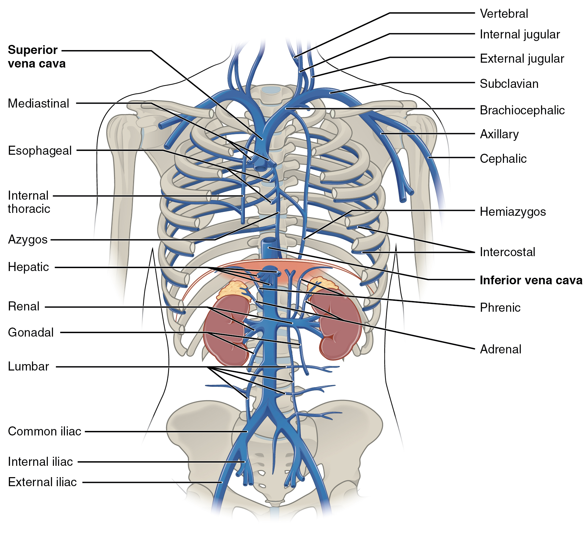{: #fig-ch21_05_15 data-title="Veins of the Thoracic and Abdominal Regions "}

<table id="tbl-ch21_11" summary=""><colgroup><col width="100" /><col /></colgroup><thead>
<tr>
<th colspan="2">Veins of the Thoracic Region</th>
</tr>
<tr>
<th>Vessel</th>
<th>Description</th>
</tr>
</thead><tbody>
<tr>
<td>Superior vena cava</td>
<td>Large systemic vein; drains blood from most areas superior to the diaphragm; empties into the right atrium</td>
</tr>
<tr>
<td>Subclavian vein</td>
<td>Located deep in the thoracic cavity; formed by the axillary vein as it enters the thoracic cavity from the axillary region; drains the axillary and smaller local veins near the scapular region and leads to the brachiocephalic vein</td>
</tr>
<tr>
<td>Brachiocephalic veins</td>
<td>Pair of veins that form from a fusion of the external and internal jugular veins and the subclavian vein; subclavian, external and internal jugulars, vertebral, and internal thoracic veins flow into it; drain the upper thoracic region and lead to the superior vena cava</td>
</tr>
<tr>
<td>Vertebral vein</td>
<td>Arises from the base of the brain and the cervical region of the spinal cord; passes through the intervertebral foramina in the cervical vertebrae; drains smaller veins from the cranium, spinal cord, and vertebrae, and leads to the brachiocephalic vein; counterpart of the vertebral artery</td>
</tr>
<tr>
<td>Internal thoracic veins</td>
<td>Also called internal mammary veins; drain the anterior surface of the chest wall and lead to the brachiocephalic vein</td>
</tr>
<tr>
<td>Intercostal vein</td>
<td>Drains the muscles of the thoracic wall and leads to the azygos vein</td>
</tr>
<tr>
<td>Esophageal vein</td>
<td>Drains the inferior portions of the esophagus and leads to the azygos vein</td>
</tr>
<tr>
<td>Bronchial vein</td>
<td>Drains the systemic circulation from the lungs and leads to the azygos vein</td>
</tr>
<tr>
<td>Azygos vein</td>
<td>Originates in the lumbar region and passes through the diaphragm into the thoracic cavity on the right side of the vertebral column; drains blood from the intercostal veins, esophageal veins, bronchial veins, and other veins draining the mediastinal region, and leads to the superior vena cava</td>
</tr>
<tr>
<td>Hemiazygos vein</td>
<td>Smaller vein complementary to the azygos vein; drains the esophageal veins from the esophagus and the left intercostal veins, and leads to the brachiocephalic vein via the superior intercostal vein</td>
</tr>
</tbody></table>

#### Veins of the Head and Neck

Blood from the brain and the superficial facial vein flow into each **internal jugular vein**{: data-type="term"} ([\[link\]](#fig-ch21_05_16)). Blood from the more superficial portions of the head, scalp, and cranial regions, including the **temporal vein**{: data-type="term"} and **maxillary vein**{: data-type="term"}, flow into each **external jugular vein**{: data-type="term"}. Although the external and internal jugular veins are separate vessels, there are anastomoses between them close to the thoracic region. Blood from the external jugular vein empties into the subclavian vein. [\[link\]](#tbl-ch21_12) summarizes the major veins of the head and neck.

<table id="tbl-ch21_12" summary=""><colgroup><col width="100" /><col /></colgroup><thead>
<tr>
<th colspan="2">Major Veins of the Head and Neck</th>
</tr>
<tr>
<th>Vessel</th>
<th>Description</th>
</tr>
</thead><tbody>
<tr>
<td>Internal jugular vein</td>
<td>Parallel to the common carotid artery, which is more or less its counterpart, and passes through the jugular foramen and canal; primarily drains blood from the brain, receives the superficial facial vein, and empties into the subclavian vein</td>
</tr>
<tr>
<td>Temporal vein</td>
<td>Drains blood from the temporal region and flows into the external jugular vein</td>
</tr>
<tr>
<td>Maxillary vein</td>
<td>Drains blood from the maxillary region and flows into the external jugular vein</td>
</tr>
<tr>
<td>External jugular vein</td>
<td>Drains blood from the more superficial portions of the head, scalp, and cranial regions, and leads to the subclavian vein</td>
</tr>
</tbody></table>

#### Venous Drainage of the Brain

Circulation to the brain is both critical and complex (see [\[link\]](#fig-ch21_05_16)). Many smaller veins of the brain stem and the superficial veins of the cerebrum lead to larger vessels referred to as intracranial sinuses. These include the superior and inferior sagittal sinuses, straight sinus, cavernous sinuses, left and right sinuses, the petrosal sinuses, and the occipital sinuses. Ultimately, sinuses will lead back to either the inferior jugular vein or vertebral vein.

Most of the veins on the superior surface of the cerebrum flow into the largest of the sinuses, the **superior sagittal sinus**{: data-type="term"}. It is located midsagittally between the meningeal and periosteal layers of the dura mater within the falx cerebri and, at first glance in images or models, can be mistaken for the subarachnoid space. Most reabsorption of cerebrospinal fluid occurs via the chorionic villi (arachnoid granulations) into the superior sagittal sinus. Blood from most of the smaller vessels originating from the inferior cerebral veins flows into the **great cerebral vein**{: data-type="term"} and into the **straight sinus**{: data-type="term"}. Other cerebral veins and those from the eye socket flow into the **cavernous sinus**{: data-type="term"}, which flows into the **petrosal sinus**{: data-type="term"} and then into the internal jugular vein. The **occipital sinus**{: data-type="term"}, sagittal sinus, and straight sinuses all flow into the left and right transverse sinuses near the lambdoid suture. The **transverse sinuses**{: data-type="term"} in turn flow into the **sigmoid sinuses**{: data-type="term"} that pass through the jugular foramen and into the internal jugular vein. The internal jugular vein flows parallel to the common carotid artery and is more or less its counterpart. It empties into the brachiocephalic vein. The veins draining the cervical vertebrae and the posterior surface of the skull, including some blood from the occipital sinus, flow into the vertebral veins. These parallel the vertebral arteries and travel through the transverse foramina of the cervical vertebrae. The vertebral veins also flow into the brachiocephalic veins. [\[link\]](#tbl-ch21_13) summarizes the major veins of the brain.

 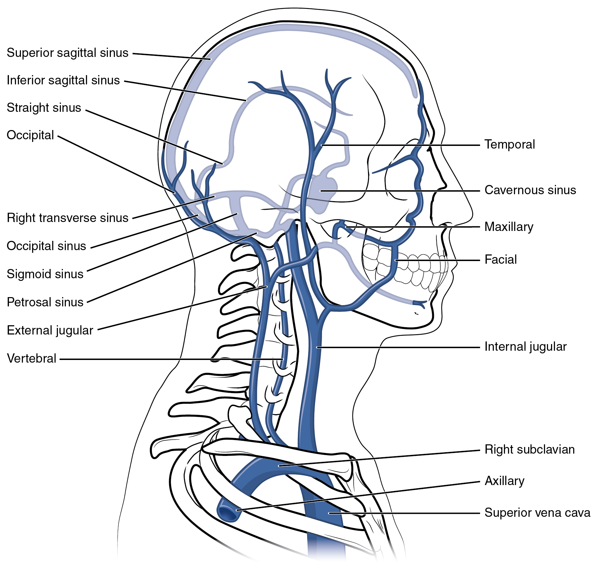{: #fig-ch21_05_16 data-title="Veins of the Head and Neck "}

<table id="tbl-ch21_13" summary=""><colgroup><col width="100" /><col /></colgroup><thead>
<tr>
<th colspan="2">Major Veins of the Brain</th>
</tr>
<tr>
<th>Vessel</th>
<th>Description</th>
</tr>
</thead><tbody>
<tr>
<td>Superior sagittal sinus</td>
<td>Enlarged vein located midsagittally between the meningeal and periosteal layers of the dura mater within the falx cerebri; receives most of the blood drained from the superior surface of the cerebrum and leads to the inferior jugular vein and the vertebral vein</td>
</tr>
<tr>
<td>Great cerebral vein</td>
<td>Receives most of the smaller vessels from the inferior cerebral veins and leads to the straight sinus</td>
</tr>
<tr>
<td>Straight sinus</td>
<td>Enlarged vein that drains blood from the brain; receives most of the blood from the great cerebral vein and leads to the left or right transverse sinus</td>
</tr>
<tr>
<td>Cavernous sinus</td>
<td>Enlarged vein that receives blood from most of the other cerebral veins and the eye socket, and leads to the petrosal sinus</td>
</tr>
<tr>
<td>Petrosal sinus</td>
<td>Enlarged vein that receives blood from the cavernous sinus and leads into the internal jugular veins</td>
</tr>
<tr>
<td>Occipital sinus</td>
<td>Enlarged vein that drains the occipital region near the falx cerebelli and leads to the left and right transverse sinuses, and also the vertebral veins</td>
</tr>
<tr>
<td>Transverse sinuses</td>
<td>Pair of enlarged veins near the lambdoid suture that drains the occipital, sagittal, and straight sinuses, and leads to the sigmoid sinuses</td>
</tr>
<tr>
<td>Sigmoid sinuses</td>
<td>Enlarged vein that receives blood from the transverse sinuses and leads through the jugular foramen to the internal jugular vein</td>
</tr>
</tbody></table>

#### Veins Draining the Upper Limbs

The **digital veins**{: data-type="term"} in the fingers come together in the hand to form the **palmar venous arches**{: data-type="term"} ([\[link\]](#fig-ch21_05_17)). From here, the veins come together to form the radial vein, the ulnar vein, and the median antebrachial vein. The **radial vein**{: data-type="term"} and the **ulnar vein**{: data-type="term"} parallel the bones of the forearm and join together at the antebrachium to form the **brachial vein**{: data-type="term"}, a deep vein that flows into the axillary vein in the brachium.

The **median antebrachial vein**{: data-type="term"} parallels the ulnar vein, is more medial in location, and joins the **basilic vein**{: data-type="term"} in the forearm. As the basilic vein reaches the antecubital region, it gives off a branch called the **median cubital vein**{: data-type="term"} that crosses at an angle to join the cephalic vein. The median cubital vein is the most common site for drawing venous blood in humans. The basilic vein continues through the arm medially and superficially to the axillary vein.

The **cephalic vein**{: data-type="term"} begins in the antebrachium and drains blood from the superficial surface of the arm into the axillary vein. It is extremely superficial and easily seen along the surface of the biceps brachii muscle in individuals with good muscle tone and in those without excessive subcutaneous adipose tissue in the arms.

The **subscapular vein**{: data-type="term"} drains blood from the subscapular region and joins the cephalic vein to form the **axillary vein**{: data-type="term"}. As it passes through the body wall and enters the thorax, the axillary vein becomes the subclavian vein.

Many of the larger veins of the thoracic and abdominal region and upper limb are further represented in the flow chart in [\[link\]](#fig-ch21_05_18). [\[link\]](#tbl-ch21_14) summarizes the veins of the upper limbs.

 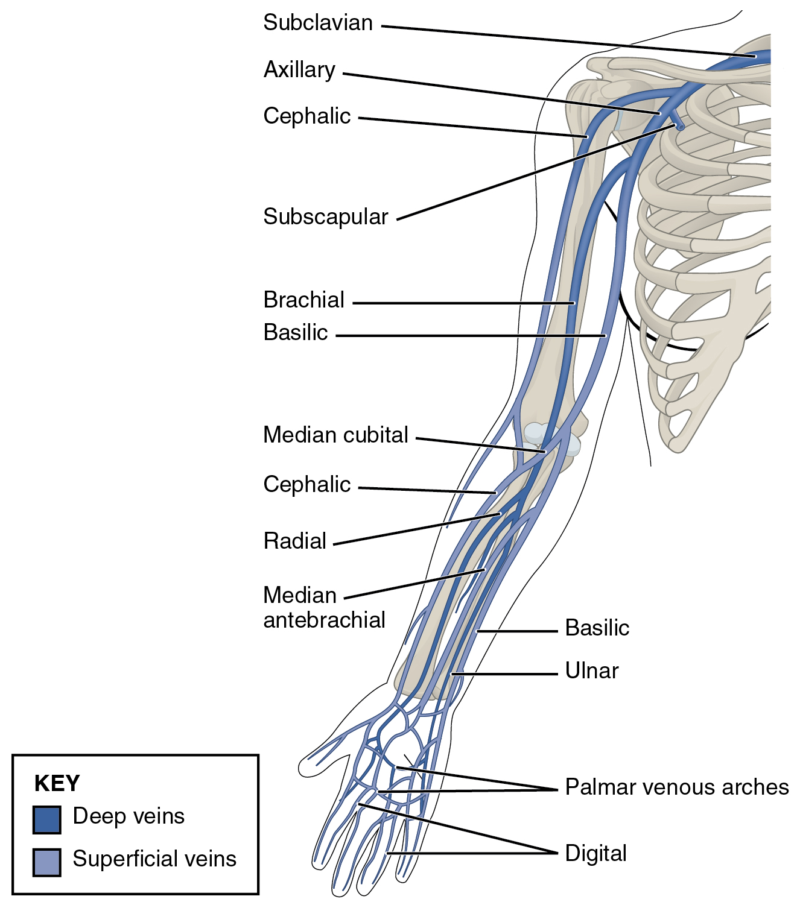{: #fig-ch21_05_17 data-title="Veins of the Upper Limb "}

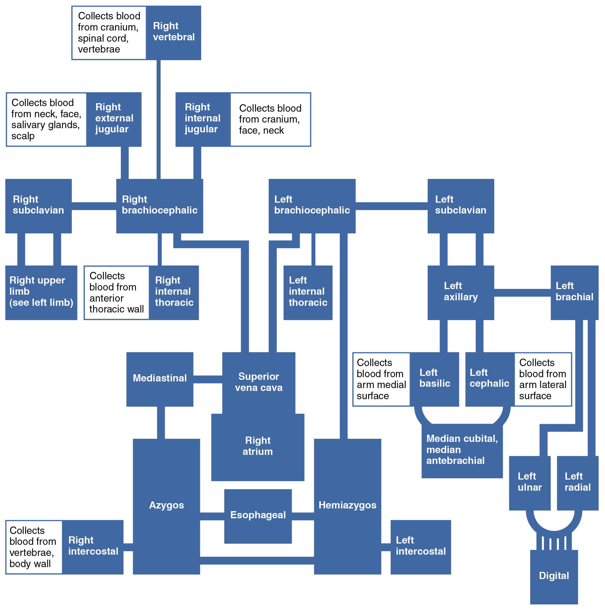{: #fig-ch21_05_18 data-title="Veins Flowing into the Superior Vena Cava "}

<table id="tbl-ch21_14" summary=""><colgroup><col width="100" /><col /></colgroup><thead>
<tr>
<th colspan="2">Veins of the Upper Limbs</th>
</tr>
<tr>
<th>Vessel</th>
<th>Description</th>
</tr>
</thead><tbody>
<tr>
<td>Digital veins</td>
<td>Drain the digits and lead to the palmar arches of the hand and dorsal venous arch of the foot</td>
</tr>
<tr>
<td>Palmar venous arches</td>
<td>Drain the hand and digits, and lead to the radial vein, ulnar veins, and the median antebrachial vein</td>
</tr>
<tr>
<td>Radial vein</td>
<td>Vein that parallels the radius and radial artery; arises from the palmar venous arches and leads to the brachial vein</td>
</tr>
<tr>
<td>Ulnar vein</td>
<td>Vein that parallels the ulna and ulnar artery; arises from the palmar venous arches and leads to the brachial vein</td>
</tr>
<tr>
<td>Brachial vein</td>
<td>Deeper vein of the arm that forms from the radial and ulnar veins in the lower arm; leads to the axillary vein</td>
</tr>
<tr>
<td>Median antebrachial vein</td>
<td>Vein that parallels the ulnar vein but is more medial in location; intertwines with the palmar venous arches; leads to the basilic vein</td>
</tr>
<tr>
<td>Basilic vein</td>
<td>Superficial vein of the arm that arises from the median antebrachial vein, intersects with the median cubital vein, parallels the ulnar vein, and continues into the upper arm; along with the brachial vein, it leads to the axillary vein</td>
</tr>
<tr>
<td>Median cubital vein</td>
<td>Superficial vessel located in the antecubital region that links the cephalic vein to the basilic vein in the form of a v; a frequent site from which to draw blood</td>
</tr>
<tr>
<td>Cephalic vein</td>
<td>Superficial vessel in the upper arm; leads to the axillary vein</td>
</tr>
<tr>
<td>Subscapular vein</td>
<td>Drains blood from the subscapular region and leads to the axillary vein</td>
</tr>
<tr>
<td>Axillary vein</td>
<td>The major vein in the axillary region; drains the upper limb and becomes the subclavian vein</td>
</tr>
</tbody></table>

#### The Inferior Vena Cava

Other than the small amount of blood drained by the azygos and hemiazygos veins, most of the blood inferior to the diaphragm drains into the inferior vena cava before it is returned to the heart (see [\[link\]](#fig-ch21_05_15)). Lying just beneath the parietal peritoneum in the abdominal cavity, the **inferior vena cava**{: data-type="term"} parallels the abdominal aorta, where it can receive blood from abdominal veins. The lumbar portions of the abdominal wall and spinal cord are drained by a series of **lumbar veins**{: data-type="term"}, usually four on each side. The ascending lumbar veins drain into either the azygos vein on the right or the hemiazygos vein on the left, and return to the superior vena cava. The remaining lumbar veins drain directly into the inferior vena cava.

Blood supply from the kidneys flows into each **renal vein**{: data-type="term"}, normally the largest veins entering the inferior vena cava. A number of other, smaller veins empty into the left renal vein. Each **adrenal vein**{: data-type="term"} drains the adrenal or suprarenal glands located immediately superior to the kidneys. The right adrenal vein enters the inferior vena cava directly, whereas the left adrenal vein enters the left renal vein.

From the male reproductive organs, each **testicular vein**{: data-type="term"} flows from the scrotum, forming a portion of the spermatic cord. Each **ovarian vein**{: data-type="term"} drains an ovary in females. Each of these veins is generically called a **gonadal vein**{: data-type="term"}. The right gonadal vein empties directly into the inferior vena cava, and the left gonadal vein empties into the left renal vein.

Each side of the diaphragm drains into a **phrenic vein**{: data-type="term"}; the right phrenic vein empties directly into the inferior vena cava, whereas the left phrenic vein empties into the left renal vein. Blood supply from the liver drains into each **hepatic vein**{: data-type="term"} and directly into the inferior vena cava. Since the inferior vena cava lies primarily to the right of the vertebral column and aorta, the left renal vein is longer, as are the left phrenic, adrenal, and gonadal veins. The longer length of the left renal vein makes the left kidney the primary target of surgeons removing this organ for donation. [\[link\]](#fig-ch21_05_19) provides a flow chart of the veins flowing into the inferior vena cava. [\[link\]](#tbl-ch21_15) summarizes the major veins of the abdominal region.

 {: #fig-ch21_05_19 data-title="Venous Flow into Inferior Vena Cava "}

<table id="tbl-ch21_15" summary=""><colgroup><col width="100" /><col /></colgroup><thead>
<tr>
<th colspan="2">Major Veins of the Abdominal Region</th>
</tr>
<tr>
<th>Vessel</th>
<th>Description</th>
</tr>
</thead><tbody>
<tr>
<td>Inferior vena cava</td>
<td>Large systemic vein that drains blood from areas largely inferior to the diaphragm; empties into the right atrium</td>
</tr>
<tr>
<td>Lumbar veins</td>
<td>Series of veins that drain the lumbar portion of the abdominal wall and spinal cord; the ascending lumbar veins drain into the azygos vein on the right or the hemiazygos vein on the left; the remaining lumbar veins drain directly into the inferior vena cava</td>
</tr>
<tr>
<td>Renal vein</td>
<td>Largest vein entering the inferior vena cava; drains the kidneys and flows into the inferior vena cava</td>
</tr>
<tr>
<td>Adrenal vein</td>
<td>Drains the adrenal or suprarenal; the right adrenal vein enters the inferior vena cava directly and the left adrenal vein enters the left renal vein</td>
</tr>
<tr>
<td>Testicular vein</td>
<td>Drains the testes and forms part of the spermatic cord; the right testicular vein empties directly into the inferior vena cava and the left testicular vein empties into the left renal vein</td>
</tr>
<tr>
<td>Ovarian vein</td>
<td>Drains the ovary; the right ovarian vein empties directly into the inferior vena cava and the left ovarian vein empties into the left renal vein</td>
</tr>
<tr>
<td>Gonadal vein</td>
<td>Generic term for a vein draining a reproductive organ; may be either an ovarian vein or a testicular vein, depending on the sex of the individual</td>
</tr>
<tr>
<td>Phrenic vein</td>
<td>Drains the diaphragm; the right phrenic vein flows into the inferior vena cava and the left phrenic vein empties into the left renal vein</td>
</tr>
<tr>
<td>Hepatic vein</td>
<td>Drains systemic blood from the liver and flows into the inferior vena cava</td>
</tr>
</tbody></table>

#### Veins Draining the Lower Limbs

The superior surface of the foot drains into the digital veins, and the inferior surface drains into the **plantar veins**{: data-type="term"}, which flow into a complex series of anastomoses in the feet and ankles, including the **dorsal venous arch**{: data-type="term"} and the **plantar venous arch**{: data-type="term"} ([\[link\]](#fig-ch21_05_20)). From the dorsal venous arch, blood supply drains into the anterior and posterior tibial veins. The **anterior tibial vein**{: data-type="term"} drains the area near the tibialis anterior muscle and combines with the posterior tibial vein and the fibular vein to form the popliteal vein. The **posterior tibial vein**{: data-type="term"} drains the posterior surface of the tibia and joins the popliteal vein. The **fibular vein**{: data-type="term"} drains the muscles and integument in proximity to the fibula and also joins the popliteal vein. The **small saphenous vein**{: data-type="term"} located on the lateral surface of the leg drains blood from the superficial regions of the lower leg and foot, and flows into to the **popliteal vein**{: data-type="term"}. As the popliteal vein passes behind the knee in the popliteal region, it becomes the femoral vein. It is palpable in patients without excessive adipose tissue.

Close to the body wall, the great saphenous vein, the deep femoral vein, and the femoral circumflex vein drain into the femoral vein. The **great saphenous vein**{: data-type="term"} is a prominent surface vessel located on the medial surface of the leg and thigh that collects blood from the superficial portions of these areas. The **deep femoral vein**{: data-type="term"}, as the name suggests, drains blood from the deeper portions of the thigh. The **femoral circumflex vein**{: data-type="term"} forms a loop around the femur just inferior to the trochanters and drains blood from the areas in proximity to the head and neck of the femur.

As the **femoral vein**{: data-type="term"} penetrates the body wall from the femoral portion of the upper limb, it becomes the **external iliac vein**{: data-type="term"}, a large vein that drains blood from the leg to the common iliac vein. The pelvic organs and integument drain into the **internal iliac vein**{: data-type="term"}, which forms from several smaller veins in the region, including the umbilical veins that run on either side of the bladder. The external and internal iliac veins combine near the inferior portion of the sacroiliac joint to form the common iliac vein. In addition to blood supply from the external and internal iliac veins, the **middle sacral vein**{: data-type="term"} drains the sacral region into the **common iliac vein**{: data-type="term"}. Similar to the common iliac arteries, the common iliac veins come together at the level of L5 to form the inferior vena cava.

[\[link\]](#fig-ch21_05_21) is a flow chart of veins flowing into the lower limb. [\[link\]](#tbl-ch21_16) summarizes the major veins of the lower limbs.

 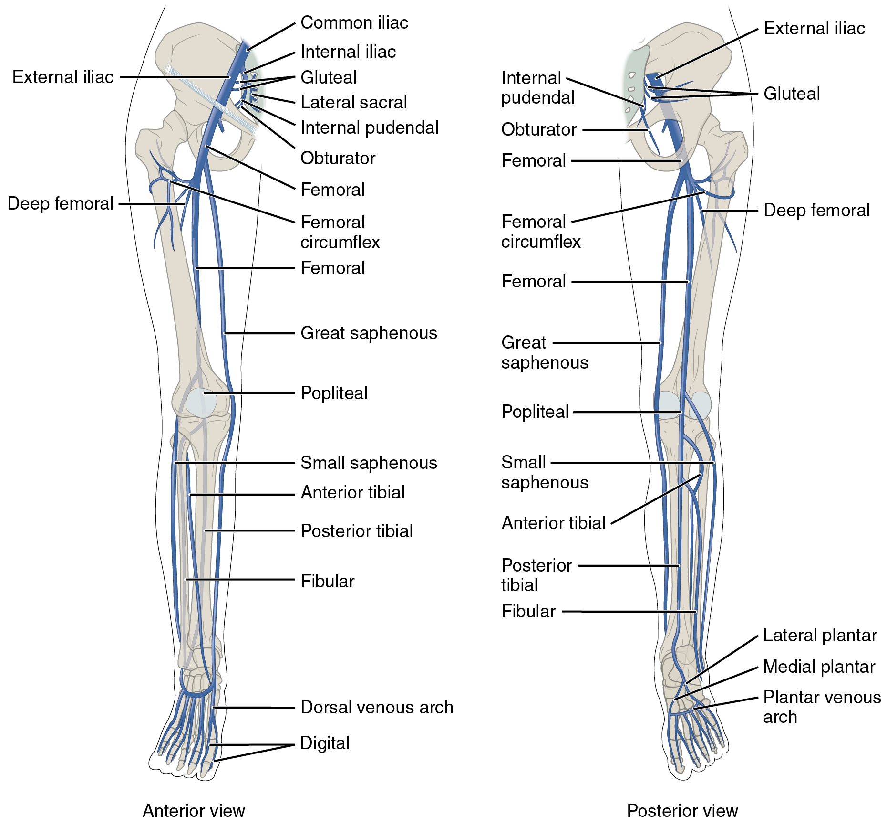{: #fig-ch21_05_20 data-title="Major Veins Serving the Lower Limbs "}

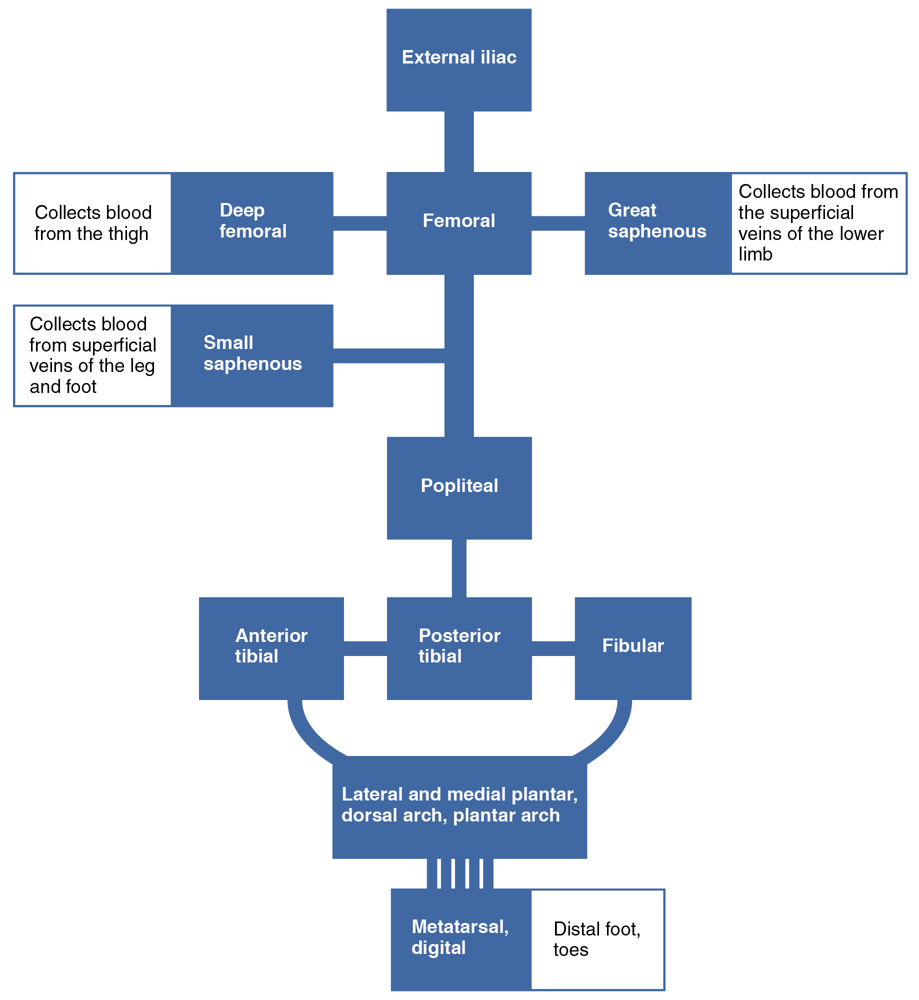{: #fig-ch21_05_21 data-title="Major Veins of the Lower Limb "}

<table id="tbl-ch21_16" summary=""><colgroup><col width="100" /><col /></colgroup><thead>
<tr>
<th colspan="2">Veins of the Lower Limbs</th>
</tr>
<tr>
<th>Vessel</th>
<th>Description</th>
</tr>
</thead><tbody>
<tr>
<td>Plantar veins</td>
<td>Drain the foot and flow into the plantar venous arch</td>
</tr>
<tr>
<td>Dorsal venous arch</td>
<td>Drains blood from digital veins and vessels on the superior surface of the foot</td>
</tr>
<tr>
<td>Plantar venous arch</td>
<td>Formed from the plantar veins; flows into the anterior and posterior tibial veins through anastomoses</td>
</tr>
<tr>
<td>Anterior tibial vein</td>
<td>Formed from the dorsal venous arch; drains the area near the tibialis anterior muscle and flows into the popliteal vein</td>
</tr>
<tr>
<td>Posterior tibial vein</td>
<td>Formed from the dorsal venous arch; drains the area near the posterior surface of the tibia and flows into the popliteal vein</td>
</tr>
<tr>
<td>Fibular vein</td>
<td>Drains the muscles and integument near the fibula and flows into the popliteal vein</td>
</tr>
<tr>
<td>Small saphenous vein</td>
<td>Located on the lateral surface of the leg; drains blood from the superficial regions of the lower leg and foot, and flows into the popliteal vein</td>
</tr>
<tr>
<td>Popliteal vein</td>
<td>Drains the region behind the knee and forms from the fusion of the fibular, anterior, and posterior tibial veins; flows into the femoral vein</td>
</tr>
<tr>
<td>Great saphenous vein</td>
<td>Prominent surface vessel located on the medial surface of the leg and thigh; drains the superficial portions of these areas and flows into the femoral vein</td>
</tr>
<tr>
<td>Deep femoral vein</td>
<td>Drains blood from the deeper portions of the thigh and flows into the femoral vein</td>
</tr>
<tr>
<td>Femoral circumflex vein</td>
<td>Forms a loop around the femur just inferior to the trochanters; drains blood from the areas around the head and neck of the femur; flows into the femoral vein</td>
</tr>
<tr>
<td>Femoral vein</td>
<td>Drains the upper leg; receives blood from the great saphenous vein, the deep femoral vein, and the femoral circumflex vein; becomes the external iliac vein when it crosses the body wall</td>
</tr>
<tr>
<td>External iliac vein</td>
<td>Formed when the femoral vein passes into the body cavity; drains the legs and flows into the common iliac vein</td>
</tr>
<tr>
<td>Internal iliac vein</td>
<td>Drains the pelvic organs and integument; formed from several smaller veins in the region; flows into the common iliac vein</td>
</tr>
<tr>
<td>Middle sacral vein</td>
<td>Drains the sacral region and flows into the left common iliac vein</td>
</tr>
<tr>
<td>Common iliac vein</td>
<td>Flows into the inferior vena cava at the level of L5; the left common iliac vein drains the sacral region; formed from the union of the external and internal iliac veins near the inferior portion of the sacroiliac joint</td>
</tr>
</tbody></table>

### Hepatic Portal System

The liver is a complex biochemical processing plant. It packages nutrients absorbed by the digestive system; produces plasma proteins, clotting factors, and bile; and disposes of worn-out cell components and waste products. Instead of entering the circulation directly, absorbed nutrients and certain wastes (for example, materials produced by the spleen) travel to the liver for processing. They do so via the **hepatic portal system**{: data-type="term"} ([\[link\]](#fig-ch21_05_22)). Portal systems begin and end in capillaries. In this case, the initial capillaries from the stomach, small intestine, large intestine, and spleen lead to the hepatic portal vein and end in specialized capillaries within the liver, the hepatic sinusoids. You saw the only other portal system with the hypothalamic-hypophyseal portal vessel in the endocrine chapter.

The hepatic portal system consists of the hepatic portal vein and the veins that drain into it. The hepatic portal vein itself is relatively short, beginning at the level of L2 with the confluence of the superior mesenteric and splenic veins. It also receives branches from the inferior mesenteric vein, plus the splenic veins and all their tributaries. The superior mesenteric vein receives blood from the small intestine, two-thirds of the large intestine, and the stomach. The inferior mesenteric vein drains the distal third of the large intestine, including the descending colon, the sigmoid colon, and the rectum. The splenic vein is formed from branches from the spleen, pancreas, and portions of the stomach, and the inferior mesenteric vein. After its formation, the hepatic portal vein also receives branches from the gastric veins of the stomach and cystic veins from the gall bladder. The hepatic portal vein delivers materials from these digestive and circulatory organs directly to the liver for processing.

Because of the hepatic portal system, the liver receives its blood supply from two different sources: from normal systemic circulation via the hepatic artery and from the hepatic portal vein. The liver processes the blood from the portal system to remove certain wastes and excess nutrients, which are stored for later use. This processed blood, as well as the systemic blood that came from the hepatic artery, exits the liver via the right, left, and middle hepatic veins, and flows into the inferior vena cava. Overall systemic blood composition remains relatively stable, since the liver is able to metabolize the absorbed digestive components.

 "){: #fig-ch21_05_22 data-title="Hepatic Portal System "}

### Chapter Review

The right ventricle pumps oxygen-depleted blood into the pulmonary trunk and right and left pulmonary arteries, which carry it to the right and left lungs for gas exchange. Oxygen-rich blood is transported by pulmonary veins to the left atrium. The left ventricle pumps this blood into the aorta. The main regions of the aorta are the ascending aorta, aortic arch, and descending aorta, which is further divided into the thoracic and abdominal aorta. The coronary arteries branch from the ascending aorta. After oxygenating tissues in the capillaries, systemic blood is returned to the right atrium from the venous system via the superior vena cava, which drains most of the veins superior to the diaphragm, the inferior vena cava, which drains most of the veins inferior to the diaphragm, and the coronary veins via the coronary sinus. The hepatic portal system carries blood to the liver for processing before it enters circulation. Review the figures provided in this section for circulation of blood through the blood vessels.

### Review Questions

The coronary arteries branch off of the \_\_\_\_\_\_\_\_.

1.  aortic valve
2.  ascending aorta
3.  aortic arch
4.  thoracic aorta
{: data-number-style="lower-alpha"}

B

Which of the following statements is true?

1.  The left and right common carotid arteries both branch off of the brachiocephalic trunk.
2.  The brachial artery is the distal branch of the axillary artery.
3.  The radial and ulnar arteries join to form the palmar arch.
4.  All of the above are true.
{: data-number-style="lower-alpha"}

C

Arteries serving the stomach, pancreas, and liver all branch from the \_\_\_\_\_\_\_\_.

1.  superior mesenteric artery
2.  inferior mesenteric artery
3.  celiac trunk
4.  splenic artery
{: data-number-style="lower-alpha"}

C

The right and left brachiocephalic veins \_\_\_\_\_\_\_\_.

1.  drain blood from the right and left internal jugular veins
2.  drain blood from the right and left subclavian veins
3.  drain into the superior vena cava
4.  all of the above are true
{: data-number-style="lower-alpha"}

D

The hepatic portal system delivers blood from the digestive organs to the \_\_\_\_\_\_\_\_.

1.  liver
2.  hypothalamus
3.  spleen
4.  left atrium
{: data-number-style="lower-alpha"}

A

### Critical Thinking Questions

Identify the ventricle of the heart that pumps oxygen-depleted blood and the arteries of the body that carry oxygen-depleted blood.

The right ventricle of the heart pumps oxygen-depleted blood to the pulmonary arteries.

What organs do the gonadal veins drain?

The gonadal veins drain the testes in males and the ovaries in females.

What arteries play the leading roles in supplying blood to the brain?

The internal carotid arteries and the vertebral arteries provide most of the brain’s blood supply.

### Glossary
{: data-type="glossary-title"}

abdominal aorta
: portion of the aorta inferior to the aortic hiatus and superior to the common iliac arteries
^

adrenal artery
: branch of the abdominal aorta; supplies blood to the adrenal (suprarenal) glands
^

adrenal vein
: drains the adrenal or suprarenal glands that are immediately superior to the kidneys; the right adrenal vein enters the inferior vena cava directly and the left adrenal vein enters the left renal vein
^

anterior cerebral artery
: arises from the internal carotid artery; supplies the frontal lobe of the cerebrum
^

anterior communicating artery
: anastomosis of the right and left internal carotid arteries; supplies blood to the brain
^

anterior tibial artery
: branches from the popliteal artery; supplies blood to the anterior tibial region; becomes the dorsalis pedis artery
^

anterior tibial vein
: forms from the dorsal venous arch; drains the area near the tibialis anterior muscle and leads to the popliteal vein
^

aorta
: largest artery in the body, originating from the left ventricle and descending to the abdominal region where it bifurcates into the common iliac arteries at the level of the fourth lumbar vertebra; arteries originating from the aorta distribute blood to virtually all tissues of the body
^

aortic arch
: arc that connects the ascending aorta to the descending aorta; ends at the intervertebral disk between the fourth and fifth thoracic vertebrae
^

aortic hiatus
: opening in the diaphragm that allows passage of the thoracic aorta into the abdominal region where it becomes the abdominal aorta
^

arterial circle
: (also, circle of Willis) anastomosis located at the base of the brain that ensures continual blood supply; formed from branches of the internal carotid and vertebral arteries; supplies blood to the brain
^

ascending aorta
: initial portion of the aorta, rising from the left ventricle for a distance of approximately 5 cm
^

axillary artery
: continuation of the subclavian artery as it penetrates the body wall and enters the axillary region; supplies blood to the region near the head of the humerus (humeral circumflex arteries); the majority of the vessel continues into the brachium and becomes the brachial artery
^

axillary vein
: major vein in the axillary region; drains the upper limb and becomes the subclavian vein
^

azygos vein
: originates in the lumbar region and passes through the diaphragm into the thoracic cavity on the right side of the vertebral column; drains blood from the intercostal veins, esophageal veins, bronchial veins, and other veins draining the mediastinal region; leads to the superior vena cava
^

basilar artery
: formed from the fusion of the two vertebral arteries; sends branches to the cerebellum, brain stem, and the posterior cerebral arteries; the main blood supply to the brain stem
^

basilic vein
: superficial vein of the arm that arises from the palmar venous arches, intersects with the median cubital vein, parallels the ulnar vein, and continues into the upper arm; along with the brachial vein, it leads to the axillary vein
^

brachial artery
: continuation of the axillary artery in the brachium; supplies blood to much of the brachial region; gives off several smaller branches that provide blood to the posterior surface of the arm in the region of the elbow; bifurcates into the radial and ulnar arteries at the coronoid fossa
^

brachial vein
: deeper vein of the arm that forms from the radial and ulnar veins in the lower arm; leads to the axillary vein
^

brachiocephalic artery
: single vessel located on the right side of the body; the first vessel branching from the aortic arch; gives rise to the right subclavian artery and the right common carotid artery; supplies blood to the head, neck, upper limb, and wall of the thoracic region
^

brachiocephalic vein
: one of a pair of veins that form from a fusion of the external and internal jugular veins and the subclavian vein; subclavian, external and internal jugulars, vertebral, and internal thoracic veins lead to it; drains the upper thoracic region and flows into the superior vena cava
^

bronchial artery
: systemic branch from the aorta that provides oxygenated blood to the lungs in addition to the pulmonary circuit
^

bronchial vein
: drains the systemic circulation from the lungs and leads to the azygos vein
^

cavernous sinus
: enlarged vein that receives blood from most of the other cerebral veins and the eye socket, and leads to the petrosal sinus
^

celiac trunk
: (also, celiac artery) major branch of the abdominal aorta; gives rise to the left gastric artery, the splenic artery, and the common hepatic artery that forms the hepatic artery to the liver, the right gastric artery to the stomach, and the cystic artery to the gall bladder
^

cephalic vein
: superficial vessel in the upper arm; leads to the axillary vein
^

cerebrovascular accident (CVA)
: blockage of blood flow to the brain; also called a stroke
^

circle of Willis
: (also, arterial circle) anastomosis located at the base of the brain that ensures continual blood supply; formed from branches of the internal carotid and vertebral arteries; supplies blood to the brain
^

common carotid artery
: right common carotid artery arises from the brachiocephalic artery, and the left common carotid arises from the aortic arch; gives rise to the external and internal carotid arteries; supplies the respective sides of the head and neck
^

common hepatic artery
: branch of the celiac trunk that forms the hepatic artery, the right gastric artery, and the cystic artery
^

common iliac artery
: branch of the aorta that leads to the internal and external iliac arteries
^

common iliac vein
: one of a pair of veins that flows into the inferior vena cava at the level of L5; the left common iliac vein drains the sacral region; divides into external and internal iliac veins near the inferior portion of the sacroiliac joint
^

cystic artery
: branch of the common hepatic artery; supplies blood to the gall bladder
^

deep femoral artery
: branch of the femoral artery; gives rise to the lateral circumflex arteries
^

deep femoral vein
: drains blood from the deeper portions of the thigh and leads to the femoral vein
^

descending aorta
: portion of the aorta that continues downward past the end of the aortic arch; subdivided into the thoracic aorta and the abdominal aorta
^

digital arteries
: formed from the superficial and deep palmar arches; supply blood to the digits
^

digital veins
: drain the digits and feed into the palmar arches of the hand and dorsal venous arch of the foot
^

dorsal arch
: (also, arcuate arch) formed from the anastomosis of the dorsalis pedis artery and medial and plantar arteries; branches supply the distal portions of the foot and digits
^

dorsal venous arch
: drains blood from digital veins and vessels on the superior surface of the foot
^

dorsalis pedis artery
: forms from the anterior tibial artery; branches repeatedly to supply blood to the tarsal and dorsal regions of the foot
^

esophageal artery
: branch of the thoracic aorta; supplies blood to the esophagus
^

esophageal vein
: drains the inferior portions of the esophagus and leads to the azygos vein
^

external carotid artery
: arises from the common carotid artery; supplies blood to numerous structures within the face, lower jaw, neck, esophagus, and larynx
^

external iliac artery
: branch of the common iliac artery that leaves the body cavity and becomes a femoral artery; supplies blood to the lower limbs
^

external iliac vein
: formed when the femoral vein passes into the body cavity; drains the legs and leads to the common iliac vein
^

external jugular vein
: one of a pair of major veins located in the superficial neck region that drains blood from the more superficial portions of the head, scalp, and cranial regions, and leads to the subclavian vein
^

femoral artery
: continuation of the external iliac artery after it passes through the body cavity; divides into several smaller branches, the lateral deep femoral artery, and the genicular artery; becomes the popliteal artery as it passes posterior to the knee
^

femoral circumflex vein
: forms a loop around the femur just inferior to the trochanters; drains blood from the areas around the head and neck of the femur; leads to the femoral vein
^

femoral vein
: drains the upper leg; receives blood from the great saphenous vein, the deep femoral vein, and the femoral circumflex vein; becomes the external iliac vein when it crosses the body wall
^

fibular vein
: drains the muscles and integument near the fibula and leads to the popliteal vein
^

genicular artery
: branch of the femoral artery; supplies blood to the region of the knee
^

gonadal artery
: branch of the abdominal aorta; supplies blood to the gonads or reproductive organs; also described as ovarian arteries or testicular arteries, depending upon the sex of the individual
^

gonadal vein
: generic term for a vein draining a reproductive organ; may be either an ovarian vein or a testicular vein, depending on the sex of the individual
^

great cerebral vein
: receives most of the smaller vessels from the inferior cerebral veins and leads to the straight sinus
^

great saphenous vein
: prominent surface vessel located on the medial surface of the leg and thigh; drains the superficial portions of these areas and leads to the femoral vein
^

hemiazygos vein
: smaller vein complementary to the azygos vein; drains the esophageal veins from the esophagus and the left intercostal veins, and leads to the brachiocephalic vein via the superior intercostal vein
^

hepatic artery proper
: branch of the common hepatic artery; supplies systemic blood to the liver
^

hepatic portal system
: specialized circulatory pathway that carries blood from digestive organs to the liver for processing before being sent to the systemic circulation
^

hepatic vein
: drains systemic blood from the liver and flows into the inferior vena cava
^

inferior mesenteric artery
: branch of the abdominal aorta; supplies blood to the distal segment of the large intestine and rectum
^

inferior phrenic artery
: branch of the abdominal aorta; supplies blood to the inferior surface of the diaphragm
^

inferior vena cava
: large systemic vein that drains blood from areas largely inferior to the diaphragm; empties into the right atrium
^

intercostal artery
: branch of the thoracic aorta; supplies blood to the muscles of the thoracic cavity and vertebral column
^

intercostal vein
: drains the muscles of the thoracic wall and leads to the azygos vein
^

internal carotid artery
: arises from the common carotid artery and begins with the carotid sinus; goes through the carotid canal of the temporal bone to the base of the brain; combines with branches of the vertebral artery forming the arterial circle; supplies blood to the brain
^

internal iliac artery
: branch from the common iliac arteries; supplies blood to the urinary bladder, walls of the pelvis, external genitalia, and the medial portion of the femoral region; in females, also provide blood to the uterus and vagina
^

internal iliac vein
: drains the pelvic organs and integument; formed from several smaller veins in the region; leads to the common iliac vein
^

internal jugular vein
: one of a pair of major veins located in the neck region that passes through the jugular foramen and canal, flows parallel to the common carotid artery that is more or less its counterpart; primarily drains blood from the brain, receives the superficial facial vein, and empties into the subclavian vein
^

internal thoracic artery
: (also, mammary artery) arises from the subclavian artery; supplies blood to the thymus, pericardium of the heart, and the anterior chest wall
^

internal thoracic vein
: (also, internal mammary vein) drains the anterior surface of the chest wall and leads to the brachiocephalic vein
^

lateral circumflex artery
: branch of the deep femoral artery; supplies blood to the deep muscles of the thigh and the ventral and lateral regions of the integument
^

lateral plantar artery
: arises from the bifurcation of the posterior tibial arteries; supplies blood to the lateral plantar surfaces of the foot
^

left gastric artery
: branch of the celiac trunk; supplies blood to the stomach
^

lumbar arteries
: branches of the abdominal aorta; supply blood to the lumbar region, the abdominal wall, and spinal cord
^

lumbar veins
: drain the lumbar portion of the abdominal wall and spinal cord; the superior lumbar veins drain into the azygos vein on the right or the hemiazygos vein on the left; blood from these vessels is returned to the superior vena cava rather than the inferior vena cava
^

maxillary vein
: drains blood from the maxillary region and leads to the external jugular vein
^

medial plantar artery
: arises from the bifurcation of the posterior tibial arteries; supplies blood to the medial plantar surfaces of the foot
^

median antebrachial vein
: vein that parallels the ulnar vein but is more medial in location; intertwines with the palmar venous arches
^

median cubital vein
: superficial vessel located in the antecubital region that links the cephalic vein to the basilic vein in the form of a v; a frequent site for a blood draw
^

median sacral artery
: continuation of the aorta into the sacrum
^

mediastinal artery
: branch of the thoracic aorta; supplies blood to the mediastinum
^

middle cerebral artery
: another branch of the internal carotid artery; supplies blood to the temporal and parietal lobes of the cerebrum
^

middle sacral vein
: drains the sacral region and leads to the left common iliac vein
^

occipital sinus
: enlarged vein that drains the occipital region near the falx cerebelli and flows into the left and right transverse sinuses, and also into the vertebral veins
^

ophthalmic artery
: branch of the internal carotid artery; supplies blood to the eyes
^

ovarian artery
: branch of the abdominal aorta; supplies blood to the ovary, uterine (Fallopian) tube, and uterus
^

ovarian vein
: drains the ovary; the right ovarian vein leads to the inferior vena cava and the left ovarian vein leads to the left renal vein
^

palmar arches
: superficial and deep arches formed from anastomoses of the radial and ulnar arteries; supply blood to the hand and digital arteries
^

palmar venous arches
: drain the hand and digits, and feed into the radial and ulnar veins
^

parietal branches
: (also, somatic branches) group of arterial branches of the thoracic aorta; includes those that supply blood to the thoracic cavity, vertebral column, and the superior surface of the diaphragm
^

pericardial artery
: branch of the thoracic aorta; supplies blood to the pericardium
^

petrosal sinus
: enlarged vein that receives blood from the cavernous sinus and flows into the internal jugular vein
^

phrenic vein
: drains the diaphragm; the right phrenic vein flows into the inferior vena cava and the left phrenic vein leads to the left renal vein
^

plantar arch
: formed from the anastomosis of the dorsalis pedis artery and medial and plantar arteries; branches supply the distal portions of the foot and digits
^

plantar veins
: drain the foot and lead to the plantar venous arch
^

plantar venous arch
: formed from the plantar veins; leads to the anterior and posterior tibial veins through anastomoses
^

popliteal artery
: continuation of the femoral artery posterior to the knee; branches into the anterior and posterior tibial arteries
^

popliteal vein
: continuation of the femoral vein behind the knee; drains the region behind the knee and forms from the fusion of the fibular and anterior and posterior tibial veins
^

posterior cerebral artery
: branch of the basilar artery that forms a portion of the posterior segment of the arterial circle; supplies blood to the posterior portion of the cerebrum and brain stem
^

posterior communicating artery
: branch of the posterior cerebral artery that forms part of the posterior portion of the arterial circle; supplies blood to the brain
^

posterior tibial artery
: branch from the popliteal artery that gives rise to the fibular or peroneal artery; supplies blood to the posterior tibial region
^

posterior tibial vein
: forms from the dorsal venous arch; drains the area near the posterior surface of the tibia and leads to the popliteal vein
^

pulmonary artery
: one of two branches, left and right, that divides off from the pulmonary trunk and leads to smaller arterioles and eventually to the pulmonary capillaries
^

pulmonary circuit
: system of blood vessels that provide gas exchange via a network of arteries, veins, and capillaries that run from the heart, through the body, and back to the lungs
^

pulmonary trunk
: single large vessel exiting the right ventricle that divides to form the right and left pulmonary arteries
^

pulmonary veins
: two sets of paired vessels, one pair on each side, that are formed from the small venules leading away from the pulmonary capillaries that flow into the left atrium
^

radial artery
: formed at the bifurcation of the brachial artery; parallels the radius; gives off smaller branches until it reaches the carpal region where it fuses with the ulnar artery to form the superficial and deep palmar arches; supplies blood to the lower arm and carpal region
^

radial vein
: parallels the radius and radial artery; arises from the palmar venous arches and leads to the brachial vein
^

renal artery
: branch of the abdominal aorta; supplies each kidney
^

renal vein
: largest vein entering the inferior vena cava; drains the kidneys and leads to the inferior vena cava
^

right gastric artery
: branch of the common hepatic artery; supplies blood to the stomach
^

sigmoid sinuses
: enlarged veins that receive blood from the transverse sinuses; flow through the jugular foramen and into the internal jugular vein
^

small saphenous vein
: located on the lateral surface of the leg; drains blood from the superficial regions of the lower leg and foot, and leads to the popliteal vein
^

splenic artery
: branch of the celiac trunk; supplies blood to the spleen
^

straight sinus
: enlarged vein that drains blood from the brain; receives most of the blood from the great cerebral vein and flows into the left or right transverse sinus
^

subclavian artery
: right subclavian arises from the brachiocephalic artery, whereas the left subclavian artery arises from the aortic arch; gives rise to the internal thoracic, vertebral, and thyrocervical arteries; supplies blood to the arms, chest, shoulders, back, and central nervous system
^

subclavian vein
: located deep in the thoracic cavity; becomes the axillary vein as it enters the axillary region; drains the axillary and smaller local veins near the scapular region; leads to the brachiocephalic vein
^

subscapular vein
: drains blood from the subscapular region and leads to the axillary vein
^

superior mesenteric artery
: branch of the abdominal aorta; supplies blood to the small intestine (duodenum, jejunum, and ileum), the pancreas, and a majority of the large intestine
^

superior phrenic artery
: branch of the thoracic aorta; supplies blood to the superior surface of the diaphragm
^

superior sagittal sinus
: enlarged vein located midsagittally between the meningeal and periosteal layers of the dura mater within the falx cerebri; receives most of the blood drained from the superior surface of the cerebrum and leads to the inferior jugular vein and the vertebral vein
^

superior vena cava
: large systemic vein; drains blood from most areas superior to the diaphragm; empties into the right atrium
^

temporal vein
: drains blood from the temporal region and leads to the external jugular vein
^

testicular artery
: branch of the abdominal aorta; will ultimately travel outside the body cavity to the testes and form one component of the spermatic cord
^

testicular vein
: drains the testes and forms part of the spermatic cord; the right testicular vein empties directly into the inferior vena cava and the left testicular vein empties into the left renal vein
^

thoracic aorta
: portion of the descending aorta superior to the aortic hiatus
^

thyrocervical artery
: arises from the subclavian artery; supplies blood to the thyroid, the cervical region, the upper back, and shoulder
^

transient ischemic attack (TIA)
: temporary loss of neurological function caused by a brief interruption in blood flow; also known as a mini-stroke
^

transverse sinuses
: pair of enlarged veins near the lambdoid suture that drain the occipital, sagittal, and straight sinuses, and leads to the sigmoid sinuses
^

trunk
: large vessel that gives rise to smaller vessels
^

ulnar artery
: formed at the bifurcation of the brachial artery; parallels the ulna; gives off smaller branches until it reaches the carpal region where it fuses with the radial artery to form the superficial and deep palmar arches; supplies blood to the lower arm and carpal region
^

ulnar vein
: parallels the ulna and ulnar artery; arises from the palmar venous arches and leads to the brachial vein
^

vertebral artery
: arises from the subclavian artery and passes through the vertebral foramen through the foramen magnum to the brain; joins with the internal carotid artery to form the arterial circle; supplies blood to the brain and spinal cord
^

vertebral vein
: arises from the base of the brain and the cervical region of the spinal cord; passes through the intervertebral foramina in the cervical vertebrae; drains smaller veins from the cranium, spinal cord, and vertebrae, and leads to the brachiocephalic vein; counterpart of the vertebral artery
^

visceral branches
: branches of the descending aorta that supply blood to the viscera

[1]: http://openstaxcollege.org/l/arts1
[2]: http://openstaxcollege.org/l/veinsum
