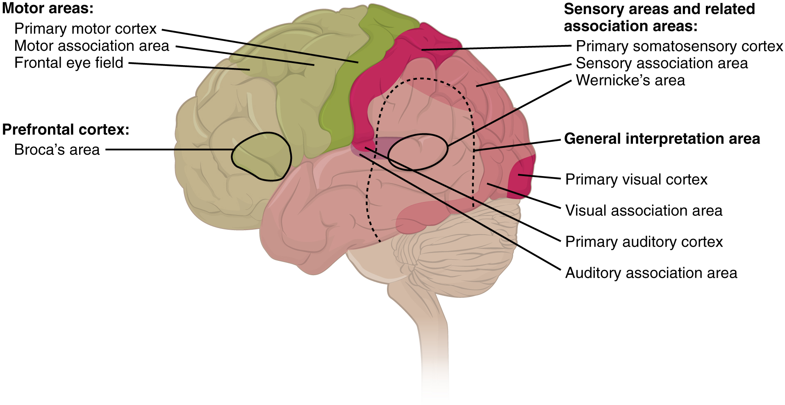

By the end of this section, you will be able to:
* Describe the relationship of mental status exam results to cerebral functions
* Explain the categorization of regions of the cortex based on anatomy and physiology
* Differentiate between primary, association, and integration areas of the cerebral cortex
* Provide examples of localization of function related to the cerebral cortex

In the clinical setting, the set of subtests known as the mental status exam helps us understand the relationship of the brain to the body. Ultimately, this is accomplished by assessing behavior. Tremors related to intentional movements, incoordination, or the neglect of one side of the body can be indicative of failures of the connections of the cerebrum either within the hemispheres, or from the cerebrum to other portions of the nervous system. There is no strict test for what the cerebrum does alone, but rather in what it does through its control of the rest of the CNS, the peripheral nervous system (PNS), and the musculature.

Sometimes eliciting a behavior is as simple as asking a question. Asking a patient to state his or her name is not only to verify that the file folder in a health care provider’s hands is the correct one, but also to be sure that the patient is aware, oriented, and capable of interacting with another person. If the answer to “What is your name?” is “Santa Claus,” the person may have a problem understanding reality. If the person just stares at the examiner with a confused look on their face, the person may have a problem understanding or producing speech.

# Functions of the Cerebral Cortex

The cerebrum is the seat of many of the higher mental functions, such as memory and learning, language, and conscious perception, which are the subjects of subtests of the mental status exam. The cerebral cortex is the thin layer of gray matter on the outside of the cerebrum. It is approximately a millimeter thick in most regions and highly folded to fit within the limited space of the cranial vault. These higher functions are distributed across various regions of the cortex, and specific locations can be said to be responsible for particular functions. There is a limited set of regions, for example, that are involved in language function, and they can be subdivided on the basis of the particular part of language function that each governs.

The basis for parceling out areas of the cortex and attributing them to various functions has its root in pure anatomical underpinnings. The German neurologist and histologist Korbinian Brodmann, who made a careful study of the **cytoarchitecture**{: data-type="term"} of the cerebrum around the turn of the nineteenth century, described approximately 50 regions of the cortex that differed enough from each other to be considered separate areas ([\[link\]](#fig-ch16_02_01)). Brodmann made preparations of many different regions of the cerebral cortex to view with a microscope. He compared the size, shape, and number of neurons to find anatomical differences in the various parts of the cerebral cortex. Continued investigation into these anatomical areas over the subsequent 100 or more years has demonstrated a strong correlation between the structures and the functions attributed to those structures. For example, the first three areas in Brodmann’s list—which are in the postcentral gyrus—compose the primary somatosensory cortex. Within this area, finer separation can be made on the basis of the concept of the sensory homunculus, as well as the different submodalities of somatosensation such as touch, vibration, pain, temperature, or proprioception. Today, we more frequently refer to these regions by their function (i.e., primary sensory cortex) than by the number Brodmann assigned to them, but in some situations the use of Brodmann numbers persists.

 "){: #fig-ch16_02_01 data-title="Brodmann's Areas of the Cerebral Cortex"}

Area 17, as Brodmann described it, is also known as the primary visual cortex. Adjacent to that are areas 18 and 19, which constitute subsequent regions of visual processing. Area 22 is the primary auditory cortex, and it is followed by area 23, which further processes auditory information. Area 4 is the primary motor cortex in the precentral gyrus, whereas area 6 is the premotor cortex. These areas suggest some specialization within the cortex for functional processing, both in sensory and motor regions. The fact that Brodmann’s areas correlate so closely to functional localization in the cerebral cortex demonstrates the strong link between structure and function in these regions.

Areas 1, 2, 3, 4, 17, and 22 are each described as primary cortical areas. The adjoining regions are each referred to as association areas. Primary areas are where sensory information is initially received from the thalamus for conscious perception, or—in the case of the primary motor cortex—where descending commands are sent down to the brain stem or spinal cord to execute movements ([\[link\]](#fig-ch16_02_02)).

 {: #fig-ch16_02_02 data-title="Types of Cortical Areas"}

A number of other regions, which extend beyond these primary or association areas of the cortex, are referred to as integrative areas. These areas are found in the spaces between the domains for particular sensory or motor functions, and they integrate multisensory information, or process sensory or motor information in more complex ways. Consider, for example, the posterior parietal cortex that lies between the somatosensory cortex and visual cortex regions. This has been ascribed to the coordination of visual and motor functions, such as reaching to pick up a glass. The somatosensory function that would be part of this is the proprioceptive feedback from moving the arm and hand. The weight of the glass, based on what it contains, will influence how those movements are executed.

# Cognitive Abilities

Assessment of cerebral functions is directed at cognitive abilities. The abilities assessed through the mental status exam can be separated into four groups: orientation and memory, language and speech, sensorium, and judgment and abstract reasoning.

## Orientation and Memory

Orientation is the patient’s awareness of his or her immediate circumstances. It is awareness of time, not in terms of the clock, but of the date and what is occurring around the patient. It is awareness of place, such that a patient should know where he or she is and why. It is also awareness of who the patient is—recognizing personal identity and being able to relate that to the examiner. The initial tests of orientation are based on the questions, “Do you know what the date is?” or “Do you know where you are?” or “What is your name?” Further understanding of a patient’s awareness of orientation can come from questions that address remote memory, such as “Who is the President of the United States?”, or asking what happened on a specific date.

There are also specific tasks to address memory. One is the three-word recall test. The patient is given three words to recall, such as book, clock, and shovel. After a short interval, during which other parts of the interview continue, the patient is asked to recall the three words. Other tasks that assess memory—aside from those related to orientation—have the patient recite the months of the year in reverse order to avoid the overlearned sequence and focus on the memory of the months in an order, or to spell common words backwards, or to recite a list of numbers back.

Memory is largely a function of the temporal lobe, along with structures beneath the cerebral cortex such as the hippocampus and the amygdala. The storage of memory requires these structures of the medial temporal lobe. A famous case of a man who had both medial temporal lobes removed to treat intractable epilepsy provided insight into the relationship between the structures of the brain and the function of memory.

Henry Molaison, who was referred to as patient HM when he was alive, had epilepsy localized to both of his medial temporal lobes. In 1953, a bilateral lobectomy was performed that alleviated the epilepsy but resulted in the inability for HM to form new memories—a condition called **anterograde amnesia**{: data-type="term"}. HM was able to recall most events from before his surgery, although there was a partial loss of earlier memories, which is referred to as **retrograde amnesia**{: data-type="term"}. HM became the subject of extensive studies into how memory works. What he was unable to do was form new memories of what happened to him, what are now called **episodic memory**{: data-type="term"}. Episodic memory is autobiographical in nature, such as remembering riding a bicycle as a child around the neighborhood, as opposed to the **procedural memory**{: data-type="term"} of how to ride a bike. HM also retained his **short-term memory**{: data-type="term"}, such as what is tested by the three-word task described above. After a brief period, those memories would dissipate or decay and not be stored in the long-term because the medial temporal lobe structures were removed.

The difference in short-term, procedural, and episodic memory, as evidenced by patient HM, suggests that there are different parts of the brain responsible for those functions. The long-term storage of episodic memory requires the hippocampus and related medial temporal structures, and the location of those memories is in the multimodal integration areas of the cerebral cortex. However, short-term memory—also called working or active memory—is localized to the prefrontal lobe. Because patient HM had only lost his medial temporal lobe—and lost very little of his previous memories, and did not lose the ability to form new short-term memories—it was concluded that the function of the hippocampus, and adjacent structures in the medial temporal lobe, is to move (or consolidate) short-term memories (in the pre-frontal lobe) to long-term memory (in the temporal lobe).

The prefrontal cortex can also be tested for the ability to organize information. In one subtest of the mental status exam called set generation, the patient is asked to generate a list of words that all start with the same letter, but not to include proper nouns or names. The expectation is that a person can generate such a list of at least 10 words within 1 minute. Many people can likely do this much more quickly, but the standard separates the accepted normal from those with compromised prefrontal cortices.

  
Read this [article][1] to learn about a young man who texts his fiancée in a panic as he finds that he is having trouble remembering things. At the hospital, a neurologist administers the mental status exam, which is mostly normal except for the three-word recall test. The young man could not recall them even 30 seconds after hearing them and repeating them back to the doctor. An undiscovered mass in the mediastinum region was found to be Hodgkin’s lymphoma, a type of cancer that affects the immune system and likely caused antibodies to attack the nervous system. The patient eventually regained his ability to remember, though the events in the hospital were always elusive. Considering that the effects on memory were temporary, but resulted in the loss of the specific events of the hospital stay, what regions of the brain were likely to have been affected by the antibodies and what type of memory does that represent?

## Language and Speech

Language is, arguably, a very human aspect of neurological function. There are certainly strides being made in understanding communication in other species, but much of what makes the human experience seemingly unique is its basis in language. Any understanding of our species is necessarily reflective, as suggested by the question “What am I?” And the fundamental answer to this question is suggested by the famous quote by René Descartes: “Cogito Ergo Sum” (translated from Latin as “I think, therefore I am”). Formulating an understanding of yourself is largely describing who you are to yourself. It is a confusing topic to delve into, but language is certainly at the core of what it means to be self-aware.

The neurological exam has two specific subtests that address language. One measures the ability of the patient to understand language by asking them to follow a set of instructions to perform an action, such as “touch your right finger to your left elbow and then to your right knee.” Another subtest assesses the fluency and coherency of language by having the patient generate descriptions of objects or scenes depicted in drawings, and by reciting sentences or explaining a written passage. Language, however, is important in so many ways in the neurological exam. The patient needs to know what to do, whether it is as simple as explaining how the knee-jerk reflex is going to be performed, or asking a question such as “What is your name?” Often, language deficits can be determined without specific subtests; if a person cannot reply to a question properly, there may be a problem with the reception of language.

An important example of multimodal integrative areas is associated with language function ([\[link\]](#fig-ch16_02_03)). Adjacent to the auditory association cortex, at the end of the lateral sulcus just anterior to the visual cortex, is **Wernicke’s area**{: data-type="term"}. In the lateral aspect of the frontal lobe, just anterior to the region of the motor cortex associated with the head and neck, is Broca’s area. Both regions were originally described on the basis of losses of speech and language, which is called **aphasia**{: data-type="term"}. The aphasia associated with Broca’s area is known as an **expressive aphasia**{: data-type="term"}, which means that speech production is compromised. This type of aphasia is often described as non-fluency because the ability to say some words leads to broken or halting speech. Grammar can also appear to be lost. The aphasia associated with Wernicke’s area is known as a **receptive aphasia**{: data-type="term"}, which is not a loss of speech production, but a loss of understanding of content. Patients, after recovering from acute forms of this aphasia, report not being able to understand what is said to them or what they are saying themselves, but they often cannot keep from talking.

The two regions are connected by white matter tracts that run between the posterior temporal lobe and the lateral aspect of the frontal lobe. **Conduction aphasia**{: data-type="term"} associated with damage to this connection refers to the problem of connecting the understanding of language to the production of speech. This is a very rare condition, but is likely to present as an inability to faithfully repeat spoken language.

 {: #fig-ch16_02_03 data-title="Broca's and Wernicke's Areas"}

## Sensorium

Those parts of the brain involved in the reception and interpretation of sensory stimuli are referred to collectively as the sensorium. The cerebral cortex has several regions that are necessary for sensory perception. From the primary cortical areas of the somatosensory, visual, auditory, and gustatory senses to the association areas that process information in these modalities, the cerebral cortex is the seat of conscious sensory perception. In contrast, sensory information can also be processed by deeper brain regions, which we may vaguely describe as subconscious—for instance, we are not constantly aware of the proprioceptive information that the cerebellum uses to maintain balance. Several of the subtests can reveal activity associated with these sensory modalities, such as being able to hear a question or see a picture. Two subtests assess specific functions of these cortical areas.

The first is **praxis**{: data-type="term"}, a practical exercise in which the patient performs a task completely on the basis of verbal description without any demonstration from the examiner. For example, the patient can be told to take their left hand and place it palm down on their left thigh, then flip it over so the palm is facing up, and then repeat this four times. The examiner describes the activity without any movements on their part to suggest how the movements are to be performed. The patient needs to understand the instructions, transform them into movements, and use sensory feedback, both visual and proprioceptive, to perform the movements correctly.

The second subtest for sensory perception is **gnosis**{: data-type="term"}, which involves two tasks. The first task, known as **stereognosis**{: data-type="term"}, involves the naming of objects strictly on the basis of the somatosensory information that comes from manipulating them. The patient keeps their eyes closed and is given a common object, such as a coin, that they have to identify. The patient should be able to indicate the particular type of coin, such as a dime versus a penny, or a nickel versus a quarter, on the basis of the sensory cues involved. For example, the size, thickness, or weight of the coin may be an indication, or to differentiate the pairs of coins suggested here, the smooth or corrugated edge of the coin will correspond to the particular denomination. The second task, **graphesthesia**{: data-type="term"}, is to recognize numbers or letters written on the palm of the hand with a dull pointer, such as a pen cap.

Praxis and gnosis are related to the conscious perception and cortical processing of sensory information. Being able to transform verbal commands into a sequence of motor responses, or to manipulate and recognize a common object and associate it with a name for that object. Both subtests have language components because language function is integral to these functions. The relationship between the words that describe actions, or the nouns that represent objects, and the cerebral location of these concepts is suggested to be localized to particular cortical areas. Certain aphasias can be characterized by a deficit of verbs or nouns, known as V impairment or N impairment, or may be classified as V–N dissociation. Patients have difficulty using one type of word over the other. To describe what is happening in a photograph as part of the expressive language subtest, a patient will use active- or image-based language. The lack of one or the other of these components of language can relate to the ability to use verbs or nouns. Damage to the region at which the frontal and temporal lobes meet, including the region known as the insula, is associated with V impairment; damage to the middle and inferior temporal lobe is associated with N impairment.

## Judgment and Abstract Reasoning

Planning and producing responses requires an ability to make sense of the world around us. Making judgments and reasoning in the abstract are necessary to produce movements as part of larger responses. For example, when your alarm goes off, do you hit the snooze button or jump out of bed? Is 10 extra minutes in bed worth the extra rush to get ready for your day? Will hitting the snooze button multiple times lead to feeling more rested or result in a panic as you run late? How you mentally process these questions can affect your whole day.

The prefrontal cortex is responsible for the functions responsible for planning and making decisions. In the mental status exam, the subtest that assesses judgment and reasoning is directed at three aspects of frontal lobe function. First, the examiner asks questions about problem solving, such as “If you see a house on fire, what would you do?” The patient is also asked to interpret common proverbs, such as “Don’t look a gift horse in the mouth.” Additionally, pairs of words are compared for similarities, such as apple and orange, or lamp and cabinet.

The prefrontal cortex is composed of the regions of the frontal lobe that are not directly related to specific motor functions. The most posterior region of the frontal lobe, the precentral gyrus, is the primary motor cortex. Anterior to that are the premotor cortex, Broca’s area, and the frontal eye fields, which are all related to planning certain types of movements. Anterior to what could be described as motor association areas are the regions of the prefrontal cortex. They are the regions in which judgment, abstract reasoning, and working memory are localized. The antecedents to planning certain movements are judging whether those movements should be made, as in the example of deciding whether to hit the snooze button.

To an extent, the prefrontal cortex may be related to personality. The neurological exam does not necessarily assess personality, but it can be within the realm of neurology or psychiatry. A clinical situation that suggests this link between the prefrontal cortex and personality comes from the story of Phineas Gage, the railroad worker from the mid-1800s who had a metal spike impale his prefrontal cortex. There are suggestions that the steel rod led to changes in his personality. A man who was a quiet, dependable railroad worker became a raucous, irritable drunkard. Later anecdotal evidence from his life suggests that he was able to support himself, although he had to relocate and take on a different career as a stagecoach driver.

A psychiatric practice to deal with various disorders was the prefrontal lobotomy. This procedure was common in the 1940s and early 1950s, until antipsychotic drugs became available. The connections between the prefrontal cortex and other regions of the brain were severed. The disorders associated with this procedure included some aspects of what are now referred to as personality disorders, but also included mood disorders and psychoses. Depictions of lobotomies in popular media suggest a link between cutting the white matter of the prefrontal cortex and changes in a patient’s mood and personality, though this correlation is not well understood.

Everyday Connections

Left Brain, Right Brain Popular media often refer to right-brained and left-brained people, as if the brain were two independent halves that work differently for different people. This is a popular misinterpretation of an important neurological phenomenon. As an extreme measure to deal with a debilitating condition, the corpus callosum may be sectioned to overcome intractable epilepsy. When the connections between the two cerebral hemispheres are cut, interesting effects can be observed.

If a person with an intact corpus callosum is asked to put their hands in their pockets and describe what is there on the basis of what their hands feel, they might say that they have keys in their right pocket and loose change in the left. They may even be able to count the coins in their pocket and say if they can afford to buy a candy bar from the vending machine. If a person with a sectioned corpus callosum is given the same instructions, they will do something quite peculiar. They will only put their right hand in their pocket and say they have keys there. They will not even move their left hand, much less report that there is loose change in the left pocket.

The reason for this is that the language functions of the cerebral cortex are localized to the left hemisphere in 95 percent of the population. Additionally, the left hemisphere is connected to the right side of the body through the corticospinal tract and the ascending tracts of the spinal cord. Motor commands from the precentral gyrus control the opposite side of the body, whereas sensory information processed by the postcentral gyrus is received from the opposite side of the body. For a verbal command to initiate movement of the right arm and hand, the left side of the brain needs to be connected by the corpus callosum. Language is processed in the left side of the brain and directly influences the left brain and right arm motor functions, but is sent to influence the right brain and left arm motor functions through the corpus callosum. Likewise, the left-handed sensory perception of what is in the left pocket travels across the corpus callosum from the right brain, so no verbal report on those contents would be possible if the hand happened to be in the pocket.

  
Watch the [video][2] titled “The Man With Two Brains” to see the neuroscientist Michael Gazzaniga introduce a patient he has worked with for years who has had his corpus callosum cut, separating his two cerebral hemispheres. A few tests are run to demonstrate how this manifests in tests of cerebral function. Unlike normal people, this patient can perform two independent tasks at the same time because the lines of communication between the right and left sides of his brain have been removed. Whereas a person with an intact corpus callosum cannot overcome the dominance of one hemisphere over the other, this patient can. If the left cerebral hemisphere is dominant in the majority of people, why would right-handedness be most common?

# The Mental Status Exam

The cerebrum, particularly the cerebral cortex, is the location of important cognitive functions that are the focus of the mental status exam. The regionalization of the cortex, initially described on the basis of anatomical evidence of cytoarchitecture, reveals the distribution of functionally distinct areas. Cortical regions can be described as primary sensory or motor areas, association areas, or multimodal integration areas. The functions attributed to these regions include attention, memory, language, speech, sensation, judgment, and abstract reasoning.

The mental status exam addresses these cognitive abilities through a series of subtests designed to elicit particular behaviors ascribed to these functions. The loss of neurological function can illustrate the location of damage to the cerebrum. Memory functions are attributed to the temporal lobe, particularly the medial temporal lobe structures known as the hippocampus and amygdala, along with the adjacent cortex. Evidence of the importance of these structures comes from the side effects of a bilateral temporal lobectomy that were studied in detail in patient HM.

Losses of language and speech functions, known as aphasias, are associated with damage to the important integration areas in the left hemisphere known as Broca’s or Wernicke’s areas, as well as the connections in the white matter between them. Different types of aphasia are named for the particular structures that are damaged. Assessment of the functions of the sensorium includes praxis and gnosis. The subtests related to these functions depend on multimodal integration, as well as language-dependent processing.

The prefrontal cortex contains structures important for planning, judgment, reasoning, and working memory. Damage to these areas can result in changes to personality, mood, and behavior. The famous case of Phineas Gage suggests a role for this cortex in personality, as does the outdated practice of prefrontal lobectomy.

# Interactive Link Questions

Read this [article][1] to learn about a young man who texts his fiancée in a panic as he finds that he is having trouble remembering things. At the hospital, a neurologist administers the mental status exam, which is mostly normal except for the three-word recall test. The young man could not recall them even 30 seconds after hearing them and repeating them back to the doctor. An undiscovered mass in the mediastinum region was found to be Hodgkin’s lymphoma, a type of cancer that affects the immune system and likely caused antibodies to attack the nervous system. The patient eventually regained his ability to remember, though the events in the hospital were always elusive. Considering that the effects on memory were temporary, but resulted in the loss of the specific events of the hospital stay, what regions of the brain were likely to have been affected by the antibodies and what type of memory does that represent?

The patient was unable to form episodic memories during the events described in the case, so the medial temporal lobe structures might have been affected by the antibodies.

Watch the [video][2] titled “The Man With Two Brains” to see the neuroscientist Michael Gazzaniga introduce a patient he has worked with for years who has had his corpus callosum cut, separating his two cerebral hemispheres. A few tests are run to demonstrate how this manifests in tests of cerebral function. Unlike normal people, this patient can perform two independent tasks at the same time because the lines of communication between the right and left sides of his brain have been removed. Whereas a person with an intact corpus callosum cannot overcome the dominance of one hemisphere over the other, this patient can. If the left cerebral hemisphere is dominant in the majority of people, why would right-handedness be most common?

The left hemisphere of the cerebrum controls the right side of the body through the corticospinal tract. Because language function is largely associated with the dominant hemisphere, the hand with which a person writes will most likely be the one controlled by the left hemisphere.

# Review Questions

Which of the following could be elements of cytoarchitecture, as related to Brodmann’s microscopic studies of the cerebral cortex?

1.  connections to the cerebellum
2.  activation by visual stimuli
3.  number of neurons per square millimeter
4.  number of gyri or sulci
{: data-number-style="lower-alpha"}

C

Which of the following could be a multimodal integrative area?

1.  primary visual cortex
2.  premotor cortex
3.  hippocampus
4.  Wernicke’s area
{: data-number-style="lower-alpha"}

D

Which is an example of episodic memory?

1.  how to bake a cake
2.  your last birthday party
3.  how old you are
4.  needing to wear an oven mitt to take a cake out of the oven
{: data-number-style="lower-alpha"}

B

Which type of aphasia is more like hearing a foreign language spoken?

1.  receptive aphasia
2.  expressive aphasia
3.  conductive aphasia
4.  Broca’s aphasia
{: data-number-style="lower-alpha"}

A

What region of the cerebral cortex is associated with understanding language, both from another person and the language a person generates himself or herself?

1.  medial temporal lobe
2.  ventromedial prefrontal cortex
3.  superior temporal gyrus
4.  postcentral gyrus
{: data-number-style="lower-alpha"}

C

# Critical Thinking Questions

A patient’s performance of the majority of the mental status exam subtests is in line with the expected norms, but the patient cannot repeat a string of numbers given by the examiner. What is a likely explanation?

The patient has suffered a stroke to the prefrontal cortex where working memory is localized.

A patient responds to the question “What is your name?” with a look of incomprehension. Which of the two major language areas is most likely affected and what is the name for that type of aphasia?

Wernicke’s area is associated with the comprehension of language, so the person probably doesn’t understand the question being asked and cannot respond meaningfully. This is called a receptive aphasia.

## Glossary
{: data-type="glossary-title"}

anterograde amnesia
: inability to form new memories from a particular time forward
{: .definition}

aphasia
: loss of language function
{: .definition}

conduction aphasia
: loss of language function related to connecting the understanding of speech with the production of speech, without either specific function being lost
{: .definition}

cytoarchitecture
: study of a tissue based on the structure and organization of its cellular components; related to the broader term, histology
{: .definition}

episodic memory
: memory of specific events in an autobiographical sense
{: .definition}

expressive aphasia
: loss of the ability to produce language; usually associated with damage to Broca’s area in the frontal lobe
{: .definition}

gnosis
: in a neurological exam, intuitive experiential knowledge tested by interacting with common objects or symbols
{: .definition}

graphesthesia
: perception of symbols, such as letters or numbers, traced in the palm of the hand
{: .definition}

praxis
: in a neurological exam, the act of doing something using ready knowledge or skills in response to verbal instruction
{: .definition}

procedural memory
: memory of how to perform a specific task
{: .definition}

receptive aphasia
: loss of the ability to understand received language, such as what is spoken to the subject or given in written form
{: .definition}

retrograde amnesia
: loss of memories before a particular event
{: .definition}

short-term memory
: capacity to retain information actively in the brain for a brief period of time
{: .definition}

stereognosis
: perception of common objects placed in the hand solely on the basis of manipulation of that object in the hand
{: .definition}

Wernicke’s area
: region at the posterior end of the lateral sulcus in which speech comprehension is localized
{: .definition}

[1]: http://openstaxcollege.org/l/3word
[2]: http://openstaxcollege.org/l/2brains
