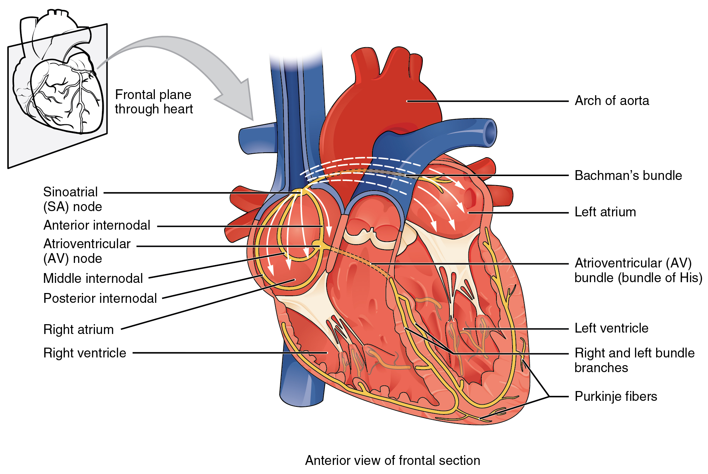

By the end of this section, you will be able to:
* Describe the structure of cardiac muscle
* Identify and describe the components of the conducting system that distributes electrical impulses through the heart
* Compare the effect of ion movement on membrane potential of cardiac conductive and contractile cells
* Relate characteristics of an electrocardiogram to events in the cardiac cycle
* Identify blocks that can interrupt the cardiac cycle

Recall that cardiac muscle shares a few characteristics with both skeletal muscle and smooth muscle, but it has some unique properties of its own. Not the least of these exceptional properties is its ability to initiate an electrical potential at a fixed rate that spreads rapidly from cell to cell to trigger the contractile mechanism. This property is known as **autorhythmicity**{: data-type="term"}. Neither smooth nor skeletal muscle can do this. Even though cardiac muscle has autorhythmicity, heart rate is modulated by the endocrine and nervous systems.

There are two major types of cardiac muscle cells: myocardial contractile cells and myocardial conducting cells. The **myocardial contractile cells**{: data-type="term"} constitute the bulk (99 percent) of the cells in the atria and ventricles. Contractile cells conduct impulses and are responsible for contractions that pump blood through the body. The **myocardial conducting cells**{: data-type="term"} (1 percent of the cells) form the conduction system of the heart. Except for Purkinje cells, they are generally much smaller than the contractile cells and have few of the myofibrils or filaments needed for contraction. Their function is similar in many respects to neurons, although they are specialized muscle cells. Myocardial conduction cells initiate and propagate the action potential (the electrical impulse) that travels throughout the heart and triggers the contractions that propel the blood.

### Structure of Cardiac Muscle

Compared to the giant cylinders of skeletal muscle, cardiac muscle cells, or cardiomyocytes, are considerably shorter with much smaller diameters. Cardiac muscle also demonstrates striations, the alternating pattern of dark A bands and light I bands attributed to the precise arrangement of the myofilaments and fibrils that are organized in sarcomeres along the length of the cell ([\[link\]](#fig-ch20_02_01)**a**). These contractile elements are virtually identical to skeletal muscle. T (transverse) tubules penetrate from the surface plasma membrane, the sarcolemma, to the interior of the cell, allowing the electrical impulse to reach the interior. The T tubules are only found at the Z discs, whereas in skeletal muscle, they are found at the junction of the A and I bands. Therefore, there are one-half as many T tubules in cardiac muscle as in skeletal muscle. In addition, the sarcoplasmic reticulum stores few calcium ions, so most of the calcium ions must come from outside the cells. The result is a slower onset of contraction. Mitochondria are plentiful, providing energy for the contractions of the heart. Typically, cardiomyocytes have a single, central nucleus, but two or more nuclei may be found in some cells.

Cardiac muscle cells branch freely. A junction between two adjoining cells is marked by a critical structure called an **intercalated disc**{: data-type="term"}, which helps support the synchronized contraction of the muscle ([\[link\]](#fig-ch20_02_01)**b**). The sarcolemmas from adjacent cells bind together at the intercalated discs. They consist of desmosomes, specialized linking proteoglycans, tight junctions, and large numbers of gap junctions that allow the passage of ions between the cells and help to synchronize the contraction ([\[link\]](#fig-ch20_02_01)**c**). Intercellular connective tissue also helps to bind the cells together. The importance of strongly binding these cells together is necessitated by the forces exerted by contraction.

  Cardiac muscle cells have myofibrils composed of myofilaments arranged in sarcomeres, T tubules to transmit the impulse from the sarcolemma to the interior of the cell, numerous mitochondria for energy, and intercalated discs that are found at the junction of different cardiac muscle cells. (b) A photomicrograph of cardiac muscle cells shows the nuclei and intercalated discs. (c) An intercalated disc connects cardiac muscle cells and consists of desmosomes and gap junctions. LM &#xD7; 1600. (Micrograph provided by the Regents of the University of Michigan Medical School &#xA9; 2012)"){: #fig-ch20_02_01 data-title="Cardiac Muscle "}

Cardiac muscle undergoes aerobic respiration patterns, primarily metabolizing lipids and carbohydrates. Myoglobin, lipids, and glycogen are all stored within the cytoplasm. Cardiac muscle cells undergo twitch-type contractions with long refractory periods followed by brief relaxation periods. The relaxation is essential so the heart can fill with blood for the next cycle. The refractory period is very long to prevent the possibility of tetany, a condition in which muscle remains involuntarily contracted. In the heart, tetany is not compatible with life, since it would prevent the heart from pumping blood.

Everyday Connection

Repair and Replacement Damaged cardiac muscle cells have extremely limited abilities to repair themselves or to replace dead cells via mitosis. Recent evidence indicates that at least some stem cells remain within the heart that continue to divide and at least potentially replace these dead cells. However, newly formed or repaired cells are rarely as functional as the original cells, and cardiac function is reduced. In the event of a heart attack or MI, dead cells are often replaced by patches of scar tissue. Autopsies performed on individuals who had successfully received heart transplants show some proliferation of original cells. If researchers can unlock the mechanism that generates new cells and restore full mitotic capabilities to heart muscle, the prognosis for heart attack survivors will be greatly enhanced. To date, myocardial cells produced within the patient (*in situ*) by cardiac stem cells seem to be nonfunctional, although those grown in Petri dishes (*in vitro*) do beat. Perhaps soon this mystery will be solved, and new advances in treatment will be commonplace.

### Conduction System of the Heart

If embryonic heart cells are separated into a Petri dish and kept alive, each is capable of generating its own electrical impulse followed by contraction. When two independently beating embryonic cardiac muscle cells are placed together, the cell with the higher inherent rate sets the pace, and the impulse spreads from the faster to the slower cell to trigger a contraction. As more cells are joined together, the fastest cell continues to assume control of the rate. A fully developed adult heart maintains the capability of generating its own electrical impulse, triggered by the fastest cells, as part of the cardiac conduction system. The components of the cardiac conduction system include the sinoatrial node, the atrioventricular node, the atrioventricular bundle, the atrioventricular bundle branches, and the Purkinje cells ([\[link\]](#fig-ch20_02_02)).

 {: #fig-ch20_02_02 data-title="Conduction System of the Heart "}

#### Sinoatrial (SA) Node

Normal cardiac rhythm is established by the **sinoatrial (SA) node**{: data-type="term"}, a specialized clump of myocardial conducting cells located in the superior and posterior walls of the right atrium in close proximity to the orifice of the superior vena cava. The SA node has the highest inherent rate of depolarization and is known as the **pacemaker**{: data-type="term"} of the heart. It initiates the **sinus rhythm**{: data-type="term"}, or normal electrical pattern followed by contraction of the heart.

This impulse spreads from its initiation in the SA node throughout the atria through specialized **internodal pathways**{: data-type="term"}, to the atrial myocardial contractile cells and the atrioventricular node. The internodal pathways consist of three bands (anterior, middle, and posterior) that lead directly from the SA node to the next node in the conduction system, the atrioventricular node (see [\[link\]](#fig-ch20_02_02)). The impulse takes approximately 50 ms (milliseconds) to travel between these two nodes. The relative importance of this pathway has been debated since the impulse would reach the atrioventricular node simply following the cell-by-cell pathway through the contractile cells of the myocardium in the atria. In addition, there is a specialized pathway called **Bachmann’s bundle**{: data-type="term"} or the **interatrial band**{: data-type="term"} that conducts the impulse directly from the right atrium to the left atrium. Regardless of the pathway, as the impulse reaches the atrioventricular septum, the connective tissue of the cardiac skeleton prevents the impulse from spreading into the myocardial cells in the ventricles except at the atrioventricular node. [\[link\]](#fig-ch20_02_03) illustrates the initiation of the impulse in the SA node that then spreads the impulse throughout the atria to the atrioventricular node.

  The sinoatrial (SA) node and the remainder of the conduction system are at rest. (2) The SA node initiates the action potential, which sweeps across the atria. (3) After reaching the atrioventricular node, there is a delay of approximately 100 ms that allows the atria to complete pumping blood before the impulse is transmitted to the atrioventricular bundle. (4) Following the delay, the impulse travels through the atrioventricular bundle and bundle branches to the Purkinje fibers, and also reaches the right papillary muscle via the moderator band. (5) The impulse spreads to the contractile fibers of the ventricle. (6) Ventricular contraction begins."){: #fig-ch20_02_03 data-title="Cardiac Conduction "}

The electrical event, the wave of depolarization, is the trigger for muscular contraction. The wave of depolarization begins in the right atrium, and the impulse spreads across the superior portions of both atria and then down through the contractile cells. The contractile cells then begin contraction from the superior to the inferior portions of the atria, efficiently pumping blood into the ventricles.

#### Atrioventricular (AV) Node

The **atrioventricular (AV) node**{: data-type="term"} is a second clump of specialized myocardial conductive cells, located in the inferior portion of the right atrium within the atrioventricular septum. The septum prevents the impulse from spreading directly to the ventricles without passing through the AV node. There is a critical pause before the AV node depolarizes and transmits the impulse to the atrioventricular bundle (see [\[link\]](#fig-ch20_02_03), step 3). This delay in transmission is partially attributable to the small diameter of the cells of the node, which slow the impulse. Also, conduction between nodal cells is less efficient than between conducting cells. These factors mean that it takes the impulse approximately 100 ms to pass through the node. This pause is critical to heart function, as it allows the atrial cardiomyocytes to complete their contraction that pumps blood into the ventricles before the impulse is transmitted to the cells of the ventricle itself. With extreme stimulation by the SA node, the AV node can transmit impulses maximally at 220 per minute. This establishes the typical maximum heart rate in a healthy young individual. Damaged hearts or those stimulated by drugs can contract at higher rates, but at these rates, the heart can no longer effectively pump blood.

#### Atrioventricular Bundle (Bundle of His), Bundle Branches, and Purkinje Fibers

Arising from the AV node, the **atrioventricular bundle**{: data-type="term"}, or **bundle of His**{: data-type="term"}, proceeds through the interventricular septum before dividing into two **atrioventricular bundle branches**{: data-type="term"}, commonly called the left and right bundle branches. The left bundle branch has two fascicles. The left bundle branch supplies the left ventricle, and the right bundle branch the right ventricle. Since the left ventricle is much larger than the right, the left bundle branch is also considerably larger than the right. Portions of the right bundle branch are found in the moderator band and supply the right papillary muscles. Because of this connection, each papillary muscle receives the impulse at approximately the same time, so they begin to contract simultaneously just prior to the remainder of the myocardial contractile cells of the ventricles. This is believed to allow tension to develop on the chordae tendineae prior to right ventricular contraction. There is no corresponding moderator band on the left. Both bundle branches descend and reach the apex of the heart where they connect with the Purkinje fibers (see [\[link\]](#fig-ch20_02_03), step 4). This passage takes approximately 25 ms.

The **Purkinje fibers**{: data-type="term"} are additional myocardial conductive fibers that spread the impulse to the myocardial contractile cells in the ventricles. They extend throughout the myocardium from the apex of the heart toward the atrioventricular septum and the base of the heart. The Purkinje fibers have a fast inherent conduction rate, and the electrical impulse reaches all of the ventricular muscle cells in about 75 ms (see [\[link\]](#fig-ch20_02_03), step 5). Since the electrical stimulus begins at the apex, the contraction also begins at the apex and travels toward the base of the heart, similar to squeezing a tube of toothpaste from the bottom. This allows the blood to be pumped out of the ventricles and into the aorta and pulmonary trunk. The total time elapsed from the initiation of the impulse in the SA node until depolarization of the ventricles is approximately 225 ms.

#### Membrane Potentials and Ion Movement in Cardiac Conductive Cells

Action potentials are considerably different between cardiac conductive cells and cardiac contractive cells. While Na+ and K+ play essential roles, Ca2+ is also critical for both types of cells. Unlike skeletal muscles and neurons, cardiac conductive cells do not have a stable resting potential. Conductive cells contain a series of sodium ion channels that allow a normal and slow influx of sodium ions that causes the membrane potential to rise slowly from an initial value of −60 mV up to about –40 mV. The resulting movement of sodium ions creates **spontaneous depolarization**{: data-type="term"} (or **prepotential depolarization**{: data-type="term"}). At this point, calcium ion channels open and Ca2+ enters the cell, further depolarizing it at a more rapid rate until it reaches a value of approximately +5 mV. At this point, the calcium ion channels close and K+ channels open, allowing outflux of K+ and resulting in repolarization. When the membrane potential reaches approximately −60 mV, the K+ channels close and Na+ channels open, and the prepotential phase begins again. This phenomenon explains the autorhythmicity properties of cardiac muscle ([\[link\]](#fig-ch20_02_04)).

 {: #fig-ch20_02_04 data-title="Action Potential at the SA Node "}

#### Membrane Potentials and Ion Movement in Cardiac Contractile Cells

There is a distinctly different electrical pattern involving the contractile cells. In this case, there is a rapid depolarization, followed by a plateau phase and then repolarization. This phenomenon accounts for the long refractory periods required for the cardiac muscle cells to pump blood effectively before they are capable of firing for a second time. These cardiac myocytes normally do not initiate their own electrical potential but rather wait for an impulse to reach them.

Contractile cells demonstrate a much more stable resting phase than conductive cells at approximately −80 mV for cells in the atria and −90 mV for cells in the ventricles. Despite this initial difference, the other components of their action potentials are virtually identical. In both cases, when stimulated by an action potential, voltage-gated channels rapidly open, beginning the positive-feedback mechanism of depolarization. This rapid influx of positively charged ions raises the membrane potential to approximately +30 mV, at which point the sodium channels close. The rapid depolarization period typically lasts 3–5 ms. Depolarization is followed by the plateau phase, in which membrane potential declines relatively slowly. This is due in large part to the opening of the slow Ca2+ channels, allowing Ca2+ to enter the cell while few K+ channels are open, allowing K+ to exit the cell. The relatively long plateau phase lasts approximately 175 ms. Once the membrane potential reaches approximately zero, the Ca2+ channels close and K+ channels open, allowing K+ to exit the cell. The repolarization lasts approximately 75 ms. At this point, membrane potential drops until it reaches resting levels once more and the cycle repeats. The entire event lasts between 250 and 300 ms ([\[link\]](#fig-ch20_02_05)).

The absolute refractory period for cardiac contractile muscle lasts approximately 200 ms, and the relative refractory period lasts approximately 50 ms, for a total of 250 ms. This extended period is critical, since the heart muscle must contract to pump blood effectively and the contraction must follow the electrical events. Without extended refractory periods, premature contractions would occur in the heart and would not be compatible with life.

  Note the long plateau phase due to the influx of calcium ions. The extended refractory period allows the cell to fully contract before another electrical event can occur. (b) The action potential for heart muscle is compared to that of skeletal muscle."){: #fig-ch20_02_05 data-title="Action Potential in Cardiac Contractile Cells "}

#### Calcium Ions

Calcium ions play two critical roles in the physiology of cardiac muscle. Their influx through slow calcium channels accounts for the prolonged plateau phase and absolute refractory period that enable cardiac muscle to function properly. Calcium ions also combine with the regulatory protein troponin in the troponin-tropomyosin complex; this complex removes the inhibition that prevents the heads of the myosin molecules from forming cross bridges with the active sites on actin that provide the power stroke of contraction. This mechanism is virtually identical to that of skeletal muscle. Approximately 20 percent of the calcium required for contraction is supplied by the influx of Ca2+ during the plateau phase. The remaining Ca2+ for contraction is released from storage in the sarcoplasmic reticulum.

#### Comparative Rates of Conduction System Firing

The pattern of prepotential or spontaneous depolarization, followed by rapid depolarization and repolarization just described, are seen in the SA node and a few other conductive cells in the heart. Since the SA node is the pacemaker, it reaches threshold faster than any other component of the conduction system. It will initiate the impulses spreading to the other conducting cells. The SA node, without nervous or endocrine control, would initiate a heart impulse approximately 80–100 times per minute. Although each component of the conduction system is capable of generating its own impulse, the rate progressively slows as you proceed from the SA node to the Purkinje fibers. Without the SA node, the AV node would generate a heart rate of 40–60 beats per minute. If the AV node were blocked, the atrioventricular bundle would fire at a rate of approximately 30–40 impulses per minute. The bundle branches would have an inherent rate of 20–30 impulses per minute, and the Purkinje fibers would fire at 15–20 impulses per minute. While a few exceptionally trained aerobic athletes demonstrate resting heart rates in the range of 30–40 beats per minute (the lowest recorded figure is 28 beats per minute for Miguel Indurain, a cyclist), for most individuals, rates lower than 50 beats per minute would indicate a condition called bradycardia. Depending upon the specific individual, as rates fall much below this level, the heart would be unable to maintain adequate flow of blood to vital tissues, initially resulting in decreasing loss of function across the systems, unconsciousness, and ultimately death.

### Electrocardiogram

By careful placement of surface electrodes on the body, it is possible to record the complex, compound electrical signal of the heart. This tracing of the electrical signal is the **electrocardiogram (ECG)**{: data-type="term"}, also commonly abbreviated EKG (K coming kardiology, from the German term for cardiology). Careful analysis of the ECG reveals a detailed picture of both normal and abnormal heart function, and is an indispensable clinical diagnostic tool. The standard electrocardiograph (the instrument that generates an ECG) uses 3, 5, or 12 leads. The greater the number of leads an electrocardiograph uses, the more information the ECG provides. The term “lead” may be used to refer to the cable from the electrode to the electrical recorder, but it typically describes the voltage difference between two of the electrodes. The 12-lead electrocardiograph uses 10 electrodes placed in standard locations on the patient’s skin ([\[link\]](#fig-ch20_02_06)). In continuous ambulatory electrocardiographs, the patient wears a small, portable, battery-operated device known as a Holter monitor, or simply a Holter, that continuously monitors heart electrical activity, typically for a period of 24 hours during the patient’s normal routine.

 {: #fig-ch20_02_06 data-title="Standard Placement of ECG Leads "}

A normal ECG tracing is presented in [\[link\]](#fig-ch20_02_07). Each component, segment, and interval is labeled and corresponds to important electrical events, demonstrating the relationship between these events and contraction in the heart.

There are five prominent points on the ECG: the P wave, the QRS complex, and the T wave. The small **P wave**{: data-type="term"} represents the depolarization of the atria. The atria begin contracting approximately 25 ms after the start of the P wave. The large **QRS complex**{: data-type="term"} represents the depolarization of the ventricles, which requires a much stronger electrical signal because of the larger size of the ventricular cardiac muscle. The ventricles begin to contract as the QRS reaches the peak of the R wave. Lastly, the **T wave**{: data-type="term"} represents the repolarization of the ventricles. The repolarization of the atria occurs during the QRS complex, which masks it on an ECG.

The major segments and intervals of an ECG tracing are indicated in [\[link\]](#fig-ch20_02_07). Segments are defined as the regions between two waves. Intervals include one segment plus one or more waves. For example, the PR segment begins at the end of the P wave and ends at the beginning of the QRS complex. The PR interval starts at the beginning of the P wave and ends with the beginning of the QRS complex. The PR interval is more clinically relevant, as it measures the duration from the beginning of atrial depolarization (the P wave) to the initiation of the QRS complex. Since the Q wave may be difficult to view in some tracings, the measurement is often extended to the R that is more easily visible. Should there be a delay in passage of the impulse from the SA node to the AV node, it would be visible in the PR interval. [\[link\]](#fig-ch20_02_08) correlates events of heart contraction to the corresponding segments and intervals of an ECG.

  
Visit this [site][1] for a more detailed analysis of ECGs.

{: #fig-ch20_02_07 data-title="Electrocardiogram "}

{: #fig-ch20_02_08 data-title="ECG Tracing Correlated to the Cardiac Cycle "}

Everyday Connection

ECG Abnormalities Occassionally, an area of the heart other than the SA node will initiate an impulse that will be followed by a premature contraction. Such an area, which may actually be a component of the conduction system or some other contractile cells, is known as an ectopic focus or ectopic pacemaker. An ectopic focus may be stimulated by localized ischemia; exposure to certain drugs, including caffeine, digitalis, or acetylcholine; elevated stimulation by both sympathetic or parasympathetic divisions of the autonomic nervous system; or a number of disease or pathological conditions. Occasional occurances are generally transitory and nonlife threatening, but if the condition becomes chronic, it may lead to either an arrhythmia, a deviation from the normal pattern of impulse conduction and contraction, or to fibrillation, an uncoordinated beating of the heart.

While interpretation of an ECG is possible and extremely valuable after some training, a full understanding of the complexities and intricacies generally requires several years of experience. In general, the size of the electrical variations, the duration of the events, and detailed vector analysis provide the most comprehensive picture of cardiac function. For example, an amplified P wave may indicate enlargement of the atria, an enlarged Q wave may indicate a MI, and an enlarged suppressed or inverted Q wave often indicates enlarged ventricles. T waves often appear flatter when insufficient oxygen is being delivered to the myocardium. An elevation of the ST segment above baseline is often seen in patients with an acute MI, and may appear depressed below the baseline when hypoxia is occurring.

As useful as analyzing these electrical recordings may be, there are limitations. For example, not all areas suffering a MI may be obvious on the ECG. Additionally, it will not reveal the effectiveness of the pumping, which requires further testing, such as an ultrasound test called an echocardiogram or nuclear medicine imaging. It is also possible for there to be pulseless electrical activity, which will show up on an ECG tracing, although there is no corresponding pumping action. Common abnormalities that may be detected by the ECGs are shown in [\[link\]](#fig-ch20_02_09).

 In a second-degree or partial block, one-half of the P waves are not followed by the QRS complex and T waves while the other half are. (b) In atrial fibrillation, the electrical pattern is abnormal prior to the QRS complex, and the frequency between the QRS complexes has increased. (c) In ventricular tachycardia, the shape of the QRS complex is abnormal. (d) In ventricular fibrillation, there is no normal electrical activity. (e) In a third-degree block, there is no correlation between atrial activity (the P wave) and ventricular activity (the QRS complex)."){: #fig-ch20_02_09 data-title="Common ECG Abnormalities "}

  
Visit this [site][2] for a more complete library of abnormal ECGs.

Everyday Connection

External Automated Defibrillators In the event that the electrical activity of the heart is severely disrupted, cessation of electrical activity or fibrillation may occur. In fibrillation, the heart beats in a wild, uncontrolled manner, which prevents it from being able to pump effectively. Atrial fibrillation (see [\[link\]](#fig-ch20_02_09)**b**) is a serious condition, but as long as the ventricles continue to pump blood, the patient’s life may not be in immediate danger. Ventricular fibrillation (see [\[link\]](#fig-ch20_02_09)**d**) is a medical emergency that requires life support, because the ventricles are not effectively pumping blood. In a hospital setting, it is often described as “code blue.” If untreated for as little as a few minutes, ventricular fibrillation may lead to brain death. The most common treatment is defibrillation, which uses special paddles to apply a charge to the heart from an external electrical source in an attempt to establish a normal sinus rhythm ([\[link\]](#fig-ch20_02_10)). A defibrillator effectively stops the heart so that the SA node can trigger a normal conduction cycle. Because of their effectiveness in reestablishing a normal sinus rhythm, external automated defibrillators (EADs) are being placed in areas frequented by large numbers of people, such as schools, restaurants, and airports. These devices contain simple and direct verbal instructions that can be followed by nonmedical personnel in an attempt to save a life.

 An external automatic defibrillator can be used by nonmedical personnel to reestablish a normal sinus rhythm in a person with fibrillation. (b) Defibrillator paddles are more commonly used in hospital settings. (credit b: &#x201C;widerider107&#x201D;/flickr.com)"){: #fig-ch20_02_10 data-title="Defibrillators "}

A **heart block**{: data-type="term"} refers to an interruption in the normal conduction pathway. The nomenclature for these is very straightforward. SA nodal blocks occur within the SA node. AV nodal blocks occur within the AV node. Infra-Hisian blocks involve the bundle of His. Bundle branch blocks occur within either the left or right atrioventricular bundle branches. Hemiblocks are partial and occur within one or more fascicles of the atrioventricular bundle branch. Clinically, the most common types are the AV nodal and infra-Hisian blocks.

AV blocks are often described by degrees. A first-degree or partial block indicates a delay in conduction between the SA and AV nodes. This can be recognized on the ECG as an abnormally long PR interval. A second-degree or incomplete block occurs when some impulses from the SA node reach the AV node and continue, while others do not. In this instance, the ECG would reveal some P waves not followed by a QRS complex, while others would appear normal. In the third-degree or complete block, there is no correlation between atrial activity (the P wave) and ventricular activity (the QRS complex). Even in the event of a total SA block, the AV node will assume the role of pacemaker and continue initiating contractions at 40–60 contractions per minute, which is adequate to maintain consciousness. Second- and third-degree blocks are demonstrated on the ECG presented in [\[link\]](#fig-ch20_02_09).

When arrhythmias become a chronic problem, the heart maintains a junctional rhythm, which originates in the AV node. In order to speed up the heart rate and restore full sinus rhythm, a cardiologist can implant an **artificial pacemaker**{: data-type="term"}, which delivers electrical impulses to the heart muscle to ensure that the heart continues to contract and pump blood effectively. These artificial pacemakers are programmable by the cardiologists and can either provide stimulation temporarily upon demand or on a continuous basis. Some devices also contain built-in defibrillators.

### Cardiac Muscle Metabolism

Normally, cardiac muscle metabolism is entirely aerobic. Oxygen from the lungs is brought to the heart, and every other organ, attached to the hemoglobin molecules within the erythrocytes. Heart cells also store appreciable amounts of oxygen in myoglobin. Normally, these two mechanisms, circulating oxygen and oxygen attached to myoglobin, can supply sufficient oxygen to the heart, even during peak performance.

Fatty acids and glucose from the circulation are broken down within the mitochondria to release energy in the form of ATP. Both fatty acid droplets and glycogen are stored within the sarcoplasm and provide additional nutrient supply. (Seek additional content for more detail about metabolism.)

### Chapter Review

The heart is regulated by both neural and endocrine control, yet it is capable of initiating its own action potential followed by muscular contraction. The conductive cells within the heart establish the heart rate and transmit it through the myocardium. The contractile cells contract and propel the blood. The normal path of transmission for the conductive cells is the sinoatrial (SA) node, internodal pathways, atrioventricular (AV) node, atrioventricular (AV) bundle of His, bundle branches, and Purkinje fibers. The action potential for the conductive cells consists of a prepotential phase with a slow influx of Na+ followed by a rapid influx of Ca2+ and outflux of K+. Contractile cells have an action potential with an extended plateau phase that results in an extended refractory period to allow complete contraction for the heart to pump blood effectively. Recognizable points on the ECG include the P wave that corresponds to atrial depolarization, the QRS complex that corresponds to ventricular depolarization, and the T wave that corresponds to ventricular repolarization.

### Review Questions

Which of the following is unique to cardiac muscle cells?

1.  Only cardiac muscle contains a sarcoplasmic reticulum.
2.  Only cardiac muscle has gap junctions.
3.  Only cardiac muscle is capable of autorhythmicity
4.  Only cardiac muscle has a high concentration of mitochondria.
{: type="a"}

C

The influx of which ion accounts for the plateau phase?

1.  sodium
2.  potassium
3.  chloride
4.  calcium
{: type="a"}

D

Which portion of the ECG corresponds to repolarization of the atria?

1.  P wave
2.  QRS complex
3.  T wave
4.  none of the above: atrial repolarization is masked by ventricular depolarization
{: type="a"}

D

Which component of the heart conduction system would have the slowest rate of firing?

1.  atrioventricular node
2.  atrioventricular bundle
3.  bundle branches
4.  Purkinje fibers
{: type="a"}

D

### Critical Thinking Questions

Why is the plateau phase so critical to cardiac muscle function?

It prevents additional impulses from spreading through the heart prematurely, thereby allowing the muscle sufficient time to contract and pump blood effectively.

How does the delay of the impulse at the atrioventricular node contribute to cardiac function?

It ensures sufficient time for the atrial muscle to contract and pump blood into the ventricles prior to the impulse being conducted into the lower chambers.

How do gap junctions and intercalated disks aid contraction of the heart?

Gap junctions within the intercalated disks allow impulses to spread from one cardiac muscle cell to another, allowing sodium, potassium, and calcium ions to flow between adjacent cells, propagating the action potential, and ensuring coordinated contractions.

Why do the cardiac muscles cells demonstrate autorhythmicity?

Without a true resting potential, there is a slow influx of sodium ions through slow channels that produces a prepotential that gradually reaches threshold.

### Glossary
{: data-type="glossary-title"}

artificial pacemaker
: medical device that transmits electrical signals to the heart to ensure that it contracts and pumps blood to the body
^

atrioventricular bundle
: (also, bundle of His) group of specialized myocardial conductile cells that transmit the impulse from the AV node through the interventricular septum; form the left and right atrioventricular bundle branches
^

atrioventricular bundle branches
: (also, left or right bundle branches) specialized myocardial conductile cells that arise from the bifurcation of the atrioventricular bundle and pass through the interventricular septum; lead to the Purkinje fibers and also to the right papillary muscle via the moderator band
^

atrioventricular (AV) node
: clump of myocardial cells located in the inferior portion of the right atrium within the atrioventricular septum; receives the impulse from the SA node, pauses, and then transmits it into specialized conducting cells within the interventricular septum
^

autorhythmicity
: ability of cardiac muscle to initiate its own electrical impulse that triggers the mechanical contraction that pumps blood at a fixed pace without nervous or endocrine control
^

Bachmann’s bundle
: (also, interatrial band) group of specialized conducting cells that transmit the impulse directly from the SA node in the right atrium to the left atrium
^

bundle of His
: (also, atrioventricular bundle) group of specialized myocardial conductile cells that transmit the impulse from the AV node through the interventricular septum; form the left and right atrioventricular bundle branches
^

electrocardiogram (ECG)
: surface recording of the electrical activity of the heart that can be used for diagnosis of irregular heart function; also abbreviated as EKG
^

heart block
: interruption in the normal conduction pathway
^

interatrial band
: (also, Bachmann’s bundle) group of specialized conducting cells that transmit the impulse directly from the SA node in the right atrium to the left atrium
^

intercalated disc
: physical junction between adjacent cardiac muscle cells; consisting of desmosomes, specialized linking proteoglycans, and gap junctions that allow passage of ions between the two cells
^

internodal pathways
: specialized conductile cells within the atria that transmit the impulse from the SA node throughout the myocardial cells of the atrium and to the AV node
^

myocardial conducting cells
: specialized cells that transmit electrical impulses throughout the heart and trigger contraction by the myocardial contractile cells
^

myocardial contractile cells
: bulk of the cardiac muscle cells in the atria and ventricles that conduct impulses and contract to propel blood
^

P wave
: component of the electrocardiogram that represents the depolarization of the atria
^

pacemaker
: cluster of specialized myocardial cells known as the SA node that initiates the sinus rhythm
^

prepotential depolarization
: (also, spontaneous depolarization) mechanism that accounts for the autorhythmic property of cardiac muscle; the membrane potential increases as sodium ions diffuse through the always-open sodium ion channels and causes the electrical potential to rise
^

Purkinje fibers
: specialized myocardial conduction fibers that arise from the bundle branches and spread the impulse to the myocardial contraction fibers of the ventricles
^

QRS complex
: component of the electrocardiogram that represents the depolarization of the ventricles and includes, as a component, the repolarization of the atria
^

sinoatrial (SA) node
: known as the pacemaker, a specialized clump of myocardial conducting cells located in the superior portion of the right atrium that has the highest inherent rate of depolarization that then spreads throughout the heart
^

sinus rhythm
: normal contractile pattern of the heart
^

spontaneous depolarization
: (also, prepotential depolarization) the mechanism that accounts for the autorhythmic property of cardiac muscle; the membrane potential increases as sodium ions diffuse through the always-open sodium ion channels and causes the electrical potential to rise
^

T wave
: component of the electrocardiogram that represents the repolarization of the ventricles

[1]: http://openstaxcollege.org/l/ECG
[2]: http://openstaxcollege.org/l/abnormalECG
