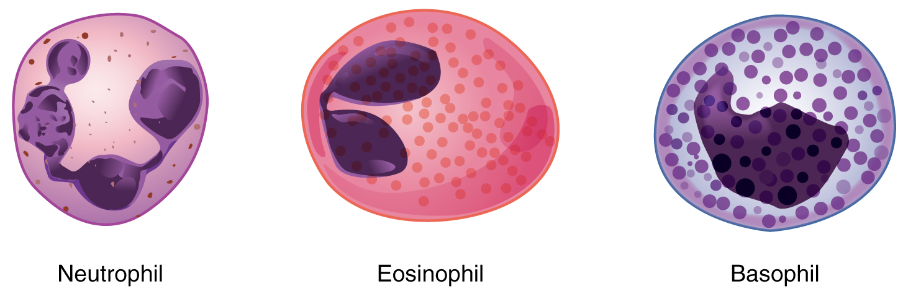
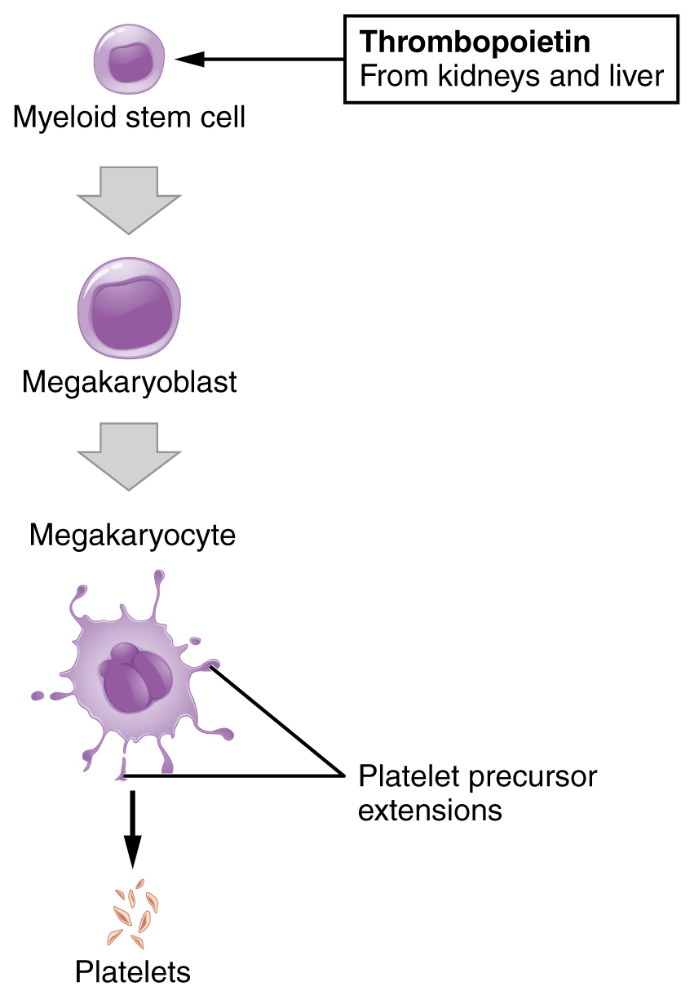

By the end of this section, you will be able to:
* Describe the general characteristics of leukocytes
* Classify leukocytes according to their lineage, their main structural
  features, and their primary functions
* Discuss the most common malignancies involving leukocytes
* Identify the lineage, basic structure, and function of platelets

The leukocyte, commonly known as a white
blood cell (or WBC), is a major component of the body’s defenses against
disease. Leukocytes protect the body against invading microorganisms and
body cells with mutated DNA, and they clean up debris. Platelets are
essential for the repair of blood vessels when damage to them has
occurred; they also provide growth factors for healing and repair. See
[\[link\]](/m46707#fig-ch19_03_01){: .autogenerated-content} for a
summary of leukocytes and platelets.

# Characteristics of Leukocytes

Although leukocytes and erythrocytes both originate from hematopoietic
stem cells in the bone marrow, they are very different from each other
in many significant ways. For instance, leukocytes are far less numerous
than erythrocytes: Typically there are only 5000 to 10,000 per *µ*L.
They are also larger than erythrocytes and are the only formed elements
that are complete cells, possessing a nucleus and organelles. And
although there is just one type of erythrocyte, there are many types of
leukocytes. Most of these types have a much shorter lifespan than that
of erythrocytes, some as short as a few hours or even a few minutes in
the case of acute infection.

One of the most distinctive characteristics of leukocytes is their
movement. Whereas erythrocytes spend their days circulating within the
blood vessels, leukocytes routinely leave the bloodstream to perform
their defensive functions in the body’s tissues. For leukocytes, the
vascular network is simply a highway they travel and soon exit to reach
their true destination. When they arrive, they are often given distinct
names, such as macrophage or microglia, depending on their function. As
shown in [\[link\]](#fig-ch19_04_01){: .autogenerated-content}, they
leave the capillaries—the smallest blood vessels—or other small vessels
through a process known as emigration
(from the Latin for “removal”) or diapedesis (dia- = “through”; -pedan = “to
leap”) in which they squeeze through adjacent cells in a blood vessel
wall.

Once they have exited the capillaries, some leukocytes will take up
fixed positions in lymphatic tissue, bone marrow, the spleen, the
thymus, or other organs. Others will move about through the tissue
spaces very much like amoebas, continuously extending their plasma
membranes, sometimes wandering freely, and sometimes moving toward the
direction in which they are drawn by chemical signals. This attracting
of leukocytes occurs because of positive
chemotaxis (literally “movement in response to chemicals”), a
phenomenon in which injured or infected cells and nearby leukocytes emit
the equivalent of a chemical “911” call, attracting more leukocytes to
the site. In clinical medicine, the differential counts of the types and
percentages of leukocytes present are often key indicators in making a
diagnosis and selecting a treatment.

{: #fig-ch19_04_01 data-media-type="image/jpg" data-title="Emigration "}

# Classification of Leukocytes

When scientists first began to observe stained blood slides, it quickly
became evident that leukocytes could be divided into two groups,
according to whether their cytoplasm contained highly visible granules:

* Granular leukocytes contain abundant
  granules within the cytoplasm. They include neutrophils, eosinophils,
  and basophils (you can view their lineage from myeloid stem cells in
  [\[link\]](/m46691#fig-ch19_02_01){: .autogenerated-content}).
* While granules are not totally lacking in agranular leukocytes, they are far fewer and
  less obvious. Agranular leukocytes include monocytes, which mature
  into macrophages that are phagocytic, and lymphocytes, which arise
  from the lymphoid stem cell line.

## Granular Leukocytes

We will consider the granular leukocytes in order from most common to
least common. All of these are produced in the red bone marrow and have
a short lifespan of hours to days. They typically have a lobed nucleus
and are classified according to which type of stain best highlights
their granules ([\[link\]](#fig-ch19_04_02){: .autogenerated-content}).

{: #fig-ch19_04_02 data-media-type="image/jpg" data-title="Granular Leukocytes "}

The most common of all the leukocytes, neutrophils will normally comprise 50–70 percent
of total leukocyte count. They are 10–12 *µ*m in diameter, significantly
larger than erythrocytes. They are called neutrophils because their
granules show up most clearly with stains that are chemically neutral
(neither acidic nor basic). The granules are numerous but quite fine and
normally appear light lilac. The nucleus has a distinct lobed appearance
and may have two to five lobes, the number increasing with the age of
the cell. Older neutrophils have increasing numbers of lobes and are
often referred to as polymorphonuclear (a
nucleus with many forms), or simply “polys.” Younger and immature
neutrophils begin to develop lobes and are known as “bands.”

Neutrophils are rapid responders to the site of infection and are
efficient phagocytes with a preference for bacteria. Their granules
include lysozyme, an enzyme capable of
lysing, or breaking down, bacterial cell walls; oxidants such as
hydrogen peroxide; and defensins, proteins
that bind to and puncture bacterial and fungal plasma membranes, so that
the cell contents leak out. Abnormally high counts of neutrophils
indicate infection and/or inflammation, particularly triggered by
bacteria, but are also found in burn patients and others experiencing
unusual stress. A burn injury increases the proliferation of neutrophils
in order to fight off infection that can result from the destruction of
the barrier of the skin. Low counts may be caused by drug toxicity and
other disorders, and may increase an individual’s susceptibility to
infection.

Eosinophils typically represent 2–4
percent of total leukocyte count. They are also 10–12 *µ*m in diameter.
The granules of eosinophils stain best with an acidic stain known as
eosin. The nucleus of the eosinophil will typically have two to three
lobes and, if stained properly, the granules will have a distinct red to
orange color.

The granules of eosinophils include antihistamine molecules, which
counteract the activities of histamines, inflammatory chemicals produced
by basophils and mast cells. Some eosinophil granules contain molecules
toxic to parasitic worms, which can enter the body through the
integument, or when an individual consumes raw or undercooked fish or
meat. Eosinophils are also capable of phagocytosis and are particularly
effective when antibodies bind to the target and form an
antigen-antibody complex. High counts of eosinophils are typical of
patients experiencing allergies, parasitic worm infestations, and some
autoimmune diseases. Low counts may be due to drug toxicity and stress.

Basophils are the least common leukocytes,
typically comprising less than one percent of the total leukocyte count.
They are slightly smaller than neutrophils and eosinophils at 8–10<em>
µ</em>m in diameter. The granules of basophils stain best with basic
(alkaline) stains. Basophils contain large granules that pick up a dark
blue stain and are so common they may make it difficult to see the
two-lobed nucleus.

In general, basophils intensify the inflammatory response. They share
this trait with mast cells. In the past, mast cells were considered to
be basophils that left the circulation. However, this appears not to be
the case, as the two cell types develop from different lineages.

The granules of basophils release histamines, which contribute to
inflammation, and heparin, which opposes blood clotting. High counts of
basophils are associated with allergies, parasitic infections, and
hypothyroidism. Low counts are associated with pregnancy, stress, and
hyperthyroidism.

## Agranular Leukocytes

Agranular leukocytes contain smaller, less-visible granules in their
cytoplasm than do granular leukocytes. The nucleus is simple in shape,
sometimes with an indentation but without distinct lobes. There are two
major types of agranulocytes: lymphocytes and monocytes (see
[\[link\]](/m46691#fig-ch19_02_01){: .autogenerated-content}).

Lymphocytes are the only formed element of
blood that arises from lymphoid stem cells. Although they form initially
in the bone marrow, much of their subsequent development and
reproduction occurs in the lymphatic tissues. Lymphocytes are the second
most common type of leukocyte, accounting for about 20–30 percent of all
leukocytes, and are essential for the immune response. The size range of
lymphocytes is quite extensive, with some authorities recognizing two
size classes and others three. Typically, the large cells are 10–14 *µ*m
and have a smaller nucleus-to-cytoplasm ratio and more granules. The
smaller cells are typically 6–9 *µ*m with a larger volume of nucleus to
cytoplasm, creating a “halo” effect. A few cells may fall outside these
ranges, at 14–17 *µ*m. This finding has led to the three size range
classification.

The three major groups of lymphocytes include natural killer cells, B
cells, and T cells. Natural killer (NK)
cells are capable of recognizing cells that do not express “self”
proteins on their plasma membrane or that contain foreign or abnormal
markers. These “nonself” cells include cancer cells, cells infected with
a virus, and other cells with atypical surface proteins. Thus, they
provide generalized, nonspecific immunity. The larger lymphocytes are
typically NK cells.

B cells and T cells, also called B
lymphocytes and T lymphocytes, play
prominent roles in defending the body against specific pathogens
(disease-causing microorganisms) and are involved in specific immunity.
One form of B cells (plasma cells) produces the antibodies or
immunoglobulins that bind to specific foreign or abnormal components of
plasma membranes. This is also referred to as humoral (body fluid)
immunity. T cells provide cellular-level immunity by physically
attacking foreign or diseased cells. A memory
cell is a variety of both B and T cells that forms after exposure
to a pathogen and mounts rapid responses upon subsequent exposures.
Unlike other leukocytes, memory cells live for many years. B cells
undergo a maturation process in the <u data-effect="underline">b</u>

one marrow, whereas T cells undergo maturation in the <u
data-effect="underline">t</u>

hymus. This site of the maturation process gives rise to the name B and
T cells. The functions of lymphocytes are complex and will be covered in
detail in the chapter covering the lymphatic system and immunity.
Smaller lymphocytes are either B or T cells, although they cannot be
differentiated in a normal blood smear.

Abnormally high lymphocyte counts are characteristic of viral infections
as well as some types of cancer. Abnormally low lymphocyte counts are
characteristic of prolonged (chronic) illness or immunosuppression,
including that caused by HIV infection and drug therapies that often
involve steroids.

Monocytes originate from myeloid stem
cells. They normally represent 2–8 percent of the total leukocyte count.
They are typically easily recognized by their large size of 12–20 *µ*m
and indented or horseshoe-shaped nuclei. Macrophages are monocytes that
have left the circulation and phagocytize debris, foreign pathogens,
worn-out erythrocytes, and many other dead, worn out, or damaged cells.
Macrophages also release antimicrobial defensins and chemotactic
chemicals that attract other leukocytes to the site of an infection.
Some macrophages occupy fixed locations, whereas others wander through
the tissue fluid.

Abnormally high counts of monocytes are associated with viral or fungal
infections, tuberculosis, and some forms of leukemia and other chronic
diseases. Abnormally low counts are typically caused by suppression of
the bone marrow.

# Lifecycle of Leukocytes

Most leukocytes have a relatively short lifespan, typically measured in
hours or days. Production of all leukocytes begins in the bone marrow
under the influence of CSFs and interleukins. Secondary production and
maturation of lymphocytes occurs in specific regions of lymphatic tissue
known as germinal centers. Lymphocytes are fully capable of mitosis and
may produce clones of cells with identical properties. This capacity
enables an individual to maintain immunity throughout life to many
threats that have been encountered in the past.

# Disorders of Leukocytes

Leukopenia is a condition in which too few
leukocytes are produced. If this condition is pronounced, the individual
may be unable to ward off disease. Excessive leukocyte proliferation is
known as leukocytosis. Although leukocyte
counts are high, the cells themselves are often nonfunctional, leaving
the individual at increased risk for disease.

Leukemia is a cancer involving an
abundance of leukocytes. It may involve only one specific type of
leukocyte from either the myeloid line (myelocytic leukemia) or the
lymphoid line (lymphocytic leukemia). In chronic leukemia, mature
leukocytes accumulate and fail to die. In acute leukemia, there is an
overproduction of young, immature leukocytes. In both conditions the
cells do not function properly.

Lymphoma is a form of cancer in which
masses of malignant T and/or B lymphocytes collect in lymph nodes, the
spleen, the liver, and other tissues. As in leukemia, the malignant
leukocytes do not function properly, and the patient is vulnerable to
infection. Some forms of lymphoma tend to progress slowly and respond
well to treatment. Others tend to progress quickly and require
aggressive treatment, without which they are rapidly fatal.

# Platelets

You may occasionally see platelets referred to as thrombocytes, but because this name suggests
they are a type of cell, it is not accurate. A platelet is not a cell
but rather a fragment of the cytoplasm of a cell called a megakaryocyte that is surrounded by a plasma
membrane. Megakaryocytes are descended from myeloid stem cells (see
[\[link\]](/m46691#fig-ch19_02_01){: .autogenerated-content}) and are
large, typically 50–100 *µ*m in diameter, and contain an enlarged, lobed
nucleus. As noted earlier, thrombopoietin, a glycoprotein secreted by
the kidneys and liver, stimulates the proliferation of megakaryoblasts,
which mature into megakaryocytes. These remain within bone marrow tissue
([\[link\]](#fig-ch19_04_03){: .autogenerated-content}) and ultimately
form platelet-precursor extensions that extend through the walls of bone
marrow capillaries to release into the circulation thousands of
cytoplasmic fragments, each enclosed by a bit of plasma membrane. These
enclosed fragments are platelets. Each megakarocyte releases 2000–3000
platelets during its lifespan. Following platelet release, megakaryocyte
remnants, which are little more than a cell nucleus, are consumed by
macrophages.

Platelets are relatively small, 2–4 *µ*m in diameter, but numerous, with
typically 150,000–160,000 per *µ*L of blood. After entering the
circulation, approximately one-third migrate to the spleen for storage
for later release in response to any rupture in a blood vessel. They
then become activated to perform their primary function, which is to
limit blood loss. Platelets remain only about 10 days, then are
phagocytized by macrophages.

Platelets are critical to hemostasis, the stoppage of blood flow
following damage to a vessel. They also secrete a variety of growth
factors essential for growth and repair of tissue, particularly
connective tissue. Infusions of concentrated platelets are now being
used in some therapies to stimulate healing.

# Disorders of Platelets

Thrombocytosis is a condition in which
there are too many platelets. This may trigger formation of unwanted
blood clots (thrombosis), a potentially fatal disorder. If there is an
insufficient number of platelets, called thrombocytopenia, blood may not clot properly,
and excessive bleeding may result.

{: #fig-ch19_04_03 data-media-type="image/jpg" data-title="Platelets "}

 {:
data-media-type="image/png"}  "){:
#fig-ch19_04_04 data-media-type="image/jpg" data-title="Leukocytes "
data-z-for-sed=""}
View University of Michigan Webscopes at
[http://histology.med.umich.edu/medical/blood-and-bone-marrow][1] and
explore the blood slides in greater detail. The Webscope feature allows
you to move the slides as you would with a mechanical stage. You can
increase and decrease the magnification. There is a chance to review
each of the leukocytes individually after you have attempted to identify
them from the first two blood smears. In addition, there are a few
multiple choice questions.

Are you able to recognize and identify the various formed elements? You
will need to do this is a systematic manner, scanning along the image.
The standard method is to use a grid, but this is not possible with this
resource. Try constructing a simple table with each leukocyte type and
then making a mark for each cell type you identify. Attempt to classify
at least 50 and perhaps as many as 100 different cells. Based on the
percentage of cells that you count, do the numbers represent a normal
blood smear or does something appear to be abnormal?

# Chapter Review

Leukocytes function in body defenses. They squeeze out of the walls of
blood vessels through emigration or diapedesis, then may move through
tissue fluid or become attached to various organs where they fight
against pathogenic organisms, diseased cells, or other threats to
health. Granular leukocytes, which include neutrophils, eosinophils, and
basophils, originate with myeloid stem cells, as do the agranular
monocytes. The other agranular leukocytes, NK cells, B cells, and T
cells, arise from the lymphoid stem cell line. The most abundant
leukocytes are the neutrophils, which are first responders to
infections, especially with bacteria. About 20–30 percent of all
leukocytes are lymphocytes, which are critical to the body’s defense
against specific threats. Leukemia and lymphoma are malignancies
involving leukocytes. Platelets are fragments of cells known as
megakaryocytes that dwell within the bone marrow. While many platelets
are stored in the spleen, others enter the circulation and are essential
for hemostasis; they also produce several growth factors important for
repair and healing.

# Interactive Link Questions

[[link]](#fig-ch19_04_04){: .autogenerated-content} Are you able to
recognize and identify the various formed elements? You will need to do
this is a systematic manner, scanning along the image. The standard
method is to use a grid, but this is not possible with this resource.
Try constructing a simple table with each leukocyte type and then making
a mark for each cell type you identify. Attempt to classify at least 50
and perhaps as many as 100 different cells. Based on the percentage of
cells that you count, do the numbers represent a normal blood smear or
does something appear to be abnormal?

[[link]](#fig-ch19_04_04){: .autogenerated-content} This should appear
to be a normal blood smear.

# Review Questions

The process by which leukocytes squeeze through adjacent cells in a
blood vessel wall is called ________.

1.  leukocytosis
2.  positive chemotaxis
3.  emigration
4.  cytoplasmic extending
{: data-number-style="lower-alpha"}

C

Which of the following describes a neutrophil?

1.  abundant, agranular, especially effective against cancer cells
2.  abundant, granular, especially effective against bacteria
3.  rare, agranular, releases antimicrobial defensins
4.  rare, granular, contains multiple granules packed with histamine
{: data-number-style="lower-alpha"}

B

T and B lymphocytes ________.

1.  are polymorphonuclear
2.  are involved with specific immune function
3.  proliferate excessively in leukopenia
4.  are most active against parasitic worms
{: data-number-style="lower-alpha"}

B

A patient has been experiencing severe, persistent allergy symptoms that
are reduced when she takes an antihistamine. Before the treatment, this
patient was likely to have had increased activity of which leukocyte?

1.  basophils
2.  neutrophils
3.  monocytes
4.  natural killer cells
{: data-number-style="lower-alpha"}

A

Thrombocytes are more accurately called ________.

1.  clotting factors
2.  megakaryoblasts
3.  megakaryocytes
4.  platelets
{: data-number-style="lower-alpha"}

D

# Critical Thinking Questions

One of the more common adverse effects of cancer chemotherapy is the
destruction of leukocytes. Before his next scheduled chemotherapy
treatment, a patient undergoes a blood test called an absolute
neutrophil count (ANC), which reveals that his neutrophil count is 1900
cells per microliter. Would his healthcare team be likely to proceed
with his chemotherapy treatment? Why?

A neutrophil count below 1800 cells per microliter is considered
abnormal. Thus, this patient’s ANC is at the low end of the normal range
and there would be no reason to delay chemotherapy. In clinical
practice, most patients are given chemotherapy if their ANC is above
1000.

A patient was admitted to the burn unit the previous evening suffering
from a severe burn involving his left upper extremity and shoulder. A
blood test reveals that he is experiencing leukocytosis. Why is this an
expected finding?

Any severe stress can increase the leukocyte count, resulting in
leukocytosis. A burn is especially likely to increase the proliferation
of leukocytes in order to ward off infection, a significant risk when
the barrier function of the skin is destroyed.

[1]: http://openstaxcollege.org/l/bloodslidesMG
