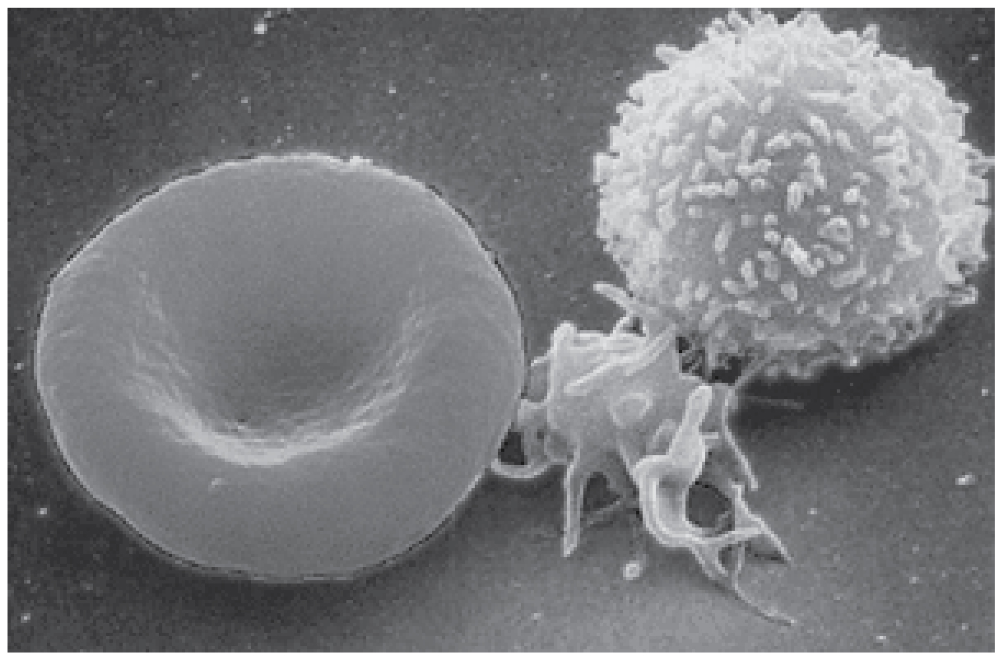

<?cnx.eoc class="summary" title="Chapter Review"?>
<?cnx.eoc class="interactive-exercise" title="Interactive Link Questions"?>
<?cnx.eoc class="multiple-choice" title="Review Questions" ?>
<?cnx.eoc class="free-response" title="Critical Thinking Questions"?>
<?cnx.eoc class=&#8221;references&#8221; title=&#8221;References&#8221;?>
{: #fig-ch19_00_01 data-media-type="image/jpg" data-title="Blood Cells "}

Chapter Objectives

After studying this chapter, you will be able to:

* Identify the primary functions of blood, its fluid and cellular
  components, and its physical characteristics
* Identify the most important proteins and other solutes present in
  blood plasma
* Describe the formation of the formed element components of blood
* Discuss the structure and function of red blood cells and hemoglobin
* Classify and characterize white blood cells
* Describe the structure of platelets and explain the process of
  hemostasis
* Explain the significance of AB and Rh blood groups in blood
  transfusions
* Discuss a variety of blood disorders

Single-celled organisms do not need blood. They obtain nutrients
directly from and excrete wastes directly into their environment. The
human organism cannot do that. Our large, complex bodies need blood to
deliver nutrients to and remove wastes from our trillions of cells. The
heart pumps blood throughout the body in a network of blood vessels.
Together, these three components—blood, heart, and vessels—makes up the
cardiovascular system. This chapter focuses on the medium of transport:
blood.

