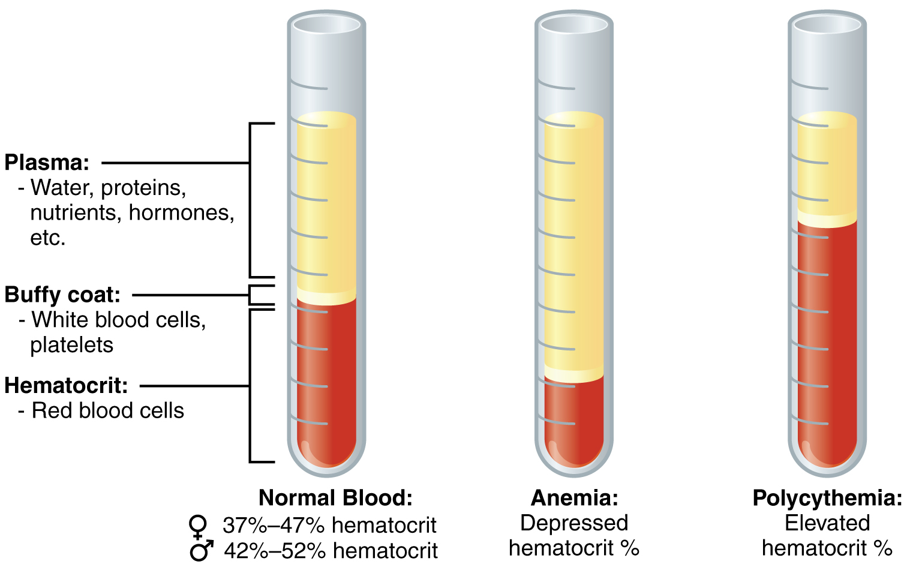
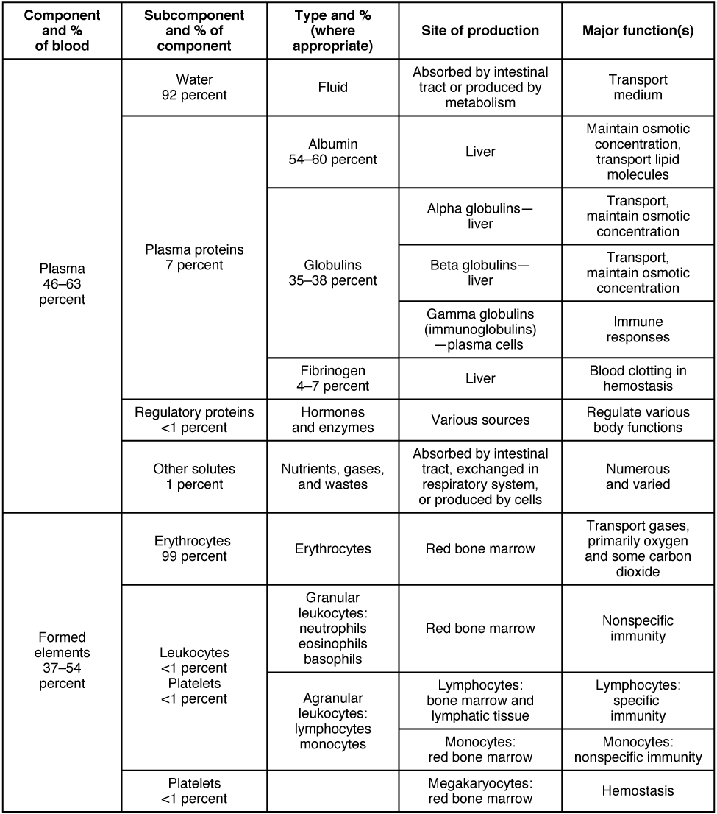

By the end of this section, you will be able to:
* Identify the primary functions of blood in transportation, defense, and maintenance of homeostasis
* Name the fluid component of blood and the three major types of formed elements, and identify their relative proportions in a blood sample
* Discuss the unique physical characteristics of blood
* Identify the composition of blood plasma, including its most important solutes and plasma proteins

Recall that **blood**{: data-type="term"} is a connective tissue. Like all connective tissues, it is made up of cellular elements and an extracellular matrix. The cellular elements—referred to as the **formed elements**{: data-type="term"}—include **red blood cells (RBCs)**{: data-type="term"}, **white blood cells (WBCs)**{: data-type="term"}, and cell fragments called **platelets**{: data-type="term"}. The extracellular matrix, called **plasma**{: data-type="term"}, makes blood unique among connective tissues because it is fluid. This fluid, which is mostly water, perpetually suspends the formed elements and enables them to circulate throughout the body within the cardiovascular system.

# Functions of Blood

The primary function of blood is to deliver oxygen and nutrients to and remove wastes from body cells, but that is only the beginning of the story. The specific functions of blood also include defense, distribution of heat, and maintenance of homeostasis.

## Transportation

Nutrients from the foods you eat are absorbed in the digestive tract. Most of these travel in the bloodstream directly to the liver, where they are processed and released back into the bloodstream for delivery to body cells. Oxygen from the air you breathe diffuses into the blood, which moves from the lungs to the heart, which then pumps it out to the rest of the body. Moreover, endocrine glands scattered throughout the body release their products, called hormones, into the bloodstream, which carries them to distant target cells. Blood also picks up cellular wastes and byproducts, and transports them to various organs for removal. For instance, blood moves carbon dioxide to the lungs for exhalation from the body, and various waste products are transported to the kidneys and liver for excretion from the body in the form of urine or bile.

## Defense

Many types of WBCs protect the body from external threats, such as disease-causing bacteria that have entered the bloodstream in a wound. Other WBCs seek out and destroy internal threats, such as cells with mutated DNA that could multiply to become cancerous, or body cells infected with viruses.

When damage to the vessels results in bleeding, blood platelets and certain proteins dissolved in the plasma, the fluid portion of the blood, interact to block the ruptured areas of the blood vessels involved. This protects the body from further blood loss.

## Maintenance of Homeostasis

Recall that body temperature is regulated via a classic negative-feedback loop. If you were exercising on a warm day, your rising core body temperature would trigger several homeostatic mechanisms, including increased transport of blood from your core to your body periphery, which is typically cooler. As blood passes through the vessels of the skin, heat would be dissipated to the environment, and the blood returning to your body core would be cooler. In contrast, on a cold day, blood is diverted away from the skin to maintain a warmer body core. In extreme cases, this may result in frostbite.

Blood also helps to maintain the chemical balance of the body. Proteins and other compounds in blood act as buffers, which thereby help to regulate the pH of body tissues. Blood also helps to regulate the water content of body cells.

# Composition of Blood

You have probably had blood drawn from a superficial vein in your arm, which was then sent to a lab for analysis. Some of the most common blood tests—for instance, those measuring lipid or glucose levels in plasma—determine which substances are present within blood and in what quantities. Other blood tests check for the composition of the blood itself, including the quantities and types of formed elements.

One such test, called a **hematocrit**{: data-type="term"}, measures the percentage of RBCs, clinically known as erythrocytes, in a blood sample. It is performed by spinning the blood sample in a specialized centrifuge, a process that causes the heavier elements suspended within the blood sample to separate from the lightweight, liquid plasma ([\[link\]](#fig-ch19_01_01)). Because the heaviest elements in blood are the erythrocytes, these settle at the very bottom of the hematocrit tube. Located above the erythrocytes is a pale, thin layer composed of the remaining formed elements of blood. These are the WBCs, clinically known as leukocytes, and the platelets, cell fragments also called thrombocytes. This layer is referred to as the **buffy coat**{: data-type="term"} because of its color; it normally constitutes less than 1 percent of a blood sample. Above the buffy coat is the blood plasma, normally a pale, straw-colored fluid, which constitutes the remainder of the sample.

The volume of erythrocytes after centrifugation is also commonly referred to as **packed cell volume (PCV)**{: data-type="term"}. In normal blood, about 45 percent of a sample is erythrocytes. The hematocrit of any one sample can vary significantly, however, about 36–50 percent, according to gender and other factors. Normal hematocrit values for females range from 37 to 47, with a mean value of 41; for males, hematocrit ranges from 42 to 52, with a mean of 47. The percentage of other formed elements, the WBCs and platelets, is extremely small so it is not normally considered with the hematocrit. So the mean plasma percentage is the percent of blood that is not erythrocytes: for females, it is approximately 59 (or 100 minus 41), and for males, it is approximately 53 (or 100 minus 47).

 {: #fig-ch19_01_01 data-title="Composition of Blood "}

# Characteristics of Blood

When you think about blood, the first characteristic that probably comes to mind is its color. Blood that has just taken up oxygen in the lungs is bright red, and blood that has released oxygen in the tissues is a more dusky red. This is because hemoglobin is a pigment that changes color, depending upon the degree of oxygen saturation.

Blood is viscous and somewhat sticky to the touch. It has a viscosity approximately five times greater than water. Viscosity is a measure of a fluid’s thickness or resistance to flow, and is influenced by the presence of the plasma proteins and formed elements within the blood. The viscosity of blood has a dramatic impact on blood pressure and flow. Consider the difference in flow between water and honey. The more viscous honey would demonstrate a greater resistance to flow than the less viscous water. The same principle applies to blood.

The normal temperature of blood is slightly higher than normal body temperature—about 38 °C (or 100.4 °F), compared to 37 °C (or 98.6 °F) for an internal body temperature reading, although daily variations of 0.5 °C are normal. Although the surface of blood vessels is relatively smooth, as blood flows through them, it experiences some friction and resistance, especially as vessels age and lose their elasticity, thereby producing heat. This accounts for its slightly higher temperature.

The pH of blood averages about 7.4; however, it can range from 7.35 to 7.45 in a healthy person. Blood is therefore somewhat more basic (alkaline) on a chemical scale than pure water, which has a pH of 7.0. Blood contains numerous buffers that actually help to regulate pH.

Blood constitutes approximately 8 percent of adult body weight. Adult males typically average about 5 to 6 liters of blood. Females average 4–5 liters.

# Blood Plasma

Like other fluids in the body, plasma is composed primarily of water: In fact, it is about 92 percent water. Dissolved or suspended within this water is a mixture of substances, most of which are proteins. There are literally hundreds of substances dissolved or suspended in the plasma, although many of them are found only in very small quantities.

  
Visit this [site][1] for a list of normal levels established for many of the substances found in a sample of blood. Serum, one of the specimen types included, refers to a sample of plasma after clotting factors have been removed. What types of measurements are given for levels of glucose in the blood?

## Plasma Proteins

About 7 percent of the volume of plasma—nearly all that is not water—is made of proteins. These include several plasma proteins (proteins that are unique to the plasma), plus a much smaller number of regulatory proteins, including enzymes and some hormones. The major components of plasma are summarized in [\[link\]](#fig-ch19_01_02).

The three major groups of plasma proteins are as follows:

* **Albumin**{: data-type="term"} is the most abundant of the plasma proteins. Manufactured by the liver, albumin molecules serve as binding proteins—transport vehicles for fatty acids and steroid hormones. Recall that lipids are hydrophobic; however, their binding to albumin enables their transport in the watery plasma. Albumin is also the most significant contributor to the osmotic pressure of blood; that is, its presence holds water inside the blood vessels and draws water from the tissues, across blood vessel walls, and into the bloodstream. This in turn helps to maintain both blood volume and blood pressure. Albumin normally accounts for approximately 54 percent of the total plasma protein content, in clinical levels of 3.5–5.0 g/dL blood.
* The second most common plasma proteins are the **globulins**{: data-type="term"}. A heterogeneous group, there are three main subgroups known as alpha, beta, and gamma globulins. The alpha and beta globulins transport iron, lipids, and the fat-soluble vitamins A, D, E, and K to the cells; like albumin, they also contribute to osmotic pressure. The gamma globulins are proteins involved in immunity and are better known as an **antibodies**{: data-type="term"} or **immunoglobulins**{: data-type="term"}. Although other plasma proteins are produced by the liver, immunoglobulins are produced by specialized leukocytes known as plasma cells. (Seek additional content for more information about immunoglobulins.) Globulins make up approximately 38 percent of the total plasma protein volume, in clinical levels of 1.0–1.5 g/dL blood.
* The least abundant plasma protein is **fibrinogen**{: data-type="term"}. Like albumin and the alpha and beta globulins, fibrinogen is produced by the liver. It is essential for blood clotting, a process described later in this chapter. Fibrinogen accounts for about 7 percent of the total plasma protein volume, in clinical levels of 0.2–0.45 g/dL blood.

## Other Plasma Solutes

In addition to proteins, plasma contains a wide variety of other substances. These include various electrolytes, such as sodium, potassium, and calcium ions; dissolved gases, such as oxygen, carbon dioxide, and nitrogen; various organic nutrients, such as vitamins, lipids, glucose, and amino acids; and metabolic wastes. All of these nonprotein solutes combined contribute approximately 1 percent to the total volume of plasma.

 {: #fig-ch19_01_02 data-title="Major Blood Components "}

Career Connection

Phlebotomy and Medical Lab TechnologyPhlebotomists are professionals trained to draw blood (phleb- = “a blood vessel”; -tomy = “to cut”). When more than a few drops of blood are required, phlebotomists perform a venipuncture, typically of a surface vein in the arm. They perform a capillary stick on a finger, an earlobe, or the heel of an infant when only a small quantity of blood is required. An arterial stick is collected from an artery and used to analyze blood gases. After collection, the blood may be analyzed by medical laboratories or perhaps used for transfusions, donations, or research. While many allied health professionals practice phlebotomy, the American Society of Phlebotomy Technicians issues certificates to individuals passing a national examination, and some large labs and hospitals hire individuals expressly for their skill in phlebotomy.

Medical or clinical laboratories employ a variety of individuals in technical positions:

* Medical technologists (MT), also known as clinical laboratory technologists (CLT), typically hold a bachelor’s degree and certification from an accredited training program. They perform a wide variety of tests on various body fluids, including blood. The information they provide is essential to the primary care providers in determining a diagnosis and in monitoring the course of a disease and response to treatment.
* Medical laboratory technicians (MLT) typically have an associate’s degree but may perform duties similar to those of an MT.
* Medical laboratory assistants (MLA) spend the majority of their time processing samples and carrying out routine assignments within the lab. Clinical training is required, but a degree may not be essential to obtaining a position.

# Chapter Review

Blood is a fluid connective tissue critical to the transportation of nutrients, gases, and wastes throughout the body; to defend the body against infection and other threats; and to the homeostatic regulation of pH, temperature, and other internal conditions. Blood is composed of formed elements—erythrocytes, leukocytes, and cell fragments called platelets—and a fluid extracellular matrix called plasma. More than 90 percent of plasma is water. The remainder is mostly plasma proteins—mainly albumin, globulins, and fibrinogen—and other dissolved solutes such as glucose, lipids, electrolytes, and dissolved gases. Because of the formed elements and the plasma proteins and other solutes, blood is sticky and more viscous than water. It is also slightly alkaline, and its temperature is slightly higher than normal body temperature.

# Interactive Link Questions

Visit this [site][1] for a list of normal levels established for many of the substances found in a sample of blood. Serum, one of the specimen types included, refers to a sample of plasma after clotting factors have been removed. What types of measurements are given for levels of glucose in the blood?

There are values given for percent saturation, tension, and blood gas, and there are listings for different types of hemoglobin.

# Review Questions

Which of the following statements about blood is true?

1.  Blood is about 92 percent water.
2.  Blood is slightly more acidic than water.
3.  Blood is slightly more viscous than water.
4.  Blood is slightly more salty than seawater.
{: data-number-style="lower-alpha"}

C

Which of the following statements about albumin is true?

1.  It draws water out of the blood vessels and into the body’s tissues.
2.  It is the most abundant plasma protein.
3.  It is produced by specialized leukocytes called plasma cells.
4.  All of the above are true.
{: data-number-style="lower-alpha"}

B

Which of the following plasma proteins is <em>not </em>produced by the liver?

1.  fibrinogen
2.  alpha globulin
3.  beta globulin
4.  immunoglobulin
{: data-number-style="lower-alpha"}

D

# Critical Thinking Questions

A patient’s hematocrit is 42 percent. Approximately what percentage of the patient’s blood is plasma?

The patient’s blood is approximately 58 percent plasma (since the buffy coat is less than 1 percent).

Why would it be incorrect to refer to the formed elements as cells?

The formed elements include erythrocytes and leukocytes, which are cells (although mature erythrocytes do not have a nucleus); however, the formed elements also include platelets, which are not true cells but cell fragments.

True or false: The buffy coat is the portion of a blood sample that is made up of its proteins.

False. The buffy coat is the portion of blood that is made up of its leukocytes and platelets.

## Glossary
{: data-type="glossary-title"}

albumin
: most abundant plasma protein, accounting for most of the osmotic pressure of plasma
{: .definition}

antibodies
: (also, immunoglobulins or gamma globulins) antigen-specific proteins produced by specialized B lymphocytes that protect the body by binding to foreign objects such as bacteria and viruses
{: .definition}

blood
: liquid connective tissue composed of formed elements—erythrocytes, leukocytes, and platelets—and a fluid extracellular matrix called plasma; component of the cardiovascular system
{: .definition}

buffy coat
: thin, pale layer of leukocytes and platelets that separates the erythrocytes from the plasma in a sample of centrifuged blood
{: .definition}

fibrinogen
: plasma protein produced in the liver and involved in blood clotting
{: .definition}

formed elements
: cellular components of blood; that is, erythrocytes, leukocytes, and platelets
{: .definition}

globulins
: heterogeneous group of plasma proteins that includes transport proteins, clotting factors, immune proteins, and others
{: .definition}

hematocrit
: (also, packed cell volume) volume percentage of erythrocytes in a sample of centrifuged blood
{: .definition}

immunoglobulins
: (also, antibodies or gamma globulins) antigen-specific proteins produced by specialized B lymphocytes that protect the body by binding to foreign objects such as bacteria and viruses
{: .definition}

packed cell volume (PCV)
: (also, hematocrit) volume percentage of erythrocytes present in a sample of centrifuged blood
{: .definition}

plasma
: in blood, the liquid extracellular matrix composed mostly of water that circulates the formed elements and dissolved materials throughout the cardiovascular system
{: .definition}

platelets
: (also, thrombocytes) one of the formed elements of blood that consists of cell fragments broken off from megakaryocytes
{: .definition}

red blood cells (RBCs)
: (also, erythrocytes) one of the formed elements of blood that transports oxygen
{: .definition}

white blood cells (WBCs)
: (also, leukocytes) one of the formed elements of blood that provides defense against disease agents and foreign materials
{: .definition}

[1]: http://openstaxcollege.org/l/normallevels
