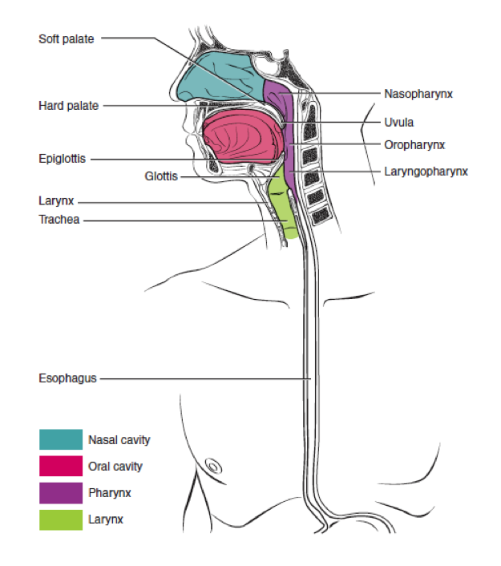

Human Anatomy and Physiology is designed for the two-semester anatomy and physiology course taken by life science and allied health students. The textbook follows the scope and sequence of most Human Anatomy and Physiology courses, and its coverage and organization were informed by hundreds of instructors who teach the course. Instructors can customize the book, adapting it to the approach that works best in their classroom. The artwork for this textbook is aimed focusing student learning through a powerful blend of traditional depictions and instructional innovations. Color is used sparingly, to emphasize the most important aspects of any given illustration. Significant use of micrographs from the University of Michigan complement the illustrations, and provide the students with a meaningful alternate depiction of each concept. Finally, enrichment elements provide relevance and deeper context for students, particularly in the areas of health, disease, and information relevant to their intended careers.

Welcome to *Anatomy and Physiology*, an OpenStax resource. We created this textbook with several goals in mind: accessibility, customization, and student engagement—helping students reach high levels of academic scholarship. Instructors and students alike will find that this textbook offers a thorough introduction to the content in an accessible format.

# About OpenStax   {#eip-7}

OpenStax is a nonprofit organization committed to improving student access to quality learning materials. Our free textbooks are developed and peer-reviewed by educators to ensure that they are readable, accurate, and organized in accordance with the scope and sequence requirements of today’s college courses. Unlike traditional textbooks, OpenStax resources live online and are owned by the community of educators using them. Through partnerships with companies and foundations committed to reducing costs for students, we are working to improve access to higher education for all. OpenStax is an initiative of Rice University and is made possible through the generous support of several philanthropic foundations.

# About OpenStax’s Resources   {#eip-374}

OpenStax resources provide quality academic instruction. Three key features set our materials apart from others: 1) They can be easily customized by instructors for each class, 2) they are “living” resources that grow online through contributions from science educators, and 3) they are available for free or for a minimal cost.

## Customization   {#eip-262}

OpenStax learning resources are conceived and written with flexibility in mind so that they can be customized for each course. Our textbooks provide a solid foundation on which instructors can build their own texts. Instructors can select the sections that are most relevant to their curricula and create a textbook that speaks directly to the needs of their students. Instructors are encouraged to expand on existing examples in the text by adding unique context via geographically localized applications and topical connections.

*Anatomy and Physiology* can be easily customized using our online platform (https://openstaxcollege.org/textbooks/anatomy-and-physiology/adapt). The text is arranged in a modular chapter format. Simply select the content most relevant to your syllabus and create a textbook that addresses the needs of your class. This customization feature will ensure that your textbook reflects the goals of your course.

## Curation   {#eip-185}

To broaden access and encourage community curation, *Anatomy and Physiology* is “open source” under a Creative Commons Attribution (CC BY) license. Members of the scientific community are invited to submit examples, emerging research, and other feedback to enhance and strengthen the material, keeping it current and relevant for today’s students. You can submit your suggestions to info@openstaxcollege.org.

## Cost   {#eip-326}

Our textbooks are available for free online, and in low-cost print and tablet editions.

# About *Anatomy and Physiology*   {#eip-394}

*Anatomy and Physiology* is designed for the two-semester anatomy and physiology course taken by life science and allied health students. It supports effective teaching and learning, and prepares students for further learning and future careers. The text focuses on the most important concepts and aims to minimize distracting students with more minor details.

The development choices for this textbook were made with the guidance of hundreds of faculty who are deeply involved in teaching this course. These choices led to innovations in art, terminology, career orientation, practical applications, and multimedia-based learning, all with a goal of increasing relevance to students. We strove to make the discipline meaningful and memorable to students, so that they can draw from it a working knowledge that will enrich their future studies.

## Coverage and Scope   {#eip-29}

The units of our *Anatomy and Physiology* textbook adhere to the scope and sequence followed by most two-semester courses nationwide.

### Unit 1: Levels of Organization    {#eip-217}

Chapters 1–4 provide students with a basic understanding of human anatomy and physiology, including its language, the levels of organization, and the basics of chemistry and cell biology. These chapters provide a foundation for the further study of the body. They also focus particularly on how the body’s regions, important chemicals, and cells maintain homeostasis.* * *
{: data-type="newline"}

 Chapter 1 An Introduction to the Human Body* * *
{: data-type="newline"}

 Chapter 2 The Chemical Level of Organization* * *
{: data-type="newline"}

 Chapter 3 The Cellular Level of Organization* * *
{: data-type="newline"}

 Chapter 4 The Tissue Level of Organization* * *
{: data-type="newline"}

### Unit 2: Support and Movement    {#eip-146}

In Chapters 5–11, students explore the skin, the largest organ of the body, and examine the body’s skeletal and muscular systems, following a traditional sequence of topics. This unit is the first to walk students through specific systems of the body, and as it does so, it maintains a focus on homeostasis as well as those diseases and conditions that can disrupt it.* * *
{: data-type="newline"}

 Chapter 5 The Integumentary System* * *
{: data-type="newline"}

 Chapter 6 Bone and Skeletal Tissue* * *
{: data-type="newline"}

 Chapter 7 The Axial Skeleton* * *
{: data-type="newline"}

 Chapter 8 The Appendicular Skeleton* * *
{: data-type="newline"}

 Chapter 9 Joints* * *
{: data-type="newline"}

 Chapter 10 Muscle Tissue* * *
{: data-type="newline"}

 Chapter 11 The Muscular System* * *
{: data-type="newline"}

### Unit 3: Regulation, Integration, and Control   {#eip-114}

Chapters 12–17 help students answer questions about nervous and endocrine system control and regulation. In a break with the traditional sequence of topics, the special senses are integrated into the chapter on the somatic nervous system. The chapter on the neurological examination offers students a unique approach to understanding nervous system function using five simple but powerful diagnostic tests. * * *
{: data-type="newline"}

 Chapter 12 Introduction to the Nervous System* * *
{: data-type="newline"}

 Chapter 13 The Anatomy of the Nervous System* * *
{: data-type="newline"}

 Chapter 14 The Somatic Nervous System* * *
{: data-type="newline"}

 Chapter 15 The Autonomic Nervous System* * *
{: data-type="newline"}

 Chapter 16 The Neurological Exam* * *
{: data-type="newline"}

 Chapter 17 The Endocrine System* * *
{: data-type="newline"}

### Unit 4: Fluids and Transport    {#eip-708}

In Chapters 18–21, students examine the principal means of transport for materials needed to support the human body, regulate its internal environment, and provide protection. * * *
{: data-type="newline"}

 Chapter 18 Blood* * *
{: data-type="newline"}

 Chapter 19 The Cardiovascular System: The Heart* * *
{: data-type="newline"}

 Chapter 20 The Cardiovascular System: Blood Vessels and Circulation* * *
{: data-type="newline"}

 Chapter 21 The Lymphatic System and Immunity

### Unit 5: Energy, Maintenance, and Environmental Exchange   {#eip-942}

In Chapters 22–26, students discover the interaction between body systems and the outside environment for the exchange of materials, the capture of energy, the release of waste, and the overall maintenance of the internal systems that regulate the exchange. The explanations and illustrations are particularly focused on how structure relates to function. * * *
{: data-type="newline"}

 Chapter 22 The Respiratory System* * *
{: data-type="newline"}

 Chapter 23 The Digestive System* * *
{: data-type="newline"}

 Chapter 24 Nutrition and Metabolism* * *
{: data-type="newline"}

 Chapter 25 The Urinary System* * *
{: data-type="newline"}

 Chapter 26 Fluid, Electrolyte, and Acid–Base Balance* * *
{: data-type="newline"}

### Unit 6: Human Development and the Continuity of Life   {#eip-314}

The closing chapters examine the male and female reproductive systems, describe the process of human development and the different stages of pregnancy, and end with a review of the mechanisms of inheritance. * * *
{: data-type="newline"}

 Chapter 27 The Reproductive System* * *
{: data-type="newline"}

 Chapter 28 Development and Genetic Inheritance* * *
{: data-type="newline"}

## Pedagogical Foundation and Features   {#eip-450}

*Anatomy and Physiology* is designed to promote scientific literacy. Throughout the text, you will find features that engage the students by taking selected topics a step further.

* **Homeostatic Imbalances** discusses the effects and results of imbalances in the body.
* **Disorders** showcases a disorder that is relevant to the body system at hand. This feature may focus on a specific disorder, or a set of related disorders.
* **Diseases** showcases a disease that is relevant to the body system at hand.
* **Aging** explores the effect aging has on a body’s system and specific disorders that manifest over time.
* **Career Connections** presents information on the various careers often pursued by allied health students, such as medical technician, medical examiner, and neurophysiologist. Students are introduced to the educational requirements for and day-to-day responsibilities in these careers.
* **Everyday Connections** tie anatomical and physiological concepts to emerging issues and discuss these in terms of everyday life. Topics include “Anabolic Steroids” and “The Effect of Second-Hand Tobacco Smoke.”
* **Interactive Links** direct students to online exercises, simulations, animations, and videos to add a fuller context to core content and help improve understanding of the material. Many features include links to the University of Michigan’s interactive WebScopes, which allow students to zoom in on micrographs in the collection. These resources were vetted by reviewers and other subject matter experts to ensure that they are effective and accurate. We strongly urge students to explore these links, whether viewing a video or inputting data into a simulation, to gain the fullest experience and to learn how to search for information independently.

## Dynamic, Learner-Centered Art   {#eip-72}

Our unique approach to visuals is designed to emphasize only the components most important in any given illustration. The art style is particularly aimed at focusing student learning through a powerful blend of traditional depictions and instructional innovations.

Much of the art in this book consists of black line illustrations. The strongest line is used to highlight the most important structures, and shading is used to show dimension and shape. Color is used sparingly to highlight and clarify the primary anatomical or functional point of the illustration. This technique is intended to draw students’ attention to the critical learning point in the illustration, without distraction from excessive gradients, shadows, and highlights. Full color is used when the structure or process requires it (for example, muscle diagrams and cardiovascular system illustrations). {: #eip-id1169396666468 data-title="The Pharynx"}

### Micrographs   {#eip-817}

Micrograph magnifications have been calculated based on the objective provided with the image. If a micrograph was recorded at 40×, and the image was magnified an additional 2×, we calculated the final magnification of the micrograph to be 80×.

Please note that, when viewing the textbook electronically, the micrograph magnification provided in the text does not take into account the size and magnification of the screen on your electronic device. There may be some variation. "){: #eip-id1164925497177 data-title="Sebaceous Glands"}

### Learning Resources   {#eip-921}

The following resources are (or will be) available in addition to main text:

* PowerPoint slides: For each chapter, the illustrations are presented, one per slide, with their respective captions.
* Pronunciation guide: A subset of the text’s key terms are presented with easy-to-follow phonetic transcriptions. For example, blastocyst is rendered as “blas\'to-sist”

# About Our Team   {#eip-228}

## Senior Contributing Authors   {#eip-396}

J. Gordon Betts, Tyler Junior College* * *
{: data-type="newline"}

 Peter Desaix, University of North Carolina at Chapel Hill* * *
{: data-type="newline"}

 Eddie Johnson, Central Oregon Community College* * *
{: data-type="newline"}

 Jody E. Johnson, Arapahoe Community College* * *
{: data-type="newline"}

 Oksana Korol, Aims Community College* * *
{: data-type="newline"}

 Dean Kruse, Portland Community College* * *
{: data-type="newline"}

 Brandon Poe, Springfield Technical Community College* * *
{: data-type="newline"}

 James A. Wise, Hampton University* * *
{: data-type="newline"}

 Mark Womble, Youngstown State University* * *
{: data-type="newline"}

 Kelly A. Young, California State University, Long Beach

## Advisor   {#eip-683}

Robin J. Heyden

## Contributing Authors   {#eip-11}

Kim Aaronson, Aquarius Institute; Triton College* * *
{: data-type="newline"}

 Lopamudra Agarwal, Augusta Technical College* * *
{: data-type="newline"}

 Gary Allen, Dalhousie University* * *
{: data-type="newline"}

 Robert Allison, McLennan Community College* * *
{: data-type="newline"}

 Heather Armbruster, Southern Union State Community College* * *
{: data-type="newline"}

 Timothy Ballard, University of North Carolina Wilmington* * *
{: data-type="newline"}

 Matthew Barlow, Eastern New Mexico University* * *
{: data-type="newline"}

 William Blaker, Furman University* * *
{: data-type="newline"}

 Julie Bowers, East Tennessee State University* * *
{: data-type="newline"}

 Emily Bradshaw, Florida Southern College* * *
{: data-type="newline"}

 Nishi Bryska, University of North Carolina, Charlotte* * *
{: data-type="newline"}

 Susan Caley Opsal, Illinois Valley Community College* * *
{: data-type="newline"}

 Boyd Campbell, Southwest College of Naturopathic Medicine and Health Sciences* * *
{: data-type="newline"}

 Ann Caplea, Walsh University* * *
{: data-type="newline"}

 Marnie Chapman, University of Alaska, Sitka* * *
{: data-type="newline"}

 Barbara Christie-Pope, Cornell College* * *
{: data-type="newline"}

 Kenneth Crane, Texarkana College* * *
{: data-type="newline"}

 Maurice Culver, Florida State College at Jacksonville* * *
{: data-type="newline"}

 Heather Cushman, Tacoma Community College* * *
{: data-type="newline"}

 Noelle Cutter, Molloy College* * *
{: data-type="newline"}

 Lynnette Danzl-Tauer, Rock Valley College* * *
{: data-type="newline"}

 Jane Davis, Aurora University* * *
{: data-type="newline"}

 AnnMarie DelliPizzi, Dominican College* * *
{: data-type="newline"}

 Susan Dentel, Washtenaw Community College* * *
{: data-type="newline"}

 Pamela Dobbins, Shelton State Community College* * *
{: data-type="newline"}

 Patty Dolan, Pacific Lutheran University* * *
{: data-type="newline"}

 Sondra Dubowsky, McLennan Community College* * *
{: data-type="newline"}

 Peter Dukehart, Three Rivers Community College* * *
{: data-type="newline"}

 Ellen DuPré, Central College* * *
{: data-type="newline"}

 Elizabeth DuPriest, Warner Pacific College* * *
{: data-type="newline"}

 Pam Elf, University of Minnesota* * *
{: data-type="newline"}

 Sharon Ellerton, Queensborough Community College* * *
{: data-type="newline"}

 Carla Endres, Utah State University - College of Eastern Utah: San Juan Campus* * *
{: data-type="newline"}

 Myriam Feldman, Lake Washington Institute of Technology; Cascadia Community College* * *
{: data-type="newline"}

 Greg Fitch, Avila University* * *
{: data-type="newline"}

 Lynn Gargan, Tarant County College* * *
{: data-type="newline"}

 Michael Giangrande, Oakland Community College* * *
{: data-type="newline"}

 Chaya Gopalan, St. Louis College of Pharmacy* * *
{: data-type="newline"}

 Victor Greco, Chattahoochee Technical College* * *
{: data-type="newline"}

 Susanna Heinze, Skagit Valley College* * *
{: data-type="newline"}

 Ann Henninger, Wartburg College* * *
{: data-type="newline"}

 Dale Horeth, Tidewater Community College* * *
{: data-type="newline"}

 Michael Hortsch, University of Michigan* * *
{: data-type="newline"}

 Rosemary Hubbard, Marymount University* * *
{: data-type="newline"}

 Mark Hubley, Prince George\'s Community College* * *
{: data-type="newline"}

 Branko Jablanovic, College of Lake County* * *
{: data-type="newline"}

 Norman Johnson, University of Massachusetts Amherst* * *
{: data-type="newline"}

 Mark Jonasson, North Arkansas College* * *
{: data-type="newline"}

 Jeff Keyte, College of Saint Mary* * *
{: data-type="newline"}

 William Kleinelp, Middlesex County College* * *
{: data-type="newline"}

 Leigh Kleinert, Grand Rapids Community College* * *
{: data-type="newline"}

 Brenda Leady, University of Toledo* * *
{: data-type="newline"}

 John Lepri, University of North Carolina, Greensboro* * *
{: data-type="newline"}

 Sarah Leupen, University of Maryland, Baltimore County* * *
{: data-type="newline"}

 Lihua Liang, Johns Hopkins University* * *
{: data-type="newline"}

 Robert Mallet, University of North Texas Health Science Center* * *
{: data-type="newline"}

 Bruce Maring, Daytona State College* * *
{: data-type="newline"}

 Elisabeth Martin, College of Lake County* * *
{: data-type="newline"}

 Natalie Maxwell, Carl Albert State College, Sallisaw* * *
{: data-type="newline"}

 Julie May, William Carey University* * *
{: data-type="newline"}

 Debra McLaughlin, University of Maryland University College* * *
{: data-type="newline"}

 Nicholas Mitchell, St. Bonaventure University* * *
{: data-type="newline"}

 Shobhana Natarajan, Brookhaven College* * *
{: data-type="newline"}

 Phillip Nicotera, St. Petersburg College* * *
{: data-type="newline"}

 Mary Jane Niles, University of San Francisco* * *
{: data-type="newline"}

 Ikemefuna Nwosu, Parkland College; Lake Land College* * *
{: data-type="newline"}

 Betsy Ott, Tyler Junior College* * *
{: data-type="newline"}

 Ivan Paul, John Wood Community College* * *
{: data-type="newline"}

 Aaron Payette, College of Southern Nevada* * *
{: data-type="newline"}

 Scott Payne, Kentucky Wesleyan College* * *
{: data-type="newline"}

 Cameron Perkins, South Georgia College* * *
{: data-type="newline"}

 David Pfeiffer, University of Alaska, Anchorage* * *
{: data-type="newline"}

 Thomas Pilat, Illinois Central College* * *
{: data-type="newline"}

 Eileen Preston, Tarrant County College* * *
{: data-type="newline"}

 Mike Pyle, Olivet Nazarene University* * *
{: data-type="newline"}

 Robert Rawding, Gannon University* * *
{: data-type="newline"}

 Jason Schreer, State University of New York at Potsdam* * *
{: data-type="newline"}

 Laird Sheldahl, Mt. Hood Community College* * *
{: data-type="newline"}

 Brian Shmaefsky, Lone Star College System* * *
{: data-type="newline"}

 Douglas Sizemore, Bevill State Community College* * *
{: data-type="newline"}

 Susan Spencer, Mount Hood Community College* * *
{: data-type="newline"}

 Cynthia Standley, University of Arizona* * *
{: data-type="newline"}

 Robert Sullivan, Marist College* * *
{: data-type="newline"}

 Eric Sun, Middle Georgia State College* * *
{: data-type="newline"}

 Tom Swenson, Ithaca College* * *
{: data-type="newline"}

 Kathleen Tallman, Azusa Pacific University* * *
{: data-type="newline"}

 Rohinton Tarapore, University of Pennsylvania* * *
{: data-type="newline"}

 Elizabeth Tattersall, Western Nevada College* * *
{: data-type="newline"}

 Mark Thomas, University of Northern Colorado* * *
{: data-type="newline"}

 Janis Thompson, Lorain County Community College* * *
{: data-type="newline"}

 Rita Thrasher, Pensacola State College* * *
{: data-type="newline"}

 David Van Wylen, St. Olaf College* * *
{: data-type="newline"}

 Lynn Wandrey, Mott Community College* * *
{: data-type="newline"}

 Margaret Weck, St. Louis College of Pharmacy* * *
{: data-type="newline"}

 Kathleen Weiss, George Fox University* * *
{: data-type="newline"}

 Neil Westergaard, Williston State College* * *
{: data-type="newline"}

 David Wortham, West Georgia Technical College* * *
{: data-type="newline"}

 Umesh Yadav, University of Texas Medical Branch* * *
{: data-type="newline"}

 Tony Yates, Oklahoma Baptist University* * *
{: data-type="newline"}

 Justin York, Glendale Community College* * *
{: data-type="newline"}

 Cheri Zao, North Idaho College* * *
{: data-type="newline"}

 Elena Zoubina, Bridgewater State University; Massasoit Community College* * *
{: data-type="newline"}

 Shobhana Natarajan, Alcon Laboratories, Inc.

# Special Thanks   {#eip-321}

OpenStax wishes to thank the Regents of University of Michigan Medical School for the use of their extensive micrograph collection. Many of the UM micrographs that appear in *Anatomy and Physiology* are interactive WebScopes, which students can explore by zooming in and out.

We also wish to thank the Open Learning Initiative at Carnegie Mellon University, with whom we shared and exchanged resources during the development of *Anatomy and Physiology*.

